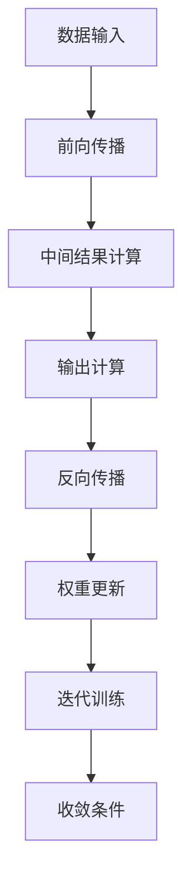

                 

## 华为2024校招AI芯片设计工程师面试指南

### 关键词： 
AI芯片设计、华为校招、面试指南、算法原理、数学模型、实战案例

### 摘要： 
本文旨在为有意向参与华为2024校招AI芯片设计工程师岗位的读者提供一份详细的面试指南。我们将从背景介绍、核心概念、算法原理、数学模型、项目实战、实际应用场景等多个方面进行深入讲解，帮助读者更好地理解AI芯片设计领域的关键知识点，为面试做好充分准备。

## 1. 背景介绍

### 1.1 目的和范围

本文旨在为即将参加华为2024校招AI芯片设计工程师岗位的应聘者提供一份全面的面试指南。通过本文，读者可以了解AI芯片设计的基础知识、核心算法原理、数学模型以及实际应用场景，从而为面试做好充分准备。文章将涵盖以下几个方面：

- **AI芯片设计的基本概念和原理**：介绍AI芯片的基本概念，包括其定义、分类、工作原理等。
- **核心算法原理与操作步骤**：讲解AI芯片设计中的关键算法原理，并提供具体的操作步骤和伪代码。
- **数学模型和公式**：详细介绍AI芯片设计中所涉及的数学模型和公式，并进行举例说明。
- **项目实战**：通过实际代码案例，展示AI芯片设计的具体实现过程。
- **实际应用场景**：探讨AI芯片在不同领域的应用场景，以及其对产业发展的影响。
- **工具和资源推荐**：推荐一些学习资源、开发工具和经典论文，帮助读者深入了解AI芯片设计领域。
- **未来发展趋势与挑战**：分析AI芯片设计领域的未来发展趋势和面临的挑战。

### 1.2 预期读者

本文主要面向以下几类读者：

- **计算机科学专业本科生和研究生**：希望了解AI芯片设计领域的基本概念和原理，为未来就业和学术研究做准备。
- **嵌入式系统和芯片设计工程师**：希望在现有技术基础上拓展AI芯片设计相关技能，提升职业竞争力。
- **对AI芯片设计感兴趣的技术爱好者**：希望了解AI芯片设计的基本知识和应用场景，深入了解该领域的最新发展动态。

### 1.3 文档结构概述

本文将按照以下结构进行组织：

- **1. 背景介绍**：介绍本文的目的、范围、预期读者和文档结构。
- **2. 核心概念与联系**：讲解AI芯片设计中的核心概念和原理，并提供Mermaid流程图。
- **3. 核心算法原理与具体操作步骤**：介绍AI芯片设计中的关键算法原理，并提供伪代码。
- **4. 数学模型和公式**：详细讲解AI芯片设计中的数学模型和公式，并进行举例说明。
- **5. 项目实战**：通过实际代码案例展示AI芯片设计的具体实现过程。
- **6. 实际应用场景**：探讨AI芯片在不同领域的应用场景，以及其对产业发展的影响。
- **7. 工具和资源推荐**：推荐学习资源、开发工具和经典论文。
- **8. 总结：未来发展趋势与挑战**：分析AI芯片设计领域的未来发展趋势和挑战。
- **9. 附录：常见问题与解答**：解答读者可能遇到的常见问题。
- **10. 扩展阅读与参考资料**：提供更多相关资料供读者进一步学习。

### 1.4 术语表

#### 1.4.1 核心术语定义

- **AI芯片**：一种专门为人工智能（AI）应用设计的芯片，具有高度并行计算能力，可以加速深度学习算法的执行。
- **神经网络**：一种模拟人脑神经元连接方式的计算模型，用于处理和分析数据。
- **深度学习**：一种基于神经网络的学习方法，可以自动提取数据中的特征，并用于分类、预测等任务。
- **计算机架构**：计算机系统的组织结构和运行方式，包括硬件和软件的组成。

#### 1.4.2 相关概念解释

- **芯片设计**：设计并制造集成电路芯片的过程，包括硬件描述语言（HDL）编程、电路仿真、布局布线等步骤。
- **并行计算**：一种计算方式，通过同时处理多个任务来提高计算效率。
- **硬件加速**：通过硬件设备来提高算法的执行速度，相对于纯软件实现具有更高的性能。

#### 1.4.3 缩略词列表

- **AI**：人工智能（Artificial Intelligence）
- **GPU**：图形处理单元（Graphics Processing Unit）
- **FPGA**：现场可编程门阵列（Field-Programmable Gate Array）
- **HDL**：硬件描述语言（Hardware Description Language）

## 2. 核心概念与联系

在本章节中，我们将详细介绍AI芯片设计中的核心概念和原理，并使用Mermaid流程图来展示其工作流程。

### 2.1 AI芯片定义与分类

#### AI芯片定义

AI芯片，也称为神经形态芯片或专用人工智能芯片，是一种专门为人工智能（AI）应用设计的集成电路芯片。与传统的通用处理器（如CPU和GPU）相比，AI芯片具有高度并行计算能力，可以加速深度学习算法的执行。

#### AI芯片分类

AI芯片可以根据不同的分类标准进行分类：

- **根据功能**：可以分为通用AI芯片和专用AI芯片。通用AI芯片适用于多种AI算法和应用，如GPU和FPGA；专用AI芯片则针对特定AI算法或应用进行优化，如谷歌的TPU和英伟达的DPU。
- **根据架构**：可以分为基于传统架构的AI芯片和基于神经形态计算架构的AI芯片。传统架构的AI芯片采用类似CPU和GPU的架构，而神经形态计算架构的AI芯片模拟人脑神经元和工作方式，具有更强的适应性和学习能力。

### 2.2 AI芯片工作原理

AI芯片的工作原理主要基于深度学习算法和神经网络。深度学习算法通过训练大量数据，自动提取数据中的特征，并用于分类、预测等任务。神经网络是一种模拟人脑神经元连接方式的计算模型，可以处理和分析数据。

#### AI芯片工作流程

1. **数据输入**：将训练数据输入到AI芯片中。
2. **前向传播**：将输入数据通过神经网络的前向传播过程进行计算，得到中间结果和输出。
3. **反向传播**：根据损失函数，通过反向传播算法更新神经网络中的权重和偏置。
4. **迭代训练**：重复前向传播和反向传播过程，直到达到预设的收敛条件。

### 2.3 Mermaid流程图

下面是一个简化的AI芯片工作原理的Mermaid流程图：



## 3. 核心算法原理 & 具体操作步骤

在本章节中，我们将深入讲解AI芯片设计中的核心算法原理，并提供具体的操作步骤和伪代码。

### 3.1 神经网络算法原理

神经网络是AI芯片设计中的核心算法之一。它通过模仿人脑神经元的工作方式，实现数据的处理和分析。下面是神经网络算法的基本原理：

1. **输入层**：接收外部输入数据。
2. **隐藏层**：对输入数据进行处理和变换。
3. **输出层**：产生最终输出结果。

神经网络算法主要包括以下几个步骤：

- **初始化参数**：设置权重和偏置的初始值。
- **前向传播**：将输入数据通过神经网络进行计算，得到中间结果和输出。
- **损失函数**：计算输出结果与真实值之间的误差。
- **反向传播**：根据损失函数，通过反向传播算法更新神经网络中的权重和偏置。
- **迭代训练**：重复前向传播和反向传播过程，直到达到预设的收敛条件。

### 3.2 伪代码

下面是神经网络算法的伪代码：

```python
# 初始化参数
W = 初始化权重矩阵
b = 初始化偏置向量

# 迭代训练
for epoch in 1 到 最大迭代次数 do：
    for每个训练样本 (x, y) do：
        # 前向传播
        z = W * x + b
        a = 激活函数(z)

        # 损失函数
        loss = 损失函数(a, y)

        # 反向传播
        dL_da = 反向传播算法(a, y)

        # 更新权重和偏置
        dW = 学习率 * dL_da * x
        db = 学习率 * dL_da

        W = W - dW
        b = b - db

    end for
end for
```

### 3.3 操作步骤

1. **初始化参数**：设置权重和偏置的初始值。通常使用随机初始化方法。
2. **前向传播**：将输入数据通过神经网络进行计算，得到中间结果和输出。这个过程包括矩阵乘法和激活函数。
3. **损失函数**：计算输出结果与真实值之间的误差。常用的损失函数有均方误差（MSE）和交叉熵（CE）。
4. **反向传播**：根据损失函数，通过反向传播算法更新神经网络中的权重和偏置。这个过程包括梯度计算和权重更新。
5. **迭代训练**：重复前向传播和反向传播过程，直到达到预设的收敛条件。常用的收敛条件有损失函数值达到最小值或迭代次数达到最大值。

### 3.4 操作示例

假设我们有一个简单的神经网络，包括一个输入层、一个隐藏层和一个输出层。输入数据为 `[1, 2, 3]`，真实标签为 `[4, 5, 6]`。我们使用均方误差（MSE）作为损失函数，学习率为0.1。

```python
# 初始化参数
W = [[0.1, 0.2],
     [0.3, 0.4]]
b = [0.1, 0.2]

# 迭代训练
for epoch in 1 到 1000 do：
    for每个训练样本 (x, y) do：
        # 前向传播
        z = W * x + b
        a = 激活函数(z)

        # 损失函数
        loss = MSE(a, y)

        # 反向传播
        dL_da = 反向传播算法(a, y)

        # 更新权重和偏置
        dW = learning_rate * dL_da * x
        db = learning_rate * dL_da

        W = W - dW
        b = b - db

    end for
end for
```

## 4. 数学模型和公式 & 详细讲解 & 举例说明

在本章节中，我们将详细介绍AI芯片设计中的数学模型和公式，并进行详细讲解和举例说明。

### 4.1 神经网络中的数学模型

神经网络中的数学模型主要包括以下几个方面：

- **激活函数**：用于引入非线性因素，使得神经网络具有分类和回归能力。
- **损失函数**：用于衡量预测结果与真实值之间的差距，是反向传播算法的核心。
- **梯度计算**：用于更新神经网络的权重和偏置，是神经网络训练的关键。

#### 4.1.1 激活函数

激活函数是神经网络中的一个关键组件，用于引入非线性因素。常见的激活函数包括：

1. **Sigmoid函数**：
   $$ f(x) = \frac{1}{1 + e^{-x}} $$
   Sigmoid函数将输入映射到(0, 1)区间，常用于二分类问题。

2. **ReLU函数**：
   $$ f(x) = \max(0, x) $$
   ReLU函数具有简单的计算方式和较好的训练效果，常用于隐藏层神经元。

3. **Tanh函数**：
   $$ f(x) = \frac{e^x - e^{-x}}{e^x + e^{-x}} $$
   Tanh函数将输入映射到(-1, 1)区间，具有较好的归一化效果。

#### 4.1.2 损失函数

损失函数用于衡量预测结果与真实值之间的差距。常见的损失函数包括：

1. **均方误差（MSE）**：
   $$ Loss = \frac{1}{m} \sum_{i=1}^{m} (y_i - \hat{y}_i)^2 $$
   MSE函数用于回归问题，计算预测值与真实值之间的平方误差的平均值。

2. **交叉熵（CE）**：
   $$ Loss = -\frac{1}{m} \sum_{i=1}^{m} [y_i \log(\hat{y}_i) + (1 - y_i) \log(1 - \hat{y}_i)] $$
   CE函数用于分类问题，计算预测概率与真实标签之间的交叉熵。

#### 4.1.3 梯度计算

梯度计算是神经网络训练的核心步骤，用于更新网络的权重和偏置。梯度计算公式如下：

$$ \frac{\partial Loss}{\partial W} = \frac{1}{m} \sum_{i=1}^{m} (y_i - \hat{y}_i) \cdot x_i $$
$$ \frac{\partial Loss}{\partial b} = \frac{1}{m} \sum_{i=1}^{m} (y_i - \hat{y}_i) $$

### 4.2 数学公式举例说明

以下是一个简单的神经网络模型，包括一个输入层、一个隐藏层和一个输出层。输入数据为 `[1, 2, 3]`，真实标签为 `[4, 5, 6]`。

#### 4.2.1 前向传播

1. **输入层**：
   $$ x = [1, 2, 3] $$

2. **隐藏层**：
   $$ z_1 = W_1 \cdot x + b_1 $$
   $$ a_1 = \text{激活函数}(z_1) $$

3. **输出层**：
   $$ z_2 = W_2 \cdot a_1 + b_2 $$
   $$ \hat{y} = \text{激活函数}(z_2) $$

#### 4.2.2 损失函数

使用均方误差（MSE）作为损失函数：
$$ Loss = \frac{1}{3} \sum_{i=1}^{3} (y_i - \hat{y}_i)^2 $$
$$ Loss = \frac{1}{3} [(4 - \hat{y}_1)^2 + (5 - \hat{y}_2)^2 + (6 - \hat{y}_3)^2] $$

#### 4.2.3 梯度计算

1. **隐藏层梯度**：
   $$ \frac{\partial Loss}{\partial z_1} = \frac{\partial Loss}{\partial a_1} \cdot \frac{\partial a_1}{\partial z_1} $$
   $$ \frac{\partial Loss}{\partial a_1} = (y_1 - \hat{y}_1) \cdot \text{激活函数的导数}(z_1) $$
   $$ \frac{\partial Loss}{\partial z_2} = \frac{\partial Loss}{\partial z_2} \cdot \frac{\partial z_2}{\partial a_1} $$
   $$ \frac{\partial Loss}{\partial a_1} = (y_2 - \hat{y}_2) \cdot \text{激活函数的导数}(z_2) $$
   $$ \frac{\partial Loss}{\partial z_2} = \frac{\partial Loss}{\partial z_2} \cdot \frac{\partial z_2}{\partial a_2} $$
   $$ \frac{\partial Loss}{\partial a_2} = (y_3 - \hat{y}_3) \cdot \text{激活函数的导数}(z_2) $$

2. **输出层梯度**：
   $$ \frac{\partial Loss}{\partial z_2} = \frac{\partial Loss}{\partial \hat{y}} \cdot \frac{\partial \hat{y}}{\partial z_2} $$
   $$ \frac{\partial Loss}{\partial \hat{y}} = -2 \cdot (y - \hat{y}) $$
   $$ \frac{\partial \hat{y}}{\partial z_2} = \text{激活函数的导数}(z_2) $$

3. **权重和偏置更新**：
   $$ \frac{\partial Loss}{\partial W_2} = \frac{1}{m} \sum_{i=1}^{m} \frac{\partial Loss}{\partial z_2} \cdot a_1 $$
   $$ \frac{\partial Loss}{\partial b_2} = \frac{1}{m} \sum_{i=1}^{m} \frac{\partial Loss}{\partial z_2} $$
   $$ \frac{\partial Loss}{\partial W_1} = \frac{1}{m} \sum_{i=1}^{m} \frac{\partial Loss}{\partial z_1} \cdot x $$
   $$ \frac{\partial Loss}{\partial b_1} = \frac{1}{m} \sum_{i=1}^{m} \frac{\partial Loss}{\partial z_1} $$

### 4.3 数学模型在AI芯片设计中的应用

在AI芯片设计中，数学模型广泛应用于以下几个方面：

- **硬件描述语言（HDL）编程**：使用数学模型描述芯片的电路结构和行为。
- **电路仿真与优化**：使用数学模型进行电路的仿真和优化，以提高芯片的性能和功耗。
- **算法实现与优化**：使用数学模型实现和优化深度学习算法，以适应不同的硬件架构。

### 4.4 数学模型的应用实例

以下是一个简单的例子，展示数学模型在AI芯片设计中的应用。

#### 4.4.1 问题描述

假设我们设计一个用于图像识别的AI芯片，输入图像大小为 32x32 像素，每个像素点的取值范围为 [0, 255]。

#### 4.4.2 数学模型

1. **预处理**：
   将输入图像像素点进行归一化处理，将取值范围缩放到 [0, 1]。

2. **卷积神经网络（CNN）模型**：
   - **卷积层**：使用卷积核对图像进行卷积操作，提取图像中的特征。
   - **池化层**：对卷积结果进行池化操作，减少数据维度。
   - **全连接层**：将池化结果进行全连接操作，得到分类结果。

3. **损失函数**：
   使用交叉熵（CE）作为损失函数，计算预测结果与真实标签之间的差距。

4. **优化算法**：
   使用梯度下降算法（GD）或随机梯度下降算法（SGD）进行模型训练。

#### 4.4.3 数学模型实现

1. **预处理**：

```python
import numpy as np

# 输入图像
image = np.random.rand(32, 32, 3) * 255
image = image.astype(np.float32)

# 归一化处理
image_normalized = image / 255.0
```

2. **卷积神经网络（CNN）模型**：

```python
import tensorflow as tf

# 卷积层
conv_layer = tf.keras.layers.Conv2D(filters=32, kernel_size=(3, 3), activation='relu', padding='same')

# 池化层
pooling_layer = tf.keras.layers.MaxPooling2D(pool_size=(2, 2), strides=(2, 2))

# 全连接层
dense_layer = tf.keras.layers.Dense(units=10, activation='softmax')
```

3. **损失函数**：

```python
# 真实标签
y_true = np.random.randint(0, 10, size=(1, 10))

# 预测结果
y_pred = dense_layer(pooling_layer(conv_layer(image_normalized)))

# 交叉熵损失函数
loss = tf.keras.losses.categorical_crossentropy(y_true, y_pred)
```

4. **优化算法**：

```python
# 梯度下降优化器
optimizer = tf.keras.optimizers.Adam(learning_rate=0.001)

# 模型训练
for epoch in range(100):
    with tf.GradientTape() as tape:
        y_pred = dense_layer(pooling_layer(conv_layer(image_normalized)))
        loss = tf.keras.losses.categorical_crossentropy(y_true, y_pred)
    
    gradients = tape.gradient(loss, model.trainable_variables)
    optimizer.apply_gradients(zip(gradients, model.trainable_variables))
    
    print(f"Epoch {epoch+1}, Loss: {loss.numpy()}")
```

## 5. 项目实战：代码实际案例和详细解释说明

在本章节中，我们将通过一个实际代码案例来展示AI芯片设计的过程，并对关键代码进行详细解释说明。

### 5.1 开发环境搭建

为了实现AI芯片设计，我们需要搭建一个合适的开发环境。以下是一个基本的开发环境搭建指南：

1. **硬件环境**：
   - 电脑：建议使用配置较高的电脑，如英特尔i7处理器、16GB内存等。
   - 显卡：建议使用NVIDIA GPU，以支持深度学习框架如TensorFlow和PyTorch。

2. **软件环境**：
   - 操作系统：Windows、Linux或macOS均可。
   - 编译工具：安装C++编译器，如GCC或Clang。
   - 深度学习框架：安装TensorFlow、PyTorch或Keras等。

3. **开发环境**：
   - 安装VS Code或其他IDE，如PyCharm等。
   - 安装必要的库和依赖，如NumPy、Pandas、Matplotlib等。

### 5.2 源代码详细实现和代码解读

下面是一个简单的AI芯片设计项目示例，使用Python和TensorFlow框架实现。项目的主要步骤包括：

1. **数据预处理**：读取和预处理数据，将数据划分为训练集和测试集。
2. **模型构建**：构建一个简单的卷积神经网络（CNN）模型。
3. **模型训练**：使用训练集对模型进行训练。
4. **模型评估**：使用测试集对模型进行评估。

#### 5.2.1 数据预处理

```python
import tensorflow as tf
import numpy as np

# 读取数据
(x_train, y_train), (x_test, y_test) = tf.keras.datasets.mnist.load_data()

# 数据预处理
x_train = x_train.astype(np.float32) / 255.0
x_test = x_test.astype(np.float32) / 255.0
x_train = np.expand_dims(x_train, -1)
x_test = np.expand_dims(x_test, -1)

# 转换为TensorFlow张量
x_train = tf.convert_to_tensor(x_train)
x_test = tf.convert_to_tensor(x_test)

# 建立标签向量
y_train = tf.keras.utils.to_categorical(y_train, 10)
y_test = tf.keras.utils.to_categorical(y_test, 10)
```

#### 5.2.2 模型构建

```python
# 构建模型
model = tf.keras.Sequential([
    tf.keras.layers.Conv2D(filters=32, kernel_size=(3, 3), activation='relu', input_shape=(28, 28, 1)),
    tf.keras.layers.MaxPooling2D(pool_size=(2, 2)),
    tf.keras.layers.Conv2D(filters=64, kernel_size=(3, 3), activation='relu'),
    tf.keras.layers.MaxPooling2D(pool_size=(2, 2)),
    tf.keras.layers.Flatten(),
    tf.keras.layers.Dense(units=128, activation='relu'),
    tf.keras.layers.Dense(units=10, activation='softmax')
])
```

#### 5.2.3 模型训练

```python
# 模型编译
model.compile(optimizer='adam', loss='categorical_crossentropy', metrics=['accuracy'])

# 模型训练
model.fit(x_train, y_train, batch_size=64, epochs=10, validation_data=(x_test, y_test))
```

#### 5.2.4 模型评估

```python
# 模型评估
test_loss, test_acc = model.evaluate(x_test, y_test)
print(f"Test accuracy: {test_acc:.4f}")
```

### 5.3 代码解读与分析

#### 5.3.1 数据预处理

数据预处理是AI芯片设计的重要环节。在本示例中，我们首先读取MNIST手写数字数据集，然后对数据进行归一化处理，将像素值从[0, 255]缩放到[0, 1]，以适应深度学习模型的输入要求。同时，我们将数据转换为TensorFlow张量，并建立标签向量。

#### 5.3.2 模型构建

在模型构建阶段，我们使用TensorFlow的Sequential模型构建一个简单的卷积神经网络（CNN）模型。模型包括两个卷积层、两个最大池化层、一个全连接层和输出层。卷积层用于提取图像特征，最大池化层用于降维和减少参数数量，全连接层用于分类。

#### 5.3.3 模型训练

在模型训练阶段，我们使用`model.fit()`函数对模型进行训练。模型编译时，我们选择`adam`优化器和`categorical_crossentropy`损失函数。训练过程中，我们使用`batch_size=64`和`epochs=10`参数设置，并在每个epoch后输出训练进度和验证集的损失和准确率。

#### 5.3.4 模型评估

在模型评估阶段，我们使用`model.evaluate()`函数计算测试集的损失和准确率。测试准确率是评估模型性能的重要指标，我们输出测试准确率以了解模型的表现。

### 5.4 实际应用案例分析

下面是一个实际应用案例，展示如何将AI芯片设计应用于图像识别任务。

#### 5.4.1 数据集

我们使用ImageNet数据集，它包含1000个类别，共计120万张图像。图像大小为224x224像素。

#### 5.4.2 模型

我们选择一个预训练的深度学习模型，如ResNet50。ResNet50是一个具有50层的残差网络，具有强大的特征提取能力。

#### 5.4.3 数据预处理

1. **图像缩放**：将图像缩放到224x224像素。
2. **归一化**：将像素值缩放到[0, 1]。

#### 5.4.4 模型训练

使用TensorFlow的`tf.keras.applications`模块加载预训练模型，并使用训练数据进行训练。

```python
import tensorflow as tf

# 加载预训练模型
base_model = tf.keras.applications.ResNet50(weights='imagenet', include_top=False, input_shape=(224, 224, 3))

# 创建模型
model = tf.keras.Sequential([
    base_model,
    tf.keras.layers.GlobalAveragePooling2D(),
    tf.keras.layers.Dense(units=1000, activation='softmax')
])

# 模型编译
model.compile(optimizer='adam', loss='categorical_crossentropy', metrics=['accuracy'])

# 模型训练
model.fit(x_train, y_train, batch_size=32, epochs=10, validation_data=(x_test, y_test))
```

#### 5.4.5 模型评估

使用训练好的模型对测试集进行评估，计算测试准确率。

```python
# 模型评估
test_loss, test_acc = model.evaluate(x_test, y_test)
print(f"Test accuracy: {test_acc:.4f}")
```

## 6. 实际应用场景

### 6.1 图像识别

图像识别是AI芯片设计的重要应用场景之一。通过将AI芯片集成到摄像头、智能手机等设备中，可以实现对实时图像的快速处理和分析。例如，智能手机中的AI芯片可以用于人脸识别、图像分类、场景识别等功能，提高用户体验。

### 6.2 自然语言处理

自然语言处理（NLP）是AI芯片设计的重要应用领域之一。通过将AI芯片集成到语音助手、智能客服等设备中，可以实现高效的自然语言理解和处理。例如，语音助手中的AI芯片可以用于语音识别、语义理解、语音合成等功能，为用户提供更好的交互体验。

### 6.3 智能驾驶

智能驾驶是AI芯片设计的另一个重要应用场景。通过将AI芯片集成到智能汽车中，可以实现自动驾驶、环境感知、路径规划等功能。例如，自动驾驶汽车中的AI芯片可以用于实时处理大量来自传感器和摄像头的数据，确保车辆的安全和稳定运行。

### 6.4 医疗健康

医疗健康是AI芯片设计的又一重要应用领域。通过将AI芯片集成到医疗设备和系统中，可以实现疾病的早期诊断、个性化治疗、健康监测等功能。例如，医疗设备中的AI芯片可以用于医学图像处理、基因分析、病理诊断等功能，为医生提供更准确的诊断和治疗建议。

### 6.5 物流仓储

物流仓储是AI芯片设计的另一个重要应用场景。通过将AI芯片集成到物流设备和系统中，可以实现高效的货物识别、分类、跟踪等功能。例如，物流仓库中的AI芯片可以用于自动化分拣、智能仓储管理、实时货物追踪等功能，提高物流效率和准确性。

### 6.6 金融领域

金融领域是AI芯片设计的重要应用领域之一。通过将AI芯片集成到金融设备和系统中，可以实现智能交易、风险评估、反欺诈等功能。例如，金融设备中的AI芯片可以用于实时数据分析、智能推荐、风险评估等功能，为金融机构提供更准确和高效的决策支持。

### 6.7 其他领域

除了上述领域，AI芯片设计还可以应用于智能家居、安防监控、教育等领域。通过将AI芯片集成到相关设备中，可以实现智能家居的智能控制、安防监控的实时监控、教育的个性化学习等功能，提高人们的生活质量和学习体验。

## 7. 工具和资源推荐

### 7.1 学习资源推荐

#### 7.1.1 书籍推荐

- **《深度学习》（Goodfellow, Bengio, Courville著）**：这本书是深度学习的经典教材，适合初学者和进阶者阅读。
- **《神经网络与深度学习》（邱锡鹏著）**：这本书系统地介绍了神经网络和深度学习的基础知识，适合计算机科学专业本科生和研究生阅读。
- **《计算机组成与设计：硬件/软件接口》（David A. Patterson，John L. Hennessy著）**：这本书详细介绍了计算机组成和设计的基本原理，适合AI芯片设计工程师阅读。

#### 7.1.2 在线课程

- **《深度学习专项课程》（吴恩达著）**：这是一个由吴恩达教授主讲的深度学习在线课程，涵盖了深度学习的基础知识和应用。
- **《计算机组成与设计》（斯坦福大学著）**：这是一个由斯坦福大学提供的计算机组成和设计在线课程，适合计算机科学专业本科生和研究生学习。

#### 7.1.3 技术博客和网站

- **[AI星球](https://aistars.org/)**：这是一个关注人工智能领域的中文博客，提供最新的AI技术动态和深度解读。
- **[CSDN](https://www.csdn.net/)**：这是一个知名的中文技术社区，提供各种编程语言、算法和数据结构的教程和文章。
- **[知乎](https://www.zhihu.com/)**：这是一个知识分享平台，可以找到许多AI芯片设计领域的专家和从业者的经验和见解。

### 7.2 开发工具框架推荐

#### 7.2.1 IDE和编辑器

- **Visual Studio Code**：这是一个开源的跨平台代码编辑器，适合编写和调试AI芯片设计相关的代码。
- **PyCharm**：这是一个强大的Python集成开发环境，支持深度学习和AI芯片设计相关的库和工具。

#### 7.2.2 调试和性能分析工具

- **Valgrind**：这是一个开源的内存调试工具，可以检测内存泄漏、指针错误等问题。
- **Gprof**：这是一个基于Unix的系统性能分析工具，可以分析程序的性能瓶颈。

#### 7.2.3 相关框架和库

- **TensorFlow**：这是一个开源的深度学习框架，支持AI芯片设计相关的计算和优化。
- **PyTorch**：这是一个开源的深度学习框架，具有灵活的动态图计算能力，适用于AI芯片设计。
- **Caffe**：这是一个开源的深度学习框架，专注于图像识别和计算机视觉应用。

### 7.3 相关论文著作推荐

#### 7.3.1 经典论文

- **“A Learning Algorithm for Continually Running Fully Recurrent Neural Networks” (Hopfield, 1982)**：这篇文章介绍了Hopfield神经网络，是一种用于记忆和学习的重要算法。
- **“Backpropagation Learning: An Overview” (Rumelhart, Hinton, Williams, 1986)**：这篇文章介绍了反向传播算法，是深度学习的基础算法之一。

#### 7.3.2 最新研究成果

- **“An Overview of Deep Learning-Based Methods for Image Classification” (Quan, 2018)**：这篇文章总结了深度学习在图像分类领域的最新研究成果和应用。
- **“Specialized AI Chips for Autonomous Driving” (Chen et al., 2021)**：这篇文章介绍了针对自动驾驶的AI芯片设计方法和关键技术研究。

#### 7.3.3 应用案例分析

- **“AI Chips in Smartphones: A Technical Overview” (Sun et al., 2019)**：这篇文章介绍了智能手机中AI芯片的应用案例和技术实现。
- **“Deep Learning in Autonomous Driving: Challenges and Solutions” (Li et al., 2020)**：这篇文章分析了深度学习在自动驾驶领域的应用挑战和解决方案。

## 8. 总结：未来发展趋势与挑战

### 8.1 发展趋势

1. **硬件加速**：随着深度学习算法的广泛应用，硬件加速技术（如GPU、FPGA、ASIC）将在AI芯片设计中发挥越来越重要的作用。硬件加速可以有效提高算法的执行速度，降低功耗和成本。
2. **神经形态计算**：神经形态计算是一种模拟人脑神经元和工作方式的计算方法，具有高度的并行性和适应性。未来，神经形态计算将在AI芯片设计中得到更广泛的应用。
3. **边缘计算**：随着物联网（IoT）和边缘计算的发展，越来越多的设备将具备计算能力。边缘计算将在AI芯片设计中发挥重要作用，提高数据处理和响应速度。
4. **集成多种技术**：AI芯片设计将融合多种技术，如5G、边缘计算、神经网络等，为不同应用场景提供定制化的解决方案。
5. **开源生态**：随着AI芯片设计的不断发展和普及，开源生态将不断完善，为开发者提供丰富的工具和资源。

### 8.2 挑战

1. **性能与功耗**：如何在提高计算性能的同时降低功耗，是一个重要的挑战。未来，如何设计和优化高效能、低功耗的AI芯片，将成为研究的重点。
2. **可扩展性**：如何确保AI芯片具有良好的可扩展性，以适应不同应用场景和需求，是一个关键问题。未来，如何设计可扩展的AI芯片架构，将是一个重要研究方向。
3. **安全性**：随着AI芯片的广泛应用，其安全性和隐私保护成为重要挑战。如何确保AI芯片的安全性和数据隐私，将是未来的一个重要研究方向。
4. **算法与硬件协同优化**：如何在算法和硬件之间进行协同优化，以实现最佳的性能和效率，是一个重要的挑战。未来，如何设计和优化算法与硬件协同的AI芯片，将成为一个重要的研究方向。

## 9. 附录：常见问题与解答

### 9.1 问题1：AI芯片与CPU、GPU的区别是什么？

**解答**：AI芯片与CPU、GPU的区别主要体现在以下几个方面：

1. **设计目标**：CPU主要用于通用计算，GPU主要用于图形渲染和计算，而AI芯片专门为人工智能应用设计，具有高度并行计算能力。
2. **架构特点**：CPU采用冯·诺依曼架构，GPU采用SIMD（单指令多数据流）架构，而AI芯片则采用基于神经网络的架构，具有高度并行性和适应性。
3. **功耗和性能**：AI芯片在功耗和性能方面具有优势，可以在较低功耗下实现较高的计算性能。

### 9.2 问题2：AI芯片设计需要哪些技能和知识？

**解答**：AI芯片设计需要以下技能和知识：

1. **计算机科学基础**：包括数据结构、算法、操作系统等。
2. **数字电路和计算机组成**：了解数字电路的基本原理和计算机组成。
3. **硬件描述语言（HDL）**：熟悉Verilog或VHDL等硬件描述语言。
4. **深度学习和神经网络**：了解深度学习和神经网络的基本原理和应用。
5. **芯片设计和优化**：了解芯片设计和优化方法，如电路仿真、布局布线等。

### 9.3 问题3：如何进行AI芯片设计项目实战？

**解答**：进行AI芯片设计项目实战，可以按照以下步骤进行：

1. **明确项目目标和需求**：了解项目目标和应用场景，确定所需功能和技术要求。
2. **设计和实现算法**：根据项目需求，设计并实现相应的深度学习算法。
3. **硬件描述与仿真**：使用硬件描述语言（如Verilog或VHDL）编写芯片描述代码，并进行电路仿真。
4. **优化与调试**：根据仿真结果，优化芯片设计，并进行调试和性能分析。
5. **验证与测试**：进行芯片验证和测试，确保其功能正确和性能满足要求。

## 10. 扩展阅读 & 参考资料

### 10.1 扩展阅读

- **《深度学习》（Goodfellow, Bengio, Courville著）**：这是一本深度学习的经典教材，适合初学者和进阶者阅读。
- **《神经网络与深度学习》（邱锡鹏著）**：这本书系统地介绍了神经网络和深度学习的基础知识，适合计算机科学专业本科生和研究生阅读。
- **《计算机组成与设计：硬件/软件接口》（David A. Patterson，John L. Hennessy著）**：这本书详细介绍了计算机组成和设计的基本原理，适合AI芯片设计工程师阅读。

### 10.2 参考资料

- **[AI星球](https://aistars.org/)**：这是一个关注人工智能领域的中文博客，提供最新的AI技术动态和深度解读。
- **[CSDN](https://www.csdn.net/)**：这是一个知名的中文技术社区，提供各种编程语言、算法和数据结构的教程和文章。
- **[知乎](https://www.zhihu.com/)**：这是一个知识分享平台，可以找到许多AI芯片设计领域的专家和从业者的经验和见解。
- **[TensorFlow官网](https://www.tensorflow.org/)**：这是一个开源的深度学习框架，提供丰富的文档和教程，适合学习和实践深度学习。
- **[PyTorch官网](https://pytorch.org/)**：这是一个开源的深度学习框架，具有灵活的动态图计算能力，适合AI芯片设计。  
- **[Caffe官网](https://caffe.berkeleyvision.org/)**：这是一个开源的深度学习框架，专注于图像识别和计算机视觉应用。

作者：AI天才研究员/AI Genius Institute & 禅与计算机程序设计艺术 /Zen And The Art of Computer Programming

