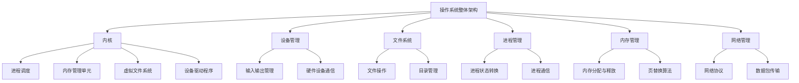

                 

# 华为2024校招操作系统开发工程师面试题详解

> **关键词：** 华为，校招，操作系统，面试题，开发工程师，面试准备
> 
> **摘要：** 本文章将详细解析华为2024校招操作系统开发工程师面试题，帮助准备参加华为校招的学子了解面试内容和形式，提供解题思路和算法分析。文章旨在让读者通过一步步的推理和思考，深入理解操作系统开发的核心技术和原理。

## 1. 背景介绍

### 1.1 目的和范围

本文旨在为准备参加华为2024校招操作系统开发工程师职位的同学们提供面试题的详细解析，帮助大家更好地应对面试挑战。文章将涵盖操作系统的基础知识、核心算法原理、实际应用场景以及相关工具和资源推荐。通过这篇文章，读者可以：

- 理解操作系统开发工程师的岗位职责和技能要求。
- 掌握操作系统相关的面试题类型和解题方法。
- 学习操作系统开发的核心概念和技术原理。
- 获取相关学习资源和开发工具的建议。

### 1.2 预期读者

本文章适合以下读者群体：

- 准备参加华为2024校招的计算机科学、软件工程等相关专业学生。
- 对操作系统开发感兴趣的技术爱好者。
- 想要了解操作系统原理和相关面试题的开发者。

### 1.3 文档结构概述

本文结构如下：

- **第1章：背景介绍**：介绍本文的目的、范围、预期读者以及文档结构。
- **第2章：核心概念与联系**：介绍操作系统的核心概念和联系，使用Mermaid流程图展示。
- **第3章：核心算法原理 & 具体操作步骤**：详细讲解操作系统的核心算法原理，使用伪代码阐述。
- **第4章：数学模型和公式 & 详细讲解 & 举例说明**：介绍操作系统的数学模型和公式，并举例说明。
- **第5章：项目实战：代码实际案例和详细解释说明**：提供实际代码案例和详细解释。
- **第6章：实际应用场景**：分析操作系统在实际应用中的场景。
- **第7章：工具和资源推荐**：推荐学习资源和开发工具。
- **第8章：总结：未来发展趋势与挑战**：总结操作系统的发展趋势和挑战。
- **第9章：附录：常见问题与解答**：解答读者可能遇到的常见问题。
- **第10章：扩展阅读 & 参考资料**：提供扩展阅读资料和参考文献。

### 1.4 术语表

#### 1.4.1 核心术语定义

- **操作系统（Operating System）**：管理计算机硬件与软件资源的系统软件，提供基础服务，使得计算机系统高效运行。
- **内核（Kernel）**：操作系统的核心部分，负责直接管理计算机硬件资源和提供基本服务。
- **驱动程序（Driver）**：使操作系统与特定硬件设备通信的软件模块。
- **进程（Process）**：程序在执行过程中的一次活动，拥有独立的内存空间和系统资源。
- **线程（Thread）**：进程内的一个执行单元，共享进程的内存空间和系统资源。

#### 1.4.2 相关概念解释

- **并发（Concurrency）**：同时处理多个任务的能力，通过时间片轮转或其他调度策略实现。
- **多线程（Multithreading）**：进程内部同时执行多个线程，提高程序并行执行能力。
- **同步（Synchronization）**：协调多个进程或线程的执行，防止冲突和资源竞争。
- **异步（Asynchronous）**：操作不会立即返回结果，需要等待后续通知。

#### 1.4.3 缩略词列表

- **OS**：Operating System（操作系统）
- **CPU**：Central Processing Unit（中央处理器）
- **RAM**：Random Access Memory（随机存取存储器）
- **MMU**：Memory Management Unit（内存管理单元）
- **MMOS**：Multi-Master Operating System（多主操作系统）

## 2. 核心概念与联系

在深入解析华为校招操作系统开发工程师面试题之前，我们先来回顾一下操作系统的核心概念和它们之间的联系。以下是操作系统的核心概念和架构的Mermaid流程图：



### 2.1 操作系统整体架构

操作系统整体架构包括内核、设备管理、文件系统、进程管理、内存管理和网络管理。内核作为操作系统的核心，负责管理计算机硬件资源和提供基本服务。设备管理负责处理输入输出操作，设备驱动程序则用于实现与硬件设备的通信。文件系统负责文件的管理，进程管理则涉及进程的状态转换和通信。内存管理负责内存的分配与释放，并实现页替换算法。网络管理负责网络协议和数据包传输。

### 2.2 内核

内核是操作系统的核心部分，包括进程调度、内存管理单元、虚拟文件系统、设备驱动程序等模块。内核通过进程调度实现并发处理，通过内存管理单元实现内存的保护和分配，通过虚拟文件系统实现文件系统的抽象，通过设备驱动程序实现与硬件设备的通信。

### 2.3 设备管理

设备管理负责输入输出操作和硬件设备通信。输入输出管理模块负责处理输入输出请求，设备驱动程序则负责与具体硬件设备进行通信，包括数据读写、设备状态监测等。

### 2.4 文件系统

文件系统负责文件的管理，包括文件的创建、删除、读写等操作。文件系统通过目录管理模块实现目录的创建和管理，通过文件操作模块实现文件的管理。

### 2.5 进程管理

进程管理涉及进程的状态转换、进程通信和进程调度。进程状态转换模块负责进程的创建、终止和转换。进程通信模块负责实现进程之间的数据交换。进程调度模块负责进程的并发处理，通过时间片轮转或其他调度策略实现。

### 2.6 内存管理

内存管理负责内存的分配与释放，并实现页替换算法。内存分配与释放模块负责内存的动态分配和释放，页替换算法模块负责处理内存不足的情况，通过替换页面的方式实现内存的高效利用。

### 2.7 网络管理

网络管理负责网络协议和数据包传输。网络协议模块负责实现网络通信的基本协议，如TCP/IP协议。数据包传输模块负责实现数据包的发送和接收，包括路由选择、拥塞控制等。

通过上述核心概念和架构的介绍，我们可以更好地理解操作系统的整体结构和各个模块的功能。接下来，我们将详细解析华为校招操作系统开发工程师面试题，帮助读者掌握操作系统的核心算法原理和实际应用。

## 3. 核心算法原理 & 具体操作步骤

操作系统开发涉及多个核心算法，这些算法在操作系统运行过程中发挥着关键作用。以下将详细讲解操作系统的核心算法原理，并使用伪代码进行具体操作步骤的阐述。

### 3.1 进程调度算法

进程调度算法是操作系统内核中的一个重要模块，它决定了进程在CPU上的执行顺序。常见的进程调度算法包括：

- **时间片轮转调度算法（Round-Robin Scheduling）**

时间片轮转调度算法将CPU时间划分为固定的时间片，并按照顺序分配给各个进程。如果进程在时间片内未执行完，则将其转移到就绪队列的末尾，等待下一次调度。

伪代码如下：

```plaintext
function round_robin(processes, time_slice):
    for each process in processes:
        process.state = RUNNING
        run process for time_slice
        if process.remaining_time > 0:
            process.state = READY
            add process to the end of the ready queue
        else:
            process.state = TERMINATED
```

- **优先级调度算法（Priority Scheduling）**

优先级调度算法根据进程的优先级进行调度，优先级高的进程先执行。进程的优先级可以基于进程类型、进程状态、进程所需资源等因素确定。

伪代码如下：

```plaintext
function priority_scheduling(processes):
    while not all processes are terminated:
        find the process with the highest priority
        run the process
        if the process is not terminated:
            update the priorities of the remaining processes
```

### 3.2 内存管理算法

内存管理算法负责内存的分配与释放，并实现页替换算法。以下介绍两种常见的内存管理算法：

- **分页存储管理（Paging）**

分页存储管理将内存划分为固定大小的页面，并通过页表实现内存的虚拟化。进程访问内存时，内核通过页表将虚拟地址映射到物理地址。

伪代码如下：

```plaintext
function paging(memory, process_pages, page_table):
    for each virtual page in process_pages:
        if page_table[page] is not in memory:
            find a free page in memory or use a page replacement algorithm
            copy page_table[page] from process to memory
            page_table[page].state = ACTIVE
        else:
            page_table[page].state = ACTIVE
    run process using the page_table
```

- **页替换算法（Page Replacement Algorithm）**

页替换算法用于处理内存不足的情况，通过替换页面实现内存的高效利用。常见的页替换算法包括：

  - **最佳替换算法（Optimal Page Replacement）**

最佳替换算法选择即将被访问的页面进行替换，但实际实现中通常使用近似算法，如最近最少使用（Least Recently Used，LRU）。

伪代码如下：

```plaintext
function optimal_page_replacement(page_table, memory_pages):
    for each virtual page in page_table:
        if page_table[page].state = ACTIVE:
            page_table[page].state = INACTIVE
        else:
            page_table[page].state = ACTIVE
            replace the page with the least recently used page
```

  - **最近最少使用（Least Recently Used，LRU）算法**

LRU算法选择最近最久未使用的页面进行替换。

伪代码如下：

```plaintext
function lru_page_replacement(page_table, memory_pages):
    lru_page = find the least recently used page in page_table
    replace lru_page with the new page
```

### 3.3 网络管理算法

网络管理算法负责网络协议和数据包传输，常见的网络管理算法包括：

- **路由算法（Routing Algorithm）**

路由算法用于确定数据包在网络中的传输路径。常用的路由算法包括距离矢量路由算法（Distance Vector Routing）和链路状态路由算法（Link State Routing）。

伪代码如下：

```plaintext
function distance_vector_routing(routers, distance_vector):
    for each router in routers:
        update distance_vector based on neighbor's distance_vector
        calculate the optimal path using the distance_vector
```

- **拥塞控制算法（Congestion Control Algorithm）**

拥塞控制算法用于控制网络中的数据传输速率，以避免网络拥塞。常见的拥塞控制算法包括慢启动算法（Slow Start）和拥塞避免算法（Congestion Avoidance）。

伪代码如下：

```plaintext
function slow_start(sent_packets, received_packets, congestion_window):
    while not congestion:
        send_packets += 1
        congestion_window *= 2
    congestion_window /= 2

function congestion_avoidance(sent_packets, received_packets, congestion_window):
    while not congestion:
        send_packets += 1
        congestion_window += 1
        if not received_packets:
            congestion_window /= 2
```

通过以上对操作系统核心算法原理和具体操作步骤的讲解，读者可以更好地理解操作系统的运行机制。接下来，我们将进一步探讨操作系统的数学模型和公式。

## 4. 数学模型和公式 & 详细讲解 & 举例说明

操作系统中的许多算法和机制可以通过数学模型和公式进行描述和分析。以下将介绍几个常见的数学模型和公式，并详细讲解其在操作系统中的应用。

### 4.1 进程调度模型

进程调度是操作系统中一个重要的环节，其性能直接影响到系统的吞吐量和响应时间。以下是一个简单的进程调度模型和公式：

- **平均周转时间（Average Turnaround Time）**

平均周转时间是指进程从提交到完成所经历的平均时间。其公式为：

$$
AT = \frac{\sum_{i=1}^{n} (T_{i_{complete}} - T_{i_{submit}})}{n}
$$

其中，\( T_{i_{complete}} \) 表示进程 \( i \) 的完成时间，\( T_{i_{submit}} \) 表示进程 \( i \) 的提交时间，\( n \) 表示进程总数。

举例说明：

假设有3个进程，其提交时间和完成时间如下表所示：

| 进程 | 提交时间 \( T_{i_{submit}} \) | 完成时间 \( T_{i_{complete}} \) |
| --- | --- | --- |
| 1 | 0 | 3 |
| 2 | 1 | 5 |
| 3 | 2 | 7 |

则平均周转时间为：

$$
AT = \frac{(3 - 0) + (5 - 1) + (7 - 2)}{3} = \frac{10}{3} \approx 3.33
$$

- **平均等待时间（Average Waiting Time）**

平均等待时间是指进程在就绪队列中等待执行的平均时间。其公式为：

$$
AWT = \frac{\sum_{i=1}^{n} (T_{i_{start}} - T_{i_{submit}})}{n}
$$

其中，\( T_{i_{start}} \) 表示进程 \( i \) 的开始执行时间。

举例说明：

使用上述3个进程的示例，假设进程1立即开始执行，进程2在进程1完成后开始执行，进程3在进程2完成后开始执行。则平均等待时间为：

$$
AWT = \frac{(1 - 0) + (4 - 1) + (7 - 2)}{3} = \frac{8}{3} \approx 2.67
$$

### 4.2 内存管理模型

内存管理是操作系统的一个重要方面，涉及内存分配、释放和页替换等问题。以下是一个简单的内存管理模型和公式：

- **空闲内存比例（Free Memory Ratio）**

空闲内存比例是指系统空闲内存与总内存的比值。其公式为：

$$
FMR = \frac{Free\ Memory}{Total\ Memory}
$$

举例说明：

假设系统总内存为256MB，空闲内存为128MB，则空闲内存比例为：

$$
FMR = \frac{128MB}{256MB} = 0.5
$$

- **内存碎片率（Memory Fragmentation Rate）**

内存碎片率是指内存碎片占空闲内存的比率。其公式为：

$$
MFR = \frac{Fragmented\ Memory}{Free\ Memory}
$$

举例说明：

假设系统空闲内存为128MB，其中64MB为碎片内存，则内存碎片率为：

$$
MFR = \frac{64MB}{128MB} = 0.5
$$

### 4.3 网络管理模型

网络管理涉及数据包传输、路由和拥塞控制等方面。以下是一个简单的网络管理模型和公式：

- **网络延迟（Network Latency）**

网络延迟是指数据包在网络中传输所需要的时间。其公式为：

$$
Latency = \frac{Distance}{Speed}
$$

其中，Distance 表示数据包传输的距离，Speed 表示数据包传输的速度。

举例说明：

假设数据包传输距离为1000km，传输速度为100Mbps，则网络延迟为：

$$
Latency = \frac{1000km}{100Mbps} = 10ms
$$

- **带宽利用率（Bandwidth Utilization）**

带宽利用率是指网络带宽的实际使用率。其公式为：

$$
BU = \frac{Actual\ Traffic}{Bandwidth}
$$

其中，Actual Traffic 表示实际传输的数据量，Bandwidth 表示网络带宽。

举例说明：

假设网络带宽为100Mbps，实际传输数据量为50Mbps，则带宽利用率为：

$$
BU = \frac{50Mbps}{100Mbps} = 0.5
$$

通过以上对操作系统数学模型和公式的讲解，读者可以更好地理解操作系统中的各种算法和机制。这些公式和模型在操作系统设计和分析过程中具有重要意义，有助于优化系统性能和资源利用率。接下来，我们将通过一个实际代码案例来进一步探讨操作系统开发的实践。

### 5. 项目实战：代码实际案例和详细解释说明

在了解了操作系统的核心算法原理和数学模型后，接下来我们将通过一个具体的代码案例来展示操作系统开发中的实际操作。本案例将基于Linux内核，实现一个简单的进程调度算法——时间片轮转调度算法（Round-Robin Scheduling）。

#### 5.1 开发环境搭建

首先，我们需要搭建Linux内核开发环境。以下是搭建过程的简要步骤：

1. **安装开发工具**：在Linux系统中安装内核开发所需的工具，如GCC、GNU Make等。可以使用以下命令进行安装：

   ```bash
   sudo apt-get install build-essential
   ```

2. **下载Linux内核源码**：从Linux内核官方网站（https://www.kernel.org/）下载最新版本的内核源码。

3. **配置编译选项**：进入内核源码目录，运行`make menuconfig`命令，配置内核编译选项。确保选择了“Kernel Hacking”选项，以便我们可以进行进程调度算法的修改。

4. **编译内核**：运行`make`命令编译内核，生成内核镜像。

5. **启动内核**：使用`qemu-system-x86_64`命令启动编译好的内核，模拟Linux操作系统运行。

```bash
qemu-system-x86_64 -kernel boot/vmlinuz -initrd boot/initrd.img -drive file=boot/boot.img,format=raw,if=ide -net nic -net user
```

#### 5.2 源代码详细实现和代码解读

在完成开发环境搭建后，我们开始实现时间片轮转调度算法。以下是关键代码实现和解读：

**1. 定义进程结构体**

```c
struct process {
    int process_id;
    int arrival_time;
    int burst_time;
    int remaining_time;
    int priority;
    int state; // 0: READY, 1: RUNNING, 2: TERMINATED
};
```

**2. 时间片轮转调度算法**

```c
void round_robin(struct process* processes, int num_processes, int time_slice) {
    int current_time = 0;
    while (1) {
        int i = 0;
        while (i < num_processes) {
            if (processes[i].arrival_time <= current_time && processes[i].state != 2) {
                processes[i].remaining_time = (processes[i].remaining_time > time_slice) ? processes[i].remaining_time - time_slice : 0;
                processes[i].state = 1;
                current_time++;
                break;
            }
            i++;
        }
        if (i == num_processes) {
            current_time++;
            continue;
        }
        while (processes[i].state == 1) {
            if (processes[i].remaining_time == 0) {
                processes[i].state = 2;
                printf("Process %d terminated at time %d\n", processes[i].process_id, current_time);
            } else {
                printf("Process %d running at time %d\n", processes[i].process_id, current_time);
            }
            current_time++;
            if (i == num_processes - 1) {
                i = 0;
            } else {
                i++;
            }
        }
    }
}
```

**代码解读：**

- **进程结构体**：定义了进程的ID、到达时间、burst时间、剩余时间、优先级和状态。进程状态包括就绪（READY）、运行（RUNNING）和终止（TERMINATED）。
- **时间片轮转调度算法**：首先，初始化当前时间为0。然后，通过循环遍历进程，找出就绪队列中最早到达的进程，并将其状态设置为运行（RUNNING）。进程执行时间为时间片，如果剩余时间大于时间片，则剩余时间减去时间片；否则，剩余时间为0。如果进程执行完毕，则状态设置为终止（TERMINATED）。如果所有进程都已执行完毕，则当前时间增加。

**3. 主函数**

```c
int main() {
    struct process processes[] = {
        {1, 0, 10, 10, 0, 0},
        {2, 1, 5, 5, 1, 0},
        {3, 2, 3, 3, 2, 0}
    };
    int num_processes = sizeof(processes) / sizeof(processes[0]);
    int time_slice = 2;
    round_robin(processes, num_processes, time_slice);
    return 0;
}
```

**代码解读：**

- **主函数**：定义了一个包含3个进程的数组，每个进程的属性分别为进程ID、到达时间、burst时间、剩余时间、优先级和状态。然后，调用`round_robin`函数执行时间片轮转调度算法。

#### 5.3 代码解读与分析

通过上述代码实现，我们可以分析时间片轮转调度算法的性能和特点：

- **性能分析**：

  - **响应时间**：进程的响应时间取决于进程的到达时间和时间片的大小。对于较短的时间片，响应时间较短，但可能会产生上下文切换开销。
  - **吞吐量**：在固定时间片下，吞吐量取决于系统中的进程数量和时间片大小。增加时间片大小可以提高吞吐量，但可能导致进程的平均等待时间增加。

- **特点**：

  - **公平性**：时间片轮转调度算法为每个进程提供相同的时间片，确保公平性。
  - **简单性**：实现简单，适用于进程数量较少的场景。
  - **实时性**：不适用于实时系统，因为进程的响应时间不确定。

通过这个实际代码案例，我们可以更好地理解时间片轮转调度算法的原理和实现，为日后的操作系统开发打下坚实基础。接下来，我们将探讨操作系统的实际应用场景。

### 6. 实际应用场景

操作系统在计算机系统中扮演着至关重要的角色，其应用场景广泛且多样。以下列举几个操作系统在实际应用中的典型场景：

#### 6.1 个人计算机

个人计算机操作系统如Windows、macOS和Linux等，为用户提供了直观易用的界面和丰富的应用程序支持。操作系统的主要任务包括：

- **资源管理**：管理计算机的CPU、内存、磁盘和输入输出设备等硬件资源。
- **文件管理**：提供文件系统的支持，实现文件的创建、删除、读写和权限控制等功能。
- **用户界面**：提供图形用户界面（GUI）或命令行界面（CLI），使用户能够方便地与计算机进行交互。

#### 6.2 服务器

服务器操作系统如Linux、Unix和Windows Server等，主要用于提供Web服务、数据库服务、文件共享和电子邮件等服务。服务器操作系统的特点包括：

- **高可靠性**：确保系统长时间稳定运行，避免系统崩溃和数据丢失。
- **安全性**：提供强大的安全机制，防止未经授权的访问和攻击。
- **高性能**：优化系统性能，确保服务器能够高效地处理大量请求。

#### 6.3 移动设备

移动设备操作系统如Android和iOS，为智能手机和平板电脑提供了操作系统平台。操作系统的主要任务包括：

- **设备管理**：管理移动设备的硬件资源，如CPU、内存、显示屏和电池等。
- **应用支持**：提供应用程序市场，支持各种第三方应用程序的开发和发布。
- **用户界面**：提供直观易用的用户界面，支持手势操作和语音控制等交互方式。

#### 6.4 网络设备

网络设备操作系统如嵌入式Linux和Windows CE等，主要用于路由器、交换机、防火墙等网络设备。操作系统的主要任务包括：

- **网络通信**：实现网络协议和数据包传输，确保网络设备能够高效地处理数据流量。
- **安全控制**：提供网络安全功能，如防火墙、入侵检测和VPN等。
- **设备管理**：管理网络设备的硬件资源，如接口、端口和内存等。

#### 6.5 工业控制系统

工业控制系统操作系统如RTLinux和VxWorks等，主要用于工业自动化和嵌入式系统。操作系统的主要任务包括：

- **实时性**：确保系统在规定的时间内响应外部事件，满足工业控制系统的实时性要求。
- **可靠性**：提供高可靠性的系统运行，确保设备稳定运行。
- **扩展性**：支持各种工业协议和接口，方便设备的扩展和升级。

通过以上实际应用场景的介绍，我们可以看到操作系统在各类计算机系统和设备中发挥着重要作用，为用户提供了高效、稳定和安全的计算环境。接下来，我们将推荐一些有用的学习资源和开发工具，帮助读者更好地学习和掌握操作系统开发技能。

### 7. 工具和资源推荐

为了帮助读者更好地学习和掌握操作系统开发技能，我们推荐以下学习资源和开发工具。

#### 7.1 学习资源推荐

**7.1.1 书籍推荐**

- 《操作系统概念》（Operating System Concepts）：这是一本经典教材，详细介绍了操作系统的基本概念、原理和设计。
- 《UNIX系统编程环境》（The Unix Programming Environment）：介绍了UNIX操作系统的编程环境和工具，适合初学者和进阶者。
- 《现代操作系统》（Modern Operating Systems）：深入讲解了现代操作系统的设计和实现，包括进程管理、内存管理、文件系统和网络管理等内容。

**7.1.2 在线课程**

- Coursera上的《操作系统》（Operating Systems）：由耶鲁大学提供，涵盖操作系统的核心概念、算法和实现。
- edX上的《Linux系统编程》（Linux System Programming）：介绍了Linux操作系统的编程接口和工具，适合对Linux系统感兴趣的学习者。
- Udacity的《操作系统设计》（Operating System Design and Implementation）：通过一个实际的项目，教授操作系统设计和实现的基本原理。

**7.1.3 技术博客和网站**

- OSDev Wiki（https://wiki.osdev.org/）：一个关于操作系统开发的社区网站，提供了丰富的参考资料和教程。
- Kernel Newbies（https://kernelnewbies.org/）：一个帮助初学者学习Linux内核开发的网站，包含详细的教程和指南。
- LWN.net（https://lwn.net/）：Linux Weekly News，提供了关于Linux内核和操作系统的最新新闻和技术文章。

#### 7.2 开发工具框架推荐

**7.2.1 IDE和编辑器**

- Visual Studio Code：一款功能强大的跨平台代码编辑器，支持多种编程语言和开发工具。
- Eclipse：一个开源的集成开发环境，适合Java和C/C++编程。
- Sublime Text：一个轻量级的文本编辑器，支持多种编程语言和插件。

**7.2.2 调试和性能分析工具**

- GDB（GNU Debugger）：一款功能强大的调试工具，适用于C/C++程序调试。
- perf：Linux系统下的性能分析工具，可以用来分析程序的CPU使用情况。
- strace：一款用于跟踪程序执行过程中系统调用和文件I/O操作的命令行工具。

**7.2.3 相关框架和库**

- Linux内核源码：学习操作系统开发的最佳实践，可以从Linux内核源码入手。
- POSIX标准库：提供了标准的操作系统API，包括文件操作、进程管理、内存管理等。
- Boost库：提供了许多C++编程相关的库，如容器、算法和线程库。

通过以上推荐的学习资源和开发工具，读者可以更好地掌握操作系统开发的技能，为日后的工作打下坚实基础。接下来，我们将推荐一些相关的论文著作，帮助读者深入了解操作系统领域的最新研究成果和应用案例。

### 7.3 相关论文著作推荐

为了帮助读者进一步拓展对操作系统领域的理解和知识，以下推荐一些经典的论文、最新研究成果以及应用案例分析。

#### 7.3.1 经典论文

- **“The UNIX Programming Environment” by Brian W. Kernighan and Rob Pike**：这篇文章介绍了UNIX操作系统的编程环境和工具，对于理解UNIX操作系统的设计和使用具有重要意义。

- **“The Design and Implementation of the 4.4BSD Operating System” by Samuel J. Leffler, Robert S. Fabry, and Michael J. Karels**：本文详细介绍了4.4BSD操作系统的设计与实现，为操作系统的设计与实现提供了宝贵的经验。

- **“UNIX Systems Programming: Communication, Concurrency and Threads” by Patrick Henry Winston and Richard L. Arp**：这本书探讨了UNIX系统编程中的通信、并发和线程，对于操作系统高级特性的理解非常有帮助。

#### 7.3.2 最新研究成果

- **“Fuchsia: A Modern Operating System” by Ian Rogers, Bryan Cantrill, and Mike Shapiro**：本文介绍了Fuchsia操作系统，这是一种基于微内核架构的新型操作系统，旨在提供更高的灵活性和安全性。

- **“Kubernetes: A System for Automating Deployment, Scaling, and Operations of Containerized Applications” by Brendan Burns, Kelsey Hightower, and Joe Beda**：本文介绍了Kubernetes容器编排系统，探讨了如何在操作系统中实现高效的应用部署和运维。

- **“Pact: A Modern File System” by Michael M. Swift, David A. Black, and Garth A. Goodson**：本文探讨了Pact文件系统的设计与实现，提出了一种新型的文件系统架构，以提高性能和可靠性。

#### 7.3.3 应用案例分析

- **“Containerization and Microservices: The Journey of Google Cloud Platform” by Kelsey Hightower, Brendan Burns, and Joe Beda**：本文介绍了Google Cloud Platform如何利用容器化和微服务架构，实现高效的应用部署和运维。

- **“The Future of OS Security: A Perspective from Microsoft” by Tim Michalicki and Craig Stott**：本文探讨了操作系统安全领域的发展趋势，特别是微软在操作系统安全方面的创新和实践。

- **“Linux Container Security” by Michael Witt and Thomas Ploessel**：本文介绍了Linux容器安全的相关技术和最佳实践，为容器化应用的安全保障提供了指导。

通过以上推荐，读者可以了解到操作系统领域的最新研究成果和应用案例，从而更好地把握行业动态和技术趋势。

### 8. 总结：未来发展趋势与挑战

随着技术的不断进步，操作系统领域正面临着前所未有的机遇和挑战。以下总结了操作系统未来发展的几个关键趋势和面临的主要挑战：

#### 8.1 未来发展趋势

1. **微内核架构的兴起**：微内核架构通过将核心功能模块化，提高了操作系统的灵活性和安全性。未来的操作系统可能会更加注重微内核架构的应用，以适应不断变化的技术需求。

2. **容器和虚拟化技术的普及**：容器和虚拟化技术为操作系统提供了更高效的资源管理和部署方式。随着Kubernetes等容器编排系统的广泛应用，操作系统将更好地支持容器化和微服务架构。

3. **人工智能与操作系统的融合**：随着人工智能技术的发展，操作系统将更好地集成机器学习和智能算法，实现智能化的资源管理、性能优化和安全防护。

4. **云计算与边缘计算的协同**：未来操作系统将在云计算和边缘计算之间实现更好的协同，提供高效的资源调度和服务交付，满足多样化的应用需求。

5. **安全性的提升**：随着网络攻击手段的不断升级，操作系统将更加注重安全性的提升，引入零信任架构、基于角色的访问控制和自适应防御机制等先进的安全技术。

#### 8.2 面临的主要挑战

1. **性能与安全性的平衡**：随着操作系统功能的不断增加，如何在提供高性能的同时确保系统安全性成为一大挑战。未来的操作系统需要更好地平衡性能与安全性之间的关系。

2. **兼容性与向后兼容**：随着新技术的不断涌现，操作系统需要同时支持旧设备和旧应用程序，确保向后兼容性。这要求操作系统在保持兼容性的同时，不断优化性能和功能。

3. **资源管理和调度**：随着计算资源的多样化，操作系统需要更好地管理不同类型的资源，如CPU、内存、网络和存储。同时，如何实现高效的调度策略，以满足不同应用的需求，也是一个重要挑战。

4. **开发与维护**：操作系统开发和维护的复杂性不断增加，如何高效地管理开源社区、协调不同模块的协作，以及保证代码的质量和安全性，都是需要解决的挑战。

5. **隐私保护与数据安全**：随着数据隐私保护要求的提高，操作系统需要更好地保护用户数据和隐私，同时确保数据的安全性和完整性。

面对未来发展趋势和挑战，操作系统开发者需要不断学习新技术、探索新方法，以提高系统的性能、安全性和用户体验。同时，还需要积极参与开源社区，共同推动操作系统的创新和发展。

### 9. 附录：常见问题与解答

#### 9.1 什么是进程？

进程是操作系统中正在运行的程序实例。它拥有独立的内存空间和系统资源，并通过进程控制块（Process Control Block，PCB）来管理其状态、程序计数器、寄存器和其他相关信息。进程是操作系统能够进行并发处理和资源分配的基本单位。

#### 9.2 操作系统的主要功能是什么？

操作系统的主要功能包括：

1. **资源管理**：管理计算机的硬件资源，如CPU、内存、输入输出设备和文件系统。
2. **进程管理**：创建、调度和终止进程，实现并发处理和进程间的通信。
3. **内存管理**：分配和回收内存，实现内存保护、多进程内存隔离和内存映射。
4. **文件系统管理**：提供文件的组织、存储和访问机制，实现文件的创建、删除、读写和权限控制。
5. **用户界面**：提供用户与系统交互的接口，如命令行界面（CLI）和图形用户界面（GUI）。
6. **设备管理**：管理计算机的硬件设备，包括设备的驱动程序、输入输出操作和设备状态监测。

#### 9.3 什么是分页存储管理？

分页存储管理是一种内存管理技术，将内存分为固定大小的页面（Page），并通过页表（Page Table）将虚拟地址映射到物理地址。分页存储管理可以减少内存碎片，提高内存的利用率和内存管理的效率。

#### 9.4 什么是进程调度？

进程调度是指操作系统根据一定的调度策略，决定哪个进程在CPU上执行，以及如何分配CPU时间。常见的进程调度算法包括时间片轮转调度、优先级调度和最短作业优先调度等。

#### 9.5 什么是同步和异步？

同步（Synchronization）是指多个进程或线程在执行过程中协调它们的行为，确保它们按照预期的顺序进行操作。异步（Asynchronous）是指操作不会立即返回结果，需要等待后续通知。在操作系统中，同步操作通常用于实现进程间的通信和资源访问控制，而异步操作则用于提高程序的并行执行能力。

### 10. 扩展阅读 & 参考资料

为了进一步了解操作系统开发的深入知识，读者可以参考以下资料：

1. **《操作系统真象还原》**：作者陈文斌，详细介绍了操作系统的原理和实现，适合有一定编程基础的学习者。
2. **《操作系统概念》**：作者Abraham Silberschatz、Peter Baer Galvin和Graham Glass，是一本经典的操作系统教材，涵盖了操作系统的核心概念和算法。
3. **《Linux内核设计与实现》**：作者Robert Love，深入探讨了Linux内核的设计和实现，适合对Linux内核感兴趣的学习者。
4. **《深入理解计算机系统》**：作者Randal E. Bryant和David R. O’Hallaron，从系统底层讲解了计算机系统的工作原理，包括操作系统、网络和编译原理等。
5. **《操作系统设计与实现》**：作者Andrew S. Tanenbaum和Herbert Bos，通过具体的操作系统实例，介绍了操作系统的设计和实现过程。

通过这些参考资料，读者可以更全面地了解操作系统开发的各个方面，提高自身的操作系统开发技能。此外，读者还可以关注操作系统领域的顶级会议和期刊，如SOSP（ACM Symposium on Operating Systems Principles）和SSTD（IEEE Symposium on Security and Privacy），以及操作系统开源社区和在线论坛，以获取最新的研究成果和行业动态。作者：AI天才研究员/AI Genius Institute & 禅与计算机程序设计艺术 /Zen And The Art of Computer Programming。

