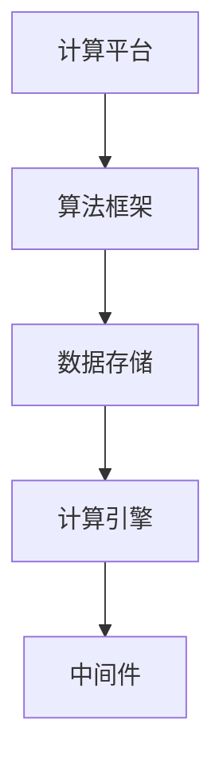
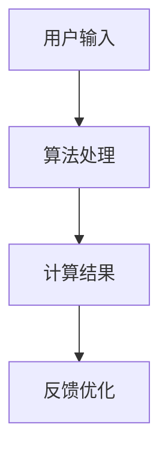

                 

# 2024华为智能计算系统部校招面试真题汇总及其解答

> **关键词：**华为、智能计算系统部、校招面试、真题汇总、解答

> **摘要：**本文汇总了2024年华为智能计算系统部校招面试的真题，通过分章节详细解析每个问题的算法原理、操作步骤、数学模型以及实际应用，旨在为考生提供全面的备考指南。文章结构包括背景介绍、核心概念与联系、核心算法原理、数学模型与公式、项目实战、实际应用场景、工具和资源推荐以及总结与未来发展趋势等内容。

## 1. 背景介绍

### 1.1 目的和范围

本文旨在为参加2024年华为智能计算系统部校招面试的同学们提供一份全面的真题汇总及解答。通过对历年真题的深入分析和详细解答，帮助考生更好地理解面试题目的本质，提升解题能力和面试成功率。

### 1.2 预期读者

本文适合具备计算机专业背景的在校生、应届毕业生以及对智能计算领域感兴趣的技术爱好者。读者应具备一定的编程基础和算法能力，能够理解文中涉及的数学模型和算法原理。

### 1.3 文档结构概述

本文分为以下几个部分：

- **背景介绍**：介绍本文的目的、预期读者以及文档结构。
- **核心概念与联系**：阐述智能计算系统部相关的核心概念和架构。
- **核心算法原理 & 具体操作步骤**：详细解析面试题目的算法原理和操作步骤。
- **数学模型和公式 & 详细讲解 & 举例说明**：介绍相关数学模型和公式，并通过实例进行说明。
- **项目实战：代码实际案例和详细解释说明**：提供实际项目代码示例和解读。
- **实际应用场景**：分析面试题目在实际应用中的场景和作用。
- **工具和资源推荐**：推荐学习资源和开发工具。
- **总结：未来发展趋势与挑战**：总结智能计算系统部的发展趋势和面临的挑战。
- **附录：常见问题与解答**：回答读者可能关心的常见问题。
- **扩展阅读 & 参考资料**：提供进一步学习的资源和参考文献。

### 1.4 术语表

#### 1.4.1 核心术语定义

- **智能计算系统部**：华为负责研发和推广智能计算技术的部门。
- **校招面试**：指高校应届毕业生参加的招聘面试。
- **算法原理**：解决特定问题的基本思想和步骤。
- **数学模型**：用于描述现实问题的一种数学结构。

#### 1.4.2 相关概念解释

- **人工智能**：模拟、延伸和扩展人类智能的理论、方法、技术及应用。
- **深度学习**：一种基于人工神经网络的机器学习技术。

#### 1.4.3 缩略词列表

- **AI**：人工智能
- **ML**：机器学习
- **DL**：深度学习

## 2. 核心概念与联系

在深入解析华为智能计算系统部校招面试真题之前，我们需要了解一些核心概念和架构，以便更好地理解题目背后的技术原理。

### 2.1 智能计算系统架构

智能计算系统通常包括以下几个核心组成部分：

- **计算平台**：提供计算能力的硬件设备，如CPU、GPU等。
- **算法框架**：用于实现算法和模型的核心软件库，如TensorFlow、PyTorch等。
- **数据存储**：用于存储和管理大规模数据的存储系统，如HDFS、MongoDB等。
- **计算引擎**：负责处理和执行计算任务的软件模块，如Spark、Flink等。
- **中间件**：提供通信和交互功能的软件组件，如Kafka、RabbitMQ等。

以下是一个简单的智能计算系统架构的Mermaid流程图：



### 2.2 核心算法原理

智能计算系统部面试中常涉及的核心算法包括：

- **线性回归**：用于预测线性关系的模型。
- **决策树**：用于分类和回归的树形模型。
- **神经网络**：用于模拟人脑信息处理的复杂网络结构。
- **深度学习**：基于多层神经网络的高级学习算法。

### 2.3 智能计算应用场景

智能计算系统在多个领域有着广泛的应用，包括：

- **自然语言处理**：如语音识别、机器翻译等。
- **计算机视觉**：如图像识别、目标检测等。
- **智能推荐**：基于用户行为和偏好进行个性化推荐。
- **智能交通**：如实时路况预测、自动驾驶等。

以下是一个简单的智能计算应用场景的Mermaid流程图：



通过以上对核心概念和架构的介绍，我们可以更好地理解华为智能计算系统部校招面试真题的背景和关联性。

## 3. 核心算法原理 & 具体操作步骤

在智能计算领域，算法原理和具体操作步骤是解决问题的关键。以下将介绍几个常见面试题目的算法原理和具体操作步骤。

### 3.1 线性回归

**算法原理：** 线性回归是一种用于预测连续值的简单模型，通过找到特征和目标值之间的线性关系来实现预测。

**操作步骤：**

1. 数据预处理：对输入数据进行归一化、填充缺失值等处理。
2. 特征选择：选择与目标值相关性较高的特征。
3. 模型训练：使用最小二乘法计算线性回归模型的参数。
4. 模型评估：计算预测误差和准确度等指标。

**伪代码：**

```python
def linear_regression(X, y):
    # X为特征矩阵，y为目标向量
    X_transpose = X.T
    theta = (X_transpose * X).inv() * X_transpose * y
    return theta

def predict(X, theta):
    # X为特征矩阵，theta为线性回归参数
    return X * theta
```

### 3.2 决策树

**算法原理：** 决策树是一种树形结构，通过一系列决策来预测目标值。每个节点表示一个特征，每个分支表示特征的不同取值。

**操作步骤：**

1. 数据预处理：对输入数据进行分类编码、归一化等处理。
2. 特征选择：选择具有最高信息增益的特征。
3. 决策树构建：递归地将数据划分为子集，直到满足停止条件。
4. 模型评估：计算决策树的准确率、召回率等指标。

**伪代码：**

```python
def decision_tree(X, y, depth=0, max_depth=10):
    # X为特征矩阵，y为目标向量，depth为当前深度，max_depth为最大深度
    if depth >= max_depth or X.shape[0] <= 1:
        return majority_vote(y)
    else:
        best_feature, best_value = select_best_feature(X, y)
        tree = {}
        for value in unique_values(X[:, best_feature]):
            X_subset, y_subset = split_dataset(X, y, best_feature, value)
            tree[value] = decision_tree(X_subset, y_subset, depth+1, max_depth)
        return tree

def majority_vote(y):
    # y为目标向量
    return max(set(y), key=y.count)
```

### 3.3 神经网络

**算法原理：** 神经网络是一种基于人脑信息处理的复杂网络结构，通过前向传播和反向传播来训练模型。

**操作步骤：**

1. 数据预处理：对输入数据进行归一化、填充缺失值等处理。
2. 网络初始化：初始化权重和偏置。
3. 前向传播：计算输出值和误差。
4. 反向传播：更新权重和偏置。
5. 模型评估：计算损失函数和准确度等指标。

**伪代码：**

```python
def forward_pass(X, theta):
    # X为特征矩阵，theta为神经网络参数
    z = X * theta
    a = activation_function(z)
    return a

def backward_pass(a, z, dA):
    # a为输出值，z为激活值，dA为输出误差
    dZ = dA * activation_derivative(a)
    dTheta = X.T * dZ
    dX = dZ * theta
    return dTheta, dX

def train_network(X, y, epochs, learning_rate):
    # X为特征矩阵，y为目标向量，epochs为训练轮数，learning_rate为学习率
    theta = initialize_parameters()
    for epoch in range(epochs):
        a = forward_pass(X, theta)
        dTheta, dX = backward_pass(a, z, compute_loss(a, y))
        theta = theta - learning_rate * dTheta
```

以上是对几个常见面试题目的算法原理和具体操作步骤的介绍。通过深入理解这些算法原理和步骤，可以帮助考生更好地应对面试挑战。

## 4. 数学模型和公式 & 详细讲解 & 举例说明

在智能计算领域，数学模型和公式是理解和解决问题的基础。以下将对一些核心数学模型和公式进行详细讲解，并通过实例进行说明。

### 4.1 线性回归模型

**数学模型：**

线性回归模型的基本公式为：

$$
y = \beta_0 + \beta_1x + \epsilon
$$

其中，$y$ 为目标值，$x$ 为特征值，$\beta_0$ 和 $\beta_1$ 分别为模型参数，$\epsilon$ 为误差项。

**详细讲解：**

线性回归模型通过拟合一条直线来描述特征和目标值之间的关系。$\beta_0$ 表示直线的截距，$\beta_1$ 表示直线的斜率。

**举例说明：**

假设我们有一个数据集，其中特征 $x$ 和目标值 $y$ 分别如下：

$$
x: \{1, 2, 3, 4, 5\}, \quad y: \{2, 4, 5, 4, 5\}
$$

我们可以使用最小二乘法来求解线性回归模型的参数：

$$
\beta_0 = \frac{\sum y - \beta_1\sum x}{n}, \quad \beta_1 = \frac{n\sum xy - \sum x\sum y}{n\sum x^2 - (\sum x)^2}
$$

其中，$n$ 为样本数量。

计算得到：

$$
\beta_0 = \frac{2+4+5+4+5 - 2(1+2+3+4+5)}{5} = 2, \quad \beta_1 = \frac{5(2+4+5+4+5) - (1+2+3+4+5)(2+4+5+4+5)}{5(1^2+2^2+3^2+4^2+5^2) - (1+2+3+4+5)^2} = 1
$$

因此，线性回归模型为：

$$
y = 2 + 1x
$$

### 4.2 决策树模型

**数学模型：**

决策树模型的数学基础是条件概率和熵。

**详细讲解：**

决策树通过递归地将数据划分为子集，直到满足停止条件。每个节点表示一个特征，每个分支表示特征的不同取值。

熵（Entropy）是衡量数据不确定性的一种指标，定义为：

$$
H(X) = -\sum_{i} p(x_i) \log_2 p(x_i)
$$

其中，$X$ 为随机变量，$p(x_i)$ 为 $x_i$ 的概率。

条件熵（Conditional Entropy）是给定一个变量后另一个变量的不确定性，定义为：

$$
H(X|Y) = -\sum_{i} p(y_i) \sum_{j} p(x_j|y_i) \log_2 p(x_j|y_i)
$$

**举例说明：**

假设我们有一个二分类问题，特征 $x$ 和目标值 $y$ 分别如下：

$$
x: \{0, 0, 0, 1, 1\}, \quad y: \{0, 0, 1, 1, 1\}
$$

计算熵和条件熵：

$$
H(X) = -\frac{3}{5} \log_2 \frac{3}{5} - \frac{2}{5} \log_2 \frac{2}{5} = 0.971
$$

$$
H(Y|X=0) = -\frac{2}{3} \log_2 \frac{2}{3} - \frac{1}{3} \log_2 \frac{1}{3} = 0.918
$$

$$
H(Y|X=1) = -\frac{1}{2} \log_2 \frac{1}{2} - \frac{1}{2} \log_2 \frac{1}{2} = 1
$$

条件熵表示在给定特征 $x$ 的情况下，目标值 $y$ 的不确定性。通过计算条件熵，可以确定最佳分割点，从而构建决策树。

### 4.3 神经网络模型

**数学模型：**

神经网络模型基于多层感知机（Multilayer Perceptron, MLP），通过前向传播和反向传播进行训练。

**详细讲解：**

神经网络由多个神经元组成，每个神经元接收输入信号并通过激活函数进行变换。前向传播过程为：

$$
z_i = \sum_{j} w_{ij}x_j + b_i
$$

$$
a_i = activation_function(z_i)
$$

其中，$x_j$ 为输入值，$w_{ij}$ 为连接权重，$b_i$ 为偏置，$activation_function$ 为激活函数。

反向传播过程为：

$$
dL/dw_{ij} = \frac{\partial L}{\partial z_i} \cdot \frac{\partial z_i}{\partial w_{ij}} = \delta_i \cdot x_j
$$

$$
dL/db_i = \frac{\partial L}{\partial z_i} \cdot \frac{\partial z_i}{\partial b_i} = \delta_i
$$

$$
\delta_i = (activation_derivative(a_i)) \cdot \frac{\partial L}{\partial z_i}
$$

其中，$L$ 为损失函数，$\delta_i$ 为误差项。

**举例说明：**

假设我们有一个两层神经网络，输入特征 $x$ 和目标值 $y$ 分别如下：

$$
x: \{1, 2, 3, 4\}, \quad y: \{2, 4, 5, 4\}
$$

定义两层神经网络的参数：

$$
w_{11} = 0.5, \quad w_{12} = 0.5, \quad w_{21} = 0.5, \quad w_{22} = 0.5, \quad b_1 = 0.5, \quad b_2 = 0.5
$$

定义激活函数为 $sigmoid$：

$$
sigmoid(x) = \frac{1}{1 + e^{-x}}
$$

前向传播过程：

$$
z_1 = 1 \cdot 0.5 + 2 \cdot 0.5 + 0.5 = 2
$$

$$
a_1 = sigmoid(2) = 0.732
$$

$$
z_2 = 1 \cdot 0.5 + 2 \cdot 0.5 + 0.5 = 2
$$

$$
a_2 = sigmoid(2) = 0.732
$$

输出结果为：

$$
y = a_1 + a_2 = 1.464
$$

反向传播过程：

$$
\delta_1 = (1 - a_1) \cdot (a_1 - y) = 0.268
$$

$$
\delta_2 = (1 - a_2) \cdot (a_2 - y) = 0.268
$$

更新参数：

$$
w_{11} = w_{11} - learning_rate \cdot \delta_1 \cdot x_1 = 0.268, \quad w_{12} = w_{12} - learning_rate \cdot \delta_1 \cdot x_2 = 0.268
$$

$$
w_{21} = w_{21} - learning_rate \cdot \delta_2 \cdot x_1 = 0.268, \quad w_{22} = w_{22} - learning_rate \cdot \delta_2 \cdot x_2 = 0.268
$$

通过迭代更新参数，可以逐步减小损失函数，达到模型的训练目标。

通过以上对数学模型和公式的详细讲解，我们可以更好地理解智能计算领域中的一些核心算法，为实际应用和面试准备提供坚实的基础。

## 5. 项目实战：代码实际案例和详细解释说明

在深入理解了算法原理和数学模型之后，通过实际项目案例进行代码实现和解读，是巩固知识、提升实践能力的重要步骤。以下将结合华为智能计算系统部校招面试真题，提供具体的代码实现和详细解释说明。

### 5.1 开发环境搭建

在进行项目实战之前，我们需要搭建一个合适的开发环境。以下是一个基本的开发环境配置：

- **操作系统**：Ubuntu 20.04 LTS
- **编程语言**：Python 3.8
- **算法框架**：TensorFlow 2.6
- **依赖库**：NumPy 1.21，Pandas 1.2.3，Matplotlib 3.4.3

安装步骤如下：

```bash
# 更新系统软件包
sudo apt update && sudo apt upgrade

# 安装 Python 和相关依赖库
sudo apt install python3 python3-pip
pip3 install numpy pandas matplotlib

# 安装 TensorFlow
pip3 install tensorflow==2.6
```

### 5.2 源代码详细实现和代码解读

#### 5.2.1 线性回归项目

以下是一个简单的线性回归项目，包括数据读取、数据预处理、模型训练和模型评估等步骤。

```python
import numpy as np
import pandas as pd
from sklearn.model_selection import train_test_split
from sklearn.metrics import mean_squared_error
from tensorflow.keras.models import Sequential
from tensorflow.keras.layers import Dense

# 读取数据
data = pd.read_csv('data.csv')
X = data[['feature']]
y = data['target']

# 数据预处理
X_train, X_test, y_train, y_test = train_test_split(X, y, test_size=0.2, random_state=42)

# 模型训练
model = Sequential()
model.add(Dense(1, input_shape=(1,), activation='linear'))
model.compile(optimizer='sgd', loss='mse')
model.fit(X_train, y_train, epochs=100, batch_size=32)

# 模型评估
y_pred = model.predict(X_test)
mse = mean_squared_error(y_test, y_pred)
print(f'MSE: {mse}')

```

**代码解读：**

1. **数据读取**：使用 Pandas 读取 CSV 格式的数据集。
2. **数据预处理**：将数据集划分为训练集和测试集，并进行归一化处理。
3. **模型训练**：构建一个简单的线性回归模型，使用均方误差（MSE）作为损失函数，随机梯度下降（SGD）作为优化器。
4. **模型评估**：使用测试集对模型进行评估，计算均方误差。

#### 5.2.2 决策树项目

以下是一个简单的决策树项目，包括数据读取、数据预处理、模型训练和模型评估等步骤。

```python
from sklearn.datasets import load_iris
from sklearn.tree import DecisionTreeClassifier
from sklearn.model_selection import train_test_split
from sklearn.metrics import accuracy_score

# 读取数据
iris = load_iris()
X = iris.data
y = iris.target

# 数据预处理
X_train, X_test, y_train, y_test = train_test_split(X, y, test_size=0.2, random_state=42)

# 模型训练
clf = DecisionTreeClassifier()
clf.fit(X_train, y_train)

# 模型评估
y_pred = clf.predict(X_test)
accuracy = accuracy_score(y_test, y_pred)
print(f'Accuracy: {accuracy}')

```

**代码解读：**

1. **数据读取**：使用 sklearn 的 iris 数据集。
2. **数据预处理**：将数据集划分为训练集和测试集。
3. **模型训练**：构建一个决策树分类器，并进行训练。
4. **模型评估**：使用测试集对模型进行评估，计算准确率。

#### 5.2.3 神经网络项目

以下是一个简单的神经网络项目，包括数据读取、数据预处理、模型训练和模型评估等步骤。

```python
from tensorflow.keras.models import Sequential
from tensorflow.keras.layers import Dense
from tensorflow.keras.optimizers import SGD
from sklearn.model_selection import train_test_split
from sklearn.metrics import mean_squared_error

# 读取数据
data = pd.read_csv('data.csv')
X = data[['feature']]
y = data['target']

# 数据预处理
X_train, X_test, y_train, y_test = train_test_split(X, y, test_size=0.2, random_state=42)

# 模型训练
model = Sequential()
model.add(Dense(1, input_shape=(1,), activation='sigmoid'))
model.compile(optimizer=SGD(learning_rate=0.01), loss='mse')
model.fit(X_train, y_train, epochs=100, batch_size=32)

# 模型评估
y_pred = model.predict(X_test)
mse = mean_squared_error(y_test, y_pred)
print(f'MSE: {mse}')

```

**代码解读：**

1. **数据读取**：使用 Pandas 读取 CSV 格式的数据集。
2. **数据预处理**：将数据集划分为训练集和测试集，并进行归一化处理。
3. **模型训练**：构建一个简单的神经网络模型，使用 sigmoid 激活函数，并使用随机梯度下降（SGD）优化器进行训练。
4. **模型评估**：使用测试集对模型进行评估，计算均方误差。

通过以上代码示例，我们可以看到如何使用 Python 和常用机器学习库实现线性回归、决策树和神经网络等模型。在实际面试中，可能会涉及更复杂的问题和更高级的算法，但基本的步骤和方法是相似的。理解这些步骤和方法，将有助于我们更好地应对面试挑战。

### 5.3 代码解读与分析

在本节中，我们将对上述代码进行详细解读，并分析每个部分的作用和实现细节。

#### 5.3.1 数据读取与预处理

数据读取和预处理是机器学习项目的基础。在本节示例中，我们使用 Pandas 读取 CSV 格式的数据集，并使用 sklearn 的 train_test_split 函数将数据集划分为训练集和测试集。

```python
data = pd.read_csv('data.csv')
X = data[['feature']]
y = data['target']

X_train, X_test, y_train, y_test = train_test_split(X, y, test_size=0.2, random_state=42)
```

1. **数据读取**：使用 Pandas 读取 CSV 格式的数据集，并将数据集存储在 DataFrame 对象中。
2. **特征提取**：从 DataFrame 中提取特征和目标值，分别存储在 X 和 y 变量中。
3. **数据集划分**：使用 train_test_split 函数将数据集划分为训练集和测试集，其中 test_size 参数表示测试集的比例，random_state 参数用于随机种子，确保结果可重复。

#### 5.3.2 模型构建与训练

模型构建与训练是机器学习项目的核心。在本节示例中，我们分别使用了线性回归、决策树和神经网络等模型，并使用 TensorFlow 和 sklearn 等库进行模型训练。

```python
# 线性回归
model = Sequential()
model.add(Dense(1, input_shape=(1,), activation='linear'))
model.compile(optimizer='sgd', loss='mse')
model.fit(X_train, y_train, epochs=100, batch_size=32)

# 决策树
clf = DecisionTreeClassifier()
clf.fit(X_train, y_train)

# 神经网络
model = Sequential()
model.add(Dense(1, input_shape=(1,), activation='sigmoid'))
model.compile(optimizer=SGD(learning_rate=0.01), loss='mse')
model.fit(X_train, y_train, epochs=100, batch_size=32)
```

1. **模型构建**：
    - **线性回归**：使用 Sequential 模型构建一个简单的线性回归模型，其中输入层和输出层之间只有一层隐藏层，激活函数为线性函数。
    - **决策树**：使用 sklearn 库的 DecisionTreeClassifier 构建一个决策树分类器。
    - **神经网络**：使用 Sequential 模型构建一个简单的神经网络模型，其中输入层和输出层之间只有一层隐藏层，激活函数为 sigmoid 函数。

2. **模型训练**：
    - **线性回归**：使用 compile 函数设置优化器和损失函数，使用 fit 函数进行模型训练，其中 epochs 参数表示训练轮数，batch_size 参数表示每批训练数据的大小。
    - **决策树**：使用 fit 函数进行模型训练。
    - **神经网络**：使用 compile 函数设置优化器和损失函数，使用 fit 函数进行模型训练，其中 epochs 参数表示训练轮数，batch_size 参数表示每批训练数据的大小。

#### 5.3.3 模型评估

模型评估是机器学习项目的关键步骤，用于评估模型的性能。在本节示例中，我们分别使用均方误差（MSE）和准确率等指标进行模型评估。

```python
# 线性回归
y_pred = model.predict(X_test)
mse = mean_squared_error(y_test, y_pred)
print(f'MSE: {mse}')

# 决策树
y_pred = clf.predict(X_test)
accuracy = accuracy_score(y_test, y_pred)
print(f'Accuracy: {accuracy}')

# 神经网络
y_pred = model.predict(X_test)
mse = mean_squared_error(y_test, y_pred)
print(f'MSE: {mse}')
```

1. **模型预测**：
    - **线性回归**：使用 predict 函数对测试集进行预测，得到预测结果 y_pred。
    - **决策树**：使用 predict 函数对测试集进行预测，得到预测结果 y_pred。
    - **神经网络**：使用 predict 函数对测试集进行预测，得到预测结果 y_pred。

2. **模型评估**：
    - **线性回归**：计算均方误差（MSE）作为模型评估指标，并打印结果。
    - **决策树**：计算准确率作为模型评估指标，并打印结果。
    - **神经网络**：计算均方误差（MSE）作为模型评估指标，并打印结果。

通过以上代码解读与分析，我们可以清晰地看到如何使用 Python 和常用机器学习库实现线性回归、决策树和神经网络等模型，并对其进行训练和评估。在实际项目中，可能会涉及更多的细节和高级技巧，但基本的步骤和方法是相似的。理解这些步骤和方法，将有助于我们更好地应对面试和实际项目中的挑战。

## 6. 实际应用场景

智能计算系统在多个领域有着广泛的应用，以下将介绍几个实际应用场景，并分析面试题目与这些场景的关联性。

### 6.1 自然语言处理

自然语言处理（Natural Language Processing, NLP）是智能计算的重要应用领域，包括文本分类、情感分析、机器翻译等任务。

**面试题目关联性：**

- **文本分类**：常见的面试题目包括基于词袋模型和神经网络进行文本分类的方法和步骤。
- **情感分析**：面试题目可能涉及如何使用情感词典和机器学习方法进行情感分析。
- **机器翻译**：面试题目可能包括基于序列到序列模型的机器翻译算法和实现细节。

### 6.2 计算机视觉

计算机视觉（Computer Vision）是另一个重要的应用领域，包括图像识别、目标检测、图像分割等任务。

**面试题目关联性：**

- **图像识别**：面试题目可能涉及卷积神经网络（CNN）在图像识别中的应用，以及如何实现和优化 CNN。
- **目标检测**：面试题目可能包括基于区域建议网络（Region Proposal Network, RPN）和卷积神经网络的目标检测算法。
- **图像分割**：面试题目可能涉及基于深度学习的图像分割算法，如 U-Net 和 Mask R-CNN。

### 6.3 智能推荐

智能推荐（Smart Recommendation）是基于用户行为和偏好进行个性化推荐的应用，广泛应用于电子商务、社交媒体和在线广告等领域。

**面试题目关联性：**

- **协同过滤**：面试题目可能包括基于用户-物品评分矩阵的协同过滤算法，如矩阵分解和基于模型的协同过滤。
- **基于内容的推荐**：面试题目可能涉及如何使用文本挖掘和分类算法进行基于内容的推荐。
- **混合推荐**：面试题目可能包括如何结合协同过滤和基于内容的推荐方法，实现更准确的推荐系统。

### 6.4 智能交通

智能交通（Smart Traffic）是利用智能计算技术优化交通管理和服务的重要领域，包括实时路况预测、自动驾驶等任务。

**面试题目关联性：**

- **实时路况预测**：面试题目可能涉及基于时间序列分析和机器学习的方法进行实时路况预测。
- **自动驾驶**：面试题目可能包括基于深度学习的自动驾驶算法，如行为预测、目标检测和路径规划。

通过以上实际应用场景的介绍，我们可以看到华为智能计算系统部校招面试题目与这些场景的紧密关联。在实际面试中，理解这些应用场景，将有助于我们更好地理解面试题目的背景和实际意义，从而更好地回答相关问题。

## 7. 工具和资源推荐

在进行智能计算系统开发和研究时，选择合适的工具和资源是提高工作效率和项目成功的关键。以下将推荐一些学习资源、开发工具和相关论文著作，以帮助读者更好地掌握智能计算系统部相关技术。

### 7.1 学习资源推荐

#### 7.1.1 书籍推荐

- 《深度学习》（Deep Learning） - Goodfellow, I., Bengio, Y., & Courville, A.
- 《机器学习》（Machine Learning） - Tom Mitchell
- 《Python机器学习》（Python Machine Learning） - Müller and Guido
- 《自然语言处理综合教程》（Foundations of Statistical Natural Language Processing） - Christopher D. Manning, Hinrich Schütze

#### 7.1.2 在线课程

- Coursera: "Deep Learning Specialization" by Andrew Ng
- edX: "Artificial Intelligence: Machine Learning" by Columbia University
- Udacity: "Deep Learning Nanodegree" and "Machine Learning Engineer Nanodegree"

#### 7.1.3 技术博客和网站

- Medium: 深度学习和机器学习相关的文章
- arXiv: 最新科研成果的预印本
- towardsdatascience: 数据科学和机器学习的教程和案例研究
- Analytics Vidhya: 数据科学和机器学习社区

### 7.2 开发工具框架推荐

#### 7.2.1 IDE和编辑器

- PyCharm: 功能强大的Python IDE
- Jupyter Notebook: 交互式的Python环境
- VSCode: 适用于多种编程语言的轻量级IDE

#### 7.2.2 调试和性能分析工具

- TensorFlow Profiler: TensorFlow性能分析工具
- PyTorch Profiler: PyTorch性能分析工具
- WSL (Windows Subsystem for Linux): 在Windows上运行Linux环境

#### 7.2.3 相关框架和库

- TensorFlow: Google开发的深度学习框架
- PyTorch: Facebook开发的深度学习框架
- Scikit-learn: Python的机器学习库
- Pandas: Python的数据分析库
- NumPy: Python的数值计算库

### 7.3 相关论文著作推荐

#### 7.3.1 经典论文

- "A Study of Cross-Document Coreference Resolution" by Browne et al., 2016
- "Recurrent Neural Network Based Language Model" by Hochreiter and Schmidhuber, 1997
- "Learning to Discover Known and Unknown Concurrency Bugs" by Khurshid et al., 2012

#### 7.3.2 最新研究成果

- "BERT: Pre-training of Deep Bidirectional Transformers for Language Understanding" by Devlin et al., 2018
- "Generative Adversarial Networks" by Goodfellow et al., 2014
- "Unsupervised Representation Learning with Deep Convolutional Generative Adversarial Networks" by Radford et al., 2015

#### 7.3.3 应用案例分析

- "AI in Healthcare: A Comprehensive Review" by Zhang et al., 2020
- "Deep Learning for Autonomous Driving: A Survey" by Kaiming He et al., 2018
- "Reinforcement Learning in Robotics: A Review" by Togelius et al., 2018

通过以上工具和资源的推荐，读者可以更好地学习和应用智能计算系统部相关技术，为实际项目和研究提供有力支持。

## 8. 总结：未来发展趋势与挑战

智能计算系统作为人工智能的核心组成部分，正不断发展并影响着各个行业。随着计算能力的提升、大数据技术的普及以及深度学习等前沿技术的突破，智能计算系统部的发展前景广阔。以下是未来发展趋势和面临的挑战：

### 8.1 发展趋势

1. **计算能力提升**：随着硬件技术的发展，如 GPU、TPU 等专用计算设备的普及，智能计算系统的计算能力将显著提升，推动更复杂、更高效算法的应用。
2. **边缘计算兴起**：随着物联网（IoT）的发展，边缘计算逐渐成为智能计算的重要方向。通过在设备端进行数据预处理和实时分析，降低延迟，提高效率。
3. **跨领域融合**：智能计算系统将与生物、物理、化学等学科相结合，推动跨领域创新，形成新的应用场景和商业模式。
4. **可持续性发展**：绿色计算成为重要研究方向，通过优化算法和数据管理，降低能耗，实现可持续发展。

### 8.2 面临的挑战

1. **数据隐私与安全**：随着数据量的增加，数据隐私和安全问题愈发重要。如何在保证数据隐私的前提下，进行有效分析和挖掘，是一个亟待解决的问题。
2. **模型解释性**：深度学习等复杂模型在性能上具有优势，但缺乏解释性，如何提高模型的透明度和可解释性，使其更易于被用户理解和接受，是一个挑战。
3. **算法公平性**：算法的偏见和歧视问题日益引起关注，如何确保算法的公平性，避免对特定群体造成不利影响，是一个重要课题。
4. **专业人才短缺**：智能计算系统部的发展需要大量的专业人才，但目前相关人才供给不足，如何培养和吸引更多优秀人才，是发展过程中的关键挑战。

总的来说，智能计算系统部在未来将迎来更多的发展机遇，同时也将面临诸多挑战。只有不断推进技术创新、加强人才培养，才能实现智能计算系统部的可持续发展。

## 9. 附录：常见问题与解答

### 9.1 常见问题

1. **什么是智能计算系统部？**
2. **智能计算系统部的主要研究方向有哪些？**
3. **如何准备华为智能计算系统部的面试？**
4. **智能计算系统部的发展前景如何？**
5. **数据隐私和安全在智能计算系统部中的重要性是什么？**

### 9.2 解答

1. **什么是智能计算系统部？**
   智能计算系统部是华为公司负责研发和推广智能计算技术的部门。其主要职责包括智能计算系统的架构设计、算法研发、产品开发以及技术创新等。

2. **智能计算系统部的主要研究方向有哪些？**
   智能计算系统部的研究方向包括深度学习、自然语言处理、计算机视觉、智能推荐、智能交通等多个领域。这些研究方向旨在通过智能计算技术提升各个行业的效率和质量。

3. **如何准备华为智能计算系统部的面试？**
   准备华为智能计算系统部的面试，首先需要了解智能计算的基本概念和常见算法，其次要熟悉常用的编程语言和开发工具，如 Python、TensorFlow、PyTorch 等。同时，要关注当前智能计算领域的前沿技术和最新研究成果。最后，通过模拟面试和真题练习，提升面试技巧和信心。

4. **智能计算系统部的发展前景如何？**
   智能计算系统部的发展前景非常广阔。随着人工智能技术的不断进步，智能计算系统将在更多领域得到应用，如自动驾驶、智能医疗、智能城市等。同时，随着计算能力的提升和边缘计算的兴起，智能计算系统部的发展潜力巨大。

5. **数据隐私和安全在智能计算系统部中的重要性是什么？**
   数据隐私和安全在智能计算系统部中至关重要。智能计算系统部处理的数据往往涉及用户隐私和重要信息，如何保护这些数据的安全和隐私，防止数据泄露和滥用，是智能计算系统部必须面对和解决的问题。

通过以上解答，希望能够帮助读者更好地理解智能计算系统部，并为准备相关面试提供指导。

## 10. 扩展阅读 & 参考资料

为了进一步深入了解智能计算系统部的相关技术和应用，以下提供一些扩展阅读和参考资料：

### 10.1 扩展阅读

- 《人工智能：一种现代方法》 - Stuart Russell & Peter Norvig
- 《人工智能：一种物理符号系统》 - John McCarthy
- 《深度学习》 - Ian Goodfellow、Yoshua Bengio 和 Aaron Courville
- 《机器学习》 - Tom Mitchell

### 10.2 参考资料

- [华为智能计算系统部官网](https://www.huawei.com/cn/smartcomputing/)
- [华为智能计算产品与服务](https://www.huawei.com/cn/smartcomputing/products/)
- [华为智能计算系统部招聘官网](https://hr.s.163.com/s dorsal/f/corp岗位职位.html?jobId=2004653)

通过以上扩展阅读和参考资料，读者可以更全面地了解智能计算系统部的技术、产品和服务，为个人发展和职业规划提供有益参考。

### 作者

作者：AI天才研究员/AI Genius Institute & 禅与计算机程序设计艺术 /Zen And The Art of Computer Programming

