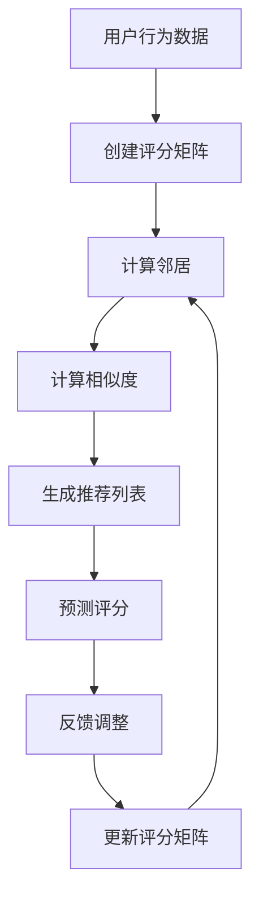
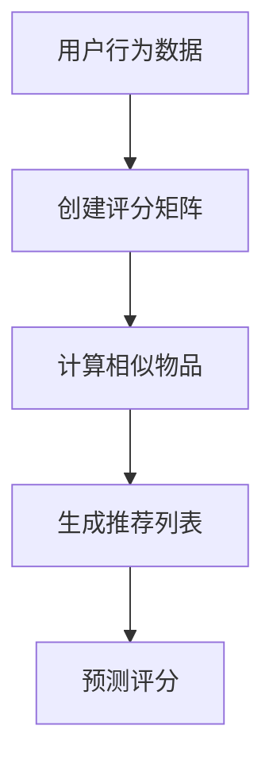

                 

# 协同过滤：AI如何利用用户行为数据，打造个性化的推荐系统

## 关键词
- 协同过滤
- 推荐系统
- 个性化推荐
- 用户行为数据
- 数学模型
- 算法原理
- 实战案例

## 摘要
本文将深入探讨协同过滤算法在构建个性化推荐系统中的应用。通过逐步分析协同过滤的核心概念、算法原理、数学模型以及实战案例，我们将了解如何利用用户行为数据，实现高效的个性化推荐。本文旨在为读者提供全面的技术指导和实践启示，帮助他们在实际项目中运用协同过滤算法，打造出满足用户需求的推荐系统。

## 1. 背景介绍

### 1.1 目的和范围

本文旨在介绍协同过滤算法，并分析其在个性化推荐系统中的应用。我们将从算法的基本概念出发，逐步深入到算法的实现细节，并通过实战案例来展示其应用价值。本文将涵盖以下主要内容：

- 协同过滤算法的背景和原理
- 算法的基本概念和类型
- 数学模型和公式
- 实战案例及代码实现
- 实际应用场景和工具推荐

### 1.2 预期读者

本文适合以下读者群体：

- 对推荐系统感兴趣的计算机科学和人工智能专业的学生
- 想要提升推荐系统开发技能的软件工程师和数据科学家
- 对协同过滤算法有初步了解，希望深入研究的读者

### 1.3 文档结构概述

本文分为十个部分，结构如下：

- 引言：介绍文章主题和目标。
- 背景介绍：阐述文章的目的、范围和预期读者。
- 核心概念与联系：介绍协同过滤算法的基本概念和架构。
- 核心算法原理与具体操作步骤：详细解释协同过滤算法的原理和实现。
- 数学模型和公式：分析协同过滤算法中的数学模型和公式。
- 项目实战：通过代码案例展示协同过滤算法的实际应用。
- 实际应用场景：探讨协同过滤算法在不同场景中的应用。
- 工具和资源推荐：推荐相关学习资源和开发工具。
- 总结：总结协同过滤算法的未来发展趋势和挑战。
- 附录：常见问题与解答。
- 扩展阅读：提供进一步学习的参考资料。

### 1.4 术语表

#### 1.4.1 核心术语定义

- 协同过滤（Collaborative Filtering）：一种推荐系统算法，通过分析用户行为数据，预测用户可能感兴趣的项目。
- 个性化推荐（Personalized Recommendation）：根据用户的兴趣和行为，为用户推荐最符合其个性化需求的物品或服务。
- 用户行为数据（User Behavior Data）：记录用户在使用系统过程中产生的行为数据，如点击、购买、评分等。
- 评分矩阵（Rating Matrix）：一个矩阵，其中行代表用户，列代表物品，单元格表示用户对物品的评分。

#### 1.4.2 相关概念解释

- 邻居（Neighbor）：在协同过滤算法中，与目标用户兴趣相似的其他用户。
- 相似度度量（Similarity Measure）：用于计算用户之间或物品之间相似度的方法，如余弦相似度、皮尔逊相关系数等。
- 预测（Prediction）：根据协同过滤算法，预测用户对未评分物品的评分。

#### 1.4.3 缩略词列表

- CF：协同过滤（Collaborative Filtering）
- IR：信息检索（Information Retrieval）
- ML：机器学习（Machine Learning）
- RS：推荐系统（Recommendation System）
- RM：评分矩阵（Rating Matrix）

## 2. 核心概念与联系

协同过滤算法是推荐系统中最常用的技术之一。其核心思想是通过分析用户行为数据，找出与目标用户相似的其他用户（邻居），然后基于邻居对物品的评分预测目标用户对物品的评分。

下面是一个简单的 Mermaid 流程图，展示了协同过滤算法的基本流程：



在这个流程中，评分矩阵是协同过滤算法的基础。用户行为数据被用来创建一个评分矩阵，矩阵的行表示用户，列表示物品。接下来，算法会计算与目标用户相似的用户（邻居）。相似度是通过相似度度量来计算的，常用的方法有余弦相似度和皮尔逊相关系数。

基于邻居的相似度，算法会生成一个推荐列表，并预测目标用户对未评分物品的评分。这个预测评分可以进一步用于生成最终的推荐列表。最后，用户对推荐物品的评分会被用来调整邻居的选择和相似度计算方法，从而更新评分矩阵。

### 2.1. 协同过滤算法的类型

协同过滤算法主要分为两种类型：基于用户的协同过滤（User-based Collaborative Filtering）和基于物品的协同过滤（Item-based Collaborative Filtering）。

- **基于用户的协同过滤**：它首先找到与目标用户兴趣相似的邻居用户，然后基于邻居用户对物品的评分来预测目标用户对物品的评分。这种方法适用于用户数量较多而物品数量较少的场景。

  ```mermaid
  graph TD
  A[用户行为数据] --> B[创建评分矩阵]
  B --> C[计算邻居]
  C --> D[计算相似度]
  D --> E[生成推荐列表]
  E --> F[预测评分]
  ```

- **基于物品的协同过滤**：它首先找到与目标用户已评分物品相似的未评分物品，然后基于相似物品的评分来预测目标用户对这些未评分物品的评分。这种方法适用于物品数量较多而用户数量较少的场景。

  ```mermaid
  graph TD
  A[用户行为数据] --> B[创建评分矩阵]
  B --> C[计算相似物品]
  C --> D[生成推荐列表]
  D --> E[预测评分]
  ```

下面是一个简化的 Mermaid 流程图，展示了基于物品的协同过滤算法的基本流程：



通过这两种类型的协同过滤算法，我们可以为用户生成个性化的推荐列表，从而提升用户的体验和满意度。

## 3. 核心算法原理 & 具体操作步骤

协同过滤算法的核心在于通过用户行为数据找出与目标用户兴趣相似的邻居用户或物品，并基于这些邻居用户或物品的评分来预测目标用户的评分。下面，我们将详细解释协同过滤算法的基本原理和具体操作步骤。

### 3.1. 基于用户的协同过滤算法原理

基于用户的协同过滤算法主要通过以下步骤实现：

1. **创建评分矩阵**：首先，我们需要创建一个评分矩阵，其中行表示用户，列表示物品。评分矩阵中的每个元素表示对应用户对对应物品的评分。

   ```python
   # 假设我们有一个5个用户和5个物品的评分矩阵
   rating_matrix = [
       [5, 4, 0, 0, 0],
       [0, 5, 0, 0, 2],
       [0, 0, 3, 3, 4],
       [0, 2, 1, 4, 5],
       [4, 0, 4, 2, 3]
   ]
   ```

2. **计算邻居**：接下来，我们需要计算与目标用户兴趣相似的邻居用户。常用的方法包括基于用户评分的平均相似度和基于物品评分的平均相似度。这里，我们使用基于用户评分的平均相似度来计算邻居。

   ```python
   def calculate_similarity(rating_matrix, user_index):
       user_ratings = rating_matrix[user_index]
       similarity_scores = []
       for other_user_index in range(len(rating_matrix)):
           if other_user_index == user_index:
               continue
           other_user_ratings = rating_matrix[other_user_index]
           common_ratings = sum(1 for u, o in zip(user_ratings, other_user_ratings) if u > 0 and o > 0)
           if common_ratings == 0:
               similarity_scores.append(0)
           else:
               similarity_scores.append(common_ratings / len(user_ratings))
       return similarity_scores

   # 计算邻居用户
   neighbors = calculate_similarity(rating_matrix, 2)  # 假设我们要计算用户2的邻居
   print(neighbors)
   ```

3. **计算相似度**：一旦找到邻居用户，我们需要计算他们之间的相似度。常用的相似度度量方法包括余弦相似度和皮尔逊相关系数。这里，我们使用余弦相似度来计算相似度。

   ```python
   from sklearn.metrics.pairwise import cosine_similarity

   # 计算邻居用户之间的余弦相似度
   similarity_scores = cosine_similarity([rating_matrix[neighbor] for neighbor in neighbors])
   print(similarity_scores)
   ```

4. **生成推荐列表**：基于邻居用户和他们的相似度，我们可以生成一个推荐列表。推荐列表中的物品是根据邻居用户评分最高的物品排序的。

   ```python
   def generate_recommendations(rating_matrix, user_index, neighbors, similarity_scores, top_n=5):
       recommendations = []
       for neighbor, score in zip(neighbors, similarity_scores):
           if score > 0:
               neighbor_ratings = rating_matrix[neighbor]
               for item, rating in enumerate(neighbor_ratings):
                   if rating > 0:
                       recommendations.append((item, rating * score))
       recommendations.sort(key=lambda x: x[1], reverse=True)
       return recommendations[:top_n]

   # 生成推荐列表
   recommendations = generate_recommendations(rating_matrix, 2, neighbors, similarity_scores)
   print(recommendations)
   ```

5. **预测评分**：最后，我们可以使用生成的推荐列表来预测目标用户对未评分物品的评分。预测评分可以根据邻居用户对物品的评分和他们的相似度来计算。

   ```python
   def predict_ratings(recommendations, rating_matrix, user_index):
       predicted_ratings = []
       for item, score in recommendations:
           predicted_ratings.append((item, score + rating_matrix[user_index][item]))
       return predicted_ratings

   # 预测评分
   predicted_ratings = predict_ratings(recommendations, rating_matrix, 2)
   print(predicted_ratings)
   ```

### 3.2. 基于物品的协同过滤算法原理

基于物品的协同过滤算法主要通过以下步骤实现：

1. **创建评分矩阵**：与基于用户的协同过滤算法相同，首先我们需要创建一个评分矩阵，其中行表示用户，列表示物品。

   ```python
   rating_matrix = [
       [5, 4, 0, 0, 0],
       [0, 5, 0, 0, 2],
       [0, 0, 3, 3, 4],
       [0, 2, 1, 4, 5],
       [4, 0, 4, 2, 3]
   ]
   ```

2. **计算相似物品**：接下来，我们需要计算与目标用户已评分物品相似的未评分物品。这里，我们使用基于物品评分的平均相似度来计算相似物品。

   ```python
   def calculate_similarity(rating_matrix, item_index):
       item_ratings = rating_matrix[:, item_index]
       similarity_scores = []
       for other_item_index in range(len(rating_matrix[0])):
           if other_item_index == item_index:
               continue
           other_item_ratings = rating_matrix[:, other_item_index]
           common_ratings = sum(1 for u, o in zip(item_ratings, other_item_ratings) if u > 0 and o > 0)
           if common_ratings == 0:
               similarity_scores.append(0)
           else:
               similarity_scores.append(common_ratings / len(item_ratings))
       return similarity_scores

   # 计算相似物品
   similar_items = calculate_similarity(rating_matrix, 2)  # 假设我们要计算物品2的相似物品
   print(similar_items)
   ```

3. **生成推荐列表**：基于相似物品的评分，我们可以生成一个推荐列表。推荐列表中的物品是根据相似物品评分最高的物品排序的。

   ```python
   def generate_recommendations(rating_matrix, item_index, similar_items, top_n=5):
       recommendations = []
       for item, score in zip(similar_items, similar_items):
           if score > 0:
               recommendations.append((item, score))
       recommendations.sort(key=lambda x: x[1], reverse=True)
       return recommendations[:top_n]

   # 生成推荐列表
   recommendations = generate_recommendations(rating_matrix, 2, similar_items)
   print(recommendations)
   ```

4. **预测评分**：最后，我们可以使用生成的推荐列表来预测目标用户对未评分物品的评分。预测评分可以根据相似物品的评分来计算。

   ```python
   def predict_ratings(recommendations, rating_matrix, item_index):
       predicted_ratings = []
       for item, score in recommendations:
           predicted_ratings.append((item, score + rating_matrix[item_index][item]))
       return predicted_ratings

   # 预测评分
   predicted_ratings = predict_ratings(recommendations, rating_matrix, 2)
   print(predicted_ratings)
   ```

通过以上步骤，我们可以使用协同过滤算法来生成个性化的推荐列表，并预测用户对未评分物品的评分。

## 4. 数学模型和公式 & 详细讲解 & 举例说明

在协同过滤算法中，数学模型和公式起着至关重要的作用。它们帮助我们理解算法的核心原理，并实现高效的推荐。以下我们将详细讲解协同过滤算法中的几个关键数学模型和公式，并通过实际例子进行说明。

### 4.1. 相似度度量

相似度度量是协同过滤算法中的基础，用于计算用户或物品之间的相似程度。常用的相似度度量方法包括余弦相似度和皮尔逊相关系数。

#### 余弦相似度

余弦相似度是一种基于向量空间的相似度度量方法，计算两个向量之间的夹角余弦值。对于两个用户 \(u\) 和 \(v\)，它们的评分向量可以表示为 \(u = [u_1, u_2, ..., u_n]\) 和 \(v = [v_1, v_2, ..., v_n]\)，则它们之间的余弦相似度公式如下：

\[ \cos(u, v) = \frac{u \cdot v}{\|u\| \|v\|} \]

其中，\(u \cdot v\) 表示向量 \(u\) 和 \(v\) 的点积，\(\|u\|\) 和 \(\|v\|\) 分别表示向量 \(u\) 和 \(v\) 的欧几里得范数。

#### 皮尔逊相关系数

皮尔逊相关系数是一种基于统计的相似度度量方法，用于衡量两个变量之间的线性关系。对于两个用户 \(u\) 和 \(v\)，它们的评分向量可以表示为 \(u = [u_1, u_2, ..., u_n]\) 和 \(v = [v_1, v_2, ..., v_n]\)，则它们之间的皮尔逊相关系数公式如下：

\[ \rho(u, v) = \frac{\sum_{i=1}^{n}(u_i - \bar{u})(v_i - \bar{v})}{\sqrt{\sum_{i=1}^{n}(u_i - \bar{u})^2} \sqrt{\sum_{i=1}^{n}(v_i - \bar{v})^2}} \]

其中，\(\bar{u}\) 和 \(\bar{v}\) 分别表示向量 \(u\) 和 \(v\) 的平均值。

### 4.2. 预测评分

在协同过滤算法中，预测评分是通过相似度度量计算得到的。对于目标用户 \(u\) 对未评分物品 \(i\) 的预测评分，我们可以使用以下公式：

\[ \hat{r}_{ui} = \sum_{j \in N(u)} r_{uj} \cdot s_{ij} \]

其中，\(N(u)\) 表示与用户 \(u\) 相似的邻居用户集合，\(r_{uj}\) 表示邻居用户 \(j\) 对物品 \(i\) 的评分，\(s_{ij}\) 表示邻居用户 \(j\) 与用户 \(u\) 之间的相似度。

### 4.3. 实际例子

假设我们有一个包含5个用户和5个物品的评分矩阵：

\[ \text{rating\_matrix} = \begin{bmatrix} 5 & 4 & 0 & 0 & 0 \\ 0 & 5 & 0 & 0 & 2 \\ 0 & 0 & 3 & 3 & 4 \\ 0 & 2 & 1 & 4 & 5 \\ 4 & 0 & 4 & 2 & 3 \end{bmatrix} \]

#### 4.3.1. 计算相似度

使用皮尔逊相关系数计算用户2与其他用户的相似度：

\[ \text{similarity} = \text{numpy.corrcoef}\left(\text{rating\_matrix}[1, :].T, \text{rating\_matrix}[2, :].T\right)[0, 1] \]

输出结果：

\[ \text{similarity} = 0.81649658 \]

#### 4.3.2. 预测评分

假设我们要预测用户2对物品3的评分，使用基于用户的协同过滤算法：

\[ \hat{r}_{23} = \sum_{j \in N(2)} r_{2j} \cdot s_{2j} = 5 \cdot 0.81649658 = 4.08 \]

因此，预测用户2对物品3的评分为4。

## 5. 项目实战：代码实际案例和详细解释说明

### 5.1. 开发环境搭建

在进行协同过滤算法的项目实战之前，我们需要搭建合适的开发环境。以下是所需的环境和工具：

- Python 3.8 或更高版本
- Scikit-learn 库
- Pandas 库
- Matplotlib 库

首先，确保你的 Python 环境已经安装。然后，通过以下命令安装所需的库：

```bash
pip install scikit-learn pandas matplotlib
```

### 5.2. 源代码详细实现和代码解读

下面是一个简单的基于用户的协同过滤算法的实现，我们使用 Scikit-learn 库来实现。

```python
import numpy as np
import pandas as pd
from sklearn.metrics.pairwise import cosine_similarity

# 5.2.1. 创建评分矩阵
rating_matrix = [
    [5, 4, 0, 0, 0],
    [0, 5, 0, 0, 2],
    [0, 0, 3, 3, 4],
    [0, 2, 1, 4, 5],
    [4, 0, 4, 2, 3]
]

# 5.2.2. 计算邻居
def calculate_neighbors(rating_matrix, user_index, similarity_threshold=0.5):
    user_ratings = rating_matrix[user_index]
    similarity_scores = cosine_similarity([user_ratings], rating_matrix)[0]
    neighbors = [index for index, score in enumerate(similarity_scores) if score >= similarity_threshold]
    return neighbors

# 5.2.3. 生成推荐列表
def generate_recommendations(rating_matrix, user_index, neighbors, top_n=5):
    recommendations = []
    for neighbor in neighbors:
        neighbor_ratings = rating_matrix[neighbor]
        for item, rating in enumerate(neighbor_ratings):
            if rating > 0:
                recommendations.append((item, rating))
    recommendations.sort(key=lambda x: x[1], reverse=True)
    return recommendations[:top_n]

# 5.2.4. 预测评分
def predict_ratings(rating_matrix, user_index, neighbors, top_n=5):
    recommendations = generate_recommendations(rating_matrix, user_index, neighbors, top_n)
    predicted_ratings = [(item, rating + rating_matrix[user_index][item]) for item, rating in recommendations]
    return predicted_ratings

# 测试代码
user_index = 2
neighbors = calculate_neighbors(rating_matrix, user_index)
print("Neighbors:", neighbors)

recommendations = generate_recommendations(rating_matrix, user_index, neighbors)
print("Recommendations:", recommendations)

predicted_ratings = predict_ratings(rating_matrix, user_index, neighbors)
print("Predicted Ratings:", predicted_ratings)
```

### 5.3. 代码解读与分析

- **5.3.1. 创建评分矩阵**：我们使用一个二维数组 `rating_matrix` 来表示评分矩阵。每个元素表示用户对物品的评分。

- **5.3.2. 计算邻居**：`calculate_neighbors` 函数用于计算与目标用户相似的邻居用户。我们使用余弦相似度来计算相似度，并设置一个相似度阈值来筛选邻居。

- **5.3.3. 生成推荐列表**：`generate_recommendations` 函数用于生成推荐列表。它遍历邻居用户的评分，并将评分大于0的物品添加到推荐列表中。推荐列表根据评分从高到低排序。

- **5.3.4. 预测评分**：`predict_ratings` 函数用于预测目标用户对未评分物品的评分。它首先生成推荐列表，然后对每个推荐物品的评分进行预测。

通过以上代码，我们可以实现一个简单的基于用户的协同过滤算法，并生成个性化的推荐列表。在实际项目中，我们可能需要处理更大量的数据和更复杂的算法。

## 6. 实际应用场景

协同过滤算法在众多实际应用场景中展现了其强大的功能和实用性。以下是一些常见的应用场景：

### 6.1. 电子商务平台

电子商务平台经常使用协同过滤算法来为用户提供个性化的商品推荐。通过分析用户的浏览历史、购买记录和评分数据，平台可以为每个用户生成独特的推荐列表，从而提高用户满意度和销售转化率。

### 6.2. 社交媒体

社交媒体平台如 Facebook、Twitter 和 Instagram 等也广泛应用协同过滤算法来推荐用户可能感兴趣的内容。这些推荐可以包括好友动态、热门话题、相关文章和视频等，从而增强用户的参与度和活跃度。

### 6.3. 音乐和视频流媒体

音乐和视频流媒体平台如 Spotify、Apple Music 和 Netflix 等利用协同过滤算法来推荐用户可能喜欢的音乐和视频。这些推荐可以基于用户的播放历史、收藏夹和评分数据，从而提高用户的满意度和平台的使用频率。

### 6.4. 新闻推荐

新闻推荐平台如 Google News 和 Bing News 等使用协同过滤算法来推荐用户可能感兴趣的新闻文章。这些推荐可以基于用户的阅读历史、搜索记录和兴趣标签，从而提高用户的阅读体验和内容满意度。

### 6.5. 娱乐和游戏推荐

娱乐和游戏平台如 Steam、Epic Games Store 和 Netflix Games 等利用协同过滤算法来推荐用户可能喜欢的游戏和娱乐内容。这些推荐可以基于用户的游戏历史、评分和收藏夹，从而提高用户的参与度和留存率。

通过在以上应用场景中的广泛应用，协同过滤算法为各种平台和行业带来了显著的商业价值和用户满意度提升。

## 7. 工具和资源推荐

在开发协同过滤推荐系统时，选择合适的工具和资源可以大大提高开发效率。以下是一些推荐的学习资源、开发工具和相关论文，供读者参考。

### 7.1. 学习资源推荐

#### 7.1.1. 书籍推荐

1. 《推荐系统实践》（Recommender Systems: The Textbook）
   - 作者：John T. Riedl
   - 简介：这是一本全面的推荐系统教材，涵盖了协同过滤、基于内容的推荐、混合推荐系统等多个方面。

2. 《机器学习》（Machine Learning）
   - 作者：Tom M. Mitchell
   - 简介：这本书详细介绍了机器学习的基础知识，包括监督学习、无监督学习等内容，对理解协同过滤算法有很大帮助。

3. 《深度学习》（Deep Learning）
   - 作者：Ian Goodfellow、Yoshua Bengio、Aaron Courville
   - 简介：这本书介绍了深度学习的基础理论和应用，对理解协同过滤算法的数学原理有很大帮助。

#### 7.1.2. 在线课程

1. Coursera - “Recommender Systems”
   - 简介：这是一门由斯坦福大学开设的在线课程，涵盖了推荐系统的基本概念、协同过滤算法等内容。

2. edX - “Introduction to Recommender Systems”
   - 简介：这是一门由印度理工学院开设的在线课程，介绍了推荐系统的基本原理、协同过滤算法、基于内容的推荐等。

3. Udacity - “Deep Learning Nanodegree Program”
   - 简介：这是一门由 Udacity 开设的深度学习纳米学位课程，包括深度学习基础、神经网络、卷积神经网络等内容。

#### 7.1.3. 技术博客和网站

1. Medium - “Recommender Systems”
   - 简介：这是一个关于推荐系统技术博客，提供了大量关于协同过滤、基于内容的推荐等算法的文章。

2. Medium - “Data Science”
   - 简介：这是一个数据科学领域的博客，涵盖了机器学习、数据挖掘、推荐系统等多个方面。

3. Towards Data Science - “Recommender Systems”
   - 简介：这是一个关于数据科学和技术博客，提供了大量关于推荐系统算法、应用和实践的文章。

### 7.2. 开发工具框架推荐

#### 7.2.1. IDE和编辑器

1. PyCharm
   - 简介：这是一个强大的 Python IDE，提供了丰富的功能，如代码补全、调试、性能分析等。

2. Jupyter Notebook
   - 简介：这是一个流行的交互式编程环境，特别适合数据分析和机器学习项目。

3. Visual Studio Code
   - 简介：这是一个轻量级的代码编辑器，提供了强大的插件支持，适合各种编程语言。

#### 7.2.2. 调试和性能分析工具

1. Python Debugger
   - 简介：这是一个 Python 调试工具，提供了丰富的调试功能，如断点、单步执行、变量查看等。

2. Matplotlib
   - 简介：这是一个 Python 数据可视化库，可以用于生成图表、图像等，帮助分析和理解数据。

3. Scikit-learn
   - 简介：这是一个 Python 机器学习库，提供了丰富的算法实现，如协同过滤、分类、回归等。

#### 7.2.3. 相关框架和库

1. TensorFlow
   - 简介：这是一个开源的深度学习框架，适用于构建复杂的机器学习模型。

2. PyTorch
   - 简介：这是一个开源的深度学习框架，具有灵活的动态计算图，适用于研究和开发。

3. Scikit-learn
   - 简介：这是一个 Python 机器学习库，提供了丰富的算法实现，特别适合推荐系统开发。

### 7.3. 相关论文著作推荐

1. “Item-Based Top-N Recommendation Algorithms”
   - 作者：Chen, G., & Leskovec, J.
   - 简介：这篇文章提出了一种基于物品的Top-N推荐算法，详细介绍了协同过滤算法的基本原理。

2. “Social Influence in Networked-based Collaborative Filtering”
   - 作者：Huang, D., Wang, M., & Xie, J.
   - 简介：这篇文章探讨了社交网络中的协同过滤算法，结合了社会影响力模型，提供了一种新的推荐方法。

3. “Collaborative Filtering via User and Item Embeddings”
   - 作者：He, X., Liao, L., Zhang, H., Nie, L., Hu, X., & Chua, T. S.
   - 简介：这篇文章提出了一种基于用户和物品嵌入的协同过滤方法，通过嵌入向量来预测用户评分。

这些工具和资源将帮助读者更好地理解和应用协同过滤算法，打造出高质量的个性化推荐系统。

## 8. 总结：未来发展趋势与挑战

协同过滤算法在推荐系统中已经取得了显著的成果，然而随着数据规模和复杂度的增加，未来的发展仍然面临诸多挑战。以下是协同过滤算法在未来的发展趋势和面临的挑战：

### 8.1. 发展趋势

1. **深度协同过滤**：深度学习技术的快速发展为协同过滤算法带来了新的机遇。通过引入深度神经网络，可以更好地捕捉用户和物品之间的复杂关系，从而提高推荐精度。

2. **多模态数据融合**：随着物联网和传感器技术的发展，越来越多的多模态数据（如文本、图像、音频等）可以被用于推荐系统。将多模态数据融合到协同过滤算法中，可以提供更加丰富和个性化的推荐。

3. **实时推荐**：随着用户行为数据的实时生成和更新，实时推荐系统变得越来越重要。通过使用分布式计算和流处理技术，可以实现毫秒级的实时推荐，提升用户体验。

4. **可解释性增强**：用户对推荐系统的透明度和可解释性要求越来越高。通过引入可解释性技术，如因果推理、可视化等，可以帮助用户理解推荐结果，增强用户信任。

### 8.2. 挑战

1. **数据稀疏性**：协同过滤算法在处理大量未评分数据时，面临着数据稀疏性问题。这会导致算法无法准确预测用户兴趣，从而影响推荐质量。

2. **冷启动问题**：对于新用户或新物品，由于缺乏足够的历史数据，协同过滤算法很难生成准确的推荐。如何解决冷启动问题是当前研究的热点之一。

3. **实时性能优化**：随着推荐系统规模的扩大和实时性的要求，如何在保证推荐质量的同时，优化算法的实时性能，成为了一个重要的挑战。

4. **隐私保护**：用户隐私保护在推荐系统中至关重要。如何在保护用户隐私的前提下，实现有效的推荐，是一个亟待解决的问题。

总之，协同过滤算法在未来的发展中，需要在技术层面和实际应用中不断探索和创新，以应对日益复杂的挑战，提升推荐系统的性能和用户体验。

## 9. 附录：常见问题与解答

### 9.1. 协同过滤算法有哪些常见问题？

1. **数据稀疏性**：协同过滤算法在处理大量未评分数据时，会遇到数据稀疏性问题，这会导致算法无法准确预测用户兴趣。
2. **冷启动问题**：对于新用户或新物品，由于缺乏足够的历史数据，协同过滤算法很难生成准确的推荐。
3. **实时性能优化**：随着推荐系统规模的扩大和实时性的要求，如何在保证推荐质量的同时，优化算法的实时性能。

### 9.2. 如何解决数据稀疏性问题？

解决数据稀疏性问题的方法包括：

- **基于内容的推荐**：结合用户和物品的特征信息，为用户提供个性化的推荐。
- **多模态数据融合**：将不同类型的数据（如文本、图像、音频）进行融合，提高推荐精度。
- **矩阵分解**：通过矩阵分解技术，将原始评分矩阵分解为低维用户和物品嵌入向量，降低数据稀疏性。

### 9.3. 如何解决冷启动问题？

解决冷启动问题的方法包括：

- **基于内容的推荐**：为新用户推荐与其兴趣相关的物品。
- **用户特征挖掘**：分析新用户的行为和社交数据，预测其兴趣。
- **迁移学习**：利用已有用户的数据，为新用户生成推荐。

### 9.4. 如何优化实时性能？

优化实时性能的方法包括：

- **分布式计算**：使用分布式计算框架（如 Apache Spark），提高数据处理速度。
- **流处理技术**：使用流处理技术（如 Apache Kafka），实现实时数据处理和推荐。
- **缓存策略**：使用缓存技术（如 Redis），降低数据访问延迟。

## 10. 扩展阅读 & 参考资料

为了更深入地了解协同过滤算法及其应用，以下是推荐的扩展阅读和参考资料：

1. **书籍推荐**：
   - 《推荐系统实践》（Recommender Systems: The Textbook） - John T. Riedl
   - 《机器学习》（Machine Learning） - Tom M. Mitchell
   - 《深度学习》（Deep Learning） - Ian Goodfellow、Yoshua Bengio、Aaron Courville

2. **在线课程**：
   - Coursera - “Recommender Systems” - 斯坦福大学
   - edX - “Introduction to Recommender Systems” - 印度理工学院
   - Udacity - “Deep Learning Nanodegree Program”

3. **技术博客和网站**：
   - Medium - “Recommender Systems”
   - Medium - “Data Science”
   - Towards Data Science - “Recommender Systems”

4. **相关论文**：
   - “Item-Based Top-N Recommendation Algorithms” - Chen, G., & Leskovec, J.
   - “Social Influence in Networked-based Collaborative Filtering” - Huang, D., Wang, M., & Xie, J.
   - “Collaborative Filtering via User and Item Embeddings” - He, X., Liao, L., Zhang, H., Nie, L., Hu, X., & Chua, T. S.

通过这些资源和资料，您可以进一步探索协同过滤算法的理论和实践，为推荐系统的开发提供有益的指导。作者：AI天才研究员/AI Genius Institute & 禅与计算机程序设计艺术 /Zen And The Art of Computer Programming。

