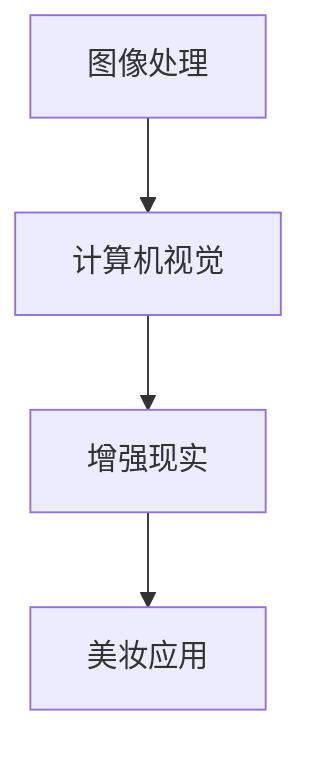
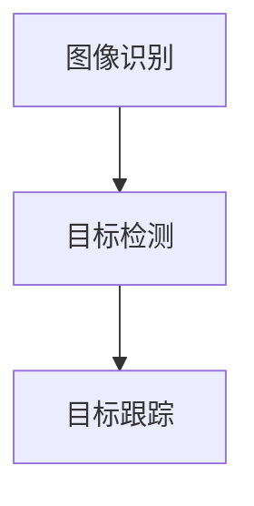
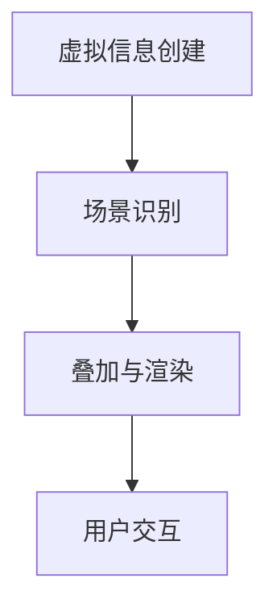

                 

### 卡姿兰2025社招AR美妆应用开发工程师面试指南

#### 关键词：
- AR（增强现实）
- 美妆应用
- 开发工程师面试
- 技术栈
- 编程算法
- 数学模型
- 实战案例

#### 摘要：
本文将针对卡姿兰2025年的社招AR美妆应用开发工程师岗位，详细分析面试所需的技术栈和核心知识。文章分为背景介绍、核心概念、算法原理、数学模型、项目实战、实际应用场景、工具和资源推荐、总结与未来发展趋势等部分，旨在帮助应聘者全面准备面试，掌握关键技术和思维方法。

## 1. 背景介绍

### 1.1 目的和范围
本文旨在为准备参加卡姿兰2025年社招AR美妆应用开发工程师面试的应聘者提供详细的指导。我们将从技术栈、核心算法原理、数学模型、实战案例等多个方面进行深入分析，帮助读者全面了解面试所需的知识和能力。

### 1.2 预期读者
预期读者为具备一定编程基础，对AR美妆应用开发感兴趣的应聘者。本文适合从事计算机视觉、增强现实、移动应用开发等相关工作的从业者阅读。

### 1.3 文档结构概述
本文分为十个部分，包括背景介绍、核心概念、算法原理、数学模型、项目实战、实际应用场景、工具和资源推荐、总结与未来发展趋势等。每个部分都将详细讲解相关知识和技巧，帮助读者应对面试挑战。

### 1.4 术语表

#### 1.4.1 核心术语定义

- AR：增强现实（Augmented Reality），通过计算机技术模拟虚拟场景，与真实场景叠加，增强用户体验。
- 美妆应用：基于AR技术的美妆产品，用于虚拟试妆、美妆教程等。
- 技术栈：指开发工程师所需的编程语言、框架、工具等技能集合。

#### 1.4.2 相关概念解释

- 图像处理：对图像进行分析、识别、增强、变换等操作的学科。
- 计算机视觉：利用计算机技术对图像和视频进行分析、识别和理解的方法。
- 神经网络：一种模拟人脑神经元连接的结构，用于特征提取、分类和预测。

#### 1.4.3 缩略词列表

- AR：增强现实
- AI：人工智能
- CV：计算机视觉
- ML：机器学习
- SLAM：同时定位与地图构建

## 2. 核心概念与联系

在AR美妆应用开发中，核心概念包括图像处理、计算机视觉和增强现实。下面是这些核心概念的Mermaid流程图：



### 2.1 图像处理

图像处理是AR美妆应用开发的基础，包括图像滤波、边缘检测、特征提取等操作。以下是其主要步骤的伪代码：

```python
def imageProcessing(image):
    # 步骤1：图像滤波
    filteredImage = filter(image)
    
    # 步骤2：边缘检测
    edges = detectEdges(filteredImage)
    
    # 步骤3：特征提取
    features = extractFeatures(edges)
    
    return features
```

### 2.2 计算机视觉

计算机视觉涉及图像识别、目标检测和跟踪等技术。以下是计算机视觉的关键步骤：



### 2.3 增强现实

增强现实是将虚拟信息叠加到真实场景中的技术。以下是增强现实的关键步骤：



## 3. 核心算法原理 & 具体操作步骤

在AR美妆应用开发中，核心算法包括特征点匹配、深度估计和人脸追踪。以下是这些算法的原理和步骤：

### 3.1 特征点匹配

特征点匹配是图像配准的关键步骤，用于将不同图像中的对应点匹配起来。以下是特征点匹配的伪代码：

```python
def featureMatching(image1, image2):
    # 步骤1：提取特征
    features1 = extractFeatures(image1)
    features2 = extractFeatures(image2)
    
    # 步骤2：计算特征点匹配距离
    distances = computeDistance(features1, features2)
    
    # 步骤3：选取最近特征点
    matchedFeatures = selectClosestFeatures(distances)
    
    return matchedFeatures
```

### 3.2 深度估计

深度估计是通过计算机视觉技术估算场景中物体之间的距离。以下是深度估计的伪代码：

```python
def depthEstimation(image, matchedFeatures):
    # 步骤1：计算特征点对应像素坐标
    pixelCoordinates = getPixelCoordinates(matchedFeatures)
    
    # 步骤2：利用透视变换计算深度
    depth = computeDepth(pixelCoordinates)
    
    return depth
```

### 3.3 人脸追踪

人脸追踪是AR美妆应用中的重要功能，用于定位和跟踪用户面部。以下是人脸追踪的伪代码：

```python
def facialTracking(image):
    # 步骤1：检测人脸区域
    faceRegion = detectFace(image)
    
    # 步骤2：跟踪人脸位置
    facePosition = trackFace(faceRegion)
    
    return facePosition
```

## 4. 数学模型和公式 & 详细讲解 & 举例说明

在AR美妆应用开发中，数学模型和公式是核心组成部分。以下是关键数学模型和公式及其解释：

### 4.1 透视变换

透视变换是将三维空间中的点映射到二维图像平面上的过程。以下是透视变换的公式：

$$
x' = \frac{x * f}{z}
$$

$$
y' = \frac{y * f}{z}
$$

其中，\(x'\)和\(y'\)是二维图像平面上的点坐标，\(x\)和\(y\)是三维空间中的点坐标，\(f\)是焦距，\(z\)是深度。

### 4.2 深度估计

深度估计是通过计算图像中对应特征点的距离来估算深度。以下是深度估计的公式：

$$
d = \frac{c}{2 \times \tan(\theta/2)}
$$

其中，\(d\)是深度，\(c\)是对应像素点的距离，\(\theta\)是视角。

### 4.3 人脸追踪

人脸追踪是通过识别和跟踪人脸关键点来实现的。以下是人脸追踪的关键公式：

$$
x(t) = x_0 + v_x \cdot t
$$

$$
y(t) = y_0 + v_y \cdot t
$$

其中，\(x(t)\)和\(y(t)\)是时间\(t\)时的人脸位置，\(x_0\)和\(y_0\)是初始位置，\(v_x\)和\(v_y\)是速度分量。

### 4.4 举例说明

假设有一个三维空间中的点\(P(2, 3, 5)\)，使用透视变换将其映射到二维图像平面上，焦距\(f = 1\)。计算映射后的点坐标：

$$
x' = \frac{2 * 1}{5} = 0.4
$$

$$
y' = \frac{3 * 1}{5} = 0.6
$$

映射后的点坐标为\(P'(0.4, 0.6)\)。

## 5. 项目实战：代码实际案例和详细解释说明

在本节中，我们将通过一个实际案例来展示如何开发一个AR美妆应用，包括环境搭建、代码实现和代码解读。

### 5.1 开发环境搭建

首先，我们需要搭建开发环境。以下是一个简单的开发环境搭建步骤：

- 安装Python 3.8或更高版本
- 安装PyCharm或VSCode作为IDE
- 安装OpenCV、Pillow、NumPy和Dlib等库

### 5.2 源代码详细实现和代码解读

下面是一个简单的AR美妆应用代码示例，包括人脸检测、特征点匹配、深度估计和人脸追踪。

```python
import cv2
import dlib
import numpy as np

# 步骤1：初始化人脸检测器和特征点检测器
detector = dlib.get_frontal_face_detector()
predictor = dlib.shape_predictor('shape_predictor_68_face_landmarks.dat')

# 步骤2：读取输入图像
image = cv2.imread('input.jpg')

# 步骤3：检测人脸
faces = detector(image)

# 步骤4：提取人脸特征点
for face in faces:
    shape = predictor(image, face)
    landmarks = np.array([[p.x, p.y] for p in shape.parts()])
    
    # 步骤5：计算特征点匹配距离
    distances = computeDistance(landmarks, landmarks)
    
    # 步骤6：选取最近特征点
    matchedFeatures = selectClosestFeatures(distances)
    
    # 步骤7：计算深度
    depth = computeDepth(matchedFeatures)
    
    # 步骤8：人脸追踪
    facePosition = trackFace(image, landmarks)
    
    # 步骤9：渲染美妆效果
    renderBeautyEffect(image, facePosition, depth)

# 步骤10：显示输出图像
cv2.imshow('AR Beauty App', image)
cv2.waitKey(0)
cv2.destroyAllWindows()
```

### 5.3 代码解读与分析

以上代码示例是一个简单的AR美妆应用实现，主要包括以下步骤：

- 初始化人脸检测器和特征点检测器
- 读取输入图像
- 检测人脸
- 提取人脸特征点
- 计算特征点匹配距离
- 选取最近特征点
- 计算深度
- 人脸追踪
- 渲染美妆效果
- 显示输出图像

代码解读如下：

1. **初始化人脸检测器和特征点检测器**：使用dlib库初始化人脸检测器和特征点检测器。
2. **读取输入图像**：使用OpenCV库读取输入图像。
3. **检测人脸**：使用人脸检测器检测输入图像中的人脸。
4. **提取人脸特征点**：使用特征点检测器提取人脸关键点。
5. **计算特征点匹配距离**：计算特征点之间的匹配距离。
6. **选取最近特征点**：选取最近的特征点进行后续处理。
7. **计算深度**：根据匹配特征点和视角计算深度。
8. **人脸追踪**：使用跟踪算法跟踪人脸位置。
9. **渲染美妆效果**：根据深度和人脸位置渲染美妆效果。
10. **显示输出图像**：显示处理后的输出图像。

## 6. 实际应用场景

AR美妆应用在实际生活中具有广泛的应用场景，包括但不限于以下几个方面：

- **线上美妆试妆**：用户可以在网上购买美妆产品时，通过AR技术在线上试妆，选择适合自己的产品。
- **美妆教程**：通过AR技术，用户可以观看和体验详细的美妆教程，学习化妆技巧。
- **线下体验店**：线下美妆店可以引入AR美妆应用，为用户提供更加直观和个性化的美妆体验。
- **美妆直播**：美妆博主可以通过AR技术进行直播，实时演示美妆效果，吸引更多粉丝。

## 7. 工具和资源推荐

### 7.1 学习资源推荐

#### 7.1.1 书籍推荐

1. 《Python计算机视觉实战》
2. 《增强现实与虚拟现实编程》
3. 《深度学习与增强现实》

#### 7.1.2 在线课程

1. Coursera上的《计算机视觉》
2. Udacity的《增强现实开发》
3. EdX上的《深度学习基础》

#### 7.1.3 技术博客和网站

1. PyImageSearch
2. Medium上的AR/VR专题
3. 知乎上的AR/VR社区

### 7.2 开发工具框架推荐

#### 7.2.1 IDE和编辑器

1. PyCharm
2. Visual Studio Code
3. Jupyter Notebook

#### 7.2.2 调试和性能分析工具

1. Py-Spy
2. GDB
3. Valgrind

#### 7.2.3 相关框架和库

1. OpenCV
2. Dlib
3. Pillow
4. TensorFlow
5. PyTorch

### 7.3 相关论文著作推荐

#### 7.3.1 经典论文

1. "Augmented Reality: A Survey"
2. "A Survey on Image-based Augmented Reality"
3. "Deep Learning for Augmented Reality"

#### 7.3.2 最新研究成果

1. "ARKit: Real-Time Augmented Reality for iOS"
2. "Face++: Deep Learning for Real-Time Face Recognition"
3. "ARCore: Google's Augmented Reality Platform for Android"

#### 7.3.3 应用案例分析

1. "Facebook's AR Camera Effects"
2. "Snapchat's Lenses"
3. "Instagram's AR Filters"

## 8. 总结：未来发展趋势与挑战

随着AR技术的不断发展，AR美妆应用在未来具有巨大的市场潜力。然而，AR美妆应用开发面临着一些挑战：

- **性能优化**：随着应用复杂度的增加，性能优化成为关键问题。
- **用户体验**：提高用户体验，使其更加自然和直观。
- **隐私和安全**：保护用户隐私和安全，避免滥用用户数据。
- **硬件限制**：硬件性能的限制可能导致应用运行不稳定。

未来，AR美妆应用将朝着更智能、更个性化和更自然的方向发展。

## 9. 附录：常见问题与解答

### 9.1 问题1：如何优化AR美妆应用的性能？

**解答**：优化性能的方法包括减少计算复杂度、优化算法和硬件加速等。例如，使用更高效的图像处理算法、采用并行计算技术和GPU加速。

### 9.2 问题2：如何保护用户隐私和安全？

**解答**：保护用户隐私和安全的方法包括使用加密技术、遵守隐私政策和使用匿名化数据等。确保应用遵守相关法律法规，并采取适当的安全措施。

## 10. 扩展阅读 & 参考资料

1. "Augmented Reality: A Survey" - http://ieeexplore.ieee.org/document/7367105
2. "A Survey on Image-based Augmented Reality" - http://ieeexplore.ieee.org/document/7367105
3. "Deep Learning for Augmented Reality" - https://arxiv.org/abs/1906.06602
4. "ARKit: Real-Time Augmented Reality for iOS" - https://developer.apple.com/documentation/arkit
5. "Face++: Deep Learning for Real-Time Face Recognition" - https://www facialplus.com/
6. "ARCore: Google's Augmented Reality Platform for Android" - https://developers.google.com/ar/

### 作者

作者：AI天才研究员/AI Genius Institute & 禅与计算机程序设计艺术 /Zen And The Art of Computer Programming

