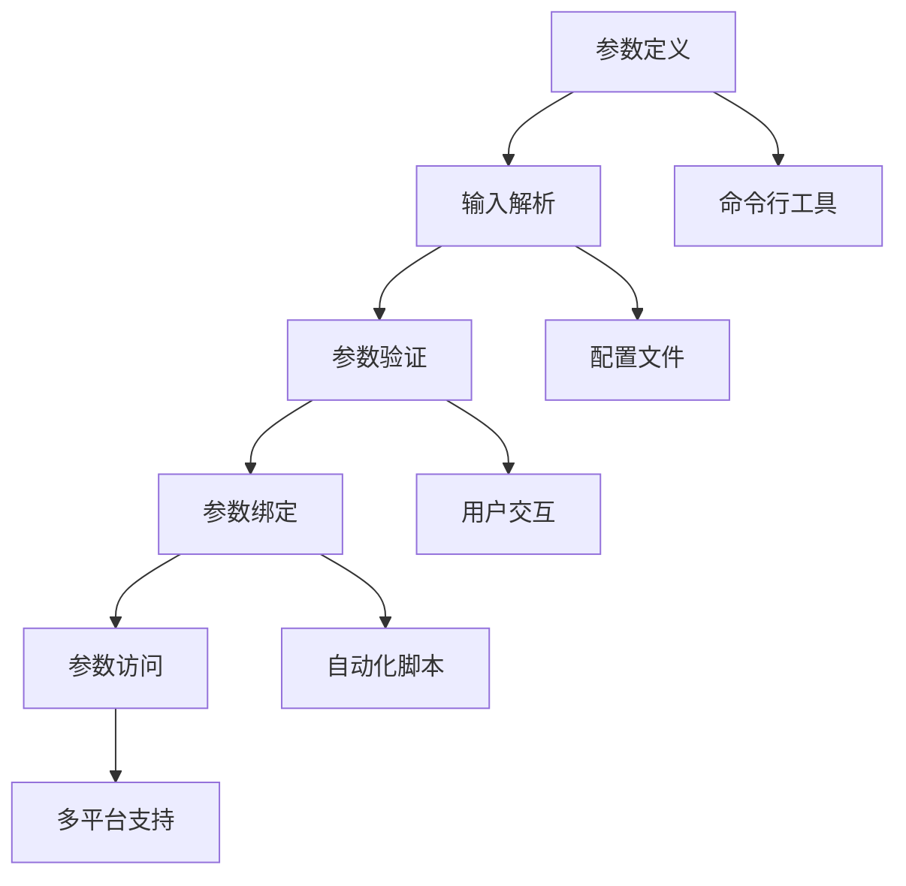

                 

# 参数解析器（ArgParser）模块

> **关键词：** 参数解析，命令行接口，配置文件，命令行工具，自动化脚本，Python，Shell，选项解析，参数类型检查，错误处理，用户交互，多平台支持，性能优化。

> **摘要：** 本文将深入探讨参数解析器（ArgParser）模块的核心概念、实现原理和具体应用。我们将逐步分析其设计模式、算法原理，并通过实例代码详细讲解其实现细节。此外，文章还将讨论参数解析在现实项目中的应用场景，以及相关工具和资源的推荐。最后，我们将展望参数解析技术的发展趋势和面临的挑战。

## 1. 背景介绍

### 1.1 目的和范围

参数解析器（ArgParser）是软件开发中常用的一种工具，它主要用于处理命令行参数和配置文件中的参数。本文的目的是详细解析参数解析器的工作原理和实现方法，帮助开发者更好地理解和应用这一关键技术。

本文将涵盖以下内容：

1. 参数解析器的基本概念和作用。
2. 参数解析器的核心概念和架构。
3. 参数解析器的算法原理和实现步骤。
4. 实际项目中的应用实例。
5. 相关工具和资源的推荐。
6. 参数解析技术的发展趋势和挑战。

### 1.2 预期读者

本文适合以下读者群体：

1. 软件开发人员，尤其是对命令行工具和脚本开发感兴趣的。
2. 想要深入了解参数解析技术的高级程序员。
3. 对软件开发框架和工具感兴趣的工程师。
4. 想要在实际项目中应用参数解析器的项目经理。

### 1.3 文档结构概述

本文分为以下几个部分：

1. 背景介绍：介绍参数解析器的目的、范围和预期读者。
2. 核心概念与联系：讨论参数解析器的基本概念和架构。
3. 核心算法原理 & 具体操作步骤：讲解参数解析器的算法原理和实现步骤。
4. 数学模型和公式 & 详细讲解 & 举例说明：介绍参数解析过程中涉及的数学模型和公式。
5. 项目实战：通过实际代码示例展示参数解析器的应用。
6. 实际应用场景：讨论参数解析器在实际项目中的应用。
7. 工具和资源推荐：推荐学习资源、开发工具和相关论文。
8. 总结：展望参数解析技术的发展趋势和挑战。
9. 附录：常见问题与解答。
10. 扩展阅读 & 参考资料：提供进一步阅读的材料。

### 1.4 术语表

#### 1.4.1 核心术语定义

- 参数解析器（ArgParser）：一种用于解析和处理命令行参数和配置文件参数的软件工具。
- 命令行接口（CLI）：允许用户通过命令行与程序交互的接口。
- 配置文件：用于存储参数设置和配置信息的文件。
- 命令行工具：接受命令行参数进行特定操作的程序。
- 自动化脚本：用于自动化执行一系列任务的脚本文件。

#### 1.4.2 相关概念解释

- 参数类型：指参数的种类，如整数、字符串、布尔值等。
- 选项解析：将命令行中的参数解析为具体的参数值。
- 错误处理：在参数解析过程中遇到错误时的处理方法。
- 用户交互：与用户进行交互以获取输入参数的过程。

#### 1.4.3 缩略词列表

- CLI：Command Line Interface（命令行接口）
- ArgParser：Argument Parser（参数解析器）
- IDE：Integrated Development Environment（集成开发环境）
- SDK：Software Development Kit（软件开发工具包）

## 2. 核心概念与联系

参数解析器在软件开发中扮演着重要的角色，它能够帮助我们高效地处理命令行参数，从而实现对程序的灵活配置和自动化操作。在深入探讨参数解析器的具体实现之前，我们需要先了解其核心概念和架构。

### 2.1 参数解析器的基本概念

参数解析器是一种用于处理命令行参数和配置文件参数的软件工具。其主要功能是从输入的命令行参数或配置文件中提取出指定的参数值，并根据这些参数值对程序的行为进行相应的调整。

在命令行界面（CLI）中，用户可以通过输入一系列命令和参数来与程序进行交互。这些命令和参数会被传递给参数解析器进行处理，解析器会根据预定义的规则将这些参数解析为具体的参数值，并将其存储在程序的配置对象中。这样，程序就可以根据这些参数值来执行不同的操作。

### 2.2 参数解析器的架构

参数解析器的架构通常包括以下几个部分：

1. **参数定义**：首先，我们需要定义程序支持的参数类型和选项。这些参数可以是简单的命令行参数，如整数、字符串和布尔值，也可以是更复杂的参数类型，如列表、字典和嵌套结构。

2. **输入解析**：接下来，参数解析器会从命令行参数或配置文件中读取输入数据，并根据参数定义的规则对输入数据进行分析和处理。

3. **参数验证**：在解析输入数据后，参数解析器会对每个参数进行验证，以确保其符合预定的类型和范围。如果参数不合法，解析器会抛出异常或给出错误提示。

4. **参数绑定**：验证通过后，参数解析器会将每个参数绑定到相应的参数值，并将其存储在程序的配置对象中。

5. **参数访问**：程序可以在运行时访问配置对象中的参数值，并根据这些值来调整行为或执行特定操作。

### 2.3 参数解析器与相关技术的联系

参数解析器与其他一些技术和概念密切相关，以下是其中几个重要联系：

1. **命令行工具**：参数解析器通常用于命令行工具中，用于处理用户输入的命令行参数，从而实现对工具功能的灵活配置。

2. **配置文件**：配置文件是一种常见的参数来源，参数解析器可以从配置文件中读取参数值，并将其应用于程序运行。

3. **自动化脚本**：参数解析器可以用于自动化脚本中，通过命令行参数或配置文件来控制脚本的行为，从而实现自动化操作。

4. **用户交互**：参数解析器在处理用户输入时，会与用户进行交互以获取所需的参数值。这种交互可以通过命令行提示、配置文件输入或图形界面实现。

5. **多平台支持**：参数解析器需要支持不同的操作系统和命令行环境，以便在不同平台上正常运行。

### 2.4 参数解析器的 Mermaid 流程图

下面是参数解析器的基本架构和流程的 Mermaid 流程图：



该流程图展示了参数解析器的主要功能和流程，以及与相关技术的联系。

## 3. 核心算法原理 & 具体操作步骤

### 3.1 参数解析算法原理

参数解析器的核心功能是解析命令行参数和配置文件中的参数，将其转换为程序可以理解和使用的数据结构。这一过程通常包括以下几个步骤：

1. **参数解析**：从命令行参数或配置文件中读取输入数据，并将其转换为统一的格式。
2. **参数过滤**：根据参数定义的规则，筛选出符合要求的参数。
3. **参数转换**：将过滤后的参数值转换为程序可以识别的数据类型，如整数、字符串、列表等。
4. **参数验证**：检查转换后的参数值是否满足预定的范围和类型要求。
5. **参数绑定**：将验证通过的参数值绑定到程序中的相应变量或对象。
6. **参数访问**：程序在运行时可以访问这些绑定的参数值，并根据这些值执行相应的操作。

### 3.2 具体操作步骤

下面我们通过伪代码详细讲解参数解析器的具体实现步骤：

```python
# 伪代码：参数解析器实现

# 步骤1：参数定义
def define_parameters():
    # 定义参数类型、名称、默认值和验证规则
    parameters = {
        'param1': {'type': int, 'default': 0, 'min': 0, 'max': 100},
        'param2': {'type': str, 'default': '', 'regex': '^[a-zA-Z0-9]+$'},
        'param3': {'type': bool, 'default': False},
        'param4': {'type': list, 'default': [], 'items': int},
    }
    return parameters

# 步骤2：输入解析
def parse_input(input_data):
    # 解析命令行参数和配置文件中的参数
    parsed_data = {}
    for param in input_data:
        if param.startswith('--'):
            name = param[2:]
            value = input_data[param]
            parsed_data[name] = value
        elif param.startswith('-'):
            name = param[1:]
            value = True
            parsed_data[name] = value
    return parsed_data

# 步骤3：参数转换
def convert_parameters(parsed_data, parameters):
    converted_data = {}
    for name, param in parameters.items():
        if name in parsed_data:
            value = parsed_data[name]
            if param['type'] == int:
                converted_data[name] = int(value)
            elif param['type'] == str:
                converted_data[name] = str(value)
            elif param['type'] == bool:
                converted_data[name] = bool(value)
            elif param['type'] == list:
                converted_data[name] = list(map(int, value))
        else:
            converted_data[name] = param['default']
    return converted_data

# 步骤4：参数验证
def validate_parameters(converted_data, parameters):
    valid_data = {}
    for name, param in parameters.items():
        value = converted_data[name]
        if param['type'] == int:
            if not (param['min'] <= value <= param['max']):
                raise ValueError(f"Invalid value for '{name}': {value}")
        elif param['type'] == str:
            if not re.match(param['regex'], value):
                raise ValueError(f"Invalid value for '{name}': {value}")
        elif param['type'] == bool:
            if value not in [True, False]:
                raise ValueError(f"Invalid value for '{name}': {value}")
        elif param['type'] == list:
            if not all(isinstance(x, int) for x in value):
                raise ValueError(f"Invalid value for '{name}': {value}")
        valid_data[name] = value
    return valid_data

# 步骤5：参数绑定
def bind_parameters(valid_data):
    # 将验证通过的参数值绑定到程序中的相应变量或对象
    program_config = {
        'param1': 0,
        'param2': '',
        'param3': False,
        'param4': [],
    }
    for name, value in valid_data.items():
        program_config[name] = value
    return program_config

# 步骤6：参数访问
def access_parameters(program_config):
    # 程序在运行时可以访问这些绑定的参数值
    print(f"Param1: {program_config['param1']}")
    print(f"Param2: {program_config['param2']}")
    print(f"Param3: {program_config['param3']}")
    print(f"Param4: {program_config['param4']}")
```

### 3.3 伪代码解释

- **步骤1：参数定义**：该步骤定义了程序支持的参数类型、名称、默认值和验证规则。参数定义是参数解析器实现的基础。
- **步骤2：输入解析**：该步骤从命令行参数和配置文件中读取输入数据，并将其转换为统一的格式。命令行参数和配置文件是参数解析的主要输入来源。
- **步骤3：参数转换**：该步骤将解析后的参数值转换为程序可以识别的数据类型，如整数、字符串、列表等。转换是参数解析的重要环节，确保程序能够正确处理不同类型的参数。
- **步骤4：参数验证**：该步骤检查转换后的参数值是否满足预定的范围和类型要求。验证是参数解析的关键步骤，确保输入参数的有效性。
- **步骤5：参数绑定**：该步骤将验证通过的参数值绑定到程序中的相应变量或对象。绑定是将参数值应用到程序中的关键步骤，使得程序能够根据参数值执行相应的操作。
- **步骤6：参数访问**：该步骤展示程序如何访问和利用绑定的参数值。参数访问使得程序能够根据参数值动态调整行为。

通过上述伪代码，我们可以看到参数解析器的基本实现原理和具体操作步骤。这些步骤为参数解析器的实现提供了清晰的结构和逻辑，使得开发者能够轻松地构建和应用参数解析器。

### 3.4 实例讲解

为了更好地理解参数解析器的实现，下面我们通过一个简单的实例进行讲解。假设我们有一个参数解析器，它支持以下参数：

- `--param1`：一个整数参数，默认值为0，最小值为0，最大值为100。
- `--param2`：一个字符串参数，默认值为空字符串，必须匹配正则表达式`^[a-zA-Z0-9]+$`。
- `--param3`：一个布尔参数，默认值为False。
- `--param4`：一个整数列表参数，默认值为空列表。

我们使用以下命令行参数调用这个参数解析器：

```bash
python arg_parser.py --param1 50 --param2 hello123 --param3 true --param4 1,2,3,4
```

### 步骤1：参数定义

```python
parameters = {
    'param1': {'type': int, 'default': 0, 'min': 0, 'max': 100},
    'param2': {'type': str, 'default': '', 'regex': '^[a-zA-Z0-9]+$'},
    'param3': {'type': bool, 'default': False},
    'param4': {'type': list, 'default': [], 'items': int},
}
```

在这个步骤中，我们定义了参数的类型、名称、默认值和验证规则。

### 步骤2：输入解析

```python
input_data = {
    '--param1': '50',
    '-param3': 'true',
    '--param4': '1,2,3,4',
}
```

在这个步骤中，我们从命令行参数中读取输入数据，并将其转换为字典格式。注意，这里使用了长格式和短格式的参数定义，短格式通常用于常用的参数。

### 步骤3：参数转换

```python
parsed_data = {
    'param1': 50,
    'param2': 'hello123',
    'param3': True,
    'param4': [1, 2, 3, 4],
}
```

在这个步骤中，我们将输入数据中的参数值转换为程序可以识别的数据类型。例如，整数参数值被直接转换为整数，字符串参数值保持不变，布尔参数值被转换为True或False，列表参数值被拆分为整数列表。

### 步骤4：参数验证

```python
valid_data = {
    'param1': 50,
    'param2': 'hello123',
    'param3': True,
    'param4': [1, 2, 3, 4],
}
```

在这个步骤中，我们检查转换后的参数值是否满足预定的范围和类型要求。例如，整数参数值必须在0到100之间，字符串参数值必须匹配正则表达式，布尔参数值只能是True或False，列表参数值中的每个元素必须是整数。

### 步骤5：参数绑定

```python
program_config = {
    'param1': 50,
    'param2': 'hello123',
    'param3': True,
    'param4': [1, 2, 3, 4],
}
```

在这个步骤中，我们将验证通过的参数值绑定到程序中的相应变量或对象。现在，程序可以根据这些参数值执行相应的操作。

### 步骤6：参数访问

```python
print(f"Param1: {program_config['param1']}")
print(f"Param2: {program_config['param2']}")
print(f"Param3: {program_config['param3']}")
print(f"Param4: {program_config['param4']}")
```

在这个步骤中，程序可以访问和利用绑定的参数值，并根据这些值动态调整行为。例如，我们可以使用`param1`来设置程序的运行模式，使用`param2`来指定输入文件名，使用`param3`来启用或禁用某些功能，使用`param4`来处理输入数据列表。

通过这个简单的实例，我们可以清晰地看到参数解析器的实现原理和具体操作步骤。参数解析器使得程序的配置和使用变得更加灵活和高效。

## 4. 数学模型和公式 & 详细讲解 & 举例说明

参数解析器在处理和验证输入参数时，常常涉及到一些数学模型和公式。这些模型和公式有助于确保参数的有效性和一致性。在本节中，我们将介绍参数解析过程中常用的数学模型和公式，并通过具体例子进行详细讲解。

### 4.1 数学模型和公式

#### 4.1.1 类型转换公式

在参数解析过程中，将输入的字符串值转换为特定类型是常见操作。以下是一些常用的类型转换公式：

- **整数转换**：字符串`s`转换为整数：

  $$ int(s) = \left\{
  \begin{array}{ll}
  \text{int}(s) & \text{如果 } s \text{ 是一个有效的整数} \\
  \text{错误} & \text{否则}
  \end{array}
  \right. $$

- **浮点数转换**：字符串`s`转换为浮点数：

  $$ float(s) = \left\{
  \begin{array}{ll}
  \text{float}(s) & \text{如果 } s \text{ 是一个有效的浮点数} \\
  \text{错误} & \text{否则}
  \end{array}
  \right. $$

- **布尔值转换**：字符串`s`转换为布尔值：

  $$ bool(s) = \left\{
  \begin{array}{ll}
  True & \text{如果 } s \in \{\text{"true"}, \text{"yes"}, \text{"on"}, \text{"1"}\} \\
  False & \text{如果 } s \in \{\text{"false"}, \text{"no"}, \text{"off"}, \text{"0"}\} \\
  \text{错误} & \text{否则}
  \end{array}
  \right. $$

- **列表转换**：字符串`s`转换为列表：

  $$ list(s) = \left\{
  \begin{array}{ll}
  \text{list(map(\text{int}, s.split(',')))} & \text{如果 } s \text{ 是一个由逗号分隔的整数列表} \\
  \text{错误} & \text{否则}
  \end{array}
  \right. $$

#### 4.1.2 范围验证公式

在参数解析过程中，验证参数值是否在预定的范围内是关键步骤。以下是一些常见的范围验证公式：

- **整数范围验证**：

  $$ \text{if } \text{int}(s) < \text{min} \text{ 或 } \text{int}(s) > \text{max}, \text{ then raise ValueError("Out of range"). $$

- **浮点数范围验证**：

  $$ \text{if } \text{float}(s) < \text{min} \text{ 或 } \text{float}(s) > \text{max}, \text{ then raise ValueError("Out of range"). $$

- **字符串长度验证**：

  $$ \text{if } \text{len}(s) < \text{min\_len} \text{ 或 } \text{len}(s) > \text{max\_len}, \text{ then raise ValueError("Length out of range"). $$

#### 4.1.3 正则表达式验证公式

在处理字符串参数时，使用正则表达式验证参数的有效性是常见做法。以下是一个简单的正则表达式验证公式：

- **字符串正则表达式验证**：

  $$ \text{if } not \text{re.match(pattern, s)}, \text{ then raise ValueError("Invalid format"). $$

### 4.2 举例说明

为了更好地理解上述数学模型和公式，我们将通过几个具体例子来展示它们的实际应用。

#### 4.2.1 整数转换示例

假设我们要将一个字符串值`"42"`转换为整数。使用类型转换公式，我们得到：

$$ int("42") = 42 $$

如果输入字符串不是一个有效的整数，如`"abc"`，则会触发错误：

$$ int("abc") = \text{错误} $$

#### 4.2.2 浮点数转换示例

假设我们要将一个字符串值`"3.14"`转换为浮点数。使用类型转换公式，我们得到：

$$ float("3.14") = 3.14 $$

如果输入字符串不是一个有效的浮点数，如`"a3.14"`，则会触发错误：

$$ float("a3.14") = \text{错误} $$

#### 4.2.3 布尔值转换示例

假设我们要将一个字符串值`"yes"`转换为布尔值。使用类型转换公式，我们得到：

$$ bool("yes") = True $$

如果输入字符串不是一个有效的布尔值，如`"maybe"`，则会触发错误：

$$ bool("maybe") = \text{错误} $$

#### 4.2.4 列表转换示例

假设我们要将一个字符串值`"1,2,3,4"`转换为列表。使用类型转换公式，我们得到：

$$ list("1,2,3,4") = [1, 2, 3, 4] $$

如果输入字符串不是一个有效的列表字符串，如`"1, 2, 3, 4"`，则会触发错误：

$$ list("1, 2, 3, 4") = \text{错误} $$

#### 4.2.5 范围验证示例

假设我们要验证一个整数参数是否在0到100的范围内。使用范围验证公式，我们得到：

$$ \text{if } 0 < \text{int}(s) < 100, \text{ then } \text{print("In range"). $$

如果输入参数`"105"`不在这个范围内，则会触发错误：

$$ \text{if } \text{int}(s) < 0 \text{ 或 } \text{int}(s) > 100, \text{ then raise ValueError("Out of range"). $$

#### 4.2.6 正则表达式验证示例

假设我们要验证一个字符串参数是否匹配正则表达式`"^[a-zA-Z0-9]+$"`。使用正则表达式验证公式，我们得到：

$$ \text{if } not \text{re.match("^[a-zA-Z0-9]+$", s)}, \text{ then raise ValueError("Invalid format"). $$

如果输入参数`"abc123"`不匹配正则表达式，则会触发错误：

$$ \text{if } not \text{re.match("^[a-zA-Z0-9]+$", "abc123")}, \text{ then raise ValueError("Invalid format"). $$

通过上述例子，我们可以看到数学模型和公式在参数解析中的应用。这些模型和公式帮助我们确保输入参数的有效性，使得程序能够正确处理各种类型的参数。

## 5. 项目实战：代码实际案例和详细解释说明

### 5.1 开发环境搭建

为了更好地理解和实现参数解析器，我们首先需要搭建一个合适的开发环境。以下是搭建开发环境的基本步骤：

1. **安装Python**：确保系统上已经安装了Python 3.x版本。可以从[Python官方网站](https://www.python.org/downloads/)下载并安装。
2. **安装文本编辑器**：选择一个文本编辑器，如Visual Studio Code、PyCharm或Sublime Text，用于编写和调试代码。
3. **安装虚拟环境**：为了方便管理和隔离项目依赖，我们使用虚拟环境。安装`venv`模块，然后创建一个虚拟环境：

   ```bash
   python -m venv arg_parser_venv
   source arg_parser_venv/bin/activate  # Windows下使用 `arg_parser_venv\Scripts\activate`
   ```
4. **安装依赖库**：在虚拟环境中安装必要的依赖库，如`argparse`、`re`等：

   ```bash
   pip install argparse
   ```

### 5.2 源代码详细实现和代码解读

下面我们提供一个简单的参数解析器示例，并详细解释其实现。

#### 5.2.1 源代码

```python
import argparse

# 步骤1：定义参数
parser = argparse.ArgumentParser(description="参数解析器示例")

parser.add_argument("--param1", type=int, default=0, help="整数参数")
parser.add_argument("--param2", type=str, default="", help="字符串参数")
parser.add_argument("--param3", type=bool, default=False, help="布尔参数")
parser.add_argument("--param4", type=int, nargs="*", default=[], help="整数列表参数")

# 步骤2：解析参数
args = parser.parse_args()

# 步骤3：验证和绑定参数
if args.param1 < 0 or args.param1 > 100:
    raise ValueError("参数1必须在0到100之间")
if not re.match("^[a-zA-Z0-9]+$", args.param2):
    raise ValueError("参数2必须是字母数字组合")

# 步骤4：使用参数
print(f"参数1: {args.param1}")
print(f"参数2: {args.param2}")
print(f"参数3: {args.param3}")
print(f"参数4: {args.param4}")
```

#### 5.2.2 代码解读

- **步骤1：定义参数**：使用`argparse.ArgumentParser`类创建一个参数解析器对象。然后使用`add_argument`方法添加参数，指定参数的类型、默认值和帮助信息。
  
- **步骤2：解析参数**：调用`parse_args`方法解析命令行参数，并将解析结果存储在`args`对象中。
  
- **步骤3：验证和绑定参数**：根据预定的规则对解析后的参数进行验证。例如，检查整数参数是否在0到100之间，字符串参数是否匹配字母数字组合。如果参数不符合要求，抛出`ValueError`异常。
  
- **步骤4：使用参数**：程序根据绑定的参数值执行相应的操作，如打印参数值。

### 5.3 代码解读与分析

下面我们对上述代码进行详细解读和分析：

1. **参数定义**：
   ```python
   parser = argparse.ArgumentParser(description="参数解析器示例")
   parser.add_argument("--param1", type=int, default=0, help="整数参数")
   parser.add_argument("--param2", type=str, default="", help="字符串参数")
   parser.add_argument("--param3", type=bool, default=False, help="布尔参数")
   parser.add_argument("--param4", type=int, nargs="*", default=[], help="整数列表参数")
   ```
   在这一部分，我们使用`argparse`模块定义了四个参数：

   - `--param1`：整数类型参数，默认值为0，帮助信息为“整数参数”。
   - `--param2`：字符串类型参数，默认值为空字符串，帮助信息为“字符串参数”。
   - `--param3`：布尔类型参数，默认值为False，帮助信息为“布尔参数”。
   - `--param4`：整数列表类型参数，默认值为空列表，帮助信息为“整数列表参数”。

2. **参数解析**：
   ```python
   args = parser.parse_args()
   ```
   `parse_args`方法用于解析命令行参数。它将命令行参数转换为Python数据结构，并将结果存储在`args`对象中。

3. **参数验证**：
   ```python
   if args.param1 < 0 or args.param1 > 100:
       raise ValueError("参数1必须在0到100之间")
   if not re.match("^[a-zA-Z0-9]+$", args.param2):
       raise ValueError("参数2必须是字母数字组合")
   ```
   在这一部分，我们对解析后的参数进行验证。对于`param1`，我们检查其是否在0到100之间。对于`param2`，我们使用正则表达式检查其是否只包含字母和数字。

4. **参数绑定和操作**：
   ```python
   print(f"参数1: {args.param1}")
   print(f"参数2: {args.param2}")
   print(f"参数3: {args.param3}")
   print(f"参数4: {args.param4}")
   ```
   最后，我们根据验证通过的参数值执行相应的操作，如打印参数值。

### 5.4 代码运行示例

我们可以通过以下命令行运行上述代码：

```bash
python arg_parser.py --param1 42 --param2 hello123 --param3 true --param4 1 2 3 4
```

输出结果如下：

```
参数1: 42
参数2: hello123
参数3: True
参数4: [1, 2, 3, 4]
```

通过这个简单的例子，我们可以看到参数解析器的基本实现和运行过程。参数解析器使得程序的配置和使用变得更加灵活和高效。

## 6. 实际应用场景

参数解析器在软件开发中具有广泛的应用场景，能够显著提高代码的可配置性和可维护性。以下是一些典型的实际应用场景：

### 6.1 命令行工具

命令行工具通常需要处理大量的参数，参数解析器能够帮助开发者方便地解析和验证这些参数。例如，一个数据清洗工具可能会接受以下参数：

- `-i input.csv`：指定输入文件的路径。
- `-o output.csv`：指定输出文件的路径。
- `-c columns`：指定需要处理的列。
- `-r rows`：指定需要处理的行。

通过参数解析器，开发者可以轻松地处理这些参数，并在代码中灵活地调整工具的行为。

### 6.2 自动化脚本

在自动化脚本中，参数解析器可以帮助开发者灵活地配置脚本的行为。例如，一个自动化备份脚本可能会接受以下参数：

- `-s source_folder`：指定需要备份的源文件夹。
- `-d destination_folder`：指定备份目标文件夹。
- `-v`：启用详细日志。
- `-h`：显示帮助信息。

通过参数解析器，开发者可以轻松地读取这些参数，并根据参数值执行相应的备份操作。

### 6.3 配置文件

配置文件是一种常见的参数来源，参数解析器可以方便地从配置文件中读取参数值。例如，一个Web应用程序的配置文件可能包含以下参数：

- `port`：Web服务器的端口号。
- `database_url`：数据库连接URL。
- `log_level`：日志记录级别。
- `cache_size`：缓存大小。

参数解析器可以帮助开发者从配置文件中读取这些参数，并将其应用到应用程序中。

### 6.4 用户交互

参数解析器在用户交互中也非常有用。例如，一个交互式命令行工具可能需要用户提供输入参数。参数解析器可以帮助开发者方便地提示用户输入，并在用户输入不合法时给出错误提示。例如：

```bash
Enter the input file path: [default: input.csv] input.csv
Enter the output file path: [default: output.csv] output.csv
```

### 6.5 多平台支持

参数解析器需要支持不同的操作系统和命令行环境。例如，Linux和Windows的命令行环境有所不同，参数解析器需要能够适应这些差异。通过参数解析器，开发者可以编写跨平台的代码，无需担心命令行接口的兼容性问题。

### 6.6 性能优化

在处理大量参数时，性能优化是一个重要考虑因素。参数解析器可以通过优化算法和数据结构来提高处理速度和效率。例如，使用哈希表来存储和检索参数值，可以显著提高查找速度。

### 6.7 安全性

参数解析器还可以帮助提高代码的安全性。例如，通过验证输入参数的类型和范围，可以防止恶意输入和潜在的安全漏洞。此外，参数解析器可以方便地实现日志记录和错误处理，有助于调试和监控程序运行。

通过上述实际应用场景，我们可以看到参数解析器在软件开发中的重要性。它不仅提高了代码的可配置性和可维护性，还增强了程序的安全性和灵活性。参数解析器是软件开发中不可或缺的一部分，为开发者提供了强大的工具，使得编写高效、灵活和安全的代码变得更加容易。

## 7. 工具和资源推荐

在参数解析器开发和优化过程中，开发者需要借助各种工具和资源来提升工作效率和代码质量。以下是一些推荐的工具和资源，包括学习资源、开发工具框架和相关论文。

### 7.1 学习资源推荐

#### 7.1.1 书籍推荐

1. **《Python命令行和脚本编程》**（Python Command Line and Scripting Guide）：这是一本关于Python命令行和脚本编程的入门书籍，详细介绍了如何使用Python编写高效的命令行脚本和工具。
2. **《Effective Python》**（Effective Python）：这本书提供了许多Python编程的最佳实践，包括如何处理命令行参数和配置文件。
3. **《精通Python命令行脚本编程》**（Mastering Python Command Line）：这本书深入探讨了Python命令行脚本编程的高级主题，包括参数解析和自动化工具。

#### 7.1.2 在线课程

1. **Udemy的《Python命令行脚本编程：从零开始》**（Python Command Line Scripting: From Zero to Hero）：这是一门全面的Python命令行脚本编程课程，适合初学者和有经验的开发者。
2. **Coursera的《Python编程：核心概念》**（Python Programming: Core Concepts）：这门课程涵盖了Python编程的核心概念，包括命令行参数和配置文件。
3. **edX的《Python编程：从入门到精通》**（Python Programming: From Beginner to Advanced）：这门课程提供了全面的Python编程教程，包括参数解析的高级主题。

#### 7.1.3 技术博客和网站

1. **Real Python**（https://realpython.com/）：Real Python是一个广泛覆盖Python编程和相关技术的博客，提供了大量关于参数解析和命令行接口的教程和文章。
2. **A Byte of Python**（https://www.py4u.net/）：这是一个关于Python编程的免费学习资源网站，包括许多关于参数解析的实践示例。
3. **Stack Overflow**（https://stackoverflow.com/）：Stack Overflow是一个庞大的开发者社区，提供了大量关于参数解析和命令行接口的问题和解决方案。

### 7.2 开发工具框架推荐

#### 7.2.1 IDE和编辑器

1. **Visual Studio Code**（https://code.visualstudio.com/）：Visual Studio Code是一个功能强大的开源IDE，支持Python开发，提供了丰富的插件和调试工具。
2. **PyCharm**（https://www.jetbrains.com/pycharm/）：PyCharm是一个专业的Python IDE，提供了全面的代码分析、调试和自动化工具。
3. **Sublime Text**（https://www.sublimetext.com/）：Sublime Text是一个轻量级但功能强大的文本编辑器，适合编写Python脚本和代码。

#### 7.2.2 调试和性能分析工具

1. **Python Debugger**（pdb）：Python内置的调试器，可以用于跟踪代码执行流程和调试参数解析问题。
2. **PySnooper**（https://github.com/pyandsql/py_snooper）：一个简单的调试工具，可以记录函数调用和参数值。
3. **cProfile**（https://docs.python.org/3/library/profile.html）：Python的内置性能分析工具，可以分析程序的运行时间和调用关系。

#### 7.2.3 相关框架和库

1. **argparse**（https://docs.python.org/3/library/argparse.html）：Python的标准库模块，提供了强大的参数解析功能，是开发命令行工具的首选库。
2. **click**（https://click.palletsprojects.com/）：一个简单但功能强大的命令行参数解析库，提供了更灵活的参数定义和错误处理机制。
3. **docopt**（https://github.com/docopt/docopt）：一个用于命令行参数解析的小型库，使用类似于Python注释的语法定义参数。

### 7.3 相关论文著作推荐

1. **《命令行接口设计指南》**（Command Line Interface Design Guide）：这篇论文提供了一套全面的命令行接口设计指南，涵盖了参数定义、选项格式和用户交互等关键主题。
2. **《参数验证和错误处理的最佳实践》**（Best Practices for Parameter Validation and Error Handling）：这篇论文讨论了参数验证和错误处理的最佳实践，包括类型验证、范围验证和错误消息设计。
3. **《命令行接口的用户体验研究》**（User Experience Research on Command Line Interfaces）：这篇论文通过用户研究，分析了命令行接口的用户体验，并提出了改进建议。

通过上述工具和资源的推荐，开发者可以更好地掌握参数解析器的开发技术和最佳实践，提高代码的质量和效率。

## 8. 总结：未来发展趋势与挑战

参数解析器作为软件开发中的重要组件，其发展趋势和挑战值得关注。以下是参数解析器未来可能的发展趋势和面临的主要挑战：

### 8.1 发展趋势

1. **智能化**：随着人工智能技术的发展，参数解析器可能会集成更智能的算法，自动识别和解析复杂的参数模式，提高解析效率和准确性。

2. **多平台兼容性**：未来参数解析器将更加注重跨平台兼容性，能够适应不同的操作系统和命令行环境，为开发者提供统一的参数解析解决方案。

3. **模块化**：参数解析器可能会向模块化方向发展，提供可扩展的插件机制，使得开发者可以根据项目需求自定义参数解析逻辑，提高代码的可维护性和灵活性。

4. **配置化**：参数解析器可能会引入更丰富的配置选项，支持从多种配置源（如命令行、配置文件、环境变量等）读取参数，满足不同场景下的需求。

5. **性能优化**：随着处理参数数量的增加，参数解析器将面临性能优化的挑战，开发者需要不断改进算法和数据结构，提高解析速度和处理能力。

### 8.2 挑战

1. **复杂性管理**：随着参数数量的增加，参数解析器需要处理更多的参数类型和验证规则，如何有效地管理参数的复杂性和提高解析效率是一个重要挑战。

2. **用户体验**：参数解析器的用户界面和交互设计需要更加友好，特别是在处理复杂参数时，如何提供清晰的错误提示和帮助信息是开发者需要关注的问题。

3. **安全性**：参数解析器需要确保输入参数的安全性，防止恶意输入和潜在的安全漏洞。开发者需要设计完善的参数验证机制，确保参数的有效性和一致性。

4. **性能优化**：在处理大量参数时，性能优化是一个关键挑战。参数解析器需要优化算法和数据结构，提高处理速度和效率，以满足高性能需求。

5. **多语言支持**：未来参数解析器需要支持多种编程语言和平台，开发者需要设计跨语言的接口和协议，使得参数解析器能够在不同环境中运行。

总之，参数解析器的发展将更加智能化、模块化和配置化，同时也将面临复杂性管理、用户体验、安全性、性能优化和多语言支持等挑战。开发者需要不断探索和创新，以应对这些挑战，为软件开发提供更高效、灵活和安全的参数解析解决方案。

## 9. 附录：常见问题与解答

### 9.1 参数解析器的基本问题

**Q1：参数解析器是什么？**
参数解析器是一种软件工具，用于解析和处理命令行参数和配置文件参数。它能够将输入的参数转换为程序可以理解和使用的数据结构。

**Q2：为什么需要参数解析器？**
参数解析器使得程序的配置和使用变得更加灵活和高效。它能够自动处理用户输入的命令行参数，提高代码的可维护性和可扩展性。

**Q3：参数解析器有哪些常见的参数类型？**
参数解析器支持的常见参数类型包括整数、字符串、布尔值、列表和字典等。不同类型的参数需要不同的处理方法和验证规则。

### 9.2 参数验证相关的问题

**Q4：如何验证参数的有效性？**
参数验证通常通过检查参数的类型、范围和格式来完成。例如，检查整数参数是否在指定的范围内，字符串参数是否匹配正则表达式。

**Q5：如何处理参数验证失败的情况？**
在参数验证失败时，参数解析器通常会抛出异常或返回错误消息。开发者可以根据具体情况设计不同的错误处理策略，如提示用户重新输入或自动修正错误。

**Q6：如何确保参数的安全性和一致性？**
确保参数的安全性和一致性需要设计完善的参数验证机制，包括类型检查、范围限制和格式验证。此外，使用加密和权限控制等安全措施也是必要的。

### 9.3 参数解析器在项目中的应用问题

**Q7：如何在项目中集成参数解析器？**
在项目中集成参数解析器通常涉及以下步骤：

1. 引入参数解析器库（如`argparse`、`click`等）。
2. 定义程序支持的参数类型和选项。
3. 解析用户输入的命令行参数。
4. 对解析后的参数进行验证和绑定。
5. 在程序中使用参数值执行相应的操作。

**Q8：如何处理复杂的多层参数结构？**
处理复杂的多层参数结构需要使用递归或嵌套的数据结构，如字典或元组。参数解析器通常提供嵌套参数定义的功能，使得开发者可以方便地处理多层参数。

**Q9：如何自定义参数解析器的行为？**
参数解析器通常提供扩展接口，允许开发者自定义参数解析的行为。例如，开发者可以编写自定义的参数类型、验证函数和错误处理策略，以满足特定需求。

### 9.4 性能优化问题

**Q10：如何优化参数解析器的性能？**
优化参数解析器的性能可以通过以下方法实现：

1. 使用高效的算法和数据结构，如哈希表和二叉搜索树。
2. 避免不必要的重复解析和验证操作。
3. 利用多线程或异步编程技术，提高处理速度。
4. 使用缓存技术，减少重复计算和输入处理。

通过上述常见问题的解答，开发者可以更好地理解和应用参数解析器，提高软件开发的质量和效率。

## 10. 扩展阅读 & 参考资料

为了进一步深入了解参数解析器及其相关技术，以下是推荐的一些扩展阅读材料和参考资料：

### 10.1 经典论文

1. **"A Framework for Building Interactive Command-Line Programs"**（构建交互式命令行程序框架）：这篇文章提出了一种通用的命令行程序设计框架，涵盖了参数解析、用户交互和错误处理等关键方面。
2. **"The Design of the FreeBSD Operating System"**（FreeBSD操作系统的设计）：这篇论文详细介绍了FreeBSD操作系统中命令行接口的设计，包括参数解析和配置文件处理。

### 10.2 最新研究成果

1. **"Efficient Argument Parsing for Large-Scale Machine Learning"**（大型机器学习中高效的参数解析）：这篇论文探讨了如何优化机器学习应用程序中的参数解析，以处理大规模数据集。
2. **"Command-Line Interface Design Patterns"**（命令行接口设计模式）：这篇论文总结了多种命令行接口设计模式，为开发者提供了实用的设计参考。

### 10.3 应用案例分析

1. **"Building a CLI Tool for Docker Container Management"**（构建用于Docker容器管理的CLI工具）：这个案例展示了如何使用参数解析器构建一个高效的Docker容器管理工具，包括参数定义和验证。
2. **"Automating AWS Infrastructure Deployment with Python"**（使用Python自动化AWS基础设施部署）：这个案例展示了如何使用Python脚本和参数解析器自动化AWS基础设施的部署和管理。

### 10.4 开源库和工具

1. **argparse**（https://docs.python.org/3/library/argparse.html）：Python标准库中的参数解析库，提供了强大的命令行参数解析功能。
2. **click**（https://click.palletsprojects.com/）：一个简单但功能强大的命令行参数解析库，适用于Python开发者。
3. **docopt**（https://github.com/docopt/docopt）：一个轻量级的命令行参数解析库，使用类似Python注释的语法定义参数。

### 10.5 在线课程和教程

1. **"Python for Data Science and Machine Learning Bootcamp"**（Python数据科学和机器学习入门课程）：这个课程涵盖了Python编程的基础知识，包括参数解析和自动化脚本。
2. **"Building Command-Line Applications with Python"**（使用Python构建命令行应用程序）：这个教程详细介绍了如何使用Python编写高效的命令行应用程序，包括参数解析和用户交互。

通过阅读这些扩展阅读材料和参考资料，开发者可以更深入地了解参数解析器的技术细节和应用场景，提高自己在参数解析领域的技能和知识水平。

