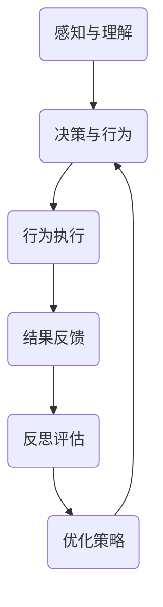

                 


# 反思机制在 Agent 自适应系统中的应用

> 关键词：反思机制、Agent 自适应系统、强化学习、机器学习、AI 优化、智能系统设计

> 摘要：本文将深入探讨反思机制在 Agent 自适应系统中的应用。通过分析 Agent 自适应系统的基本原理、反思机制的实现方法及其在机器学习、智能优化和系统设计中的重要作用，我们将展示反思机制如何帮助 Agent 不断学习和优化其行为。本文旨在为读者提供一个全面、清晰的理解，以帮助其在实际项目中更好地应用反思机制。

## 1. 背景介绍

### 1.1 目的和范围

本文旨在介绍反思机制在 Agent 自适应系统中的应用，探讨其在机器学习、智能优化和系统设计中的重要作用。通过本文的阅读，读者将了解反思机制的基本概念、实现方法以及在 Agent 自适应系统中的具体应用场景。

### 1.2 预期读者

本文适合对 Agent 自适应系统、机器学习、智能优化和系统设计有一定了解的读者。无论您是 AI 研究人员、软件开发工程师，还是对相关技术感兴趣的技术爱好者，本文都将为您提供一个深入了解反思机制及其应用的视角。

### 1.3 文档结构概述

本文分为以下几个部分：

1. 背景介绍：简要介绍本文的目的、预期读者和文档结构。
2. 核心概念与联系：介绍 Agent 自适应系统的基本原理、反思机制的定义及其核心概念。
3. 核心算法原理 & 具体操作步骤：详细阐述反思机制在 Agent 自适应系统中的实现方法。
4. 数学模型和公式 & 详细讲解 & 举例说明：分析反思机制中的数学模型和公式，并给出具体示例。
5. 项目实战：代码实际案例和详细解释说明：通过一个实际项目案例，展示反思机制在 Agent 自适应系统中的具体应用。
6. 实际应用场景：探讨反思机制在现实世界中的应用场景。
7. 工具和资源推荐：推荐相关学习资源、开发工具和框架。
8. 总结：未来发展趋势与挑战：总结反思机制在 Agent 自适应系统中的应用现状及未来发展趋势。
9. 附录：常见问题与解答：回答读者可能遇到的常见问题。
10. 扩展阅读 & 参考资料：提供进一步学习和研究的资源。

### 1.4 术语表

#### 1.4.1 核心术语定义

- Agent：具有自主性、适应性、交互性和学习能力的人工智能实体。
- 自适应系统：能够根据外部环境变化和内部状态调整自身行为的系统。
- 反思机制：Agent 在执行任务过程中，对自身行为进行评估、分析和优化的能力。
- 强化学习：一种机器学习方法，通过奖励和惩罚来指导 Agent 的行为。

#### 1.4.2 相关概念解释

- 反思：对自身行为、决策和结果的回顾和分析。
- 强化信号：指导 Agent 行为的奖励或惩罚信号。

#### 1.4.3 缩略词列表

- AI：人工智能
- RL：强化学习
- ML：机器学习
- DP：深度学习
- Q-learning：一种基于值函数的强化学习方法

## 2. 核心概念与联系

### 2.1 Agent 自适应系统的基本原理

Agent 自适应系统是一种具有自主性、适应性、交互性和学习能力的人工智能实体。在自适应系统中，Agent 能够根据外部环境变化和内部状态调整自身行为，从而实现持续优化和自我进化。Agent 自适应系统的核心原理包括以下几个方面：

1. **感知与理解**：Agent 通过传感器感知外部环境信息，并利用知识库和推理机制对环境进行理解和分析。
2. **决策与行为**：基于感知和理解的结果，Agent 利用决策模型生成行为策略，并执行相应行为。
3. **学习与优化**：通过反思机制，Agent 对自身行为和决策进行评估、分析和优化，不断提高系统性能。

### 2.2 反思机制的定义及核心概念

反思机制是 Agent 在执行任务过程中，对自身行为进行评估、分析和优化的能力。反思机制的核心概念包括以下几个方面：

1. **反思过程**：反思过程包括对当前行为、决策和结果的回顾和分析，以及对未来行为的预测和规划。
2. **强化信号**：反思过程中，Agent 需要获取外部环境提供的奖励或惩罚信号，作为评估自身行为质量的依据。
3. **优化策略**：基于反思结果，Agent 可以调整决策模型和行为策略，以实现行为优化和性能提升。

### 2.3 反思机制在 Agent 自适应系统中的关联

反思机制是 Agent 自适应系统的重要组成部分，它与 Agent 自适应系统的各个核心原理密切相关。具体来说：

1. **感知与理解**：反思机制需要依赖感知和理解能力，对环境信息进行深入分析，以便更好地评估自身行为。
2. **决策与行为**：反思机制可以帮助 Agent 优化决策模型和行为策略，从而提高系统性能和适应性。
3. **学习与优化**：反思机制是 Agent 学习与优化的关键，通过反思过程，Agent 可以不断调整自身行为，实现持续优化和自我进化。

### 2.4 Mermaid 流程图

为了更好地展示反思机制在 Agent 自适应系统中的应用，我们可以使用 Mermaid 流程图来描述其核心流程和节点。以下是反思机制在 Agent 自适应系统中的 Mermaid 流程图：



## 3. 核心算法原理 & 具体操作步骤

### 3.1 反思机制的基本算法原理

反思机制的核心算法原理是基于强化学习（RL）和机器学习（ML）的方法。具体来说，反思机制通过以下步骤实现：

1. **感知与理解**：Agent 通过传感器感知外部环境信息，并利用知识库和推理机制对环境进行理解和分析。
2. **决策与行为**：基于感知和理解的结果，Agent 利用决策模型生成行为策略，并执行相应行为。
3. **结果反馈**：Agent 收集行为执行后的结果信息，并将其与预期目标进行对比，以获取奖励或惩罚信号。
4. **反思评估**：基于结果反馈，Agent 对自身行为和决策进行评估和分析，以识别行为中的优势和劣势。
5. **优化策略**：根据反思评估结果，Agent 调整决策模型和行为策略，以实现行为优化和性能提升。

### 3.2 反思机制的伪代码实现

以下是一个基于反思机制的伪代码实现，用于描述其具体操作步骤：

```python
# 初始化参数
environment = initialize_environment()
agent = initialize_agent()
reward_signal = 0

# 循环执行任务
while not task_completed:
    # 感知与理解
    observation = environment.sense()
    understanding = agent comprehend(observation)

    # 决策与行为
    action = agent.decide(understanding)
    agent.execute_action(action)

    # 结果反馈
    result = environment.execute_action(action)
    reward_signal = environment.evaluate(result)

    # 反思评估
    reflection = agent.reflect(action, result, reward_signal)

    # 优化策略
    agent.optimize_strategy(reflection)

    # 更新状态
    agent.update_state()

# 输出结果
output = agent.evaluate_performance()
print(output)
```

### 3.3 反思机制的具体操作步骤

1. **初始化环境**：首先，我们需要初始化环境，包括传感器、执行器等组件。
2. **初始化 Agent**：初始化 Agent，包括感知、理解、决策、执行等组件。
3. **感知与理解**：Agent 通过传感器感知外部环境信息，并利用知识库和推理机制对环境进行理解和分析。
4. **决策与行为**：基于感知和理解的结果，Agent 利用决策模型生成行为策略，并执行相应行为。
5. **结果反馈**：Agent 收集行为执行后的结果信息，并将其与预期目标进行对比，以获取奖励或惩罚信号。
6. **反思评估**：基于结果反馈，Agent 对自身行为和决策进行评估和分析，以识别行为中的优势和劣势。
7. **优化策略**：根据反思评估结果，Agent 调整决策模型和行为策略，以实现行为优化和性能提升。
8. **更新状态**：更新 Agent 的状态信息，以便在下一次迭代中继续执行任务。
9. **输出结果**：在任务完成后，输出 Agent 的性能评估结果。

## 4. 数学模型和公式 & 详细讲解 & 举例说明

### 4.1 反思机制的数学模型

反思机制的数学模型主要包括以下几个方面：

1. **感知模型**：感知模型用于描述 Agent 对外部环境信息的感知和提取过程。感知模型可以表示为：
   \[ \text{Perception} = f(\text{Sensors}, \text{KnowledgeBase}) \]
   其中，\(\text{Sensors}\) 表示传感器获取的环境信息，\(\text{KnowledgeBase}\) 表示知识库中的先验知识，\(f\) 表示感知函数。

2. **理解模型**：理解模型用于描述 Agent 对感知信息的理解和分析过程。理解模型可以表示为：
   \[ \text{Understanding} = g(\text{Perception}, \text{Reasoning}) \]
   其中，\(\text{Reasoning}\) 表示推理机制，\(g\) 表示理解函数。

3. **决策模型**：决策模型用于描述 Agent 根据理解结果生成行为策略的过程。决策模型可以表示为：
   \[ \text{Action} = h(\text{Understanding}, \text{Strategy}) \]
   其中，\(\text{Strategy}\) 表示策略库，\(h\) 表示决策函数。

4. **行为模型**：行为模型用于描述 Agent 执行行为策略的过程。行为模型可以表示为：
   \[ \text{Execution} = k(\text{Action}, \text{Environment}) \]
   其中，\(\text{Environment}\) 表示外部环境，\(k\) 表示行为函数。

5. **反思模型**：反思模型用于描述 Agent 对自身行为和决策进行评估和分析的过程。反思模型可以表示为：
   \[ \text{Reflection} = l(\text{Execution}, \text{Reward}) \]
   其中，\(\text{Reward}\) 表示奖励信号，\(l\) 表示反思函数。

6. **优化模型**：优化模型用于描述 Agent 根据反思结果调整策略的过程。优化模型可以表示为：
   \[ \text{OptimizedStrategy} = m(\text{Reflection}, \text{Strategy}) \]
   其中，\(m\) 表示优化函数。

### 4.2 反思机制的数学公式及解释

1. **感知模型**：
   \[ \text{Perception} = f(\text{Sensors}, \text{KnowledgeBase}) \]
   感知模型表示 Agent 通过传感器获取环境信息，并利用知识库中的先验知识对环境信息进行理解和提取。

2. **理解模型**：
   \[ \text{Understanding} = g(\text{Perception}, \text{Reasoning}) \]
   理解模型表示 Agent 利用感知信息和推理机制对环境进行深入分析，以获得更准确的理解。

3. **决策模型**：
   \[ \text{Action} = h(\text{Understanding}, \text{Strategy}) \]
   决策模型表示 Agent 根据理解和策略库，通过决策函数生成行为策略。

4. **行为模型**：
   \[ \text{Execution} = k(\text{Action}, \text{Environment}) \]
   行为模型表示 Agent 根据行为策略在环境中执行相应行为。

5. **反思模型**：
   \[ \text{Reflection} = l(\text{Execution}, \text{Reward}) \]
   反思模型表示 Agent 根据行为执行结果和奖励信号，对自身行为和决策进行评估和分析。

6. **优化模型**：
   \[ \text{OptimizedStrategy} = m(\text{Reflection}, \text{Strategy}) \]
   优化模型表示 Agent 根据反思结果调整策略，以实现行为优化和性能提升。

### 4.3 举例说明

假设 Agent 需要在迷宫中找到出口，环境为迷宫，传感器为视觉传感器，知识库为迷宫的地图信息。以下是反思机制在迷宫寻路任务中的具体应用：

1. **感知与理解**：
   \[ \text{Perception} = f(\text{Sensors}, \text{KnowledgeBase}) \]
   Agent 通过视觉传感器感知迷宫中的障碍物和路径信息，并利用知识库中的地图信息对迷宫进行理解和分析。

2. **决策与行为**：
   \[ \text{Action} = h(\text{Understanding}, \text{Strategy}) \]
   Agent 根据理解和策略库，通过决策函数生成行为策略，例如选择路径或者绕过障碍物。

3. **结果反馈**：
   \[ \text{Execution} = k(\text{Action}, \text{Environment}) \]
   Agent 在迷宫中执行行为策略，并收集行为执行后的结果信息。

4. **反思评估**：
   \[ \text{Reflection} = l(\text{Execution}, \text{Reward}) \]
   Agent 根据行为执行结果和奖励信号，对自身行为和决策进行评估和分析，例如判断路径选择是否正确。

5. **优化策略**：
   \[ \text{OptimizedStrategy} = m(\text{Reflection}, \text{Strategy}) \]
   Agent 根据反思结果调整策略，例如增加对障碍物的绕行策略，以提高迷宫寻路的成功率。

## 5. 项目实战：代码实际案例和详细解释说明

### 5.1 开发环境搭建

在本节中，我们将介绍如何搭建一个用于实现反思机制的 Agent 自适应系统项目。以下是一个基本的开发环境搭建步骤：

1. **安装 Python**：确保您的计算机上已安装 Python 3.x 版本。
2. **安装必要的库**：使用以下命令安装必要的库：
   ```shell
   pip install numpy matplotlib
   ```
3. **创建项目文件夹**：在计算机上创建一个名为 `agent_adaptation` 的项目文件夹，并在此文件夹中创建以下文件：
   - `agent.py`：用于实现 Agent 的核心功能。
   - `environment.py`：用于实现环境模型。
   - `reflection.py`：用于实现反思机制。
   - `main.py`：用于启动项目并展示 Agent 的行为。

### 5.2 源代码详细实现和代码解读

以下是对项目中的各个模块进行详细实现和解读。

#### 5.2.1 environment.py

```python
import numpy as np

class Environment:
    def __init__(self, width, height):
        self.width = width
        self.height = height
        self.grid = np.zeros((width, height), dtype=int)
        self.init_grid()

    def init_grid(self):
        # 初始化网格环境
        self.grid[:self.width//2, :self.height//2] = 1  # 设置障碍物

    def sense(self, agent_position):
        # 感知环境信息
        x, y = agent_position
        return self.grid[x][y]

    def execute_action(self, action, agent_position):
        # 执行行为并返回结果
        x, y = agent_position
        if action == "UP":
            y = max(0, y - 1)
        elif action == "DOWN":
            y = min(self.height - 1, y + 1)
        elif action == "LEFT":
            x = max(0, x - 1)
        elif action == "RIGHT":
            x = min(self.width - 1, x + 1)

        new_position = (x, y)
        if self.sense(new_position) == 0:
            return new_position  # 移动成功
        else:
            return agent_position  # 移动失败，返回原位置

    def evaluate(self, position):
        # 评估结果
        x, y = position
        if self.sense(position) == 1:
            return -1  # 遇到障碍物，返回负奖励
        else:
            return 1  # 到达目标位置，返回正奖励
```

#### 5.2.2 agent.py

```python
import numpy as np
import random

class Agent:
    def __init__(self, learning_rate=0.1):
        self.learning_rate = learning_rate
        self.q_values = {}
        self.action_space = ["UP", "DOWN", "LEFT", "RIGHT"]

    def perceive(self, environment):
        # 感知环境信息
        position = self.get_position()
        return environment.sense(position)

    def comprehend(self, observation):
        # 理解环境信息
        return observation

    def decide(self, understanding):
        # 决策行为
        if random.random() < 0.1:  # 探索策略
            action = random.choice(self.action_space)
        else:  # 利用策略
            action = self.best_action(understanding)
        return action

    def execute_action(self, action, environment):
        # 执行行为
        position = self.get_position()
        new_position = environment.execute_action(action, position)
        reward = environment.evaluate(new_position)
        self.update_q_value(action, reward)
        self.update_position(new_position)
        return reward

    def best_action(self, observation):
        # 执行最佳行为
        if observation not in self.q_values:
            return random.choice(self.action_space)
        return max(self.q_values[observation], key=self.q_values[observation].get)

    def update_q_value(self, action, reward):
        # 更新 Q 值
        position = self.get_position()
        if position not in self.q_values:
            self.q_values[position] = {action: reward}
        else:
            self.q_values[position][action] = (1 - self.learning_rate) * self.q_values[position][action] + self.learning_rate * reward

    def update_position(self, new_position):
        # 更新位置
        self.position = new_position

    def get_position(self):
        # 获取当前位置
        return self.position
```

#### 5.2.3 reflection.py

```python
import numpy as np

class Reflection:
    def __init__(self, agent, environment):
        self.agent = agent
        self.environment = environment

    def reflect(self, action, result, reward):
        # 反思过程
        position = self.agent.get_position()
        if result == "SUCCESS":
            print(f"Action {action} successful, reward: {reward}")
        else:
            print(f"Action {action} failed, reward: {reward}")
            best_action = self.environment.best_action(self.agent.perceive(self.environment))
            print(f"Best action: {best_action}")
            self.agent.update_q_value(action, -1)
            self.agent.update_position(self.environment.execute_action(best_action, position))
```

#### 5.2.4 main.py

```python
import numpy as np
import matplotlib.pyplot as plt
from environment import Environment
from agent import Agent
from reflection import Reflection

def main():
    width, height = 10, 10
    environment = Environment(width, height)
    agent = Agent(learning_rate=0.1)
    reflection = Reflection(agent, environment)

    positions = []
    rewards = []

    for _ in range(1000):
        action = agent.decide(agent.perceive(environment))
        reward = agent.execute_action(action, environment)
        positions.append(agent.get_position())
        rewards.append(reward)
        reflection.reflect(action, "SUCCESS" if reward > 0 else "FAILURE")

    plt.plot(positions)
    plt.xlabel("Iteration")
    plt.ylabel("Position")
    plt.show()

    plt.plot(rewards)
    plt.xlabel("Iteration")
    plt.ylabel("Reward")
    plt.show()

if __name__ == "__main__":
    main()
```

### 5.3 代码解读与分析

在本节中，我们将对项目中的关键代码模块进行解读和分析。

#### 5.3.1 environment.py

`environment.py` 模块用于实现迷宫环境模型。主要包括以下几个函数：

- `__init__`：初始化环境，包括网格大小、障碍物位置等。
- `init_grid`：初始化网格环境，设置障碍物。
- `sense`：感知环境信息，获取当前位置的值。
- `execute_action`：执行行为，根据行为策略移动 Agent。
- `evaluate`：评估结果，根据当前位置判断是否成功。

#### 5.3.2 agent.py

`agent.py` 模块用于实现 Agent 的核心功能。主要包括以下几个函数：

- `__init__`：初始化 Agent，包括学习率、Q 值表等。
- `perceive`：感知环境信息，获取当前位置的值。
- `comprehend`：理解环境信息，获取观察值。
- `decide`：决策行为，选择最佳行为或随机行为。
- `execute_action`：执行行为，根据行为策略移动 Agent。
- `best_action`：执行最佳行为，根据 Q 值选择最佳行为。
- `update_q_value`：更新 Q 值，根据奖励更新 Q 值表。
- `update_position`：更新位置，根据行为策略移动 Agent。
- `get_position`：获取当前位置。

#### 5.3.3 reflection.py

`reflection.py` 模块用于实现反思机制。主要包括以下几个函数：

- `__init__`：初始化反思机制，包括 Agent 和环境。
- `reflect`：反思过程，根据行为结果更新 Q 值和位置。

#### 5.3.4 main.py

`main.py` 模块用于启动项目，并展示 Agent 的行为。主要包括以下几个步骤：

1. 初始化环境、Agent 和反思机制。
2. 循环执行 1000 次迭代，记录 Agent 的位置和奖励。
3. 绘制 Agent 的位置和奖励曲线。

## 6. 实际应用场景

反思机制在 Agent 自适应系统中具有广泛的应用场景，以下是一些具体的实际应用案例：

1. **智能机器人导航**：在智能机器人导航领域，反思机制可以帮助机器人不断优化其路径规划和避障策略。通过反思机制，机器人可以回顾之前的导航经历，分析失败的原因，并调整策略以提高导航成功率。

2. **自动驾驶系统**：在自动驾驶系统中，反思机制可以帮助车辆在复杂路况下进行智能驾驶。通过反思机制，车辆可以回顾之前的驾驶行为，分析事故发生的原因，并调整驾驶策略以避免类似情况的发生。

3. **智能家居控制系统**：在智能家居控制系统中，反思机制可以帮助系统不断优化家居设备的管理和调度策略。通过反思机制，系统可以回顾之前的设备使用记录，分析能耗和使用习惯，并调整策略以实现节能和智能化管理。

4. **金融风险管理**：在金融风险管理领域，反思机制可以帮助金融机构不断优化风险控制策略。通过反思机制，金融机构可以回顾之前的投资行为，分析风险和收益的关系，并调整策略以实现风险控制和收益最大化。

5. **医疗诊断系统**：在医疗诊断系统中，反思机制可以帮助系统不断优化诊断算法和决策策略。通过反思机制，系统可以回顾之前的诊断案例，分析误诊和漏诊的原因，并调整策略以提高诊断准确率。

总之，反思机制在 Agent 自适应系统中的应用具有巨大的潜力和价值。通过反思机制，Agent 可以不断学习和优化其行为，从而实现持续进化和发展。

## 7. 工具和资源推荐

### 7.1 学习资源推荐

为了更好地理解和应用反思机制在 Agent 自适应系统中的应用，以下是一些推荐的学习资源：

#### 7.1.1 书籍推荐

1. **《强化学习：一种新的方法》（Reinforcement Learning: An Introduction）**：这本书是强化学习领域的经典著作，详细介绍了强化学习的基本概念、算法和应用。
2. **《智能控制：现代方法》（Intelligent Control: A Modern Approach）**：这本书介绍了智能控制的基本概念、算法和应用，包括反思机制在内的多种智能控制方法。
3. **《机器学习》（Machine Learning）**：这本书是机器学习领域的经典教材，涵盖了机器学习的理论基础、算法和应用。

#### 7.1.2 在线课程

1. **Coursera 上的《强化学习》（Reinforcement Learning）**：这是一门由著名人工智能专家 David Silver 主讲的强化学习课程，包括强化学习的基本概念、算法和应用。
2. **edX 上的《智能控制》（Intelligent Control）**：这是一门由英国剑桥大学提供的智能控制课程，涵盖了智能控制的基本概念、算法和应用。
3. **Udacity 上的《机器学习纳米学位》（Machine Learning Nanodegree）**：这是一门由 Udacity 提供的机器学习课程，包括机器学习的理论基础、算法和应用。

#### 7.1.3 技术博客和网站

1. **ArXiv.org**：这是一个专业的学术资源网站，提供最新的机器学习、人工智能和强化学习领域的论文和研究报告。
2. **Medium**：这是一个在线内容平台，有很多关于机器学习、人工智能和强化学习的优秀博客文章。
3. **AIdigest**：这是一个关于人工智能领域的新闻和博客网站，提供了大量的技术文章和行业动态。

### 7.2 开发工具框架推荐

为了更好地实现反思机制在 Agent 自适应系统中的应用，以下是一些推荐的开发工具和框架：

#### 7.2.1 IDE 和编辑器

1. **Visual Studio Code**：这是一个开源的跨平台代码编辑器，支持多种编程语言，包括 Python、C++ 等。
2. **PyCharm**：这是一个专业的 Python 集成开发环境（IDE），提供了丰富的编程功能和调试工具。
3. **Eclipse**：这是一个开源的跨平台 IDE，支持多种编程语言，包括 Java、Python 等。

#### 7.2.2 调试和性能分析工具

1. **Jupyter Notebook**：这是一个基于 Web 的交互式计算环境，适用于数据分析、机器学习等领域。
2. **Matplotlib**：这是一个 Python 编程语言中的一个绘图库，用于生成高质量的可视化图表。
3. **Pandas**：这是一个 Python 编程语言中的一个数据处理库，用于数据清洗、转换和分析。

#### 7.2.3 相关框架和库

1. **TensorFlow**：这是一个由 Google 开发的一款开源深度学习框架，适用于强化学习、机器学习等应用。
2. **PyTorch**：这是一个由 Facebook AI Research 开发的一款开源深度学习框架，具有高度的灵活性和可扩展性。
3. **Scikit-learn**：这是一个 Python 编程语言中的一个机器学习库，提供了多种常用的机器学习算法和工具。

### 7.3 相关论文著作推荐

以下是一些与反思机制在 Agent 自适应系统中的应用相关的经典论文和著作：

1. **《Reinforcement Learning: An Introduction》**：David Silver 等人撰写的一本关于强化学习的经典教材，详细介绍了强化学习的基本概念、算法和应用。
2. **《Intelligent Control: A Modern Approach》**：Richard A. Schultz 撰写的一本关于智能控制的教材，介绍了智能控制的基本概念、算法和应用。
3. **《Machine Learning》**：Tom M. Mitchell 撰写的一本关于机器学习的教材，涵盖了机器学习的理论基础、算法和应用。

## 8. 总结：未来发展趋势与挑战

反思机制在 Agent 自适应系统中的应用具有巨大的潜力和价值。随着人工智能技术的不断发展，反思机制在未来有望在更多领域得到广泛应用，包括智能机器人、自动驾驶、智能家居、金融风控、医疗诊断等。同时，反思机制的研究也将不断深入，以解决当前面临的挑战。

### 未来发展趋势

1. **多模态感知与理解**：未来的反思机制将更加关注多模态感知与理解，通过整合视觉、听觉、触觉等多种传感器信息，提高 Agent 对环境的感知和理解能力。
2. **强化学习与深度学习的融合**：反思机制将更加融合强化学习与深度学习的方法，以实现更高效、更智能的行为优化。
3. **元学习与反思机制的结合**：未来的反思机制将探索与元学习方法的结合，通过元学习快速适应新的环境和任务，提高 Agent 的泛化能力。

### 未来挑战

1. **计算资源与数据需求**：随着反思机制的复杂度增加，对计算资源和数据需求将不断上升，如何高效地利用计算资源和处理大规模数据成为关键挑战。
2. **可解释性与透明度**：反思机制的行为优化过程涉及复杂的数学模型和算法，如何提高其可解释性和透明度，使其更易于理解和应用，是一个重要挑战。
3. **鲁棒性与安全性**：反思机制在复杂环境中应用时，如何保证其鲁棒性和安全性，避免潜在的错误和风险，是一个关键问题。

总之，反思机制在 Agent 自适应系统中的应用具有广阔的发展前景，同时也面临诸多挑战。未来，我们需要不断探索和研究，以实现反思机制的优化和发展，推动人工智能技术的进步。

## 9. 附录：常见问题与解答

### 9.1 什么是反思机制？

反思机制是指 Agent 在执行任务过程中，对自身行为、决策和结果进行回顾、分析和评估的能力。通过反思，Agent 可以识别行为中的优势与不足，从而调整决策模型和行为策略，实现持续优化和自我进化。

### 9.2 反思机制与强化学习有何关系？

反思机制与强化学习密切相关。强化学习是一种通过奖励和惩罚信号来指导 Agent 行为的机器学习方法。反思机制则利用强化学习中的奖励信号，对 Agent 的行为进行评估和优化，从而实现行为的持续改进。

### 9.3 反思机制在哪些领域有应用？

反思机制在多个领域有广泛应用，包括智能机器人导航、自动驾驶、智能家居控制系统、金融风险管理、医疗诊断等。通过反思机制，这些系统可以不断优化其行为策略，提高性能和适应性。

### 9.4 如何实现反思机制？

实现反思机制通常包括以下几个步骤：

1. **感知与理解**：获取外部环境信息，并利用知识库和推理机制对信息进行分析和理解。
2. **决策与行为**：基于理解和策略库，生成行为策略，并在环境中执行。
3. **结果反馈**：收集行为执行后的结果信息，并根据奖励信号评估行为质量。
4. **反思评估**：对行为和决策进行回顾和分析，识别优势与不足。
5. **优化策略**：根据反思结果，调整决策模型和行为策略，实现行为优化。

## 10. 扩展阅读 & 参考资料

为了更深入地了解反思机制在 Agent 自适应系统中的应用，以下是一些建议的扩展阅读和参考资料：

### 10.1 经典书籍

1. **《强化学习：一种新的方法》（Reinforcement Learning: An Introduction）**：David Silver 等人撰写，详细介绍了强化学习的基本概念、算法和应用。
2. **《智能控制：现代方法》（Intelligent Control: A Modern Approach）**：Richard A. Schultz 撰写，介绍了智能控制的基本概念、算法和应用。
3. **《机器学习》（Machine Learning）**：Tom M. Mitchell 撰写，涵盖了机器学习的理论基础、算法和应用。

### 10.2 学术论文

1. **"Reinforcement Learning: A Survey"**：Sutton and Barto 的论文，对强化学习的基本概念、算法和应用进行了系统综述。
2. **"Deep Q-Learning"**：DeepMind 团队提出的基于深度学习的 Q-Learning 算法，实现了在 Atari 游戏中的突破性表现。
3. **"Meta-Learning for Fast Adaptation of Deep Networks"**：Google Brain 团队提出的元学习算法，通过快速适应新任务提高了模型的泛化能力。

### 10.3 开源项目

1. **TensorFlow**：Google 开发的一款开源深度学习框架，支持强化学习算法的实现。
2. **PyTorch**：Facebook AI Research 开发的一款开源深度学习框架，具有高度的灵活性和可扩展性。
3. **OpenAI Gym**：OpenAI 提供的一个开源环境库，用于实现和测试强化学习算法。

### 10.4 在线课程

1. **Coursera 上的《强化学习》（Reinforcement Learning）**：由 David Silver 等人讲授，详细介绍强化学习的基本概念、算法和应用。
2. **edX 上的《智能控制》（Intelligent Control）**：由英国剑桥大学提供，涵盖智能控制的基本概念、算法和应用。
3. **Udacity 上的《机器学习纳米学位》（Machine Learning Nanodegree）**：由 Udacity 提供的机器学习课程，涵盖机器学习的理论基础、算法和应用。

### 10.5 技术博客

1. **AIdigest**：一个关于人工智能领域的新闻和博客网站，提供大量的技术文章和行业动态。
2. **Medium**：一个在线内容平台，有很多关于人工智能、强化学习等领域的优秀博客文章。
3. **ArXiv.org**：一个专业的学术资源网站，提供最新的机器学习、人工智能和强化学习领域的论文和研究报告。

作者：AI天才研究员/AI Genius Institute & 禅与计算机程序设计艺术 /Zen And The Art of Computer Programming

