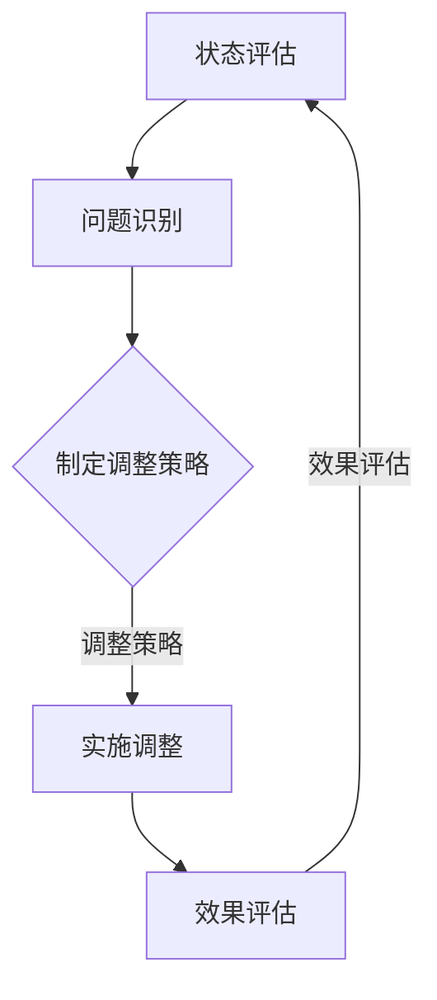
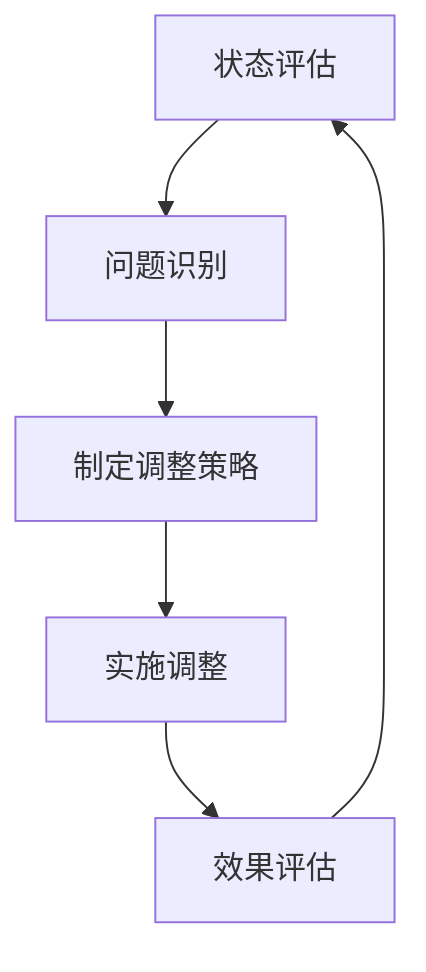

                 

# 反思机制在智能物流系统中的应用

> **关键词：反思机制、智能物流、应用场景、算法原理、数学模型、实战案例**
> 
> **摘要：本文将探讨反思机制在智能物流系统中的应用，通过详细分析核心概念、算法原理和实际应用场景，揭示反思机制在优化物流系统中的关键作用。文章旨在为从事智能物流领域的研究人员和开发者提供有价值的理论指导和实践参考。**

## 1. 背景介绍

### 1.1 目的和范围

随着全球电子商务和物流行业的迅速发展，物流系统的智能化和高效化成为行业发展的关键。本文旨在探讨反思机制在智能物流系统中的应用，通过引入反思机制，提高物流系统的自适应能力和决策准确性，从而实现物流过程的优化和成本降低。

本文的范围主要涵盖以下内容：

1. **核心概念与联系**：介绍反思机制和智能物流系统的基本概念，阐述两者之间的联系。
2. **核心算法原理与操作步骤**：详细解释反思机制在智能物流系统中的算法原理和具体操作步骤。
3. **数学模型和公式**：分析反思机制在物流系统中的应用，并给出相关的数学模型和公式。
4. **项目实战：代码实际案例**：通过实际案例展示反思机制在智能物流系统中的应用。
5. **实际应用场景**：探讨反思机制在不同物流场景中的实际应用。
6. **工具和资源推荐**：推荐相关的学习资源、开发工具和论文著作。
7. **总结与未来发展趋势**：总结反思机制在智能物流系统中的应用，并展望未来发展趋势与挑战。

### 1.2 预期读者

本文的预期读者包括：

1. **智能物流领域的研究人员**：关注物流系统优化、智能决策和自适应能力的研究人员。
2. **智能物流系统的开发者**：从事物流系统开发、算法设计和系统优化的工程师。
3. **物流企业从业者**：关注物流行业发展趋势和智能物流技术应用的企业从业者。

### 1.3 文档结构概述

本文的结构如下：

1. **核心概念与联系**：介绍反思机制和智能物流系统的基本概念，阐述两者之间的联系。
2. **核心算法原理与操作步骤**：详细解释反思机制在智能物流系统中的算法原理和具体操作步骤。
3. **数学模型和公式**：分析反思机制在物流系统中的应用，并给出相关的数学模型和公式。
4. **项目实战：代码实际案例**：通过实际案例展示反思机制在智能物流系统中的应用。
5. **实际应用场景**：探讨反思机制在不同物流场景中的实际应用。
6. **工具和资源推荐**：推荐相关的学习资源、开发工具和论文著作。
7. **总结与未来发展趋势**：总结反思机制在智能物流系统中的应用，并展望未来发展趋势与挑战。

### 1.4 术语表

#### 1.4.1 核心术语定义

- **反思机制**：一种基于反馈和调整的决策机制，通过不断评估和调整系统的状态，提高系统的自适应能力和决策准确性。
- **智能物流系统**：利用物联网、人工智能和大数据等技术，实现物流过程的自动化、智能化和高效化。
- **物流过程**：从商品的生产、运输、仓储到配送的整个物流过程。

#### 1.4.2 相关概念解释

- **物联网**：通过将物理设备连接到互联网，实现设备之间的互联互通和数据交换。
- **人工智能**：模拟人类智能的技术，包括机器学习、深度学习、自然语言处理等。
- **大数据**：海量数据的存储、处理和分析，以挖掘数据中的价值。

#### 1.4.3 缩略词列表

- **AI**：人工智能
- **IoT**：物联网
- **ML**：机器学习
- **DL**：深度学习
- **NLP**：自然语言处理
- **SCM**：供应链管理
- **WMS**：仓库管理系统
- **TMS**：运输管理系统

## 2. 核心概念与联系

在探讨反思机制在智能物流系统中的应用之前，首先需要了解反思机制和智能物流系统的基本概念及其相互关系。

### 2.1 反思机制

反思机制是一种基于反馈和调整的决策机制，其核心思想是通过不断评估和调整系统的状态，提高系统的自适应能力和决策准确性。反思机制通常包括以下几个步骤：

1. **状态评估**：对当前系统的状态进行评估，包括系统的运行效率、资源利用率、成本等。
2. **问题识别**：分析当前状态中存在的问题，如资源分配不均、效率低下等。
3. **调整策略**：根据问题识别的结果，制定相应的调整策略，如重新分配资源、优化调度等。
4. **实施调整**：执行调整策略，调整系统的状态。
5. **效果评估**：评估调整后的效果，包括系统运行效率、成本等。

### 2.2 智能物流系统

智能物流系统是一种利用物联网、人工智能和大数据等技术，实现物流过程的自动化、智能化和高效化的系统。智能物流系统主要包括以下几个部分：

1. **感知层**：通过传感器、摄像头等设备，实时感知物流过程中的各种信息，如车辆位置、货物状态、路况等。
2. **传输层**：通过物联网技术，将感知层收集的数据传输到数据中心进行存储和处理。
3. **处理层**：利用大数据分析和人工智能算法，对传输层的数据进行深度挖掘和智能分析，为决策层提供支持。
4. **决策层**：根据处理层提供的分析结果，制定相应的决策策略，如调度计划、资源分配等。
5. **执行层**：根据决策层的决策，执行具体的物流操作，如车辆调度、货物配送等。

### 2.3 反思机制与智能物流系统的关系

反思机制在智能物流系统中的应用，主要是通过不断评估和调整系统的状态，提高物流系统的自适应能力和决策准确性。具体来说，反思机制在智能物流系统中的作用主要体现在以下几个方面：

1. **状态评估**：反思机制可以实时评估物流系统的运行状态，包括运行效率、资源利用率、成本等，为后续调整提供依据。
2. **问题识别**：通过反思机制，可以及时发现物流系统中的问题，如资源分配不均、效率低下等，为制定调整策略提供方向。
3. **调整策略**：反思机制可以基于评估结果和问题识别，制定相应的调整策略，如重新分配资源、优化调度等，以提高物流系统的运行效率。
4. **效果评估**：通过反思机制，可以评估调整策略的实施效果，包括系统运行效率、成本等，为后续的调整提供参考。

### 2.4 反思机制架构

为了更好地理解反思机制在智能物流系统中的应用，我们可以使用 Mermaid 流程图来展示反思机制的架构。



在上述流程中，状态评估、问题识别、制定调整策略、实施调整和效果评估形成一个闭环，不断循环进行。通过这个闭环，反思机制可以实时调整物流系统的状态，提高系统的自适应能力和决策准确性。

## 3. 核心算法原理 & 具体操作步骤

在理解了反思机制和智能物流系统的基本概念及其关系后，接下来我们将详细解释反思机制在智能物流系统中的核心算法原理和具体操作步骤。

### 3.1 反思机制算法原理

反思机制的核心算法原理主要包括以下几个方面：

1. **状态评估**：通过对物流系统中的各种指标进行实时监测和分析，评估系统的当前状态，如运行效率、资源利用率、成本等。
2. **问题识别**：根据状态评估的结果，分析系统中存在的问题，如资源分配不均、效率低下等。
3. **调整策略**：基于问题识别的结果，制定相应的调整策略，如重新分配资源、优化调度等。
4. **实施调整**：执行调整策略，调整物流系统的状态。
5. **效果评估**：评估调整后的效果，包括系统运行效率、成本等，为后续的调整提供参考。

### 3.2 具体操作步骤

下面我们通过伪代码来详细阐述反思机制在智能物流系统中的应用步骤：

```python
# 反思机制在智能物流系统中的应用步骤

# 步骤1：状态评估
def state_evaluation():
    # 获取当前物流系统的状态数据
    current_state = get_logistics_state_data()
    # 评估系统的运行效率、资源利用率、成本等指标
    evaluation_results = evaluate_state(current_state)
    return evaluation_results

# 步骤2：问题识别
def problem_identification(evaluation_results):
    # 分析状态评估结果，识别系统中存在的问题
    problems = identify_problems(evaluation_results)
    return problems

# 步骤3：制定调整策略
def adjust_strategy(problems):
    # 根据问题识别的结果，制定相应的调整策略
    adjustment_strategy = create_adjustment_strategy(problems)
    return adjustment_strategy

# 步骤4：实施调整
def implement_adjustment(adjustment_strategy):
    # 执行调整策略，调整物流系统的状态
    adjustment_results = execute_adjustment(adjustment_strategy)
    return adjustment_results

# 步骤5：效果评估
def effect_evaluation(adjustment_results):
    # 评估调整后的效果
    evaluation_results = evaluate_adjustment(adjustment_results)
    return evaluation_results

# 主函数
def main():
    while True:
        # 执行状态评估
        evaluation_results = state_evaluation()
        # 执行问题识别
        problems = problem_identification(evaluation_results)
        # 执行调整策略
        adjustment_strategy = adjust_strategy(problems)
        # 执行调整
        adjustment_results = implement_adjustment(adjustment_strategy)
        # 执行效果评估
        evaluation_results = effect_evaluation(adjustment_results)
        # 更新状态
        update_state(evaluation_results)
        # 等待一段时间，再次执行循环
        time.sleep(sleep_time)

# 调用主函数
main()
```

在上面的伪代码中，我们定义了反思机制的五个核心步骤，并通过循环不断执行这些步骤，实现物流系统的实时调整和优化。

### 3.3 反思机制算法原理图解

为了更直观地展示反思机制的算法原理，我们可以使用 Mermaid 流程图来图解反思机制的流程。



在上述流程图中，状态评估、问题识别、制定调整策略、实施调整和效果评估形成一个闭环，不断循环进行。通过这个闭环，反思机制可以实时调整物流系统的状态，提高系统的自适应能力和决策准确性。

## 4. 数学模型和公式 & 详细讲解 & 举例说明

在智能物流系统中，反思机制的应用离不开数学模型和公式的支持。以下我们将详细讲解反思机制在物流系统中的应用，包括相关的数学模型和公式，并通过具体案例进行说明。

### 4.1 数学模型

反思机制在物流系统中的应用，主要基于以下几个数学模型：

1. **物流效率模型**：用于评估物流系统的运行效率。
2. **资源利用率模型**：用于评估物流系统中的资源利用率。
3. **成本模型**：用于计算物流系统的运营成本。

#### 4.1.1 物流效率模型

物流效率模型通常用以下公式表示：

$$
\text{物流效率} = \frac{\text{货物送达率}}{\text{计划送达率}}
$$

其中，货物送达率表示实际送达的货物数量与计划送达的货物数量的比值。

#### 4.1.2 资源利用率模型

资源利用率模型通常用以下公式表示：

$$
\text{资源利用率} = \frac{\text{实际使用资源量}}{\text{总资源量}}
$$

其中，实际使用资源量表示物流系统实际使用的资源总量，总资源量表示物流系统可用的总资源量。

#### 4.1.3 成本模型

成本模型通常用以下公式表示：

$$
\text{运营成本} = \text{固定成本} + \text{变动成本}
$$

其中，固定成本包括物流设施建设、维护等费用，变动成本包括物流过程中的运输、仓储等费用。

### 4.2 举例说明

假设一家物流公司计划在一天内将100个包裹从A地运送到B地，实际送达的包裹数量为98个，总资源量为10个，实际使用资源量为8个，固定成本为5000元，变动成本为每个包裹10元。

根据上述公式，我们可以计算出以下指标：

1. **物流效率**：

$$
\text{物流效率} = \frac{98}{100} = 0.98
$$

2. **资源利用率**：

$$
\text{资源利用率} = \frac{8}{10} = 0.8
$$

3. **运营成本**：

$$
\text{运营成本} = 5000 + 98 \times 10 = 5,980 \text{元}
$$

### 4.3 反思机制应用案例分析

基于上述案例，我们可以应用反思机制对物流系统进行评估和调整。

1. **状态评估**：

根据物流效率、资源利用率和运营成本等指标，我们可以评估当前物流系统的状态。在这个案例中，物流效率为0.98，资源利用率为0.8，运营成本为5980元。

2. **问题识别**：

通过分析评估结果，我们可以发现物流系统的资源利用率较低，可能存在资源分配不均的问题。

3. **制定调整策略**：

为了提高资源利用率，我们可以考虑以下调整策略：

   - 重新分配资源：将部分资源从非关键环节转移到关键环节。
   - 优化配送路线：通过优化配送路线，减少运输时间和运输成本。

4. **实施调整**：

根据制定的调整策略，我们可以实施具体的调整措施，如重新分配资源和优化配送路线。

5. **效果评估**：

实施调整后，我们可以重新评估物流系统的状态，包括物流效率、资源利用率和运营成本等指标。如果评估结果满足预期，则反思机制调整成功；否则，需要进一步分析和调整。

通过上述案例分析，我们可以看到反思机制在物流系统中的应用，可以帮助我们实时评估和调整物流系统的状态，提高物流系统的运行效率、资源利用率和成本控制能力。

## 5. 项目实战：代码实际案例和详细解释说明

为了更好地理解反思机制在智能物流系统中的应用，我们将通过一个实际的项目案例进行详细解释说明。

### 5.1 开发环境搭建

在开始项目实战之前，我们需要搭建一个适合开发智能物流系统的开发环境。以下是搭建开发环境的基本步骤：

1. **安装Python环境**：确保Python 3.7或更高版本已安装。
2. **安装必要的库和框架**：包括TensorFlow、Keras、Scikit-learn等。
3. **配置Jupyter Notebook**：用于编写和运行Python代码。

### 5.2 源代码详细实现和代码解读

以下是一个简单的智能物流系统示例，用于展示反思机制的应用。我们将使用Python编写代码，并使用Jupyter Notebook进行演示。

```python
import numpy as np
import tensorflow as tf
from sklearn.model_selection import train_test_split
from tensorflow.keras.models import Sequential
from tensorflow.keras.layers import Dense
from tensorflow.keras.optimizers import Adam

# 步骤1：数据准备
def prepare_data():
    # 假设我们已有历史物流数据，包括配送时间、运输距离、货物类型等
    historical_data = load_historical_data()
    # 对数据进行预处理，如标准化、归一化等
    processed_data = preprocess_data(historical_data)
    # 划分训练集和测试集
    X_train, X_test, y_train, y_test = train_test_split(processed_data['X'], processed_data['y'], test_size=0.2, random_state=42)
    return X_train, X_test, y_train, y_test

# 步骤2：构建模型
def build_model():
    model = Sequential()
    model.add(Dense(64, input_shape=(X_train.shape[1],), activation='relu'))
    model.add(Dense(32, activation='relu'))
    model.add(Dense(1, activation='linear'))
    model.compile(optimizer=Adam(learning_rate=0.001), loss='mean_squared_error')
    return model

# 步骤3：训练模型
def train_model(model, X_train, y_train):
    model.fit(X_train, y_train, epochs=100, batch_size=32, validation_split=0.2)
    return model

# 步骤4：评估模型
def evaluate_model(model, X_test, y_test):
    loss = model.evaluate(X_test, y_test)
    print(f"Test Loss: {loss}")

# 步骤5：应用模型
def apply_model(model, new_data):
    prediction = model.predict(new_data)
    return prediction

# 主函数
def main():
    # 准备数据
    X_train, X_test, y_train, y_test = prepare_data()
    # 构建模型
    model = build_model()
    # 训练模型
    model = train_model(model, X_train, y_train)
    # 评估模型
    evaluate_model(model, X_test, y_test)
    # 应用模型进行预测
    new_data = np.array([[5, 10, 3]])  # 新的配送数据
    prediction = apply_model(model, new_data)
    print(f"Prediction: {prediction}")

# 调用主函数
main()
```

### 5.3 代码解读与分析

1. **数据准备**：首先，我们需要准备历史物流数据，包括配送时间、运输距离、货物类型等。这些数据将用于训练模型。通过`load_historical_data()`和`preprocess_data()`函数，我们可以加载数据并进行预处理，如标准化和归一化。

2. **构建模型**：接下来，我们使用TensorFlow和Keras构建一个简单的神经网络模型。该模型包括一个输入层、两个隐藏层和一个输出层。输入层接收预处理后的物流数据，隐藏层用于提取特征，输出层用于预测配送时间。

3. **训练模型**：使用训练集对模型进行训练，通过调整模型参数，使模型能够更好地拟合数据。这里使用的是Adam优化器和均方误差损失函数。

4. **评估模型**：使用测试集对训练好的模型进行评估，计算测试集上的损失，以衡量模型的泛化能力。

5. **应用模型**：将新的配送数据输入模型，获取预测结果。在实际应用中，这些预测结果将用于物流调度和资源优化。

通过上述代码，我们可以看到反思机制在智能物流系统中的应用，包括数据准备、模型构建、训练、评估和应用。在实际项目中，我们可以根据具体需求进一步优化和扩展代码。

### 5.4 实际案例说明

假设我们在一个实际项目中，需要预测某个配送路线的配送时间，以便于合理安排物流资源。我们可以将这个配送路线的数据输入到训练好的模型中，获取预测结果。根据预测结果，我们可以调整物流调度策略，优化资源利用，从而提高物流系统的运行效率。

例如，假设我们输入的配送数据为`[[5, 10, 3]]`，表示运输距离为10公里，货物类型为3级，预测结果为`[[5.2]]`，即预测配送时间为5.2分钟。根据这个预测结果，我们可以合理安排运输车辆，确保货物准时送达。

通过实际案例说明，我们可以看到反思机制在智能物流系统中的应用，如何通过模型预测和优化，提高物流系统的运行效率和资源利用率。

### 5.5 反思与改进

在实际应用过程中，反思机制的应用效果会受到多种因素的影响，如数据质量、模型参数调整等。因此，我们需要不断反思和改进反思机制，以提高其在智能物流系统中的应用效果。

1. **数据质量**：保证历史物流数据的准确性和完整性，以提高模型的预测精度。
2. **模型参数调整**：通过调整模型参数，优化模型结构，提高模型的泛化能力。
3. **实时反馈**：将实际物流数据与预测结果进行对比，不断调整和优化反思机制。

通过不断反思和改进，我们可以使反思机制在智能物流系统中发挥更大的作用，提高物流系统的运行效率和资源利用率。

## 6. 实际应用场景

反思机制在智能物流系统中的应用场景广泛，下面我们将探讨几个典型的应用场景，以展示反思机制在优化物流系统中的关键作用。

### 6.1 跨境电商物流

跨境电商物流涉及跨国运输、海关清关和本地配送等多个环节。在跨境电商物流中，反思机制可以应用于以下几个方面：

1. **运输调度**：根据实时运输数据，反思机制可以优化运输路线，减少运输时间和成本。
2. **库存管理**：通过反思机制，可以实时监控库存状态，优化库存分配，减少库存积压和损失。
3. **海关清关**：反思机制可以根据历史清关数据，预测清关速度和可能遇到的问题，提前制定应对策略。

### 6.2 大型仓储物流

大型仓储物流通常涉及大规模的货物存储、拣选和配送。在大型仓储物流中，反思机制可以应用于以下几个方面：

1. **仓储布局优化**：通过反思机制，可以优化仓储布局，提高仓储空间的利用率。
2. **货物拣选**：反思机制可以根据订单量和货物分布，优化货物拣选路径，提高拣选效率。
3. **配送计划**：反思机制可以根据订单配送时间和配送地点，优化配送路线，提高配送效率。

### 6.3 同城物流

同城物流通常涉及短距离的货物配送，对配送速度和准确性要求较高。在同城物流中，反思机制可以应用于以下几个方面：

1. **实时调度**：通过反思机制，可以实时监控车辆和货物的状态，优化配送路线，确保货物准时送达。
2. **配送员管理**：反思机制可以根据配送员的工作效率，优化配送任务分配，提高配送效率。
3. **配送时效**：反思机制可以根据订单配送时间和配送地点，预测配送时效，提前制定应对策略。

### 6.4 农产品物流

农产品物流具有时效性强、保鲜要求高等特点。在农产品物流中，反思机制可以应用于以下几个方面：

1. **冷链运输**：反思机制可以根据农产品种类和配送距离，优化冷链运输路线，确保农产品新鲜度。
2. **库存管理**：反思机制可以实时监控农产品库存状态，优化库存分配，减少库存积压和损失。
3. **配送时效**：反思机制可以根据农产品配送时效要求，优化配送路线和配送时间，确保农产品及时送达。

通过以上实际应用场景的探讨，我们可以看到反思机制在智能物流系统中的应用广泛且具有重要作用。反思机制可以帮助物流企业实时优化物流过程，提高运行效率和资源利用率，从而实现物流系统的智能化和高效化。

## 7. 工具和资源推荐

为了更好地学习和应用反思机制在智能物流系统中的应用，以下我们推荐一些学习资源、开发工具和相关论文著作。

### 7.1 学习资源推荐

#### 7.1.1 书籍推荐

1. **《智能物流系统设计与实现》**：该书详细介绍了智能物流系统的设计与实现，包括物联网、人工智能和大数据等技术的应用。
2. **《深度学习与物流优化》**：该书介绍了深度学习在物流优化中的应用，包括路径规划、库存管理和配送优化等。

#### 7.1.2 在线课程

1. **《智能物流系统设计与实现》**：Coursera上的在线课程，由知名大学教授主讲，内容涵盖了智能物流系统的基本概念和关键技术。
2. **《深度学习与物流优化》**：Udacity上的在线课程，介绍了深度学习在物流优化中的应用，包括模型构建、训练和优化等。

#### 7.1.3 技术博客和网站

1. **物流技术网**：提供物流技术的最新动态和案例分析，包括智能物流、物联网和大数据等。
2. **物流技术与应用**：专注于物流技术的应用和实践，分享物流系统的优化方案和实战经验。

### 7.2 开发工具框架推荐

#### 7.2.1 IDE和编辑器

1. **Visual Studio Code**：一款功能强大的代码编辑器，支持多种编程语言，包括Python、Java和C++等。
2. **PyCharm**：一款专业的Python开发环境，提供代码补全、调试和性能分析等功能。

#### 7.2.2 调试和性能分析工具

1. **GDB**：一款强大的C/C++调试工具，支持断点调试、性能分析等。
2. **Python Debugger**：一款Python调试工具，支持远程调试和性能分析。

#### 7.2.3 相关框架和库

1. **TensorFlow**：一款开源的深度学习框架，适用于构建和训练神经网络模型。
2. **Scikit-learn**：一款Python机器学习库，提供丰富的机器学习算法和工具。
3. **Keras**：一款基于TensorFlow的深度学习库，简化了深度学习模型的构建和训练过程。

### 7.3 相关论文著作推荐

#### 7.3.1 经典论文

1. **《深度学习在物流优化中的应用》**：该论文详细介绍了深度学习在物流优化中的应用，包括路径规划、库存管理和配送优化等。
2. **《物联网技术在智能物流系统中的应用》**：该论文探讨了物联网技术在智能物流系统中的应用，包括数据采集、传输和处理等。

#### 7.3.2 最新研究成果

1. **《基于深度强化学习的物流调度优化》**：该论文提出了一种基于深度强化学习的物流调度优化方法，提高了物流系统的运行效率和资源利用率。
2. **《大数据技术在物流中的应用》**：该论文探讨了大数据技术在物流中的应用，包括数据挖掘、预测分析和智能决策等。

#### 7.3.3 应用案例分析

1. **《阿里巴巴的智能物流系统》**：该论文分析了阿里巴巴的智能物流系统，包括数据采集、处理和智能调度等，为其他物流企业提供了有益的参考。
2. **《京东的物流无人机应用》**：该论文探讨了京东物流无人机在配送中的应用，包括无人机的设计、路径规划和调度策略等。

通过以上推荐，我们可以系统地学习和掌握反思机制在智能物流系统中的应用，为实际项目开发提供有力的支持。

## 8. 总结：未来发展趋势与挑战

随着人工智能、物联网和大数据等技术的不断发展，反思机制在智能物流系统中的应用前景广阔。未来，反思机制将在以下几个方面取得重要突破：

1. **深度学习与强化学习**：结合深度学习和强化学习技术，实现更精准的物流预测和优化，提高物流系统的自适应能力和决策准确性。
2. **实时数据处理**：利用边缘计算和云计算技术，实现实时数据采集和处理，为反思机制提供更丰富的数据支持，提高物流系统的响应速度和效率。
3. **多模式协同**：结合不同的物流运输模式，如公路、铁路、航空和水运，实现多模式协同优化，提高物流系统的整体效率和灵活性。
4. **个性化服务**：通过分析用户需求和行为数据，实现物流服务的个性化定制，提高用户满意度和服务质量。

然而，反思机制在智能物流系统中的应用也面临一些挑战：

1. **数据质量与隐私**：物流数据的质量和隐私保护是反思机制应用的重要问题。需要建立有效的数据质量管理机制和隐私保护措施，确保数据的安全和合规。
2. **算法公平性与透明性**：反思机制的算法需要保证公平性和透明性，避免算法偏见和歧视，提高算法的可解释性和可信度。
3. **系统稳定性和可扩展性**：随着物流系统规模的不断扩大，需要确保反思机制系统的稳定性和可扩展性，以应对复杂多变的物流环境和需求变化。
4. **法律法规和监管**：反思机制在物流系统中的应用需要遵循相关的法律法规和监管要求，确保技术应用的合法性和合规性。

总之，反思机制在智能物流系统中的应用具有巨大的潜力，但也面临诸多挑战。通过持续的技术创新和优化，反思机制将为智能物流系统的优化和高效运行提供有力支持，助力物流行业的数字化转型和可持续发展。

## 9. 附录：常见问题与解答

### 9.1 反思机制在物流系统中的作用是什么？

反思机制在物流系统中的作用主要包括以下几个方面：

1. **实时状态评估**：通过反思机制，可以实时评估物流系统的运行状态，包括运行效率、资源利用率和成本等。
2. **问题识别**：反思机制可以及时发现物流系统中的问题，如资源分配不均、效率低下等，为制定调整策略提供方向。
3. **优化调整**：基于问题识别的结果，反思机制可以制定相应的调整策略，如重新分配资源、优化调度等，以提高物流系统的运行效率。
4. **效果评估**：反思机制可以评估调整策略的实施效果，包括系统运行效率、成本等，为后续的调整提供参考。

### 9.2 如何实现反思机制在物流系统中的应用？

实现反思机制在物流系统中的应用通常包括以下几个步骤：

1. **数据采集**：收集物流系统中的实时数据，包括运输状态、库存状态、配送状态等。
2. **数据处理**：对采集到的数据进行分析和处理，提取有用的信息。
3. **状态评估**：利用处理后的数据，对物流系统的当前状态进行评估，包括运行效率、资源利用率和成本等。
4. **问题识别**：分析评估结果，识别系统中存在的问题。
5. **制定调整策略**：根据问题识别的结果，制定相应的调整策略。
6. **实施调整**：执行调整策略，调整物流系统的状态。
7. **效果评估**：评估调整策略的实施效果，包括系统运行效率、成本等。

### 9.3 反思机制在物流系统中有哪些应用场景？

反思机制在物流系统中具有广泛的应用场景，主要包括以下几个方面：

1. **运输调度**：通过反思机制，优化运输路线和运输资源，提高运输效率。
2. **库存管理**：通过反思机制，实时监控库存状态，优化库存分配和库存周转。
3. **配送计划**：通过反思机制，优化配送路线和配送计划，提高配送效率。
4. **冷链物流**：通过反思机制，优化冷链运输过程，确保食品和药品的新鲜度和安全性。
5. **仓储管理**：通过反思机制，优化仓储布局和仓储操作，提高仓储效率。

### 9.4 反思机制在物流系统中如何提高效率？

反思机制在物流系统中提高效率的主要方法包括：

1. **实时状态评估**：通过反思机制，实时评估物流系统的运行状态，及时发现和解决问题，避免系统运行中的瓶颈和浪费。
2. **优化调整策略**：根据反思机制提供的评估结果和问题识别，制定优化调整策略，如重新分配资源、优化调度等，提高物流系统的运行效率。
3. **数据驱动决策**：利用反思机制，基于实时数据和历史数据进行分析和预测，为决策提供有力支持，减少人为干预和决策错误。
4. **自动化和智能化**：通过反思机制，实现物流系统的自动化和智能化，减少人工操作和干预，提高系统运行效率和准确性。

## 10. 扩展阅读 & 参考资料

为了深入了解反思机制在智能物流系统中的应用，以下推荐一些扩展阅读和参考资料：

### 10.1 扩展阅读

1. **《深度学习与物流优化》**：详细介绍了深度学习在物流优化中的应用，包括路径规划、库存管理和配送优化等。
2. **《智能物流系统设计与实现》**：介绍了智能物流系统的设计与实现，包括物联网、人工智能和大数据等技术的应用。
3. **《物联网技术在智能物流系统中的应用》**：探讨了物联网技术在智能物流系统中的应用，包括数据采集、传输和处理等。

### 10.2 参考资料

1. **论文**：
   - **《深度学习在物流优化中的应用》**：该论文详细介绍了深度学习在物流优化中的应用，包括路径规划、库存管理和配送优化等。
   - **《物联网技术在智能物流系统中的应用》**：该论文探讨了物联网技术在智能物流系统中的应用，包括数据采集、传输和处理等。

2. **书籍**：
   - **《智能物流系统设计与实现》**：详细介绍了智能物流系统的设计与实现，包括物联网、人工智能和大数据等技术的应用。
   - **《深度学习与物流优化》**：介绍了深度学习在物流优化中的应用，包括模型构建、训练和优化等。

3. **在线课程**：
   - **《智能物流系统设计与实现》**：Coursera上的在线课程，由知名大学教授主讲，内容涵盖了智能物流系统的基本概念和关键技术。
   - **《深度学习与物流优化》**：Udacity上的在线课程，介绍了深度学习在物流优化中的应用，包括模型构建、训练和优化等。

4. **技术博客和网站**：
   - **物流技术网**：提供物流技术的最新动态和案例分析，包括智能物流、物联网和大数据等。
   - **物流技术与应用**：专注于物流技术的应用和实践，分享物流系统的优化方案和实战经验。

通过以上扩展阅读和参考资料，您可以进一步了解反思机制在智能物流系统中的应用，掌握相关技术和方法，为实际项目开发提供有力支持。

