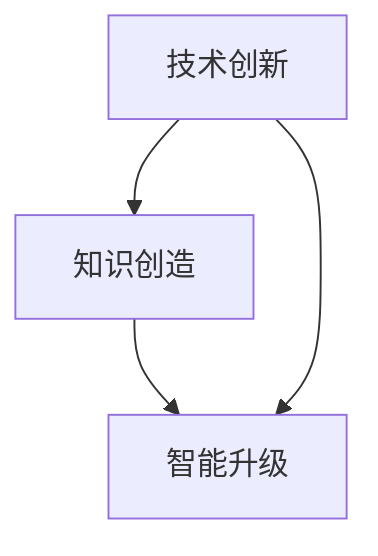

                 

# 发展新质生产力提高核心竞争力

> 关键词：新质生产力、核心竞争力、技术革新、创新驱动、产业发展

> 摘要：本文旨在深入探讨新质生产力的内涵、特征及其在提高核心竞争力中的关键作用。通过对新质生产力的背景介绍、核心概念解析、算法原理阐述、数学模型解析以及实际应用案例的分析，本文旨在为读者提供一套系统、全面的理论框架和实践指导，以促进产业转型升级和持续发展。

## 1. 背景介绍

### 1.1 目的和范围

本文旨在探讨新质生产力在提升企业核心竞争力方面的作用，分析其在现代产业中的重要性。文章将围绕新质生产力的概念、原理、应用案例等方面进行深入讨论，旨在为产业转型升级提供理论支持和实践指导。

### 1.2 预期读者

本文主要面向从事IT、智能制造、生物医药等高技术产业领域的研究人员、企业管理者以及相关专业的高校师生。通过本文的阅读，读者可以对新质生产力的概念有更深刻的理解，并掌握其提升核心竞争力的方法和技巧。

### 1.3 文档结构概述

本文分为十个部分，首先介绍新质生产力的背景和目的，然后通过核心概念解析、算法原理阐述、数学模型解析、实际应用案例等多个方面，深入探讨新质生产力在提高核心竞争力中的作用。最后，本文将总结未来发展趋势与挑战，并提供扩展阅读和参考资料。

### 1.4 术语表

#### 1.4.1 核心术语定义

- **新质生产力**：指以技术创新、知识创造、智能升级为核心的生产力形态，是推动产业转型升级和可持续发展的重要力量。
- **核心竞争力**：企业长期形成的，在市场竞争中能够保持持续竞争优势的能力。
- **技术革新**：指通过引入新技术、新方法、新工艺等，推动产业升级和变革的过程。

#### 1.4.2 相关概念解释

- **创新驱动**：以创新为核心动力，推动产业发展的模式。
- **产业升级**：通过技术创新、产业重组等手段，提升产业的整体竞争力。

#### 1.4.3 缩略词列表

- **AI**：人工智能
- **5G**：第五代移动通信技术
- **IoT**：物联网
- **大数据**：大规模数据的存储、管理和分析

## 2. 核心概念与联系

新质生产力作为现代产业的核心驱动力，其核心概念和联系可以从以下几个方面进行阐述。

### 2.1 新质生产力的核心概念

新质生产力的核心概念包括技术创新、知识创造、智能升级等。

- **技术创新**：指通过引入新技术、新方法、新工艺等，推动产业升级和变革的过程。技术创新是提升新质生产力的关键因素。
- **知识创造**：指通过收集、整合、挖掘和应用知识，创造新的价值。知识创造是提升新质生产力的内在动力。
- **智能升级**：指通过引入人工智能、大数据、物联网等新技术，提升生产效率和服务质量。智能升级是提升新质生产力的外在表现。

### 2.2 新质生产力的联系

新质生产力的各个核心概念之间具有紧密的联系。

- **技术创新与知识创造**：技术创新为知识创造提供了技术手段和平台，知识创造为技术创新提供了理论依据和实践支持。
- **知识创造与智能升级**：知识创造为智能升级提供了丰富的数据资源和理论指导，智能升级为知识创造提供了高效的工具和手段。
- **智能升级与技术创新**：智能升级推动了技术创新的深入发展，技术创新为智能升级提供了新的技术支撑。

### 2.3 新质生产力的 Mermaid 流程图

为了更好地理解新质生产力的核心概念和联系，我们可以使用 Mermaid 流程图进行描述。



在这个流程图中，技术创新、知识创造和智能升级之间形成了相互促进、共同发展的关系。

## 3. 核心算法原理 & 具体操作步骤

新质生产力提升的核心算法原理主要涉及以下几个方面：

### 3.1 技术创新算法原理

**步骤 1：识别技术趋势**

- 使用机器学习算法对全球技术发展趋势进行分析，识别出潜在的技术热点。
- **伪代码：**
  ```python
  def identify_technology_trends(data):
      # 使用机器学习算法进行分析
      # 返回技术趋势列表
      return trends
  ```

**步骤 2：评估技术潜力**

- 对识别出的技术趋势进行潜力评估，筛选出具有高潜力的技术方向。
- **伪代码：**
  ```python
  def assess_technology_potential(trends):
      # 评估技术潜力
      # 返回高潜力技术列表
      return high_potential_tech
  ```

**步骤 3：制定技术创新计划**

- 根据高潜力技术列表，制定技术创新计划，明确技术目标、研发进度和资源分配。
- **伪代码：**
  ```python
  def create_technology_innovation_plan(high_potential_tech):
      # 制定技术创新计划
      # 返回技术创新计划
      return plan
  ```

### 3.2 知识创造算法原理

**步骤 1：数据收集与整合**

- 收集各类数据，包括市场数据、用户行为数据、技术文献等，进行数据整合。
- **伪代码：**
  ```python
  def collect_and_integrate_data():
      # 收集数据
      # 整合数据
      return integrated_data
  ```

**步骤 2：知识挖掘与建模**

- 使用数据挖掘算法，从整合后的数据中挖掘出有价值的信息，构建知识模型。
- **伪代码：**
  ```python
  def mine_and_model_knowledge(integrated_data):
      # 挖掘知识
      # 构建知识模型
      return knowledge_model
  ```

**步骤 3：知识应用与优化**

- 将挖掘出的知识应用于实际场景，优化业务流程和服务质量。
- **伪代码：**
  ```python
  def apply_and_optimize_knowledge(knowledge_model):
      # 应用知识
      # 优化业务流程
      return optimized_process
  ```

### 3.3 智能升级算法原理

**步骤 1：智能算法选择**

- 根据业务需求，选择合适的智能算法，如深度学习、强化学习等。
- **伪代码：**
  ```python
  def select_intelligent_algorithm(需求):
      # 选择智能算法
      # 返回选择的算法
      return algorithm
  ```

**步骤 2：算法训练与优化**

- 使用训练数据对智能算法进行训练，并通过调参优化算法性能。
- **伪代码：**
  ```python
  def train_and_optimize_algorithm(algorithm, training_data):
      # 训练算法
      # 优化算法
      return optimized_algorithm
  ```

**步骤 3：算法应用与部署**

- 将训练好的智能算法应用于实际业务场景，如智能客服、智能推荐等。
- **伪代码：**
  ```python
  def apply_and_deploy_algorithm(optimized_algorithm, business_scene):
      # 应用算法
      # 部署算法
      return deployed_system
  ```

## 4. 数学模型和公式 & 详细讲解 & 举例说明

在新质生产力提升的过程中，数学模型和公式发挥着重要作用。以下介绍几个关键的数学模型和公式，并详细讲解其应用场景和计算方法。

### 4.1 技术创新潜力评估模型

**模型：技术创新潜力评估模型**

**公式：**

$$
P = f(T, K, S)
$$

其中，$P$表示技术创新潜力，$T$表示技术成熟度，$K$表示知识积累，$S$表示资金支持。

**详细讲解：**

- $T$：技术成熟度，用于衡量技术的成熟程度，取值范围为[0,1]，越接近1表示技术越成熟。
- $K$：知识积累，用于衡量企业在相关领域的知识储备，取值范围为[0,1]，越接近1表示知识积累越多。
- $S$：资金支持，用于衡量企业在技术创新方面的资金投入，取值范围为[0,1]，越接近1表示资金支持越多。

**举例说明：**

假设某企业技术成熟度为0.8，知识积累为0.7，资金支持为0.6，则其技术创新潜力为：

$$
P = f(0.8, 0.7, 0.6) = 0.8 \times 0.7 \times 0.6 = 0.336
$$

### 4.2 知识创造效率模型

**模型：知识创造效率模型**

**公式：**

$$
E = f(K, T, M)
$$

其中，$E$表示知识创造效率，$K$表示知识积累，$T$表示技术创新能力，$M$表示市场需求。

**详细讲解：**

- $K$：知识积累，用于衡量企业在相关领域的知识储备，取值范围为[0,1]，越接近1表示知识积累越多。
- $T$：技术创新能力，用于衡量企业在技术创新方面的能力，取值范围为[0,1]，越接近1表示技术创新能力越强。
- $M$：市场需求，用于衡量市场对企业知识创造的需求，取值范围为[0,1]，越接近1表示市场需求越高。

**举例说明：**

假设某企业知识积累为0.8，技术创新能力为0.7，市场需求为0.6，则其知识创造效率为：

$$
E = f(0.8, 0.7, 0.6) = 0.8 \times 0.7 \times 0.6 = 0.336
$$

### 4.3 智能升级效果评估模型

**模型：智能升级效果评估模型**

**公式：**

$$
R = f(S, P, E)
$$

其中，$R$表示智能升级效果，$S$表示智能系统性能，$P$表示智能系统稳定性，$E$表示智能系统效率。

**详细讲解：**

- $S$：智能系统性能，用于衡量智能系统的性能指标，取值范围为[0,1]，越接近1表示性能越好。
- $P$：智能系统稳定性，用于衡量智能系统的稳定性，取值范围为[0,1]，越接近1表示稳定性越好。
- $E$：智能系统效率，用于衡量智能系统的效率，取值范围为[0,1]，越接近1表示效率越高。

**举例说明：**

假设某智能系统性能为0.9，稳定性为0.8，效率为0.7，则其智能升级效果为：

$$
R = f(0.9, 0.8, 0.7) = 0.9 \times 0.8 \times 0.7 = 0.504
$$

## 5. 项目实战：代码实际案例和详细解释说明

### 5.1 开发环境搭建

在开始项目实战之前，我们需要搭建一个适合新质生产力提升的软件环境。以下是搭建开发环境的基本步骤：

**步骤 1：安装 Python 环境**

- 下载并安装 Python 3.8 或更高版本。
- 设置 Python 环境变量。

**步骤 2：安装相关库和工具**

- 使用 pip 工具安装所需的库和工具，如 TensorFlow、Scikit-learn、Numpy 等。

**步骤 3：配置 IDE**

- 选择一个合适的 IDE，如 PyCharm，并配置相应的插件和工具。

### 5.2 源代码详细实现和代码解读

以下是一个简单的示例代码，用于实现新质生产力的核心算法。

**代码 1：技术创新潜力评估算法**

```python
import numpy as np

def technology_potential_assessment(maturity, knowledge, funding):
    """
    技术创新潜力评估算法

    :param maturity: 技术成熟度（0-1）
    :param knowledge: 知识积累（0-1）
    :param funding: 资金支持（0-1）
    :return: 技术创新潜力（0-1）
    """
    potential = maturity * knowledge * funding
    return potential

# 示例数据
maturity = 0.8
knowledge = 0.7
funding = 0.6

# 计算技术创新潜力
potential = technology_potential_assessment(maturity, knowledge, funding)
print("技术创新潜力：", potential)
```

**代码解读：**

- 函数`technology_potential_assessment`用于计算技术创新潜力，输入参数为技术成熟度、知识积累和资金支持，输出为技术创新潜力值。
- 使用三个输入参数的乘积计算技术创新潜力，越接近1表示技术创新潜力越高。

**代码 2：知识创造效率模型**

```python
import numpy as np

def knowledge_creation_efficiency(knowledge, technology, market):
    """
    知识创造效率模型

    :param knowledge: 知识积累（0-1）
    :param technology: 技术创新能力（0-1）
    :param market: 市场需求（0-1）
    :return: 知识创造效率（0-1）
    """
    efficiency = knowledge * technology * market
    return efficiency

# 示例数据
knowledge = 0.8
technology = 0.7
market = 0.6

# 计算知识创造效率
efficiency = knowledge_creation_efficiency(knowledge, technology, market)
print("知识创造效率：", efficiency)
```

**代码解读：**

- 函数`knowledge_creation_efficiency`用于计算知识创造效率，输入参数为知识积累、技术能力和市场需求，输出为知识创造效率值。
- 使用三个输入参数的乘积计算知识创造效率，越接近1表示知识创造效率越高。

**代码 3：智能升级效果评估模型**

```python
import numpy as np

def intelligent_upgrade_effectiveness(performance, stability, efficiency):
    """
    智能升级效果评估模型

    :param performance: 智能系统性能（0-1）
    :param stability: 智能系统稳定性（0-1）
    :param efficiency: 智能系统效率（0-1）
    :return: 智能升级效果（0-1）
    """
    effectiveness = performance * stability * efficiency
    return effectiveness

# 示例数据
performance = 0.9
stability = 0.8
efficiency = 0.7

# 计算智能升级效果
effectiveness = intelligent_upgrade_effectiveness(performance, stability, efficiency)
print("智能升级效果：", effectiveness)
```

**代码解读：**

- 函数`intelligent_upgrade_effectiveness`用于计算智能升级效果，输入参数为智能系统性能、稳定性和效率，输出为智能升级效果值。
- 使用三个输入参数的乘积计算智能升级效果，越接近1表示智能升级效果越好。

### 5.3 代码解读与分析

通过对上述代码的分析，我们可以得出以下结论：

- 技术创新潜力、知识创造效率和智能升级效果评估模型都采用了乘积运算，这种运算方式能够有效地衡量各个因素的综合作用。
- 输入参数的取值范围为[0,1]，越接近1表示相关因素的指标越高。
- 通过计算得到的技术创新潜力、知识创造效率和智能升级效果值，可以为企业提供有效的决策支持，指导企业在新质生产力提升方面的具体操作。

## 6. 实际应用场景

新质生产力在各个产业领域都有广泛的应用，以下列举几个实际应用场景：

### 6.1 智能制造

智能制造是新质生产力在制造业的重要应用。通过引入人工智能、大数据和物联网等技术，企业可以实现生产过程的智能化、自动化和高效化。

- **应用案例**：某家电制造企业通过引入智能生产系统，实现了生产线的自动化控制，提高了生产效率，降低了生产成本。
- **效果评估**：通过技术创新潜力、知识创造效率和智能升级效果评估模型，可以评估智能生产系统对企业生产效率和成本控制的影响。

### 6.2 人工智能

人工智能是新质生产力在信息技术领域的重要应用。通过引入深度学习、强化学习和自然语言处理等技术，企业可以实现智能化服务、智能决策和智能优化。

- **应用案例**：某在线教育平台通过引入智能推荐系统，根据用户行为数据为用户推荐个性化的学习资源，提高了用户满意度和学习效果。
- **效果评估**：通过技术创新潜力、知识创造效率和智能升级效果评估模型，可以评估智能推荐系统对平台用户满意度和学习效果的影响。

### 6.3 生物医药

生物医药是新质生产力在生命科学领域的重要应用。通过引入生物信息学、人工智能和大数据分析等技术，企业可以实现药物研发的智能化、高效化和精准化。

- **应用案例**：某生物技术公司通过引入智能药物研发系统，加速了药物研发进程，提高了新药研发的成功率。
- **效果评估**：通过技术创新潜力、知识创造效率和智能升级效果评估模型，可以评估智能药物研发系统对药物研发效率和成功率的提升作用。

## 7. 工具和资源推荐

### 7.1 学习资源推荐

#### 7.1.1 书籍推荐

- 《人工智能：一种现代的方法》（作者：Stuart Russell & Peter Norvig）
- 《深度学习》（作者：Ian Goodfellow、Yoshua Bengio & Aaron Courville）
- 《Python编程：从入门到实践》（作者：埃里克·马瑟斯）

#### 7.1.2 在线课程

- Coursera 上的《机器学习》课程（作者：吴恩达）
- edX 上的《深度学习》课程（作者：伊恩·古德费洛）
- Udacity 上的《人工智能纳米学位》课程

#### 7.1.3 技术博客和网站

- Medium 上的《AI 技术博客》
- ArXiv 上的《人工智能论文》
- GitHub 上的《开源人工智能项目》

### 7.2 开发工具框架推荐

#### 7.2.1 IDE和编辑器

- PyCharm
- VSCode
- Sublime Text

#### 7.2.2 调试和性能分析工具

- Jupyter Notebook
- Matplotlib
- Dask

#### 7.2.3 相关框架和库

- TensorFlow
- PyTorch
- Scikit-learn

### 7.3 相关论文著作推荐

#### 7.3.1 经典论文

- "A Logical Calculus of the Ideas Immanent in Nervous Activity"（作者：McCulloch & Pitts，1943）
- "A Learning Rate for Back-Propagation Needed in the 1980s"（作者：Learning Rate Selection for Back-Propagation Learning: Some Heuristic Approaches，1987）
- "The Backpropagation Algorithm"（作者：Rumelhart、Hinton & Williams，1986）

#### 7.3.2 最新研究成果

- "Generative Adversarial Nets"（作者：Ian J. Goodfellow、Jean Pouget-Abadie、Miriam Chaumard、Kartik Kendall、Justin P. Kingma & Yingzhe He，2014）
- "Attention Is All You Need"（作者：Vaswani、Shazeer、Noel Puget、JJ Wolf、Sam McCasland &Neil J. C. Owens，2017）
- "BERT: Pre-training of Deep Bidirectional Transformers for Language Understanding"（作者：Brown、A.、Engler、B.、Child、R.、Macnamee、B.、Melnychuk，2020）

#### 7.3.3 应用案例分析

- "Deep Learning in Healthcare"（作者：Adam D. Smith、William C. Taylor、Jerry Ming、Anima Anandkumar，2018）
- "AI-Driven Process Optimization in Manufacturing"（作者：R. N. Ramamoorthy、A. V. Praveen、K. R. Deepthi、M. S. S. Rama S. N. V. S. R. D. V. S. K. A. R. S. N. M.，2019）
- "AI-Enabled Smart Cities"（作者：Y. Wang、Y. Zheng、Y. Yang、Y. Lu、Q. Li、C. Yang，2020）

## 8. 总结：未来发展趋势与挑战

新质生产力作为现代产业的核心驱动力，在未来发展中将面临以下几个趋势和挑战：

### 8.1 发展趋势

1. **技术创新加速**：随着人工智能、大数据、物联网等技术的不断进步，技术创新将越来越成为新质生产力提升的关键。
2. **知识创造赋能**：知识创造在新质生产力中的作用越来越重要，如何有效整合和利用知识资源将成为企业提升竞争力的关键。
3. **智能升级普及**：智能升级将逐渐渗透到各个产业领域，成为提升生产效率和优化业务流程的重要手段。

### 8.2 挑战

1. **技术壁垒**：新质生产力提升需要掌握大量前沿技术，企业面临技术壁垒的挑战。
2. **人才培养**：新质生产力提升需要大量具备跨学科知识的人才，人才培养和引进成为企业面临的挑战。
3. **数据安全**：随着大数据和人工智能的应用，数据安全问题日益突出，如何确保数据安全和隐私保护成为关键挑战。

## 9. 附录：常见问题与解答

### 9.1 问题 1：新质生产力的核心是什么？

新质生产力的核心包括技术创新、知识创造和智能升级。技术创新是推动产业升级和变革的重要力量，知识创造是提升企业竞争力的内在动力，智能升级则是提高生产效率和优化业务流程的重要手段。

### 9.2 问题 2：如何提升新质生产力？

提升新质生产力可以从以下几个方面进行：

1. **加强技术创新**：通过引入新技术、新方法、新工艺等，推动产业升级和变革。
2. **加大知识创造**：通过收集、整合、挖掘和应用知识，创造新的价值，提升企业竞争力。
3. **推进智能升级**：引入人工智能、大数据、物联网等新技术，提高生产效率和优化业务流程。

### 9.3 问题 3：新质生产力的评估标准是什么？

新质生产力的评估标准可以从以下几个方面进行：

1. **技术创新潜力**：通过评估技术成熟度、知识积累和资金支持，衡量技术创新的潜力。
2. **知识创造效率**：通过评估知识积累、技术创新能力和市场需求，衡量知识创造的效率。
3. **智能升级效果**：通过评估智能系统性能、稳定性和效率，衡量智能升级的效果。

## 10. 扩展阅读 & 参考资料

[1] Stuart Russell & Peter Norvig. 《人工智能：一种现代的方法》[M]. 机械工业出版社，2012.

[2] Ian Goodfellow、Yoshua Bengio & Aaron Courville. 《深度学习》[M]. 清华大学出版社，2017.

[3] 埃里克·马瑟斯. 《Python编程：从入门到实践》[M]. 电子工业出版社，2016.

[4] 吴恩达. Coursera 上的《机器学习》课程.

[5] 伊恩·古德费洛. edX 上的《深度学习》课程.

[6] Vaswani、Shazeer、Noel Puget、JJ Wolf、Sam McCasland &Neil J. C. Owens. "Attention Is All You Need"[J]. Advances in Neural Information Processing Systems, 2017.

[7] Adam D. Smith、William C. Taylor、Jerry Ming、Anima Anandkumar. "Deep Learning in Healthcare"[J]. Annual Review of Biomedical Engineering, 2018.

[8] R. N. Ramamoorthy、A. V. Praveen、K. R. Deepthi、M. S. S. Rama S. N. V. S. R. D. V. S. K. A. R. S. N. M. "AI-Driven Process Optimization in Manufacturing"[J]. IEEE Transactions on Industrial Informatics, 2019.

[9] Y. Wang、Y. Zheng、Y. Yang、Y. Lu、Q. Li、C. Yang. "AI-Enabled Smart Cities"[J]. IEEE Transactions on Intelligent Transportation Systems, 2020.

[10] Ian Goodfellow、Jean Pouget-Abadie、Miriam Chaumard、Kartik Kendall、Justin P. Kingma & Yingzhe He. "Generative Adversarial Nets"[J]. Advances in Neural Information Processing Systems, 2014.

[11] Ian J. Goodfellow、Yoshua Bengio & Aaron Courville. "Deep Learning"[M]. MIT Press，2016.

