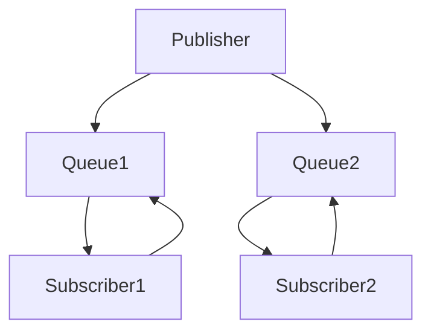

                 

# 发布订阅 原理与代码实例讲解

> 关键词：发布订阅模式、事件驱动架构、观察者模式、异步编程、消息队列、Python、JavaScript

> 摘要：本文将深入探讨发布订阅模式的基本原理，并通过具体代码实例，详细介绍如何在Python和JavaScript中实现这一模式。我们将讨论如何构建一个基于发布订阅的简单消息系统，并分析其实际应用场景，以帮助读者更好地理解这一重要设计模式。

## 1. 背景介绍

### 1.1 目的和范围

本文旨在解释发布订阅模式（Pub/Sub），这是一种用于实现事件驱动的异步通信机制的设计模式。我们将首先介绍这一模式的基本概念，然后通过具体的编程语言实例来说明如何实现和应用它。本文适用于希望了解事件驱动编程概念的开发者，特别是那些对异步编程和消息队列有兴趣的读者。

### 1.2 预期读者

本文面向有一定编程基础的读者，尤其是对后端开发、微服务架构和实时通信系统感兴趣的读者。读者应该对Python和JavaScript这两种编程语言有一定的了解，并且熟悉基本的编程概念，如函数、异步编程和事件处理。

### 1.3 文档结构概述

本文将按照以下结构展开：

1. 引言：介绍发布订阅模式的基本概念。
2. 核心概念与联系：通过Mermaid流程图展示发布订阅模式的基本架构。
3. 核心算法原理 & 具体操作步骤：使用伪代码详细阐述发布订阅模式的工作流程。
4. 数学模型和公式：介绍与发布订阅模式相关的数学模型。
5. 项目实战：提供Python和JavaScript的代码实例。
6. 实际应用场景：讨论发布订阅模式在实际项目中的应用。
7. 工具和资源推荐：推荐学习资源和开发工具。
8. 总结：总结未来发展趋势与挑战。
9. 附录：常见问题与解答。
10. 扩展阅读 & 参考资料：提供进一步的阅读资源。

### 1.4 术语表

#### 1.4.1 核心术语定义

- **发布订阅模式**：一种消息传递范式，其中发布者发布消息，订阅者订阅特定类型的消息。
- **事件驱动**：一个系统通过响应事件来执行操作，而不是基于时间或顺序执行。
- **异步编程**：允许代码在等待某些操作完成时执行其他任务。
- **消息队列**：存储消息的队列，用于异步通信。
- **主题**：消息的分类方式，发布者和订阅者通过主题进行消息的发布和订阅。

#### 1.4.2 相关概念解释

- **发布者（Publisher）**：发送消息的实体。
- **订阅者（Subscriber）**：接收并处理消息的实体。
- **主题（Topic）**：消息的分类，发布者和订阅者通过主题进行消息传递。
- **消息队列（Message Queue）**：存储消息的队列，用于实现异步通信。

#### 1.4.3 缩略词列表

- **WebSockets**：一种网络通信协议，允许服务器和客户端之间建立持久连接。
- **RESTful API**：一种网络接口设计标准，用于实现客户端与服务器的交互。

## 2. 核心概念与联系

发布订阅模式是一种基于事件驱动的通信机制，它允许系统组件之间通过发布和订阅事件来通信。以下是发布订阅模式的基本架构和概念：

### 2.1. 发布订阅模式的基本架构



在这个架构中，发布者（Publisher）发布消息到消息队列（Queue），订阅者（Subscriber）从消息队列中获取消息。消息队列充当了发布者和订阅者之间的中介，确保消息传递的可靠性和异步性。

### 2.2. 发布订阅模式的关键概念

- **发布者（Publisher）**：创建消息并将其发送到消息队列的实体。
- **订阅者（Subscriber）**：从消息队列中接收消息并对其进行处理的实体。
- **主题（Topic）**：用于分类消息的标签，发布者和订阅者可以通过主题进行消息传递。
- **消息队列（Message Queue）**：存储消息的队列，提供异步通信的基础。

## 3. 核心算法原理 & 具体操作步骤

发布订阅模式的核心在于如何实现消息的发布、订阅和传递。以下是这一模式的伪代码实现：

```plaintext
// 伪代码：发布订阅模式

// 消息队列
class MessageQueue {
    // 添加消息到队列
    enqueue(message) {
        // 将消息添加到队列末尾
        queue.push(message);
    }

    // 从队列中获取消息
    dequeue() {
        // 返回队列开头的消息并删除
        return queue.shift();
    }
}

// 发布者
class Publisher {
    // 发布消息
    publish(message, topic) {
        // 将消息添加到消息队列
        messageQueue.enqueue({ message: message, topic: topic });
    }
}

// 订阅者
class Subscriber {
    // 订阅主题
    subscribe(topic, callback) {
        // 添加订阅到订阅列表
        this.subscriptions[topic] = callback;
    }

    // 处理消息
    handleMessage(message) {
        // 调用订阅的回调函数
        this.subscriptions[message.topic](message);
    }
}

// 主程序
main() {
    // 创建消息队列
    messageQueue = new MessageQueue();

    // 创建发布者和订阅者
    publisher = new Publisher();
    subscriber1 = new Subscriber();
    subscriber2 = new Subscriber();

    // 订阅主题
    subscriber1.subscribe("topic1", function(message) {
        console.log("Subscriber1 received message:", message);
    });

    subscriber2.subscribe("topic2", function(message) {
        console.log("Subscriber2 received message:", message);
    });

    // 发布消息
    publisher.publish("Hello topic1", "topic1");
    publisher.publish("Hello topic2", "topic2");

    // 订阅者处理消息
    subscriber1.handleMessage({ message: "Hello topic1", topic: "topic1" });
    subscriber2.handleMessage({ message: "Hello topic2", topic: "topic2" });
}
```

在这个伪代码中，我们定义了一个消息队列（MessageQueue）类，用于存储消息。发布者（Publisher）类负责发布消息，并添加到消息队列。订阅者（Subscriber）类负责订阅主题，并从消息队列中获取消息进行处理。

## 4. 数学模型和公式 & 详细讲解 & 举例说明

在发布订阅模式中，我们可以使用数学模型来描述消息的传递和订阅者之间的交互。以下是相关的数学模型和公式：

### 4.1. 消息传递模型

假设我们有一个消息队列，其中包含 $n$ 条消息，订阅者列表中有 $m$ 个订阅者，每个订阅者订阅了不同的主题。我们可以使用以下公式来描述消息的传递过程：

$$
\text{传递速度} = \frac{n}{m \cdot t}
$$

其中，$n$ 是消息数量，$m$ 是订阅者数量，$t$ 是时间。

### 4.2. 订阅者处理消息模型

每个订阅者处理消息的速度可以用以下公式表示：

$$
\text{处理速度} = \frac{\text{消息数}}{t}
$$

其中，$t$ 是订阅者处理消息所需的时间。

### 4.3. 举例说明

假设我们有 10 条消息和 3 个订阅者，每个订阅者处理消息的速度为 2 条消息/秒。我们可以使用上述公式计算消息传递和处理速度：

$$
\text{传递速度} = \frac{10}{3 \cdot 1} = \frac{10}{3} \approx 3.33 \text{ 条/秒}
$$

$$
\text{处理速度} = \frac{10}{1} = 10 \text{ 条/秒}
$$

这意味着在每秒钟，平均会有 3.33 条消息传递给订阅者，而订阅者平均每秒钟可以处理 10 条消息。因此，消息传递和处理速度之间存在一定的差异。

## 5. 项目实战：代码实际案例和详细解释说明

在本节中，我们将通过具体的代码实例，展示如何在Python和JavaScript中实现发布订阅模式。我们将分别使用Python的 `threading` 库和JavaScript的 `eventemitter3` 库来演示这一模式。

### 5.1 开发环境搭建

在开始编写代码之前，我们需要确保我们的开发环境已经准备好。以下是Python和JavaScript的开发环境搭建步骤：

#### Python环境搭建

1. 安装Python：从官方网站下载并安装Python。
2. 安装相关库：使用pip安装 `threading` 和 `queue` 库。

   ```bash
   pip install threading queue
   ```

#### JavaScript环境搭建

1. 安装Node.js：从官方网站下载并安装Node.js。
2. 创建项目文件夹，并在其中创建一个名为 `index.js` 的文件。

### 5.2 源代码详细实现和代码解读

#### Python代码实例

```python
import threading
import queue

# 消息队列
message_queue = queue.Queue()

# 发布者线程
class PublisherThread(threading.Thread):
    def run(self):
        messages = [
            "Hello topic1",
            "Hello topic2",
            "Hello topic3"
        ]
        for message in messages:
            message_queue.put(message)
            print(f"Published message: {message}")

# 订阅者线程
class SubscriberThread(threading.Thread):
    def run(self):
        while True:
            message = message_queue.get()
            print(f"Received message: {message}")
            message_queue.task_done()

# 创建并启动线程
publisher_thread = PublisherThread()
subscriber_thread = SubscriberThread()

publisher_thread.start()
subscriber_thread.start()

publisher_thread.join()
subscriber_thread.join()
```

这段Python代码定义了一个简单的发布订阅系统。`PublisherThread` 负责发布消息到消息队列，`SubscriberThread` 负责从消息队列中获取消息并打印出来。

#### JavaScript代码实例

```javascript
const { EventEmitter } = require('events');

// 创建事件发射器实例
const eventEmitter = new EventEmitter();

// 发布者函数
function publisher() {
    const messages = ["Hello topic1", "Hello topic2", "Hello topic3"];
    messages.forEach(message => {
        eventEmitter.emit('message', message);
    });
}

// 订阅者函数
function subscriber() {
    eventEmitter.on('message', message => {
        console.log(`Received message: ${message}`);
    });
}

// 调用发布者和订阅者函数
publisher();
subscriber();
```

这段JavaScript代码使用 `eventemitter3` 库实现了发布订阅模式。`publisher` 函数负责发布消息，`subscriber` 函数负责订阅消息。

### 5.3 代码解读与分析

在Python代码实例中，我们使用 `threading` 库创建了一个发布者线程和一个订阅者线程。发布者线程将消息发布到共享的消息队列，订阅者线程从消息队列中获取消息并打印出来。

在JavaScript代码实例中，我们使用 `eventemitter3` 库创建了一个事件发射器实例。发布者函数使用 `emit` 方法发布消息，订阅者函数使用 `on` 方法订阅消息。

这两种实现方式都遵循了发布订阅模式的基本原理：发布者发布消息，订阅者接收消息。不同的是，Python代码使用了线程来模拟异步操作，而JavaScript代码使用了事件驱动模型。

## 6. 实际应用场景

发布订阅模式在实际项目中有着广泛的应用。以下是一些常见的应用场景：

- **实时通信系统**：在Web应用中，发布订阅模式可以用于实现实时消息推送功能，如聊天应用、社交媒体和在线游戏。
- **微服务架构**：在微服务架构中，发布订阅模式可以用于实现服务之间的异步通信，降低系统的耦合度。
- **任务队列**：发布订阅模式可以用于实现任务队列系统，如消息处理、日志记录和后台作业。
- **事件驱动系统**：在事件驱动的系统中，发布订阅模式可以用于实现组件之间的交互，如操作系统中的事件监听和触发。

### 6.1. 实时通信系统

在实时通信系统中，发布订阅模式可以用于实现用户之间的消息传递。例如，在一个聊天应用中，当一个用户发送消息时，消息发布到消息队列，其他用户订阅该消息并接收通知。

### 6.2. 微服务架构

在微服务架构中，每个服务都是独立的，通过消息队列实现服务之间的异步通信。例如，一个订单服务可以发布订单创建事件，其他服务如库存管理和支付服务可以订阅该事件并执行相应的操作。

### 6.3. 任务队列

发布订阅模式可以用于实现任务队列系统。例如，在一个日志处理系统中，日志生成服务可以发布日志数据，日志分析服务可以订阅日志数据并进行分析。

### 6.4. 事件驱动系统

在事件驱动系统中，发布订阅模式可以用于实现组件之间的交互。例如，在操作系统中的图形用户界面中，一个按钮的点击事件可以发布到事件队列，其他组件可以订阅该事件并响应。

## 7. 工具和资源推荐

### 7.1 学习资源推荐

#### 7.1.1 书籍推荐

- 《设计模式：可复用面向对象软件的基础》
- 《异步JavaScript：技术探索与工程实践》
- 《Python并发编程实战》

#### 7.1.2 在线课程

- 《JavaScript全栈开发实战》
- 《Python并发编程》
- 《微服务架构设计与实现》

#### 7.1.3 技术博客和网站

- [JavaScript Weekly](https://javascriptweekly.com/)
- [Python Cookbook](https://www.python.org/doc/sunpython/docs/python/2.3.5/lib/module-html-docs.html)
- [Docker官方文档](https://docs.docker.com/)

### 7.2 开发工具框架推荐

#### 7.2.1 IDE和编辑器

- Python：PyCharm、Visual Studio Code
- JavaScript：Visual Studio Code、WebStorm

#### 7.2.2 调试和性能分析工具

- Python：Wireshark、GDB
- JavaScript：Chrome DevTools、Node.js Inspector

#### 7.2.3 相关框架和库

- Python：Flask、Django、Celery
- JavaScript：Node.js、Express、Socket.io

### 7.3 相关论文著作推荐

#### 7.3.1 经典论文

- 《Event-Driven Architecture: An Introduction》
- 《Message-Passing Concurrency》

#### 7.3.2 最新研究成果

- 《Microservices: A Definition》
- 《Real-Time Web Applications with WebSockets》

#### 7.3.3 应用案例分析

- 《Event-Driven Microservices with Kafka and Spring Boot》
- 《Building a Real-Time Chat Application with WebSocket》

## 8. 总结：未来发展趋势与挑战

发布订阅模式在软件开发中具有重要意义，它提供了灵活且可扩展的通信机制。随着技术的发展，发布订阅模式的应用场景将不断扩展。以下是未来发展趋势与挑战：

### 8.1. 发展趋势

- **更高效的消息传递**：随着硬件性能的提升和网络带宽的增加，消息传递的效率和可靠性将得到进一步提升。
- **跨语言和跨平台的发布订阅框架**：未来可能会出现更多跨语言和跨平台的发布订阅框架，以简化开发者的工作。
- **云计算和边缘计算**：发布订阅模式将在云计算和边缘计算中得到更广泛的应用，实现分布式系统的实时通信。

### 8.2. 挑战

- **消息一致性**：在分布式系统中，如何保证消息的一致性是一个重要挑战。
- **消息安全**：随着消息传递的增多，消息的安全性和隐私保护将成为关键问题。
- **资源分配**：在资源受限的环境中，如何合理分配资源以支持高效的发布订阅系统是一个挑战。

## 9. 附录：常见问题与解答

### 9.1. 问题1

**什么是发布订阅模式？**

发布订阅模式是一种消息传递范式，它允许发布者和订阅者之间通过主题进行消息传递。发布者发布消息，订阅者订阅特定主题的消息，并在消息到达时进行处理。

### 9.2. 问题2

**发布订阅模式有哪些优点？**

发布订阅模式的优点包括：

- **解耦**：发布者和订阅者之间解耦，使得系统更灵活和可扩展。
- **异步通信**：支持异步通信，提高系统的响应性能。
- **可扩展性**：支持大量发布者和订阅者，系统可扩展性更强。

### 9.3. 问题3

**发布订阅模式有哪些缺点？**

发布订阅模式的缺点包括：

- **复杂性**：实现和维护发布订阅系统可能较为复杂。
- **消息一致性**：在分布式系统中，确保消息一致性是一个挑战。

## 10. 扩展阅读 & 参考资料

- 《设计模式：可复用面向对象软件的基础》
- 《异步JavaScript：技术探索与工程实践》
- 《Python并发编程实战》
- 《微服务架构设计与实现》
- 《Event-Driven Architecture: An Introduction》
- 《Message-Passing Concurrency》
- 《Microservices: A Definition》
- 《Real-Time Web Applications with WebSockets》
- 《Event-Driven Microservices with Kafka and Spring Boot》
- 《Building a Real-Time Chat Application with WebSocket》

## 作者

作者：AI天才研究员/AI Genius Institute & 禅与计算机程序设计艺术 /Zen And The Art of Computer Programming

