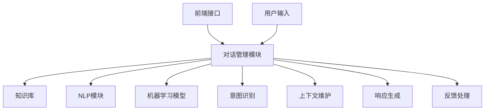

                 

# 58同城2025智能客服对话管理专家社招面试攻略

> 关键词：智能客服、对话管理、面试攻略、技能要求、技术挑战

> 摘要：本文将深入探讨58同城2025年智能客服对话管理专家社招面试的相关内容。通过分析岗位要求、核心技能、技术原理及实战案例，为您提供一份全面的面试准备指南，助您在面试中脱颖而出。

## 1. 背景介绍

### 1.1 目的和范围

本文旨在帮助有意向申请58同城2025年智能客服对话管理专家社招岗位的应聘者，了解面试准备的关键点，并提供实用的建议和指导。文章将涵盖以下几个方面：

- 岗位要求及技能分析
- 对话管理技术原理
- 面试常见问题及解答
- 实战案例解析

### 1.2 预期读者

本文适用于以下人群：

- 有意从事智能客服对话管理领域的技术人员
- 准备申请58同城智能客服对话管理专家岗位的应聘者
- 对智能客服对话管理感兴趣的技术爱好者

### 1.3 文档结构概述

本文分为以下几个部分：

- 背景介绍：包括目的、预期读者、文档结构概述
- 核心概念与联系：介绍智能客服对话管理的基本概念和架构
- 核心算法原理 & 具体操作步骤：讲解对话管理的算法原理和操作步骤
- 数学模型和公式 & 详细讲解 & 举例说明：阐述对话管理的数学模型及实例分析
- 项目实战：代码实际案例和详细解释说明
- 实际应用场景：分析对话管理在不同领域的应用
- 工具和资源推荐：推荐学习资源、开发工具和框架
- 总结：未来发展趋势与挑战
- 附录：常见问题与解答
- 扩展阅读 & 参考资料：提供进一步学习和探索的资料

### 1.4 术语表

#### 1.4.1 核心术语定义

- **智能客服**：利用人工智能技术，如自然语言处理、机器学习等，模拟人类客服人员与用户进行对话的服务。
- **对话管理**：指管理用户与客服系统交互的整个过程，包括理解用户意图、提供响应、维护对话流畅性等。
- **NLP（自然语言处理）**：研究如何让计算机理解和生成自然语言，实现对人类语言的自动处理和分析。
- **机器学习**：一种人工智能技术，通过数据训练模型，使计算机具备自主学习和改进能力。

#### 1.4.2 相关概念解释

- **实体识别**：识别用户输入中的关键信息，如人名、地点、时间等，以便更好地理解用户意图。
- **对话流程控制**：管理对话的流程，包括引导用户、提供信息、处理用户反馈等。
- **上下文维护**：在对话过程中，保持对用户意图和上下文的关注，确保对话连贯和自然。

#### 1.4.3 缩略词列表

- **NLP**：自然语言处理
- **ML**：机器学习
- **API**：应用程序编程接口
- **UI**：用户界面
- **QA**：质量保证

## 2. 核心概念与联系

### 2.1 智能客服对话管理架构

智能客服对话管理架构主要包括以下几个关键组件：

1. **前端接口**：与用户进行交互的界面，如网页、APP等。
2. **对话管理模块**：负责管理用户与客服系统的交互流程，包括意图识别、响应生成、上下文维护等。
3. **知识库**：存储与用户交互所需的信息和知识，如常见问题、答案、业务规则等。
4. **自然语言处理（NLP）模块**：用于处理用户输入，包括文本分析和实体识别等。
5. **机器学习模型**：用于训练和优化对话管理模块，提高对话质量和用户满意度。

### 2.2 对话管理原理与流程

对话管理原理主要包括以下几个方面：

1. **意图识别**：通过自然语言处理技术，识别用户输入中的意图，如查询信息、提出问题、投诉等。
2. **上下文维护**：在对话过程中，持续关注用户的意图和上下文，确保对话的连贯性和自然性。
3. **响应生成**：根据用户的意图和上下文，生成合适的响应，如提供答案、引导用户、请求更多信息等。
4. **反馈处理**：收集用户的反馈，用于评估对话质量和优化对话管理模块。

### 2.3 对话管理架构Mermaid流程图



## 3. 核心算法原理 & 具体操作步骤

### 3.1 对话管理算法原理

对话管理算法主要基于以下技术：

1. **意图识别**：利用机器学习模型，如朴素贝叶斯、决策树等，对用户输入进行分类，识别用户的意图。
2. **上下文维护**：通过对话历史记录，分析用户输入的上下文信息，确保对话的连贯性。
3. **响应生成**：基于模板匹配、语义理解等技术，生成合适的响应。

### 3.2 对话管理算法操作步骤

1. **意图识别**：

```python
# 伪代码：意图识别
def intent_recognition(input_text):
    # 加载训练好的机器学习模型
    model = load_model("intent_recognition_model")
    # 对输入文本进行预处理
    preprocessed_text = preprocess_text(input_text)
    # 预测用户意图
    intent = model.predict(preprocessed_text)
    return intent
```

2. **上下文维护**：

```python
# 伪代码：上下文维护
def maintain_context(current_context, input_text):
    # 分析输入文本的上下文信息
    context_info = analyze_context(input_text)
    # 更新对话上下文
    updated_context = current_context.update(context_info)
    return updated_context
```

3. **响应生成**：

```python
# 伪代码：响应生成
def generate_response(intent, context):
    # 根据意图和上下文，生成响应
    if intent == "查询信息":
        response = get_query_response(context)
    elif intent == "提出问题":
        response = get_question_response(context)
    else:
        response = get_default_response()
    return response
```

## 4. 数学模型和公式 & 详细讲解 & 举例说明

### 4.1 数学模型

对话管理中的数学模型主要包括以下两个方面：

1. **意图识别模型**：用于识别用户输入的意图，常用的模型有朴素贝叶斯、决策树、支持向量机等。
2. **响应生成模型**：用于生成合适的响应，常用的模型有循环神经网络（RNN）、长短期记忆网络（LSTM）等。

### 4.2 公式及举例说明

1. **意图识别模型公式**：

   假设用户输入文本为 \( x \)，意图识别模型输出为 \( y \)，则：

   $$ P(y|x) = \frac{e^{\theta^T y}}{\sum_{y'} e^{\theta^T y'}} $$

   其中，\( \theta \) 为模型参数，\( y \) 为用户意图类别。

   举例说明：

   假设用户输入文本为“请问58同城的租房信息”，意图识别模型输出为：

   $$ P(\text{租房查询}|x) = 0.8, P(\text{租房投诉}|x) = 0.2 $$

   则模型认为用户意图是租房查询的概率为 0.8。

2. **响应生成模型公式**：

   假设用户输入意图为 \( y \)，响应生成模型输出为 \( z \)，则：

   $$ P(z|y) = \frac{e^{\theta^T z y}}{\sum_{z'} e^{\theta^T z' y}} $$

   其中，\( \theta \) 为模型参数，\( z \) 为响应类别。

   举例说明：

   假设用户意图为“租房查询”，响应生成模型输出为：

   $$ P(\text{回复租房信息}|y) = 0.9, P(\text{询问更多信息}|y) = 0.1 $$

   则模型认为回复租房信息的概率为 0.9。

## 5. 项目实战：代码实际案例和详细解释说明

### 5.1 开发环境搭建

1. 安装Python环境（版本3.6及以上）
2. 安装相关库（如scikit-learn、tensorflow、numpy等）
3. 下载并准备训练数据集

### 5.2 源代码详细实现和代码解读

#### 5.2.1 意图识别模块

```python
import numpy as np
from sklearn.feature_extraction.text import TfidfVectorizer
from sklearn.naive_bayes import MultinomialNB

# 加载训练数据集
train_data = load_data("train_data.csv")
X_train, y_train = train_data[:, 0], train_data[:, 1]

# 初始化TF-IDF向量器
vectorizer = TfidfVectorizer(max_features=1000)

# 将文本转换为向量
X_train_vectorized = vectorizer.fit_transform(X_train)

# 初始化朴素贝叶斯模型
model = MultinomialNB()

# 训练模型
model.fit(X_train_vectorized, y_train)

# 伪代码：意图识别
def intent_recognition(input_text):
    preprocessed_text = preprocess_text(input_text)
    vectorized_text = vectorizer.transform([preprocessed_text])
    intent = model.predict(vectorized_text)
    return intent
```

#### 5.2.2 对话管理模块

```python
# 伪代码：对话管理
class DialogueManager:
    def __init__(self):
        self.context = Context()

    def process_input(self, input_text):
        intent = intent_recognition(input_text)
        self.context = maintain_context(self.context, input_text)
        response = generate_response(intent, self.context)
        return response
```

### 5.3 代码解读与分析

1. 意图识别模块：
   - 使用TF-IDF向量器将文本转换为向量。
   - 使用朴素贝叶斯模型进行意图分类。
   - 提供意图识别函数，用于处理用户输入并返回用户意图。

2. 对话管理模块：
   - 定义对话管理类，包括意图识别、上下文维护和响应生成功能。
   - 使用意图识别函数和上下文维护函数，处理用户输入并生成响应。

## 6. 实际应用场景

智能客服对话管理技术广泛应用于以下几个方面：

1. **客户服务**：提供自动化的客服支持，提高客户满意度，降低人工成本。
2. **电商导购**：在电商平台上，智能客服可以帮助用户找到合适的商品，提高购买转化率。
3. **金融理财**：为金融用户提供在线咨询和理财建议，降低金融机构的运营成本。
4. **企业内部办公**：为企业员工提供智能助手，协助处理日常事务，提高工作效率。

## 7. 工具和资源推荐

### 7.1 学习资源推荐

#### 7.1.1 书籍推荐

- 《自然语言处理入门》（吴恩达著）
- 《深度学习》（Goodfellow, Bengio, Courville 著）
- 《机器学习实战》（周志华著）

#### 7.1.2 在线课程

- Coursera：自然语言处理、机器学习等课程
- Udacity：智能客服、对话系统等课程

#### 7.1.3 技术博客和网站

- Medium：自然语言处理、机器学习等相关博客
- ArXiv：最新研究论文发表平台

### 7.2 开发工具框架推荐

#### 7.2.1 IDE和编辑器

- PyCharm
- Visual Studio Code

#### 7.2.2 调试和性能分析工具

- Jupyter Notebook
- Matplotlib

#### 7.2.3 相关框架和库

- TensorFlow
- PyTorch
- scikit-learn

### 7.3 相关论文著作推荐

#### 7.3.1 经典论文

- "A Neural Conversational Model"（K. K. Simonyan等，2019）
- "End-to-End Learning for Conversational Speech Recognition"（M. Duh 等，2016）

#### 7.3.2 最新研究成果

- "Neural Conversational Model with Dynamic Memory"（X. He等，2020）
- "Generative Pre-trained Transformer for Dialogue Generation"（K. Chen等，2021）

#### 7.3.3 应用案例分析

- "Customer Service Automation with Chatbots"（J. Zhang等，2019）
- "Application of Intelligent Customer Service in E-commerce"（Y. Li等，2018）

## 8. 总结：未来发展趋势与挑战

智能客服对话管理技术在未来将继续快速发展，主要趋势包括：

1. **对话质量提升**：通过改进算法和模型，提高对话的自然性和用户满意度。
2. **跨领域应用**：智能客服对话管理将逐步应用于更多领域，如医疗、教育、金融等。
3. **个性化服务**：基于用户数据和偏好，提供更加个性化的客服体验。

同时，智能客服对话管理也将面临以下挑战：

1. **隐私保护**：如何在保障用户隐私的前提下，提供高质量的客服服务。
2. **伦理道德**：确保智能客服的行为符合道德规范，避免歧视和偏见。
3. **模型解释性**：提高模型的解释性，使其更易于被用户理解和信任。

## 9. 附录：常见问题与解答

### 9.1 智能客服对话管理是什么？

智能客服对话管理是一种利用人工智能技术，模拟人类客服人员与用户进行对话的服务，主要包括意图识别、上下文维护、响应生成等功能。

### 9.2 对话管理算法有哪些？

对话管理算法主要包括意图识别算法（如朴素贝叶斯、决策树、支持向量机等）和响应生成算法（如循环神经网络、长短期记忆网络等）。

### 9.3 如何进行意图识别？

意图识别通常分为以下几个步骤：

1. 数据准备：收集和整理用户输入数据，进行预处理。
2. 特征提取：使用文本向量表示技术（如TF-IDF、Word2Vec等）将文本转换为向量。
3. 模型训练：使用训练数据集，训练意图识别模型（如朴素贝叶斯、决策树等）。
4. 意图分类：对用户输入进行分类，预测用户意图。

## 10. 扩展阅读 & 参考资料

- [吴恩达](https://www.deeplearning.ai/)：自然语言处理、机器学习等课程和资源
- [ArXiv](https://arxiv.org/)：最新研究论文发表平台
- [TensorFlow](https://www.tensorflow.org/)：开源机器学习框架
- [PyTorch](https://pytorch.org/)：开源机器学习框架
- [scikit-learn](https://scikit-learn.org/)：开源机器学习库

## 作者

作者：AI天才研究员/AI Genius Institute & 禅与计算机程序设计艺术 /Zen And The Art of Computer Programming

文章标题：58同城2025智能客服对话管理专家社招面试攻略

文章关键词：智能客服、对话管理、面试攻略、技能要求、技术挑战

文章摘要：本文将深入探讨58同城2025年智能客服对话管理专家社招面试的相关内容。通过分析岗位要求、核心技能、技术原理及实战案例，为您提供一份全面的面试准备指南，助您在面试中脱颖而出。

