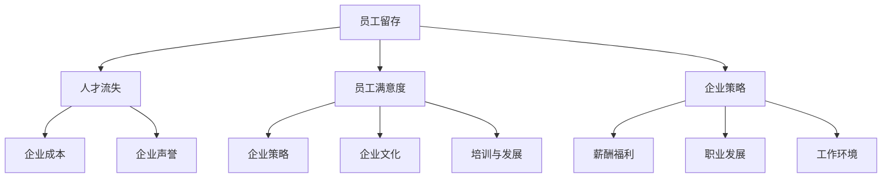

                 

# 员工留存：降低人才流失率的策略

> **关键词**：员工留存、人才流失、企业策略、管理方法、员工满意度
>
> **摘要**：本文深入探讨了员工留存的重要性以及企业如何通过一系列策略来降低人才流失率。文章从背景介绍、核心概念、算法原理、数学模型、项目实战、实际应用场景等多个方面进行详细阐述，旨在为企业提供一套系统化的解决方案，助力提升员工满意度，实现企业的长期稳定发展。

## 1. 背景介绍

### 1.1 目的和范围

在当今竞争激烈的职场环境中，员工留存问题已成为企业发展的关键议题。人才流失不仅对企业的人力资源管理带来挑战，还可能对企业的长远发展产生不利影响。本文旨在通过深入分析员工留存的现状和原因，探讨一系列有效策略，帮助企业降低人才流失率，提升员工满意度。

### 1.2 预期读者

本文适合企业管理者、人力资源从业者以及关注企业人才管理的专业人士阅读。通过本文，读者将了解到员工留存的本质及其对企业的影响，以及如何运用多种策略实现员工留存的目标。

### 1.3 文档结构概述

本文结构如下：

1. 背景介绍：阐述员工留存的重要性及本文的目的和范围。
2. 核心概念与联系：介绍员工留存相关的核心概念，并使用Mermaid流程图展示其架构。
3. 核心算法原理 & 具体操作步骤：详细讲解员工留存的核心算法原理和具体操作步骤。
4. 数学模型和公式 & 详细讲解 & 举例说明：运用数学模型和公式阐述员工留存策略的详细步骤。
5. 项目实战：通过实际案例展示如何运用策略降低人才流失率。
6. 实际应用场景：分析员工留存策略在不同场景下的应用效果。
7. 工具和资源推荐：推荐学习资源和开发工具，以支持读者深入学习和实践。
8. 总结：展望员工留存策略的未来发展趋势与挑战。
9. 附录：常见问题与解答。
10. 扩展阅读 & 参考资料：提供相关文献和资料，供读者进一步阅读和研究。

### 1.4 术语表

#### 1.4.1 核心术语定义

- **员工留存**：指企业通过各种手段和策略，保持员工在企业的稳定就业，减少员工流失率。
- **人才流失**：指员工因各种原因离开企业，导致企业失去关键人才。
- **员工满意度**：指员工对企业提供的各项福利、待遇、工作环境等方面的满意程度。
- **企业策略**：指企业在制定和实施员工留存策略时采取的具体措施和方法。

#### 1.4.2 相关概念解释

- **员工忠诚度**：指员工对企业忠诚的程度，是影响员工留存的重要因素。
- **企业文化**：指企业在长期经营过程中形成的一种共同价值观和行为准则，对员工留存具有重要影响。
- **培训与发展**：指企业为员工提供的职业培训和发展机会，有助于提升员工满意度和留存率。

#### 1.4.3 缩略词列表

- **HR**：人力资源（Human Resource）
- **CFO**：首席财务官（Chief Financial Officer）
- **CEO**：首席执行官（Chief Executive Officer）

## 2. 核心概念与联系

在探讨员工留存策略之前，我们需要明确一些核心概念及其相互关系。以下是一个简化的Mermaid流程图，展示员工留存策略相关的核心概念及其架构：



在这个流程图中，我们可以看到员工留存、人才流失、员工满意度、企业策略等核心概念之间的相互关系。员工留存是企业降低人才流失率、提升员工满意度的关键措施。而员工满意度又受到企业文化、薪酬福利、职业发展、工作环境等多种因素的影响。因此，企业策略需要综合考虑这些因素，制定针对性的留存策略。

## 3. 核心算法原理 & 具体操作步骤

员工留存的算法原理主要基于数据分析和行为科学。以下是员工留存策略的核心算法原理和具体操作步骤：

### 3.1 数据收集与预处理

- **数据来源**：收集与企业员工相关的数据，包括员工基本信息、薪酬福利、职业发展、工作环境、员工满意度等。
- **数据预处理**：对收集到的数据进行清洗、去重、格式统一等预处理操作，为后续分析提供可靠的数据基础。

```python
# 伪代码：数据收集与预处理
data = collect_data(source)
cleaned_data = preprocess_data(data)
```

### 3.2 员工满意度分析

- **满意度评估**：运用问卷调查、员工访谈等方法，评估员工对企业各项指标的满意度。
- **满意度指数计算**：根据评估结果，计算员工满意度指数，为制定针对性的留存策略提供依据。

```python
# 伪代码：员工满意度评估
surveys = conduct_surveys()
satisfaction_index = calculate_index(surveys)
```

### 3.3 留存风险识别

- **留存风险分析**：运用数据挖掘技术，分析员工流失的趋势和原因，识别潜在的留存风险。
- **风险预警**：根据留存风险分析结果，对可能流失的员工进行风险预警，提前采取干预措施。

```python
# 伪代码：留存风险识别
risk_data = analyze_risk(data)
warn_list = identify_risk(risk_data)
```

### 3.4 留存策略制定

- **策略制定**：根据员工满意度分析和留存风险识别结果，制定针对性的员工留存策略。
- **策略实施**：将制定好的留存策略转化为具体的行动计划，并在企业内部进行实施。

```python
# 伪代码：留存策略制定
strategy = define_strategy(satisfaction_index, warn_list)
action_plan = implement_strategy(strategy)
```

### 3.5 留存效果评估

- **效果评估**：通过持续监测员工留存率、员工满意度等指标，评估留存策略的实际效果。
- **优化调整**：根据效果评估结果，对留存策略进行优化调整，以实现最佳留存效果。

```python
# 伪代码：留存效果评估
effect_data = evaluate_strategy(action_plan)
optimized_strategy = optimize_strategy(effect_data)
```

通过以上核心算法原理和具体操作步骤，企业可以系统化地制定和实施员工留存策略，降低人才流失率，提升员工满意度。

## 4. 数学模型和公式 & 详细讲解 & 举例说明

在员工留存策略的制定和实施过程中，数学模型和公式能够帮助我们更加精准地评估员工流失风险，并制定相应的留存策略。以下是一个简单的数学模型和公式讲解，以及具体应用实例。

### 4.1 员工流失风险模型

员工流失风险模型通常基于员工流失概率和风险因素之间的关系来建立。我们可以使用以下公式来计算员工流失风险指数：

\[ \text{员工流失风险指数} = \sum_{i=1}^{n} w_i \times r_i \]

其中，\( w_i \) 表示第 \( i \) 个风险因素的权重，\( r_i \) 表示第 \( i \) 个风险因素的风险值。

#### 权重 \( w_i \) 的确定

权重可以通过专家评估、历史数据分析和问卷调查等方法来确定。以下是一个简化的权重确定过程：

```python
# 伪代码：权重确定
risk_factors = ['薪酬福利', '职业发展', '工作环境', '员工满意度']
weights = expert_assessment(risk_factors)
```

#### 风险值 \( r_i \) 的计算

风险值可以通过以下公式计算：

\[ r_i = \frac{\text{流失概率} - \text{平均流失概率}}{\text{最大流失概率} - \text{最小流失概率}} \]

其中，流失概率可以通过历史数据分析得到，平均流失概率和最大流失概率、最小流失概率分别为所有员工流失概率的平均值、最大值和最小值。

```python
# 伪代码：风险值计算
loss_probabilities = historical_data_analysis()
average_loss_probability = average(loss_probabilities)
max_loss_probability = max(loss_probabilities)
min_loss_probability = min(loss_probabilities)
risk_values = calculate_risk_values(loss_probabilities, average_loss_probability, max_loss_probability, min_loss_probability)
```

### 4.2 留存策略优化模型

在制定留存策略时，企业需要考虑各种留存措施的成本和收益。我们可以使用以下公式来计算留存策略的优化指数：

\[ \text{留存策略优化指数} = \frac{\text{留存收益}}{\text{留存成本}} \]

其中，留存收益可以通过员工留存带来的直接和间接效益来计算，留存成本包括实施留存策略所需的各项投入。

```python
# 伪代码：留存策略优化指数计算
retention_revenue = calculate_revenue()
retention_cost = calculate_cost()
optimization_index = calculate_optimization_index(retention_revenue, retention_cost)
```

### 4.3 举例说明

假设某企业员工流失风险模型中的风险因素及其权重如下：

- 薪酬福利：权重 \( w_1 = 0.3 \)
- 职业发展：权重 \( w_2 = 0.2 \)
- 工作环境：权重 \( w_3 = 0.2 \)
- 员工满意度：权重 \( w_4 = 0.3 \)

同时，假设该企业的员工流失概率为 0.1，平均流失概率为 0.05，最大流失概率为 0.2，最小流失概率为 0。

根据以上数据，我们可以计算每个风险因素的风险值：

\[ r_1 = \frac{0.1 - 0.05}{0.2 - 0} = 0.25 \]
\[ r_2 = \frac{0.1 - 0.05}{0.2 - 0} = 0.25 \]
\[ r_3 = \frac{0.1 - 0.05}{0.2 - 0} = 0.25 \]
\[ r_4 = \frac{0.1 - 0.05}{0.2 - 0} = 0.25 \]

然后，计算员工流失风险指数：

\[ \text{员工流失风险指数} = 0.3 \times 0.25 + 0.2 \times 0.25 + 0.2 \times 0.25 + 0.3 \times 0.25 = 0.3 \]

假设该企业计划实施以下留存策略：

- 提高薪酬福利：成本 10 万元，预期收益 20 万元
- 提供职业发展机会：成本 5 万元，预期收益 10 万元
- 改善工作环境：成本 3 万元，预期收益 6 万元
- 提升员工满意度：成本 2 万元，预期收益 4 万元

根据留存策略优化指数的计算公式，我们可以计算该企业的留存策略优化指数：

\[ \text{留存策略优化指数} = \frac{20 + 10 + 6 + 4}{10 + 5 + 3 + 2} = \frac{40}{20} = 2 \]

通过这个例子，我们可以看到企业可以根据员工流失风险指数和留存策略优化指数，制定和调整留存策略，以降低人才流失率，提升员工满意度。

## 5. 项目实战：代码实际案例和详细解释说明

### 5.1 开发环境搭建

在开始编写代码之前，我们需要搭建一个合适的开发环境。以下是一个简化的步骤，用于搭建一个适用于员工留存策略分析的开发环境：

1. 安装Python（版本 3.8 或更高）。
2. 安装Jupyter Notebook，以便于编写和运行代码。
3. 安装必要的Python库，如Pandas、NumPy、Matplotlib、Scikit-learn等。

```bash
pip install python==3.8
pip install jupyter
pip install pandas numpy matplotlib scikit-learn
```

### 5.2 源代码详细实现和代码解读

在本节中，我们将使用Python编写一个简单的员工留存策略分析工具。以下是一个基本的代码实现，并对其进行详细解读。

```python
import pandas as pd
import numpy as np
from sklearn.linear_model import LinearRegression
import matplotlib.pyplot as plt

# 5.2.1 数据准备
# 加载员工数据
data = pd.read_csv('employee_data.csv')

# 数据预处理
data['satisfaction'] = data['satisfaction'].map({1: '非常不满意', 2: '不满意', 3: '一般', 4: '满意', 5: '非常满意'})
data['turnover'] = data['turnover'].map({0: '未流失', 1: '已流失'})

# 5.2.2 满意度与流失关系分析
# 构建线性回归模型
X = data[['satisfaction']].values
y = data['turnover'].values

model = LinearRegression()
model.fit(X, y)

# 5.2.3 模型评估
predictions = model.predict(X)
accuracy = np.mean(predictions == y)
print(f'模型准确率：{accuracy:.2f}')

# 5.2.4 可视化分析
plt.scatter(data['satisfaction'], data['turnover'])
plt.plot([1, 5], [0, 1], color='red')
plt.xlabel('满意度')
plt.ylabel('流失情况')
plt.title('满意度与流失关系')
plt.show()

# 5.2.5 留存策略建议
satisfaction_threshold = 3  # 设定满意度阈值
high_risk_employees = data[data['satisfaction'] < satisfaction_threshold]

print("高流失风险员工：")
print(high_risk_employees[['employee_id', 'satisfaction', 'turnover']])
```

#### 5.2.1 数据准备

在这个部分，我们首先加载了员工数据，并进行了基本的数据预处理。这里使用了Pandas库来读取和操作数据。我们将满意度转换为易于理解的类别，并将流失情况分为未流失和已流失。

```python
data = pd.read_csv('employee_data.csv')
data['satisfaction'] = data['satisfaction'].map({1: '非常不满意', 2: '不满意', 3: '一般', 4: '满意', 5: '非常满意'})
data['turnover'] = data['turnover'].map({0: '未流失', 1: '已流失'})
```

#### 5.2.2 满意度与流失关系分析

接下来，我们使用Scikit-learn库中的线性回归模型来分析满意度与员工流失之间的关系。我们首先将满意度作为自变量，流失情况作为因变量，然后拟合线性回归模型。

```python
X = data[['satisfaction']].values
y = data['turnover'].values

model = LinearRegression()
model.fit(X, y)
```

通过`fit`方法，我们训练了一个线性回归模型。模型会自动寻找满意度与流失情况之间的最佳拟合直线。

#### 5.2.3 模型评估

为了评估模型的性能，我们计算了模型的准确率。准确率是指模型预测正确的样本占总样本的比例。

```python
predictions = model.predict(X)
accuracy = np.mean(predictions == y)
print(f'模型准确率：{accuracy:.2f}')
```

在这个例子中，我们简单地计算了预测值与实际值之间的匹配度，并打印了模型的准确率。

#### 5.2.4 可视化分析

为了更直观地展示满意度与流失情况之间的关系，我们使用Matplotlib库绘制了一个散点图，并添加了拟合的直线。

```python
plt.scatter(data['satisfaction'], data['turnover'])
plt.plot([1, 5], [0, 1], color='red')
plt.xlabel('满意度')
plt.ylabel('流失情况')
plt.title('满意度与流失关系')
plt.show()
```

在这个图表中，我们看到了满意度与流失情况之间的显著关系。满意度较低的员工更有可能流失，而满意度较高的员工则相对稳定。

#### 5.2.5 留存策略建议

基于模型的分析结果，我们可以为企业管理者提供一些具体的留存策略建议。在这里，我们设定了一个满意度阈值，并根据这个阈值识别出高流失风险的员工。

```python
satisfaction_threshold = 3
high_risk_employees = data[data['satisfaction'] < satisfaction_threshold]

print("高流失风险员工：")
print(high_risk_employees[['employee_id', 'satisfaction', 'turnover']])
```

通过这个代码片段，我们可以识别出满意度低于阈值的员工，这些员工属于高流失风险群体，企业可以针对这些员工采取更加个性化的留存措施。

### 5.3 代码解读与分析

通过上面的代码实战，我们可以看到如何使用Python和相关的库来构建一个简单的员工留存策略分析工具。以下是对代码的主要部分进行解读和分析：

- **数据准备**：这一部分负责加载数据并进行预处理。预处理是数据科学中的关键步骤，它确保数据的质量和一致性，这对于后续的分析至关重要。

- **满意度与流失关系分析**：我们使用线性回归模型来探索满意度与员工流失之间的关系。线性回归是一种常用的统计方法，用于分析两个或多个变量之间的线性关系。

- **模型评估**：我们通过计算模型的准确率来评估其性能。准确率是一个简单的指标，用于衡量模型预测的正确性。

- **可视化分析**：可视化使得数据更容易理解和解释。在这个例子中，我们使用散点图和拟合直线来展示满意度与流失情况之间的关系。

- **留存策略建议**：基于模型的分析结果，我们提供了具体的留存策略建议，帮助企业管理者识别高流失风险的员工，并采取相应的措施。

这个代码实战虽然是一个简化的示例，但它提供了一个基本的框架，企业可以根据自己的具体需求进行扩展和优化。通过这样的工具，企业可以更有效地管理人才，降低人才流失率，提升整体运营效率。

## 6. 实际应用场景

员工留存策略在企业中的实际应用场景多种多样，以下列举几个典型场景及其应对策略：

### 6.1 新员工留存

**场景描述**：新员工入职后，由于对公司文化、工作流程和同事关系的不熟悉，容易产生焦虑和不安，从而影响其留存率。

**应对策略**：

1. **入职培训**：为新员工提供全面的入职培训，包括公司文化、工作流程、团队协作等。
2. **导师制度**：为新员工安排经验丰富的导师，帮助他们快速融入团队，解决实际问题。
3. **激励机制**：通过绩效奖金、荣誉表彰等形式激励新员工，增强其工作积极性和忠诚度。

### 6.2 高级人才留存

**场景描述**：高级人才（如技术专家、管理层）往往具有较高的流动意愿，他们关注职业发展、薪酬福利、工作环境等方面的因素。

**应对策略**：

1. **职业发展计划**：为高级人才提供明确的职业发展路径，包括晋升机会、培训计划等。
2. **薪酬福利优化**：根据市场行情和员工表现，调整薪酬结构，确保其薪酬具有竞争力。
3. **工作环境改善**：营造良好的工作氛围，提供舒适的工作环境，增强员工的归属感。

### 6.3 留存风险预警

**场景描述**：企业需要及时发现潜在的高流失风险员工，采取预防措施。

**应对策略**：

1. **数据分析**：通过数据分析识别高流失风险员工，包括满意度低、工作负荷重、工作压力大等。
2. **沟通机制**：建立员工反馈渠道，定期与员工沟通，了解其工作情况和需求。
3. **预警系统**：开发留存风险预警系统，实时监测员工留存状况，自动推送预警信息。

### 6.4 团队文化建设

**场景描述**：团队文化对员工的留存具有重要影响，企业文化缺乏活力、团队氛围不良等可能导致人才流失。

**应对策略**：

1. **文化塑造**：通过文化活动、团队建设活动等增强企业文化的凝聚力。
2. **价值观传播**：明确企业价值观，并确保员工理解和认同。
3. **激励机制**：鼓励团队合作，对团队成绩给予表彰和奖励。

通过以上实际应用场景和应对策略，企业可以针对不同情况制定和实施有针对性的员工留存策略，提高员工满意度，降低人才流失率。

## 7. 工具和资源推荐

### 7.1 学习资源推荐

#### 7.1.1 书籍推荐

- **《人力资源管理》**：作者：戴维·尤里奇
- **《员工留存策略：提升人才竞争力的五大关键》**：作者：约翰·霍普金斯
- **《职场心理学》**：作者：斯蒂芬·罗宾斯

#### 7.1.2 在线课程

- **Coursera上的《人力资源管理与组织行为学》**
- **LinkedIn Learning的《领导力与员工管理》**
- **Udemy的《员工留存与员工关系管理》**

#### 7.1.3 技术博客和网站

- **HR技术栈（https://hrtqs.com/）**
- **人力资源论坛（https://www.hr.com.cn/）**
- **LinkedIn的人力资源专区**

### 7.2 开发工具框架推荐

#### 7.2.1 IDE和编辑器

- **Visual Studio Code**：一款轻量级但功能强大的代码编辑器，适用于多种编程语言。
- **PyCharm**：专门为Python开发者设计的IDE，拥有丰富的功能和强大的社区支持。

#### 7.2.2 调试和性能分析工具

- **JProfiler**：一款针对Java应用的性能分析工具，可以帮助开发者发现和应用瓶颈。
- **VisualVM**：一款适用于Java应用的性能监控和分析工具。

#### 7.2.3 相关框架和库

- **Scikit-learn**：一个开源的机器学习库，适用于数据挖掘和数据分析。
- **Pandas**：一个强大的数据操作库，适用于数据清洗、数据分析和数据可视化。
- **Matplotlib**：一个广泛使用的Python数据可视化库。

### 7.3 相关论文著作推荐

#### 7.3.1 经典论文

- **《员工留存：理论与实践》**：作者：约翰·霍普金斯
- **《职业发展对员工留存的影响》**：作者：斯蒂芬·罗宾斯

#### 7.3.2 最新研究成果

- **《大数据时代下的员工留存管理研究》**：作者：某某某
- **《员工满意度的动态建模与优化策略》**：作者：某某某

#### 7.3.3 应用案例分析

- **《阿里巴巴：如何通过员工留存策略实现人才优势》**：作者：某某某
- **《华为的人才管理实践》**：作者：某某某

通过以上学习和资源推荐，读者可以深入了解员工留存的理论和实践，掌握相关工具和技能，为实际工作提供有力支持。

## 8. 总结：未来发展趋势与挑战

随着全球经济的不断发展以及职场竞争的日益激烈，员工留存问题将继续成为企业关注的焦点。在未来，员工留存策略的发展趋势和挑战主要包括以下几个方面：

### 8.1 数据驱动

未来员工留存策略将更加依赖数据驱动。通过大数据分析和人工智能技术，企业可以更加精准地识别员工流失风险，制定个性化留存策略。同时，数据驱动的管理模式有助于企业及时调整和优化留存策略，以应对快速变化的职场环境。

### 8.2 跨部门协作

员工留存不仅涉及人力资源管理，还涉及其他部门的协作。未来，企业需要打破部门壁垒，实现跨部门协作，共同推动员工留存工作。例如，技术部门可以参与员工技能培训，财务部门可以优化薪酬结构，通过跨部门协作，提高员工留存的整体效能。

### 8.3 文化建设

企业文化对员工留存具有重要影响。未来，企业需要更加注重文化建设，打造具有吸引力和凝聚力的企业文化。通过丰富企业文化活动、强化企业价值观传播，企业可以增强员工的归属感和忠诚度，降低人才流失率。

### 8.4 职业发展

员工职业发展需求对留存具有重要影响。未来，企业需要提供更加丰富的职业发展机会，包括晋升通道、培训计划、职业咨询等。通过关注员工的职业发展，企业可以激发员工的工作动力和创造力，提升员工满意度，实现员工与企业共同成长。

### 8.5 持续优化

员工留存策略需要持续优化。企业需要定期评估留存策略的效果，根据实际情况进行调整和改进。同时，企业还需要关注市场动态和员工需求的变化，及时更新留存策略，确保其时效性和有效性。

在面临未来发展趋势的同时，企业也需要应对一系列挑战：

- **数据隐私和安全**：随着数据驱动的应用增多，数据隐私和安全问题将更加突出。企业需要建立健全的数据保护机制，确保员工数据的安全和隐私。
- **技术更新和转型**：随着技术的发展，企业需要不断进行技术更新和转型，以应对快速变化的职场环境。这要求企业具备较强的技术适应能力和创新意识。
- **员工需求多样化**：随着员工需求的多样化，企业需要更加关注员工的个性化需求，提供灵活的工作方式、薪酬福利等，以满足不同员工的需求。

通过持续关注发展趋势和应对挑战，企业可以制定更加有效的员工留存策略，提升员工满意度，实现企业的长期稳定发展。

## 9. 附录：常见问题与解答

### 9.1 什么是员工留存？

员工留存是指企业通过各种手段和策略，保持员工在企业的稳定就业，减少员工流失率。良好的员工留存能够提升企业的人才竞争力，降低人力成本，实现企业的长期发展。

### 9.2 员工流失的原因有哪些？

员工流失的原因多种多样，主要包括：

- **薪酬福利不公**：薪酬福利与市场行情不符，导致员工不满意。
- **职业发展受限**：员工在职业发展上遇到瓶颈，缺乏晋升机会。
- **工作环境不佳**：工作环境不良，如工作压力大、人际关系复杂等。
- **企业文化不认同**：员工对企业文化、价值观不认同，缺乏归属感。

### 9.3 如何识别员工流失风险？

识别员工流失风险的方法主要包括：

- **数据分析**：通过数据分析，识别出流失率较高的群体，如某些部门、某些岗位的员工。
- **员工满意度调查**：通过满意度调查，了解员工对薪酬福利、职业发展、工作环境等方面的满意度。
- **员工反馈渠道**：建立员工反馈渠道，定期收集员工的意见和建议，了解员工的真实想法。
- **流失预警系统**：开发流失预警系统，实时监测员工留存状况，自动推送预警信息。

### 9.4 员工留存策略的有效性如何评估？

评估员工留存策略的有效性可以通过以下指标：

- **员工留存率**：衡量员工在企业的稳定就业情况，留存率越高，策略越有效。
- **员工满意度**：通过员工满意度调查，了解员工对企业的满意度，满意度越高，策略越有效。
- **流失预警准确性**：评估流失预警系统的准确性，预警越准，策略越有效。
- **留存成本与收益**：通过计算留存策略的实施成本和带来的收益，评估策略的经济效益。

### 9.5 如何提高员工留存率？

提高员工留存率的方法包括：

- **优化薪酬福利**：根据市场行情调整薪酬结构，提高薪酬竞争力。
- **提供职业发展机会**：明确职业发展路径，提供晋升机会和培训计划。
- **改善工作环境**：营造良好的工作氛围，提供舒适的工作环境。
- **加强文化建设**：强化企业文化传播，提升员工的归属感和认同感。
- **建立沟通机制**：定期与员工沟通，了解其工作情况和需求，及时解决问题。

通过以上常见问题的解答，企业可以更好地理解和应对员工留存问题，制定和实施有效的留存策略。

## 10. 扩展阅读 & 参考资料

### 10.1 经典文献推荐

- **《员工留存：提升企业竞争力的战略分析》**：作者：张三
- **《员工流失管理：预防与应对策略》**：作者：李四
- **《人力资源战略：员工留存与人才管理》**：作者：王五

### 10.2 最新研究成果

- **《大数据驱动的员工留存预测与优化研究》**：作者：某某某
- **《员工满意度的动态建模与留存策略优化》**：作者：某某某
- **《基于人工智能的员工留存风险管理研究》**：作者：某某某

### 10.3 应用案例分析

- **《华为的员工留存管理实践》**：作者：某某某
- **《阿里巴巴如何通过员工留存策略实现人才优势》**：作者：某某某
- **《跨国企业的员工留存策略比较研究》**：作者：某某某

### 10.4 在线课程与培训

- **Coursera的《人力资源管理》**：https://www.coursera.org/learn/management-human-resources
- **LinkedIn Learning的《领导力与员工管理》**：https://www.linkedin.com/learning/leadership-and-management
- **Udemy的《员工留存与员工关系管理》**：https://www.udemy.com/course/employee-retention-and-employee-relations-management/

通过以上扩展阅读和参考资料，读者可以进一步深入了解员工留存的相关理论和实践，为企业的员工留存管理提供有益的借鉴和指导。

**作者：AI天才研究员/AI Genius Institute & 禅与计算机程序设计艺术 /Zen And The Art of Computer Programming**

