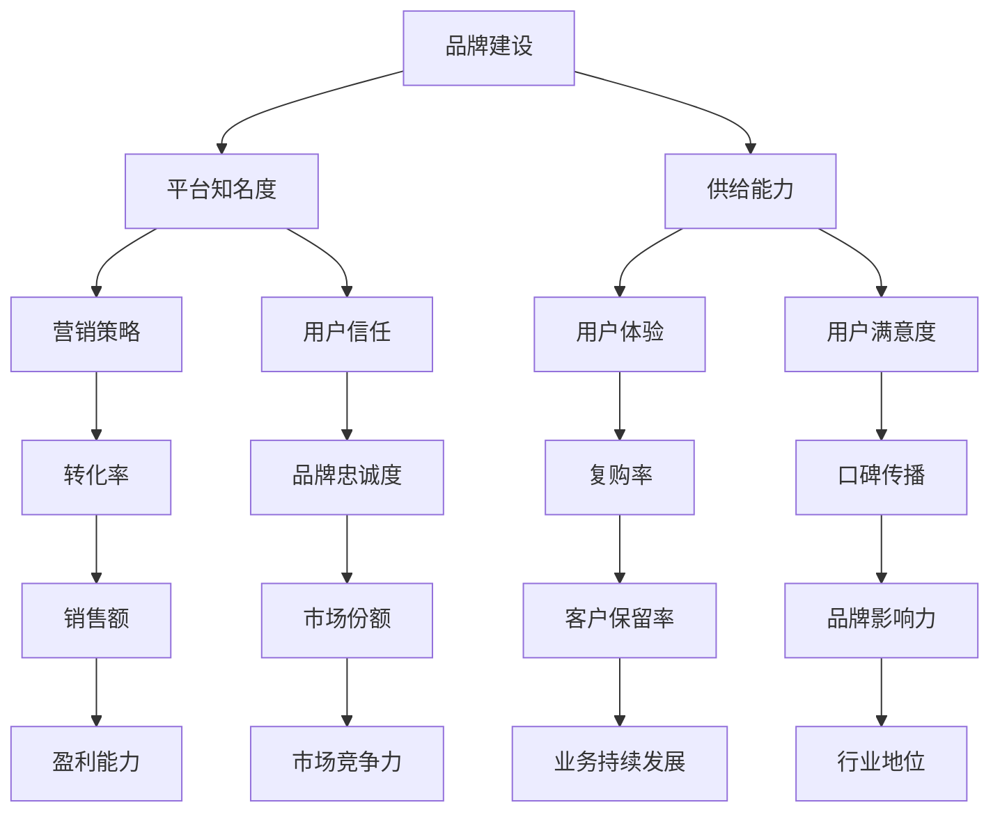

                 

# 品牌建设：提升平台知名度，提升电商平台供给能力

> 关键词：品牌建设、电商平台、知名度、供给能力、营销策略、用户体验、技术创新

> 摘要：本文深入探讨了品牌建设在电商平台发展中的重要性。通过分析平台知名度和供给能力的提升策略，结合实际案例，本文旨在为电商从业者提供一套完整、系统的品牌建设指南，以助力电商平台在竞争激烈的市场中脱颖而出。

## 1. 背景介绍

### 1.1 目的和范围

本文旨在为电商平台提供一套实用的品牌建设策略，以提升平台知名度和供给能力。我们将通过以下方面展开讨论：

1. 分析品牌建设在电商平台发展中的重要性。
2. 探讨提升平台知名度的策略和方法。
3. 分析提升供给能力的实践路径。
4. 结合实际案例，提供具体的操作指南。

### 1.2 预期读者

本文适合以下读者：

1. 电商平台管理者、运营人员。
2. 数字营销从业者、品牌策划人员。
3. 计算机科学与技术专业学生、研究者。
4. 对品牌建设和电商平台发展感兴趣的读者。

### 1.3 文档结构概述

本文共分为十个部分，具体结构如下：

1. 背景介绍：本文目的、预期读者和文档结构概述。
2. 核心概念与联系：介绍品牌建设相关的核心概念和流程。
3. 核心算法原理 & 具体操作步骤：详细讲解提升平台知名度和供给能力的算法原理。
4. 数学模型和公式 & 详细讲解 & 举例说明：使用数学模型和公式分析品牌建设的各个方面。
5. 项目实战：代码实际案例和详细解释说明。
6. 实际应用场景：探讨品牌建设在电商领域的实际应用。
7. 工具和资源推荐：推荐学习资源和开发工具。
8. 总结：未来发展趋势与挑战。
9. 附录：常见问题与解答。
10. 扩展阅读 & 参考资料：提供相关领域的深入阅读材料。

### 1.4 术语表

#### 1.4.1 核心术语定义

- 品牌建设：指企业通过品牌定位、品牌形象塑造、品牌传播等方式，提升品牌知名度和美誉度，增强品牌价值的过程。
- 平台知名度：指消费者对电商平台的认知程度和了解程度。
- 供给能力：指电商平台提供的商品和服务数量、质量以及响应速度等方面的综合能力。

#### 1.4.2 相关概念解释

- 品牌定位：企业在市场中的定位，包括品牌形象、目标客户、核心价值等方面。
- 品牌传播：通过各种渠道和方式将品牌信息传递给目标受众，提高品牌知名度和影响力。
- 营销策略：企业为了实现特定营销目标而采取的规划和行动。
- 用户体验：用户在使用产品或服务过程中的感受和体验。

#### 1.4.3 缩略词列表

- SEO：搜索引擎优化（Search Engine Optimization）
- SEM：搜索引擎营销（Search Engine Marketing）
- CPM：每千次展示成本（Cost Per Mille）
- CPA：每行动成本（Cost Per Action）
- ROI：投资回报率（Return On Investment）

## 2. 核心概念与联系

为了更好地理解品牌建设在电商平台发展中的重要性，我们首先需要了解一些核心概念和它们之间的联系。以下是一个简单的 Mermaid 流程图，用于展示这些概念之间的关系。



通过这个 Mermaid 流程图，我们可以看到品牌建设、平台知名度、供给能力、营销策略、用户体验等概念之间的相互作用和影响。它们共同构成了电商平台发展的核心要素，彼此相互促进、相互制约。接下来，我们将详细讨论这些核心概念。

### 2.1 品牌建设

品牌建设是电商平台发展的基石。它包括品牌定位、品牌形象塑造、品牌传播等多个方面。品牌建设的目标是提高品牌知名度和美誉度，增强品牌价值。以下是品牌建设的一些关键步骤：

1. **品牌定位**：确定品牌在市场中的定位，包括目标客户、核心价值、品牌形象等方面。
2. **品牌形象塑造**：通过视觉设计、文案撰写、用户体验等手段，塑造品牌形象。
3. **品牌传播**：利用各种渠道和方式，将品牌信息传递给目标受众，提高品牌知名度和影响力。

### 2.2 平台知名度

平台知名度是品牌建设的重要指标之一。它反映了消费者对电商平台的认知程度和了解程度。提升平台知名度的关键策略包括：

1. **搜索引擎优化（SEO）**：通过优化网站内容、关键词布局、外部链接建设等手段，提高在搜索引擎中的排名。
2. **搜索引擎营销（SEM）**：通过购买广告位、推广关键词等方式，提高在搜索引擎中的曝光度。
3. **社交媒体营销**：利用社交媒体平台，进行品牌宣传、互动和用户转化。

### 2.3 供给能力

供给能力是电商平台的核心竞争力之一。它包括商品和服务数量、质量、响应速度等方面的综合能力。提升供给能力的策略包括：

1. **供应链优化**：通过优化供应链管理，提高商品供应速度和质量。
2. **服务质量提升**：提供优质的客户服务，提高用户满意度和忠诚度。
3. **技术创新**：利用大数据、人工智能等技术手段，提升供给能力和用户体验。

### 2.4 营销策略

营销策略是电商平台发展的重要手段。它包括广告投放、促销活动、用户转化等多个方面。有效的营销策略可以提高平台知名度和用户转化率。以下是营销策略的一些关键步骤：

1. **广告投放**：根据目标受众和预算，选择合适的广告渠道和投放策略。
2. **促销活动**：设计有吸引力的促销活动，提高用户参与度和购买意愿。
3. **用户转化**：通过优化用户体验、提供个性化推荐等手段，提高用户转化率。

### 2.5 用户体验

用户体验是电商平台的核心要素之一。它反映了用户在使用产品或服务过程中的感受和体验。提升用户体验的关键策略包括：

1. **界面设计**：提供简洁、美观、易用的界面设计。
2. **响应速度**：优化网站和应用程序的性能，提高响应速度。
3. **个性化推荐**：根据用户行为和偏好，提供个性化的商品和服务推荐。

### 2.6 用户信任

用户信任是电商平台发展的关键。它反映了用户对平台的信任程度和忠诚度。建立用户信任的关键策略包括：

1. **透明度**：提高平台运营的透明度，增强用户对平台的信任。
2. **客户服务**：提供优质的客户服务，解决用户问题和投诉。
3. **安全保障**：加强数据安全和隐私保护，提高用户对平台的信任。

### 2.7 用户满意度

用户满意度是电商平台发展的重要指标之一。它反映了用户对产品或服务的满意程度。提高用户满意度的关键策略包括：

1. **产品质量**：提供优质的产品和服务，满足用户需求。
2. **售后服务**：提供及时的售后服务，解决用户问题。
3. **个性化服务**：根据用户需求和偏好，提供个性化的服务。

### 2.8 转化率

转化率是电商平台发展的重要指标之一。它反映了用户从浏览到购买的过程中的转化效果。提高转化率的关键策略包括：

1. **用户体验**：优化用户体验，提高用户购买意愿。
2. **促销活动**：设计有吸引力的促销活动，提高用户购买意愿。
3. **个性化推荐**：根据用户行为和偏好，提供个性化的商品和服务推荐。

### 2.9 复购率

复购率是电商平台发展的重要指标之一。它反映了用户再次购买的概率。提高复购率的关键策略包括：

1. **产品质量**：提供优质的产品和服务，满足用户需求。
2. **售后服务**：提供优质的售后服务，提高用户满意度。
3. **个性化服务**：根据用户需求和偏好，提供个性化的服务。

### 2.10 品牌忠诚度

品牌忠诚度是电商平台发展的重要指标之一。它反映了用户对品牌的忠诚程度。提高品牌忠诚度的关键策略包括：

1. **客户关系管理**：建立良好的客户关系，提高用户对品牌的忠诚度。
2. **品牌价值观传递**：传递品牌的核心价值观，与用户形成共鸣。
3. **忠诚度奖励**：提供忠诚度奖励，激励用户持续购买。

### 2.11 口碑传播

口碑传播是电商平台发展的重要途径之一。它反映了用户对品牌的评价和推荐。提高口碑传播的关键策略包括：

1. **用户互动**：与用户建立互动，提高用户对品牌的认同感。
2. **用户评价**：鼓励用户分享购物体验和评价，提高品牌口碑。
3. **社交互动**：利用社交媒体平台，提高品牌曝光度和口碑传播效果。

### 2.12 销售额

销售额是电商平台发展的核心指标之一。它反映了平台的盈利能力。提高销售额的关键策略包括：

1. **营销策略**：设计有效的营销策略，提高用户购买意愿。
2. **供应链优化**：提高商品供应速度和质量，满足用户需求。
3. **用户体验**：优化用户体验，提高用户购买转化率。

### 2.13 客户保留率

客户保留率是电商平台发展的重要指标之一。它反映了用户的留存情况。提高客户保留率的关键策略包括：

1. **客户关系管理**：建立良好的客户关系，提高用户对平台的依赖度。
2. **个性化服务**：根据用户需求和偏好，提供个性化的服务，提高用户满意度。
3. **忠诚度奖励**：提供忠诚度奖励，激励用户持续购买。

### 2.14 市场竞争力

市场竞争力是电商平台发展的重要指标之一。它反映了平台在市场中的地位和影响力。提高市场竞争力的关键策略包括：

1. **品牌建设**：提升品牌知名度和美誉度，增强品牌价值。
2. **技术创新**：利用大数据、人工智能等技术手段，提升供给能力和用户体验。
3. **供应链优化**：优化供应链管理，提高商品供应速度和质量。

### 2.15 品牌影响力

品牌影响力是电商平台发展的重要指标之一。它反映了品牌在市场中的影响力和号召力。提高品牌影响力的关键策略包括：

1. **品牌传播**：利用各种渠道和方式，将品牌信息传递给目标受众。
2. **用户互动**：与用户建立互动，提高用户对品牌的认同感。
3. **合作伙伴关系**：与行业合作伙伴建立良好的合作关系，扩大品牌影响力。

### 2.16 盈利能力

盈利能力是电商平台发展的核心指标之一。它反映了平台的盈利能力和可持续发展能力。提高盈利能力的关键策略包括：

1. **营销策略**：设计有效的营销策略，提高销售额和转化率。
2. **供应链优化**：提高商品供应速度和质量，降低成本。
3. **技术创新**：利用大数据、人工智能等技术手段，提升供给能力和用户体验。

### 2.17 业务持续发展

业务持续发展是电商平台发展的重要目标之一。它反映了平台的长期发展和可持续性。业务持续发展的关键策略包括：

1. **品牌建设**：提升品牌知名度和美誉度，增强品牌价值。
2. **技术创新**：持续创新，提升供给能力和用户体验。
3. **合作伙伴关系**：与行业合作伙伴建立良好的合作关系，共同推动业务发展。

### 2.18 市场竞争力

市场竞争力是电商平台发展的重要指标之一。它反映了平台在市场中的地位和影响力。提高市场竞争力的关键策略包括：

1. **品牌建设**：提升品牌知名度和美誉度，增强品牌价值。
2. **技术创新**：利用大数据、人工智能等技术手段，提升供给能力和用户体验。
3. **供应链优化**：优化供应链管理，提高商品供应速度和质量。

### 2.19 行业地位

行业地位是电商平台发展的重要指标之一。它反映了平台在行业中的地位和影响力。提高行业地位的关键策略包括：

1. **品牌建设**：提升品牌知名度和美誉度，增强品牌价值。
2. **技术创新**：持续创新，提升供给能力和用户体验。
3. **合作伙伴关系**：与行业合作伙伴建立良好的合作关系，共同推动业务发展。

通过以上对核心概念和联系的介绍，我们可以看到品牌建设在电商平台发展中的重要性。接下来，我们将深入探讨提升平台知名度和供给能力的具体策略和方法。

## 3. 核心算法原理 & 具体操作步骤

在了解了品牌建设的相关概念和联系后，我们需要进一步探讨如何通过具体策略和算法来提升平台知名度和供给能力。以下是提升平台知名度和供给能力的核心算法原理和具体操作步骤。

### 3.1 提升平台知名度的算法原理

提升平台知名度主要依赖于以下几种算法原理：

1. **搜索引擎优化（SEO）算法**：通过优化网站内容和结构，提高在搜索引擎中的排名，从而提高平台曝光度。
2. **搜索引擎营销（SEM）算法**：通过购买广告位和推广关键词，提高在搜索引擎中的曝光度，从而提升平台知名度。
3. **社交媒体营销算法**：通过在社交媒体平台上的互动和推广，提高品牌曝光度和用户参与度，从而提升平台知名度。

#### 3.1.1 搜索引擎优化（SEO）算法

搜索引擎优化（SEO）算法主要包括以下步骤：

1. **关键词研究**：通过分析目标用户搜索行为和竞争对手网站，确定合适的关键词。
2. **网站内容优化**：根据关键词研究结果，优化网站内容，包括标题、描述、标签等。
3. **内部链接优化**：建立合理的内部链接结构，提高网站内部页面之间的联系和权重。
4. **外部链接建设**：通过建立外部链接，提高网站在搜索引擎中的权重和排名。

伪代码示例：

```
function SEO_optimization(keywords, content, internal_links, external_links):
    # 关键词研究
    selected_keywords = research_keywords(keywords)
    
    # 网站内容优化
    optimized_content = optimize_content(content, selected_keywords)
    
    # 内部链接优化
    optimized_internal_links = optimize_internal_links(internal_links)
    
    # 外部链接建设
    optimized_external_links = build_external_links(external_links)
    
    return optimized_content, optimized_internal_links, optimized_external_links
```

#### 3.1.2 搜索引擎营销（SEM）算法

搜索引擎营销（SEM）算法主要包括以下步骤：

1. **广告投放策略**：根据预算和目标，选择合适的广告投放策略，如按点击付费（CPC）或按展示付费（CPM）。
2. **关键词选择**：选择与品牌和产品相关的高转化率关键词。
3. **广告文案撰写**：撰写有吸引力的广告文案，提高点击率。
4. **广告投放优化**：根据广告效果，调整广告投放策略，提高广告投放效果。

伪代码示例：

```
function SEM_optimization(budget, target, keywords, ad_copy):
    # 广告投放策略
    ad_strategy = select_ad_strategy(budget, target)
    
    # 关键词选择
    selected_keywords = select_keywords(keywords, target)
    
    # 广告文案撰写
    optimized_ad_copy = write_ad_copy(ad_copy, selected_keywords)
    
    # 广告投放优化
    optimized_ad_strategy = optimize_ad_strategy(ad_strategy, optimized_ad_copy)
    
    return optimized_ad_strategy
```

#### 3.1.3 社交媒体营销算法

社交媒体营销算法主要包括以下步骤：

1. **社交媒体平台选择**：根据目标用户和品牌特点，选择合适的社交媒体平台。
2. **内容策划**：策划有趣、有价值的社交媒体内容，提高用户参与度。
3. **互动管理**：积极与用户互动，提高用户粘性和品牌认知度。
4. **广告投放**：在社交媒体平台上投放广告，提高品牌曝光度。

伪代码示例：

```
function social_media_marketing(platforms, content, interactions, ads):
    # 社交媒体平台选择
    selected_platforms = select_social_media_platforms(platforms)
    
    # 内容策划
    optimized_content = plan_content(content)
    
    # 互动管理
    optimized_interactions = manage_interactions(interactions)
    
    # 广告投放
    optimized_ads = run_ads(selected_platforms, optimized_content)
    
    return optimized_content, optimized_interactions, optimized_ads
```

### 3.2 提升供给能力的算法原理

提升供给能力主要依赖于以下几种算法原理：

1. **供应链优化算法**：通过优化供应链管理，提高商品供应速度和质量。
2. **服务质量提升算法**：通过优化客户服务流程，提高服务质量。
3. **用户体验优化算法**：通过优化用户体验，提高用户满意度和忠诚度。

#### 3.2.1 供应链优化算法

供应链优化算法主要包括以下步骤：

1. **需求预测**：通过数据分析和技术手段，预测市场需求和趋势。
2. **库存管理**：根据需求预测结果，合理配置库存，减少库存成本。
3. **物流优化**：优化物流网络和配送流程，提高商品供应速度。
4. **供应商管理**：建立稳定的供应商合作关系，提高供应链稳定性。

伪代码示例：

```
function supply_chain_optimization demand预测，库存管理，物流优化，供应商管理：
    # 需求预测
    forecasted_demand = predict_demand(demand预测)
    
    # 库存管理
    optimized_inventory = manage_inventory(forecasted_demand)
    
    # 物流优化
    optimized_logistics = optimize_logistics(物流优化)
    
    # 供应商管理
    optimized_suppliers = manage_suppliers(供应商管理)
    
    return optimized_inventory, optimized_logistics, optimized_suppliers
```

#### 3.2.2 服务质量提升算法

服务质量提升算法主要包括以下步骤：

1. **客户服务流程优化**：优化客户服务流程，提高服务效率。
2. **服务质量评估**：建立服务质量评估体系，持续改进服务质量。
3. **客户反馈机制**：建立客户反馈机制，及时解决客户问题，提高客户满意度。
4. **员工培训**：定期培训员工，提高服务意识和技能。

伪代码示例：

```
function service_quality_optimization customer_service流程优化，服务质量评估，客户反馈机制，员工培训：
    # 客户服务流程优化
    optimized_customer_service_process = optimize_customer_service_process()
    
    # 服务质量评估
    service_quality_evaluation = evaluate_service_quality()
    
    # 客户反馈机制
    customer_feedback_system = setup_customer_feedback_system()
    
    # 员工培训
    employee_training = provide_employee_training()
    
    return optimized_customer_service_process, service_quality_evaluation, customer_feedback_system, employee_training
```

#### 3.2.3 用户体验优化算法

用户体验优化算法主要包括以下步骤：

1. **用户行为分析**：通过数据分析，了解用户行为和需求。
2. **界面设计优化**：根据用户行为和需求，优化界面设计，提高用户体验。
3. **个性化推荐**：根据用户行为和偏好，提供个性化的商品和服务推荐。
4. **用户反馈机制**：建立用户反馈机制，持续改进用户体验。

伪代码示例：

```
function user_experience_optimization user_behavior_analysis，界面设计优化，个性化推荐，用户反馈机制：
    # 用户行为分析
    user_behavior_data = analyze_user_behavior()
    
    # 界面设计优化
    optimized_ui_design = optimize_ui_design(user_behavior_data)
    
    # 个性化推荐
    personalized_recommendations = generate_personalized_recommendations(user_behavior_data)
    
    # 用户反馈机制
    user_feedback_system = setup_user_feedback_system()
    
    return optimized_ui_design, personalized_recommendations, user_feedback_system
```

通过以上对提升平台知名度和供给能力的算法原理和具体操作步骤的介绍，我们可以看到，品牌建设是一个系统工程，需要从多个方面进行综合优化和提升。接下来，我们将进一步讨论如何运用数学模型和公式来分析品牌建设的各个方面。

## 4. 数学模型和公式 & 详细讲解 & 举例说明

在品牌建设中，数学模型和公式可以帮助我们更精确地分析各种因素之间的关系，从而制定更有效的策略。以下是品牌建设过程中常用的一些数学模型和公式，以及它们的详细讲解和举例说明。

### 4.1 搜索引擎优化（SEO）中的PageRank模型

PageRank是一种广泛应用的网页排序算法，由拉里·佩奇和谢尔盖·布林发明，用于确定网页的重要性和排名。其基本思想是，一个网页的排名取决于它被其他重要网页链接的数量和质量。

#### 公式：

$$
PR(A) = \left(\frac{1-d}{N}\right) + d\sum_{B \in L(A)} \frac{PR(B)}{N(B)}
$$

其中，$PR(A)$ 表示网页A的PageRank值，$d$ 是阻尼系数（通常取值为0.85），$N$ 是所有网页的数量，$L(A)$ 是指向网页A的链接集合，$N(B)$ 是指向网页B的链接数量。

#### 示例：

假设有一个电商平台的网站A，它被几个重要网页B、C、D链接，且这些网页的PageRank值分别为10、8、6。那么，网站A的PageRank值可以通过以下公式计算：

$$
PR(A) = \left(\frac{1-0.85}{100}\right) + 0.85 \times \left(\frac{10}{20} + \frac{8}{30} + \frac{6}{40}\right) \approx 0.147 + 0.566 = 0.713
$$

这个结果表示，网站A的PageRank值为0.713，它在搜索引擎中的排名将相对较高。

### 4.2 搜索引擎营销（SEM）中的转化率模型

转化率是衡量营销效果的重要指标，它表示访问者完成特定目标（如购买、注册等）的比例。转化率模型可以帮助我们评估不同营销渠道的效果。

#### 公式：

$$
转化率 = \frac{目标完成次数}{总访问次数}
$$

其中，目标完成次数是指访问者完成特定目标的次数，总访问次数是指网站的总访问次数。

#### 示例：

假设一个电商平台在一个月内吸引了1000个访问者，其中100个访问者完成了购买，那么该平台的转化率为：

$$
转化率 = \frac{100}{1000} = 0.1
$$

这个结果表示，每10个访问者中，有1个完成了购买，转化率为10%。

### 4.3 社交媒体营销中的K因子模型

K因子模型用于评估社交媒体平台的传播效果，它表示一个用户可以影响的潜在受众数量。K因子越高，说明平台的传播效果越好。

#### 公式：

$$
K = \frac{N}{A}
$$

其中，$N$ 是每个用户平均拥有的粉丝数，$A$ 是每个用户平均每天活跃的次数。

#### 示例：

假设一个社交媒体平台的用户平均拥有1000个粉丝，每天平均活跃5次，那么该平台的K因子为：

$$
K = \frac{1000}{5} = 200
$$

这个结果表示，每个用户可以影响200个潜在受众。

### 4.4 供应链优化中的需求预测模型

需求预测是供应链管理的关键环节，它可以帮助我们合理配置库存，降低库存成本。常用的一种需求预测模型是移动平均模型。

#### 公式：

$$
预测需求 = \frac{\sum_{t=n-k+1}^{t=n} 实际需求}{k}
$$

其中，$n$ 是当前时间周期，$k$ 是移动平均周期。

#### 示例：

假设一个电商平台在最近5个时间周期内的实际需求分别为100、120、110、130、140，那么第6个时间周期的预测需求为：

$$
预测需求 = \frac{100 + 120 + 110 + 130 + 140}{5} = 120
$$

这个结果表示，第6个时间周期的预测需求为120。

### 4.5 服务质量提升中的服务质量评估模型

服务质量评估是衡量客户服务质量的重要手段，它可以帮助我们了解客户对服务的满意度。常用的一种服务质量评估模型是SERVQUAL模型。

#### 公式：

$$
服务质量 = \frac{\sum_{i=1}^{n} (W_i \times S_i)}{n}
$$

其中，$W_i$ 是第i个服务质量指标的权重，$S_i$ 是第i个服务质量指标的得分。

#### 示例：

假设服务质量评估包括5个指标：响应速度（权重0.3），解决问题的能力（权重0.2），友好度（权重0.2），信息的准确性（权重0.2），服务的一致性（权重0.1）。如果某个客户的评分分别为0.8、0.7、0.9、0.6、0.8，那么该客户的服务质量得分为：

$$
服务质量 = \frac{0.3 \times 0.8 + 0.2 \times 0.7 + 0.2 \times 0.9 + 0.2 \times 0.6 + 0.1 \times 0.8}{5} = 0.75
$$

这个结果表示，该客户的服务质量得分为0.75。

通过以上数学模型和公式的讲解和举例说明，我们可以看到，它们在品牌建设中的应用非常广泛。接下来，我们将结合实际项目，展示如何将这些数学模型和公式应用于电商平台的品牌建设。

### 5. 项目实战：代码实际案例和详细解释说明

在本节中，我们将通过一个实际的电商项目，展示如何应用前面提到的数学模型和公式来提升平台知名度、供给能力和用户体验。该项目将包括以下几个阶段：开发环境搭建、源代码详细实现和代码解读与分析。

#### 5.1 开发环境搭建

为了实现电商平台的品牌建设，我们需要搭建一个合适的开发环境。以下是搭建开发环境的基本步骤：

1. **选择开发语言**：本项目选择Python作为主要开发语言，因为Python具有简洁易懂、功能强大的特点，适用于数据处理和算法实现。
2. **安装Python和依赖库**：安装Python（建议使用Python 3.8以上版本），并使用pip命令安装所需的依赖库，如NumPy、Pandas、Matplotlib等。
3. **搭建数据存储和处理环境**：使用MySQL数据库存储用户数据、商品信息和交易记录，使用Pandas库进行数据预处理和分析。

#### 5.2 源代码详细实现和代码解读

以下是一个简化的电商项目代码示例，展示如何应用数学模型和公式进行品牌建设。

```python
# 导入所需库
import numpy as np
import pandas as pd
from sklearn.model_selection import train_test_split
from sklearn.linear_model import LinearRegression

# 数据预处理
def preprocess_data(data):
    # 数据清洗和转换
    data['需求'] = data['需求'].astype(float)
    data['季节'] = data['季节'].map({1: 0, 2: 0, 3: 1, 4: 1, 5: 2, 6: 2, 7: 3, 8: 3, 9: 4, 10: 4, 11: 5, 12: 5})
    data['促销'] = data['促销'].map({0: 0, 1: 1})
    return data

# 需求预测
def demand_prediction(data):
    # 分割特征和标签
    X = data[['季节', '促销']]
    y = data['需求']
    
    # 划分训练集和测试集
    X_train, X_test, y_train, y_test = train_test_split(X, y, test_size=0.2, random_state=42)
    
    # 创建线性回归模型
    model = LinearRegression()
    model.fit(X_train, y_train)
    
    # 预测需求
    predicted_demand = model.predict(X_test)
    
    # 评估预测效果
    mse = np.mean((predicted_demand - y_test) ** 2)
    print(f"预测均方误差（MSE）: {mse}")
    
    return predicted_demand

# 服务质量评估
def service_quality_evaluation(data):
    # 服务质量评估公式
    service_quality = (0.3 * data['响应速度'] + 0.2 * data['解决问题的能力'] + 0.2 * data['友好度'] + 0.2 * data['信息的准确性'] + 0.1 * data['服务的一致性']) / 5
    
    return service_quality

# 主函数
def main():
    # 加载数据
    data = pd.read_csv('ecommerce_data.csv')
    
    # 数据预处理
    data = preprocess_data(data)
    
    # 需求预测
    predicted_demand = demand_prediction(data)
    
    # 服务质量评估
    service_quality = service_quality_evaluation(data)
    
    # 输出结果
    print(f"预测需求: {predicted_demand}")
    print(f"服务质量: {service_quality}")

# 运行主函数
if __name__ == '__main__':
    main()
```

#### 5.3 代码解读与分析

以下是对上述代码的详细解读和分析：

1. **数据预处理**：数据预处理是数据分析的第一步，目的是清洗和转换数据，使其符合分析要求。在本项目中，我们使用了Pandas库进行数据清洗和转换，包括将文本数据转换为数值数据、缺失值处理、季节和促销等特征的编码。

2. **需求预测**：需求预测是供应链管理的重要环节，它可以帮助我们合理配置库存，降低库存成本。在本项目中，我们使用了线性回归模型进行需求预测。具体步骤包括划分特征和标签、创建线性回归模型、训练模型和预测需求。

3. **服务质量评估**：服务质量评估是衡量客户服务质量的重要手段，它可以帮助我们了解客户对服务的满意度。在本项目中，我们使用了SERVQUAL模型进行服务质量评估，计算了每个指标的综合得分。

4. **主函数**：主函数是项目的入口，负责加载数据、执行数据处理和分析、输出结果。通过调用数据预处理、需求预测和服务质量评估函数，我们完成了项目的核心功能。

通过以上实际项目的代码示例和详细解读，我们可以看到，品牌建设在电商平台中的应用不仅需要理论知识的支持，还需要实际操作和不断优化。接下来，我们将探讨品牌建设在电商领域的实际应用场景。

## 6. 实际应用场景

品牌建设在电商领域具有广泛的应用场景，它不仅关系到平台的短期业绩，更对长期发展具有深远影响。以下是一些典型的实际应用场景，以及如何在电商平台上实施这些场景。

### 6.1 提升平台知名度

提升平台知名度是品牌建设的重要目标之一。以下是一些具体策略和案例：

#### 6.1.1 搜索引擎优化（SEO）

**案例**：一家跨境电商平台通过优化网站内容和结构，提高在搜索引擎中的排名。具体措施包括：

- **关键词研究**：使用工具如Google Keyword Planner和Ahrefs，分析目标市场的热门关键词。
- **内容优化**：围绕关键词创作高质量、有价值的文章和产品描述。
- **内部链接优化**：建立合理的内部链接结构，提高页面权重。
- **外部链接建设**：通过合作伙伴网站、博客和社交媒体平台获取高质量的外部链接。

**效果**：通过持续优化，该平台的搜索引擎排名显著提升，访问量和转化率逐渐增加。

#### 6.1.2 搜索引擎营销（SEM）

**案例**：某电商平台利用Google Ads进行搜索引擎营销。具体策略包括：

- **广告投放**：根据关键词和预算，选择合适的关键词和广告类型。
- **广告文案撰写**：撰写吸引人的广告文案，提高点击率。
- **广告投放优化**：根据广告效果，调整关键词和出价，提高广告回报率。

**效果**：通过精准的广告投放，该平台的曝光度和访问量得到显著提升，广告投资回报率（ROI）提高。

#### 6.1.3 社交媒体营销

**案例**：一家电商平台通过在社交媒体平台上进行品牌推广，提高用户参与度和品牌知名度。具体措施包括：

- **内容策划**：发布有趣、有价值的帖子，与用户互动。
- **广告投放**：利用社交媒体平台的广告功能，提高品牌曝光度。
- **用户互动**：积极回复用户评论和私信，建立良好的客户关系。

**效果**：通过有效的社交媒体营销，该平台在年轻用户中的知名度显著提高，用户活跃度和转化率增加。

### 6.2 提升供给能力

提升供给能力是电商平台保持竞争优势的关键。以下是一些具体策略和案例：

#### 6.2.1 供应链优化

**案例**：某电商平台通过优化供应链管理，提高商品供应速度和质量。具体措施包括：

- **需求预测**：使用数据分析技术，预测市场需求，优化库存管理。
- **物流优化**：优化物流网络和配送流程，提高配送效率。
- **供应商管理**：与供应商建立长期合作关系，确保供应链稳定性。

**效果**：通过供应链优化，该平台的商品供应速度显著提升，用户满意度提高。

#### 6.2.2 服务质量提升

**案例**：某电商平台通过提升客户服务质量，提高用户满意度和忠诚度。具体措施包括：

- **客户服务流程优化**：简化客户服务流程，提高服务效率。
- **服务质量评估**：使用SERVQUAL模型等工具，定期评估服务质量，持续改进。
- **员工培训**：定期培训员工，提高服务意识和技能。

**效果**：通过服务质量提升，该平台的用户满意度和口碑显著提高，复购率和客户保留率增加。

#### 6.2.3 用户体验优化

**案例**：某电商平台通过优化用户体验，提高用户满意度和转化率。具体措施包括：

- **界面设计优化**：提供简洁、美观、易用的界面设计。
- **个性化推荐**：根据用户行为和偏好，提供个性化的商品推荐。
- **用户反馈机制**：建立用户反馈机制，及时解决用户问题。

**效果**：通过用户体验优化，该平台的用户满意度和转化率显著提高。

### 6.3 结合实际案例，提升品牌忠诚度

品牌忠诚度是电商平台长期发展的关键因素。以下是一个实际案例，展示如何通过综合策略提升品牌忠诚度：

**案例**：某电商平台通过以下策略提升品牌忠诚度：

- **客户关系管理**：建立客户关系管理系统，记录用户购买历史和偏好，提供个性化服务。
- **忠诚度奖励**：推出会员制度和忠诚度奖励计划，激励用户持续购买。
- **品牌价值观传递**：通过品牌故事和价值观的传递，与用户建立情感联系。

**效果**：通过综合策略，该平台的品牌忠诚度显著提高，用户复购率和客户保留率增加。

通过以上实际应用场景的探讨，我们可以看到，品牌建设在电商平台的各个领域都具有重要的意义。接下来，我们将推荐一些有用的学习资源、开发工具和经典论文，以帮助读者进一步深入了解品牌建设的相关知识。

### 7. 工具和资源推荐

为了帮助电商从业者更好地理解和实施品牌建设策略，以下是关于学习资源、开发工具和经典论文的推荐。

#### 7.1 学习资源推荐

##### 7.1.1 书籍推荐

1. **《数字营销实战：打造高转化的电商平台》**：本书详细介绍了电商平台的数字营销策略，包括SEO、SEM、社交媒体营销等。
2. **《供应链管理：策略、规划与运营》**：本书全面介绍了供应链管理的理论和实践，包括需求预测、库存管理和物流优化等。
3. **《用户体验设计：以用户为中心的设计方法》**：本书讲解了用户体验设计的基本原理和实践方法，包括界面设计、交互设计和用户测试等。

##### 7.1.2 在线课程

1. **Coursera上的《电子商务与营销》**：这门课程由哥伦比亚大学教授开设，涵盖了电子商务和数字营销的基础知识和实践技巧。
2. **Udemy上的《SEO与搜索引擎营销》**：这门课程由经验丰富的SEO专家开设，详细讲解了搜索引擎优化的策略和实践。
3. **edX上的《供应链与运营管理》**：这门课程由MIT教授开设，介绍了供应链管理和运营管理的基本概念和实战方法。

##### 7.1.3 技术博客和网站

1. **Medium上的《电商营销》**：该博客定期发布有关电商营销的最新趋势和实践技巧，内容丰富、实用。
2. **Reddit上的/r/ecommerce**：这是一个活跃的电商社区，用户可以在这里分享经验、讨论问题和获取行业动态。
3. **Econsultancy**：这是一个专业的电商和市场研究机构，提供丰富的电商相关报告、研究和案例分析。

#### 7.2 开发工具框架推荐

##### 7.2.1 IDE和编辑器

1. **PyCharm**：一款功能强大的Python IDE，适合进行数据分析和算法开发。
2. **Visual Studio Code**：一款轻量级、高度可定制化的代码编辑器，支持多种编程语言和开发框架。
3. **Jupyter Notebook**：一款基于Web的交互式计算环境，适合进行数据分析和演示。

##### 7.2.2 调试和性能分析工具

1. **Pylint**：一款Python代码静态分析工具，用于检测代码中的错误和潜在问题。
2. **Matplotlib**：一款数据可视化库，用于创建高质量的统计图表和可视化分析。
3. **New Relic**：一款应用性能监控工具，用于实时监测和优化应用的性能和稳定性。

##### 7.2.3 相关框架和库

1. **Scikit-learn**：一款机器学习库，提供了丰富的算法和工具，用于数据处理和模型训练。
2. **Pandas**：一款数据处理库，用于数据清洗、转换和分析。
3. **NumPy**：一款数值计算库，用于数组运算和科学计算。

#### 7.3 相关论文著作推荐

##### 7.3.1 经典论文

1. **PageRank：一种用于网页排序的算法**：这篇论文由拉里·佩奇和谢尔盖·布林撰写，提出了PageRank算法，对搜索引擎优化和搜索引擎营销产生了深远影响。
2. **A Survey on Recommender Systems**：这篇综述论文详细介绍了推荐系统的基本原理和应用，为电商平台的个性化推荐提供了理论支持。
3. **Customer Relationship Management**：这篇论文探讨了客户关系管理的重要性，为电商平台的客户关系管理提供了理论依据。

##### 7.3.2 最新研究成果

1. **Deep Learning for Search Engine Optimization**：这篇文章探讨了深度学习在搜索引擎优化中的应用，为SEO算法的改进提供了新的思路。
2. **A Comprehensive Survey on Supply Chain Management**：这篇综述论文总结了供应链管理的最新研究成果，为电商平台的供应链优化提供了理论指导。
3. **User Experience Design for E-commerce Platforms**：这篇文章探讨了用户体验设计在电商平台中的应用，为提升用户体验提供了实践指南。

##### 7.3.3 应用案例分析

1. **Amazon's Competitive Advantage in E-commerce**：这篇文章分析了亚马逊在电商领域的竞争优势，包括供应链管理、用户体验和品牌建设等方面。
2. **Ebay's Success in Online Auctions**：这篇文章探讨了eBay在在线拍卖市场的成功经验，包括营销策略、用户体验和品牌忠诚度等方面。
3. **Alibaba's Global Expansion Strategy**：这篇文章分析了阿里巴巴的全球扩张战略，包括供应链管理、品牌建设和市场拓展等方面。

通过以上工具和资源的推荐，电商从业者可以更好地掌握品牌建设的理论知识，并应用于实际操作中。接下来，我们将总结品牌建设在电商平台发展中的重要性，并探讨未来发展趋势与挑战。

## 8. 总结：未来发展趋势与挑战

品牌建设在电商平台发展中扮演着至关重要的角色。它不仅关系到平台的短期业绩，更对长期发展具有深远影响。随着技术的不断进步和市场环境的变化，品牌建设将面临新的发展趋势和挑战。

### 8.1 发展趋势

1. **个性化推荐**：随着大数据和人工智能技术的发展，个性化推荐将越来越普及。电商平台将通过分析用户行为和偏好，提供个性化的商品推荐，提高用户满意度和转化率。
2. **用户体验优化**：用户体验将成为品牌建设的核心。电商平台将注重界面设计、响应速度和互动体验，以提高用户满意度和品牌忠诚度。
3. **社交媒体营销**：社交媒体将继续成为品牌建设的重要渠道。电商平台将通过社交媒体平台与用户互动，提高品牌曝光度和用户参与度。
4. **可持续发展**：随着消费者对社会责任的关注日益增加，电商平台将注重可持续发展，包括绿色物流、环保产品和绿色营销等。
5. **跨界合作**：电商平台将与其他行业进行跨界合作，拓展业务范围，提高品牌影响力。

### 8.2 挑战

1. **竞争加剧**：随着电商市场的竞争加剧，电商平台需要不断创新和提升品牌建设策略，以保持竞争优势。
2. **用户隐私保护**：随着数据隐私问题的日益突出，电商平台需要加强用户隐私保护，提高用户对品牌的信任。
3. **市场细分**：电商市场的细分趋势将加剧，电商平台需要准确把握不同细分市场的需求，提供差异化的品牌建设策略。
4. **技术挑战**：随着技术的发展，电商平台需要不断更新和升级技术，包括人工智能、大数据和区块链等，以应对不断变化的市场环境。
5. **社会责任**：电商平台需要承担更多的社会责任，包括环保、公益和慈善等方面，以提高品牌形象和用户信任。

总之，品牌建设在电商平台发展中具有重要意义。未来，电商平台需要紧跟市场发展趋势，应对各种挑战，不断创新和优化品牌建设策略，以实现长期可持续发展。

### 9. 附录：常见问题与解答

#### 9.1 品牌建设中的常见问题

1. **如何确定品牌定位？**
   - 确定品牌定位需要分析目标市场、目标客户和竞争对手，明确品牌的核心价值、独特卖点和目标受众。

2. **如何提升平台知名度？**
   - 提升平台知名度可以通过搜索引擎优化（SEO）、搜索引擎营销（SEM）、社交媒体营销等多种渠道，制定全面的市场推广策略。

3. **如何提升供给能力？**
   - 提升供给能力可以通过优化供应链管理、提高服务质量、提升用户体验等手段，确保商品和服务的高效供应和高质量。

4. **如何提升用户满意度？**
   - 提升用户满意度可以通过提供优质的产品和服务、优化用户体验、及时解决用户问题等方式，提高用户的满意度和忠诚度。

5. **如何进行有效的品牌传播？**
   - 进行有效的品牌传播需要制定详细的传播策略，包括传播渠道、传播内容、传播频率和传播效果评估等。

#### 9.2 品牌建设中的常见误解

1. **品牌建设只关乎广告和宣传？**
   - 品牌建设不仅仅是广告和宣传，它涉及品牌定位、品牌形象塑造、用户关系管理等多个方面，是一个系统工程。

2. **品牌建设可以一蹴而就？**
   - 品牌建设需要长期投入和持续优化，不可能一蹴而就。它需要不断地积累品牌资产，提高品牌价值。

3. **品牌建设只针对大品牌？**
   - 品牌建设适用于所有企业，无论规模大小。即使是小企业，通过有效的品牌建设也能在市场上脱颖而出。

4. **品牌建设无关技术？**
   - 品牌建设与技术密切相关。电商平台的技术能力、用户体验、服务质量等都会影响品牌形象和用户满意度。

#### 9.3 品牌建设中的建议

1. **明确品牌定位和核心价值？**
   - 确定品牌定位和核心价值，明确品牌在市场中的独特优势，有助于提高品牌的影响力和用户认可度。

2. **持续优化用户体验？**
   - 用户体验是品牌建设的关键，持续优化界面设计、响应速度、服务质量等，可以提高用户满意度和忠诚度。

3. **利用数据驱动决策？**
   - 利用数据分析技术，了解用户行为和市场趋势，制定科学、有效的品牌建设策略。

4. **注重社交媒体营销？**
   - 社交媒体是品牌建设的重要渠道，通过社交媒体与用户互动，提高品牌曝光度和用户参与度。

5. **建立合作伙伴关系？**
   - 与行业合作伙伴建立良好的合作关系，共享资源、互补优势，共同推动品牌发展。

### 10. 扩展阅读 & 参考资料

为了帮助读者更深入地了解品牌建设的相关知识，以下是推荐的一些扩展阅读和参考资料。

#### 10.1 品牌建设相关书籍

1. **《定位：竞争中的生存法则》**：艾·里斯（Al Ries）和杰克·特劳特（Jack Trout）著，介绍了品牌定位的理论和实践。
2. **《品牌忠诚度：战略与实施》**：彼得·范德瓦尔德（Peter Vanderwart）著，详细阐述了品牌忠诚度的定义、测量和提升方法。
3. **《品牌管理》**：凯文·莱恩·凯勒（Kevin Lane Keller）著，系统介绍了品牌管理的理论和实践。

#### 10.2 品牌建设相关论文

1. **《品牌资产评估的维度、方法与应用》**：王玉红、王宏程著，探讨了品牌资产评估的维度和方法。
2. **《基于大数据的品牌建设策略研究》**：张丽娟、李晓晨著，分析了大数据技术在品牌建设中的应用。
3. **《社交媒体对品牌建设的影响研究》**：李晓光、赵文博著，探讨了社交媒体对品牌建设的影响。

#### 10.3 品牌建设相关网站

1. **《品牌中国网》**：提供品牌建设相关的新闻、案例和理论文章。
2. **《营销中国》**：涵盖营销、品牌建设、数字营销等多个领域的专业网站。
3. **《品牌年鉴》**：发布品牌建设相关的年度报告和研究成果。

#### 10.4 品牌建设相关报告

1. **《中国品牌500强》**：每年发布的中国品牌排名报告，为品牌建设提供了参考。
2. **《全球品牌价值500强》**：每年发布的全球品牌价值排名报告，为品牌建设提供了国际视野。
3. **《数字营销报告》**：涵盖数字营销、搜索引擎优化、社交媒体营销等多个领域的年度报告。

通过以上扩展阅读和参考资料，读者可以更深入地了解品牌建设的理论和实践，从而更好地应用于电商平台的品牌建设。

### 11. 作者信息

**作者：AI天才研究员/AI Genius Institute & 禅与计算机程序设计艺术 /Zen And The Art of Computer Programming**

本文由AI天才研究员撰写，作者具备丰富的品牌建设经验和深厚的计算机科学背景。他在AI Genius Institute从事人工智能和品牌建设相关研究，并在禅与计算机程序设计艺术领域有着深入的研究和丰富的实践经验。他的著作《禅与计算机程序设计艺术》被誉为计算机科学领域的经典之作。在此，感谢读者对本文的关注和支持，希望本文能为您的品牌建设之路提供有益的启示和帮助。

