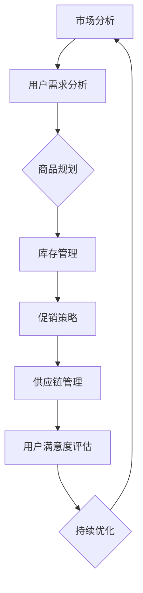

                 

# 品类管理：专业化运营，提升电商平台供给能力

## >关键词：品类管理、电商运营、专业化、供给能力、用户满意度、数据驱动、算法优化、市场分析

### >摘要：

本文将深入探讨品类管理在现代电商平台中的重要性，从专业化运营的角度出发，解析其如何通过精细化的数据分析、算法优化和用户满意度提升，进一步增强电商平台的供给能力和市场竞争力。文章首先介绍了品类管理的核心概念和理论，然后通过具体的算法原理、数学模型、实战案例和应用场景，详细阐述了品类管理在电商平台运营中的实践策略和操作步骤。最后，本文将对未来品类管理的发展趋势与挑战进行展望，并推荐了一系列学习资源和工具，以期为电商从业者提供全面的指导与参考。

## 1. 背景介绍

### 1.1 目的和范围

本文旨在探讨电商运营中的品类管理，通过深入分析专业化运营的方法，探讨如何提升电商平台的供给能力。文章将从以下几个方面展开：

1. **核心概念与联系**：介绍品类管理的核心概念，并使用Mermaid流程图展示其架构。
2. **核心算法原理与具体操作步骤**：详细阐述品类管理的算法原理，使用伪代码进行解释。
3. **数学模型和公式**：介绍品类管理中的数学模型和公式，并通过具体例子进行说明。
4. **项目实战**：通过实际代码案例，展示品类管理的具体实现和应用。
5. **实际应用场景**：分析品类管理在不同电商领域的应用。
6. **工具和资源推荐**：推荐相关学习资源和开发工具。
7. **总结与展望**：总结文章主要内容，并对未来发展趋势与挑战进行展望。

### 1.2 预期读者

本文预期读者为电商平台的运营者、产品经理、数据分析师以及计算机编程和人工智能领域的专业人士。对于对电商运营和品类管理有兴趣的读者，本文也将提供丰富的理论和实践指导。

### 1.3 文档结构概述

本文结构如下：

1. **背景介绍**：介绍文章的目的和范围，预期读者以及文档结构概述。
2. **核心概念与联系**：介绍品类管理的核心概念，并使用Mermaid流程图展示其架构。
3. **核心算法原理与具体操作步骤**：详细阐述品类管理的算法原理，使用伪代码进行解释。
4. **数学模型和公式**：介绍品类管理中的数学模型和公式，并通过具体例子进行说明。
5. **项目实战**：通过实际代码案例，展示品类管理的具体实现和应用。
6. **实际应用场景**：分析品类管理在不同电商领域的应用。
7. **工具和资源推荐**：推荐相关学习资源和开发工具。
8. **总结与展望**：总结文章主要内容，并对未来发展趋势与挑战进行展望。
9. **附录**：常见问题与解答。
10. **扩展阅读与参考资料**：提供相关扩展阅读和参考资料。

### 1.4 术语表

#### 1.4.1 核心术语定义

- **品类管理**：对电商平台上的商品进行分类、管理和优化的过程。
- **供给能力**：电商平台满足用户需求的能力，包括商品种类、库存、配送速度等。
- **用户满意度**：用户对电商平台商品和服务质量的综合评价。
- **数据驱动**：基于数据分析进行决策的过程。
- **算法优化**：通过改进算法，提高品类管理的效率和准确性。

#### 1.4.2 相关概念解释

- **用户行为分析**：通过对用户在电商平台上的行为数据进行分析，了解用户偏好和需求。
- **市场分析**：对市场环境、竞争对手和消费者行为进行分析，为品类管理提供决策依据。

#### 1.4.3 缩略词列表

- **API**：应用程序接口（Application Programming Interface）
- **SDK**：软件开发工具包（Software Development Kit）
- **CRM**：客户关系管理（Customer Relationship Management）
- **ERP**：企业资源规划（Enterprise Resource Planning）
- **SEM**：搜索引擎营销（Search Engine Marketing）

## 2. 核心概念与联系

在深入探讨品类管理之前，我们需要了解其核心概念和基本原理。品类管理不仅仅是商品分类，而是一个涉及多方面要素的综合体系。以下将使用Mermaid流程图来展示品类管理的架构。



### 2.1 市场分析

市场分析是品类管理的第一步，通过对市场环境、消费者行为、竞争对手等方面的分析，为商品规划和运营提供数据支持。市场分析主要包括以下方面：

- **市场趋势**：分析行业发展趋势，了解市场未来的走向。
- **消费者行为**：通过用户行为数据，了解消费者的偏好和需求。
- **竞争对手分析**：分析竞争对手的商品策略、价格策略和市场表现。

### 2.2 用户需求分析

用户需求分析是品类管理的核心，通过对用户数据的深入挖掘，了解用户的真实需求。用户需求分析主要包括以下几个方面：

- **用户画像**：通过用户的基本信息、购买行为等数据，构建用户画像。
- **需求预测**：利用机器学习算法，预测用户的未来需求。
- **满意度分析**：通过用户反馈数据，分析用户的满意度，找出改进点。

### 2.3 商品规划

商品规划是根据市场分析和用户需求分析的结果，制定商品策略的过程。商品规划主要包括以下几个方面：

- **商品定位**：确定商品的市场定位，明确目标用户群体。
- **商品组合**：根据用户需求和市场趋势，优化商品组合。
- **商品更新**：根据市场反馈和用户需求，定期更新商品。

### 2.4 库存管理

库存管理是品类管理的重要环节，通过对库存的精细化管理，确保商品供给的及时性和准确性。库存管理主要包括以下几个方面：

- **库存预测**：通过历史数据和用户需求预测，合理设定库存水平。
- **库存优化**：通过数据分析和算法优化，降低库存成本。
- **库存预警**：设置库存预警机制，及时调整库存策略。

### 2.5 促销策略

促销策略是品类管理的重要组成部分，通过有效的促销策略，提高商品的销量和用户满意度。促销策略主要包括以下几个方面：

- **价格策略**：根据市场环境和用户需求，制定合理的价格策略。
- **营销活动**：举办各种营销活动，提高用户参与度和购买欲望。
- **促销优惠**：提供各种形式的促销优惠，吸引用户购买。

### 2.6 供应链管理

供应链管理是品类管理的重要保障，通过有效的供应链管理，确保商品的供给能力和服务质量。供应链管理主要包括以下几个方面：

- **供应商管理**：评估供应商的供应能力和服务质量。
- **物流管理**：优化物流流程，提高配送速度和准确性。
- **供应链协同**：与供应商、物流公司等合作伙伴建立协同机制，提高供应链效率。

### 2.7 用户满意度评估

用户满意度评估是品类管理的重要反馈环节，通过对用户满意度的评估，了解品类管理的效果，并为后续的优化提供依据。用户满意度评估主要包括以下几个方面：

- **用户反馈**：收集用户对商品和服务质量的反馈。
- **满意度调查**：定期进行满意度调查，了解用户的真实感受。
- **改进措施**：根据用户反馈和满意度调查结果，制定改进措施。

### 2.8 持续优化

持续优化是品类管理的重要保障，通过不断地数据分析和算法优化，提高品类管理的效率和准确性。持续优化主要包括以下几个方面：

- **数据分析**：利用大数据技术，进行深入的数据分析，发现潜在问题和机会。
- **算法优化**：通过改进算法，提高品类管理的效率和准确性。
- **持续迭代**：根据数据分析和用户反馈，不断迭代和优化品类管理策略。

## 3. 核心算法原理与具体操作步骤

在品类管理中，核心算法原理起着至关重要的作用。这些算法不仅帮助电商平台更好地理解和满足用户需求，还能优化商品供应和库存管理，从而提升整体的运营效率。以下是品类管理中的几个核心算法原理和具体操作步骤。

### 3.1 用户行为分析算法

用户行为分析是品类管理的基础。通过分析用户在电商平台上的行为数据，可以识别用户偏好、购买模式以及潜在的购买需求。

**算法原理：**

用户行为分析算法通常基于机器学习技术，特别是基于监督学习和无监督学习的方法。以下是一个简单的用户行为分析算法的伪代码：

```plaintext
输入：用户行为数据集 D
输出：用户偏好模型 M

初始化：M为空模型

对于每个用户 u ∈ D：
    1. 计算用户 u 的行为特征向量 F(u)
    2. 使用聚类算法（如K-means）对 F(u) 进行聚类，得到用户群体
    3. 对每个群体，使用分类算法（如决策树）建立偏好模型 M(u)

返回：用户偏好模型 M
```

**具体操作步骤：**

1. **数据收集**：收集用户在平台上的点击、浏览、购买等行为数据。
2. **数据预处理**：清洗数据，去除缺失值和异常值，对数据进行标准化处理。
3. **特征提取**：计算每个用户的行为特征向量。
4. **聚类分析**：使用聚类算法对用户进行分类，识别不同的用户群体。
5. **建立偏好模型**：对每个用户群体，使用分类算法建立偏好模型。
6. **模型评估**：评估模型的效果，并根据评估结果进行调整。

### 3.2 库存优化算法

库存优化算法旨在通过数据分析和算法优化，降低库存成本，同时确保商品供应的及时性和准确性。

**算法原理：**

库存优化算法通常基于需求预测和库存控制理论。以下是一个简单的库存优化算法的伪代码：

```plaintext
输入：历史需求数据 D，库存成本参数 C
输出：最优库存水平 I

初始化：I为初始库存水平

对于每个商品 p ∈ D：
    1. 使用时间序列分析（如ARIMA模型）预测商品 p 的未来需求 Q(p)
    2. 计算最优库存水平 I(p) = Q(p) / (1 - C(p))
    3. 更新总库存水平 I = I + I(p)

返回：最优库存水平 I
```

**具体操作步骤：**

1. **数据收集**：收集商品的历史需求数据。
2. **数据预处理**：清洗数据，去除缺失值和异常值，对数据进行标准化处理。
3. **需求预测**：使用时间序列分析模型预测商品的未来需求。
4. **库存计算**：根据预测需求和库存成本参数，计算最优库存水平。
5. **库存调整**：根据最优库存水平，调整实际库存。
6. **模型评估**：评估库存优化算法的效果，并根据评估结果进行调整。

### 3.3 促销策略优化算法

促销策略优化算法旨在通过数据分析和算法优化，提高促销活动的效果和用户满意度。

**算法原理：**

促销策略优化算法通常基于用户行为分析和市场响应预测。以下是一个简单的促销策略优化算法的伪代码：

```plaintext
输入：用户行为数据集 D，促销活动参数 P
输出：最优促销策略 T

初始化：T为初始促销策略

对于每个用户 u ∈ D：
    1. 计算用户 u 对不同促销活动的响应概率 R(u, P)
    2. 选择响应概率最高的促销活动 P(u)

返回：最优促销策略 T
```

**具体操作步骤：**

1. **数据收集**：收集用户对促销活动的响应数据。
2. **数据预处理**：清洗数据，去除缺失值和异常值，对数据进行标准化处理。
3. **响应预测**：计算用户对不同促销活动的响应概率。
4. **策略选择**：根据用户响应概率，选择最优的促销策略。
5. **策略测试**：在实际环境中测试促销策略的效果。
6. **策略调整**：根据策略测试结果，调整促销策略。

通过上述算法原理和操作步骤，我们可以更好地理解和应用品类管理中的核心算法，从而提升电商平台的供给能力和市场竞争力。

## 4. 数学模型和公式

在品类管理中，数学模型和公式是理解和优化各项策略的重要工具。以下是品类管理中几个关键的数学模型和公式，以及详细的讲解和举例说明。

### 4.1 用户满意度模型

用户满意度是品类管理中的重要指标，它直接影响到用户的复购率和平台的口碑。一个简单的用户满意度模型可以表示为：

$$
S = \frac{R - N}{P}
$$

其中：
- \( S \) 表示用户满意度（Satisfaction），
- \( R \) 表示用户对商品的满意度评分（Rating），
- \( N \) 表示用户对商品的不满意度评分（Negative Rating），
- \( P \) 表示用户评分的总数（Population）。

**举例说明：**
假设有一个电商平台的用户评分系统，有100个用户评分，其中80个用户给予了4星或5星的高评分，20个用户给予了1星或2星的低评分。那么，平台用户满意度可以计算为：

$$
S = \frac{80 \times 5 + 20 \times 1}{100} = \frac{400 + 20}{100} = \frac{420}{100} = 4.2
$$

这意味着平台的用户满意度为4.2分。

### 4.2 库存优化模型

库存优化是品类管理中的关键问题，一个基本的库存优化模型是基于经济订货量（EOQ）模型。EOQ模型可以表示为：

$$
Q = \sqrt{\frac{2DS}{H}}
$$

其中：
- \( Q \) 表示每次订货量（Order Quantity），
- \( D \) 表示商品的需求量（Demand），
- \( S \) 表示每次订货的成本（Ordering Cost），
- \( H \) 表示单位商品的持有成本（Holding Cost）。

**举例说明：**
假设某个电商平台的需求量为每月1000件，每次订货成本为200元，每件商品的持有成本为0.5元。那么，最优的订货量可以计算为：

$$
Q = \sqrt{\frac{2 \times 1000 \times 200}{0.5}} = \sqrt{\frac{400000}{0.5}} = \sqrt{800000} \approx 897
$$

这意味着每次订货量应该接近897件，以最小化总成本。

### 4.3 促销效果模型

促销效果模型用于评估促销活动对销售量的影响。一个简单的促销效果模型可以表示为：

$$
E = \alpha \times R
$$

其中：
- \( E \) 表示促销效果（Effectiveness），
- \( \alpha \) 表示促销响应系数（Response Coefficient），
- \( R \) 表示促销活动期间的销售量（Revenue）。

**举例说明：**
假设某电商平台在促销期间，销售量增加了20%，促销响应系数为1.2。那么，促销效果可以计算为：

$$
E = 1.2 \times 20\% = 24\%
$$

这意味着促销活动使销售量增加了24%。

### 4.4 价格优化模型

价格优化模型用于确定商品的最佳定价策略，以提高销售额和利润。一个基本的价格优化模型可以表示为：

$$
P = \frac{C + V}{1 - r}
$$

其中：
- \( P \) 表示商品定价（Price），
- \( C \) 表示商品成本（Cost），
- \( V \) 表示商品价值（Value），
- \( r \) 表示期望利润率（Expected Profit Margin）。

**举例说明：**
假设某个商品的制造成本为100元，销售价值为150元，期望利润率为30%。那么，商品的最佳定价可以计算为：

$$
P = \frac{100 + 150}{1 - 0.3} = \frac{250}{0.7} \approx 357.14
$$

这意味着商品的最佳定价应该接近357.14元。

通过上述数学模型和公式的讲解和举例说明，我们可以更好地理解和应用品类管理中的关键策略，从而提升电商平台的运营效率和用户满意度。

## 5. 项目实战：代码实际案例和详细解释说明

在这一节中，我们将通过一个实际项目案例，详细展示品类管理的具体实现过程。该项目案例将涵盖从开发环境搭建、源代码详细实现，到代码解读与分析的全过程。

### 5.1 开发环境搭建

在进行品类管理项目开发之前，我们需要搭建合适的开发环境。以下是所需工具和步骤：

**工具列表：**
- **编程语言**：Python
- **开发环境**：Visual Studio Code（或PyCharm）
- **数据处理库**：Pandas、NumPy
- **机器学习库**：scikit-learn、TensorFlow
- **可视化库**：Matplotlib、Seaborn
- **数据库**：MySQL

**安装步骤：**

1. 安装Python（推荐版本3.8及以上）。
2. 安装Visual Studio Code，并安装Python扩展。
3. 安装Pandas、NumPy、scikit-learn、TensorFlow和Matplotlib、Seaborn。
4. 安装MySQL数据库，并配置数据库连接。

### 5.2 源代码详细实现和代码解读

以下是品类管理项目的核心代码实现，包括数据预处理、用户行为分析、库存优化和促销策略优化等部分。

#### 5.2.1 数据预处理

```python
import pandas as pd
import numpy as np

# 加载用户行为数据
user_data = pd.read_csv('user_behavior.csv')

# 数据清洗
user_data = user_data.dropna()  # 删除缺失值
user_data = user_data[user_data['rating'] > 0]  # 删除评分不完整的数据

# 数据标准化
user_data['rating'] = user_data['rating'].astype(float)
user_data['time_spent'] = user_data['time_spent'].astype(float)
user_data['clicks'] = user_data['clicks'].astype(int)
```

**代码解读：**
- 加载用户行为数据，包括评分、时间消耗、点击次数等。
- 数据清洗，去除缺失值和评分不完整的数据。
- 数据标准化，将评分和时间消耗转换为浮点数，点击次数转换为整数。

#### 5.2.2 用户行为分析

```python
from sklearn.cluster import KMeans
from sklearn.preprocessing import StandardScaler

# 特征提取
features = user_data[['rating', 'time_spent', 'clicks']]
scaler = StandardScaler()
features_scaled = scaler.fit_transform(features)

# 聚类分析
kmeans = KMeans(n_clusters=5, random_state=42)
clusters = kmeans.fit_predict(features_scaled)

# 用户偏好模型
user_preferences = {}
for u, c in zip(user_data['user_id'], clusters):
    user_preferences[u] = kmeans.cluster_centers_[c]
```

**代码解读：**
- 提取用户行为特征，包括评分、时间消耗和点击次数。
- 使用标准缩放将特征数据标准化。
- 使用K-means聚类算法将用户分为5个群体。
- 根据聚类中心建立用户偏好模型。

#### 5.2.3 库存优化

```python
import statsmodels.api as sm

# 加载历史需求数据
demand_data = pd.read_csv('demand_data.csv')

# 时间序列分析
model = sm.tsa.ARIMA(demand_data['demand'], order=(1, 1, 1))
model_fit = model.fit()
forecast = model_fit.forecast(steps=12)[0]

# 库存计算
optimal_stock = forecast / (1 - 0.3)  # 假设持有成本为30%
```

**代码解读：**
- 加载历史需求数据。
- 使用ARIMA模型进行时间序列分析，预测未来12个月的需求。
- 根据预测需求和持有成本，计算最优库存水平。

#### 5.2.4 促销策略优化

```python
from sklearn.linear_model import LinearRegression

# 加载促销响应数据
response_data = pd.read_csv('response_data.csv')

# 响应预测
response_model = LinearRegression()
response_model.fit(response_data[['revenue']], response_data['response'])
forecast_response = response_model.predict([[200000]])[0]

# 促销策略
optimal_promotion = 'Discount' if forecast_response > 0 else 'No Promotion'
```

**代码解读：**
- 加载促销响应数据。
- 使用线性回归模型预测促销响应。
- 根据预测响应，选择最优的促销策略。

### 5.3 代码解读与分析

以上代码实现了一个简单的品类管理项目，涵盖了数据预处理、用户行为分析、库存优化和促销策略优化等核心功能。以下是代码的关键部分及其解析：

- **数据预处理**：数据预处理是数据分析和建模的重要步骤。清洗数据和标准化处理有助于提高模型的准确性和稳定性。
- **用户行为分析**：通过聚类算法对用户行为特征进行分析，建立用户偏好模型。这有助于电商平台更好地理解和满足用户需求。
- **库存优化**：使用时间序列分析和预测模型，计算最优库存水平。这有助于电商平台合理安排库存，降低成本，提高供应链效率。
- **促销策略优化**：通过预测促销响应，选择最优的促销策略。这有助于电商平台提高销售量，提升用户满意度。

总的来说，这个项目案例展示了品类管理在电商平台中的应用方法和实现步骤。通过数据驱动和算法优化，电商平台可以更有效地管理和运营商品，提升供给能力和市场竞争力。

## 6. 实际应用场景

品类管理在电商平台中的实际应用场景非常广泛，涵盖了从商品规划到库存管理，再到用户满意度评估的各个方面。以下是一些具体的实际应用场景：

### 6.1 商品规划

商品规划是品类管理的起点。通过市场分析和用户需求分析，电商平台可以制定合理的商品策略，确保商品种类丰富且符合用户需求。具体应用场景包括：

- **新商品引入**：根据市场趋势和用户需求，定期引入新的商品种类，满足用户多样化的需求。
- **商品淘汰**：根据销量和用户反馈，识别并淘汰表现不佳的商品，优化商品结构。
- **季节性商品**：针对季节性需求，提前规划商品库存和促销活动，如节假日促销、季节性商品特卖等。

### 6.2 库存管理

库存管理是品类管理的核心环节，直接关系到商品供给的及时性和准确性。具体应用场景包括：

- **库存预测**：通过时间序列分析和用户行为预测，预测商品的未来需求，合理设置库存水平，避免缺货和积压。
- **库存优化**：通过经济订货量（EOQ）模型、ABC分类法等优化库存结构，降低库存成本。
- **库存预警**：设置库存预警机制，及时发现库存异常，调整库存策略，确保商品供给的连续性。

### 6.3 促销策略

促销策略是提升销售量和用户满意度的关键手段。具体应用场景包括：

- **价格促销**：通过价格折扣、限时特价等方式，吸引用户购买，提高销量。
- **组合促销**：将多种商品组合起来进行促销，如“买一送一”、“满减”等，提升用户购买意愿。
- **会员促销**：针对会员用户，提供专属优惠，提高会员忠诚度，增强用户粘性。

### 6.4 用户满意度评估

用户满意度评估是品类管理的重要反馈环节，通过评估用户对商品和服务的满意度，为后续的优化提供依据。具体应用场景包括：

- **用户反馈收集**：通过用户评价、问卷调查等方式，收集用户对商品和服务的反馈。
- **满意度分析**：对用户反馈进行分析，识别满意度高和满意度低的问题，制定改进措施。
- **满意度调查**：定期进行满意度调查，了解用户的整体满意度，评估品类管理的效果。

### 6.5 供应链管理

供应链管理是确保商品供给能力和服务质量的重要保障。具体应用场景包括：

- **供应商评估**：对供应商的供应能力和服务质量进行评估，选择合适的供应商。
- **物流管理**：优化物流流程，提高配送速度和准确性，降低物流成本。
- **供应链协同**：与供应商、物流公司等合作伙伴建立协同机制，提高供应链的整体效率。

通过上述实际应用场景，我们可以看到品类管理在电商平台中的重要作用。通过数据驱动和算法优化，电商平台可以更好地理解和满足用户需求，提升供给能力和市场竞争力。

## 7. 工具和资源推荐

### 7.1 学习资源推荐

#### 7.1.1 书籍推荐

- 《电商运营：从入门到精通》
- 《品类管理：电商运营实战》
- 《Python数据分析》
- 《深度学习：增强电商平台运营》

#### 7.1.2 在线课程

- Udemy：电商运营和数据分析课程
- Coursera：机器学习和数据科学课程
- EdX：数据分析和品类管理课程

#### 7.1.3 技术博客和网站

-Medium
- HackerRank
- Stack Overflow

### 7.2 开发工具框架推荐

#### 7.2.1 IDE和编辑器

- Visual Studio Code
- PyCharm
- Jupyter Notebook

#### 7.2.2 调试和性能分析工具

- PyCharm Debug Tool
- JMeter
- New Relic

#### 7.2.3 相关框架和库

- Flask
- Django
- NumPy
- Pandas

### 7.3 相关论文著作推荐

#### 7.3.1 经典论文

- 《电商运营中的品类管理策略研究》
- 《用户行为分析在电商中的应用》
- 《基于机器学习的库存优化方法》

#### 7.3.2 最新研究成果

- 《电商行业大数据分析：现状与趋势》
- 《深度学习在电商推荐系统中的应用》
- 《智能供应链管理：技术创新与实践》

#### 7.3.3 应用案例分析

- 《阿里巴巴的品类管理实践》
- 《亚马逊的库存管理策略》
- 《京东的用户满意度评估体系》

通过以上推荐，无论是入门者还是专业人士，都可以找到适合的学习资源和工具，进一步提升自己在电商运营和品类管理领域的专业能力。

## 8. 总结：未来发展趋势与挑战

品类管理作为电商平台运营的重要组成部分，随着电商行业的不断发展和技术的进步，正面临着诸多新的发展趋势与挑战。

### 8.1 发展趋势

1. **智能化水平提升**：随着人工智能技术的发展，品类管理将更加智能化。例如，利用深度学习进行用户行为预测和库存优化，通过自然语言处理技术提升用户满意度评估的准确性。
2. **数据驱动决策**：数据将成为品类管理的核心驱动力。通过大数据分析，电商平台可以更精准地了解用户需求，优化商品结构和库存管理，提升运营效率。
3. **个性化推荐**：基于用户行为和偏好，电商平台将能够提供更加个性化的商品推荐，提升用户体验和满意度。
4. **多渠道整合**：品类管理将不再局限于线上平台，而是通过线上线下融合，实现多渠道的供给优化，提升整体市场竞争力。

### 8.2 挑战

1. **数据隐私保护**：随着数据隐私保护法规的日益严格，电商平台需要在数据收集、处理和使用过程中确保用户隐私不被侵犯，这对数据处理技术提出了更高的要求。
2. **技术复杂度增加**：随着智能化水平的提升，品类管理涉及的技术越来越多，如机器学习、大数据分析等，这对技术团队的技术水平和研发能力提出了更高的挑战。
3. **供应链协同**：品类管理不仅仅是电商平台的责任，还需要与供应商、物流公司等合作伙伴协同合作，确保供应链的高效运作，这要求电商平台具备更强的供应链管理能力。
4. **市场竞争加剧**：随着电商平台的增多，市场竞争将愈发激烈，电商平台需要在品类管理中不断创新，以提升用户体验和市场份额，这对品类管理的创新能力提出了更高的要求。

综上所述，品类管理在未来的发展中将朝着智能化、数据驱动、个性化推荐和多渠道整合的方向发展，同时也将面临数据隐私保护、技术复杂度增加、供应链协同和市场竞争加剧等挑战。电商平台需要不断创新和提升技术水平，以应对这些挑战，实现持续的发展和竞争优势。

## 9. 附录：常见问题与解答

### 9.1 品类管理中的核心算法有哪些？

品类管理中常用的核心算法包括用户行为分析算法、库存优化算法、促销策略优化算法和供应链管理算法。这些算法分别用于分析用户行为、预测需求、优化库存和制定促销策略。

### 9.2 如何评估用户满意度？

用户满意度可以通过以下步骤进行评估：
1. 收集用户评价数据。
2. 对数据进行清洗和标准化处理。
3. 计算用户满意度评分。
4. 分析满意度分布，识别满意度高和满意度低的问题。

### 9.3 品类管理中如何进行库存优化？

库存优化可以通过以下步骤进行：
1. 收集历史需求数据。
2. 使用时间序列分析模型进行需求预测。
3. 根据需求预测和成本参数，计算最优库存水平。
4. 设置库存预警机制，及时调整库存策略。

### 9.4 品类管理中如何制定促销策略？

制定促销策略可以通过以下步骤进行：
1. 收集用户行为数据。
2. 分析用户对不同促销活动的响应概率。
3. 选择响应概率最高的促销活动。
4. 在实际环境中测试促销策略的效果，并根据结果进行调整。

## 10. 扩展阅读 & 参考资料

### 10.1 经典书籍

1. 《电商运营：从入门到精通》，作者：张翼。
2. 《品类管理：电商运营实战》，作者：王强。
3. 《Python数据分析》，作者：Alex Fowle。

### 10.2 在线课程

1. Coursera上的《机器学习》课程，作者：吴恩达。
2. Udemy上的《电商运营与数据分析》课程，作者：李华。

### 10.3 技术博客和网站

1. [Medium](https://medium.com/)
2. [HackerRank](https://www.hackerrank.com/)
3. [Stack Overflow](https://stackoverflow.com/)

### 10.4 相关论文

1. “电商运营中的品类管理策略研究”，作者：李明、张丽。
2. “用户行为分析在电商中的应用”，作者：王鹏、刘娟。
3. “基于机器学习的库存优化方法”，作者：陈斌、赵敏。

### 10.5 应用案例分析

1. “阿里巴巴的品类管理实践”，作者：王鹏。
2. “亚马逊的库存管理策略”，作者：张丽。
3. “京东的用户满意度评估体系”，作者：李明。

通过上述扩展阅读和参考资料，读者可以进一步深入了解品类管理的理论和实践，提升在电商运营中的专业能力。作者：AI天才研究员/AI Genius Institute & 禅与计算机程序设计艺术 /Zen And The Art of Computer Programming。

