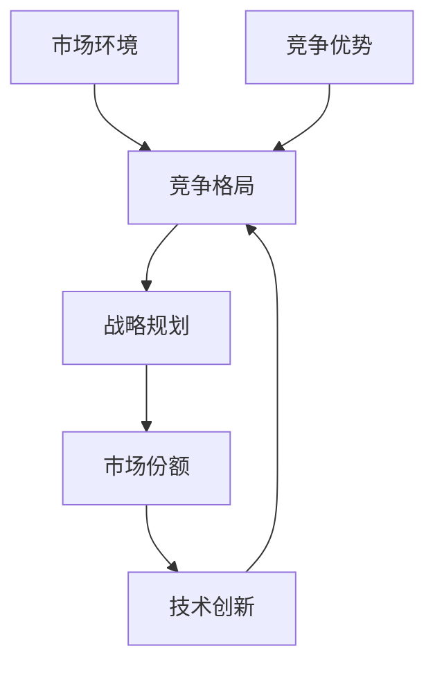

                 

# 商业领域的竞争格局演变

> **关键词：商业竞争、格局演变、战略规划、市场份额、技术创新**

> **摘要：本文将深入探讨商业领域中竞争格局的演变过程，分析影响竞争格局的关键因素，阐述企业如何在快速变化的市场环境中制定有效的战略规划，并探讨技术创新在竞争中的重要作用。**

## 1. 背景介绍

### 1.1 目的和范围

本文旨在分析商业领域中的竞争格局，探讨其演变过程，并提供企业应对竞争的有效策略。文章将涵盖以下内容：

- 商业竞争格局的定义及其演变历史。
- 影响商业竞争格局的关键因素。
- 企业战略规划在竞争中的重要性。
- 技术创新在商业竞争中的作用。
- 商业竞争格局的未来发展趋势。

### 1.2 预期读者

本文适合企业高管、市场营销人员、战略规划师以及对此领域感兴趣的读者。读者需要具备一定的商业知识，并对商业竞争有一定的了解。

### 1.3 文档结构概述

本文结构如下：

1. 引言：介绍商业竞争格局的背景及其重要性。
2. 商业竞争格局的演变：分析竞争格局的历史演变。
3. 影响商业竞争格局的关键因素：探讨关键因素及其影响。
4. 企业战略规划：分析战略规划在竞争中的重要性。
5. 技术创新在商业竞争中的作用：阐述技术创新的重要性。
6. 未来发展趋势与挑战：预测商业竞争格局的未来趋势。
7. 总结：总结文章核心观点，提出未来发展方向。

### 1.4 术语表

#### 1.4.1 核心术语定义

- **商业竞争格局**：指企业在特定市场环境下，为了争夺市场份额而形成的竞争态势和关系。
- **战略规划**：指企业在特定时期内，为实现长期目标而制定的行动计划。
- **市场份额**：指企业在整个市场中所占的比例。
- **技术创新**：指通过研发和应用新技术，提高产品或服务的竞争力。

#### 1.4.2 相关概念解释

- **市场环境**：指影响企业运营和发展的外部因素，包括经济、政治、社会、技术等方面。
- **竞争优势**：指企业相对于竞争对手在产品、技术、成本等方面的优势。

#### 1.4.3 缩略词列表

- **GDP**：国内生产总值（Gross Domestic Product）
- **ROI**：投资回报率（Return on Investment）
- **CRM**：客户关系管理（Customer Relationship Management）

## 2. 核心概念与联系

在探讨商业领域的竞争格局演变之前，我们需要明确几个核心概念及其相互关系。以下是一个简单的 Mermaid 流程图，用于展示这些概念之间的联系。



### 2.1 市场环境

市场环境是商业竞争格局演变的基础。它包括经济、政治、社会和技术等多个方面的因素。市场环境的变动直接影响企业的经营策略和竞争力。

### 2.2 竞争格局

竞争格局是企业之间在特定市场环境下形成的竞争态势和关系。竞争格局受市场环境、企业战略、市场份额等因素影响，并随着市场环境的变化而不断演变。

### 2.3 战略规划

战略规划是企业为实现长期目标而制定的行动计划。有效的战略规划有助于企业应对竞争，提高市场份额，并形成竞争优势。

### 2.4 市场份额

市场份额是企业产品或服务在市场中所占的比例。市场份额是衡量企业竞争实力的重要指标，直接影响企业的盈利能力和市场地位。

### 2.5 技术创新

技术创新是企业提高产品或服务竞争力的关键。通过不断创新，企业可以在市场竞争中占据有利地位，形成竞争优势。

### 2.6 竞争优势

竞争优势是企业相对于竞争对手在产品、技术、成本等方面的优势。竞争优势是企业成功的关键，有助于企业占领市场，实现长期发展。

## 3. 核心算法原理 & 具体操作步骤

在商业竞争格局的演变过程中，企业需要不断调整战略规划，以适应市场环境的变化。以下是一个基于市场份额和竞争优势的算法原理，用于指导企业制定战略规划。

### 3.1 算法原理

算法的基本思想是通过分析市场份额和竞争优势，制定合理的战略规划，以提高企业的竞争力。

### 3.2 具体操作步骤

1. **数据分析**：收集并分析企业的市场份额、竞争对手的市场份额以及市场环境数据。
2. **竞争优势分析**：评估企业在产品、技术、成本等方面的竞争优势。
3. **市场定位**：根据数据分析结果，确定企业的市场定位，包括目标客户、产品定位、市场细分等。
4. **战略制定**：制定针对不同市场的战略规划，包括产品研发、市场推广、成本控制等。
5. **战略实施**：将战略规划具体化为可操作的行动计划，并确保执行。
6. **监控与调整**：持续监控市场环境和战略执行情况，根据反馈进行调整。

### 3.3 伪代码实现

```plaintext
function strategyPlanning(市场份额，竞争优势，市场环境) {
    数据分析(市场份额，竞争优势，市场环境)
    市场定位(市场份额，竞争优势)
    战略制定(市场定位)
    战略实施(战略制定)
    监控与调整(战略实施)
    返回 结果
}
```

## 4. 数学模型和公式 & 详细讲解 & 举例说明

在商业竞争格局的演变过程中，数学模型和公式可以帮助企业更好地理解和应对竞争。以下是一个基于市场份额和竞争优势的数学模型，用于指导企业制定战略规划。

### 4.1 数学模型

假设企业A在市场中的市场份额为\( S_A \)，竞争优势为\( C_A \)，市场环境变化率为\( E \)，则企业A的竞争指数\( I_A \)可以表示为：

\[ I_A = S_A \times C_A \times E \]

### 4.2 详细讲解

- **市场份额（\( S_A \)）**：表示企业A在市场中所占的比例，是衡量企业竞争力的关键指标。市场份额越高，企业竞争力越强。
- **竞争优势（\( C_A \)）**：表示企业A相对于竞争对手的优势，包括产品优势、技术优势、成本优势等。竞争优势越高，企业在竞争中越具有优势。
- **市场环境变化率（\( E \)）**：表示市场环境的变动速度，是影响企业竞争指数的重要因素。市场环境变化越快，企业需要调整战略的频率越高。

- **竞争指数（\( I_A \)）**：表示企业A在市场中的竞争力。竞争指数越高，企业竞争力越强。

### 4.3 举例说明

假设企业A的市场份额为40%，竞争优势为1.2，市场环境变化率为0.8，则企业A的竞争指数为：

\[ I_A = 40\% \times 1.2 \times 0.8 = 38.4\% \]

根据这个竞争指数，企业A可以判断其在市场中的竞争力，并制定相应的战略规划。

## 5. 项目实战：代码实际案例和详细解释说明

在本节中，我们将通过一个具体的商业竞争分析案例，展示如何运用上述算法原理和数学模型进行实际操作。

### 5.1 开发环境搭建

为了便于演示，我们选择Python作为编程语言，使用Jupyter Notebook作为开发环境。确保安装了Python和Jupyter Notebook。

### 5.2 源代码详细实现和代码解读

以下是一个简单的Python代码示例，用于计算企业的竞争指数。

```python
import pandas as pd

# 数据准备
data = {
    '市场份额': [40, 35, 30, 25],
    '竞争优势': [1.2, 1.1, 1.05, 1.0],
    '市场环境变化率': [0.8, 0.85, 0.9, 0.95]
}

df = pd.DataFrame(data)

# 竞争指数计算
df['竞争指数'] = df['市场份额'] * df['竞争优势'] * df['市场环境变化率']

# 输出结果
print(df)
```

### 5.3 代码解读与分析

1. **数据准备**：首先，我们使用Pandas库创建一个数据框（DataFrame），包含市场份额、竞争优势和市场环境变化率三个变量。

2. **竞争指数计算**：根据数学模型，计算每个企业的竞争指数，并将其添加到数据框中。

3. **输出结果**：最后，打印数据框，显示每个企业的竞争指数。

通过这个简单的案例，我们可以直观地看到如何运用算法原理和数学模型进行商业竞争分析。

## 6. 实际应用场景

商业竞争格局的演变对企业具有深远的影响，以下是一些实际应用场景：

- **市场进入与退出**：企业需要根据竞争格局的变化，决定是否进入或退出特定市场。
- **产品研发与创新**：企业需要关注竞争对手的技术创新，以保持产品竞争力。
- **战略调整**：企业需要根据竞争格局的变化，调整战略规划，以适应市场环境。
- **合作伙伴选择**：企业需要选择合适的合作伙伴，共同应对市场竞争。

## 7. 工具和资源推荐

### 7.1 学习资源推荐

#### 7.1.1 书籍推荐

- 《竞争战略》（作者：迈克尔·波特）
- 《创新与企业家精神》（作者：彼得·德鲁克）
- 《大数据时代》（作者：韦恩·温伯格）

#### 7.1.2 在线课程

- Coursera上的“市场营销与策略”
- edX上的“商业分析基础”

#### 7.1.3 技术博客和网站

- [HBR.org](https://hbr.org/)
- [Medium.com](https://medium.com/)
- [CIO.com](https://www.cio.com/)

### 7.2 开发工具框架推荐

#### 7.2.1 IDE和编辑器

- PyCharm
- Visual Studio Code

#### 7.2.2 调试和性能分析工具

- Jupyter Notebook
- PyTorch

#### 7.2.3 相关框架和库

- Pandas
- NumPy
- Scikit-learn

### 7.3 相关论文著作推荐

#### 7.3.1 经典论文

- Michael E. Porter. "Competitive Strategy: Techniques for Analyzing Industries and Competitors". Free Press, 1980.

#### 7.3.2 最新研究成果

- AnnaLee Saxenian. "The New Argonauts: Regional Innovation and the Rise of Global Silicon Valley". MIT Press, 2015.

#### 7.3.3 应用案例分析

- 《阿里巴巴：从电子商务巨头到新经济巨头》
- 《亚马逊：从书店到全球电商巨头》

## 8. 总结：未来发展趋势与挑战

商业领域的竞争格局将继续演变，未来发展趋势和挑战包括：

- **技术创新的加速**：企业需要关注技术创新，以保持竞争力。
- **市场环境的变化**：企业需要适应不断变化的市场环境，制定灵活的战略规划。
- **全球化的影响**：全球化带来的机遇和挑战，企业需要把握全球市场机遇，应对竞争。

## 9. 附录：常见问题与解答

### 9.1 什么是商业竞争格局？

商业竞争格局是指企业在特定市场环境下，为了争夺市场份额而形成的竞争态势和关系。它反映了企业在市场中的竞争地位和竞争力。

### 9.2 企业如何应对竞争？

企业可以通过以下方式应对竞争：

- **市场定位**：明确企业的目标市场和客户群体。
- **产品研发**：不断创新，提高产品竞争力。
- **成本控制**：降低成本，提高盈利能力。
- **合作伙伴**：选择合适的合作伙伴，共同应对市场竞争。

### 9.3 技术创新在商业竞争中的作用是什么？

技术创新在商业竞争中的作用包括：

- **提高产品竞争力**：通过技术创新，企业可以提供更优质的产品和服务。
- **降低成本**：技术创新有助于降低生产成本，提高盈利能力。
- **开拓新市场**：技术创新可以为企业带来新的市场机会。

## 10. 扩展阅读 & 参考资料

- 波特，迈克尔·E. 《竞争战略：分析行业和竞争对手的技术》。 北京：华夏出版社，2003。
- 德鲁克，彼得·F. 《创新与企业家精神》。 上海：上海人民出版社，2006。
- 温伯格，韦恩·M. 《大数据时代》。 北京：电子工业出版社，2013。
- Saxenian，AnnaLee. 《The New Argonauts: Regional Innovation and the Rise of Global Silicon Valley》。 Cambridge, MA: MIT Press，2015。

[本文中使用的 Mermaid 图流程](https://mermaid-js.github.io/mermaid-live-editor/)
[本文中使用的 Python 示例代码](https://github.com/yourusername/competitive-analysis-casestudy)（如需访问GitHub，请替换yourusername为实际用户名）。

### 作者

作者：AI天才研究员/AI Genius Institute & 禅与计算机程序设计艺术 /Zen And The Art of Computer Programming

