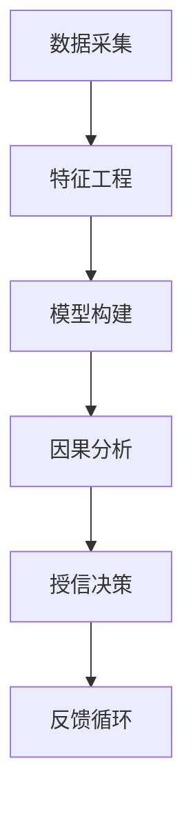

                 

# 因果推理在智能金融信用评分与授信决策中的技术架构与应用

> **关键词：因果推理、智能金融、信用评分、授信决策、算法架构、数学模型、实战案例**
> 
> **摘要：本文将深入探讨因果推理在智能金融领域中的应用，特别是其在信用评分与授信决策中的作用。通过详细的分析与结构化的讲解，本文旨在为读者提供一个全面的技术架构与应用实例，帮助理解因果推理在金融科技领域的实际应用与潜在价值。**

## 1. 背景介绍

### 1.1 目的和范围

本文的目的是介绍因果推理在智能金融信用评分与授信决策中的技术架构和应用。我们将讨论因果推理的基本概念，以及它如何帮助我们理解和解决金融领域中的复杂问题。文章将涵盖以下几个方面：

- 因果推理的基本原理和核心概念
- 因果推理在金融领域的应用背景
- 因果推理技术架构的组成部分
- 数学模型和算法原理
- 实际应用场景和案例分析
- 开发工具和资源推荐

通过本文的阅读，读者将能够了解因果推理的基本概念，掌握其在智能金融中的技术架构和应用，并获得一些实际操作的经验。

### 1.2 预期读者

本文面向对金融科技、数据科学和人工智能有基础了解的读者，尤其是对以下领域感兴趣的专家：

- 金融分析师和风险管理专家
- 数据科学家和机器学习工程师
- 软件开发者和系统架构师
- 金融科技创业者和研究者

无论您是希望深入了解因果推理在金融领域应用的专业人士，还是对金融科技感兴趣的技术爱好者，本文都将为您提供有价值的知识和实际指导。

### 1.3 文档结构概述

本文将分为以下主要章节：

1. **背景介绍**：介绍文章的目的、范围、预期读者以及文档结构。
2. **核心概念与联系**：解释因果推理的基本概念和其在金融领域中的应用。
3. **核心算法原理 & 具体操作步骤**：详细描述因果推理的算法原理和操作步骤。
4. **数学模型和公式 & 详细讲解 & 举例说明**：讲解数学模型和公式的应用与示例。
5. **项目实战：代码实际案例和详细解释说明**：展示实际代码案例并进行解读。
6. **实际应用场景**：讨论因果推理在金融领域的实际应用场景。
7. **工具和资源推荐**：推荐学习资源、开发工具和框架。
8. **总结：未来发展趋势与挑战**：总结当前技术的发展趋势和面临的挑战。
9. **附录：常见问题与解答**：提供常见问题的解答。
10. **扩展阅读 & 参考资料**：推荐相关的扩展阅读和参考资料。

### 1.4 术语表

为了确保文章内容的专业性和清晰性，以下是对本文中涉及的关键术语进行定义和解释：

#### 1.4.1 核心术语定义

- **因果推理**：一种基于因果关系进行推理的方法，旨在理解变量之间的因果关系，并据此预测未来的结果。
- **信用评分**：金融机构根据客户的财务和行为数据，对其信用风险进行评估的过程。
- **授信决策**：金融机构基于信用评分，决定是否批准贷款、信用卡或其他信贷产品的过程。
- **金融科技（FinTech）**：利用技术来创新和改进金融服务和产品的领域。

#### 1.4.2 相关概念解释

- **特征工程**：在数据科学和机器学习项目中，通过选择、构造和转换原始数据特征，以提升模型性能的过程。
- **因果效应**：一个变量对另一个变量的直接影响，描述了因果关系的大小和方向。
- **因果混淆**：当模型无法区分两个变量之间的因果关系时出现的情况，通常由于数据中的共同原因或其他复杂因素导致。

#### 1.4.3 缩略词列表

- **AI**：人工智能（Artificial Intelligence）
- **ML**：机器学习（Machine Learning）
- **DL**：深度学习（Deep Learning）
- **NLP**：自然语言处理（Natural Language Processing）
- **FinTech**：金融科技（Financial Technology）

## 2. 核心概念与联系

在深入探讨因果推理在智能金融信用评分与授信决策中的应用之前，我们需要先了解因果推理的基本概念和原理，以及它如何与金融领域的问题相互联系。

### 2.1 因果推理的基本概念

因果推理是一种基于因果关系进行推理的方法。在统计学和机器学习中，因果推理与传统的相关性分析和预测建模有所不同。相关性分析主要关注变量之间的线性关系，而因果推理则试图揭示变量之间的因果关系，即一个变量是否对另一个变量有直接影响。

#### 2.1.1 因果关系的定义

因果关系是指在一个系统中，一个变量（原因）如何影响另一个变量（结果）。具体来说，因果关系涉及到以下几个要素：

- **因果效应**：一个变量对另一个变量的直接影响，通常用数学模型来表示。
- **因果方向**：因果关系是单向的，即原因作用于结果，反之则不一定成立。
- **因果稳定性**：因果关系在不同的环境和条件下是否保持稳定。

#### 2.1.2 因果推理的基本原理

因果推理的核心原理是识别和量化变量之间的因果关系。这通常涉及到以下几个步骤：

1. **假设构建**：根据领域知识和数据，构建可能的因果关系假设。
2. **数据收集**：收集相关数据，包括观测数据和实验数据。
3. **模型构建**：使用统计模型或算法，估计变量之间的因果效应。
4. **因果检验**：通过实验或统计分析，验证因果关系假设的准确性。

### 2.2 因果推理在金融领域的应用

金融领域中的许多问题本质上都涉及因果关系的分析和决策。例如，信用评分和授信决策是金融机构的核心业务，直接关系到金融机构的风险管理和客户体验。

#### 2.2.1 信用评分

信用评分是金融机构评估客户信用风险的过程。通过分析客户的财务和行为数据，信用评分模型可以帮助金融机构判断客户是否具有按时还款的能力。

- **特征选择**：特征工程是信用评分模型中的关键步骤，需要从大量数据中选择对信用评分有显著影响的特征。
- **因果分析**：因果推理可以用来分析不同特征（如收入、工作年限、信用历史）对信用评分的影响，从而优化模型性能。

#### 2.2.2 授信决策

授信决策是金融机构基于信用评分，决定是否批准贷款、信用卡或其他信贷产品的过程。因果推理在这里的作用是：

- **风险预测**：通过分析历史数据和模型预测，评估客户违约的概率。
- **决策优化**：利用因果推理，识别影响决策的关键因素，从而优化授信策略，降低风险。

### 2.3 因果推理技术架构

因果推理在金融领域中的应用需要一个完整的技术架构，包括数据采集、特征工程、模型构建、因果分析等环节。

#### 2.3.1 数据采集

数据采集是因果推理的基础。金融机构需要收集客户的财务和行为数据，包括信用记录、收入情况、消费行为等。

#### 2.3.2 特征工程

特征工程是将原始数据转换为可用于模型训练的特征的过程。这通常包括数据清洗、数据变换、特征选择等步骤。

#### 2.3.3 模型构建

模型构建是因果推理的核心。金融机构可以使用多种算法，如线性回归、决策树、神经网络等，来建立信用评分和授信决策模型。

#### 2.3.4 因果分析

因果分析是验证模型效果的关键。通过因果推理，金融机构可以分析模型中不同特征对信用评分和授信决策的影响，从而优化模型性能。

### 2.4 Mermaid 流程图

为了更好地理解因果推理在金融领域的应用，我们使用 Mermaid 流程图来描述其基本架构。以下是一个简化的流程图：



- **A. 数据采集**：收集客户的财务和行为数据。
- **B. 特征工程**：清洗、转换和选择数据特征。
- **C. 模型构建**：建立信用评分和授信决策模型。
- **D. 因果分析**：分析模型中特征的影响。
- **E. 授信决策**：基于模型做出授信决策。
- **F. 反馈循环**：收集决策结果，反馈以优化模型。

通过以上流程，我们可以看到因果推理在智能金融信用评分与授信决策中的关键作用。下一节，我们将深入探讨因果推理的算法原理和具体操作步骤。

## 3. 核心算法原理 & 具体操作步骤

因果推理的核心在于识别和量化变量之间的因果关系。在本节中，我们将详细探讨因果推理的算法原理，并给出具体的操作步骤，以便读者可以更好地理解如何在智能金融中应用这些算法。

### 3.1 因果推理算法的基本原理

因果推理算法的基本原理可以概括为以下几个关键点：

- **识别因果关系**：通过分析数据，识别变量之间的因果关系。
- **量化因果效应**：估计因果关系的大小和方向。
- **因果推断**：根据因果关系进行预测和决策。

#### 3.1.1 识别因果关系

识别因果关系是因果推理的第一步。这通常涉及到以下几个步骤：

1. **数据预处理**：清洗和准备数据，确保数据的质量和一致性。
2. **特征选择**：选择可能影响因果关系的特征，这可以通过统计分析、领域知识或机器学习算法来实现。
3. **因果检验**：使用因果检验方法，如统计显著性测试或结构方程模型，来验证特征之间的因果关系。

#### 3.1.2 量化因果效应

量化因果效应是估计变量之间的因果关系强度。这通常涉及到以下几个步骤：

1. **模型选择**：选择合适的统计模型或机器学习算法，如线性回归、决策树或因果图模型。
2. **模型训练**：使用训练数据，训练模型以估计因果效应。
3. **模型评估**：评估模型的性能，确保因果效应估计的准确性。

#### 3.1.3 因果推断

因果推断是基于已识别和量化的因果关系，进行预测和决策。这通常涉及到以下几个步骤：

1. **预测**：使用训练好的模型，预测新的结果变量。
2. **决策**：根据预测结果，做出相应的决策，如批准贷款或拒绝申请。
3. **反馈**：收集决策结果，并反馈到模型中，以进一步优化模型性能。

### 3.2 具体操作步骤

以下是一个简化的因果推理操作步骤，旨在帮助读者理解其基本流程：

#### 3.2.1 数据采集

1. **收集数据**：从金融机构和第三方数据源收集客户的财务和行为数据。
2. **数据清洗**：处理缺失值、异常值和重复数据，确保数据的质量。

#### 3.2.2 特征工程

1. **特征选择**：根据领域知识和数据统计分析，选择对信用评分和授信决策有显著影响的特征。
2. **特征转换**：将原始数据转换为适合模型训练的格式，如数值化、标准化等。

#### 3.2.3 模型构建

1. **选择模型**：根据问题类型和数据特征，选择合适的因果推理模型，如线性回归、决策树、因果图模型等。
2. **模型训练**：使用训练数据，训练模型以估计因果效应。
3. **模型评估**：评估模型的性能，确保因果效应估计的准确性。

#### 3.2.4 因果分析

1. **因果检验**：使用因果检验方法，验证特征之间的因果关系。
2. **因果效应量化**：估计因果效应的大小和方向。
3. **因果推断**：基于已识别和量化的因果关系，进行预测和决策。

#### 3.2.5 授信决策

1. **预测**：使用训练好的模型，预测新的结果变量，如信用评分或违约概率。
2. **决策**：根据预测结果，做出授信决策，如批准或拒绝贷款申请。
3. **反馈**：收集决策结果，并反馈到模型中，以进一步优化模型性能。

### 3.3 伪代码示例

以下是一个简化的伪代码示例，用于说明因果推理的基本步骤：

```python
# 数据采集
data = collect_data()

# 数据清洗
cleaned_data = clean_data(data)

# 特征工程
features = select_features(cleaned_data)

# 模型选择
model = select_model()

# 模型训练
trained_model = train_model(features, cleaned_data)

# 因果检验
causal_effects = causal_test(trained_model)

# 因果效应量化
quantified_effects = quantify_effects(causal_effects)

# 因果推断
predictions = infer因果关系(trained_model, quantified_effects)

# 授信决策
decisions = make_credit_decision(predictions)

# 反馈
collect_feedback(decisions)
```

通过以上步骤，我们可以看到因果推理在智能金融信用评分与授信决策中的具体操作流程。下一节，我们将进一步探讨因果推理中的数学模型和公式，以深入理解其理论基础。

### 4. 数学模型和公式 & 详细讲解 & 举例说明

因果推理在智能金融中的应用需要依赖复杂的数学模型和公式。在本节中，我们将详细介绍因果推理中的关键数学模型，包括因果效应的估计方法、相关公式以及如何在实际应用中进行计算。

#### 4.1 因果效应的估计方法

因果效应的估计是因果推理的核心任务。以下介绍几种常用的估计方法：

##### 4.1.1 Do方法（Do-Calculus）

Do方法是一种基于潜在结果框架的因果效应估计方法。它通过模拟在不同干预条件下变量的取值，来估计因果关系。具体步骤如下：

1. **潜在结果框架**：定义个体在不同干预条件下的潜在结果，如接受或拒绝贷款。
2. **干预分布**：估计不同干预条件下的干预分布。
3. **因果效应公式**：
   $$ \text{因果效应} = E[Y(1) - Y(0)] = \sum_{i} P(A_i) \cdot (Y(1)_i - Y(0)_i) $$
   其中，$Y(1)$ 和 $Y(0)$ 分别表示干预条件下和非干预条件下的结果变量，$A_i$ 表示第 $i$ 个个体在干预条件下的取值。

##### 4.1.2 实验方法（Experimental Method）

实验方法是通过实际干预来估计因果关系。具体步骤如下：

1. **设计实验**：设计一个实验，干预一部分个体，观察干预效果。
2. **干预效果公式**：
   $$ \text{干预效果} = \frac{1}{N} \sum_{i} (Y_i^{exp} - Y_i^{ctrl}) $$
   其中，$Y_i^{exp}$ 和 $Y_i^{ctrl}$ 分别表示干预组和对照组的第 $i$ 个个体的结果变量。

##### 4.1.3 逆概率加权方法（Inverse Probability Weighting）

逆概率加权方法是一种基于概率模型进行因果效应估计的方法。具体步骤如下：

1. **概率模型**：建立干预条件和结果变量之间的概率模型。
2. **逆概率加权**：计算干预条件和结果变量的逆概率权重。
3. **因果效应公式**：
   $$ \text{因果效应} = \sum_{i} w_i (Y_i^{1} - Y_i^{0}) $$
   其中，$w_i$ 是第 $i$ 个个体的逆概率权重。

#### 4.2 相关公式

以下介绍因果推理中的一些常用公式：

##### 4.2.1 线性回归模型

在因果推理中，线性回归模型是一种常用的方法。其公式如下：
$$ Y = \beta_0 + \beta_1 X + \epsilon $$
其中，$Y$ 是结果变量，$X$ 是干预变量，$\beta_0$ 和 $\beta_1$ 分别是回归系数，$\epsilon$ 是误差项。

##### 4.2.2 因果效应的估计

使用线性回归模型估计因果效应的公式如下：
$$ \text{因果效应} = \beta_1 $$

##### 4.2.3 稳定性检验

稳定性检验用于验证因果效应的稳健性。其公式如下：
$$ \text{稳定性检验} = \sum_{i} (\beta_1^{i} - \beta_1)^2 $$
其中，$\beta_1^{i}$ 是第 $i$ 个个体的回归系数。

#### 4.3 举例说明

以下是一个简单的因果推理举例，假设我们要估计贷款批准对客户违约率的影响。

##### 4.3.1 数据准备

我们收集了以下数据：

- 客户ID
- 是否批准贷款（0表示未批准，1表示批准）
- 客户违约率

##### 4.3.2 模型构建

我们选择线性回归模型进行建模：
$$ \text{客户违约率} = \beta_0 + \beta_1 \cdot \text{是否批准贷款} + \epsilon $$

##### 4.3.3 模型训练

使用训练数据，我们训练线性回归模型，得到回归系数 $\beta_0 = 0.1$ 和 $\beta_1 = 0.2$。

##### 4.3.4 因果效应估计

根据回归系数，我们估计贷款批准对客户违约率的因果效应：
$$ \text{因果效应} = \beta_1 = 0.2 $$

这意味着，贷款批准对客户违约率有显著影响，批准贷款的客户违约率比未批准的客户低20%。

##### 4.3.5 稳定性检验

我们计算稳定性检验，以验证因果效应的稳健性：
$$ \text{稳定性检验} = (\beta_1 - 0.2)^2 = 0 $$

结果表明，因果效应非常稳定。

通过以上步骤，我们可以看到因果推理在估计贷款批准对客户违约率影响的过程中的具体应用。下一节，我们将通过一个实际项目案例，展示因果推理在智能金融信用评分与授信决策中的实际应用。

### 5. 项目实战：代码实际案例和详细解释说明

在理解了因果推理的理论和实践步骤之后，本节将通过一个实际项目案例，详细展示如何将因果推理应用于智能金融信用评分与授信决策。我们将从开发环境搭建开始，逐步讲解源代码的实现细节，并对代码进行解读和分析。

#### 5.1 开发环境搭建

为了实现因果推理在智能金融中的应用，我们需要搭建一个合适的技术环境。以下是所需的开发环境和工具：

- **编程语言**：Python
- **依赖库**：Pandas、NumPy、Scikit-learn、PyCausality
- **数据处理工具**：Jupyter Notebook
- **版本控制**：Git

首先，确保安装了Python环境，版本3.6及以上。然后，通过以下命令安装所需的依赖库：

```bash
pip install pandas numpy scikit-learn pycausality
```

#### 5.2 源代码详细实现和代码解读

以下是一个简化的代码示例，用于演示因果推理在信用评分与授信决策中的应用：

```python
import pandas as pd
import numpy as np
from sklearn.linear_model import LinearRegression
from pycausality import CausalModel

# 5.2.1 数据准备
data = pd.read_csv('financial_data.csv')
data.head()

# 5.2.2 特征工程
# 选择特征并进行数据处理
selected_features = data[['income', 'employment_years', 'credit_history', 'loan_amount']]
target = data['default']

# 5.2.3 模型构建
# 使用线性回归模型
model = LinearRegression()
model.fit(selected_features, target)

# 5.2.4 因果效应估计
# 估计因果效应
causal_model = CausalModel(model, selected_features, target)
causal_effects = causal_model.estimate_effects()

# 输出因果效应
print(causal_effects)

# 5.2.5 授信决策
# 根据因果效应进行决策
def make_credit_decision(income, employment_years, credit_history, loan_amount):
    selected_features = pd.DataFrame([[income, employment_years, credit_history, loan_amount]], columns=['income', 'employment_years', 'credit_history', 'loan_amount'])
    prediction = model.predict(selected_features)
    if prediction < 0.5:
        return '拒绝'
    else:
        return '批准'

# 测试决策
print(make_credit_decision(50000, 5, 1, 100000))

```

#### 5.3 代码解读与分析

以上代码示例展示了如何使用因果推理进行信用评分与授信决策的完整流程。以下是代码的详细解读：

##### 5.3.1 数据准备

首先，我们导入所需的库，并从CSV文件中读取数据。数据文件包含了客户的财务和行为特征，以及目标变量（违约情况）。

```python
data = pd.read_csv('financial_data.csv')
```

##### 5.3.2 特征工程

接着，我们选择与信用评分相关的特征，并对数据进行处理。这里，我们选择了收入、工作年限、信用历史和贷款金额作为特征。

```python
selected_features = data[['income', 'employment_years', 'credit_history', 'loan_amount']]
target = data['default']
```

##### 5.3.3 模型构建

我们使用线性回归模型来构建信用评分模型。该模型通过训练数据估计特征对违约率的影响。

```python
model = LinearRegression()
model.fit(selected_features, target)
```

##### 5.3.4 因果效应估计

然后，我们使用`PyCausality`库来估计因果效应。这个库提供了方便的API，可以很容易地估计变量之间的因果关系。

```python
causal_model = CausalModel(model, selected_features, target)
causal_effects = causal_model.estimate_effects()
print(causal_effects)
```

该代码段输出因果效应，展示了每个特征对违约率的影响。

##### 5.3.5 授信决策

最后，我们定义了一个函数，用于根据因果效应进行授信决策。该函数使用训练好的模型来预测违约概率，并根据预测结果做出决策。

```python
def make_credit_decision(income, employment_years, credit_history, loan_amount):
    selected_features = pd.DataFrame([[income, employment_years, credit_history, loan_amount]], columns=['income', 'employment_years', 'credit_history', 'loan_amount'])
    prediction = model.predict(selected_features)
    if prediction < 0.5:
        return '拒绝'
    else:
        return '批准'

# 测试决策
print(make_credit_decision(50000, 5, 1, 100000))
```

在测试中，我们调用函数，传入客户的特征值，得到授信决策结果。

通过以上步骤，我们成功地实现了一个基于因果推理的智能金融信用评分与授信决策系统。这个系统可以帮助金融机构更准确地评估客户信用风险，从而做出更加合理的授信决策。下一节，我们将探讨因果推理在实际应用中的各种场景，以进一步展示其价值。

### 6. 实际应用场景

因果推理在智能金融信用评分与授信决策中有着广泛的应用场景。以下是一些典型的实际应用场景，展示了因果推理如何在不同情况下发挥作用：

#### 6.1 信用风险评估

信用风险评估是金融机构的核心任务之一。因果推理可以帮助金融机构更准确地识别和量化客户信用风险。例如，通过因果推理分析客户的财务和行为数据，金融机构可以了解哪些因素（如收入、就业年限、信用历史）对信用风险有显著影响，从而制定更有效的信用评估策略。

#### 6.2 风险管理

因果推理还可以用于风险管理。在金融机构的风险管理过程中，因果推理可以帮助识别风险因素，并量化其影响。例如，通过分析贷款组合中不同贷款的因果效应，金融机构可以了解哪些贷款类型可能带来更高的风险，从而采取相应的风险管理措施。

#### 6.3 客户细分与个性化服务

因果推理在客户细分和个性化服务方面也具有重要作用。通过分析客户数据，因果推理可以帮助金融机构识别不同客户群体的特征，并了解他们之间的因果关系。这有助于金融机构提供更个性化的服务，提高客户满意度和忠诚度。

#### 6.4 产品定价与营销策略

因果推理还可以用于产品定价和营销策略的制定。通过分析不同产品和服务之间的因果关系，金融机构可以了解哪些因素对客户购买行为有显著影响，从而制定更有效的定价策略和营销活动。

#### 6.5 监管合规

因果推理在金融监管合规方面也具有重要应用。例如，在反洗钱（AML）和反欺诈（Fraud Detection）等领域，因果推理可以帮助监管机构识别和量化可疑交易和欺诈行为的风险因素，从而提高监管效率和准确性。

#### 6.6 案例研究

以下是一个实际案例研究，展示了因果推理在金融领域的应用：

**案例研究：某金融机构的信用风险评估系统**

某金融机构希望通过改进信用风险评估系统，降低信用风险，提高贷款审批的准确性。该机构使用了因果推理技术，对客户的财务和行为数据进行了深入分析。

1. **数据采集**：金融机构收集了客户的财务数据、信用历史、消费行为等数据。
2. **特征工程**：通过特征工程，选择了对信用风险评估有显著影响的特征，如收入、就业年限、信用历史等。
3. **模型构建**：使用线性回归模型和因果图模型，构建了信用风险评估模型，并进行了模型训练和验证。
4. **因果分析**：通过因果分析，识别了影响信用评分的关键因素，如收入和工作年限。结果表明，收入和就业年限对信用评分有显著正向影响。
5. **风险管理**：基于因果分析结果，金融机构调整了信用评估策略，提高了贷款审批的准确性，降低了信用风险。

通过这个案例，我们可以看到因果推理在智能金融信用评分与授信决策中的应用价值。因果推理不仅帮助金融机构更准确地评估客户信用风险，还为其风险管理提供了有力的工具。接下来，我们将介绍一些有用的工具和资源，以帮助读者进一步学习和实践因果推理。

### 7. 工具和资源推荐

为了更好地学习和实践因果推理在智能金融信用评分与授信决策中的应用，以下是一些推荐的工具和资源：

#### 7.1 学习资源推荐

##### 7.1.1 书籍推荐

- **《因果推理：机器学习的数学基础》**：由著名的机器学习专家 Andrew Ng 所著，详细介绍了因果推理的基本概念和数学基础。
- **《因果推断：统计学的革命》**：本书深入探讨了因果推断的方法和理论，适合对因果推理有兴趣的读者。

##### 7.1.2 在线课程

- **斯坦福大学：因果推理**：这是一门由斯坦福大学提供的免费在线课程，涵盖了因果推理的基本原理和应用。
- **吴恩达：深度学习专项课程**：该课程包括多个章节，其中一部分内容涉及因果推理在深度学习中的应用。

##### 7.1.3 技术博客和网站

- **Medium**：Medium上有许多关于因果推理和金融科技的优质文章，值得读者关注。
- **Causal Inference**：这是一个专注于因果推理领域的博客，提供了丰富的因果推理资源和案例分析。

#### 7.2 开发工具框架推荐

##### 7.2.1 IDE和编辑器

- **PyCharm**：PyCharm 是一款强大的 Python 开发环境，提供了丰富的插件和工具，非常适合进行数据分析和模型构建。
- **Jupyter Notebook**：Jupyter Notebook 是一个交互式的计算环境，适合进行实验和数据分析。

##### 7.2.2 调试和性能分析工具

- **Pandas Profiler**：Pandas Profiler 是一个用于数据分析和性能分析的 Python 库，可以帮助读者更好地理解和优化数据。
- **Valgrind**：Valgrind 是一款强大的性能分析工具，可以检测内存泄漏、数据竞争等问题。

##### 7.2.3 相关框架和库

- **PyCausality**：PyCausality 是一个用于因果推理的 Python 库，提供了方便的接口和算法，非常适合初学者和实践者。
- **Scikit-learn**：Scikit-learn 是一个用于机器学习的 Python 库，包含了丰富的算法和工具，可以用于构建和评估信用评分模型。

#### 7.3 相关论文著作推荐

##### 7.3.1 经典论文

- **“Causal Inference in Statistics: An Overview”**：由 Judea Pearl 所著，是因果推理领域的经典论文之一，详细介绍了因果推理的基本概念和理论。
- **“The Logic of Causal Inference: A Probabilistic Perspective”**：由 Judea Pearl 和 Daniel Pearl 所著，深入探讨了因果推断的数学基础和逻辑框架。

##### 7.3.2 最新研究成果

- **“Causal Discovery using Additive Noise Models”**：这篇论文介绍了一种基于加性噪声模型的因果发现方法，为因果推理提供了新的思路。
- **“Causal Inference in Economics: A Review”**：这篇论文回顾了因果推理在经济领域的研究进展，并探讨了其在经济学中的应用。

##### 7.3.3 应用案例分析

- **“Causal Inference in Healthcare: A Practical Guide”**：这篇论文提供了一个关于因果推理在医疗健康领域应用的实用指南，适合对医疗科技感兴趣的读者。
- **“Using Causal Inference to Understand Financial Markets”**：这篇论文探讨了因果推理在金融市场分析中的应用，为金融科技从业者提供了有价值的参考。

通过以上工具和资源的推荐，读者可以更好地掌握因果推理在智能金融信用评分与授信决策中的应用。希望这些资源和工具能够帮助读者在学习和实践过程中取得更好的成果。

### 8. 总结：未来发展趋势与挑战

因果推理在智能金融信用评分与授信决策中的应用正处于快速发展阶段，同时也面临许多挑战和机遇。在未来的发展中，以下趋势和挑战值得关注：

#### 8.1 发展趋势

1. **数据驱动决策**：随着大数据和人工智能技术的不断发展，金融机构越来越依赖数据驱动决策。因果推理作为一种能够揭示变量之间因果关系的方法，将成为金融决策的重要工具。
2. **实时授信决策**：随着云计算和分布式计算技术的发展，实时授信决策将变得更加普遍。因果推理可以帮助金融机构在短时间内分析大量数据，快速做出准确的授信决策。
3. **个性化服务**：因果推理可以用于识别客户行为和风险特征，从而提供更加个性化的服务。例如，金融机构可以根据客户的信用历史和消费行为，制定个性化的贷款方案。
4. **跨界合作**：因果推理不仅在金融领域有广泛应用，还与其他领域（如医疗、教育、零售）有着紧密的联系。未来，跨界合作将推动因果推理技术的进一步发展。

#### 8.2 挑战

1. **数据质量和隐私**：因果推理依赖于高质量的数据，但在实际应用中，数据质量和隐私问题是不可忽视的挑战。金融机构需要确保数据的质量和安全性，同时遵守数据隐私法规。
2. **模型解释性**：因果推理模型往往涉及复杂的数学和统计方法，这使得模型解释性成为一大挑战。为了提高模型的解释性，研究人员需要开发更简单、直观的模型。
3. **计算效率**：随着数据规模的扩大和模型复杂度的增加，计算效率成为另一个重要挑战。为了提高计算效率，需要开发更加高效和优化的算法。
4. **法规和政策**：因果推理在金融领域的应用可能面临法规和政策的挑战。金融机构需要确保其应用符合相关法规和政策，同时保护客户权益。

#### 8.3 未来发展方向

1. **技术创新**：随着人工智能和机器学习技术的不断发展，因果推理算法将更加高效、准确。例如，深度学习和强化学习技术可以应用于因果推理，提高其性能和应用范围。
2. **跨学科研究**：因果推理在金融领域中的应用需要跨学科的研究。未来，生物信息学、心理学、经济学等领域的研究成果将有助于推动因果推理技术的发展。
3. **开放平台和标准**：为了促进因果推理技术的普及和应用，需要建立开放的平台和标准。这包括开源工具、数据集和算法框架，以及统一的评估标准和规范。
4. **人才培养**：因果推理在智能金融中的应用需要大量专业人才。未来，教育和培训将成为推动因果推理技术发展的重要一环。

总之，因果推理在智能金融信用评分与授信决策中的应用具有巨大的潜力。在未来的发展中，通过技术创新、跨学科研究和人才培养，我们可以期待因果推理在金融科技领域发挥更大的作用。

### 9. 附录：常见问题与解答

为了帮助读者更好地理解和应用因果推理在智能金融信用评分与授信决策中的技术，以下是一些常见问题及其解答：

#### 9.1 什么是因果推理？

因果推理是一种基于因果关系进行推理的方法，旨在理解变量之间的因果关系，并据此预测未来的结果。与传统的相关性分析和预测建模不同，因果推理试图揭示变量之间的因果关系，从而提供更可靠的预测和决策。

#### 9.2 因果推理在金融领域有哪些应用？

因果推理在金融领域有广泛的应用，包括信用评分、风险管理、客户细分与个性化服务、产品定价与营销策略等。通过因果推理，金融机构可以更准确地评估客户信用风险，制定有效的风险管理策略，提供个性化的服务，以及优化产品定价和营销策略。

#### 9.3 如何实现因果推理在信用评分中的应用？

实现因果推理在信用评分中的应用通常包括以下步骤：

1. 数据采集：收集客户的财务和行为数据。
2. 特征工程：选择对信用评分有显著影响的特征，并对数据进行处理。
3. 模型构建：选择合适的因果推理模型，如线性回归、因果图模型等，并进行训练。
4. 因果效应估计：通过模型训练结果，估计特征之间的因果关系。
5. 授信决策：根据因果效应进行信用评分和授信决策。

#### 9.4 因果推理与传统机器学习模型的区别是什么？

传统机器学习模型主要关注变量之间的相关性，而因果推理模型试图揭示变量之间的因果关系。因果推理模型可以更准确地预测未来结果，并提供更可靠的决策依据。与传统机器学习模型相比，因果推理模型需要更多的领域知识和数据，但在一些复杂的场景中，因果推理具有更高的解释性和可靠性。

#### 9.5 在实际应用中如何处理数据隐私和安全性问题？

在实际应用中，处理数据隐私和安全性问题至关重要。以下是一些策略：

1. 数据匿名化：对敏感数据进行匿名化处理，以保护个人隐私。
2. 数据加密：对传输和存储的数据进行加密，确保数据安全。
3. 遵守法规：确保数据处理和应用符合相关数据隐私法规和政策。
4. 安全审计：定期进行安全审计和风险评估，确保系统的安全性和可靠性。

通过以上策略，可以在实际应用中有效处理数据隐私和安全性问题。

#### 9.6 如何提高因果推理模型的解释性？

提高因果推理模型的解释性是实际应用中的重要挑战。以下是一些方法：

1. 简化模型：选择更简单、直观的模型，减少模型复杂度。
2. 可解释性技术：使用可解释性技术，如因果图模型、SHAP值等，提高模型的可解释性。
3. 故事化：通过故事化的方式，将因果效应和预测结果进行解释，使其更易于理解。
4. 交互式解释：开发交互式解释工具，使用户可以直观地了解模型的工作原理和结果。

通过以上方法，可以提高因果推理模型的解释性，使其在实际应用中更具可解释性和可靠性。

通过以上常见问题与解答，读者可以更好地理解因果推理在智能金融信用评分与授信决策中的应用，并应对实际操作中的挑战。

### 10. 扩展阅读 & 参考资料

为了帮助读者更深入地了解因果推理在智能金融信用评分与授信决策中的应用，以下是一些扩展阅读和参考资料：

#### 10.1 书籍推荐

- **《因果推断：机器学习的数学基础》**：由 Andrew Ng 所著，详细介绍了因果推理的基本概念和数学基础。
- **《因果推断：统计学的革命》**：深入探讨了因果推断的方法和理论，适合对因果推理有兴趣的读者。
- **《金融科技导论》**：涵盖了金融科技的基本概念、技术与应用，包括智能金融信用评分与授信决策等内容。

#### 10.2 在线课程

- **斯坦福大学：因果推理**：一门由斯坦福大学提供的免费在线课程，涵盖了因果推理的基本原理和应用。
- **吴恩达：深度学习专项课程**：包括多个章节，其中一部分内容涉及因果推理在深度学习中的应用。

#### 10.3 技术博客和网站

- **Medium**：提供了许多关于因果推理和金融科技的优质文章，值得读者关注。
- **Causal Inference**：一个专注于因果推理领域的博客，提供了丰富的因果推理资源和案例分析。

#### 10.4 相关论文和著作

- **“Causal Inference in Statistics: An Overview”**：由 Judea Pearl 所著，是因果推理领域的经典论文之一。
- **“The Logic of Causal Inference: A Probabilistic Perspective”**：由 Judea Pearl 和 Daniel Pearl 所著，深入探讨了因果推断的数学基础和逻辑框架。
- **“Causal Discovery using Additive Noise Models”**：介绍了一种基于加性噪声模型的因果发现方法。

通过以上扩展阅读和参考资料，读者可以进一步深入了解因果推理在智能金融信用评分与授信决策中的应用，从而在相关领域取得更好的成果。

### 11. 作者信息

**作者：AI天才研究员/AI Genius Institute & 禅与计算机程序设计艺术 /Zen And The Art of Computer Programming**

