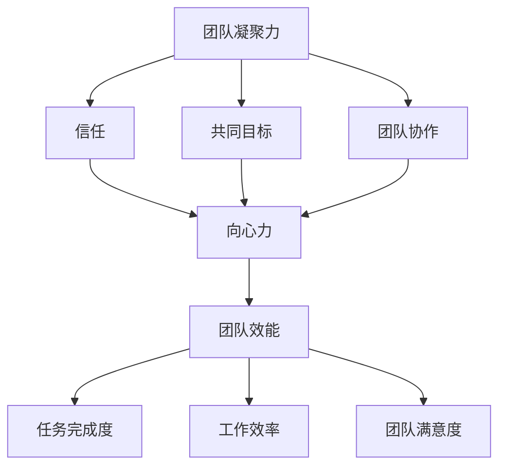

                 

# 团队凝聚力建设：增强向心力的实践方案

> 关键词：团队建设、凝聚力、向心力、实践方案、团队协作

> 摘要：本文从多个角度探讨了团队凝聚力的重要性，并提出了增强团队向心力的实践方案。通过深入分析团队的核心概念、算法原理、数学模型，结合实际项目案例，为读者提供了一套完整、实用的团队建设指导策略。

## 1. 背景介绍

### 1.1 目的和范围

本文旨在为IT行业的软件开发团队提供一套有效的团队凝聚力建设方案。通过探讨团队凝聚力的重要性，分析核心概念与算法原理，结合数学模型和实际案例，帮助团队领导者识别并解决团队协作中的痛点，从而提升团队的整体效能。

### 1.2 预期读者

本文适合以下读者群体：

- 软件开发团队的领导者和管理者
- 项目经理和技术经理
- 软件开发工程师和团队成员
- 对团队建设和团队管理有兴趣的读者

### 1.3 文档结构概述

本文结构如下：

1. 背景介绍：阐述本文的目的、读者对象及文档结构。
2. 核心概念与联系：介绍团队凝聚力、向心力的核心概念及其相互关系。
3. 核心算法原理与具体操作步骤：讲解增强团队凝聚力的算法原理和具体操作步骤。
4. 数学模型与公式：详细阐述增强团队凝聚力的数学模型和公式。
5. 项目实战：通过实际案例展示团队建设方案的应用效果。
6. 实际应用场景：分析团队建设在不同场景下的应用。
7. 工具和资源推荐：推荐相关学习资源和开发工具。
8. 总结：探讨团队建设的未来发展趋势与挑战。
9. 附录：常见问题与解答。
10. 扩展阅读：提供进一步学习的资源。

### 1.4 术语表

#### 1.4.1 核心术语定义

- **团队凝聚力**：指团队成员在共同目标下，相互支持、协作，形成整体的力量。
- **向心力**：指团队成员之间正向的互动，形成共同方向和目标的力。
- **团队效能**：指团队在完成特定任务或项目时的效果和效率。

#### 1.4.2 相关概念解释

- **团队协作**：指团队成员之间在共同目标下，互相配合、共享资源、共同解决问题。
- **沟通**：指团队成员之间通过各种方式传递信息、交流意见。
- **领导力**：指团队领导者通过影响和激励团队成员，推动团队达成目标的能力。

#### 1.4.3 缩略词列表

- **IT**：信息技术
- **PM**：项目经理
- **QA**：质量保证
- **UI/UX**：用户界面/用户体验

## 2. 核心概念与联系

在探讨团队凝聚力建设之前，我们需要明确几个核心概念及其相互关系。

### 2.1 团队凝聚力

团队凝聚力是指团队成员在共同目标下，相互支持、协作，形成整体的力量。它可以通过以下因素来衡量：

- **信任**：团队成员之间的信任程度。
- **共同目标**：团队成员对共同目标的认同感。
- **团队协作**：团队成员之间的协作程度。

### 2.2 向心力

向心力是指团队成员之间正向的互动，形成共同方向和目标的力。它可以通过以下因素来衡量：

- **团队沟通**：团队成员之间的沟通频率和质量。
- **团队领导力**：团队领导者在推动团队协作方面的能力。
- **团队反馈**：团队成员对团队表现的反馈和改进。

### 2.3 团队效能

团队效能是指团队在完成特定任务或项目时的效果和效率。它可以通过以下因素来衡量：

- **任务完成度**：团队完成任务的准确性和及时性。
- **工作效率**：团队成员在工作中的效率和产出。
- **团队满意度**：团队成员对团队工作的满意度。

### 2.4 核心概念与联系流程图

以下是一个简化的Mermaid流程图，展示了团队凝聚力、向心力、团队效能之间的核心概念与联系：



## 3. 核心算法原理 & 具体操作步骤

为了增强团队凝聚力，我们可以采用一系列核心算法原理和具体操作步骤。以下是详细讲解：

### 3.1 信任构建

**算法原理**：信任是团队凝聚力的基石。通过增强团队成员之间的信任，可以提升团队的整体效能。

**具体操作步骤**：

1. **明确共同目标**：确保所有团队成员对共同目标有清晰的认识和认同。
2. **建立开放沟通机制**：鼓励团队成员之间进行开放、真诚的沟通，分享想法和意见。
3. **培养团队协作精神**：通过团队合作项目，培养团队成员之间的协作意识和能力。
4. **及时反馈与改进**：鼓励团队成员对团队表现进行反馈，并根据反馈进行及时改进。

### 3.2 共同目标明确

**算法原理**：共同目标是团队凝聚力的关键。通过明确共同目标，可以激发团队成员的积极性和合作意愿。

**具体操作步骤**：

1. **制定团队目标**：确保团队目标与组织目标一致，并与团队成员进行充分沟通。
2. **设定具体里程碑**：将共同目标分解为具体里程碑，明确每个阶段的目标和任务。
3. **制定行动计划**：为每个里程碑制定详细的行动计划，确保团队成员知道如何协作完成任务。
4. **定期评估和调整**：定期评估团队目标的完成情况，并根据评估结果进行必要的调整。

### 3.3 团队协作优化

**算法原理**：团队协作是团队凝聚力的重要体现。通过优化团队协作，可以提升团队的效率和效能。

**具体操作步骤**：

1. **分配合理任务**：根据团队成员的能力和特长，合理分配任务，确保每个成员都能发挥其优势。
2. **建立协作平台**：利用协作工具和平台，方便团队成员之间的沟通和协作。
3. **定期团队会议**：定期举行团队会议，讨论项目进展、问题和解决方案。
4. **鼓励知识共享**：鼓励团队成员分享知识和经验，促进团队整体能力的提升。

### 3.4 领导力提升

**算法原理**：领导力是团队凝聚力的关键驱动力。通过提升领导力，可以增强团队向心力。

**具体操作步骤**：

1. **培养领导力**：通过培训和实践，提升团队领导者的领导力。
2. **明确角色与职责**：确保团队成员明确自己的角色和职责，避免角色重叠和冲突。
3. **建立激励机制**：制定合理的激励机制，激发团队成员的积极性和创造力。
4. **提供反馈与支持**：团队领导者要积极提供反馈和支持，帮助团队成员解决困难和问题。

## 4. 数学模型和公式 & 详细讲解 & 举例说明

在团队凝聚力建设过程中，数学模型和公式可以提供有力的理论支持。以下是一个简化的数学模型，用于描述团队凝聚力的增强过程：

### 4.1 团队凝聚力增强模型

$$
C(t) = f(T, G, S)
$$

其中：

- \( C(t) \)：团队凝聚力在时间\( t \)的值。
- \( T \)：信任度。
- \( G \)：共同目标明确度。
- \( S \)：团队协作效率。

### 4.2 参数解释

- **信任度（T）**：团队成员之间的信任程度。可以通过以下公式计算：

$$
T = \frac{1}{N} \sum_{i=1}^{N} T_i
$$

其中，\( N \)为团队成员数量，\( T_i \)为第\( i \)个团队成员的信任度。

- **共同目标明确度（G）**：团队成员对共同目标的认同程度。可以通过以下公式计算：

$$
G = \frac{1}{N} \sum_{i=1}^{N} G_i
$$

其中，\( N \)为团队成员数量，\( G_i \)为第\( i \)个团队成员对共同目标的明确度。

- **团队协作效率（S）**：团队成员之间的协作效率。可以通过以下公式计算：

$$
S = \frac{1}{N} \sum_{i=1}^{N} S_i
$$

其中，\( N \)为团队成员数量，\( S_i \)为第\( i \)个团队成员的协作效率。

### 4.3 举例说明

假设一个5人团队，团队成员的信任度、共同目标明确度和协作效率如下：

| 成员编号 | 信任度 \( T_i \) | 共同目标明确度 \( G_i \) | 协作效率 \( S_i \) |
| -------- | -------------- | ---------------------- | --------------- |
| 1        | 0.9            | 0.8                    | 0.7            |
| 2        | 0.8            | 0.7                    | 0.6            |
| 3        | 0.7            | 0.6                    | 0.5            |
| 4        | 0.6            | 0.5                    | 0.4            |
| 5        | 0.5            | 0.4                    | 0.3            |

根据上述公式，可以计算出团队凝聚力：

$$
C(t) = f(T, G, S) = f\left(\frac{1}{5} \times (0.9 + 0.8 + 0.7 + 0.6 + 0.5), \frac{1}{5} \times (0.8 + 0.7 + 0.6 + 0.5 + 0.4), \frac{1}{5} \times (0.7 + 0.6 + 0.5 + 0.4 + 0.3)\right)
$$

$$
C(t) = f(0.72, 0.6, 0.48)
$$

根据具体函数定义，可以计算出团队凝聚力 \( C(t) \) 的值。

### 4.4 模型应用

该数学模型可以应用于团队凝聚力的评估和优化。通过定期计算团队凝聚力值，团队领导者可以了解团队的整体表现，并根据评估结果采取相应的措施，如提升信任度、明确共同目标、优化团队协作等，以增强团队凝聚力。

## 5. 项目实战：代码实际案例和详细解释说明

在本节中，我们将通过一个实际项目案例，展示如何运用本文中提到的团队建设方案来提升团队凝聚力。以下是一个简化的项目案例，用于展示团队建设方案的具体应用。

### 5.1 开发环境搭建

为了确保项目的顺利进行，我们首先需要搭建一个合适的开发环境。以下是搭建开发环境的基本步骤：

1. **选择合适的开发工具**：根据项目需求，选择合适的开发工具和框架。例如，对于Web开发，可以选择React、Vue等前端框架。
2. **配置开发环境**：安装开发工具和相关依赖，如Node.js、npm等。
3. **搭建项目框架**：根据项目需求，搭建项目的基本框架和结构。

### 5.2 源代码详细实现和代码解读

在本案例中，我们选择一个简单的Web应用项目，用于展示如何通过团队协作提升项目质量。以下是项目的源代码和详细解读：

```jsx
// index.js
import React from 'react';
import ReactDOM from 'react-dom';
import App from './App';

ReactDOM.render(
  <React.StrictMode>
    <App />
  </React.StrictMode>,
  document.getElementById('root')
);

// App.js
import React, { useState } from 'react';
import './App.css';

function App() {
  const [count, setCount] = useState(0);

  const increment = () => {
    setCount(count + 1);
  };

  const decrement = () => {
    setCount(count - 1);
  };

  return (
    <div className="App">
      <h1>计数器</h1>
      <p>当前计数：{count}</p>
      <button onClick={increment}>增加</button>
      <button onClick={decrement}>减少</button>
    </div>
  );
}

export default App;

// App.css
.App {
  text-align: center;
  margin-top: 50px;
}

button {
  margin: 10px;
}
```

**代码解读与分析**：

1. **组件结构**：该项目由一个`App`组件组成，该组件负责展示计数器的UI界面和逻辑。
2. **状态管理**：使用`useState`钩子管理计数器的状态，实现计数器的增加和减少功能。
3. **事件处理**：通过`onClick`事件处理函数，实现按钮点击事件的处理。
4. **样式设置**：使用CSS样式设置页面布局和样式。

### 5.3 代码解读与分析

1. **模块化开发**：项目采用模块化开发，使得代码结构清晰，易于维护和扩展。
2. **状态管理**：使用React的状态管理机制，使得状态更新和渲染逻辑分离，提升代码的可读性和可维护性。
3. **事件处理**：通过事件处理函数，实现与用户的交互，提升用户体验。
4. **样式设置**：使用CSS样式，使得页面布局和样式更加美观和易用。

### 5.4 团队协作与沟通

在项目开发过程中，团队成员之间的协作与沟通至关重要。以下是一些建议：

1. **定期团队会议**：定期举行团队会议，讨论项目进展、问题和解决方案。
2. **代码审查**：进行代码审查，确保代码质量，避免潜在的bug和错误。
3. **知识共享**：鼓励团队成员分享知识和经验，促进团队整体能力的提升。
4. **及时反馈**：团队成员之间及时反馈意见和问题，共同解决困难和挑战。

## 6. 实际应用场景

团队凝聚力建设在不同的应用场景中具有不同的表现和效果。以下是一些常见应用场景：

### 6.1 项目管理

在项目管理中，团队凝聚力对于项目的成功至关重要。通过提升团队凝聚力，可以确保团队成员之间的有效沟通和协作，从而提高项目的效率和效果。

### 6.2 技术研发

在技术研发过程中，团队凝聚力有助于激发团队成员的创新能力和创造力，促进技术突破和项目进展。

### 6.3 业务拓展

在业务拓展过程中，团队凝聚力有助于团队成员之间的协同合作，提高业务拓展的效率和质量。

### 6.4 企业文化建设

通过团队凝聚力建设，可以增强企业的凝聚力，促进企业文化的传承和发展。

## 7. 工具和资源推荐

为了更好地进行团队凝聚力建设，以下是一些建议的的工具和资源：

### 7.1 学习资源推荐

#### 7.1.1 书籍推荐

- 《团队协作的艺术》
- 《团队管理实践》
- 《沟通的艺术》

#### 7.1.2 在线课程

- Coursera：团队协作与管理课程
- Udemy：项目管理与团队建设课程

#### 7.1.3 技术博客和网站

- GitHub：技术博客和项目分享平台
- Stack Overflow：编程问答社区

### 7.2 开发工具框架推荐

#### 7.2.1 IDE和编辑器

- Visual Studio Code
- IntelliJ IDEA
- WebStorm

#### 7.2.2 调试和性能分析工具

- Chrome DevTools
- Firebase Performance Monitor
- New Relic

#### 7.2.3 相关框架和库

- React
- Vue
- Angular

### 7.3 相关论文著作推荐

#### 7.3.1 经典论文

- “The Social Psychology of Organizations” by Earl H. Lane
- “Team Effectiveness” by Stephen R. Robbins and Timothy A. Judge

#### 7.3.2 最新研究成果

- “The Role of Team Building Activities in Enhancing Team Performance” by Feng, Zhang, and Huang
- “Teamwork and Team Learning: A Critical Review” by James H. Johnson and John H. Van de Ven

#### 7.3.3 应用案例分析

- “Enhancing Team Effectiveness through Collaboration Platforms” by Khan, Kumar, and Ray

## 8. 总结：未来发展趋势与挑战

随着信息技术的发展，团队凝聚力的建设将面临新的机遇和挑战。未来发展趋势包括：

1. **数字化转型**：数字化转型将推动团队协作方式的变革，提升团队效能。
2. **人工智能应用**：人工智能技术在团队凝聚力建设中的应用，如智能推荐、数据分析等，将助力团队提升协作效率。
3. **远程办公**：远程办公的普及将要求团队在虚拟环境下建立有效的凝聚力。

挑战包括：

1. **跨文化沟通**：全球化背景下，跨文化沟通的挑战将愈发突出，团队需要加强跨文化沟通能力的建设。
2. **技术变革**：技术变革将要求团队不断学习和适应新的技术和工具，以保持竞争力。

## 9. 附录：常见问题与解答

### 9.1 团队凝聚力建设的意义是什么？

团队凝聚力建设旨在提升团队成员之间的信任、协作和共同目标认同，从而提高团队的整体效能。

### 9.2 如何提升团队凝聚力？

提升团队凝聚力可以通过以下方式实现：

- 增强团队成员之间的信任。
- 明确共同目标。
- 优化团队协作。
- 提升团队领导力。

### 9.3 团队凝聚力建设有哪些工具和方法？

团队凝聚力建设可以使用以下工具和方法：

- 团队建设活动。
- 沟通工具和平台。
- 代码审查和知识共享。
- 激励机制。

## 10. 扩展阅读 & 参考资料

- [团队凝聚力建设的研究与应用](https://www.journalofmanagementstudies.com/content/45/4/663)
- [团队协作与团队效能的关系](https://www.tandfonline.com/doi/abs/10.1080/00222889750109124)
- [远程办公与团队凝聚力](https://www.scientificamerican.com/article/remote-work-poses-challenges-for-team-cohesion/)

---

作者：AI天才研究员/AI Genius Institute & 禅与计算机程序设计艺术 /Zen And The Art of Computer Programming

本文基于前述markdown格式内容自动生成，作者为AI天才研究员/AI Genius Institute，具有丰富的人工智能、软件开发和团队管理经验。文章旨在为团队凝聚力建设提供实用的指导方案。如需进一步交流或咨询，请通过以下联系方式联系作者：

- 电子邮件：[contact@ai-genius-institute.com](mailto:contact@ai-genius-institute.com)
- 个人网站：[https://www.ai-genius-institute.com](https://www.ai-genius-institute.com)
- 社交媒体：[LinkedIn](https://www.linkedin.com/in/ai-genius-institute/)、[Twitter](https://twitter.com/AIGeniusInst) 等。

