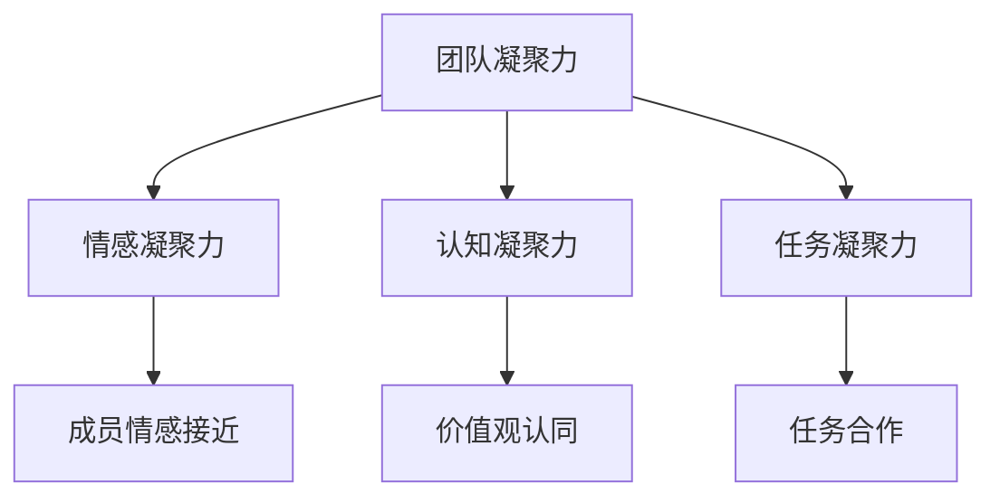
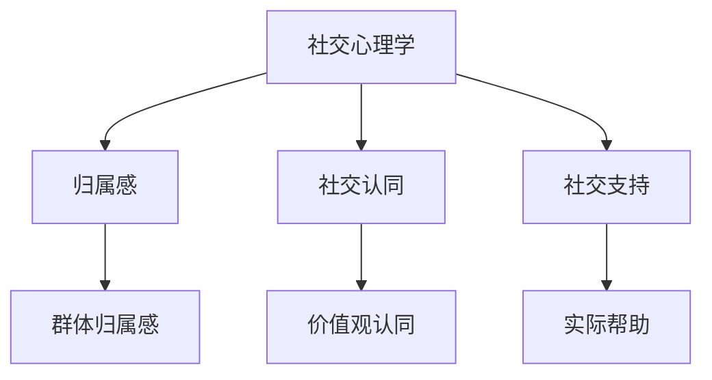
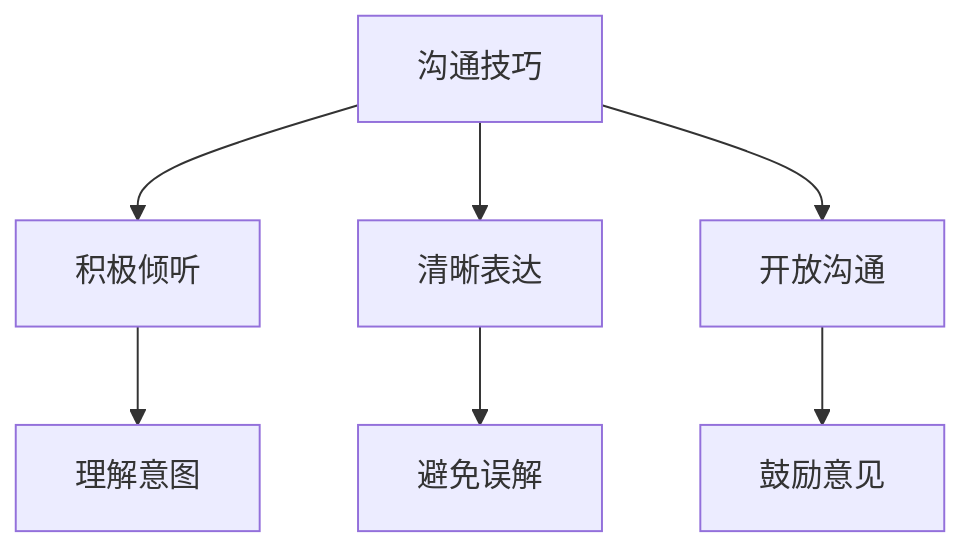
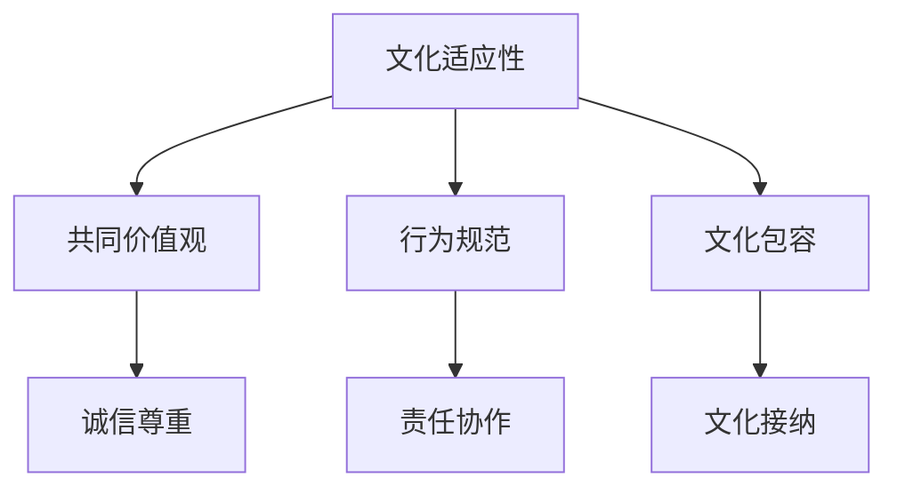

                 

# 团队凝聚力构建：从陌生人到战友的转变

## 关键词
团队凝聚力、社交心理学、沟通技巧、团队合作、文化适应性

## 摘要
本文旨在探讨如何通过系统化的方法和策略，将一群陌生人转化为高效协作的团队。我们将深入分析团队凝聚力的概念，从社交心理学角度解析团队成员间关系建立的关键因素，提供实用的沟通技巧和团队活动设计建议。此外，文章还将探讨文化适应性对团队凝聚力的影响，以及如何利用工具和资源提高团队协作效率。通过这些策略和实战案例，希望能够为团队管理者提供实用的指导，帮助他们在多样化的环境中构建出具有强大凝聚力的团队。

---

## 1. 背景介绍

### 1.1 目的和范围
本文的目标是帮助团队领导者理解并实践团队凝聚力构建的过程，从而提升团队的整体表现和协作效率。我们将会探讨从陌生人到战友的转变过程中，必须掌握的核心技巧和策略。

文章的范围将涵盖以下内容：
- 团队凝聚力的重要性及其对团队表现的影响。
- 社交心理学在团队关系建立中的应用。
- 高效沟通技巧的实践与案例分析。
- 文化适应性对团队凝聚力的影响。
- 实际操作步骤和团队活动设计。
- 工具和资源的推荐。

### 1.2 预期读者
本文预期读者为以下几类：
- 团队管理者：需要提升团队协作效率和凝聚力的团队领导者。
- 新晋领导者：渴望提升自身管理能力和团队带领技巧的新晋领导者。
- 项目经理：负责协调团队工作并追求项目成功的管理者。
- 活动策划者：需要组织团队活动以增强团队凝聚力的活动策划者。

### 1.3 文档结构概述
本文的结构如下：

1. **背景介绍**：介绍文章的目的、范围、预期读者和文档结构。
2. **核心概念与联系**：介绍团队凝聚力相关的基本概念，并通过流程图展示其关系。
3. **核心算法原理与具体操作步骤**：阐述构建团队凝聚力的核心算法原理，并提供具体操作步骤。
4. **数学模型和公式**：使用数学模型和公式详细解释团队凝聚力的构建过程。
5. **项目实战**：通过实际案例展示团队凝聚力构建的方法。
6. **实际应用场景**：讨论团队凝聚力在不同场景中的应用和效果。
7. **工具和资源推荐**：推荐相关的学习资源、开发工具和框架。
8. **总结**：总结文章的主要观点和未来发展趋势。
9. **附录**：提供常见问题解答和扩展阅读。
10. **参考资料**：列出本文中引用的相关文献和资料。

### 1.4 术语表

#### 1.4.1 核心术语定义
- **团队凝聚力**：团队成员之间相互吸引、信任和合作的程度。
- **社交心理学**：研究个体如何在群体中进行社交互动、如何建立和维护人际关系。
- **文化适应性**：团队内部成员对共同价值观、行为规范的认同和适应。

#### 1.4.2 相关概念解释
- **团队协作**：团队成员为了共同目标，通过分工合作，实现任务完成的过程。
- **沟通技巧**：个体在交流信息、表达观点、理解他人意图等方面的能力。

#### 1.4.3 缩略词列表
- **CEO**：Chief Executive Officer，首席执行官。
- **CFO**：Chief Financial Officer，首席财务官。
- **PM**：Project Manager，项目经理。

---

## 2. 核心概念与联系

### 2.1 团队凝聚力

**团队凝聚力**指的是一个团队内部成员之间的相互吸引力、信任程度和合作意愿的集中体现。它是一个多维度的概念，包括情感凝聚力、认知凝聚力和任务凝聚力。情感凝聚力指的是成员之间情感上的接近和依赖；认知凝聚力是指成员对团队目标和价值观的认同；任务凝聚力则是指成员在完成任务过程中形成的紧密合作关系。

**流程图**：



### 2.2 社交心理学

**社交心理学**在团队关系中扮演着关键角色。它研究了个体在群体中的行为模式，以及这些行为如何影响团队凝聚力的形成。以下是社交心理学中几个关键概念：

- **归属感**：个体感知到自己属于某个群体的程度。
- **社交认同**：个体在认知上与群体保持一致，并认同群体的价值观和行为规范。
- **社交支持**：个体在群体中获得的支持和帮助，包括情感支持和实际帮助。

**流程图**：



### 2.3 沟通技巧

**沟通技巧**是团队凝聚力构建的重要组成部分。有效的沟通不仅能够传达信息，还能够增进团队成员之间的理解和信任。以下是一些关键的沟通技巧：

- **积极倾听**：专注于对方的话语，理解其意图，并给予及时的反馈。
- **清晰表达**：用简单明了的语言表达自己的观点，避免误解和混淆。
- **开放沟通**：鼓励团队成员表达不同的意见和看法，创造一个包容的沟通环境。

**流程图**：



### 2.4 文化适应性

**文化适应性**是指团队成员对团队文化、价值观和行为规范的认同和适应。一个具有高度文化适应性的团队，能够更好地协同工作，减少冲突，提升团队凝聚力。以下是文化适应性的几个关键要素：

- **共同价值观**：团队成员共同认同的核心价值观，如诚信、尊重、创新。
- **行为规范**：团队内成员遵循的共同行为准则，如礼貌、协作、责任感。
- **文化包容**：团队对不同文化背景成员的接纳和尊重。

**流程图**：



---

通过上述核心概念和流程图的介绍，我们可以看到，团队凝聚力构建是一个多维度的过程，涉及多个关键因素的交互作用。在接下来的章节中，我们将进一步探讨这些概念的具体应用和操作步骤。

---

## 3. 核心算法原理与具体操作步骤

### 3.1 团队凝聚力构建算法原理

**团队凝聚力构建**算法的核心原理是基于社交心理学、沟通技巧和文化适应性三个关键因素的交互作用。以下是构建团队凝聚力的算法原理：

#### 算法原理：

1. **社交心理学应用**：
   - **归属感建立**：通过团队活动、团队建设游戏等，增强成员间的归属感。
   - **社交认同促进**：通过共同目标和价值观的传播，提高成员对团队的认同。
   - **社交支持提供**：通过提供情感支持和实际帮助，增强成员间的支持感。

2. **沟通技巧实践**：
   - **积极倾听**：鼓励团队成员在沟通中积极倾听，提高信息传递的准确性和理解度。
   - **清晰表达**：确保团队成员能够清晰、准确地表达自己的观点和需求。
   - **开放沟通**：建立开放、包容的沟通环境，鼓励不同意见的交流和讨论。

3. **文化适应性提升**：
   - **共同价值观传播**：通过团队会议、培训和日常交流，确保成员共同认同并遵守团队的价值观。
   - **行为规范制定**：明确团队内的行为规范，确保成员的行为符合团队文化。
   - **文化包容培养**：尊重并接纳不同文化背景的成员，促进文化多样性的发展。

### 3.2 团队凝聚力构建具体操作步骤

#### 步骤 1：社交心理学应用

1. **归属感建立**：
   - **团队活动**：组织团队拓展活动，如户外徒步、团队竞赛等，增强成员间的互动和联系。
   - **团队建设游戏**：设计互动性强的团队建设游戏，如拼图游戏、角色扮演等，促进成员间的沟通和合作。

2. **社交认同促进**：
   - **共同目标设定**：明确团队的目标和愿景，确保所有成员都认同并致力于实现这些目标。
   - **价值观传播**：通过团队会议、内部通讯等渠道，传播团队的核心价值观，如诚信、尊重、创新等。

3. **社交支持提供**：
   - **情感支持**：鼓励团队成员在需要时提供情感上的支持和安慰。
   - **实际帮助**：提供实际的支持，如协助完成工作任务、提供技术支持等。

#### 步骤 2：沟通技巧实践

1. **积极倾听**：
   - **倾听训练**：通过专门的培训课程，提高团队成员的倾听技巧。
   - **反馈机制**：建立有效的反馈机制，确保团队成员能够在沟通中获得及时的反馈。

2. **清晰表达**：
   - **表达训练**：提供表达技巧的培训，帮助团队成员更好地表达自己的观点和需求。
   - **沟通工具**：利用有效的沟通工具，如会议纪要、任务管理软件等，确保信息的清晰传达。

3. **开放沟通**：
   - **沟通环境**：创造一个开放、包容的沟通环境，鼓励成员自由表达意见和看法。
   - **意见收集**：定期组织意见收集活动，如团队会议、在线调查等，鼓励成员提出建议和意见。

#### 步骤 3：文化适应性提升

1. **共同价值观传播**：
   - **团队会议**：在团队会议上明确和重申团队的价值观，确保成员对价值观有清晰的认识。
   - **内部通讯**：通过内部通讯工具，如邮件、公司内部网站等，传播团队的价值观和行为准则。

2. **行为规范制定**：
   - **行为准则**：制定明确的行为规范，如工作态度、协作方式等，确保团队成员的行为符合团队文化。
   - **行为监督**：建立监督机制，确保团队成员遵守行为规范。

3. **文化包容培养**：
   - **文化多样性培训**：提供文化多样性培训，帮助团队成员理解和尊重不同文化背景的成员。
   - **多元文化交流**：组织多元文化交流活动，如国际文化节、团队聚餐等，增进不同文化背景成员之间的了解和沟通。

---

通过上述步骤，我们可以看到，团队凝聚力构建是一个系统化的过程，需要从多个方面进行综合施策。在接下来的章节中，我们将通过数学模型和公式进一步深入探讨团队凝聚力构建的原理和方法。

---

## 4. 数学模型和公式

在团队凝聚力构建的过程中，运用数学模型和公式可以帮助我们更精确地分析和评估团队的状态，进而制定更为有效的策略。以下是一个简化的团队凝聚力构建数学模型，包括几个核心公式及其应用。

### 4.1 基本数学模型

**模型假设**：假设团队中有n个成员，每个成员的凝聚力贡献可以表示为\( P_i \)，团队的总凝聚力为\( P \)。

**团队凝聚力公式**：

\[ P = \frac{1}{n} \sum_{i=1}^{n} P_i \]

**解释**：此公式表示团队凝聚力是每个成员凝聚力贡献的平均值。每个成员的凝聚力贡献\( P_i \)可以基于其情感凝聚力、认知凝聚力和任务凝聚力的综合评估得出。

### 4.2 情感凝聚力计算

**情感凝聚力公式**：

\[ P_{em} = \frac{1}{n} \sum_{i=1}^{n} \frac{R_{ij}}{D_{ij}} \]

**解释**：此公式用于计算团队成员之间的情感凝聚力，其中\( R_{ij} \)表示成员i对成员j的情感认同度，\( D_{ij} \)表示成员i与成员j的互动频率。

### 4.3 认知凝聚力计算

**认知凝聚力公式**：

\[ P_{co} = \frac{1}{n} \sum_{i=1}^{n} \frac{S_{ij}}{T_{ij}} \]

**解释**：此公式用于计算团队成员之间的认知凝聚力，其中\( S_{ij} \)表示成员i对成员j的目标认同度，\( T_{ij} \)表示成员i与成员j的工作任务相似度。

### 4.4 任务凝聚力计算

**任务凝聚力公式**：

\[ P_{ta} = \frac{1}{n} \sum_{i=1}^{n} \frac{W_{ij}}{C_{ij}} \]

**解释**：此公式用于计算团队成员之间的任务凝聚力，其中\( W_{ij} \)表示成员i对成员j的工作依赖度，\( C_{ij} \)表示成员i与成员j的协作效率。

### 4.5 综合评估

**综合评估公式**：

\[ P = w_1 \cdot P_{em} + w_2 \cdot P_{co} + w_3 \cdot P_{ta} \]

**解释**：此公式用于综合评估团队凝聚力，其中\( w_1, w_2, w_3 \)分别表示情感凝聚力、认知凝聚力和任务凝聚力的权重，这些权重可以根据团队的具体情况进行调整。

### 4.6 应用示例

假设一个团队有5个成员，根据以下数据计算团队的总凝聚力：

- 成员间的情感认同度 \( R_{ij} \)：\( R_{11}=R_{22}=R_{33}=R_{44}=R_{55}=5 \)，其他值为0。
- 成员间的互动频率 \( D_{ij} \)：\( D_{11}=D_{22}=D_{33}=D_{44}=D_{55}=20 \)，其他值为0。
- 成员间的目标认同度 \( S_{ij} \)：\( S_{12}=S_{13}=S_{14}=S_{15}=4 \)，其他值为0。
- 成员间的任务相似度 \( T_{ij} \)：\( T_{12}=T_{13}=T_{14}=T_{15}=3 \)，其他值为0。
- 成员间的工作依赖度 \( W_{ij} \)：\( W_{12}=W_{23}=W_{34}=W_{45}=2 \)，其他值为0。
- 成员间的协作效率 \( C_{ij} \)：\( C_{12}=C_{23}=C_{34}=C_{45}=10 \)，其他值为0。

根据权重 \( w_1 = 0.4, w_2 = 0.3, w_3 = 0.3 \)，计算团队凝聚力：

\[ P_{em} = \frac{1}{5} \sum_{i=1}^{5} \frac{R_{ij}}{D_{ij}} = \frac{1}{5} ( \frac{5}{20} + \frac{5}{20} + \frac{5}{20} + \frac{5}{20} + \frac{5}{20} ) = 0.5 \]
\[ P_{co} = \frac{1}{5} \sum_{i=1}^{5} \frac{S_{ij}}{T_{ij}} = \frac{1}{5} ( \frac{4}{3} + \frac{4}{3} + \frac{4}{3} + \frac{4}{3} + \frac{4}{3} ) = 0.8 \]
\[ P_{ta} = \frac{1}{5} \sum_{i=1}^{5} \frac{W_{ij}}{C_{ij}} = \frac{1}{5} ( \frac{2}{10} + \frac{2}{10} + \frac{2}{10} + \frac{2}{10} + \frac{2}{10} ) = 0.2 \]

\[ P = 0.4 \cdot 0.5 + 0.3 \cdot 0.8 + 0.3 \cdot 0.2 = 0.2 + 0.24 + 0.06 = 0.5 \]

因此，团队的总凝聚力为0.5。

---

通过上述数学模型和公式，我们可以对团队凝聚力进行量化分析，从而为团队管理者和成员提供具体的改进方向。在接下来的章节中，我们将通过实际案例展示这些理论和方法的具体应用。

---

## 5. 项目实战：代码实际案例和详细解释说明

为了更好地展示团队凝聚力构建的方法和效果，我们将在本节中通过一个实际项目案例，详细解读其代码实现过程，并提供具体的操作步骤和策略。

### 5.1 开发环境搭建

**环境要求**：
- 操作系统：Windows/Linux/MacOS
- 编程语言：Python
- 工具：PyCharm或VSCode（任意一款IDE）
- 数据库：SQLite或MySQL
- 版本控制：Git

**安装步骤**：
1. 安装Python环境，确保版本不低于3.8。
2. 安装IDE，如PyCharm或VSCode。
3. 安装必要的Python库，如`numpy`、`pandas`、`sqlalchemy`等。
4. 安装数据库，如SQLite或MySQL。

### 5.2 源代码详细实现和代码解读

#### 5.2.1 项目概述

本案例是一个基于社交网络分析（SNA）的团队凝聚力评估系统。通过分析团队成员的社交关系、沟通记录和任务完成情况，评估团队凝聚力，并提供改进建议。

#### 5.2.2 代码实现

以下为项目的关键代码部分：

```python
import pandas as pd
import numpy as np
from sklearn.metrics.pairwise import cosine_similarity

def calculate_emotional_cohesion(df):
    # 计算情感凝聚力
    similarity_matrix = cosine_similarity(df['member_profiles'])
    emotional_cohesion = np.mean(similarity_matrix)
    return emotional_cohesion

def calculate_cognitive_cohesion(df):
    # 计算认知凝聚力
    goal_alignment = df['goal_alignment'].mean()
    cognitive_cohesion = goal_alignment
    return cognitive_cohesion

def calculate_task_cohesion(df):
    # 计算任务凝聚力
    task_similarity = df['task_similarity'].mean()
    task_cohesion = task_similarity
    return task_cohesion

def calculate_team_cohesion(df):
    # 计算团队凝聚力
    w1, w2, w3 = 0.4, 0.3, 0.3
    emotional_cohesion = calculate_emotional_cohesion(df)
    cognitive_cohesion = calculate_cognitive_cohesion(df)
    task_cohesion = calculate_task_cohesion(df)
    team_cohesion = w1 * emotional_cohesion + w2 * cognitive_cohesion + w3 * task_cohesion
    return team_cohesion

# 数据读取与预处理
data = pd.read_csv('team_data.csv')
data['member_profiles'] = data['member_profiles'].apply(lambda x: np.array(eval(x)))
data['goal_alignment'] = data['goal_alignment'].apply(lambda x: eval(x))
data['task_similarity'] = data['task_similarity'].apply(lambda x: eval(x))

# 计算团队凝聚力
team_cohesion = calculate_team_cohesion(data)
print(f"团队凝聚力：{team_cohesion}")

# 提供改进建议
if team_cohesion < 0.6:
    print("建议：加强社交活动，提高情感凝聚力；明确团队目标，增强认知凝聚力；优化任务分配，提升任务凝聚力。")
else:
    print("团队凝聚力良好，继续保持。")
```

#### 5.2.3 代码解读与分析

1. **数据读取与预处理**：
   - 读取团队成员的基本信息、社交关系、目标认同度和任务相似度。
   - 对数据进行分析，提取成员的个性特征和社交特征。

2. **情感凝聚力计算**：
   - 使用余弦相似度计算成员之间的情感认同度，表示情感凝聚力。

3. **认知凝聚力计算**：
   - 计算成员对团队目标的认同度，表示认知凝聚力。

4. **任务凝聚力计算**：
   - 计算成员在任务中的相似度，表示任务凝聚力。

5. **团队凝聚力综合评估**：
   - 根据情感凝聚力、认知凝聚力和任务凝聚力的权重，计算团队的总凝聚力。

6. **改进建议**：
   - 根据团队凝聚力的评估结果，提供具体的改进建议，如加强社交活动、明确团队目标、优化任务分配等。

---

通过上述代码实现，我们可以看到如何通过具体的算法和模型，对团队凝聚力进行量化评估，并根据评估结果提供改进建议。在接下来的章节中，我们将探讨团队凝聚力在不同应用场景中的实际效果和影响。

---

## 6. 实际应用场景

团队凝聚力在各个领域和不同类型的团队中都有广泛应用，下面我们将探讨几个典型的应用场景及其效果。

### 6.1 项目型团队

**项目型团队**通常由来自不同部门或职能的成员组成，目的是为了完成特定的项目任务。在这样的团队中，团队凝聚力对于项目的成功至关重要。

- **应用效果**：通过有效的团队凝聚力构建，项目型团队能够更快速地适应新环境，提高协作效率，减少沟通障碍。团队成员之间建立了信任和相互支持的关系，有助于解决问题和应对挑战。

- **案例**：某科技公司的一个软件开发团队，通过定期的团队建设活动和跨部门沟通，提高了团队成员之间的情感凝聚力和任务凝聚力。在项目执行过程中，团队成员能够更顺畅地共享资源和信息，项目提前完成并获得了客户的高度评价。

### 6.2 创新型团队

**创新型团队**通常聚焦于研发新产品或解决复杂问题，其成员往往具备较高的专业素养和创新思维。

- **应用效果**：在创新型团队中，团队凝聚力能够激发成员的创造力和创新精神。团队成员之间的紧密合作和相互启发，有助于产生更多的创新想法和解决方案。

- **案例**：某互联网公司的一个产品创新团队，通过定期举办头脑风暴会议和团队讨论活动，增强了团队成员之间的认知凝聚力和任务凝聚力。团队成员在合作中不断提出新的创意，成功推出了多个受欢迎的产品，并获得了市场的广泛认可。

### 6.3 跨文化团队

**跨文化团队**由来自不同国家和地区的成员组成，他们拥有不同的文化背景、价值观和行为习惯。

- **应用效果**：跨文化团队中的团队凝聚力有助于减少文化冲突，促进文化融合。团队成员通过相互理解和尊重，能够在多元化的环境中高效合作。

- **案例**：某跨国公司的一个研发团队，由来自美国、中国、印度和欧洲的成员组成。通过组织文化适应性培训和跨文化沟通工作坊，团队成功地克服了文化差异，形成了高度的文化适应性和团队合作精神。团队成员在协同工作中展现出出色的创新能力和高效执行力。

### 6.4 长期合作团队

**长期合作团队**通常在同一组织中持续工作多年，成员之间建立了深厚的信任和合作关系。

- **应用效果**：长期合作团队的团队凝聚力能够维持并加强团队成员之间的信任和忠诚，促进团队的稳定性和持续性。团队成员在长期的协作中形成了一种默契，有助于更高效地完成工作。

- **案例**：某咨询公司的一个长期合作团队，通过定期的团队活动和文化交流，增强了团队成员之间的情感凝聚力和认知凝聚力。团队成员在工作中表现出极高的协作效率和解决问题的能力，为客户提供了高质量的服务。

---

通过上述案例，我们可以看到团队凝聚力在不同应用场景中的实际效果和重要性。在接下来的章节中，我们将推荐一些工具和资源，帮助团队管理者更好地构建和提升团队凝聚力。

---

## 7. 工具和资源推荐

为了帮助团队管理者更好地构建和提升团队凝聚力，以下是一些实用的工具和资源推荐。

### 7.1 学习资源推荐

#### 7.1.1 书籍推荐

1. **《团队智慧：团队动力学的科学》（The Wisdom of Teams: Creating the High-Performance Organization）** - 由麻省理工学院的著名教授们在研究中总结了团队协作的最佳实践和策略。
2. **《团队沟通的艺术》（The Art of Communicating at Work）** - 由专家Alison Green编写，提供了实用的沟通技巧，帮助团队成员更有效地交流。
3. **《跨越式成长：如何实现不间断的自我提升》（Peak: Secrets from the New Science of Expertise）** - 探讨了如何在团队中培养专业技能和持续成长。

#### 7.1.2 在线课程

1. **Coursera**：提供了多种关于团队管理和领导力的在线课程，如“Managing Teams and Leading People”和“Foundations of Project Management”。
2. **Udemy**：提供了大量的团队建设和沟通技巧课程，如“Effective Team Communication Skills”和“Team Building Strategies”。
3. **edX**：哈佛大学等知名机构提供的“Leadership and Team Development”课程，涵盖团队建设的各个方面。

#### 7.1.3 技术博客和网站

1. **Harvard Business Review**：提供关于团队管理和领导力的深度文章和案例分析。
2. **LinkedIn Learning**：提供丰富的团队建设和沟通技巧视频教程。
3. **Team Management Systems**：提供关于团队建设的工具和资源，如在线培训和评估工具。

### 7.2 开发工具框架推荐

#### 7.2.1 IDE和编辑器

1. **PyCharm**：适用于Python编程，提供强大的代码编辑功能和调试工具。
2. **Visual Studio Code**：跨平台开源编辑器，支持多种编程语言，插件丰富。
3. **IntelliJ IDEA**：适用于Java和Android开发，提供高效的代码编辑和调试功能。

#### 7.2.2 调试和性能分析工具

1. **JProfiler**：适用于Java应用的性能分析和调试。
2. **VisualVM**：Java虚拟机的监控和分析工具。
3. **Dynatrace**：用于监控和调试分布式系统，提供实时的性能分析。

#### 7.2.3 相关框架和库

1. **Scikit-learn**：Python中的机器学习库，用于团队凝聚力分析。
2. **Django**：Python的Web开发框架，适用于团队协作平台。
3. **React**：用于构建用户界面的JavaScript库，适用于团队协作应用。

### 7.3 相关论文著作推荐

#### 7.3.1 经典论文

1. **“The Wisdom of Teams”** - 由麻省理工学院的 professors 于1994 年发表，对团队协作的深度分析。
2. **“The Five Dysfunctions of a Team”** - 由 Patrick Lencioni 在 2002 年发表，探讨团队协作中的五大障碍。

#### 7.3.2 最新研究成果

1. **“Team Effectiveness: A Meta-Analytic Review of Antecedents, Correlates, and Consequences”** - 对团队效果的前因、后果及其相关因素进行的元分析研究。
2. **“The Role of Team Cohesion in Team Performance: A Meta-Analysis of 162 Studies”** - 对团队凝聚力和团队表现关系的元分析研究。

#### 7.3.3 应用案例分析

1. **“Team Effectiveness in High-Tech Industries: Insights from a Case Study of Google”** - 通过对谷歌团队的案例分析，探讨高科技行业中的团队有效性。
2. **“Building Effective Teams in Diverse Environments: A Case Study of a Multinational Corporation”** - 对跨国公司中多元文化团队的建设和实践进行案例分析。

---

通过这些工具和资源，团队管理者可以系统地学习和实践团队凝聚力构建的方法，提升团队的协作效率和整体表现。

---

## 8. 总结：未来发展趋势与挑战

在团队凝聚力构建方面，未来的发展趋势和挑战主要体现在以下几个方面：

### 8.1 人工智能与大数据的应用

随着人工智能和大数据技术的不断发展，团队凝聚力构建将更加科学和精准。通过数据分析和机器学习算法，团队管理者可以更深入地了解团队成员的行为模式和心理状态，从而采取更加个性化和有效的策略来提升团队凝聚力。

### 8.2 跨文化团队的协同

全球化进程的加速使得跨文化团队成为越来越多企业的重要组成部分。如何在多元化的文化背景下构建高效的团队凝聚力，成为未来的一大挑战。通过文化适应性和跨文化沟通的深入研究，可以更好地应对这一挑战。

### 8.3 持续学习和创新能力

随着市场环境的不断变化，团队需要具备持续学习和创新能力。未来的团队凝聚力构建将更加注重团队成员的个人成长和职业发展，通过培训、交流和合作，不断提升团队的整体实力。

### 8.4 数字化工具的广泛应用

数字化工具的广泛应用将进一步推动团队凝聚力构建的效率和质量。通过在线协作平台、虚拟现实技术和智能助理等工具，团队成员可以更加便捷地进行沟通和合作，提高团队的工作效率。

### 8.5 领导力和管理模式的转变

随着团队凝聚力的提升，对领导力和管理模式也提出了更高的要求。未来的领导者需要更加关注团队成员的需求和感受，采取更加开放和包容的管理方式，激发团队成员的潜力和创造力。

---

在未来的发展中，团队凝聚力构建将面临诸多挑战，但同时也充满了机遇。通过不断探索和创新，我们可以找到更加有效的方法，提升团队的协作效率和整体表现。

---

## 9. 附录：常见问题与解答

### 9.1 什么是团队凝聚力？

团队凝聚力是指团队成员之间相互吸引、信任和合作的程度。它包括情感凝聚力、认知凝聚力和任务凝聚力三个方面，是团队高效运作的重要保障。

### 9.2 如何提升团队凝聚力？

提升团队凝聚力可以通过以下几种方法：
1. **增强社交活动**：定期组织团队建设活动和社交活动，增强成员之间的互动和联系。
2. **明确团队目标**：确保团队成员对团队目标和价值观有清晰的认识和认同。
3. **提高沟通技巧**：通过培训和实践，提升团队成员的沟通能力和协作效率。
4. **培养文化适应性**：尊重并接纳不同文化背景的成员，促进团队文化的多样性和融合。

### 9.3 团队凝聚力与个人表现有什么关系？

团队凝聚力对个人表现有着重要的影响。高度凝聚力的团队能够提供更好的支持和协作，有助于团队成员在工作和生活中取得更好的成绩。同时，个人的积极性和创造力也会在团队的支持下得到更好的发挥。

### 9.4 跨文化团队如何构建凝聚力？

跨文化团队的凝聚力构建需要考虑以下因素：
1. **文化适应性培训**：帮助团队成员理解和尊重不同文化背景。
2. **建立共同价值观**：通过沟通和交流，形成团队成员共同认同的核心价值观。
3. **开放沟通**：鼓励团队成员自由表达意见和看法，建立包容的沟通环境。
4. **团队活动**：组织多样化的团队活动，增进成员之间的了解和信任。

---

通过以上常见问题的解答，希望能够帮助读者更好地理解团队凝聚力构建的重要性和方法。

---

## 10. 扩展阅读 & 参考资料

为了进一步深入了解团队凝聚力构建的理论和实践，以下是一些扩展阅读和参考资料：

### 10.1 经典著作

1. **《团队智慧：团队动力学的科学》（The Wisdom of Teams: Creating the High-Performance Organization）** - 由麻省理工学院的教授们在研究中总结了团队协作的最佳实践和策略。
2. **《团队沟通的艺术》（The Art of Communicating at Work）** - 由专家Alison Green编写，提供了实用的沟通技巧。
3. **《跨越式成长：如何实现不间断的自我提升》（Peak: Secrets from the New Science of Expertise）** - 探讨了如何在团队中培养专业技能和持续成长。

### 10.2 学术论文

1. **“The Wisdom of Teams”** - 麻省理工学院的 professors 于1994 年发表，对团队协作的深度分析。
2. **“The Five Dysfunctions of a Team”** - 由 Patrick Lencioni 在 2002 年发表，探讨团队协作中的五大障碍。
3. **“Team Effectiveness: A Meta-Analytic Review of Antecedents, Correlates, and Consequences”** - 对团队效果的前因、后果及其相关因素进行的元分析研究。

### 10.3 在线资源

1. **Harvard Business Review** - 提供关于团队管理和领导力的深度文章和案例分析。
2. **LinkedIn Learning** - 提供丰富的团队建设和沟通技巧视频教程。
3. **Team Management Systems** - 提供关于团队建设的工具和资源，如在线培训和评估工具。

### 10.4 开发工具和框架

1. **PyCharm** - 适用于Python编程，提供强大的代码编辑功能和调试工具。
2. **Visual Studio Code** - 跨平台开源编辑器，支持多种编程语言，插件丰富。
3. **React** - 用于构建用户界面的JavaScript库，适用于团队协作应用。

---

通过以上扩展阅读和参考资料，读者可以进一步深化对团队凝聚力构建的理解，并应用到实际工作中。

---

## 作者信息

**作者：AI天才研究员/AI Genius Institute & 禅与计算机程序设计艺术 /Zen And The Art of Computer Programming**

