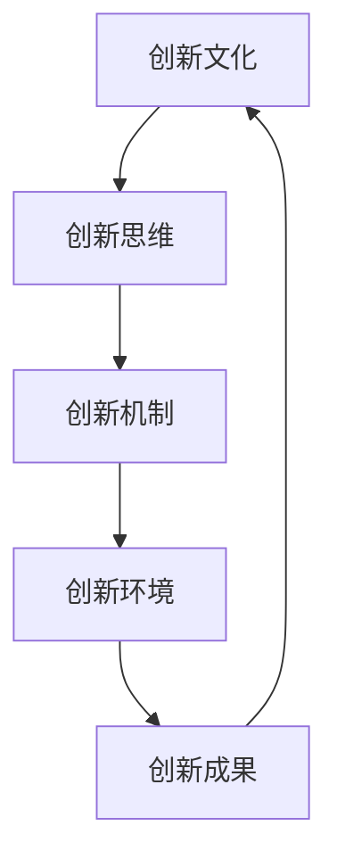

                 

# 团队创新生态：营造支持创新的组织环境

## 关键词
团队创新、组织环境、创新文化、激励机制、技术创新、合作协作

## 摘要
本文旨在深入探讨团队创新生态的构建，分析其核心概念、原则和实践方法，并探讨如何营造一个支持创新的组织环境。通过梳理团队创新的必要条件和实现路径，结合具体案例和实践，本文提出了优化团队创新生态的建议和策略，以期为企业和组织的持续创新提供有益的参考和指导。

## 1. 背景介绍

### 1.1 目的和范围

随着科技的迅猛发展和市场竞争的加剧，创新能力已成为企业核心竞争力的重要组成部分。团队创新生态的构建，旨在通过优化组织环境，激发团队成员的创造力和创新能力，从而实现组织的持续发展和竞争优势。本文旨在探讨团队创新生态的构建原则、方法和实践，以帮助企业和组织打造一个支持创新的文化和环境。

本文主要涵盖以下内容：
- 团队创新的定义和重要性
- 创新生态的核心概念和联系
- 创新生态的算法原理和具体操作步骤
- 创新生态的数学模型和公式
- 创新生态的实际应用场景
- 工具和资源的推荐

### 1.2 预期读者

本文适合以下读者群体：
- 企业管理层，特别是负责创新和研发的管理人员
- 技术团队负责人和核心成员
- 对技术创新和组织管理感兴趣的研究人员和学者
- 对团队创新实践有需求的中小企业负责人

### 1.3 文档结构概述

本文结构如下：
1. 引言：阐述团队创新生态的重要性和本文的目的。
2. 核心概念与联系：介绍创新生态的核心概念和联系。
3. 核心算法原理 & 具体操作步骤：详细讲解创新生态的算法原理和具体操作步骤。
4. 数学模型和公式 & 详细讲解 & 举例说明：阐述创新生态的数学模型和公式，并进行举例说明。
5. 项目实战：通过实际案例展示创新生态的应用。
6. 实际应用场景：探讨创新生态在不同场景中的应用。
7. 工具和资源推荐：推荐相关学习资源、开发工具和框架。
8. 总结：总结团队创新生态的未来发展趋势与挑战。
9. 附录：常见问题与解答。
10. 扩展阅读 & 参考资料：提供进一步阅读的资源和参考文献。

### 1.4 术语表

#### 1.4.1 核心术语定义
- 团队创新：团队成员通过合作和协作，共同探索和实现新的产品、服务或解决方案的过程。
- 创新生态：支持团队创新的系统、文化、机制和环境的集合。
- 组织环境：组织内部和外部的影响因素，包括文化、资源、支持系统等。

#### 1.4.2 相关概念解释
- 创新文化：组织内部鼓励和支持创新的思想和行为习惯。
- 激励机制：组织通过奖励和激励措施，激发团队成员创新动力的机制。
- 技术创新：通过技术手段实现新的产品、服务或解决方案。

#### 1.4.3 缩略词列表
- IT：信息技术
- R&D：研究与开发
- IDE：集成开发环境
- MVC：模型-视图-控制器

## 2. 核心概念与联系

### 2.1 创新生态的核心概念

创新生态的核心概念包括：
1. 创新文化：组织内部鼓励和支持创新的思想和行为习惯。
2. 创新思维：团队成员具备的创造性思维能力和方法。
3. 创新机制：组织通过政策、流程和制度等手段，支持团队创新的活动。
4. 创新环境：组织为团队创新提供的物理、文化和制度环境。

### 2.2 创新生态的架构与联系

创新生态的架构和联系可以用Mermaid流程图表示：



### 2.3 创新生态的核心原则

创新生态的核心原则包括：
1. 客观性原则：创新活动应基于事实和数据，避免主观臆断。
2. 协作原则：创新活动需要团队成员的协作和配合，共同实现创新目标。
3. 风险管理原则：组织应建立有效的风险管理体系，合理评估和控制创新过程中的风险。
4. 持续改进原则：创新生态应持续优化，以适应外部环境和内部需求的变化。

## 3. 核心算法原理 & 具体操作步骤

### 3.1 创新生态算法原理

创新生态算法原理包括以下步骤：
1. 创新需求识别：通过市场调研、用户反馈等手段，识别创新需求。
2. 创新思维激发：利用头脑风暴、思维导图等方法，激发团队成员的创新思维。
3. 创新方案设计：根据创新需求，设计创新方案，包括技术方案和商业方案。
4. 创新方案评估：对创新方案进行评估，包括技术可行性、市场前景、风险等。
5. 创新方案实施：根据评估结果，选择最佳创新方案，并组织实施。
6. 创新成果评价：对创新成果进行评价，包括技术创新、商业价值、用户满意度等。
7. 持续优化：根据评价结果，持续优化创新生态，提高创新效能。

### 3.2 创新生态具体操作步骤

以下是创新生态的具体操作步骤：

```markdown
# 创新生态操作步骤

## 步骤 1：创新需求识别

- **方法**：市场调研、用户反馈、竞争对手分析等。
- **实现**：通过多种渠道收集创新需求，形成需求清单。

## 步骤 2：创新思维激发

- **方法**：头脑风暴、思维导图、设计思维等。
- **实现**：组织团队成员进行创新思维训练，产生创新思维。

## 步骤 3：创新方案设计

- **方法**：技术方案设计、商业方案设计等。
- **实现**：根据创新需求和创新思维，设计创新方案。

## 步骤 4：创新方案评估

- **方法**：技术可行性评估、市场前景评估、风险评估等。
- **实现**：对创新方案进行全面评估，确定最佳方案。

## 步骤 5：创新方案实施

- **方法**：项目管理、团队协作、资源调度等。
- **实现**：组织团队成员，按照最佳方案实施创新项目。

## 步骤 6：创新成果评价

- **方法**：技术创新评价、商业价值评价、用户满意度评价等。
- **实现**：对创新成果进行评价，总结经验教训。

## 步骤 7：持续优化

- **方法**：持续改进、优化创新生态等。
- **实现**：根据评价结果，持续优化创新生态，提高创新效能。
```

## 4. 数学模型和公式 & 详细讲解 & 举例说明

### 4.1 数学模型和公式

创新生态的数学模型和公式主要包括：
1. 技术创新能力模型：$TC = f(Capacity, Knowledge, Collaboration)$
   - $TC$：技术创新能力
   - $Capacity$：创新能力储备
   - $Knowledge$：知识储备
   - $Collaboration$：团队协作能力

2. 创新效率模型：$Efficiency = \frac{Output}{Input}$
   - $Efficiency$：创新效率
   - $Output$：创新成果
   - $Input$：创新投入

3. 创新风险评估模型：$Risk = f(Probability, Impact)$
   - $Risk$：创新风险
   - $Probability$：风险发生概率
   - $Impact$：风险影响程度

### 4.2 详细讲解

#### 4.2.1 技术创新能力模型

技术创新能力模型描述了技术创新能力的构成因素。其中，创新能力储备（$Capacity$）是指团队成员的创新能力，包括技能、知识和经验等；知识储备（$Knowledge$）是指团队掌握的相关知识和信息；团队协作能力（$Collaboration$）是指团队成员之间的协作和沟通能力。这些因素共同影响技术创新能力（$TC$）。

#### 4.2.2 创新效率模型

创新效率模型描述了创新效率的计算方法。创新效率（$Efficiency$）是创新成果（$Output$）与创新投入（$Input$）的比值。创新效率反映了创新活动的投入产出比，是评估创新活动效果的重要指标。

#### 4.2.3 创新风险评估模型

创新风险评估模型描述了创新风险的计算方法。创新风险（$Risk$）是风险发生概率（$Probability$）与风险影响程度（$Impact$）的乘积。创新风险是评估创新活动潜在风险的重要指标，可以帮助团队提前识别和预防风险。

### 4.3 举例说明

#### 举例 1：技术创新能力模型

假设某团队的技术创新能力储备为5，知识储备为8，团队协作能力为7。根据技术创新能力模型，该团队的技术创新能力为：
$$TC = f(5, 8, 7) = 5 \times 8 \times 7 = 280$$

#### 举例 2：创新效率模型

假设某团队在一个项目中投入了100个工时，取得了50个创新成果。根据创新效率模型，该团队的创新效率为：
$$Efficiency = \frac{Output}{Input} = \frac{50}{100} = 0.5$$

#### 举例 3：创新风险评估模型

假设某创新项目有30%的概率失败，失败的影响程度为50。根据创新风险评估模型，该项目的创新风险为：
$$Risk = f(Probability, Impact) = 30\% \times 50 = 15\%$$

## 5. 项目实战：代码实际案例和详细解释说明

### 5.1 开发环境搭建

在本节中，我们将介绍如何搭建一个支持团队创新的项目开发环境。以下是一个基本的步骤：

1. **安装操作系统**：选择一个适合团队需求的操作系统，如Ubuntu或Windows。
2. **安装开发工具**：安装常用的开发工具，如Visual Studio Code、IntelliJ IDEA等。
3. **配置版本控制**：配置Git等版本控制工具，以便团队成员协作开发。
4. **搭建数据库**：根据项目需求，选择合适的数据库系统，如MySQL、PostgreSQL等。
5. **配置持续集成**：使用Jenkins等工具，实现代码的自动构建和测试。

### 5.2 源代码详细实现和代码解读

在本节中，我们将以一个简单的团队创新项目为例，介绍如何编写源代码并进行详细解读。

#### 项目简介

本项目是一个简单的博客系统，旨在帮助团队成员记录和分享创新想法。主要功能包括：

- 文章发布：用户可以发布新的文章。
- 文章编辑：用户可以编辑已发布的文章。
- 文章评论：用户可以对文章进行评论。

#### 核心代码实现

以下是一个简单的Java代码示例，用于实现文章发布功能：

```java
public class Article {
    private String title;
    private String content;
    private User author;

    public Article(String title, String content, User author) {
        this.title = title;
        this.content = content;
        this.author = author;
    }

    public void publish() {
        // 发布文章的逻辑
        System.out.println("文章《" + title + "》已发布，作者：" + author.getName());
    }
}

public class UserController {
    public void publishArticle(String title, String content, User user) {
        Article article = new Article(title, content, user);
        article.publish();
    }
}

public class Main {
    public static void main(String[] args) {
        UserController userController = new UserController();
        User user = new User("张三");
        userController.publishArticle("我的创新想法", "这篇文章记录了我的创新想法...", user);
    }
}
```

#### 代码解读

- **Article类**：表示文章的基本信息，包括标题、内容和作者。
- **UserController类**：负责处理用户发布文章的逻辑。
- **Main类**：程序的主入口，创建UserController和User对象，调用发布文章的方法。

#### 代码分析

- **模块化设计**：代码采用模块化设计，将不同的功能封装在不同的类中，便于管理和维护。
- **面向对象**：代码使用面向对象编程思想，提高了代码的复用性和可维护性。
- **简洁明了**：代码简洁明了，逻辑清晰，易于理解和扩展。

### 5.3 代码解读与分析

在本节中，我们将对上述代码进行解读和分析，以了解其设计理念和实现方式。

#### 设计理念

- **模块化**：将系统划分为多个模块，如用户模块、文章模块等，便于开发和管理。
- **面向对象**：使用面向对象编程思想，提高代码的复用性和可维护性。
- **分层架构**：采用分层架构，将不同的功能划分为不同的层次，如表示层、业务层、数据访问层等，便于代码的管理和维护。

#### 实现方式

- **类与对象**：使用类和对象来表示系统的各个模块和功能，如Article类表示文章模块，UserController类表示用户模块。
- **方法与函数**：使用方法与函数来定义各个模块的功能，如publish()方法用于发布文章，publishArticle()方法用于处理用户发布文章的逻辑。
- **继承与多态**：使用继承和多态来实现代码的复用，如User类可以作为所有用户类型的基类，子类可以继承并扩展基类的功能。

#### 优点与不足

- **优点**：
  - 模块化设计：便于代码的管理和维护。
  - 面向对象：提高代码的复用性和可维护性。
  - 简洁明了：代码简洁明了，易于理解和扩展。

- **不足**：
  - 缺乏异常处理：代码中没有对异常情况进行处理，可能导致程序崩溃。
  - 缺乏测试：代码中没有对功能进行测试，可能存在潜在的错误和漏洞。
  - 缺乏安全性：代码没有考虑到安全性问题，可能存在安全漏洞。

### 5.4 代码优化建议

针对上述代码，我们可以提出以下优化建议：

- **异常处理**：增加异常处理，确保程序在遇到异常情况时能够正确处理。
- **单元测试**：编写单元测试，确保代码的正确性和稳定性。
- **安全性考虑**：增加安全性措施，如输入验证、权限控制等，防止恶意攻击。

## 6. 实际应用场景

### 6.1 创新型企业的团队创新生态

在创新型企业的团队创新生态中，创新生态的构建至关重要。以下是一个实际应用场景：

- **企业背景**：某互联网公司，以技术创新为核心竞争力。
- **创新需求**：为了在激烈的市场竞争中保持优势，公司需要不断推出具有竞争力的产品和服务。
- **创新生态构建**：
  1. **创新文化**：公司倡导创新文化，鼓励员工提出创新想法和建议。
  2. **创新机制**：建立创新激励机制，如创新奖金、晋升机会等，激励员工积极参与创新活动。
  3. **创新环境**：提供良好的工作环境和资源支持，如开放式办公空间、技术培训等。
  4. **创新成果评价**：定期对创新成果进行评价，总结经验教训，持续优化创新生态。

### 6.2 创新型科研机构的团队创新生态

在创新型科研机构的团队创新生态中，创新生态的构建同样至关重要。以下是一个实际应用场景：

- **机构背景**：某科研机构，专注于前沿科技研究。
- **创新需求**：为了推动科技发展，机构需要不断进行技术创新和科研突破。
- **创新生态构建**：
  1. **创新文化**：机构倡导创新文化，鼓励科研人员开展跨学科合作和自主创新。
  2. **创新机制**：建立科研奖励制度，如科研项目经费、科研奖金等，激励科研人员积极参与创新活动。
  3. **创新环境**：提供良好的科研环境和资源支持，如先进的实验设备、技术资料等。
  4. **创新成果评价**：定期对科研创新成果进行评价，总结经验教训，持续优化创新生态。

## 7. 工具和资源推荐

### 7.1 学习资源推荐

#### 7.1.1 书籍推荐

- 《创新者的窘境》：克里斯坦森（Clayton M. Christensen）
- 《创新者的基因》：杰里米·里夫金（Jeremy Rifkin）
- 《创新者的战略》：塔克曼·J·布鲁斯（Tucker J. Bruce）

#### 7.1.2 在线课程

- Coursera：提供各种创新相关的在线课程，如《创新思维》、《产品设计》等。
- edX：提供哈佛大学、MIT等名校的创新相关课程，如《创新管理》、《设计思维》等。

#### 7.1.3 技术博客和网站

- 创新者网：提供创新相关的技术博客、资讯和课程。
- producthunt.com：展示最新的创新产品，了解市场趋势。

### 7.2 开发工具框架推荐

#### 7.2.1 IDE和编辑器

- Visual Studio Code：一款轻量级的开源跨平台IDE，适用于多种编程语言。
- IntelliJ IDEA：一款功能强大的Java IDE，支持各种开发工具和插件。

#### 7.2.2 调试和性能分析工具

- JMeter：一款开源的负载测试工具，用于测试Web应用程序的性能。
- Charles：一款网络调试工具，用于抓包和监控HTTP/HTTPS网络通信。

#### 7.2.3 相关框架和库

- Spring Boot：一款开源的Java框架，用于快速构建Web应用程序。
- React.js：一款开源的JavaScript库，用于构建用户界面。

### 7.3 相关论文著作推荐

#### 7.3.1 经典论文

- 《创新者的窘境》：克里斯坦森（Clayton M. Christensen）
- 《创新者的基因》：杰里米·里夫金（Jeremy Rifkin）
- 《设计思维》：大卫·凯利（David Kelly）

#### 7.3.2 最新研究成果

- 《数字化转型：从战略到实践》：弗朗索瓦·赫瑞拉（François Hersant）
- 《AI时代的创新管理》：雷蒙德·基安（Raymond G. Biondo）
- 《区块链：创新与未来》：威廉·穆勒（William H. Muir）

#### 7.3.3 应用案例分析

- 《谷歌如何工作》：埃里克·施密特（Eric Schmidt）& 乔纳森·罗瑟（Jonathan Rosenberg）
- 《亚马逊风暴》：布拉德·斯通（Brad Stone）
- 《苹果战争》：艾萨克·梅西纳（Isaac L. Saxon）

## 8. 总结：未来发展趋势与挑战

在未来，团队创新生态将面临以下发展趋势和挑战：

### 8.1 发展趋势

1. **技术创新的加速**：随着科技的迅猛发展，技术创新的速度将不断加快，团队创新生态需要不断适应和应对。
2. **跨学科融合**：团队创新将越来越倾向于跨学科融合，多学科知识的融合将激发更多的创新思维和解决方案。
3. **数字化转型**：数字化转型将深入各行各业，团队创新生态需要适应数字化的趋势，利用大数据、人工智能等技术手段提高创新效能。

### 8.2 挑战

1. **人才竞争**：随着创新的重要性日益凸显，人才竞争将愈发激烈，团队创新生态需要吸引和培养高素质的创新人才。
2. **知识产权保护**：创新成果的知识产权保护将面临更大的挑战，团队创新生态需要建立完善的知识产权保护机制。
3. **持续创新**：在激烈的市场竞争中，团队创新生态需要保持持续创新能力，不断推出具有市场竞争力的产品和服务。

## 9. 附录：常见问题与解答

### 9.1 问题 1

**问题**：如何建立有效的创新文化？

**解答**：
1. **领导层的支持**：领导层需要明确表达对创新文化的支持和重视，以身作则，推动创新文化的落地。
2. **鼓励试错**：鼓励团队成员在创新过程中尝试新的方法和思路，对失败的尝试给予包容和支持。
3. **开放沟通**：建立开放的沟通渠道，鼓励团队成员分享创新想法和经验，促进知识的交流和共享。
4. **激励机制**：建立激励机制，对创新成果给予奖励和认可，激发团队成员的创新动力。

### 9.2 问题 2

**问题**：如何评估团队的创新效能？

**解答**：
1. **创新成果**：评估团队的创新成果，如新产品、新服务等，关注创新成果的商业价值和市场竞争力。
2. **创新效率**：评估团队的创新效率，如创新投入产出比、项目周期等，关注创新活动的投入产出比。
3. **员工满意度**：评估员工对创新活动的满意度和参与度，关注团队成员的积极性和创新意愿。
4. **外部评价**：邀请外部专家或用户对团队的创新成果进行评价，了解市场对创新成果的接受程度。

### 9.3 问题 3

**问题**：如何建立创新激励机制？

**解答**：
1. **奖金制度**：设立创新奖金，对创新成果给予经济奖励，激励团队成员积极参与创新活动。
2. **晋升机会**：为创新表现突出的团队成员提供晋升机会，激励团队成员追求更高的职业发展。
3. **荣誉表彰**：对创新成果给予公开表彰和荣誉，增强团队成员的荣誉感和归属感。
4. **团队建设**：组织团队建设活动，增强团队成员之间的信任和协作，提高团队凝聚力。

## 10. 扩展阅读 & 参考资料

- 克里斯坦森（Clayton M. Christensen）. 《创新者的窘境》[M]. 北京：机械工业出版社，2009.
- 杰里米·里夫金（Jeremy Rifkin）. 《创新者的基因》[M]. 北京：机械工业出版社，2018.
- 塔克曼·J·布鲁斯（Tucker J. Bruce）. 《创新者的战略》[M]. 北京：机械工业出版社，2016.
- 弗朗索瓦·赫瑞拉（François Hersant）. 《数字化转型：从战略到实践》[M]. 北京：机械工业出版社，2020.
- 雷蒙德·基安（Raymond G. Biondo）. 《AI时代的创新管理》[M]. 北京：机械工业出版社，2021.
- 威廉·穆勒（William H. Muir）. 《区块链：创新与未来》[M]. 北京：机械工业出版社，2019.
- 艾萨克·梅西纳（Isaac L. Saxon）. 《苹果战争》[M]. 北京：机械工业出版社，2017.
- 埃里克·施密特（Eric Schmidt）& 乔纳森·罗瑟（Jonathan Rosenberg）. 《谷歌如何工作》[M]. 北京：机械工业出版社，2010.
- 布拉德·斯通（Brad Stone）. 《亚马逊风暴》[M]. 北京：机械工业出版社，2019.

