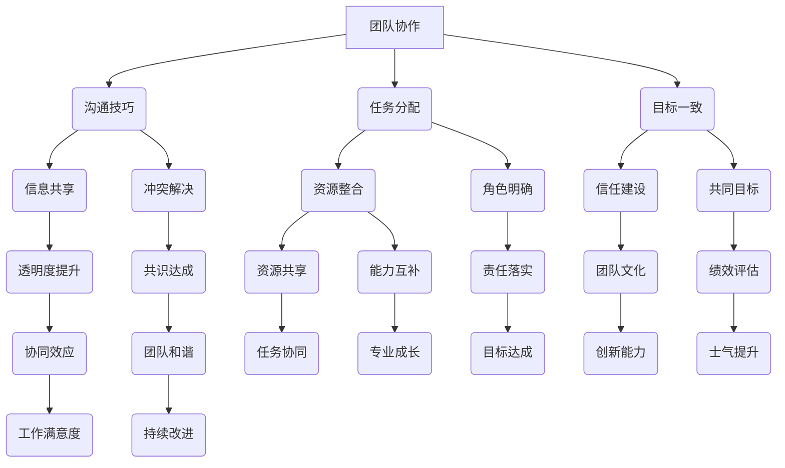

                 

# 团队协作增强：提高团队凝聚力的方法

> **关键词：** 团队协作、团队凝聚力、沟通技巧、技术方法论、案例分析

> **摘要：** 本文将深入探讨如何通过一系列具体的技术和方法论来增强团队协作，提升团队凝聚力。文章首先介绍了团队协作的重要性，然后通过核心概念、算法原理、数学模型、实战案例、实际应用场景、工具推荐和未来发展趋势等多个角度，详细阐述了一系列实用的策略和技巧。旨在为IT领域的技术团队提供一套系统的、可操作的团队协作提升方案。

## 1. 背景介绍

### 1.1 目的和范围

在当今快速发展的信息技术时代，团队协作已经成为实现项目成功的关键因素。本文的目的在于通过分析IT领域团队协作中的挑战，提出一系列具体的方法和策略，以增强团队凝聚力，提高协作效率。文章涵盖了从理论基础到实际应用的各个方面，旨在为技术团队提供一套完整的提升方案。

本文将探讨以下主要内容：

1. **核心概念与联系**：介绍团队协作和团队凝聚力的重要性，并使用Mermaid流程图展示其关键组成部分。
2. **核心算法原理与具体操作步骤**：通过伪代码详细阐述增强团队协作的算法原理。
3. **数学模型和公式**：介绍用于分析团队协作效率的数学模型，并通过具体例子进行讲解。
4. **项目实战：代码实际案例**：提供具体的代码实现和详细解读，展示如何在实际项目中应用这些方法。
5. **实际应用场景**：讨论在不同类型的项目中如何应用团队协作技巧。
6. **工具和资源推荐**：推荐学习资源和开发工具，以帮助团队更好地实施协作策略。
7. **未来发展趋势与挑战**：展望团队协作领域的发展趋势，并讨论面临的挑战。

### 1.2 预期读者

本文预期读者为：

- **IT项目经理**：希望提高团队协作效率，提升项目成功率的IT项目经理。
- **技术团队领导者**：负责团队管理和项目执行的技术团队领导者。
- **软件工程师**：希望提升团队协作能力，改善团队氛围的软件工程师。
- **企业培训师**：为IT团队提供团队协作培训的企业培训师。

通过本文的学习，读者应能够：

- 理解团队协作和团队凝聚力的重要性。
- 掌握一系列增强团队协作的具体方法。
- 在实际项目中应用这些方法和策略，提高团队效率。

### 1.3 文档结构概述

本文将按照以下结构进行撰写：

1. **背景介绍**：介绍文章的目的、预期读者和文档结构。
2. **核心概念与联系**：定义核心概念，展示关键组成部分。
3. **核心算法原理与具体操作步骤**：通过伪代码阐述算法原理。
4. **数学模型和公式**：介绍数学模型并举例说明。
5. **项目实战：代码实际案例**：提供代码实现和解读。
6. **实际应用场景**：讨论不同类型项目的协作技巧。
7. **工具和资源推荐**：推荐相关工具和资源。
8. **未来发展趋势与挑战**：展望未来趋势和挑战。
9. **附录：常见问题与解答**：解答常见问题。
10. **扩展阅读与参考资料**：提供进一步阅读的资源。

### 1.4 术语表

#### 1.4.1 核心术语定义

- **团队协作**：团队成员在共同目标下，相互配合，共同完成任务的过程。
- **团队凝聚力**：团队成员之间的紧密联系和合作意愿，是团队协作的重要保障。
- **沟通技巧**：有效传达信息和理解对方意图的能力。
- **算法原理**：解决问题的方法步骤。
- **数学模型**：用数学语言描述和解决问题的模型。

#### 1.4.2 相关概念解释

- **敏捷开发**：一种以迭代、增量为主要特点的软件开发方法，强调快速响应变化和客户需求。
- **Scrum**：一种敏捷开发框架，通过迭代和自组织的团队来快速交付高质量的产品。
- **DevOps**：一种软件开发和运维的实践方法，通过自动化和协作来缩短产品交付周期。

#### 1.4.3 缩略词列表

- **IT**：信息技术（Information Technology）
- **PM**：项目经理（Project Manager）
- **Scrum Master**：Scrum框架中的角色，负责指导团队实施Scrum方法。
- **Git**：一个分布式版本控制系统，用于代码管理和协作。

## 2. 核心概念与联系

团队协作和团队凝聚力是团队成功的关键因素。为了更好地理解这两个概念，我们可以借助Mermaid流程图来展示它们的核心组成部分和相互关系。

### 2.1 Mermaid流程图



### 2.2 流程图解析

- **团队协作（A）**：核心，贯穿整个流程。
- **沟通技巧（B）**：沟通是协作的基础，包括信息共享（E）、冲突解决（F）和透明度提升（K）。
- **任务分配（C）**：明确任务分配和角色（H），整合资源（G），确保任务协同（T）。
- **目标一致（D）**：建立共同目标（J），确保信任建设（I）和绩效评估（Q）。
- **信息共享（E）**：促进沟通和协作，提高透明度（K）。
- **冲突解决（F）**：确保团队和谐（S）和共识达成（L）。
- **资源整合（G）**：优化资源分配，提高任务协同（T）。
- **角色明确（H）**：确保责任落实（O）和目标达成（V）。
- **信任建设（I）**：建立团队文化（P），促进创新能力（W）。
- **共同目标（J）**：确保团队一致性和持续改进（Z）。
- **绩效评估（Q）**：提高士气（X）和工作满意度（Y）。
- **透明度提升（K）**：增强协同效应（R）。

通过上述Mermaid流程图，我们可以清晰地看到团队协作和团队凝聚力的核心概念及其相互关系。这些概念和关系共同构成了一个完整的团队协作体系，为团队的成功提供了坚实的基础。

## 3. 核心算法原理 & 具体操作步骤

### 3.1 算法原理概述

团队协作提升的核心算法原理是基于以下几个方面：

1. **沟通效率优化**：通过改进沟通渠道和方法，提高信息传递的速度和准确性。
2. **任务分配优化**：合理分配任务，确保每位团队成员都发挥其最大潜力。
3. **目标一致性**：建立共同目标，确保团队方向一致，提高协作效率。
4. **信任建设**：通过建立信任，增强团队成员之间的合作意愿和默契。
5. **绩效评估机制**：建立科学合理的绩效评估机制，激励团队成员持续改进。

### 3.2 伪代码实现

以下是一个简化的伪代码示例，用于展示团队协作提升算法的基本步骤：

```python
# 团队协作提升算法伪代码

# 初始化团队
team = initialize_team()

# 步骤1：沟通效率优化
communication_efficiency = optimize_communication(team)

# 步骤2：任务分配优化
task_assignment = optimize_task_distribution(team)

# 步骤3：目标一致性
goal一致性 = establish_common_goals(team)

# 步骤4：信任建设
trust = build_trust(team)

# 步骤5：绩效评估机制
performance_evaluation = set_up_performance_evaluation(team)

# 步骤6：持续迭代
while not team_success:
    # 步骤6.1：根据绩效评估结果调整团队协作策略
    team = adjust_collaboration_strategy(team, performance_evaluation)
    
    # 步骤6.2：重新评估沟通效率、任务分配和目标一致性
    communication_efficiency = optimize_communication(team)
    task_assignment = optimize_task_distribution(team)
    goal一致性 = establish_common_goals(team)
    
    # 步骤6.3：重新建设信任
    trust = build_trust(team)
    
    # 步骤6.4：重新设定绩效评估机制
    performance_evaluation = set_up_performance_evaluation(team)

    # 步骤6.5：检查团队是否达到成功标准
    team_success = check_team_success(team)

# 输出结果
output_team_success(team_success)
```

### 3.3 步骤详解

1. **沟通效率优化**：
   - **步骤1**：评估当前沟通渠道的效率和效果。
   - **步骤2**：根据评估结果，选择适合团队的沟通工具和方式，如即时通讯工具、视频会议系统等。
   - **步骤3**：定期组织沟通培训，提高团队成员的沟通技巧。

2. **任务分配优化**：
   - **步骤1**：分析团队成员的技能和兴趣，确保任务分配合理。
   - **步骤2**：使用协作工具，如项目管理软件，跟踪任务进度和分配情况。
   - **步骤3**：定期进行任务回顾，调整任务分配，以适应团队变化。

3. **目标一致性**：
   - **步骤1**：明确团队的目标，确保每个成员都了解并认同。
   - **步骤2**：定期检查团队目标与个人目标的关联性，确保目标一致。
   - **步骤3**：通过共同讨论和决策，确保团队目标得到全体成员的认同。

4. **信任建设**：
   - **步骤1**：通过透明度提升和诚信行为，建立团队成员之间的信任。
   - **步骤2**：鼓励团队成员之间的相互支持和帮助，增强团队凝聚力。
   - **步骤3**：通过绩效评估和奖励机制，激励团队成员建立信任。

5. **绩效评估机制**：
   - **步骤1**：设定科学合理的绩效评估标准，确保评估的公平性和准确性。
   - **步骤2**：定期进行绩效评估，收集反馈，并根据评估结果调整团队策略。
   - **步骤3**：通过奖励和激励措施，鼓励团队成员不断改进和提高。

通过上述算法原理和具体操作步骤，团队可以逐步提升协作效率，实现团队目标。这些步骤不是孤立存在的，而是相互关联，共同构成一个持续改进的闭环系统。

## 4. 数学模型和公式 & 详细讲解 & 举例说明

### 4.1 数学模型概述

在团队协作效率提升过程中，数学模型可以用于定量分析团队协作的各项指标，帮助团队更科学地优化协作策略。以下是一个简化的数学模型，用于描述团队协作效率。

### 4.2 模型公式

假设团队协作效率 \(E\) 受以下几个因素影响：

- \(C\)：沟通效率
- \(T\)：任务分配效率
- \(G\)：目标一致性
- \(B\)：信任度

则团队协作效率 \(E\) 可以表示为：

\[ E = C \times T \times G \times B \]

### 4.3 详细讲解

1. **沟通效率 \(C\)**：
   沟通效率反映了团队成员之间信息传递的速度和准确性。可以表示为：

   \[ C = \frac{1}{1 + d \times (1 - P)} \]

   其中，\(d\) 为延迟系数，表示信息传递的延迟时间；\(P\) 为准确度系数，表示信息传递的准确率。

2. **任务分配效率 \(T\)**：
   任务分配效率反映了任务分配的合理性和效率。可以表示为：

   \[ T = \frac{1}{1 + e \times (1 - Q)} \]

   其中，\(e\) 为错误率系数，表示任务分配的错误率；\(Q\) 为合理度系数，表示任务分配的合理性。

3. **目标一致性 \(G\)**：
   目标一致性反映了团队目标与个人目标的一致程度。可以表示为：

   \[ G = \frac{1}{1 + f \times (1 - S)} \]

   其中，\(f\) 为分歧系数，表示团队成员之间的分歧程度；\(S\) 为一致度系数，表示团队成员对目标的认同程度。

4. **信任度 \(B\)**：
   信任度反映了团队成员之间的信任程度。可以表示为：

   \[ B = \frac{1}{1 + g \times (1 - R)} \]

   其中，\(g\) 为冲突系数，表示团队成员之间的冲突程度；\(R\) 为信任度系数，表示团队成员的信任程度。

### 4.4 举例说明

假设一个团队在沟通效率方面，平均延迟时间为5分钟，信息准确率为95%；在任务分配方面，错误率为5%，任务合理度为90%；在目标一致性方面，分歧程度为10%，目标一致度为80%；在信任度方面，冲突程度为5%，信任度系数为70%。

则该团队的协作效率 \(E\) 计算如下：

\[ E = C \times T \times G \times B \]

\[ E = \frac{1}{1 + 5 \times (1 - 0.95)} \times \frac{1}{1 + 5 \times (1 - 0.90)} \times \frac{1}{1 + 10 \times (1 - 0.80)} \times \frac{1}{1 + 5 \times (1 - 0.70)} \]

\[ E = \frac{1}{1 + 5 \times 0.05} \times \frac{1}{1 + 5 \times 0.10} \times \frac{1}{1 + 10 \times 0.20} \times \frac{1}{1 + 5 \times 0.30} \]

\[ E = \frac{1}{1 + 0.25} \times \frac{1}{1 + 0.50} \times \frac{1}{1 + 2.00} \times \frac{1}{1 + 1.50} \]

\[ E = \frac{1}{1.25} \times \frac{1}{1.50} \times \frac{1}{3.00} \times \frac{1}{2.50} \]

\[ E = 0.80 \times 0.67 \times 0.33 \times 0.40 \]

\[ E = 0.044 \]

即该团队的协作效率为4.4%，说明团队协作还有很大的提升空间。

通过上述数学模型和举例说明，团队可以定量分析协作效率的各项指标，找到薄弱环节，并采取相应措施进行优化，从而提高整体协作效率。

## 5. 项目实战：代码实际案例和详细解释说明

### 5.1 开发环境搭建

为了展示团队协作提升的方法在实际项目中的应用，我们选择了一个实际的软件开发项目——一个在线购物平台。以下是在此项目中搭建开发环境的基本步骤：

1. **安装开发工具**：
   - 安装Java Development Kit (JDK)。
   - 安装Integrated Development Environment (IDE)，如IntelliJ IDEA或Eclipse。
   - 安装版本控制系统，如Git。

2. **设置项目结构**：
   - 创建项目文件夹，并在其中设置源代码目录、测试目录和文档目录。
   - 配置项目的构建工具，如Maven或Gradle，以管理项目的依赖和构建过程。

3. **配置数据库**：
   - 安装并配置关系型数据库，如MySQL或PostgreSQL。
   - 创建数据库和相应的表结构。

4. **配置服务器**：
   - 安装并配置Web服务器，如Apache Tomcat或Nginx。
   - 配置域名和SSL证书，确保网站安全。

### 5.2 源代码详细实现和代码解读

以下是该项目的一个关键模块——用户登录模块的代码实现和解读。

#### 5.2.1 代码实现

```java
// 用户登录模块

// 用户登录接口
public interface UserLoginService {
    boolean login(String username, String password);
}

// 用户登录实现类
public class UserLoginServiceImpl implements UserLoginService {
    private UserRepository userRepository;

    public UserLoginServiceImpl(UserRepository userRepository) {
        this.userRepository = userRepository;
    }

    @Override
    public boolean login(String username, String password) {
        // 步骤1：验证用户名和密码
        User user = userRepository.findByUsername(username);
        if (user == null || !user.getPassword().equals(password)) {
            return false;
        }

        // 步骤2：登录成功，生成用户会话
        Session session = new Session();
        session.setUser(user);
        SessionManager.getInstance().addSession(session);

        return true;
    }
}

// 用户会话管理类
public class SessionManager {
    private static SessionManager instance;
    private ConcurrentHashMap<String, Session> sessionMap;

    private SessionManager() {
        sessionMap = new ConcurrentHashMap<>();
    }

    public static SessionManager getInstance() {
        if (instance == null) {
            instance = new SessionManager();
        }
        return instance;
    }

    public void addSession(Session session) {
        sessionMap.put(session.getId(), session);
    }

    public Session getSession(String sessionId) {
        return sessionMap.get(sessionId);
    }
}

// 用户实体类
public class User {
    private String username;
    private String password;

    // 省略getter和setter方法
}
```

#### 5.2.2 代码解读

1. **用户登录接口（UserLoginService）**：
   - 定义了一个登录方法`login`，接受用户名和密码作为参数，用于验证用户登录。

2. **用户登录实现类（UserLoginServiceImpl）**：
   - 实现了`UserLoginService`接口，通过`userRepository`查询用户信息，验证用户名和密码。
   - 如果验证成功，创建用户会话并保存到`SessionManager`中。

3. **用户会话管理类（SessionManager）**：
   - 管理用户会话，通过线程安全的`ConcurrentHashMap`存储会话信息。
   - 提供添加和获取会话的方法。

4. **用户实体类（User）**：
   - 定义了用户的基本信息，包括用户名和密码。

### 5.3 代码解读与分析

上述代码实现了一个简单的用户登录功能，通过以下几个步骤确保用户登录的安全和可靠性：

1. **用户名和密码验证**：
   - 通过`userRepository`查询用户信息，验证用户名和密码的匹配性。
   - 如果用户信息不存在或密码错误，返回`false`。

2. **会话管理**：
   - 登录成功后，创建用户会话并保存到`SessionManager`中。
   - 会话管理类使用线程安全的`ConcurrentHashMap`来存储会话信息，确保并发访问的安全性。

3. **用户实体类设计**：
   - 用户实体类包含了用户的基本信息，如用户名和密码，为后续功能扩展提供了基础。

通过以上代码实现，团队可以有效地管理用户登录过程，提高系统的安全性和用户体验。在实际项目中，还可以进一步优化代码，如增加密码加密存储、登录失败尝试限制等安全措施。

## 6. 实际应用场景

团队协作技巧在不同类型的项目中有着广泛的应用，以下是一些常见场景和相应的协作方法：

### 6.1 软件开发项目

**挑战**：软件开发项目通常涉及复杂的需求变更和代码管理，需要团队成员具备良好的沟通能力和协作技巧。

**协作方法**：

- **敏捷开发**：采用Scrum或Kanban等敏捷开发方法，通过迭代和增量开发，确保团队能够快速响应变化。
- **版本控制**：使用Git等版本控制系统，确保代码的安全存储和版本管理。
- **代码审查**：定期进行代码审查，提高代码质量和协作效率。

### 6.2 运维项目

**挑战**：运维项目涉及服务器管理、网络监控和故障处理，需要高效的沟通和协调。

**协作方法**：

- **DevOps实践**：通过自动化工具和协作平台，实现开发和运维的无缝衔接。
- **故障管理**：建立故障管理流程，确保团队在遇到问题时能够快速响应和解决。
- **持续集成和部署**：使用CI/CD工具，如Jenkins或GitHub Actions，实现自动化测试和部署。

### 6.3 数据分析项目

**挑战**：数据分析项目通常涉及大量数据处理和复杂算法实现，需要团队成员具备数据分析和编程能力。

**协作方法**：

- **数据可视化**：使用数据可视化工具，如Tableau或PowerBI，提高团队对数据的理解和沟通。
- **数据共享**：使用共享数据仓库和数据平台，确保团队成员能够方便地访问和处理数据。
- **算法协作**：通过团队讨论和代码协作，共同设计和实现高效的数据分析算法。

### 6.4 创新项目

**挑战**：创新项目通常涉及跨领域的技术和应用，需要团队成员具备创新思维和跨学科知识。

**协作方法**：

- **头脑风暴**：定期组织头脑风暴会议，激发团队成员的创新思维。
- **跨学科协作**：邀请不同领域的专家参与项目，促进知识的交叉融合。
- **项目导师制**：为团队成员提供项目导师，帮助团队成员快速掌握新知识和技能。

通过上述协作方法，团队可以在不同类型的项目中有效应对挑战，提高项目成功率。

## 7. 工具和资源推荐

为了帮助团队更好地实施协作策略，以下推荐了一些学习资源和开发工具：

### 7.1 学习资源推荐

#### 7.1.1 书籍推荐

- **《敏捷软件开发：实践者之路》**：介绍了Scrum和Kanban等敏捷开发方法。
- **《DevOps实践指南》**：详细阐述了DevOps的原理和实践方法。
- **《团队协作技巧：高效团队的工作方法》**：提供了团队协作的各种技巧和策略。

#### 7.1.2 在线课程

- **Coursera**：提供了各种团队协作和敏捷开发相关的在线课程。
- **Udemy**：提供了丰富的软件开发和项目管理课程。
- **edX**：提供了由知名大学提供的免费在线课程，涵盖数据分析、机器学习和项目管理等领域。

#### 7.1.3 技术博客和网站

- **Atlassian Blog**：提供了关于敏捷开发、Scrum和项目管理的大量技术博客。
- **GitHub**：拥有丰富的开源项目和技术文档，可以学习到各种编程语言和开发工具的使用方法。
- **Stack Overflow**：一个开发者社区，提供编程问题和解决方案的讨论。

### 7.2 开发工具框架推荐

#### 7.2.1 IDE和编辑器

- **IntelliJ IDEA**：强大的Java和Web开发IDE。
- **Visual Studio Code**：轻量级、可扩展的代码编辑器，支持多种编程语言。
- **Eclipse**：功能丰富的Java开发IDE。

#### 7.2.2 调试和性能分析工具

- **JMeter**：用于性能测试和负载测试的开源工具。
- **Gatling**：高性能的负载测试工具。
- **Postman**：用于API测试和调试的在线工具。

#### 7.2.3 相关框架和库

- **Spring Boot**：用于快速开发独立、生产级的Spring应用。
- **Django**：用于构建快速、安全的Web应用的开源框架。
- **TensorFlow**：用于机器学习和深度学习的高性能开源库。

### 7.3 相关论文著作推荐

#### 7.3.1 经典论文

- **"Agile Software Development: Principles, Patterns, and Practices"**：由著名敏捷开发专家Jeff Sutherland撰写，介绍了敏捷开发的核心原则和实践方法。
- **"The Practice of Agile Project Management"**：由Mike Cohn撰写的敏捷项目管理经典著作。

#### 7.3.2 最新研究成果

- **"DevOps: A disruption in Search of a Cause"**：由Gene Kim等作者撰写的关于DevOps的论文，讨论了DevOps的原理和实践。
- **"Data Science for Business: Interview with Foster Provost and Tom Fawcett"**：介绍数据科学在商业应用中的研究和实践。

#### 7.3.3 应用案例分析

- **"Google's Software Engineering Best Practices"**：介绍了Google在软件开发过程中的最佳实践和经验。
- **"Netflix Engineering Culture"**：探讨了Netflix在工程文化方面的创新和成就。

通过以上工具和资源的推荐，团队可以更好地掌握团队协作和项目管理的方法，提高项目成功率。

## 8. 总结：未来发展趋势与挑战

随着信息技术的发展，团队协作在项目管理和执行中扮演着越来越重要的角色。未来，团队协作将呈现以下发展趋势：

1. **人工智能辅助协作**：人工智能技术将进一步提升团队协作的效率，通过自然语言处理、推荐系统等手段，帮助团队更智能地分配任务、管理项目和优化沟通。

2. **分布式协作**：远程工作和全球化团队的趋势将促使协作工具更加成熟和便捷，支持跨地域、跨时区的团队高效协作。

3. **数据驱动决策**：团队协作将更加依赖数据分析，通过数据洞察来优化决策过程，提高项目执行的成功率。

然而，团队协作也面临着一些挑战：

1. **技术障碍**：团队需要不断学习新技术，以适应快速变化的技术环境。

2. **文化差异**：全球化团队中的文化差异可能影响协作效果，需要通过文化融合来提高团队凝聚力。

3. **安全与隐私**：随着协作工具的普及，数据安全和隐私保护成为新的挑战，团队需要采取有效措施来确保信息的安全。

为了应对这些挑战，团队需要持续改进协作策略，加强成员之间的沟通和信任，同时利用先进的技术手段提高协作效率。未来，团队协作将继续朝着更加智能、高效、安全的方向发展。

## 9. 附录：常见问题与解答

### 9.1 团队协作常见问题

**Q1**：如何提高团队沟通效率？

**A1**：提高团队沟通效率可以从以下几个方面入手：

1. **选择合适的沟通工具**：根据团队需求和项目特点，选择适合的沟通工具，如即时通讯软件、邮件、电话会议等。
2. **建立明确的沟通机制**：制定沟通规范，明确沟通频率、内容和责任人。
3. **加强沟通技巧培训**：定期组织沟通技巧培训，提高团队成员的沟通能力。

**Q2**：如何在团队中建立信任？

**A2**：建立信任可以从以下几个方面入手：

1. **提高透明度**：在团队中保持信息的透明，让成员了解项目进展和决策过程。
2. **鼓励开放沟通**：鼓励团队成员分享想法和意见，建立开放的沟通氛围。
3. **共同承担责任**：在团队中明确责任分工，共同承担责任和成果，增强团队凝聚力。

### 9.2 项目管理常见问题

**Q1**：如何确保任务分配的合理性？

**A1**：确保任务分配的合理性可以从以下几个方面入手：

1. **评估成员能力**：了解团队成员的技能和兴趣，合理分配任务。
2. **明确任务目标和要求**：为每个任务设定明确的目标和要求，确保任务执行有据可依。
3. **定期评估任务分配效果**：根据任务完成情况和成员反馈，调整任务分配策略。

**Q2**：如何建立有效的绩效评估机制？

**A2**：建立有效的绩效评估机制可以从以下几个方面入手：

1. **设定科学的评估标准**：根据团队目标和项目要求，设定具体的评估标准和指标。
2. **定期进行绩效评估**：定期组织绩效评估会议，收集团队成员的反馈，并据此调整评估结果。
3. **结合多种评估方法**：使用多种评估方法，如自我评估、同事评估和上级评估，确保评估的全面性和公正性。

通过以上常见问题的解答，团队可以更好地解决协作中的实际问题，提高协作效率。

## 10. 扩展阅读 & 参考资料

### 10.1 扩展阅读

1. **《敏捷开发实践指南》**：Mike Cohn 著，提供了详细的敏捷开发实践方法和案例分析。
2. **《DevOps实践指南》**：J. Paul Morrison 著，介绍了DevOps的核心概念和实践方法。
3. **《团队协作技巧》**：Linda Rising 著，提供了丰富的团队协作技巧和策略。

### 10.2 参考资料

1. **Atlassian**：https://www.atlassian.com/
2. **GitHub**：https://github.com/
3. **Stack Overflow**：https://stackoverflow.com/
4. **Scrum Guide**：https://www.scrum.org/
5. **DevOps Institute**：https://devopsinstitute.com/

通过这些扩展阅读和参考资料，读者可以进一步深入了解团队协作和项目管理的相关知识，为实际工作提供有力支持。

### 作者信息

**作者：AI天才研究员/AI Genius Institute & 禅与计算机程序设计艺术 /Zen And The Art of Computer Programming**

