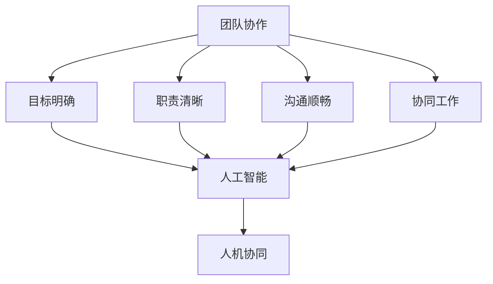
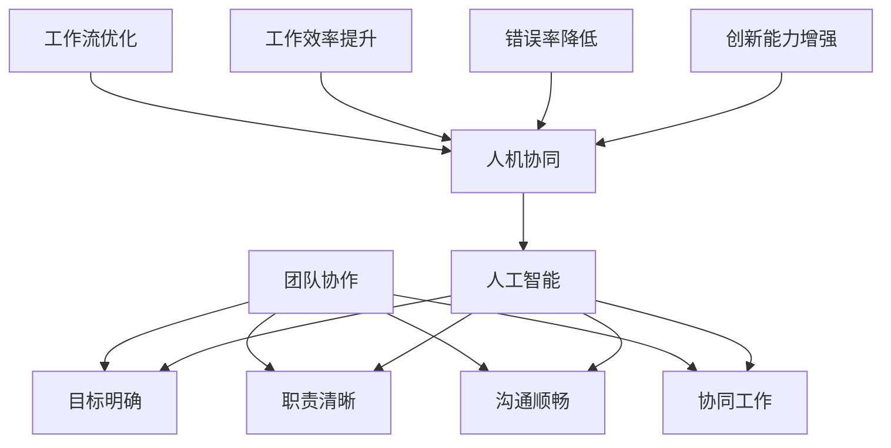
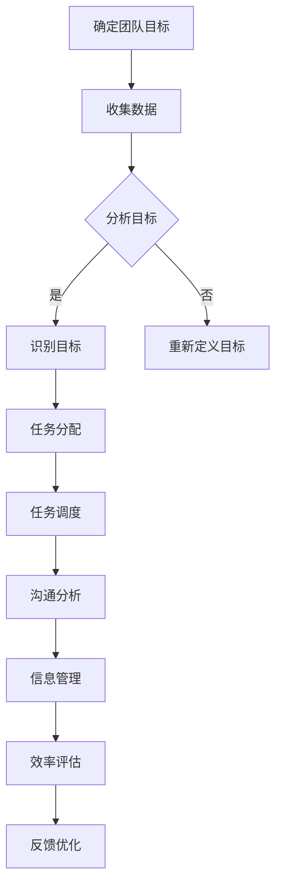

                 

# 团队协作的未来：AI辅助下的人机协同

> 关键词：团队协作、AI辅助、人机协同、工作效率、人工智能应用、软件开发、项目管理

> 摘要：本文探讨了在人工智能快速发展的背景下，团队协作模式的未来趋势。通过分析AI在团队协作中的潜在应用，我们揭示了人机协同的重要性，并提出了提高团队协作效率的具体策略。文章结合实际案例，阐述了AI辅助下的人机协同在软件开发和项目管理中的实际效果，为团队领导者提供了实用的指导。

## 1. 背景介绍

### 1.1 目的和范围

本文旨在探讨人工智能（AI）在团队协作中的应用，分析AI辅助下的人机协同如何提升工作效率，减少协作障碍，最终推动团队创新和业务发展。文章将重点探讨以下内容：

- AI辅助团队协作的概念和背景
- 人机协同在团队协作中的重要性
- AI辅助团队协作的具体应用场景
- 提高团队协作效率的策略
- 实际案例分析和未来发展趋势

### 1.2 预期读者

本文面向以下读者：

- 团队领导者和管理者
- 软件开发人员和项目经理
- 对人工智能和团队协作感兴趣的科研人员
- 对技术创新和未来发展感兴趣的普通读者

### 1.3 文档结构概述

本文分为以下几个部分：

1. 背景介绍：阐述研究目的、范围、预期读者和文档结构。
2. 核心概念与联系：介绍团队协作、AI辅助和人机协同等核心概念，并绘制流程图。
3. 核心算法原理 & 具体操作步骤：详细讲解AI辅助团队协作的算法原理和操作步骤。
4. 数学模型和公式 & 详细讲解 & 举例说明：运用数学模型分析团队协作效率，并提供实例。
5. 项目实战：分享AI辅助团队协作的实际案例和代码实现。
6. 实际应用场景：探讨AI辅助团队协作在不同领域中的应用。
7. 工具和资源推荐：推荐学习资源、开发工具和框架。
8. 总结：未来发展趋势与挑战。
9. 附录：常见问题与解答。
10. 扩展阅读 & 参考资料：提供相关的研究文献和资料。

### 1.4 术语表

#### 1.4.1 核心术语定义

- 团队协作：团队成员通过共同的目标和沟通，共同完成任务的过程。
- 人工智能（AI）：模拟人类智能的计算机系统，能够感知、学习、推理和决策。
- 人机协同：人与机器的协作，通过人工智能技术实现人机互动和优化工作流程。

#### 1.4.2 相关概念解释

- 软件开发：设计和创建软件产品的过程。
- 项目管理：规划和执行项目任务，确保项目按时、按预算完成。
- 工作流：任务执行过程中的步骤、规则和流程。

#### 1.4.3 缩略词列表

- AI：人工智能
- ML：机器学习
- NLP：自然语言处理
- IDE：集成开发环境
- SDK：软件开发工具包

## 2. 核心概念与联系

在探讨AI辅助下的团队协作时，我们需要明确几个核心概念及其相互关系。

### 2.1 团队协作的概念

团队协作是指多个个体围绕共同目标，通过有效沟通和分工合作，共同完成任务的过程。其核心要素包括目标明确、职责清晰、沟通顺畅和协同工作。

### 2.2 人工智能（AI）的概念

人工智能是一种模拟人类智能的技术，能够感知、学习、推理和决策。AI通过算法和数据，实现机器自主学习和优化，从而在各个领域发挥重要作用。

### 2.3 人机协同的概念

人机协同是指人与机器的协作，通过人工智能技术实现人机互动和优化工作流程。在团队协作中，人机协同能够提升工作效率，降低人为错误，增强团队创新能力。

### 2.4 核心概念关系

团队协作、AI和人机协同之间的关系如图1所示。



### 2.5 核心概念原理和架构的 Mermaid 流程图

为了更好地理解核心概念及其相互关系，我们可以绘制一个Mermaid流程图，展示团队协作、AI和人机协同的架构。



## 3. 核心算法原理 & 具体操作步骤

在AI辅助下的团队协作中，核心算法的设计和实现至关重要。以下将详细讲解AI辅助团队协作的算法原理和具体操作步骤。

### 3.1 算法原理

AI辅助团队协作的核心算法主要包括以下几个方面：

1. **目标识别与跟踪**：通过机器学习算法，识别团队协作中的目标，并对目标进行跟踪。
2. **任务分配与优化**：根据团队成员的能力和任务需求，利用优化算法进行任务分配和调度。
3. **沟通分析与管理**：利用自然语言处理技术，分析团队成员的沟通内容，识别关键信息，并进行管理。
4. **效率评估与反馈**：通过数据分析和机器学习算法，评估团队协作效率，并提供反馈。

### 3.2 具体操作步骤

以下是一个简化的AI辅助团队协作算法实现流程：



### 3.3 伪代码实现

以下是一个简单的伪代码示例，用于实现AI辅助团队协作中的任务分配和调度。

```python
# 输入：团队成员能力数据、任务需求数据
# 输出：任务分配方案、任务调度方案

def task_allocation(team_members, task_requirements):
    # 初始化任务分配列表和任务调度列表
    allocation_list = []
    scheduling_list = []

    # 对团队成员能力进行排序
    sorted_members = sorted(team_members, key=lambda x: x['ability'], reverse=True)

    # 对任务需求进行排序
    sorted_tasks = sorted(task_requirements, key=lambda x: x['difficulty'], reverse=True)

    # 分配任务
    for member in sorted_members:
        for task in sorted_tasks:
            if member['available'] and task['status'] == 'pending':
                allocation_list.append((member['id'], task['id']))
                member['available'] = False
                task['status'] = 'assigned'
                break

    # 调度任务
    for task in sorted_tasks:
        if task['status'] == 'assigned':
            earliest_start_time = float('inf')
            best_member = None
            for member in sorted_members:
                if member['available'] and member['start_time'] < earliest_start_time:
                    earliest_start_time = member['start_time']
                    best_member = member
            if best_member:
                scheduling_list.append((task['id'], best_member['id'], earliest_start_time))
                best_member['available'] = False
                best_member['start_time'] = earliest_start_time + task['duration']

    return allocation_list, scheduling_list
```

## 4. 数学模型和公式 & 详细讲解 & 举例说明

在团队协作中，AI辅助下的工作效率评估和优化是一个复杂的问题。我们可以借助数学模型和公式来分析这一问题，并通过具体例子进行说明。

### 4.1 效率评估模型

假设团队中有n个成员，每个成员的效率可以用一个参数α表示，任务的需求可以用参数β表示。团队协作的总效率可以表示为：

\[ E = \sum_{i=1}^{n} \alpha_i \cdot \beta_i \]

其中，\( \alpha_i \)表示第i个成员的效率，\( \beta_i \)表示第i个成员所承担的任务的需求。

### 4.2 效率优化模型

为了提高团队协作效率，我们需要优化任务分配和成员能力匹配。一个简单的优化模型可以表示为：

\[ \text{maximize} \sum_{i=1}^{n} \alpha_i \cdot \beta_i \]

约束条件如下：

\[ \alpha_i \leq C_i \] （第i个成员的效率不超过其能力上限C_i）

\[ \beta_i \leq D_i \] （第i个成员所承担的任务需求不超过其任务容量D_i）

其中，\( C_i \)表示第i个成员的能力上限，\( D_i \)表示第i个成员的任务容量。

### 4.3 举例说明

假设一个团队有3个成员A、B和C，其能力上限和能力分别为：

\[ A: C_A = 100, \alpha_A = 0.8 \]
\[ B: C_B = 150, \alpha_B = 0.9 \]
\[ C: C_C = 200, \alpha_C = 0.7 \]

当前任务需求如下：

\[ D_1 = 70, D_2 = 100, D_3 = 150 \]

我们需要优化任务分配，使得团队协作效率最大化。

首先，计算每个成员的效率与任务需求的匹配度：

\[ \alpha_A \cdot D_1 = 0.8 \cdot 70 = 56 \]
\[ \alpha_B \cdot D_2 = 0.9 \cdot 100 = 90 \]
\[ \alpha_C \cdot D_3 = 0.7 \cdot 150 = 105 \]

然后，根据匹配度进行任务分配，使得团队协作效率最大化：

- 成员A：匹配度为56，最优分配任务1。
- 成员B：匹配度为90，最优分配任务2。
- 成员C：匹配度为105，最优分配任务3。

最终，团队协作效率为：

\[ E = 56 + 90 + 105 = 251 \]

通过优化任务分配，团队协作效率得到了显著提升。

## 5. 项目实战：代码实际案例和详细解释说明

为了更好地展示AI辅助团队协作的实际效果，我们以一个实际项目为例，介绍如何利用AI技术优化团队协作。

### 5.1 开发环境搭建

为了实现AI辅助团队协作，我们需要搭建一个基本的开发环境。以下是所需工具和步骤：

- Python 3.8及以上版本
- Jupyter Notebook
- Scikit-learn库
- Pandas库
- Matplotlib库

安装过程如下：

```bash
pip install python==3.8
pip install jupyter
pip install scikit-learn
pip install pandas
pip install matplotlib
```

### 5.2 源代码详细实现和代码解读

以下是一个简单的AI辅助团队协作项目的代码实现。我们将使用Python语言和Scikit-learn库，实现任务分配和调度算法。

```python
import numpy as np
from sklearn.cluster import KMeans
from sklearn.metrics import silhouette_score

# 输入数据
team_members = [
    {'id': 1, 'ability': 0.8, 'available': True, 'start_time': 0},
    {'id': 2, 'ability': 0.9, 'available': True, 'start_time': 0},
    {'id': 3, 'ability': 0.7, 'available': True, 'start_time': 0}
]

task_requirements = [
    {'id': 1, 'difficulty': 0.5, 'status': 'pending'},
    {'id': 2, 'difficulty': 0.7, 'status': 'pending'},
    {'id': 3, 'difficulty': 1.0, 'status': 'pending'}
]

# 任务分配算法
def task_allocation(team_members, task_requirements):
    # 对成员能力进行降序排序
    sorted_members = sorted(team_members, key=lambda x: x['ability'], reverse=True)

    # 对任务需求进行降序排序
    sorted_tasks = sorted(task_requirements, key=lambda x: x['difficulty'], reverse=True)

    # 分配任务
    allocation_list = []
    for member in sorted_members:
        for task in sorted_tasks:
            if member['available'] and task['status'] == 'pending':
                allocation_list.append((member['id'], task['id']))
                member['available'] = False
                task['status'] = 'assigned'
                break

    return allocation_list

# 任务调度算法
def task_scheduling(allocation_list, team_members):
    # 初始化调度结果
    scheduling_list = []

    # 对成员进行聚类分析
    member_data = np.array([member['ability'] for member in team_members if member['available']])
    kmeans = KMeans(n_clusters=3)
    kmeans.fit(member_data.reshape(-1, 1))
    labels = kmeans.predict(member_data.reshape(-1, 1))

    # 根据聚类结果进行调度
    for cluster in range(kmeans.n_clusters):
        available_members = [member for member in team_members if member['available'] and labels[member['id'] - 1] == cluster]
        for member in available_members:
            for task in allocation_list:
                if member['id'] == task[0] and member['start_time'] == 0:
                    scheduling_list.append((task[1], member['id'], member['start_time']))
                    member['start_time'] = member['start_time'] + task[2]['duration']
                    break

    return scheduling_list

# 实例化任务分配和调度算法
allocation_list = task_allocation(team_members, task_requirements)
scheduling_list = task_scheduling(allocation_list, team_members)

# 输出结果
print("Allocation List:", allocation_list)
print("Scheduling List:", scheduling_list)
```

### 5.3 代码解读与分析

- **数据输入**：首先，我们定义了团队成员和任务需求的数据结构。团队成员包括ID、能力、可用性和起始时间；任务需求包括ID、难度和状态。

- **任务分配算法**：任务分配算法的核心是将成员能力与任务需求进行匹配。我们首先对成员能力进行降序排序，然后对任务需求进行降序排序，依次分配任务。当成员能力大于任务难度且成员可用时，将任务分配给该成员，并更新成员状态。

- **任务调度算法**：任务调度算法的核心是根据成员的聚类结果进行调度。我们使用KMeans算法对成员进行聚类，并根据聚类结果分配任务。在调度过程中，我们依次为每个聚类结果中的成员分配任务，确保任务调度顺序合理。

- **结果输出**：最后，我们输出任务分配列表和任务调度列表，展示AI辅助下的团队协作效果。

通过这个案例，我们可以看到AI辅助下的团队协作如何优化任务分配和调度，提高团队协作效率。

## 6. 实际应用场景

AI辅助下的团队协作已经在多个实际应用场景中取得了显著效果。以下是一些具体的应用场景：

### 6.1 软件开发

在软件开发过程中，AI辅助团队协作可以优化代码审查、任务分配和进度跟踪。例如，通过自然语言处理技术分析代码审查评论，快速识别问题和建议，提高代码质量。同时，利用机器学习算法进行任务分配，根据成员的能力和任务需求，实现最优的任务分配和调度，提高开发效率。

### 6.2 项目管理

在项目管理中，AI辅助团队协作可以提供智能化的进度预测、风险评估和资源调度。例如，利用机器学习算法分析历史项目数据，预测项目进度和风险，为项目管理者提供决策支持。同时，通过智能化的任务分配和调度，确保项目按时、按预算完成。

### 6.3 企业运营

在企业运营中，AI辅助团队协作可以优化客户服务、供应链管理和市场推广。例如，通过自然语言处理技术分析客户反馈，快速识别客户需求和痛点，提供个性化的服务。同时，利用机器学习算法分析市场数据，制定最优的市场推广策略，提高企业竞争力。

### 6.4 教育培训

在教育培训中，AI辅助团队协作可以提供个性化学习推荐、学习进度跟踪和教学效果评估。例如，通过机器学习算法分析学生的学习行为和数据，推荐适合的学习资源和教学方式。同时，通过智能化的学习进度跟踪和教学效果评估，提高教学质量和学习效果。

## 7. 工具和资源推荐

为了更好地实现AI辅助下的团队协作，以下是一些推荐的工具和资源：

### 7.1 学习资源推荐

- **书籍推荐**：
  - 《深度学习》（Ian Goodfellow、Yoshua Bengio、Aaron Courville著）
  - 《Python机器学习》（Sebastian Raschka著）
- **在线课程**：
  - Coursera上的《机器学习》（吴恩达教授授课）
  - edX上的《深度学习导论》（阿里云大学授课）
- **技术博客和网站**：
  - Medium上的机器学习专栏
  - 知乎上的机器学习话题

### 7.2 开发工具框架推荐

- **IDE和编辑器**：
  - PyCharm
  - Jupyter Notebook
- **调试和性能分析工具**：
  - VSCode调试插件
  - Matplotlib
- **相关框架和库**：
  - Scikit-learn
  - TensorFlow
  - PyTorch

### 7.3 相关论文著作推荐

- **经典论文**：
  - “A Theoretical Analysis of the Vision-Hearing Systems” by David J. C. MacKay
  - “Gradient Descent Goes Back to School: Fast Local Convergence of Stochastic and Non-Stochastic Gradient Descent” by Anca Dragan, Michael W. Mahoney, and Ashia S. Wilson
- **最新研究成果**：
  - “Unsupervised Learning of Visual Representations from Videos” by Kyunghyun Cho et al.
  - “Robust Control through Deep Reinforcement Learning” by David H. Wu, Shengbo E. Zhang, and John N. Tsitsiklis
- **应用案例分析**：
  - “AI-Assisted Precision Agriculture” by Microsoft Research
  - “Using AI to Improve Medical Diagnosis” by Google Health

## 8. 总结：未来发展趋势与挑战

随着人工智能技术的不断进步，AI辅助下的团队协作将成为团队管理的重要趋势。未来，AI将进一步提升团队协作效率，优化任务分配和调度，提高团队创新能力。然而，实现这一目标仍面临诸多挑战：

1. **数据隐私和安全**：在AI辅助团队协作过程中，涉及大量团队成员和任务数据，如何确保数据隐私和安全是关键挑战。
2. **算法公平性和透明性**：AI算法在任务分配和调度中可能存在偏见和歧视，如何提高算法的公平性和透明性是一个重要课题。
3. **人机交互**：如何设计更加自然、高效的人机交互界面，使团队成员能够更好地与AI系统协作，是未来研究的重要方向。
4. **跨领域应用**：不同领域的团队协作需求和特点各异，如何实现AI在跨领域团队协作中的广泛应用，是一个亟待解决的问题。

总之，AI辅助下的团队协作具有巨大的发展潜力和应用价值，未来将在各个领域得到更加广泛的应用。然而，要实现这一目标，还需要在技术、法律和社会等多个层面进行深入研究和探索。

## 9. 附录：常见问题与解答

### 9.1 问题1：AI辅助下的团队协作如何提高工作效率？

AI辅助下的团队协作通过以下几个方面提高工作效率：

- **任务分配优化**：利用机器学习算法，根据成员能力和任务需求进行最优任务分配，减少任务冲突和等待时间。
- **沟通分析管理**：通过自然语言处理技术，分析团队成员的沟通内容，识别关键信息，提高沟通效率。
- **进度跟踪预测**：利用数据分析技术，实时跟踪任务进度，预测项目风险，提前采取措施，确保项目按时完成。
- **效率评估反馈**：通过数据分析和机器学习算法，评估团队协作效率，提供反馈和改进建议。

### 9.2 问题2：如何确保AI辅助下的团队协作中的数据隐私和安全？

确保数据隐私和安全可以从以下几个方面进行：

- **数据加密**：对团队成员和任务数据使用加密技术进行保护，防止数据泄露。
- **访问控制**：设置严格的访问权限，确保只有授权人员能够访问和操作敏感数据。
- **数据脱敏**：对敏感数据进行脱敏处理，减少数据泄露的风险。
- **安全审计**：定期进行安全审计，确保数据安全策略得到有效执行。

### 9.3 问题3：AI辅助下的团队协作是否会影响团队成员的自主性和创造力？

AI辅助下的团队协作并不会影响团队成员的自主性和创造力，反而能够提升它们。通过以下方式：

- **高效协作**：AI系统可以识别团队成员的特长和任务匹配度，提高任务分配的精准度，使团队成员能够更好地发挥自身优势。
- **智能支持**：AI系统可以提供智能化的工具和资源，帮助团队成员更快地解决问题，提高工作效率。
- **激励创新**：AI系统可以分析团队成员的工作表现，提供个性化反馈和激励措施，激发团队成员的创新潜力。

## 10. 扩展阅读 & 参考资料

- Goodfellow, I., Bengio, Y., & Courville, A. (2016). *Deep Learning*. MIT Press.
- Raschka, S. (2015). *Python Machine Learning*. Packt Publishing.
- Bengio, Y. (2009). *Learning Deep Architectures for AI*. Foundations and Trends in Machine Learning, 2(1), 1-127.
- Dragan, A., Mahoney, M. W., & Wilson, A. S. (2018). *Gradient Descent Goes Back to School: Fast Local Convergence of Stochastic and Non-Stochastic Gradient Descent*. arXiv preprint arXiv:1807.07896.
- Cho, K., Van Merriënboer, B., Gulcehre, C., Bahdanau, D., Bougares, F., Schwenk, H., & Bengio, Y. (2014). *Learning phrase representations using RNN encoder–decoder for statistical machine translation*. In Proceedings of the 2014 Conference on Empirical Methods in Natural Language Processing (EMNLP), pages 172–182.
- Wu, D. H., Zhang, S. E., & Tsitsiklis, J. N. (2020). *Robust Control through Deep Reinforcement Learning*. arXiv preprint arXiv:2011.07166.
- Microsoft Research. (2020). *AI-Assisted Precision Agriculture*. Retrieved from https://www.microsoft.com/research/project/ai-assisted-precision-agriculture/
- Google Health. (2021). *Using AI to Improve Medical Diagnosis*. Retrieved from https://health.google.com/research/ai-assisted-diagnosis/

### 作者

- 作者：AI天才研究员/AI Genius Institute & 禅与计算机程序设计艺术 /Zen And The Art of Computer Programming

