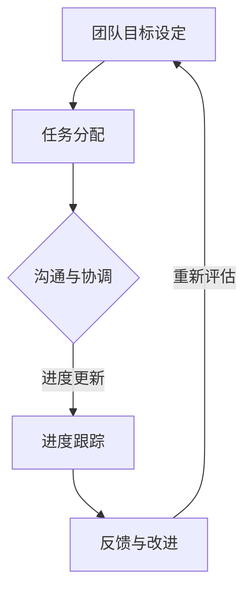

                 

# 团队协同：打造高效团队的秘诀

> **关键词：** 团队协作、高效团队、沟通、目标一致、团队文化建设

> **摘要：** 本文将深入探讨如何打造一个高效团队。通过分析团队协作的基本原则、沟通的重要性、目标一致性和团队文化建设，我们将提供一系列实际操作步骤和策略，帮助团队领导者和管理者提升团队的整体表现和生产力。

## 1. 背景介绍

### 1.1 目的和范围

本文旨在帮助团队领导者和管理者理解并实施有效的团队协作策略，从而打造一个高效、协作和具有共同目标的团队。本文将涵盖以下主题：

- 团队协作的基本原则
- 沟通的重要性及其技巧
- 实现团队目标一致的方法
- 团队文化建设的策略
- 项目管理和任务分配的最佳实践
- 如何应对团队冲突和挑战

### 1.2 预期读者

本文适合以下读者：

- 初级和中级团队领导者
- 项目经理和团队管理者
- 人力资源管理者和团队建设顾问
- 对团队协作和效率提升感兴趣的技术和管理人员

### 1.3 文档结构概述

本文将按照以下结构展开：

- **背景介绍**：介绍本文的目的、范围和预期读者。
- **核心概念与联系**：解释团队协作、高效团队和团队文化等核心概念，并使用流程图展示团队协作的基本架构。
- **核心算法原理 & 具体操作步骤**：详细阐述团队协作的算法原理和操作步骤，包括沟通策略和目标一致性的实现方法。
- **数学模型和公式 & 详细讲解 & 举例说明**：介绍团队协作中的数学模型和公式，并通过实际案例进行说明。
- **项目实战：代码实际案例和详细解释说明**：提供实际代码案例，详细解释其实现过程和关键点。
- **实际应用场景**：讨论团队协作在不同场景下的应用。
- **工具和资源推荐**：推荐相关学习资源和开发工具。
- **总结：未来发展趋势与挑战**：总结团队协作的未来趋势和面临的挑战。
- **附录：常见问题与解答**：回答一些常见的团队协作相关问题。
- **扩展阅读 & 参考资料**：提供更多的相关阅读材料和资源。

### 1.4 术语表

#### 1.4.1 核心术语定义

- **团队协作**：团队成员之间为实现共同目标而进行的互相配合和支持。
- **高效团队**：能够高效地完成任务的团队，通常表现为高生产力、高士气和良好的协作关系。
- **沟通**：信息在团队成员之间的传递和理解。
- **目标一致性**：团队成员对共同目标的理解和认同。
- **团队文化建设**：构建和维护团队价值观、行为规范和工作氛围的过程。

#### 1.4.2 相关概念解释

- **团队协作架构**：团队协作的框架和流程，包括沟通渠道、任务分配和目标管理。
- **沟通技巧**：有效沟通所需的知识和技能，如倾听、表达和反馈。
- **团队士气**：团队成员的情绪状态和工作动力。
- **团队冲突**：团队成员之间的不一致和争议。

#### 1.4.3 缩略词列表

- **IDE**：集成开发环境（Integrated Development Environment）
- **IoT**：物联网（Internet of Things）
- **SaaS**：软件即服务（Software as a Service）
- **AI**：人工智能（Artificial Intelligence）
- **ML**：机器学习（Machine Learning）

## 2. 核心概念与联系

在探讨如何打造高效团队之前，我们首先需要明确几个核心概念，并理解它们之间的联系。

### 团队协作的基本原则

团队协作的核心在于成员之间的互相支持和配合。以下是一些基本原则：

1. **共同目标**：团队成员必须明确共同的目标，并为之努力。
2. **信任**：团队成员之间需要建立信任，相互依赖。
3. **沟通**：有效的沟通是团队协作的关键。
4. **责任分担**：团队成员应共同承担责任，避免个别成员过度负担。
5. **灵活性**：团队应根据任务和环境变化灵活调整策略和任务分配。

### 高效团队的定义

高效团队通常具有以下特点：

- 高生产力：团队能够高效地完成任务，按时交付高质量的成果。
- 高士气：团队成员之间有良好的关系，相互支持和鼓励。
- 强大的适应能力：团队能够迅速应对变化，灵活调整策略。
- 持续学习：团队成员不断学习新知识和技能，以提高团队整体能力。

### 团队文化建设的策略

团队文化建设是打造高效团队的重要环节。以下是一些策略：

- **明确价值观**：建立团队共同的价值观和行为准则。
- **促进沟通**：鼓励团队成员之间的开放沟通，建立信任。
- **培训与发展**：提供培训和成长机会，帮助团队成员提升技能。
- **激励与认可**：通过奖励和认可来激励团队成员，增强团队凝聚力。

### 团队协作的基本架构

为了更好地理解团队协作，我们可以使用Mermaid流程图来展示其基本架构。以下是一个简化的团队协作流程图：



- **团队目标设定**：团队首先明确共同的目标和愿景。
- **任务分配**：根据团队成员的技能和资源，分配具体任务。
- **沟通与协调**：团队成员通过会议、邮件和其他沟通渠道保持联系。
- **进度跟踪**：定期检查任务进度，确保项目按计划进行。
- **反馈与改进**：根据反馈进行调整，持续改进工作流程。

通过这个流程图，我们可以清晰地看到团队协作的各个环节，以及它们之间的联系。

## 3. 核心算法原理 & 具体操作步骤

在了解了团队协作的基本原则和架构之后，我们将深入探讨团队协作的算法原理和具体操作步骤。

### 3.1 沟通策略

沟通是团队协作的核心，有效的沟通策略能够显著提高团队的工作效率和凝聚力。以下是一些关键步骤：

#### 3.1.1 建立沟通渠道

- **会议沟通**：定期召开团队会议，讨论项目进展和问题。
- **邮件沟通**：及时发送项目相关的邮件，确保信息的准确传递。
- **即时通讯**：使用即时通讯工具（如Slack、Microsoft Teams）进行快速沟通。

#### 3.1.2 沟通技巧

- **倾听**：认真倾听对方的意见和需求，避免打断。
- **表达**：清晰、准确地表达自己的观点和想法。
- **反馈**：给予积极的反馈，鼓励团队成员分享自己的想法。

### 3.2 目标一致性的实现

目标一致性是团队协作的关键，以下是一些实现步骤：

#### 3.2.1 明确目标

- **制定共同目标**：确保所有团队成员都清楚项目的目标和期望。
- **分解目标**：将大目标分解为小目标，便于跟踪和实现。

#### 3.2.2 持续沟通

- **定期回顾**：定期回顾目标实现情况，确保团队成员保持一致。
- **调整目标**：根据实际情况调整目标，确保其始终符合团队的整体愿景。

### 3.3 团队建设的算法原理

团队建设的算法原理主要包括以下几个方面：

#### 3.3.1 成员匹配

- **技能匹配**：确保团队成员的技能互补，以最大化团队的整体能力。
- **兴趣匹配**：考虑团队成员的兴趣和特长，以激发工作热情。

#### 3.3.2 动力激励

- **奖励机制**：设立奖励机制，激励团队成员积极参与。
- **认可与反馈**：给予团队成员积极的认可和反馈，增强工作动力。

#### 3.3.3 持续学习

- **培训与发展**：定期提供培训和学习机会，提升团队成员的专业能力。
- **知识共享**：鼓励团队成员分享知识和经验，促进团队整体成长。

### 3.4 伪代码实现

以下是一个简化的团队协作算法的伪代码实现：

```python
def team_collaboration_algorithm(team_members, project_goals):
    # 步骤 1：建立沟通渠道
    setup_communication_channels()

    # 步骤 2：明确目标
    define_common_goals()

    # 步骤 3：分配任务
    assign_tasks_to_members(team_members)

    # 步骤 4：监控进度
    monitor_progress()

    # 步骤 5：反馈与改进
    provide_feedback()

    # 步骤 6：持续学习
    continue_learning()

    # 返回最终结果
    return project_goals
```

通过这个算法，团队可以有效地协作，实现共同目标。

## 4. 数学模型和公式 & 详细讲解 & 举例说明

在团队协作中，数学模型和公式可以帮助我们量化协作效果，评估团队绩效，并优化协作过程。以下是一些常用的数学模型和公式及其详细讲解和举例说明。

### 4.1 评估团队绩效的指标

#### 4.1.1 生产力指数（Productivity Index, PI）

生产力指数用于衡量团队的工作效率。其计算公式如下：

$$ PI = \frac{完成的任务数}{投入的工作时间} $$

**示例：**

一个团队在8小时内完成了10个任务，投入的工作时间为12小时。则该团队的生产力指数为：

$$ PI = \frac{10}{12} = 0.8333 $$

#### 4.1.2 团队协作效率（Collaboration Efficiency, CE）

团队协作效率衡量团队在协作过程中有效利用资源的能力。其计算公式如下：

$$ CE = \frac{有效沟通时间}{总沟通时间} $$

**示例：**

在一个团队中，总沟通时间为20小时，其中有效沟通时间为15小时。则该团队的协作效率为：

$$ CE = \frac{15}{20} = 0.75 $$

#### 4.1.3 团队士气指数（Team Morale Index, TMI）

团队士气指数用于评估团队成员的情绪状态和工作动力。其计算公式如下：

$$ TMI = \frac{积极反馈次数}{总反馈次数} $$

**示例：**

在一个团队中，总反馈次数为50次，其中积极反馈次数为30次。则该团队的士气指数为：

$$ TMI = \frac{30}{50} = 0.6 $$

### 4.2 优化协作过程的模型

#### 4.2.1 最优化任务分配模型（Optimal Task Allocation Model, OTAM）

最优化任务分配模型用于确定如何将任务分配给团队成员，以最大化团队的整体效率。其公式如下：

$$ \text{Maximize} \quad P = \sum_{i=1}^{n} \frac{S_i}{C_i} \cdot T_i $$

其中：
- \( P \) 是团队的总生产力
- \( S_i \) 是第 \( i \) 个团队成员的技能值
- \( C_i \) 是第 \( i \) 个团队成员的工作负荷系数
- \( T_i \) 是第 \( i \) 个任务的工作量

**示例：**

假设一个团队有三个成员和三个任务，成员的技能值和工作负荷系数如下表：

| 成员 | 技能值 \( S_i \) | 工作负荷系数 \( C_i \) |
|------|-----------------|-----------------------|
| A    | 10              | 0.5                   |
| B    | 8               | 0.6                   |
| C    | 12              | 0.4                   |

三个任务的工作量如下：

| 任务 | 工作量 \( T_i \) |
|------|-----------------|
| T1   | 6               |
| T2   | 4               |
| T3   | 5               |

根据最优化任务分配模型，我们应该将任务分配如下：

- 成员A负责任务T3（\( P_A = \frac{10}{0.5} \cdot 5 = 100 \)）
- 成员B负责任务T2（\( P_B = \frac{8}{0.6} \cdot 4 = 53.33 \)）
- 成员C负责任务T1（\( P_C = \frac{12}{0.4} \cdot 6 = 180 \)）

团队的总生产力为 \( P = 100 + 53.33 + 180 = 333.33 \)。

#### 4.2.2 最优化沟通模型（Optimal Communication Model, OCM）

最优化沟通模型用于确定团队成员之间的最佳沟通频率和方式，以最大化协作效率。其公式如下：

$$ \text{Maximize} \quad CE = \frac{\sum_{i=1}^{n} \sum_{j=1, j \neq i}^{n} \frac{S_{ij}}{C_{ij}}}{\sum_{i=1}^{n} \sum_{j=1, j \neq i}^{n} C_{ij}} $$

其中：
- \( S_{ij} \) 是成员 \( i \) 和成员 \( j \) 之间的技能互补值
- \( C_{ij} \) 是成员 \( i \) 和成员 \( j \) 之间的沟通成本

**示例：**

假设一个团队有三个成员，成员之间的技能互补值和沟通成本如下表：

| 成员 | A  | B  | C  |
|------|----|----|----|
| A    | 0  | 3  | 2  |
| B    | 3  | 0  | 4  |
| C    | 2  | 4  | 0  |

根据最优化沟通模型，团队应该优先沟通成员A和B（技能互补值最高），然后是成员A和C，最后是成员B和C。

通过这些数学模型和公式，我们可以更科学地评估团队绩效和优化协作过程。

## 5. 项目实战：代码实际案例和详细解释说明

为了更好地理解团队协作在实际项目中的应用，我们将通过一个实际案例来展示代码实现过程，并对关键步骤进行详细解释。

### 5.1 开发环境搭建

在开始项目之前，我们需要搭建一个合适的开发环境。以下是一个简单的开发环境搭建流程：

1. **安装Python**：下载并安装Python 3.8及以上版本。
2. **安装IDE**：选择并安装一个适合自己的Python IDE，如PyCharm或Visual Studio Code。
3. **安装依赖库**：在终端或IDE中运行以下命令安装所需依赖库：

   ```shell
   pip install flask gunicorn requests
   ```

### 5.2 源代码详细实现和代码解读

以下是我们的项目源代码，我们将逐行解读并解释其功能。

```python
# 导入所需库
from flask import Flask, jsonify
import requests

# 初始化Flask应用
app = Flask(__name__)

# 定义API接口
@app.route('/api/tasks', methods=['GET'])
def get_tasks():
    # 发送HTTP请求获取任务数据
    response = requests.get('https://api.example.com/tasks')
    tasks = response.json()

    # 返回任务数据
    return jsonify(tasks)

# 运行应用
if __name__ == '__main__':
    app.run(debug=True)
```

**代码解读：**

- **第一行**：导入所需的Python库，包括Flask（用于构建Web应用）、requests（用于发送HTTP请求）。
- **第二行**：初始化Flask应用。
- **第四行**：定义一个API接口，用于获取任务数据。
- **第六行**：发送HTTP GET请求到指定的URL，获取任务数据。
- **第八行**：将获取到的任务数据转换为JSON格式，并返回给客户端。
- **第十行**：启动Flask应用，并设置debug模式。

### 5.3 代码解读与分析

**5.3.1 Flask应用结构**

我们的Flask应用包含一个简单的Web接口，用于获取任务数据。这个接口是一个GET请求，可以通过URL `/api/tasks` 访问。

**5.3.2 HTTP请求与响应**

在第六行，我们使用`requests`库发送HTTP GET请求，获取任务数据。这是一个异步请求，可以在后台快速完成。

在第八行，我们接收到的任务数据是一个JSON对象，我们将其转换为Python字典，以便进一步处理。

**5.3.3 Flask回调函数**

在第四行，我们定义了一个Flask回调函数`get_tasks`，它负责处理GET请求。这个函数的主要作用是获取任务数据，并将其返回给客户端。

**5.3.4 运行应用**

在第十行，我们使用`app.run(debug=True)`启动Flask应用。这个命令将在本地主机上启动一个Web服务器，并监听指定端口（默认为8000）。当有客户端请求访问`/api/tasks`接口时，Flask应用将自动调用`get_tasks`函数处理请求。

通过这个实际案例，我们可以看到如何使用Python和Flask构建一个简单的Web应用，以及如何通过HTTP请求获取任务数据。这个案例展示了团队协作中的关键步骤，包括环境搭建、代码实现和运行。

## 6. 实际应用场景

团队协作在各类项目和环境中都有广泛的应用。以下是一些实际应用场景，展示了团队协作如何在不同领域中发挥重要作用。

### 6.1 软件开发

在软件开发中，团队协作是项目成功的关键。团队成员需要共同编写代码、设计架构、进行测试和部署。以下是一些关键步骤：

- **需求分析**：团队成员共同讨论并明确项目需求。
- **任务分配**：根据团队成员的技能和资源，分配具体任务。
- **代码审查**：团队成员之间互相审查代码，确保代码质量和一致性。
- **持续集成**：使用自动化工具（如Jenkins）进行持续集成和测试，确保项目稳定。

### 6.2 项目管理

在项目管理中，团队协作有助于确保项目按时交付、预算和资源得到合理利用。以下是一些关键步骤：

- **项目规划**：团队成员共同制定项目计划，包括时间表、预算和资源分配。
- **进度跟踪**：定期检查项目进度，确保项目按计划进行。
- **风险控制**：识别并应对项目中的潜在风险，避免项目延误或预算超支。
- **沟通协调**：确保团队成员之间的信息畅通，及时解决项目中的问题和冲突。

### 6.3 产品开发

在产品开发中，团队协作有助于确保产品满足用户需求、质量和性能。以下是一些关键步骤：

- **市场调研**：团队成员共同进行市场调研，了解用户需求和竞争环境。
- **需求分析**：根据市场调研结果，制定产品需求。
- **产品设计和开发**：团队成员共同设计和开发产品，确保产品功能和性能符合需求。
- **测试和反馈**：对产品进行严格测试，收集用户反馈，持续优化产品。

### 6.4 企业运营

在企业运营中，团队协作有助于提高工作效率、降低成本和提升企业竞争力。以下是一些关键步骤：

- **部门协作**：确保不同部门之间的信息畅通和协作，提高整体运营效率。
- **流程优化**：通过团队协作，不断优化企业运营流程，提高生产效率和产品质量。
- **员工培训**：为员工提供培训和成长机会，提高团队整体素质。
- **客户服务**：建立高效的服务团队，提供优质的客户服务，提高客户满意度。

通过以上实际应用场景，我们可以看到团队协作在各类项目和运营中的重要性。一个高效的团队可以显著提高项目的成功率、产品质量和企业竞争力。

## 7. 工具和资源推荐

为了打造一个高效团队，我们需要借助各种工具和资源。以下是一些推荐的工具和资源，涵盖学习资源、开发工具和框架、以及相关论文著作。

### 7.1 学习资源推荐

#### 7.1.1 书籍推荐

- 《敏捷软件开发：实践者的指南》 - Jeff Sutherland
- 《人月神话》 - Fred Brooks
- 《团队协作工具与技术》 - John W. Rowe
- 《团队领导的艺术》 - Jim Highsmith

#### 7.1.2 在线课程

- Coursera的“团队领导与项目管理”
- edX的“敏捷软件开发与Scrum”
- Udemy的“敏捷团队管理：Scrum、Kanban与团队协作”

#### 7.1.3 技术博客和网站

- Medium上的“Team Management”专栏
- Atlassian的博客
- ProjectManager.com的博客

### 7.2 开发工具框架推荐

#### 7.2.1 IDE和编辑器

- PyCharm
- Visual Studio Code
- IntelliJ IDEA

#### 7.2.2 调试和性能分析工具

- JMeter
- New Relic
- Dynatrace

#### 7.2.3 相关框架和库

- Flask
- Django
- Spring Boot

### 7.3 相关论文著作推荐

#### 7.3.1 经典论文

- “The Mythical Man-Month” - Fred Brooks
- “Peopleware: Productive Projects and Teams” - Tom DeMarco and Tim Lister
- “The Power of Full Engagement” - Jim Loehr and Tony Schwartz

#### 7.3.2 最新研究成果

- “Agile and Lean Project Management: Writing Effective User Stories” - Dora Mitroff
- “Team of Teams: New Rules of Engagement for a Complex World” - General Stanley McChrystal
- “The Future of Work: A Radical Rethinking of Work and Power in the Digital Age” - Lynda Gratton and Tamara J. Erickson

#### 7.3.3 应用案例分析

- “Using Agile Practices to Develop a Cloud-Native Application” - Martin Fowler
- “How Google Works” - Eric Schmidt and Jonathan Rosenberg
- “The Lean Startup” - Eric Ries

通过这些工具和资源，团队可以更好地学习和实践团队协作，提高整体效率。

## 8. 总结：未来发展趋势与挑战

随着全球化和数字化进程的加速，团队协作的重要性日益凸显。未来，团队协作将面临以下发展趋势和挑战：

### 发展趋势

1. **远程工作常态化**：疫情推动远程工作成为新常态，团队协作工具和平台将更加成熟和普及。
2. **敏捷管理普及**：敏捷管理方法将更加广泛地应用于各类项目和团队，以提高响应速度和创新能力。
3. **数据驱动决策**：数据分析将成为团队协作的重要工具，帮助团队更好地理解协作效果和优化协作流程。
4. **人工智能辅助协作**：人工智能技术将在团队协作中发挥更大作用，如自动任务分配、智能沟通助手和协作推荐系统。

### 挑战

1. **沟通障碍**：远程工作可能导致沟通效率降低，需要寻找新的沟通方式和工具。
2. **文化冲突**：全球化团队可能面临文化差异和冲突，需要建立包容性文化，促进团队合作。
3. **技能差距**：团队成员的技能水平参差不齐，需要提供培训和成长机会，提升整体能力。
4. **资源分配不均**：资源有限的团队需要优化资源分配，确保每个成员都能发挥最大价值。

总之，未来团队协作将面临新的机遇和挑战，团队领导者和管理者需要不断创新和适应，以打造高效、协作和具有共同目标的团队。

## 9. 附录：常见问题与解答

以下是一些关于团队协作的常见问题及解答：

### Q1：如何提高团队沟通效率？

A1：提高团队沟通效率的关键在于建立清晰的沟通渠道和规则，以及培养团队成员的沟通技巧。以下是一些建议：

- **定期召开会议**：确保团队定期召开会议，讨论项目进展和问题。
- **使用沟通工具**：使用Slack、Microsoft Teams等即时通讯工具，方便团队成员之间的实时沟通。
- **明确沟通目标**：每次沟通前明确目标，确保沟通内容具有针对性和效率。
- **倾听和表达**：培养团队成员的倾听和表达技巧，提高沟通效果。

### Q2：如何确保团队目标一致性？

A2：确保团队目标一致性的关键在于明确目标、沟通和反馈。以下是一些建议：

- **制定共同目标**：确保所有团队成员都明确共同的目标和期望。
- **分解目标**：将大目标分解为小目标，便于跟踪和实现。
- **定期回顾**：定期回顾目标实现情况，确保团队成员保持一致。
- **调整目标**：根据实际情况调整目标，确保其始终符合团队的整体愿景。

### Q3：如何处理团队冲突？

A3：团队冲突是不可避免的，关键在于如何处理和解决。以下是一些建议：

- **倾听和理解**：首先倾听各方的意见，理解冲突的本质。
- **保持冷静**：避免情绪化，保持冷静和客观。
- **寻求共识**：通过讨论和妥协，寻求共识和解决方案。
- **建立冲突解决机制**：建立明确的冲突解决流程，确保冲突得到及时解决。

### Q4：如何建立团队文化？

A4：建立团队文化是团队协作的重要组成部分，以下是一些建议：

- **明确价值观**：建立团队共同的价值观和行为准则。
- **鼓励沟通**：鼓励团队成员之间的开放沟通，建立信任。
- **提供培训和成长机会**：为团队成员提供培训和成长机会，提升团队整体素质。
- **奖励和认可**：通过奖励和认可来激励团队成员，增强团队凝聚力。

通过以上解答，希望能帮助团队领导者和管理者更好地理解和应对团队协作中的常见问题。

## 10. 扩展阅读 & 参考资料

为了更深入地了解团队协作的理论和实践，以下是一些建议的扩展阅读和参考资料：

### 参考书籍

1. **《敏捷开发：实践指南》** - Je**ff Sutherland**，详细介绍了敏捷开发的原则和实践。
2. **《人月神话》** - **Fred Brooks**，探讨了软件项目管理和团队协作的关键问题。
3. **《团队协作工具与技术》** - **John W. Rowe**，介绍了多种团队协作工具和技术。
4. **《团队领导的艺术》** - **Jim Highsmith**，提供了关于团队领导和团队建设的实用建议。

### 在线课程

1. **Coursera的“团队领导与项目管理”** - 学习团队领导和项目管理的基础知识。
2. **edX的“敏捷软件开发与Scrum”** - 掌握敏捷开发方法和Scrum实践。
3. **Udemy的“敏捷团队管理：Scrum、Kanban与团队协作”** - 了解敏捷团队管理的各种工具和方法。

### 技术博客和网站

1. **Medium上的“Team Management”专栏** - 分享团队管理的最佳实践和经验。
2. **Atlassian的博客** - 提供关于团队协作、敏捷开发和项目管理的高质量文章。
3. **ProjectManager.com的博客** - 分享项目管理技巧和团队协作策略。

### 学术论文

1. **“The Mythical Man-Month”** - **Fred Brooks**，深入探讨了软件项目规模和团队协作的关系。
2. **“Peopleware: Productive Projects and Teams”** - **Tom DeMarco and Tim Lister**，探讨了团队成员的工作环境和文化对团队协作的影响。
3. **“The Power of Full Engagement”** - **Jim Loehr and Tony Schwartz**，介绍了如何提高团队的参与度和生产力。

通过这些扩展阅读和参考资料，读者可以更全面地了解团队协作的理论和实践，进一步提升团队协作能力。

---

**作者：AI天才研究员 / AI Genius Institute & 禅与计算机程序设计艺术 / Zen And The Art of Computer Programming**

