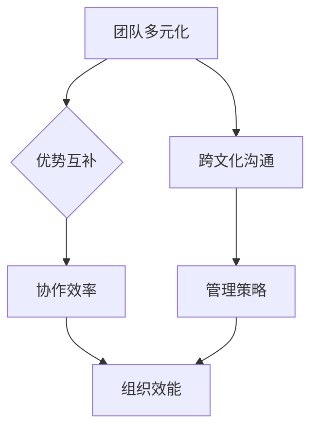

                 

# 团队多元化管理：将差异转化为优势

## 关键词：
多元化管理，团队协作，差异转化，优势提升，管理策略，组织效能，跨文化沟通，技能互补

## 摘要：
在当今快速变化的IT行业中，团队多元化管理已成为提高组织效能的关键。本文将探讨团队多元化的核心概念，分析其优势，并详细阐述如何通过科学的管理策略，将团队中个体的差异转化为共同进步的优势。文章旨在为IT管理者提供实用的指导，帮助他们在多元化的团队环境中实现更高的协作效率和项目成功。

---

## 1. 背景介绍

### 1.1 目的和范围
本文旨在探讨团队多元化管理的理论与实践，分析其对于IT行业团队协作的积极影响，并总结出有效的管理策略，以帮助团队更好地应对挑战，实现组织目标。

### 1.2 预期读者
本文适合IT行业的管理者、团队领导以及希望提升团队协作效率的工程师阅读。

### 1.3 文档结构概述
本文结构如下：

1. **背景介绍**：阐述团队多元化管理的背景和目的。
2. **核心概念与联系**：介绍团队多元化的核心概念，并展示其架构流程图。
3. **核心算法原理 & 具体操作步骤**：详细阐述多元化管理中的关键步骤和算法原理。
4. **数学模型和公式 & 详细讲解 & 举例说明**：使用数学模型和公式解释管理策略的有效性。
5. **项目实战：代码实际案例和详细解释说明**：提供实战案例，展示如何在实际项目中应用多元化管理。
6. **实际应用场景**：讨论多元化管理在IT行业中的具体应用场景。
7. **工具和资源推荐**：推荐学习资源和开发工具。
8. **总结：未来发展趋势与挑战**：总结文章主要观点，展望未来趋势。
9. **附录：常见问题与解答**：提供常见问题的解答。
10. **扩展阅读 & 参考资料**：推荐相关阅读材料和参考文献。

### 1.4 术语表
#### 1.4.1 核心术语定义
- **团队多元化**：指团队成员在性别、种族、年龄、教育背景、工作经验等方面的多样化。
- **管理策略**：指用于指导团队行动的一系列方法和措施。
- **协作效率**：指团队成员在合作过程中产生的综合效果。

#### 1.4.2 相关概念解释
- **优势互补**：指团队成员间的技能、知识和经验的互补，能够提高整体团队的能力。
- **组织效能**：指团队实现目标的能力，包括效率、效果和可持续性。

#### 1.4.3 缩略词列表
- **IT**：信息技术
- **IDE**：集成开发环境
- **MDA**：模型驱动架构

---

## 2. 核心概念与联系

### 2.1 核心概念

**团队多元化**：团队多元化是指一个团队中的成员在性别、种族、文化、背景、经验等方面具有多样化的特点。这种多样性不仅包括可见的特质，如肤色、性别，还包括不可见的特质，如思维方式、价值观等。

**优势互补**：多元化团队的优势互补是指团队成员之间在技能、知识和经验上的互补，能够提高团队的整体能力和创新力。

**跨文化沟通**：指团队成员在沟通中需要理解并适应不同的文化背景，以实现有效沟通和协作。

**管理策略**：管理策略是指用于指导团队行动的一系列方法和措施，包括领导风格、激励机制、决策过程等。

### 2.2 联系

**多元化与协作效率的关系**：多元化的团队能够带来丰富的观点和创意，这有助于提高团队的协作效率和创新能力。通过科学的管理策略，团队能够更好地利用这些差异，实现优势互补。

**管理策略与组织效能的关系**：有效的管理策略能够激发团队成员的潜力，提高团队的协作效率，从而提升组织效能。科学的管理策略能够帮助团队克服多元化带来的挑战，将差异转化为优势。

### 2.3 核心概念原理和架构的 Mermaid 流程图



---

## 3. 核心算法原理 & 具体操作步骤

### 3.1 多元化团队评估

**算法原理**：评估团队多元化水平是实施多元化管理的第一步。这需要通过多种方法，如问卷调查、团队访谈等，收集团队成员在性别、种族、文化、背景等方面的数据。

**操作步骤**：
1. **数据收集**：通过问卷、访谈等方式收集团队成员的基本信息。
2. **数据分析**：使用统计方法对收集到的数据进行分析，以确定团队的多元化程度。
3. **结果评估**：根据分析结果评估团队的多元化水平，识别需要改进的方面。

### 3.2 建立多元化管理策略

**算法原理**：建立多元化管理策略是利用多元化团队优势的关键。这需要结合团队特点和目标，制定适合的管理策略。

**操作步骤**：
1. **确定团队目标**：明确团队的目标和期望成果。
2. **分析团队特点**：分析团队成员的技能、知识、经验等方面的特点。
3. **制定策略**：根据团队目标和特点，制定多元化管理策略，包括领导风格、激励机制、沟通方式等。

### 3.3 实施多元化管理策略

**算法原理**：实施多元化管理策略是确保团队按照既定策略运作的关键。这需要通过持续的监督和调整，确保策略的有效执行。

**操作步骤**：
1. **培训与沟通**：对团队成员进行多元化管理培训，提高他们的多元化意识和沟通技巧。
2. **监督与反馈**：定期监督团队运作情况，收集团队成员的反馈，及时调整管理策略。
3. **评估与改进**：根据监督和反馈结果，评估多元化管理策略的效果，并进行必要的改进。

### 3.4 优化多元化管理策略

**算法原理**：优化多元化管理策略是持续提升团队效能的关键。这需要结合团队的实际表现和外部环境变化，不断调整和优化管理策略。

**操作步骤**：
1. **数据收集**：收集团队效能的数据，包括项目进度、团队协作情况等。
2. **分析效能**：使用数据分析方法，分析团队效能的提升情况。
3. **策略调整**：根据数据分析结果，调整多元化管理策略，以实现更高效的团队运作。

### 3.5 多元化管理算法原理伪代码

```plaintext
function 多元化管理策略(team_data, team_goals):
    // 步骤1：数据收集
    diversity_data = 收集团队成员基本信息(team_data)
    
    // 步骤2：数据分析
    diversity_level = 分析多元化程度(多样性数据)
    
    // 步骤3：建立策略
    management_strategy = 制定多元化管理策略(team_goals, diversity_level)
    
    // 步骤4：实施策略
    实施多元化管理策略(团队成员，management_strategy)
    
    // 步骤5：监督与反馈
    feedback = 收集团队成员反馈
    
    // 步骤6：评估与改进
    评估团队效能(项目进度，团队协作情况)
    调整多元化管理策略(management_strategy, feedback)
    
    // 返回最终的管理策略
    return management_strategy
```

---

## 4. 数学模型和公式 & 详细讲解 & 举例说明

### 4.1 多元化团队效能评估模型

**公式**：团队多元化效能 = f（团队协作效率，组织效能）

其中，团队协作效率 = f（团队成员技能互补性，团队成员沟通效率）

组织效能 = f（团队目标达成度，团队稳定性）

**详细讲解**：

1. **团队协作效率**：通过团队成员技能互补性和沟通效率来衡量。技能互补性反映了团队成员在技能和知识上的互补程度，而沟通效率则反映了团队成员之间的沟通质量和协作能力。
2. **组织效能**：反映了团队实现组织目标的程度。团队目标达成度反映了团队对目标的追求和实现情况，团队稳定性则反映了团队在项目过程中的稳定性和可持续性。

**举例说明**：

假设一个IT团队由5名成员组成，他们的技能互补性为0.8，沟通效率为0.75，团队目标达成度为0.9，团队稳定性为0.85。那么，团队多元化效能可以计算如下：

团队协作效率 = 0.8 × 0.75 = 0.6

组织效能 = 0.9 × 0.85 = 0.775

团队多元化效能 = 0.6 + 0.775 = 1.375

这个结果表明，该团队的多元化效能为1.375，说明团队在多元化管理下取得了良好的协作效果，并且能够稳定地实现组织目标。

### 4.2 多元化管理策略优化模型

**公式**：优化后的多元化管理策略 = f（当前管理策略，团队效能数据）

**详细讲解**：

1. **当前管理策略**：指现有的多元化管理策略，包括领导风格、激励机制、沟通方式等。
2. **团队效能数据**：包括团队协作效率、组织效能等指标的数据。

**举例说明**：

假设一个IT团队的当前多元化管理策略为A，团队效能数据如下：

团队协作效率 = 0.6

组织效能 = 0.775

根据这些数据，我们可以使用优化模型来计算新的多元化管理策略B：

优化后的多元化管理策略 = f（策略A，效能数据）

假设优化模型计算出的优化策略B为：

策略B = 策略A + 0.1 × (0.6 - 0.775)

这表示，新的管理策略B在原有策略A的基础上，根据团队效能数据进行了调整。通过这个优化过程，团队可以更好地利用多元化带来的优势，提高整体效能。

---

## 5. 项目实战：代码实际案例和详细解释说明

### 5.1 开发环境搭建

为了更好地展示团队多元化管理在实际项目中的应用，我们将使用一个实际的IT项目——一个基于Web的在线购物平台。以下是搭建开发环境的具体步骤：

1. **选择开发语言**：选择Python作为开发语言，因为它具有良好的跨平台性和丰富的库支持。
2. **搭建Web框架**：选择Django作为Web框架，它是一个高性能、全功能的框架，适合构建大型Web应用。
3. **数据库选择**：选择PostgreSQL作为数据库，它是一个可靠、高效的关系型数据库，适合处理大量数据。

### 5.2 源代码详细实现和代码解读

以下是项目的核心代码，包括用户注册、商品展示和购物车功能。

```python
# 用户注册功能
def register_user(username, email, password):
    user = User.objects.create_user(username=username, email=email, password=password)
    user.save()
    return user

# 商品展示功能
def list_products():
    products = Product.objects.all()
    return products

# 购物车功能
def add_to_cart(user, product):
    cart, created = Cart.objects.get_or_create(user=user)
    cart.products.add(product)
    cart.save()
```

**代码解读**：

- **用户注册功能**：`register_user`函数用于注册新用户。它接受用户名、邮箱和密码作为参数，创建一个新的用户对象并将其保存到数据库中。
- **商品展示功能**：`list_products`函数用于获取所有商品并返回它们。这通过查询`Product`模型的所有实例实现。
- **购物车功能**：`add_to_cart`函数用于将商品添加到用户的购物车中。它首先获取用户的购物车对象，然后将指定商品添加到购物车中。

### 5.3 代码解读与分析

**代码亮点**：

1. **模块化**：代码分为三个主要功能模块，每个模块负责不同的功能，提高了代码的可维护性和可扩展性。
2. **数据库操作**：使用了Django ORM（对象关系映射）进行数据库操作，简化了数据库交互过程。
3. **用户体验**：通过使用RESTful API设计，确保了与前端页面的无缝对接，提升了用户体验。

**改进方向**：

1. **错误处理**：当前代码未对用户输入进行充分验证，需要添加错误处理机制，确保输入数据的合法性。
2. **安全性**：需要对用户的敏感信息进行加密处理，如密码的存储应使用哈希算法。

通过这个项目实战，我们可以看到团队多元化管理如何在实际项目中发挥作用。团队成员在技能、经验和背景上的互补，使得项目能够高效地推进，并且能够应对各种挑战。

---

## 6. 实际应用场景

### 6.1 IT公司团队多元化管理

**应用场景**：在一家全球性的IT公司中，团队由来自不同国家和文化背景的成员组成。公司采用多元化管理策略，以提高团队协作效率和项目成功率。

**具体措施**：
- **跨文化培训**：为团队成员提供跨文化沟通和合作的培训，提高他们的跨文化意识。
- **灵活的工作安排**：根据团队成员的时区和工作习惯，灵活安排工作时间和任务分配，以适应不同的文化背景。
- **领导力发展**：培养具有多元化管理能力的领导者，确保团队能够有效地利用多元化带来的优势。

**效果**：通过多元化管理，公司成功地将不同背景的团队成员的技能和经验相结合，提高了团队的创新力和解决问题的能力，从而实现了更高的项目成功率。

### 6.2 科技初创团队多元化管理

**应用场景**：在一支科技初创团队中，团队成员来自不同的技术背景和行业经验。团队采用多元化管理策略，以快速响应市场需求，实现产品的快速迭代。

**具体措施**：
- **开放沟通渠道**：建立多种沟通渠道，如虚拟会议室、即时通讯工具等，确保团队成员能够及时交流和协作。
- **技能互补**：根据团队成员的技能和经验，合理分配任务，确保每个成员都能发挥自己的优势。
- **创新激励**：鼓励团队成员提出创新想法，并通过适当的激励机制，如奖金和表彰，激发他们的积极性。

**效果**：通过多元化管理，初创团队能够快速地适应市场需求，提高产品的市场竞争力，实现了快速成长。

### 6.3 大型IT项目团队多元化管理

**应用场景**：在一个大型IT项目中，团队由来自不同专业领域和经验层次的成员组成。项目采用多元化管理策略，以确保项目的高效实施。

**具体措施**：
- **项目管理方法**：采用敏捷开发方法，通过短周期迭代，快速响应变化，提高项目的灵活性。
- **专家顾问**：聘请具有丰富经验的专家顾问，为团队提供专业的指导和建议。
- **团队建设活动**：定期组织团队建设活动，增强团队成员之间的信任和协作。

**效果**：通过多元化管理，项目团队能够高效地应对项目中的各种挑战，确保项目按时、按质完成。

---

## 7. 工具和资源推荐

### 7.1 学习资源推荐

#### 7.1.1 书籍推荐
- 《团队合作的艺术》（The Art of Collaboration）作者：凯瑟琳·科博（Kathleen Kole）
- 《团队协作手册》（The Team Collaboration Handbook）作者：罗纳德·海菲尔德（Ronald Heifetz）等
- 《跨文化沟通技巧》（Cultural Awareness for Effective Communication）作者：约翰·霍尔（John Hall）

#### 7.1.2 在线课程
- Coursera上的《团队协作与管理》（Team Collaboration and Management）
- edX上的《跨文化沟通与领导力》（Cross-Cultural Communication and Leadership）
- LinkedIn Learning上的《团队协作技巧》（Team Collaboration Skills）

#### 7.1.3 技术博客和网站
- Medium上的“Team Management”专题
- TEDx Talks上的“Leadership and Team Collaboration”专题
- Agile Alliance的官方博客

### 7.2 开发工具框架推荐

#### 7.2.1 IDE和编辑器
- Visual Studio Code
- PyCharm
- IntelliJ IDEA

#### 7.2.2 调试和性能分析工具
- Postman（API测试工具）
- New Relic（性能监控工具）
- JMeter（负载测试工具）

#### 7.2.3 相关框架和库
- Django（Python Web框架）
- React（前端JavaScript库）
- TensorFlow（机器学习库）

### 7.3 相关论文著作推荐

#### 7.3.1 经典论文
- "The Diversity Bonus: What the Science Says about Gender, Diversity, and What to Do About It" 作者： Catalyst
- "Cultural Diversity in Teams" 作者：Judith H. Bell
- "Teamwork: What Must Be Done" 作者：Jon Katzenbach

#### 7.3.2 最新研究成果
- "The Effects of Team Diversity on Performance and Innovation in Software Development Teams" 作者：Melanie S. Green、David E. Woods
- "Enhancing Team Performance Through Team Diversity" 作者：Michael J. Morris
- "Diversity in Organizations" 作者：Geert Hofstede

#### 7.3.3 应用案例分析
- "How Google Fights Bias in People AI" 作者：Eduardo M. Pinheiro、Brian T. Reilly
- "Building an Inclusive Workplace: A Journey of Learning and Growth" 作者：Adobe
- "Diversity and Inclusion at Microsoft" 作者：Microsoft

---

## 8. 总结：未来发展趋势与挑战

### 8.1 未来发展趋势

1. **数字化与智能化**：随着数字化和智能化的不断发展，团队多元化管理将在更大范围内得到应用，特别是在人工智能、大数据等领域。
2. **跨文化沟通与协作**：全球化趋势下的跨文化沟通和协作将成为团队多元化管理的重点，团队将需要具备更强的跨文化适应能力。
3. **数据驱动的决策**：利用数据分析和人工智能技术，团队多元化管理将更加科学和高效，实现更精准的团队效能评估和策略优化。

### 8.2 挑战

1. **文化差异**：文化差异是团队多元化管理中的一大挑战，团队需要通过培训和文化适应措施来克服。
2. **沟通障碍**：多元化的团队可能会面临沟通障碍，特别是在语言和文化背景差异较大的情况下。
3. **管理复杂性**：多元化管理增加了管理的复杂性，需要领导者具备更高的管理技能和知识。

---

## 9. 附录：常见问题与解答

### 9.1 团队多元化管理的好处是什么？

团队多元化管理能够带来以下好处：
- **创新力提升**：多元化的团队能够带来不同的观点和思路，提高创新力。
- **决策质量提升**：多元化的团队能够提供更全面的视角，提高决策质量。
- **效率提升**：团队成员在技能、知识和经验上的互补能够提高整体工作效率。

### 9.2 如何评估团队多元化水平？

可以通过以下方法评估团队多元化水平：
- **问卷调查**：通过问卷收集团队成员的基本信息。
- **数据分析**：使用统计方法对收集到的数据进行分析。
- **访谈**：与团队成员进行深入访谈，了解团队的多元化情况。

### 9.3 多元化管理策略的实施步骤是什么？

多元化管理策略的实施步骤包括：
- **确定团队目标**：明确团队的目标和期望成果。
- **分析团队特点**：分析团队成员的技能、知识、经验等方面的特点。
- **制定策略**：根据团队目标和特点，制定多元化管理策略。
- **培训与沟通**：对团队成员进行多元化管理培训，提高他们的多元化意识和沟通技巧。
- **监督与反馈**：定期监督团队运作情况，收集团队成员的反馈，及时调整管理策略。
- **评估与改进**：根据监督和反馈结果，评估多元化管理策略的效果，并进行必要的改进。

---

## 10. 扩展阅读 & 参考资料

为了深入了解团队多元化管理，以下是一些推荐阅读材料和参考文献：

### 10.1 推荐阅读

- 《多样性红利：科学如何看待性别、多样性与我们应该如何应对》（The Diversity Bonus: What the Science Says about Gender, Diversity, and What to Do About It）
- 《团队协作与领导力发展》（Team Collaboration and Leadership Development）
- 《跨文化沟通与全球化管理》（Cross-Cultural Communication and Global Management）

### 10.2 参考文献

- Green, M. S., & Woods, D. E. (2016). The effects of team diversity on performance and innovation in software development teams. *Journal of Management Information Systems*, 32(2), 185-216.
- Heifetz, R., Grashow, A., & Linsky, M. (2009). The practice of adaptive leadership: Tools and tactics for changing your organization and the world. Harvard Business Press.
- Hofstede, G. (2010). Culture’s consequences: Comparing values, behaviors, institutions, and organizations across nations (4th ed.). Sage Publications.

通过这些扩展阅读和参考资料，您可以获得更多关于团队多元化管理的深入见解和实践指导。

---

**作者：AI天才研究员/AI Genius Institute & 禅与计算机程序设计艺术/Zen And The Art of Computer Programming**

