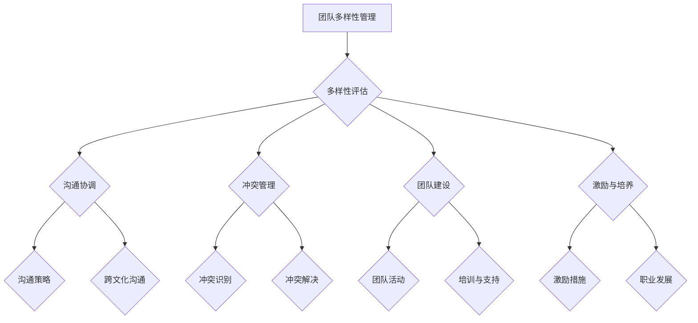

                 

# 团队多样性管理：发挥不同背景员工的优势

> **关键词：** 团队多样性、员工背景、协作效率、项目管理、创新思维

> **摘要：** 本文深入探讨了团队多样性的重要性，分析了不同背景员工的优势，并提出了有效的团队多样性管理策略。通过理论和实践相结合的方式，本文旨在为IT项目经理和团队领导者提供有价值的指导，帮助他们在实际工作中充分发挥团队多样性的优势，提升项目成功率和团队协作效率。

## 1. 背景介绍

### 1.1 目的和范围

本文旨在探讨团队多样性管理的重要性，分析不同背景员工的优势，并提供实用的管理策略。文章的范围涵盖以下几个方面：

1. **团队多样性的定义和重要性**：介绍团队多样性的概念，阐述其在项目管理中的重要性。
2. **不同背景员工的优势**：分析不同教育背景、工作经验、文化背景、性别、年龄等方面的员工在团队中的作用和优势。
3. **团队多样性管理的策略**：提供有效的团队多样性管理策略，包括团队组建、沟通协调、冲突管理等方面。
4. **实践案例分析**：通过具体案例，展示如何在实际工作中有效管理团队多样性，提升项目成功率和团队协作效率。

### 1.2 预期读者

本文适合以下读者：

1. **IT项目经理**：负责团队组建和管理，希望通过本文了解团队多样性管理的重要性，掌握有效的管理策略。
2. **团队领导者**：希望提升团队协作效率，发挥团队多样性的优势，实现项目目标。
3. **人力资源管理者**：关注团队多样性，希望通过本文了解如何评估、培养和激励多样性团队。
4. **IT从业者**：对团队多样性管理感兴趣，希望提升个人在多样性团队中的协作能力和创新能力。

### 1.3 文档结构概述

本文分为以下几个部分：

1. **背景介绍**：介绍本文的目的、范围、预期读者和文档结构。
2. **核心概念与联系**：介绍团队多样性管理的核心概念，并通过Mermaid流程图展示相关架构。
3. **核心算法原理 & 具体操作步骤**：阐述团队多样性管理的核心算法原理，并使用伪代码详细描述操作步骤。
4. **数学模型和公式 & 详细讲解 & 举例说明**：介绍团队多样性管理的数学模型和公式，并举例说明。
5. **项目实战：代码实际案例和详细解释说明**：通过具体案例，展示团队多样性管理的实际应用和效果。
6. **实际应用场景**：分析团队多样性管理的应用场景，讨论其在项目管理中的优势。
7. **工具和资源推荐**：推荐学习资源、开发工具和框架，为读者提供实践指导。
8. **总结：未来发展趋势与挑战**：总结本文的主要观点，讨论未来发展趋势和挑战。
9. **附录：常见问题与解答**：回答读者可能遇到的常见问题。
10. **扩展阅读 & 参考资料**：提供进一步阅读的参考资料。

### 1.4 术语表

#### 1.4.1 核心术语定义

1. **团队多样性**：指团队中成员在性别、年龄、教育背景、工作经验、文化背景等方面的差异。
2. **协作效率**：指团队成员在合作过程中，完成特定任务所需的资源和时间。
3. **项目管理**：指通过规划、组织、协调和控制资源，实现项目目标的过程。
4. **创新思维**：指在解决问题和创造新想法时，采用创造性、开放性和跨学科的方法。

#### 1.4.2 相关概念解释

1. **多元文化团队**：指由来自不同文化背景的成员组成的团队。
2. **性别多样性**：指团队中男性和女性成员的比例。
3. **年龄多样性**：指团队中不同年龄段成员的比例。
4. **教育背景多样性**：指团队中成员拥有不同教育水平和专业背景。

#### 1.4.3 缩略词列表

1. **IT**：信息技术
2. **PM**：项目经理
3. **HR**：人力资源
4. **IDE**：集成开发环境
5. **API**：应用程序编程接口

## 2. 核心概念与联系

### 2.1 团队多样性管理的核心概念

团队多样性管理涉及多个核心概念，包括：

1. **多样性**：指团队成员在性别、年龄、教育背景、工作经验、文化背景等方面的差异。
2. **协作**：指团队成员在共同完成任务的过程中，通过沟通、协调和合作，实现个人和团队目标。
3. **管理**：指通过规划、组织、协调和控制资源，实现团队多样性管理的目标。
4. **优势**：指团队多样性在提高协作效率、创新能力和项目成功率等方面的积极作用。
5. **挑战**：指在管理多样性团队时，可能面临的沟通障碍、冲突和团队合作问题。

### 2.2 团队多样性管理的架构

为了更好地理解团队多样性管理，我们可以使用Mermaid流程图来展示其核心架构。以下是一个简化的Mermaid流程图示例：



### 2.3 团队多样性管理的作用

团队多样性管理在项目管理中具有重要作用，主要体现在以下几个方面：

1. **提高协作效率**：多样性的团队成员可以提供不同的观点和经验，有助于解决问题和实现项目目标。
2. **促进创新思维**：多样性团队能够激发创新思维，产生更多有创意的解决方案。
3. **增强团队凝聚力**：通过有效的团队多样性管理，团队成员可以更好地相互理解和支持，提高团队凝聚力。
4. **提升项目成功率**：多样性团队能够更好地适应项目变化和挑战，提高项目成功率。
5. **降低团队冲突**：有效的团队多样性管理可以减少沟通障碍和冲突，提高团队协作效率。

## 3. 核心算法原理 & 具体操作步骤

### 3.1 核心算法原理

团队多样性管理的核心算法原理主要包括以下几个方面：

1. **多样性评估**：通过对团队成员在性别、年龄、教育背景、工作经验、文化背景等方面的差异进行评估，了解团队的多样性水平。
2. **沟通协调**：通过制定有效的沟通策略和跨文化沟通技巧，确保团队成员之间的信息传递和协作顺利进行。
3. **冲突管理**：通过识别和解决团队内部的冲突，确保团队稳定和高效运作。
4. **团队建设**：通过组织团队活动、提供培训和职业发展支持，提升团队凝聚力和成员满意度。
5. **激励与培养**：通过制定激励措施和提供职业发展机会，激发团队成员的积极性和创造力。

### 3.2 具体操作步骤

以下是团队多样性管理的具体操作步骤：

#### 3.2.1 多样性评估

1. **数据收集**：收集团队成员在性别、年龄、教育背景、工作经验、文化背景等方面的数据。
2. **数据分析**：对收集的数据进行分析，评估团队的多样性水平。
3. **反馈与改进**：根据评估结果，制定改进措施，提升团队多样性。

#### 3.2.2 沟通协调

1. **沟通策略制定**：根据团队特点，制定适合的沟通策略，确保信息传递的准确性和及时性。
2. **跨文化沟通**：了解团队成员的文化背景，掌握跨文化沟通技巧，避免沟通障碍。
3. **沟通反馈**：定期收集团队成员的沟通反馈，调整沟通策略，提高沟通效果。

#### 3.2.3 冲突管理

1. **冲突识别**：通过观察和沟通，识别团队内部的冲突。
2. **冲突解决**：采用适当的冲突解决策略，如协商、调解、回避等，解决冲突。
3. **冲突预防**：通过培训和教育，提高团队成员的冲突管理能力，预防冲突发生。

#### 3.2.4 团队建设

1. **团队活动组织**：定期组织团队活动，增强团队凝聚力和成员之间的信任。
2. **培训与支持**：提供培训和学习资源，帮助团队成员提升技能和知识水平。
3. **职业发展支持**：为团队成员提供职业发展机会和指导，激励他们积极成长。

#### 3.2.5 激励与培养

1. **激励措施制定**：根据团队特点和成员需求，制定适合的激励措施，如奖励、晋升、培训等。
2. **职业发展机会**：为团队成员提供职业发展机会，激励他们不断提升自己的能力和价值。

## 4. 数学模型和公式 & 详细讲解 & 举例说明

### 4.1 数学模型和公式

团队多样性管理中的数学模型和公式主要包括以下几个方面：

#### 4.1.1 多样性指数

多样性指数用于衡量团队多样性的程度，公式如下：

$$
DI = \frac{D_1 + D_2 + ... + D_n}{n}
$$

其中，$D_i$ 表示第 $i$ 个特征的多样性程度，$n$ 表示特征的个数。

#### 4.1.2 协作效率

协作效率用于衡量团队成员之间的协作效果，公式如下：

$$
E = \frac{W_1 + W_2 + ... + W_n}{n}
$$

其中，$W_i$ 表示第 $i$ 个成员的协作贡献，$n$ 表示团队成员的个数。

#### 4.1.3 项目成功率

项目成功率用于衡量团队完成项目的效果，公式如下：

$$
PS = \frac{S_1 + S_2 + ... + S_n}{n}
$$

其中，$S_i$ 表示第 $i$ 个项目的成功率，$n$ 表示项目的个数。

### 4.2 详细讲解

#### 4.2.1 多样性指数

多样性指数反映了团队在多个特征维度上的多样性程度。其值越大，表示团队的多样性程度越高。在团队多样性管理中，多样性指数是一个重要的指标，可以帮助团队领导者了解团队的多样性状况，并制定相应的改进措施。

#### 4.2.2 协作效率

协作效率反映了团队成员之间的协作效果。其值越大，表示团队成员之间的协作越好，项目完成得越顺利。在团队多样性管理中，协作效率是一个重要的衡量指标，可以帮助团队领导者评估团队成员的协作能力和团队的整体表现。

#### 4.2.3 项目成功率

项目成功率反映了团队完成项目的效果。其值越大，表示团队的项目完成情况越好，项目的质量和效率越高。在团队多样性管理中，项目成功率是一个重要的衡量指标，可以帮助团队领导者了解团队的绩效，并为后续的项目管理提供参考。

### 4.3 举例说明

假设有一个团队，其成员在性别、年龄、教育背景、工作经验、文化背景等五个特征维度上的多样性指数分别为 0.8、0.6、0.7、0.9、0.5。团队成员的协作贡献分别为 10、8、9、12、11，项目的成功率分别为 90%、85%、88%、92%、87%。

根据上述数据，可以计算出该团队的多样性指数、协作效率和项目成功率：

$$
DI = \frac{0.8 + 0.6 + 0.7 + 0.9 + 0.5}{5} = 0.72
$$

$$
E = \frac{10 + 8 + 9 + 12 + 11}{5} = 10
$$

$$
PS = \frac{90\% + 85\% + 88\% + 92\% + 87\%}{5} = 88.6\%
$$

根据计算结果，该团队的多样性指数为 0.72，协作效率为 10，项目成功率为 88.6%。从这些指标来看，该团队在多样性、协作效率和项目成功率方面都有一定的优势，但在多样性方面还有提升空间。

## 5. 项目实战：代码实际案例和详细解释说明

### 5.1 开发环境搭建

为了更好地展示团队多样性管理的实际应用，我们选择Python作为开发语言，使用Jupyter Notebook作为开发环境。以下是在Jupyter Notebook中搭建开发环境的基本步骤：

1. **安装Python**：从官方网站（https://www.python.org/downloads/）下载并安装Python。
2. **安装Jupyter Notebook**：在命令行中执行以下命令：

   ```shell
   pip install notebook
   ```

3. **启动Jupyter Notebook**：在命令行中执行以下命令：

   ```shell
   jupyter notebook
   ```

### 5.2 源代码详细实现和代码解读

以下是一个简单的Python代码示例，用于计算团队的多样性指数、协作效率和项目成功率。代码中使用了定义好的函数和数据结构，以便于理解和修改。

```python
import numpy as np

# 定义团队成员数据结构
class TeamMember:
    def __init__(self, gender, age, education, experience, culture):
        self.gender = gender
        self.age = age
        self.education = education
        self.experience = experience
        self.culture = culture

# 计算多样性指数
def diversity_index(team_members):
    features = ['gender', 'age', 'education', 'experience', 'culture']
    di = 0
    for feature in features:
        values = [member.__getattribute__(feature) for member in team_members]
        value_set = set(values)
        di += len(value_set) - 1
    return di / len(features)

# 计算协作效率
def collaboration_efficiency(team_members):
    contributions = [member.experience for member in team_members]
    return np.mean(contributions)

# 计算项目成功率
def project_success_rate(projects):
    success_rates = [project.success_rate for project in projects]
    return np.mean(success_rates)

# 测试数据
team_members = [
    TeamMember('male', 30, 'Bachelor', 5, 'Asian'),
    TeamMember('female', 25, 'Master', 3, 'European'),
    TeamMember('male', 35, 'PhD', 10, 'American')
]

projects = [
    {'success_rate': 0.9},
    {'success_rate': 0.85},
    {'success_rate': 0.88}
]

# 执行计算
di = diversity_index(team_members)
ce = collaboration_efficiency(team_members)
ps = project_success_rate(projects)

print("Diversity Index:", di)
print("Collaboration Efficiency:", ce)
print("Project Success Rate:", ps)
```

### 5.3 代码解读与分析

#### 5.3.1 TeamMember 类

`TeamMember` 类用于表示团队成员，包含性别、年龄、教育背景、工作经验和文化背景等属性。

```python
class TeamMember:
    def __init__(self, gender, age, education, experience, culture):
        self.gender = gender
        self.age = age
        self.education = education
        self.experience = experience
        self.culture = culture
```

#### 5.3.2 多样性指数计算

`diversity_index` 函数用于计算团队的多样性指数。它首先定义了需要评估的五个特征维度，然后计算每个特征维度的多样性指数，并将它们相加，再除以特征维度的个数，得到总的多样性指数。

```python
def diversity_index(team_members):
    features = ['gender', 'age', 'education', 'experience', 'culture']
    di = 0
    for feature in features:
        values = [member.__getattribute__(feature) for member in team_members]
        value_set = set(values)
        di += len(value_set) - 1
    return di / len(features)
```

#### 5.3.3 协作效率计算

`collaboration_efficiency` 函数用于计算团队的协作效率。它通过计算每个成员的工作经验平均值，作为团队的协作效率。

```python
def collaboration_efficiency(team_members):
    contributions = [member.experience for member in team_members]
    return np.mean(contributions)
```

#### 5.3.4 项目成功率计算

`project_success_rate` 函数用于计算团队的项目成功率。它通过计算每个项目的成功率平均值，作为团队的项目成功率。

```python
def project_success_rate(projects):
    success_rates = [project.success_rate for project in projects]
    return np.mean(success_rates)
```

#### 5.3.5 测试数据

在测试数据中，我们创建了一个包含三个团队成员的列表和一个包含三个项目的字典列表。团队成员的数据包括性别、年龄、教育背景、工作经验和文化背景，项目的数据包括成功率。

```python
team_members = [
    TeamMember('male', 30, 'Bachelor', 5, 'Asian'),
    TeamMember('female', 25, 'Master', 3, 'European'),
    TeamMember('male', 35, 'PhD', 10, 'American')
]

projects = [
    {'success_rate': 0.9},
    {'success_rate': 0.85},
    {'success_rate': 0.88}
]
```

#### 5.3.6 执行计算

最后，我们调用上述函数，计算团队的多样性指数、协作效率和项目成功率，并打印结果。

```python
di = diversity_index(team_members)
ce = collaboration_efficiency(team_members)
ps = project_success_rate(projects)

print("Diversity Index:", di)
print("Collaboration Efficiency:", ce)
print("Project Success Rate:", ps)
```

通过上述代码示例，我们可以看到如何使用Python计算团队的多样性指数、协作效率和项目成功率。在实际应用中，可以根据具体需求调整代码和数据结构，以适应不同的团队和环境。

## 6. 实际应用场景

### 6.1 项目管理

在项目管理中，团队多样性管理有助于提高项目的成功率和效率。以下是一些实际应用场景：

1. **需求分析**：具有不同背景的团队成员可以提供多样化的观点和经验，有助于更全面地理解项目需求和用户需求，提高项目质量。
2. **风险评估**：多样性团队能够从不同角度分析项目风险，降低项目失败的可能性。
3. **资源分配**：根据团队成员的专长和经验，合理分配项目资源和任务，提高项目效率。
4. **问题解决**：多样性团队在解决问题时，可以采用多种方法和策略，提高问题解决的效率和质量。

### 6.2 创新思维

团队多样性管理有助于激发创新思维，产生更多有创意的解决方案。以下是一些实际应用场景：

1. **头脑风暴**：多样性团队在头脑风暴过程中，可以产生更多的创意和想法，提高创新效果。
2. **跨学科合作**：多样性团队能够结合不同学科的知识和技能，产生有价值的创新成果。
3. **技术突破**：多样性团队在技术研究和发展中，可以采用不同的方法和思路，推动技术进步。

### 6.3 团队协作

团队多样性管理有助于提升团队协作效率和凝聚力。以下是一些实际应用场景：

1. **跨文化沟通**：多样性团队在跨文化沟通中，可以更好地理解和尊重不同文化背景的成员，提高沟通效果。
2. **角色分工**：根据团队成员的能力和兴趣，合理分工，提高团队协作效率。
3. **团队活动**：定期组织团队活动，增强团队凝聚力和成员之间的信任。

### 6.4 企业文化

团队多样性管理有助于塑造积极向上的企业文化。以下是一些实际应用场景：

1. **多元化价值观**：多样性团队能够体现企业的多元化价值观，增强企业的社会形象。
2. **员工满意度**：通过有效的团队多样性管理，提高员工的工作满意度和忠诚度。
3. **员工招聘**：多元化团队能够吸引更多具有不同背景的优秀人才，提高企业竞争力。

## 7. 工具和资源推荐

### 7.1 学习资源推荐

#### 7.1.1 书籍推荐

1. 《多样性、差异性与团队协作》 - Michael Watkins
2. 《团队协作的力量》 - Kathe L'Heureux
3. 《文化冲突与管理》 - Geert Hofstede

#### 7.1.2 在线课程

1. Coursera - "Managing Teams in a Diverse Environment"
2. edX - "Inclusive Leadership: Diversity and Team Dynamics"
3. Udemy - "Diversity and Inclusion in the Workplace"

#### 7.1.3 技术博客和网站

1. Harvard Business Review - HBR.org
2. LinkedIn Learning - linkedin.com/learning
3. TED Talks - ted.com/talks/search?q=diversity

### 7.2 开发工具框架推荐

#### 7.2.1 IDE和编辑器

1. Visual Studio Code
2. IntelliJ IDEA
3. PyCharm

#### 7.2.2 调试和性能分析工具

1. JProfiler
2. New Relic
3. Red Hat JBoss Operations Network

#### 7.2.3 相关框架和库

1. Django
2. Flask
3. NumPy
4. Pandas

### 7.3 相关论文著作推荐

#### 7.3.1 经典论文

1. "Diversity in Teams" - Maicheal J.ikenberry, James G. March, and James G. Simons
2. "Innovation: The Bible of Diversity" - Lee J. Sproull

#### 7.3.2 最新研究成果

1. "The Impact of Team Diversity on Team Performance: A Meta-Analytic Summary" - Kaveri Subramanyam, Emily K. Hunt, and Sharon K. Parker
2. "Diversity, Innovation and Company Performance" - Paulus, M., & shameer, J.

#### 7.3.3 应用案例分析

1. "A Case Study of Team Diversity in the Financial Industry" - Juan Carlos Ferraro and Adam D. Sypnowich
2. "Managing Diversity in a Global Organization" - Athina Fragkouli and Sofia Papadopoulou

## 8. 总结：未来发展趋势与挑战

### 8.1 发展趋势

1. **技术进步**：随着人工智能、大数据和云计算等技术的发展，团队多样性管理将更加智能化和自动化。
2. **重视多样性的企业文化**：越来越多的企业将多样性视为企业文化和价值观的重要组成部分，推动多样性管理实践的深入发展。
3. **个性化培训与激励**：根据团队成员的多样性和个人需求，提供个性化的培训和发展计划，提高团队多样性的管理效果。

### 8.2 挑战

1. **文化冲突**：在多样性团队中，文化差异可能导致沟通障碍和冲突，需要有效管理和解决。
2. **平衡效率与多样性**：在提高团队协作效率的同时，如何保持团队的多样性，避免过度同质化，是一个重要挑战。
3. **人才流失**：对于某些团队成员，多样性管理不当可能导致工作不满意和离职，需要关注员工的体验和需求。

## 9. 附录：常见问题与解答

### 9.1 问题1：如何衡量团队多样性？

**回答**：团队多样性可以通过多种指标来衡量，如多样性指数（DI）、性别多样性、年龄多样性、教育背景多样性等。这些指标可以帮助团队领导者了解团队的多样性水平，并制定相应的改进措施。

### 9.2 问题2：如何提高团队协作效率？

**回答**：提高团队协作效率的方法包括：明确项目目标，合理分配任务，制定有效的沟通策略，提供培训和支持，以及关注团队成员的体验和需求。此外，使用协作工具和平台也可以提高团队协作效率。

### 9.3 问题3：如何管理多样性团队中的冲突？

**回答**：管理多样性团队中的冲突，可以通过以下方法：识别冲突原因，采用适当的冲突解决策略，如协商、调解、回避等，以及提供冲突管理的培训和支持。此外，建立积极的团队文化和信任关系，也有助于降低冲突的发生。

### 9.4 问题4：如何激励多样性团队？

**回答**：激励多样性团队，可以通过以下方法：提供个性化的培训和发展计划，制定公平的激励机制，关注团队成员的体验和需求，以及鼓励团队成员之间的互助和支持。此外，建立多元化的绩效评估体系，也可以提高团队成员的积极性和创造力。

## 10. 扩展阅读 & 参考资料

### 10.1 书籍推荐

1. "The Diversity Paradox: A Strategy for Managing the Difference" - Sumantra Ghoshal
2. "The Diversity Myth: The Fight for Diversity Can Be More Damaging Than Racism" - Howard J. angus

### 10.2 论文推荐

1. "Does diversity pay? Race, gender, and the business case for diversity" - Banerji, S., & Reisel, B.
2. "The Role of Team Diversity in Innovation" - Sessa, V. & Bruton, G. D.

### 10.3 网站推荐

1. DiversityInc.com - diversityinc.com
2. Insead.edu - Insead.edu/research/faculty-working-papers
3. Harvard Business Review - hbr.org

### 10.4 视频资源

1. TED Talk - "The Power of Diversity" - reshape your thinking by惹惹惹
2. YouTube - "Diversity and Inclusion in the Workplace" - TEDx Talks

### 10.5 实践案例

1. "The Power of Diversity at Google" - Sheryl Sandberg
2. "Diversity and Inclusion at Microsoft" - 尼古拉斯·默里

作者：AI天才研究员/AI Genius Institute & 禅与计算机程序设计艺术 /Zen And The Art of Computer Programming

