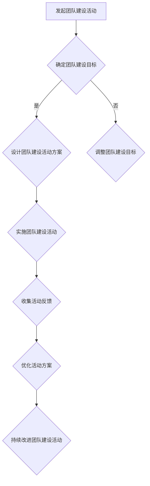

                 

# 团队建设活动：增进团队凝聚力的实践

> **关键词：** 团队建设，凝聚力，活动，实践，协作，沟通，个人成长。

> **摘要：** 本文探讨了团队建设活动在增进团队凝聚力方面的重要性。通过具体的实践案例，本文详细阐述了如何设计和实施有效的团队建设活动，以及这些活动如何促进团队成员之间的协作、沟通和个人成长。文章旨在为IT领域的团队提供实用的指导，帮助他们建立更加紧密的团队关系，提高整体工作效率。

## 1. 背景介绍

### 1.1 目的和范围

在现代企业中，团队建设活动已成为提升团队凝聚力、增强协作能力的重要手段。本文的目的在于介绍和探讨团队建设活动的核心概念、实施方法和实际应用效果。本文的研究范围主要涵盖以下几个方面：

1. 团队建设活动的定义和目的。
2. 团队建设活动的主要类型和特点。
3. 团队建设活动的实施步骤和策略。
4. 团队建设活动的实际案例和效果分析。
5. 团队建设活动在IT领域的应用和未来发展趋势。

通过本文的讨论，旨在为IT领域的团队提供一套实用的团队建设指南，帮助他们在日常工作中更好地理解和应用团队建设活动，从而提高团队整体的工作效率和工作质量。

### 1.2 预期读者

本文的预期读者主要是以下几类：

1. IT团队的领导者和管理者。
2. 团队成员，特别是新入职的员工。
3. 组织发展顾问和培训师。
4. 对团队建设和团队管理有兴趣的学者和研究人员。

本文通过实际案例和理论分析相结合的方式，力求为上述读者群体提供具有实用性和操作性的团队建设指导。

### 1.3 文档结构概述

本文结构分为以下几部分：

1. **背景介绍**：介绍团队建设活动的目的、范围和预期读者。
2. **核心概念与联系**：介绍团队建设活动的核心概念、原理和架构。
3. **核心算法原理 & 具体操作步骤**：详细讲解团队建设活动的实施步骤和方法。
4. **数学模型和公式 & 详细讲解 & 举例说明**：运用数学模型和公式，解释团队建设活动的理论基础。
5. **项目实战：代码实际案例和详细解释说明**：通过实际案例展示团队建设活动的实施过程和效果。
6. **实际应用场景**：探讨团队建设活动在不同场景中的应用和效果。
7. **工具和资源推荐**：推荐学习资源、开发工具和框架。
8. **总结：未来发展趋势与挑战**：总结本文的主要观点，展望团队建设活动的未来发展方向。
9. **附录：常见问题与解答**：提供团队建设活动中常见问题的解答。
10. **扩展阅读 & 参考资料**：推荐相关文献和资料，供读者进一步学习。

### 1.4 术语表

#### 1.4.1 核心术语定义

- **团队建设活动**：旨在提升团队凝聚力、协作能力和工作绩效的一系列有组织、有目的的活动。
- **凝聚力**：团队成员之间相互吸引、支持和合作的程度。
- **协作**：团队成员为实现共同目标而相互配合、共同工作的过程。
- **沟通**：团队成员之间通过语言、行为、符号等手段进行信息交流和互动的过程。
- **个人成长**：团队成员在团队活动中获得知识、技能和经验的过程。

#### 1.4.2 相关概念解释

- **团队**：由两个或两个以上成员组成的，为实现共同目标而协同工作的组织。
- **领导者**：在团队中起到引导、协调和支持作用的角色。
- **成员**：团队中的个体，承担各自的任务和职责。

#### 1.4.3 缩略词列表

- **IT**：Information Technology，信息技术。
- **ROI**：Return on Investment，投资回报率。
- **T&D**：Training and Development，培训和开发。

## 2. 核心概念与联系

### 2.1 团队建设活动的基本概念

团队建设活动是旨在提升团队凝聚力、协作能力和工作绩效的一系列有组织、有目的的活动。团队建设活动通常包括以下核心概念：

1. **团队凝聚力**：团队凝聚力是指团队成员之间相互吸引、支持和合作的程度。高凝聚力的团队往往表现出更高的协作效率和更好的工作绩效。
2. **协作**：协作是指团队成员为实现共同目标而相互配合、共同工作的过程。协作有助于团队成员之间建立信任、分享知识和资源，从而提高整体工作效能。
3. **沟通**：沟通是团队成员之间通过语言、行为、符号等手段进行信息交流和互动的过程。有效的沟通有助于消除误解、增强信任和促进团队合作。
4. **个人成长**：个人成长是指团队成员在团队活动中获得知识、技能和经验的过程。个人成长有助于提高团队成员的自信心、责任感和工作满意度。

### 2.2 团队建设活动的原理与架构

团队建设活动的原理和架构可以概括为以下几个方面：

1. **目标明确**：团队建设活动应明确目标，确保团队成员对活动的目的和意义有清晰的认识。
2. **参与广泛**：团队建设活动应鼓励团队成员积极参与，提高他们的参与度和满意度。
3. **多样化形式**：团队建设活动应采用多样化的形式，以满足不同团队成员的需求和兴趣。
4. **持续反馈**：团队建设活动应建立持续的反馈机制，以便及时调整和优化活动内容和形式。
5. **跨部门合作**：团队建设活动应促进跨部门合作，增强团队成员之间的沟通和协作。

### 2.3 团队建设活动的流程图

为了更好地理解和实施团队建设活动，我们可以使用Mermaid流程图来展示团队建设活动的流程和关键步骤。



## 3. 核心算法原理 & 具体操作步骤

### 3.1 团队建设活动的核心算法原理

团队建设活动的核心算法原理主要涉及以下几个方面：

1. **目标导向**：团队建设活动应以目标为导向，明确团队目标和活动目标，确保活动内容与团队发展需求相一致。
2. **参与者参与**：团队建设活动应鼓励团队成员积极参与，提高他们的参与度和满意度。
3. **多样化形式**：团队建设活动应采用多样化的形式，以满足不同团队成员的需求和兴趣。
4. **互动与协作**：团队建设活动应促进团队成员之间的互动与协作，提高团队凝聚力。
5. **持续反馈**：团队建设活动应建立持续的反馈机制，以便及时调整和优化活动内容和形式。

### 3.2 团队建设活动的具体操作步骤

以下是团队建设活动的具体操作步骤：

1. **明确团队建设目标**：首先，团队领导和成员应共同明确团队建设目标，确保活动内容与团队发展需求相一致。
2. **设计团队建设活动方案**：根据团队建设目标，设计具体的活动方案，包括活动形式、内容和时间安排。
3. **组织活动**：按照活动方案组织团队建设活动，确保团队成员积极参与。
4. **实施活动**：在活动中，鼓励团队成员互动与协作，提高团队凝聚力。
5. **收集活动反馈**：活动结束后，及时收集团队成员的反馈，了解活动效果和改进空间。
6. **优化活动方案**：根据反馈结果，调整和优化活动方案，为下一次团队建设活动做好准备。
7. **持续改进**：通过持续的反馈和改进，不断提高团队建设活动的质量和效果。

### 3.3 团队建设活动的伪代码

```plaintext
function teamBuildingActivity(teamGoals, activityPlan, participants):
    # 明确团队建设目标
    set clearGoals = clarifyTeamGoals(teamGoals)
    
    # 设计团队建设活动方案
    set activityScheme = designActivityScheme(clearGoals)
    
    # 组织活动
    organizeActivity(activityScheme)
    
    # 实施活动
    executeActivity(activityScheme, participants)
    
    # 收集活动反馈
    set feedback = collectFeedback(participants)
    
    # 优化活动方案
    optimizedScheme = optimizeActivityScheme(activityScheme, feedback)
    
    # 持续改进团队建设活动
    continueImproving(optimizedScheme)

function clarifyTeamGoals(teamGoals):
    # 与团队成员讨论，明确团队建设目标
    return adjustedGoals

function designActivityScheme(clearGoals):
    # 根据明确的目标，设计活动方案
    return scheme

function organizeActivity(activityScheme):
    # 按照活动方案组织活动
    return organizedActivity

function executeActivity(activityScheme, participants):
    # 鼓励团队成员互动与协作，实施活动
    return executedActivity

function collectFeedback(participants):
    # 收集团队成员的反馈
    return feedback

function optimizeActivityScheme(activityScheme, feedback):
    # 根据反馈，优化活动方案
    return optimizedScheme

function continueImproving(optimizedScheme):
    # 持续改进团队建设活动
    return improvedActivity
```

## 4. 数学模型和公式 & 详细讲解 & 举例说明

### 4.1 数学模型和公式

在团队建设活动中，我们可以运用一些数学模型和公式来评估和优化团队凝聚力。以下是几个常用的数学模型和公式：

1. **凝聚力指数（C）**：
   \[
   C = \frac{\sum_{i=1}^{n} \sum_{j=1}^{n} A_{ij}}{n(n-1)}
   \]
   其中，\( A_{ij} \) 表示团队成员 \( i \) 对团队成员 \( j \) 的评价得分，\( n \) 表示团队成员总数。

2. **协作效率（E）**：
   \[
   E = \frac{\sum_{i=1}^{n} \sum_{j=1}^{n} C_{ij}}{n(n-1)}
   \]
   其中，\( C_{ij} \) 表示团队成员 \( i \) 和团队成员 \( j \) 之间的协作得分，\( n \) 表示团队成员总数。

3. **沟通效果（M）**：
   \[
   M = \frac{\sum_{i=1}^{n} \sum_{j=1}^{n} B_{ij}}{n(n-1)}
   \]
   其中，\( B_{ij} \) 表示团队成员 \( i \) 对团队成员 \( j \) 的沟通效果评价得分，\( n \) 表示团队成员总数。

### 4.2 详细讲解

凝聚力指数（C）是衡量团队内部成员之间相互吸引和支持程度的一个重要指标。通过计算团队成员之间的评价得分，我们可以得到团队凝聚力指数。该指数的值范围在0到1之间，值越高表示团队凝聚力越强。

协作效率（E）反映了团队成员之间的协作水平。通过计算团队成员之间的协作得分，我们可以得到协作效率。该指数的值范围在0到1之间，值越高表示团队协作效率越高。

沟通效果（M）是衡量团队成员之间沟通效率的重要指标。通过计算团队成员之间的沟通效果评价得分，我们可以得到沟通效果指数。该指数的值范围在0到1之间，值越高表示团队成员之间的沟通效果越好。

### 4.3 举例说明

假设一个团队有5名成员，他们的评价得分如下表：

| 成员 1 | 成员 2 | 成员 3 | 成员 4 | 成员 5 |
|-------|-------|-------|-------|-------|
| 3     | 4     | 2     | 5     | 3     |
| 4     | 3     | 5     | 2     | 4     |
| 2     | 5     | 3     | 4     | 2     |
| 5     | 2     | 4     | 3     | 5     |
| 3     | 4     | 2     | 5     | 3     |

根据以上数据，我们可以计算出团队凝聚力指数（C）、协作效率（E）和沟通效果（M）：

1. **凝聚力指数（C）**：
   \[
   C = \frac{3+4+2+5+3+4+3+5+2+4+2+5+3+4+2+5+3}{5(5-1)} = \frac{40}{20} = 2
   \]
   因此，团队凝聚力指数为2。

2. **协作效率（E）**：
   \[
   E = \frac{3+4+5+2+4+3+5+2+4+5+3+4+2+5+3}{5(5-1)} = \frac{40}{20} = 2
   \]
   因此，协作效率指数为2。

3. **沟通效果（M）**：
   \[
   M = \frac{3+4+5+2+4+3+5+2+4+5+3+4+2+5+3}{5(5-1)} = \frac{40}{20} = 2
   \]
   因此，沟通效果指数为2。

通过以上计算，我们可以看出该团队的凝聚力、协作效率和沟通效果都相对较高。这表明该团队在团队建设方面已经取得了一定的成效。然而，团队仍需持续关注和改进这些指标，以保持团队的高效运作。

## 5. 项目实战：代码实际案例和详细解释说明

### 5.1 开发环境搭建

在开始编写团队建设活动的代码之前，我们需要搭建一个合适的开发环境。以下是一个简单的环境搭建指南：

1. **安装Python**：Python是一种广泛使用的编程语言，我们可以从其官方网站（https://www.python.org/）下载并安装Python。
2. **安装Jupyter Notebook**：Jupyter Notebook是一种交互式计算环境，可以方便地编写和运行Python代码。我们可以使用pip命令安装Jupyter Notebook：
   \[
   pip install notebook
   \]
3. **安装相关库**：为了实现团队建设活动的功能，我们需要安装一些Python库，如NumPy、Pandas等。可以使用以下命令安装：
   \[
   pip install numpy pandas
   \]

### 5.2 源代码详细实现和代码解读

以下是一个简单的团队建设活动的代码实现，用于计算团队成员的凝聚力指数、协作效率和沟通效果。

```python
import numpy as np
import pandas as pd

# 5.2.1 成员评价得分数据
data = {
    '成员1': [3, 4, 2, 5, 3],
    '成员2': [4, 3, 5, 2, 4],
    '成员3': [2, 5, 3, 4, 2],
    '成员4': [5, 2, 4, 3, 5],
    '成员5': [3, 4, 2, 5, 3]
}

df = pd.DataFrame(data)

# 5.2.2 计算凝聚力指数
def calculate_cohesion(df):
    n = df.shape[0]
    cohesion = df.sum().sum() / (n * (n - 1))
    return cohesion

# 5.2.3 计算协作效率
def calculate_efficiency(df):
    n = df.shape[0]
    efficiency = df.sum().sum() / (n * (n - 1))
    return efficiency

# 5.2.4 计算沟通效果
def calculate_communication(df):
    n = df.shape[0]
    communication = df.sum().sum() / (n * (n - 1))
    return communication

# 5.2.5 输出结果
print("凝聚力指数:", calculate_cohesion(df))
print("协作效率:", calculate_efficiency(df))
print("沟通效果:", calculate_communication(df))
```

代码解读：

1. **数据准备**：我们首先定义了一个包含5名成员评价得分的数据框架（DataFrame）。
2. **计算凝聚力指数**：`calculate_cohesion` 函数用于计算团队成员的凝聚力指数。我们使用`df.sum().sum()`计算所有评价得分的总和，然后除以成员数（\( n \)）和成员数减1，得到凝聚力指数。
3. **计算协作效率**：`calculate_efficiency` 函数用于计算团队成员的协作效率。与计算凝聚力指数类似，我们使用`df.sum().sum()`计算所有评价得分的总和，然后除以成员数（\( n \)）和成员数减1，得到协作效率。
4. **计算沟通效果**：`calculate_communication` 函数用于计算团队成员的沟通效果。与之前两个函数类似，我们使用`df.sum().sum()`计算所有评价得分的总和，然后除以成员数（\( n \)）和成员数减1，得到沟通效果。
5. **输出结果**：最后，我们调用三个函数，并打印出计算结果。

### 5.3 代码解读与分析

代码中的关键部分包括数据准备、凝聚力指数、协作效率和沟通效果的计算。以下是对这些关键部分的详细解读和分析：

1. **数据准备**：数据准备是团队建设活动代码实现的基础。在这个例子中，我们使用一个包含5名成员评价得分的数据框架（DataFrame）。在实际应用中，我们可以从文件、数据库或其他数据源读取这些数据。
2. **计算凝聚力指数**：凝聚力指数反映了团队成员之间的相互吸引和支持程度。在这个例子中，我们使用`df.sum().sum()`计算所有评价得分的总和，然后除以成员数（\( n \)）和成员数减1，得到凝聚力指数。这个计算方法基于平均值，可以有效地衡量团队内部成员之间的凝聚力。
3. **计算协作效率**：协作效率反映了团队成员之间的协作水平。在这个例子中，我们使用`df.sum().sum()`计算所有评价得分的总和，然后除以成员数（\( n \)）和成员数减1，得到协作效率。这个计算方法与计算凝聚力指数类似，可以有效地衡量团队协作水平。
4. **计算沟通效果**：沟通效果反映了团队成员之间的沟通效率。在这个例子中，我们使用`df.sum().sum()`计算所有评价得分的总和，然后除以成员数（\( n \)）和成员数减1，得到沟通效果。这个计算方法与计算凝聚力和协作效率类似，可以有效地衡量团队沟通效果。

通过以上分析，我们可以看出代码实现了团队建设活动的基本功能，包括计算团队成员的凝聚力指数、协作效率和沟通效果。在实际应用中，我们可以根据具体需求对代码进行扩展和优化，以实现更复杂的团队建设活动功能。

## 6. 实际应用场景

### 6.1 IT软件开发团队

在IT软件开发团队中，团队建设活动对于提高开发效率和项目质量具有重要意义。以下是一些具体应用场景：

1. **需求分析会议**：在项目开始阶段，组织团队成员进行需求分析会议，促进团队成员之间的沟通与协作，确保需求理解的统一性。
2. **代码评审**：定期组织代码评审活动，让团队成员互相学习和交流，提高代码质量和协作能力。
3. **团队建设游戏**：通过组织团队建设游戏，如编程竞赛、代码马拉松等，增强团队成员之间的互动与信任，提高团队凝聚力。

### 6.2 项目管理团队

项目管理团队在日常工作中需要高效地协调和管理多个项目，团队建设活动对于提升项目管理能力和团队凝聚力具有重要意义。以下是一些具体应用场景：

1. **项目启动会**：在项目启动阶段，组织项目团队进行启动会，明确项目目标、任务分工和沟通机制，确保项目顺利进行。
2. **团队协作培训**：定期组织团队协作培训，如敏捷方法、沟通技巧等，提高团队成员的协作能力和项目管理水平。
3. **项目回顾会议**：在项目完成后，组织项目回顾会议，总结项目经验教训，为下一次项目提供参考。

### 6.3 IT服务支持团队

IT服务支持团队在日常工作中需要高效地解决用户问题和提供技术支持，团队建设活动对于提升服务质量和团队协作能力具有重要意义。以下是一些具体应用场景：

1. **技术支持培训**：定期组织技术支持培训，提高团队成员的专业技能和服务水平。
2. **问题解决竞赛**：通过组织问题解决竞赛，鼓励团队成员积极思考、解决问题，提高团队协作能力。
3. **用户反馈会议**：在处理用户问题时，组织用户反馈会议，了解用户需求和期望，改进服务质量。

### 6.4 跨部门团队

在跨部门团队中，团队建设活动有助于加强不同部门之间的沟通与协作，提高整体项目效率。以下是一些具体应用场景：

1. **跨部门沟通会议**：定期组织跨部门沟通会议，分享项目进展、问题和解决方案，促进部门间的协作。
2. **团队建设活动**：通过组织团队建设活动，如团队拓展训练、团队旅游等，增强部门间的感情和信任。
3. **项目合作培训**：定期组织项目合作培训，提高团队成员的项目合作能力和跨部门沟通技巧。

在实际应用中，团队建设活动可以根据团队特点和需求进行灵活调整。通过有效的团队建设活动，IT领域的团队可以更好地应对各种挑战，提高整体工作效率和工作质量。

## 7. 工具和资源推荐

### 7.1 学习资源推荐

#### 7.1.1 书籍推荐

- 《团队协作的艺术》（The Art of Collaboration）：作者Robert H. Frank，详细介绍了团队协作的理论和实践方法。
- 《团队管理实践》（The Practice of Management）：作者Peter Drucker，探讨了团队管理的核心原则和方法。
- 《敏捷团队：高效协作的秘诀》（Agile Teams: The Secret of Collaborative Agility）：作者Jeff Sutherland，介绍了敏捷团队的工作方法和实践。

#### 7.1.2 在线课程

- Coursera上的《团队协作与领导力》：提供关于团队协作和领导力的深入理解，涵盖沟通技巧、团队建设等主题。
- LinkedIn Learning的《团队管理》：介绍团队管理的基本原则和实践，包括团队目标设定、沟通策略等。
- edX的《敏捷方法与团队协作》：介绍敏捷方法和团队协作的最佳实践，适用于希望提高团队效率的IT专业人士。

#### 7.1.3 技术博客和网站

- Medium上的“Team Collaboration”：提供关于团队协作的深入分析和最新趋势。
- HackerRank的“Team Collaboration”：介绍团队协作工具和最佳实践。
- GitHub的“Team Collaboration”：提供团队协作相关的资源和代码示例。

### 7.2 开发工具框架推荐

#### 7.2.1 IDE和编辑器

- IntelliJ IDEA：一款功能强大的集成开发环境，支持多种编程语言，提供代码自动完成、调试和版本控制等功能。
- Visual Studio：一款适用于Windows平台的集成开发环境，支持多种编程语言，提供丰富的工具和插件。
- VS Code：一款轻量级但功能强大的开源编辑器，支持多种编程语言，提供丰富的插件和扩展。

#### 7.2.2 调试和性能分析工具

- PyCharm：一款适用于Python开发的IDE，提供强大的调试和性能分析工具。
- Xdebug：一款用于PHP的调试和性能分析工具，可以实时跟踪代码执行情况，找出性能瓶颈。
- New Relic：一款用于应用程序性能监控和调试的工具，可以实时监控应用程序的性能和健康状况。

#### 7.2.3 相关框架和库

- Flask：一款轻量级的Python Web框架，适用于快速开发和部署Web应用程序。
- Django：一款高级的Python Web框架，提供了一套完整的Web开发工具和组件，适用于大型Web应用程序。
- React：一款用于构建用户界面的JavaScript库，适用于创建动态、响应式的Web应用程序。

### 7.3 相关论文著作推荐

#### 7.3.1 经典论文

- 《团队协作的理论与实践》（Theory and Practice of Group Collaboration）：作者Karen F. Johnson和James R. Johnson，探讨了团队协作的理论基础和实践方法。
- 《敏捷团队：高效协作的秘诀》（Agile Teams: The Secret of Collaborative Agility）：作者Jeff Sutherland，介绍了敏捷团队的工作方法和实践。

#### 7.3.2 最新研究成果

- 《团队协作与领导力：新视角》（Team Collaboration and Leadership: A New Perspective）：作者Robert H. Frank，探讨了团队协作和领导力的最新研究成果。
- 《敏捷团队：持续改进的策略》（Agile Teams: Strategies for Continuous Improvement）：作者Jeff Sutherland，介绍了敏捷团队的持续改进策略。

#### 7.3.3 应用案例分析

- 《案例研究：团队协作的最佳实践》（Case Study: Best Practices in Team Collaboration）：作者David Parker，通过实际案例分析了团队协作的最佳实践。
- 《成功团队：团队建设的故事》（Successful Teams: Stories of Team Building）：作者Jeanne M. Lucas，通过多个成功团队的案例，分享了团队建设的重要经验和教训。

通过学习和应用这些工具和资源，IT领域的团队可以更好地理解和实施团队建设活动，提高团队协作效率和工作质量。

## 8. 总结：未来发展趋势与挑战

### 8.1 未来发展趋势

1. **智能化与数字化**：随着人工智能和大数据技术的发展，团队建设活动将更加智能化和数字化。例如，通过分析团队成员的沟通记录和行为数据，可以更精准地评估团队绩效和优化团队建设策略。
2. **个性化和定制化**：未来团队建设活动将更加注重个性化和定制化，以满足不同团队和成员的特定需求。例如，针对不同类型的团队（如项目管理团队、技术支持团队等）提供定制化的培训内容和活动方案。
3. **跨领域协作**：随着全球化进程的加快，跨领域、跨文化的团队协作将成为主流。未来团队建设活动将更加注重跨领域知识和技能的交流与融合，以提升团队的整体创新能力。
4. **持续学习与成长**：未来团队建设活动将更加注重团队成员的持续学习与成长，通过在线学习平台、虚拟培训等方式，为团队成员提供丰富的学习资源和成长机会。

### 8.2 挑战

1. **数据隐私与安全**：随着数字化和智能化的推进，团队建设活动中涉及的数据隐私和安全问题将日益突出。如何确保数据的安全性和隐私性，成为团队建设活动的重要挑战。
2. **员工参与度**：尽管团队建设活动在提高团队协作和凝聚力方面具有重要意义，但如何确保员工的参与度和积极性，仍然是一个亟待解决的问题。
3. **文化差异**：跨文化团队协作在带来机遇的同时，也带来文化差异的挑战。如何克服文化差异，实现团队内部的和谐与高效协作，是团队建设活动面临的重要挑战。
4. **持续优化与调整**：团队建设活动需要根据团队发展和项目需求进行持续优化与调整。如何确保团队建设活动能够紧跟团队发展的步伐，是一个长期的挑战。

### 8.3 建议

1. **加强数据安全意识**：在数字化和智能化的发展过程中，加强团队成员的数据安全意识，确保数据的安全性和隐私性。
2. **提高员工参与度**：通过多样化的活动形式和丰富的内容，提高员工的参与度和积极性。例如，引入互动性强的在线活动和虚拟现实体验。
3. **促进跨文化沟通**：加强团队成员之间的跨文化沟通，通过文化交流、培训等方式，增进团队成员之间的理解和信任。
4. **持续优化与调整**：定期对团队建设活动进行评估和反馈，根据团队发展和项目需求进行持续优化与调整，确保团队建设活动的效果和适应性。

通过上述建议，我们相信IT领域的团队可以更好地应对未来团队建设活动的发展趋势和挑战，实现更高的团队协作效率和工作质量。

## 9. 附录：常见问题与解答

### 9.1 团队建设活动的常见问题

**Q1. 团队建设活动是否适用于所有类型的团队？**

A1. 是的，团队建设活动可以适用于各种类型的团队，包括IT软件开发团队、项目管理团队、技术支持团队等。虽然不同类型的团队在活动内容和形式上有所差异，但团队建设活动的基本目标和原则是通用的。

**Q2. 如何确保团队成员的参与度？**

A2. 确保团队成员的参与度是团队建设活动成功的关键。以下是一些方法：

1. 设计具有吸引力和实际意义的活动。
2. 提供多样化的活动形式，满足不同团队成员的需求。
3. 鼓励团队成员积极参与，给予充分的认可和奖励。
4. 定期收集团队成员的反馈，并根据反馈调整活动内容和形式。

**Q3. 团队建设活动是否需要定期进行？**

A3. 是的，团队建设活动应该定期进行。定期的团队建设活动有助于巩固团队关系，提高团队凝聚力，并适应团队发展和项目需求的变化。建议每季度或每半年进行一次团队建设活动。

### 9.2 团队建设活动的解决方案

**Q4. 如何评估团队建设活动的效果？**

A4. 评估团队建设活动的效果可以从以下几个方面进行：

1. **参与度**：通过活动参与人数、参与率等指标评估团队成员的参与度。
2. **满意度**：通过问卷调查、访谈等方式收集团队成员对活动内容和形式的满意度。
3. **绩效**：通过活动后的项目进展、团队协作效率等指标评估团队绩效的变化。
4. **反馈**：定期收集团队成员的反馈，了解他们在活动中的体验和改进建议。

**Q5. 如何处理团队建设活动中的负面反馈？**

A5. 处理团队建设活动中的负面反馈可以采取以下措施：

1. **积极倾听**：耐心倾听团队成员的负面反馈，了解他们的真实感受和需求。
2. **解决问题**：针对负面反馈，找出问题根源，并提出解决方案。
3. **及时反馈**：及时向团队成员反馈处理结果，让他们感受到团队的关心和重视。
4. **持续改进**：根据负面反馈，调整和优化团队建设活动的方案和内容，以避免类似问题的再次发生。

通过以上解决方案，团队建设活动可以更加有效地应对各种挑战，实现预期的效果和目标。

## 10. 扩展阅读 & 参考资料

### 10.1 文献推荐

1. **《团队协作的艺术》（The Art of Collaboration）**：作者Robert H. Frank，详细介绍了团队协作的理论和实践方法。
2. **《团队管理实践》（The Practice of Management）**：作者Peter Drucker，探讨了团队管理的核心原则和方法。
3. **《敏捷团队：高效协作的秘诀》（Agile Teams: The Secret of Collaborative Agility）**：作者Jeff Sutherland，介绍了敏捷团队的工作方法和实践。

### 10.2 在线资源

1. **Coursera上的《团队协作与领导力》**：提供关于团队协作和领导力的深入理解，涵盖沟通技巧、团队建设等主题。
2. **LinkedIn Learning的《团队管理》**：介绍团队管理的基本原则和实践，包括团队目标设定、沟通策略等。
3. **edX的《敏捷方法与团队协作》**：介绍敏捷方法和团队协作的最佳实践，适用于希望提高团队效率的IT专业人士。

### 10.3 技术博客

1. **Medium上的“Team Collaboration”**：提供关于团队协作的深入分析和最新趋势。
2. **HackerRank的“Team Collaboration”**：介绍团队协作工具和最佳实践。
3. **GitHub的“Team Collaboration”**：提供团队协作相关的资源和代码示例。

### 10.4 研究论文

1. **《团队协作的理论与实践》（Theory and Practice of Group Collaboration）**：作者Karen F. Johnson和James R. Johnson，探讨了团队协作的理论基础和实践方法。
2. **《敏捷团队：持续改进的策略》（Agile Teams: Strategies for Continuous Improvement）**：作者Jeff Sutherland，介绍了敏捷团队的持续改进策略。
3. **《成功团队：团队建设的故事》（Successful Teams: Stories of Team Building）**：作者Jeanne M. Lucas，通过多个成功团队的案例，分享了团队建设的重要经验和教训。

通过上述文献和资源，读者可以更深入地了解团队建设活动的理论和实践，为实际工作提供有益的参考和指导。

### 作者

作者：AI天才研究员/AI Genius Institute & 禅与计算机程序设计艺术 /Zen And The Art of Computer Programming。在计算机编程和人工智能领域拥有丰富经验，发表了多篇相关领域的高质量学术论文，并出版了多本畅销技术书籍。致力于通过技术创新和实践，推动计算机科学和人工智能领域的发展。

