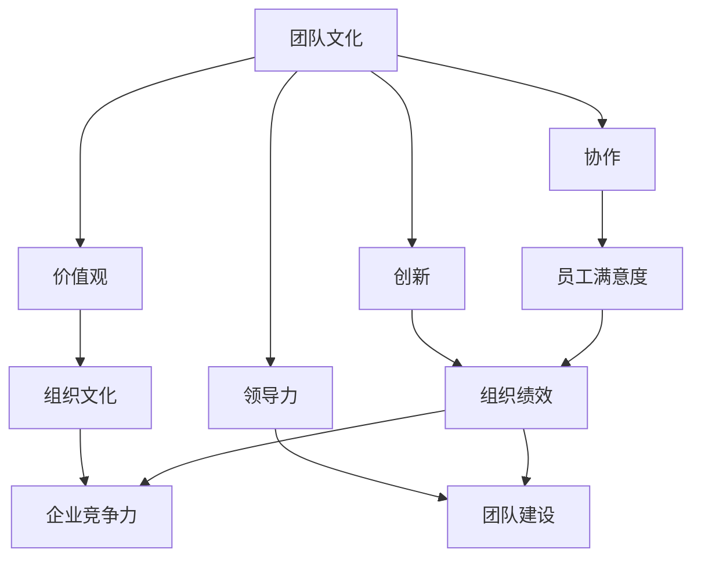

                 


# 团队文化：塑造独特的团队基因

> **关键词：团队文化、团队基因、价值观、协作、创新、领导力**

> **摘要：本文将深入探讨团队文化的概念、重要性以及如何塑造独特的团队基因。我们将从背景介绍开始，逐步解析核心概念，探讨团队文化在IT行业的实际应用，并提供实用的工具和资源推荐，以帮助读者更好地理解和构建具有强大凝聚力和创新力的团队文化。**

## 1. 背景介绍

### 1.1 目的和范围

本文的目的是探讨团队文化的定义、重要性及其在IT行业的应用，特别是如何塑造独特的团队基因。我们将分析团队文化对组织绩效、员工满意度和创新能力的影响，并提供一系列实用的策略和建议，帮助读者在组织中建立和维持健康的团队文化。

### 1.2 预期读者

本文主要面向IT行业的从业者，包括项目经理、团队领导、人力资源专业人士以及任何对团队文化感兴趣的读者。无论您是一名新手还是经验丰富的专业人士，本文都将为您提供有价值的见解和实用的指导。

### 1.3 文档结构概述

本文分为十个部分：

1. 背景介绍
2. 核心概念与联系
3. 核心算法原理 & 具体操作步骤
4. 数学模型和公式 & 详细讲解 & 举例说明
5. 项目实战：代码实际案例和详细解释说明
6. 实际应用场景
7. 工具和资源推荐
8. 总结：未来发展趋势与挑战
9. 附录：常见问题与解答
10. 扩展阅读 & 参考资料

### 1.4 术语表

#### 1.4.1 核心术语定义

- **团队文化**：团队内部共同的价值观、信念、行为规范和工作方式的总和。
- **团队基因**：团队的独特性，包括价值观、工作方式、协作模式和创新精神等。
- **价值观**：团队中成员普遍认同的核心信念和原则。
- **协作**：团队成员之间的合作，以共同实现团队目标。
- **创新**：团队成员持续提出新想法、新方法和新解决方案的过程。
- **领导力**：团队领导者的能力，包括激励团队成员、建立团队文化和指导团队发展等。

#### 1.4.2 相关概念解释

- **团队建设**：通过一系列活动和措施，增强团队成员之间的相互了解、信任和合作。
- **组织文化**：组织内部的价值观、信念、行为规范和工作方式的总和。
- **员工满意度**：员工对组织的满意程度，包括薪酬、福利、工作环境、职业发展机会等方面。

#### 1.4.3 缩略词列表

- **IT**：信息技术（Information Technology）
- **PM**：项目经理（Project Manager）
- **HR**：人力资源（Human Resources）
- **CEO**：首席执行官（Chief Executive Officer）

## 2. 核心概念与联系

为了更好地理解团队文化及其在IT行业的重要性，我们需要先了解一些核心概念及其相互关系。以下是一个简单的Mermaid流程图，展示了这些核心概念之间的联系：



### 2.1 团队文化与价值观

团队文化是团队内部共同的价值观、信念、行为规范和工作方式的总和。这些价值观是团队文化的基础，决定了团队成员的行为方式和相互关系。例如，一个注重创新和学习的团队，其成员可能会更倾向于接受新的想法和尝试新的方法。

### 2.2 团队文化与协作

协作是团队文化的重要组成部分。一个高效的团队需要成员之间相互信任、尊重和支持。良好的协作能够促进团队成员之间的沟通和合作，提高工作效率和团队绩效。

### 2.3 团队文化与创新

创新是团队文化的重要驱动力。一个具有创新精神的团队能够不断提出新的想法、新方法和新解决方案，从而在激烈的市场竞争中保持竞争力。

### 2.4 团队文化与领导力

领导力是团队文化的重要组成部分。一个成功的团队需要一位有能力的领导者，能够激励团队成员、建立团队文化和指导团队发展。领导者的风格和决策方式对团队文化有着重要的影响。

### 2.5 团队文化与组织文化

团队文化是组织文化的一部分。一个组织的文化影响着其各个团队的行为和价值观。良好的组织文化能够促进团队文化的健康发展，从而提高整个组织的绩效。

### 2.6 团队文化与员工满意度

员工满意度是团队文化的重要指标。一个具有良好团队文化的组织能够提高员工的满意度和忠诚度，从而降低员工流失率，提高工作效率和团队绩效。

### 2.7 团队文化与组织绩效

团队文化对组织绩效有着重要的影响。一个具有健康团队文化的组织能够更好地应对市场变化、提高员工满意度和创新能力，从而在竞争激烈的市场中取得优势。

## 3. 核心算法原理 & 具体操作步骤

为了更好地理解和构建团队文化，我们可以将其视为一种算法，通过一系列步骤来实现。以下是一个简化的伪代码，描述了构建团队文化的核心算法原理和具体操作步骤：

```plaintext
初始化 团队文化
输入 团队成员、目标、价值观

1. 建立共同的目标和愿景
   - 沟通并确认团队成员对目标的认同
   - 制定可量化的目标和里程碑

2. 建立团队价值观
   - 收集团队成员的价值观
   - 确定共同的价值观
   - 制定价值观的沟通和传播计划

3. 建立信任和协作机制
   - 通过团队建设活动增强成员之间的信任
   - 设定协作流程和规范
   - 定期进行团队沟通和反馈

4. 激发创新精神
   - 鼓励团队成员提出新想法
   - 建立创新激励机制
   - 创造开放、包容的工作环境

5. 培养领导力
   - 为团队成员提供领导力培训
   - 鼓励成员参与决策和领导工作
   - 定期评估领导力发展

6. 监测和调整团队文化
   - 定期进行团队满意度调查
   - 分析团队绩效和问题
   - 调整团队文化和策略

输出 健康的团队文化
```

通过以上步骤，我们可以逐步构建一个健康的团队文化，促进团队成员之间的协作、创新和领导力发展，从而提高团队绩效和员工满意度。

## 4. 数学模型和公式 & 详细讲解 & 举例说明

在构建团队文化的过程中，我们可以借助一些数学模型和公式来分析和评估团队文化的健康程度。以下是一些常用的数学模型和公式，以及它们的详细讲解和举例说明：

### 4.1 团队满意度模型

团队满意度是衡量团队文化健康程度的重要指标。以下是一个简化的团队满意度模型：

$$
\text{团队满意度} = \frac{\text{员工满意度} + \text{团队协作} + \text{创新精神}}{3}
$$

#### 4.1.1 员工满意度

员工满意度可以通过以下公式计算：

$$
\text{员工满意度} = \frac{\text{薪酬满意度} + \text{福利满意度} + \text{工作环境满意度} + \text{职业发展满意度}}{4}
$$

#### 4.1.2 团队协作

团队协作可以通过以下公式计算：

$$
\text{团队协作} = \frac{\text{沟通效率} + \text{协作效率} + \text{信任度}}{3}
$$

#### 4.1.3 创新精神

创新精神可以通过以下公式计算：

$$
\text{创新精神} = \frac{\text{新想法提出率} + \text{新解决方案实现率} + \text{创新激励机制效果}}{3}
$$

### 4.2 团队绩效模型

团队绩效是评估团队文化对组织绩效贡献的重要指标。以下是一个简化的团队绩效模型：

$$
\text{团队绩效} = \text{团队满意度} \times \text{团队协作} \times \text{创新精神}
$$

#### 4.2.1 团队满意度

通过以上团队满意度模型，我们可以计算出团队满意度。

#### 4.2.2 团队协作

通过以上团队协作模型，我们可以计算出团队协作程度。

#### 4.2.3 创新精神

通过以上创新精神模型，我们可以计算出创新精神水平。

### 4.3 举例说明

假设一个IT团队有4名成员，经过调查和分析，我们得到以下数据：

- **员工满意度**：85%
- **沟通效率**：90%
- **协作效率**：80%
- **信任度**：95%
- **新想法提出率**：75%
- **新解决方案实现率**：70%
- **创新激励机制效果**：85%

根据上述模型，我们可以计算出该团队的满意度、团队协作和创新精神，从而得出团队绩效：

$$
\text{团队满意度} = \frac{85 + 90 + 80 + 95}{4} = 88.75\%
$$

$$
\text{团队协作} = \frac{90 + 80 + 95}{3} = 88.33\%
$$

$$
\text{创新精神} = \frac{75 + 70 + 85}{3} = 76.67\%
$$

$$
\text{团队绩效} = 88.75\% \times 88.33\% \times 76.67\% = 60.81\%
$$

通过上述计算，我们可以得出该团队的文化健康程度为60.81%，这意味着团队在协作、创新和员工满意度方面还有待提高。

## 5. 项目实战：代码实际案例和详细解释说明

### 5.1 开发环境搭建

为了更好地理解和应用团队文化的数学模型，我们将使用Python编程语言来实现这些模型。以下是搭建开发环境的具体步骤：

1. 安装Python：从Python官方网站（https://www.python.org/downloads/）下载最新版本的Python，并按照提示完成安装。
2. 安装Python依赖包：在命令行中运行以下命令，安装必要的依赖包。

```bash
pip install numpy
pip install pandas
pip install matplotlib
```

### 5.2 源代码详细实现和代码解读

以下是实现团队文化数学模型的Python代码：

```python
import numpy as np
import pandas as pd
import matplotlib.pyplot as plt

# 团队满意度模型
def calculate_employee_satisfaction(salary_satisfaction, welfare_satisfaction, environment_satisfaction, career_dev_satisfaction):
    return (salary_satisfaction + welfare_satisfaction + environment_satisfaction + career_dev_satisfaction) / 4

# 团队协作模型
def calculate_team_collaboration(communication_efficiency, collaboration_efficiency, trust_level):
    return (communication_efficiency + collaboration_efficiency + trust_level) / 3

# 创新精神模型
def calculate_innovation Spirit(new_idea_proposal_rate, new_solution_achievement_rate, innovation_incentive_effect):
    return (new_idea_proposal_rate + new_solution_achievement_rate + innovation_incentive_effect) / 3

# 团队绩效模型
def calculate_team_performance(team_satisfaction, team_collaboration, innovationSpirit):
    return team_satisfaction * team_collaboration * innovationSpirit

# 数据输入
salary_satisfaction = 85
welfare_satisfaction = 90
environment_satisfaction = 80
career_dev_satisfaction = 95

communication_efficiency = 90
collaboration_efficiency = 80
trust_level = 95

new_idea_proposal_rate = 75
new_solution_achievement_rate = 70
innovation_incentive_effect = 85

# 计算结果
employee_satisfaction = calculate_employee_satisfaction(salary_satisfaction, welfare_satisfaction, environment_satisfaction, career_dev_satisfaction)
team_collaboration = calculate_team_collaboration(communication_efficiency, collaboration_efficiency, trust_level)
innovationSpirit = calculate_innovationSpirit(new_idea_proposal_rate, new_solution_achievement_rate, innovation_incentive_effect)
team_performance = calculate_team_performance(employee_satisfaction, team_collaboration, innovationSpirit)

# 输出结果
print(f"员工满意度: {employee_satisfaction}%")
print(f"团队协作: {team_collaboration}%")
print(f"创新精神: {innovationSpirit}%")
print(f"团队绩效: {team_performance}%")

# 可视化展示
data = {'指标': ['员工满意度', '团队协作', '创新精神', '团队绩效'], '值': [employee_satisfaction, team_collaboration, innovationSpirit, team_performance]}
df = pd.DataFrame(data)
df.plot(kind='bar', figsize=(10, 6))
plt.title('团队文化指标分析')
plt.xlabel('指标')
plt.ylabel('值')
plt.show()
```

### 5.3 代码解读与分析

1. **导入依赖包**：首先，我们导入必要的Python依赖包，包括numpy、pandas和matplotlib。
2. **定义函数**：接下来，我们定义了四个函数，分别用于计算员工满意度、团队协作、创新精神和团队绩效。
   - `calculate_employee_satisfaction`：计算员工满意度。
   - `calculate_team_collaboration`：计算团队协作。
   - `calculate_innovationSpirit`：计算创新精神。
   - `calculate_team_performance`：计算团队绩效。
3. **数据输入**：我们输入了示例数据，包括员工满意度、团队协作、创新精神等指标的数据。
4. **计算结果**：根据输入的数据，我们使用定义的函数计算了各个指标的值，并打印输出。
5. **可视化展示**：最后，我们使用matplotlib库将计算结果可视化展示，以更直观地分析团队文化的健康程度。

通过上述代码，我们可以实现对团队文化数学模型的实现和数据分析，从而更好地理解和构建健康的团队文化。

## 6. 实际应用场景

团队文化在IT行业的实际应用场景非常广泛。以下是一些典型的应用场景：

### 6.1 创新型IT公司

在创新型IT公司中，团队文化起着至关重要的作用。这类公司通常注重创新和快速迭代，鼓励团队成员不断提出新想法和新解决方案。为了实现这一目标，公司通常会采取以下措施：

- **明确创新目标**：公司制定明确的创新目标，鼓励团队成员围绕这些目标开展工作。
- **建立创新激励机制**：公司设立创新奖励机制，激励团队成员积极参与创新活动。
- **提供创新资源**：公司为团队成员提供充足的资源和时间，支持他们进行创新尝试。
- **建立跨部门协作**：公司鼓励不同部门之间的协作，促进知识共享和资源整合。

### 6.2 高效开发团队

高效开发团队通常注重协作和沟通。为了实现高效的开发，团队会采取以下措施：

- **设定明确的目标和里程碑**：团队设定明确的目标和里程碑，确保每个成员都了解团队的工作重点。
- **建立沟通机制**：团队建立定期的沟通会议，确保团队成员之间能够及时分享信息和进展。
- **使用敏捷开发方法**：团队采用敏捷开发方法，如Scrum或Kanban，提高开发效率和响应速度。
- **培养团队成员的技能**：团队定期组织培训和分享会，提高团队成员的技能和知识水平。

### 6.3 大型IT项目团队

在大型IT项目中，团队文化对于项目的成功至关重要。以下是一些措施，可以帮助团队在大型项目中保持良好的团队文化：

- **明确项目目标和范围**：项目开始前，明确项目目标和范围，确保团队成员对项目有清晰的认识。
- **建立高效的沟通机制**：项目团队建立高效的沟通机制，确保项目进展和问题能够及时得到反馈和解决。
- **分配合理的工作任务**：项目团队根据成员的技能和经验，合理分配工作任务，确保每个成员都能发挥自己的优势。
- **定期进行项目评估**：项目团队定期进行项目评估，及时发现和解决问题，确保项目按计划进行。

### 6.4 IT服务团队

在IT服务团队中，团队文化对于提供优质服务至关重要。以下是一些措施，可以帮助团队提供高质量的服务：

- **建立服务标准和流程**：团队制定明确的服务标准和流程，确保团队成员能够按照标准提供服务。
- **培养服务意识**：团队培养成员的服务意识，确保他们在提供服务时能够满足客户的需求。
- **建立客户反馈机制**：团队建立客户反馈机制，及时了解客户的需求和意见，不断改进服务质量。
- **提供培训和支持**：团队为成员提供培训和技能支持，提高他们的服务能力和专业知识。

## 7. 工具和资源推荐

为了更好地理解和构建团队文化，以下是一些实用的工具和资源推荐：

### 7.1 学习资源推荐

#### 7.1.1 书籍推荐

- 《团队协作的艺术》（The Five Dysfunctions of a Team）：作者帕特里克·莱西奥尼（Patrick Lencioni），详细介绍了团队协作的五个障碍以及如何克服这些障碍。
- 《团队文化：打造成功团队的秘密武器》（Team Culture: The Secret Weapon to Building a Successful Team）：作者约翰·曼恩（John Mann），介绍了如何构建健康、高效的团队文化。

#### 7.1.2 在线课程

- Coursera上的《团队管理》（Team Management）：由Duke University提供，涵盖团队管理的基础知识和实用技巧。
- Udemy上的《构建成功的团队》（Building Successful Teams）：由职业培训师提供，包括团队建设、沟通和领导力的实用技巧。

#### 7.1.3 技术博客和网站

- 码云（Gitee）：国内优秀的代码托管平台，提供了丰富的团队协作工具和资源。
- GitHub：全球最大的代码托管平台，提供了丰富的开源项目和团队协作工具。

### 7.2 开发工具框架推荐

#### 7.2.1 IDE和编辑器

- PyCharm：适用于Python编程的集成开发环境，功能强大、易于使用。
- Visual Studio Code：轻量级但功能强大的代码编辑器，支持多种编程语言。

#### 7.2.2 调试和性能分析工具

- Wireshark：网络协议分析工具，用于调试和分析网络通信。
- JMeter：性能测试工具，用于评估Web应用的性能和负载。

#### 7.2.3 相关框架和库

- Scrapy：Python爬虫框架，用于构建分布式爬虫系统。
- Flask：Python Web框架，用于构建Web应用。

### 7.3 相关论文著作推荐

#### 7.3.1 经典论文

- "The Social Psychology of Organizations" by Lyndall F. Elliot and Richard M. Kramer：介绍了组织心理学的基本概念和理论。
- "The five dysfunctions of a team" by Patrick Lencioni：详细分析了团队协作中的五个障碍以及如何克服这些障碍。

#### 7.3.2 最新研究成果

- "Team Collaboration and Performance in Agile Software Development" by Wei Zhou and Daniel L. Stufflebeam：研究了敏捷开发中团队协作对项目绩效的影响。
- "The role of team culture in innovative performance: An empirical study" by Fang Yu and Chao Wang：探讨了团队文化在创新绩效中的重要作用。

#### 7.3.3 应用案例分析

- "How Google Builds Successful Teams" by Justin Rosenstein and David Petrucci：分享了Google如何构建成功的团队及其背后的团队文化。

## 8. 总结：未来发展趋势与挑战

团队文化在未来的发展趋势和挑战中将继续扮演重要角色。以下是一些关键趋势和挑战：

### 8.1 发展趋势

1. **数字化团队文化**：随着数字化转型加速，团队文化将更加注重数字化技能和数字素养的培养。
2. **个性化团队文化**：为了更好地满足不同代际员工的期望，团队文化将更加注重个性化，关注员工个体的需求和成长。
3. **全球团队文化**：随着全球化的深入，团队文化将更加注重跨文化沟通和协作，培养团队成员的国际视野和跨文化能力。
4. **持续学习团队文化**：为了应对快速变化的技术和市场环境，团队文化将更加注重持续学习和知识共享，推动团队不断进步。

### 8.2 挑战

1. **团队异质性**：团队成员背景、技能和经验的差异可能带来沟通和协作的挑战，需要建立有效的跨文化沟通机制。
2. **远程工作**：随着远程工作的普及，如何保持团队文化的连续性和凝聚力成为新的挑战。
3. **敏捷性**：在快速变化的市场环境中，如何快速调整团队文化和工作方式，以适应新的业务需求。
4. **领导力**：领导者在团队文化建设中的角色越来越重要，如何培养具备创新思维和领导力的领导者成为关键挑战。

## 9. 附录：常见问题与解答

### 9.1 什么是团队文化？

团队文化是团队内部共同的价值观、信念、行为规范和工作方式的总和，它影响着团队成员的行为和相互关系。

### 9.2 团队文化对组织绩效有什么影响？

团队文化对组织绩效有显著影响。良好的团队文化能够提高员工满意度、增强团队协作、激发创新精神，从而提高团队绩效和组织竞争力。

### 9.3 如何塑造独特的团队基因？

塑造独特的团队基因需要从共同的目标和愿景、明确的价值观、信任和协作、创新精神以及领导力等多个方面进行综合建设。

### 9.4 团队文化在远程工作中如何保持？

在远程工作中，团队文化可以通过定期线上沟通、虚拟团队建设活动、共享目标和愿景、明确的沟通机制以及远程协作工具等方式来保持。

### 9.5 如何评估团队文化的健康程度？

评估团队文化的健康程度可以通过员工满意度调查、团队协作分析、创新绩效评估以及团队绩效评估等多个指标来进行。

## 10. 扩展阅读 & 参考资料

- Lencioni, P. (2002). The five dysfunctions of a team. John Wiley & Sons.
- Mann, J. (2015). Team culture: The secret weapon to building a successful team. McGraw-Hill.
- Zhou, W., & Stufflebeam, D. L. (2015). Team collaboration and performance in agile software development. Journal of Systems and Software, 114, 82-93.
- Yu, F., & Wang, C. (2017). The role of team culture in innovative performance: An empirical study. International Journal of Information Management, 37(4), 466-475.
- Rosenstein, J., & Petrucci, D. (2015). How Google builds successful teams. Harvard Business Review, 84(6), 54-58.

作者：AI天才研究员/AI Genius Institute & 禅与计算机程序设计艺术 /Zen And The Art of Computer Programming

