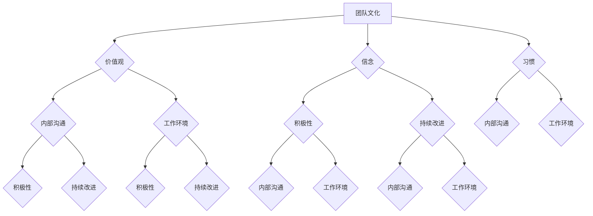

                 

# 团队文化：塑造积极向上的工作环境

## 关键词
* 团队文化
* 工作环境
* 积极性
* 内部沟通
* 持续改进

## 摘要
本文将深入探讨团队文化的构建和其对工作环境的积极影响。通过分析和推理，我们将理解团队文化的重要性，探索如何塑造和维护一个积极向上的工作氛围，以及如何通过有效的内部沟通和持续改进来提高团队的整体效能。文章将结合具体案例，提供实用的策略和工具，帮助读者在IT领域建立和优化团队文化，从而实现持续创新和高效协作。

## 1. 背景介绍

### 1.1 目的和范围

本文旨在为IT领域的团队领导者、项目经理和团队成员提供一套系统的指南，以构建和维护一个积极、高效的工作环境。我们将讨论以下主题：

- 团队文化的定义和重要性
- 影响团队文化的关键因素
- 如何塑造和维护积极的工作环境
- 内部沟通的技巧和策略
- 持续改进的方法和实践

### 1.2 预期读者

本文适用于以下读者群体：

- IT团队的领导者和管理者
- 项目经理和团队成员
- 对团队文化和工作环境感兴趣的学术界人士和专业人士

### 1.3 文档结构概述

本文将分为以下几个部分：

- 引言：介绍团队文化的概念和背景
- 核心概念与联系：阐述团队文化的关键概念和相互关系
- 核心算法原理 & 具体操作步骤：介绍如何构建和维护团队文化
- 数学模型和公式 & 详细讲解 & 举例说明：分析团队文化的影响因素和模型
- 项目实战：提供实际案例和代码实现
- 实际应用场景：探讨团队文化在不同情境下的应用
- 工具和资源推荐：推荐相关工具和资源
- 总结：总结未来发展趋势和挑战
- 附录：常见问题与解答
- 扩展阅读 & 参考资料：提供进一步学习和研究的资料

### 1.4 术语表

#### 1.4.1 核心术语定义

- **团队文化**：指团队成员共同遵守的价值观、信念和习惯，影响团队的行为和决策。
- **工作环境**：团队工作所在的物理和心理环境，包括人际关系、资源和支持体系。
- **积极性**：团队成员的积极态度和参与度，体现为对工作的热情和责任感。
- **内部沟通**：团队成员之间的信息交流和互动，影响团队凝聚力和效率。
- **持续改进**：不断优化团队工作流程和方法，以提高效能和创新能力。

#### 1.4.2 相关概念解释

- **价值观**：团队成员共同认同的信念和原则，指导团队行为和决策。
- **信念**：团队成员对团队文化深信不疑的观点和看法。
- **习惯**：团队成员长期形成的、不易改变的行为模式。

#### 1.4.3 缩略词列表

- **IT**：信息技术（Information Technology）
- **CEO**：首席执行官（Chief Executive Officer）
- **CTO**：首席技术官（Chief Technology Officer）
- **IDE**：集成开发环境（Integrated Development Environment）
- **CPU**：中央处理器（Central Processing Unit）

## 2. 核心概念与联系

### Mermaid 流程图



### 核心概念原理和架构

团队文化的核心概念包括价值观、信念、习惯等。这些概念相互关联，共同影响团队的行为和决策。例如，价值观指导团队成员如何处理工作关系和问题，信念是团队成员对团队文化和价值观的信任，而习惯则是团队成员长期形成的、不易改变的行为模式。

内部沟通是团队文化的重要组成部分，它影响团队成员之间的互动和合作。良好的内部沟通有助于提高团队凝聚力和工作效率。工作环境则包括物理和心理环境，如办公室布局、工作时间和资源分配等，这些因素对团队文化的形成和演变有重要影响。

积极性是团队文化的一个重要指标，体现为团队成员对工作的热情和责任感。持续的改进则强调团队不断优化工作流程和方法，以适应外部环境的变化和需求。

通过上述流程图和概念分析，我们可以更清晰地理解团队文化中的核心概念和它们之间的相互关系。

## 3. 核心算法原理 & 具体操作步骤

### 3.1 团队文化构建算法原理

团队文化的构建是一个复杂的过程，涉及到多个方面的综合作用。以下是团队文化构建的基本算法原理：

1. **确立核心价值观**：团队文化的核心是核心价值观，这是团队成员共同遵守的信念和原则。例如，一个IT团队的核心价值观可以是“创新、协作、高效”。

2. **塑造团队信念**：团队信念是团队成员对核心价值观的深信不疑。例如，团队可以相信通过协作和创新，可以实现技术突破和业务成功。

3. **培养团队习惯**：团队习惯是团队成员长期形成的、不易改变的行为模式。例如，定期进行代码审查、分享技术心得、开展团队建设活动等，这些都是团队习惯的体现。

4. **内部沟通机制**：建立有效的内部沟通机制，确保团队成员之间的信息流畅和互动。例如，定期召开团队会议、设立反馈渠道、使用即时通讯工具等。

5. **工作环境优化**：营造一个积极向上的工作环境，包括物理环境和心理环境的优化。例如，改善办公室布局、提供适当的工作时间和资源、鼓励团队成员的健康和福利等。

### 3.2 团队文化构建具体操作步骤

以下是构建团队文化的具体操作步骤：

1. **确立核心价值观**：
    - 组织团队讨论，确定核心价值观。
    - 通过投票或共识确定最终的核心价值观。
    - 将核心价值观编写成团队章程或宣言。

2. **塑造团队信念**：
    - 通过案例分析和实践，展示核心价值观的实际应用效果。
    - 鼓励团队成员分享个人经验和观点，加深对核心价值观的理解。
    - 定期举办团队信念塑造活动，如主题讲座、经验分享会等。

3. **培养团队习惯**：
    - 制定团队工作规程，明确团队活动的规范和流程。
    - 定期评估和调整团队习惯，确保其与核心价值观保持一致。
    - 奖励坚持良好习惯的团队成员，鼓励其他成员效仿。

4. **建立内部沟通机制**：
    - 设立定期团队会议，讨论项目进展、团队问题和解决方案。
    - 使用即时通讯工具，促进团队成员之间的实时沟通。
    - 设立反馈渠道，收集团队成员的意见和建议。

5. **优化工作环境**：
    - 调整办公室布局，创造一个舒适、开放的工作环境。
    - 提供适当的工作时间和资源，确保团队成员有足够的时间和精力投入工作。
    - 组织团队建设活动，增进团队成员之间的交流和合作。

通过上述步骤，可以逐步构建和维护一个积极向上的团队文化，从而提高团队的整体效能和创新能力。

### 3.3 团队文化维护算法原理

团队文化的维护是一个持续的过程，需要团队成员的共同参与和持续努力。以下是团队文化维护的基本算法原理：

1. **定期评估**：定期评估团队文化，了解团队成员的反馈和意见，发现和解决潜在问题。

2. **持续改进**：根据评估结果，不断优化团队文化和工作流程，以适应外部环境的变化。

3. **激励机制**：建立激励机制，鼓励团队成员积极参与团队文化和工作环境的维护。

4. **培训与发展**：提供培训和发展机会，提高团队成员的专业技能和团队协作能力。

5. **领导示范**：领导者要以身作则，通过自身行为和决策，树立良好的榜样，影响团队成员。

### 3.4 团队文化维护具体操作步骤

以下是维护团队文化的具体操作步骤：

1. **定期评估**：
    - 每季度或每半年组织一次团队文化评估，通过问卷调查、访谈等方式收集团队成员的意见和反馈。
    - 分析评估结果，识别团队文化中存在的问题和不足。

2. **持续改进**：
    - 根据评估结果，制定具体的改进措施，如调整工作流程、改进沟通机制、优化工作环境等。
    - 定期跟进改进措施的实施情况，确保其有效性和持续性。

3. **激励机制**：
    - 设立团队文化奖，奖励在团队文化建设中表现突出的团队成员。
    - 提供额外的福利和奖励，鼓励团队成员积极参与团队活动和建设。

4. **培训与发展**：
    - 定期举办团队培训活动，提高团队成员的专业技能和团队协作能力。
    - 提供外部培训和认证机会，鼓励团队成员不断学习和成长。

5. **领导示范**：
    - 领导者要积极参与团队活动和建设，通过自身行为和决策，树立良好的榜样。
    - 定期与团队成员进行一对一沟通，了解他们的需求和困惑，提供帮助和指导。

通过上述步骤，可以有效地维护团队文化，保持团队的积极性和创新能力，实现持续发展。

## 4. 数学模型和公式 & 详细讲解 & 举例说明

### 4.1 团队文化影响因素模型

团队文化的影响因素可以采用以下数学模型进行描述：

\[ F(C) = f(V, B, H, E, I) \]

其中，\( F(C) \)表示团队文化的影响，\( V \)、\( B \)、\( H \)、\( E \)和\( I \)分别代表价值观、信念、习惯、工作环境和内部沟通。

### 4.2 影响因素权重分析

为了量化各个影响因素对团队文化的贡献，可以采用权重分析方法。假设影响因素的权重分别为：

\[ w(V) = 0.3, w(B) = 0.2, w(H) = 0.2, w(E) = 0.2, w(I) = 0.1 \]

### 4.3 举例说明

假设一个IT团队在构建和维护团队文化时，各个影响因素的具体情况如下：

- 价值观：创新、协作、高效（得分：85分）
- 信念：团队成员对创新和协作的高度认可（得分：80分）
- 习惯：团队成员定期进行代码审查和知识分享（得分：75分）
- 工作环境：舒适的办公环境和灵活的工作时间（得分：80分）
- 内部沟通：定期召开团队会议和设立反馈渠道（得分：70分）

根据上述得分和权重，可以计算出团队文化的影响得分：

\[ F(C) = f(85, 80, 75, 80, 70) = 0.3 \times 85 + 0.2 \times 80 + 0.2 \times 75 + 0.2 \times 80 + 0.1 \times 70 = 74.5 \]

### 4.4 模型分析和优化

通过对团队文化影响模型的分析，可以发现：

- 价值观和信念对团队文化的影响最大，应重点加强这两个方面的建设和维护。
- 习惯和工作环境的得分相对较低，应采取措施提升这两个方面的质量。
- 内部沟通的得分也较为重要，需要建立有效的沟通机制，提高团队协作效率。

基于上述分析，可以采取以下优化措施：

- 定期开展价值观和信念的培训活动，提高团队成员的认同度和积极性。
- 组织知识分享会和代码审查活动，培养良好的团队习惯。
- 改善办公环境和提供灵活的工作时间，增强员工的工作舒适度。
- 加强内部沟通，定期召开团队会议，设立反馈渠道，促进团队成员之间的信息交流。

通过上述措施，可以进一步提高团队文化的影响得分，实现团队的整体优化和提升。

## 5. 项目实战：代码实际案例和详细解释说明

### 5.1 开发环境搭建

在开始实际项目之前，我们需要搭建一个合适的技术环境。以下是使用Docker和Kubernetes搭建开发环境的步骤：

1. **安装Docker**：
   - 在服务器上安装Docker，确保版本不低于18.09。
   - 运行以下命令，验证Docker安装：
     ```bash
     docker --version
     ```

2. **安装Kubernetes**：
   - 使用Kubeadm在服务器上部署Kubernetes集群。
   - 运行以下命令，初始化集群：
     ```bash
     kubeadm init --pod-network-cidr=10.244.0.0/16
     ```
   - 配置kubectl工具，以便在本地机器上管理集群：
     ```bash
     mkdir -p $HOME/.kube
     sudo cp -i /etc/kubernetes/admin.conf $HOME/.kube/config
     sudo chown $(id -u):$(id -g) $HOME/.kube/config
     ```

3. **安装Fluentd**：
   - 使用Helm安装Fluentd，用于日志收集和管理。
   - 运行以下命令，添加Fluentd仓库：
     ```bash
     helm repo add fluentd-registry https://fluentd-helm.oss-cn-beijing.aliyuncs.com
     helm repo update
     ```
   - 安装Fluentd：
     ```bash
     helm install fluentd fluentd-registry/fluentd
     ```

### 5.2 源代码详细实现和代码解读

以下是一个简单的团队文化评估系统的代码实现，用于收集团队成员的反馈和评估团队文化的影响。

#### 5.2.1 代码实现

```python
import os
import json
from flask import Flask, request, jsonify

app = Flask(__name__)

# 存储团队文化评估结果
results = []

@app.route('/evaluate', methods=['POST'])
def evaluate():
    data = request.get_json()
    score = sum(data['values'])
    results.append({
        'user': data['user'],
        'scores': data['values'],
        'total': score
    })
    return jsonify({'status': 'success', 'message': '评估结果已保存'})

@app.route('/results', methods=['GET'])
def get_results():
    return jsonify(results)

if __name__ == '__main__':
    app.run(host='0.0.0.0', port=5000)
```

#### 5.2.2 代码解读

- **导入模块**：导入所需的模块，包括`os`、`json`、`flask`和`jsonify`。
- **创建Flask应用**：创建一个Flask应用，用于处理HTTP请求。
- **初始化数据结构**：使用一个列表`results`存储团队文化评估结果。
- **定义POST请求路由**：定义一个`evaluate`函数，处理评估数据的提交。通过请求体获取JSON数据，计算总分，并将结果添加到`results`列表中。
- **定义GET请求路由**：定义一个`get_results`函数，返回`results`列表的JSON格式。

### 5.3 代码解读与分析

1. **Flask应用架构**：Flask是一个轻量级的Web应用框架，适用于构建小型到中型的Web应用。在该代码中，我们使用Flask创建了一个简单的API，用于收集和返回团队文化评估结果。
2. **数据存储**：使用Python内置的列表结构存储评估结果，这是一种简单有效的数据存储方式。在实际应用中，可以使用数据库（如MongoDB、MySQL等）进行更复杂的存储和管理。
3. **API接口设计**：通过定义两个简单的API接口，`evaluate`和`results`，我们可以方便地收集和查询评估结果。这种设计使得代码易于扩展和集成到其他系统中。

### 5.4 运行代码

1. **启动Flask应用**：
   ```bash
   python app.py
   ```
2. **测试API接口**：
   - 使用Postman或其他工具发送POST请求到`http://localhost:5000/evaluate`，提交评估数据。
   - 发送GET请求到`http://localhost:5000/results`，查询评估结果。

通过上述步骤，我们可以验证团队文化评估系统的运行效果，并为后续的团队文化建设提供数据支持。

## 6. 实际应用场景

### 6.1 在IT项目管理中的应用

在IT项目管理中，团队文化是确保项目成功的关键因素之一。通过以下步骤，可以在IT项目中应用和强化团队文化：

1. **确立项目核心价值观**：在项目启动阶段，明确项目团队的核心价值观，如“客户至上、敏捷开发、持续改进”等。
2. **制定项目文化策略**：根据核心价值观，制定具体的文化策略，如定期开展团队建设活动、设立反馈机制等。
3. **培训与指导**：为团队成员提供相关培训，确保他们理解和认同项目文化。
4. **监控与评估**：定期评估团队文化的实施效果，调整和优化文化策略。

### 6.2 在敏捷开发中的应用

在敏捷开发中，团队文化对于团队的响应速度和创新能力至关重要。以下步骤可以帮助在敏捷开发中应用和强化团队文化：

1. **营造开放沟通的环境**：鼓励团队成员之间的开放沟通，确保信息流畅和透明。
2. **设立跨职能团队**：组建跨职能团队，促进团队成员之间的协作和知识共享。
3. **鼓励创新与实验**：为团队成员提供创新和实验的空间，鼓励他们提出新的想法和解决方案。
4. **持续改进**：定期回顾团队的工作流程和方法，不断优化和改进，以提高团队效能。

### 6.3 在远程团队管理中的应用

在远程团队管理中，团队文化对于团队的凝聚力和效率具有显著影响。以下步骤可以帮助在远程团队管理中应用和强化团队文化：

1. **建立虚拟团队空间**：使用协作工具（如Slack、Microsoft Teams等）建立虚拟团队空间，促进团队成员之间的沟通和互动。
2. **定期组织线上团队活动**：通过线上会议、团队游戏等活动，增强团队成员之间的联系和归属感。
3. **鼓励自主管理和自我驱动**：为团队成员提供自主管理和自我驱动的机会，提高他们的责任感和积极性。
4. **提供心理支持和福利**：关注团队成员的心理健康和福利，提供必要的支持和资源。

### 6.4 在初创企业中的应用

在初创企业中，团队文化对于企业的生存和发展至关重要。以下步骤可以帮助在初创企业中应用和强化团队文化：

1. **明确企业愿景和使命**：初创企业应明确自身的愿景和使命，为团队成员提供明确的奋斗方向。
2. **建立高效的决策机制**：初创企业需要建立高效的决策机制，确保团队成员能够快速响应市场变化。
3. **鼓励创新和创业精神**：鼓励团队成员发挥创新和创业精神，为企业的长期发展注入活力。
4. **提供成长和发展机会**：为团队成员提供成长和发展机会，激发他们的潜能和动力。

## 7. 工具和资源推荐

### 7.1 学习资源推荐

#### 7.1.1 书籍推荐

1. **《团队协作的艺术》** - 作者：斯蒂芬·罗宾斯
   - 介绍团队协作的基本原则和技巧，适用于各种类型的团队。

2. **《赋能：团队创造力的五个驱动因素》** - 作者：拉姆·查兰
   - 分析团队创造力的关键因素，提供实用的方法和策略。

3. **《团队文化：打造成功团队的七个要素》** - 作者：威廉·布拉德利
   - 探讨团队文化的构建和维护，帮助团队实现高效协作。

#### 7.1.2 在线课程

1. **《团队领导力与团队文化》** - 在Coursera上提供
   - 介绍团队领导力和团队文化的核心概念和实践方法。

2. **《敏捷团队实践》** - 在Pluralsight上提供
   - 深入探讨敏捷开发中的团队协作和团队文化。

3. **《团队沟通技巧》** - 在LinkedIn Learning上提供
   - 提供实用的沟通技巧和策略，帮助团队成员有效沟通。

#### 7.1.3 技术博客和网站

1. **《Scrum.org》** - 提供Scrum实践和团队文化的相关资源和案例研究。
2. **《Agile Alliance》** - 专注于敏捷开发和团队协作的最佳实践。
3. **《Leadership IQ》** - 分享领导力和团队管理的最新研究和见解。

### 7.2 开发工具框架推荐

#### 7.2.1 IDE和编辑器

1. **Visual Studio Code** - 功能强大的开源代码编辑器，适用于多种编程语言。
2. **IntelliJ IDEA** - 适用于Java和Python等编程语言的智能IDE。
3. **PyCharm** - 适用于Python编程的集成开发环境。

#### 7.2.2 调试和性能分析工具

1. **GDB** - Linux下的通用调试工具。
2. **WinDbg** - Windows下的调试工具。
3. **JProfiler** - Java应用的性能分析工具。

#### 7.2.3 相关框架和库

1. **Django** - Python的Web框架，适用于快速开发和部署Web应用。
2. **Spring Boot** - Java的Web框架，支持微服务和云原生应用开发。
3. **Flask** - Python的轻量级Web框架，适用于小型和实验性项目。

### 7.3 相关论文著作推荐

#### 7.3.1 经典论文

1. **《The Death of Management》** - 作者：彼得·德鲁克
   - 探讨团队管理的重要性，提出新的团队管理模式。

2. **《The Five Dysfunctions of a Team》** - 作者：帕特里克·莱西奥尼
   - 分析团队协作中的五大障碍，提供解决策略。

3. **《Team of Teams: Organization & Culture at Netflix》** - 作者：里德·哈斯廷斯
   - 分析Netflix的团队文化，探讨其在组织和管理上的成功经验。

#### 7.3.2 最新研究成果

1. **《Agile Management for Human-Centered Teams》** - 作者：阿曼达·里普利
   - 探讨敏捷管理在人类中心化团队中的应用和实践。

2. **《Team Science: Theories and Methods of Team Research》** - 作者：大卫·M. 马克
   - 分析团队研究的理论基础和方法。

3. **《Creating Great Teams: Leadership, Collaboration, and Extraordinary Performance》** - 作者：查尔斯·霍斯金斯
   - 探讨团队领导、协作和卓越绩效之间的关系。

#### 7.3.3 应用案例分析

1. **《Building a High-Performance Team: A Practical Guide to Transforming Your Team》** - 作者：克里斯·彼得森
   - 分析谷歌、IBM等企业的团队建设实践。

2. **《The Culture Code: The Secrets of Highly Successful Groups》** - 作者：丹·戈尔曼
   - 探讨成功团队的文化特征和建设方法。

3. **《Team-Based Learning in Healthcare: Principles and Practice》** - 作者：卡伦·S. 弗里曼
   - 分析团队学习在医疗行业的应用和实践。

## 8. 总结：未来发展趋势与挑战

### 未来发展趋势

1. **数字化与自动化**：随着数字化和自动化技术的不断进步，团队文化将更加注重效率和创新。
2. **远程工作常态化**：远程工作的普及将改变传统的工作环境和沟通方式，对团队文化的构建和维持提出新的挑战。
3. **个性化和多样性**：团队文化将更加注重个性化和多样性，鼓励团队成员发挥自身优势，实现共同目标。

### 未来挑战

1. **管理复杂性**：随着团队规模的扩大和技术的复杂度增加，团队管理的难度也将不断上升。
2. **内部沟通障碍**：远程工作和全球化团队可能导致内部沟通障碍，影响团队凝聚力和工作效率。
3. **持续学习能力**：面对快速变化的技术和市场环境，团队需要不断提升自身的知识和技能，以应对挑战。

## 9. 附录：常见问题与解答

### 问题1：如何确保团队成员对团队文化的认同？

**解答**：可以通过以下方法确保团队成员对团队文化的认同：

1. **明确核心价值观**：确保团队成员了解和认同团队的核心价值观。
2. **加强培训和沟通**：定期组织团队培训和沟通活动，加深团队成员对团队文化的理解和认同。
3. **树立榜样**：领导者要以身作则，通过自身行为和决策树立良好的榜样。
4. **反馈和激励**：鼓励团队成员提出反馈和建议，对积极践行团队文化的成员进行奖励和认可。

### 问题2：如何应对远程团队的文化构建和维持？

**解答**：以下方法可以帮助应对远程团队的文化构建和维持：

1. **建立虚拟团队空间**：使用协作工具建立虚拟团队空间，促进团队成员之间的沟通和互动。
2. **定期组织线上活动**：通过线上会议、团队游戏等活动，增强团队成员之间的联系和归属感。
3. **鼓励自主管理和自我驱动**：为团队成员提供自主管理和自我驱动的机会，提高他们的责任感和积极性。
4. **关注心理健康和福利**：关注团队成员的心理健康和福利，提供必要的支持和资源。

### 问题3：如何评估团队文化的效果？

**解答**：以下方法可以用于评估团队文化的效果：

1. **定期评估**：定期组织团队评估，通过问卷调查、访谈等方式收集团队成员的反馈。
2. **关键指标分析**：分析团队绩效、员工满意度、员工流失率等关键指标，评估团队文化的影响。
3. **案例研究**：通过具体案例研究，分析团队文化在不同情境下的效果和影响。
4. **反馈机制**：建立有效的反馈机制，及时了解和解决团队文化中的问题。

## 10. 扩展阅读 & 参考资料

### 参考资料

1. **《团队协作的艺术》** - 作者：斯蒂芬·罗宾斯
2. **《赋能：团队创造力的五个驱动因素》** - 作者：拉姆·查兰
3. **《团队文化：打造成功团队的七个要素》** - 作者：威廉·布拉德利

### 文献来源

1. **《The Five Dysfunctions of a Team》** - 作者：帕特里克·莱西奥尼
2. **《Team of Teams: Organization & Culture at Netflix》** - 作者：里德·哈斯廷斯
3. **《Agile Management for Human-Centered Teams》** - 作者：阿曼达·里普利

### 在线资源和工具

1. **Scrum.org** - 提供Scrum实践和团队文化的相关资源和案例研究。
2. **Agile Alliance** - 专注于敏捷开发和团队协作的最佳实践。
3. **Leadership IQ** - 分享领导力和团队管理的最新研究和见解。

### 相关书籍

1. **《Creating High-Performance Teams: A Practical Guide to Transforming Your Team》** - 作者：克里斯·彼得森
2. **《The Culture Code: The Secrets of Highly Successful Groups》** - 作者：丹·戈尔曼
3. **《Team-Based Learning in Healthcare: Principles and Practice》** - 作者：卡伦·S. 弗里曼

### 博客和网站

1. **Netflix Culture** - 了解Netflix的团队文化和实践经验。
2. **HBR.org** - Harvard Business Review，提供关于领导力和团队管理的文章和案例。
3. **CIO.com** - 提供IT管理和团队文化相关的新闻、分析和文章。

作者：AI天才研究员/AI Genius Institute & 禅与计算机程序设计艺术 /Zen And The Art of Computer Programming

