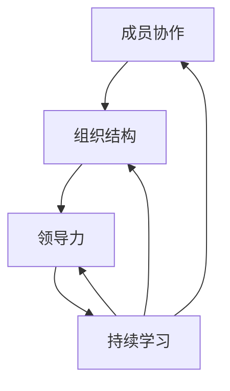

                 

# 团队韧性培养计划：增强应对挑战的集体能力

> **关键词：团队韧性，挑战应对，集体能力，韧性训练，挑战管理**
>
> **摘要：本文将深入探讨团队韧性的概念及其在应对各种挑战中的重要作用。我们将分析团队韧性培养的必要性和策略，并通过实际案例来展示韧性训练的具体实践方法。文章还将推荐一些相关资源，帮助读者在团队建设中提升韧性，以更好地应对未来的挑战。**

## 1. 背景介绍

### 1.1 目的和范围

本文旨在为IT行业从业者提供一个全面的团队韧性培养指南，帮助团队在面对复杂挑战时保持高效和稳定。我们将讨论团队韧性的重要性，并介绍一系列实用的方法和工具，以帮助团队提升其应对各种不确定性和突发情况的能力。

### 1.2 预期读者

本文面向IT项目经理、团队领导、以及所有对提升团队韧性感兴趣的读者。无论您是经验丰富的IT专家还是初入行的新手，本文都将为您提供实用的见解和策略。

### 1.3 文档结构概述

本文结构如下：

- **第1章：背景介绍**：介绍文章的目的、预期读者和文档结构。
- **第2章：核心概念与联系**：定义团队韧性的核心概念，并提供相关的流程图和原理。
- **第3章：核心算法原理与操作步骤**：详细阐述增强团队韧性的算法原理和具体步骤。
- **第4章：数学模型和公式**：介绍用于评估团队韧性的数学模型，并提供示例说明。
- **第5章：项目实战**：通过实际代码案例，展示如何将理论应用到实践中。
- **第6章：实际应用场景**：探讨团队韧性在现实环境中的应用。
- **第7章：工具和资源推荐**：推荐相关书籍、在线课程、技术博客和开发工具。
- **第8章：总结**：讨论未来发展趋势与挑战。
- **第9章：附录**：常见问题与解答。
- **第10章：扩展阅读**：提供进一步学习的参考资料。

### 1.4 术语表

#### 1.4.1 核心术语定义

- **团队韧性**：团队在面对压力和挑战时保持高效和稳定的能力。
- **挑战**：任何可能影响团队目标实现的负面因素或事件。
- **韧性训练**：通过一系列策略和工具，提升团队应对挑战的能力。

#### 1.4.2 相关概念解释

- **韧性**：个体或系统在面对压力时保持稳定和适应性的能力。
- **挑战管理**：通过策略和工具，帮助团队有效地识别、响应和解决挑战。

#### 1.4.3 缩略词列表

- **IT**：信息技术（Information Technology）
- **PM**：项目经理（Project Manager）
- **团队领导**：负责指导和管理的团队负责人。

## 2. 核心概念与联系

### 2.1 团队韧性的概念

团队韧性是指团队在面对各种内外部压力和挑战时，能够快速适应、恢复并持续高效运作的能力。这种能力不仅关乎团队成员的个人素质，还涉及到团队的整体结构和运作模式。

### 2.2 团队韧性的核心要素

要培养团队韧性，需要关注以下几个核心要素：

1. **成员协作**：团队成员之间的紧密合作和有效沟通。
2. **组织结构**：团队的组织结构要能够灵活应对变化，并支持成员之间的协作。
3. **领导力**：团队领导的角色至关重要，他们需要具备远见、决策能力和激励团队成员的技巧。
4. **持续学习**：团队需要不断学习新知识和技能，以应对不断变化的环境。

### 2.3 团队韧性的关联概念

- **抗压能力**：团队在面对压力时的适应和应对能力。
- **灵活性**：团队在应对变化和不确定性时的灵活调整能力。
- **恢复力**：团队在遭遇挑战后快速恢复并回归正常运作的能力。

### 2.4 Mermaid 流程图

下面是一个简单的 Mermaid 流程图，展示了团队韧性培养的关键要素及其相互关系。



## 3. 核心算法原理与具体操作步骤

### 3.1 算法原理

团队韧性的增强可以通过以下几个步骤来实现：

1. **评估当前韧性水平**：通过问卷调查、访谈等方式，了解团队成员在面对挑战时的表现。
2. **制定韧性提升计划**：根据评估结果，制定针对性的提升计划。
3. **执行韧性训练**：通过一系列训练活动，提升团队成员的韧性。
4. **评估和反馈**：定期评估韧性提升的效果，并根据反馈调整训练计划。

### 3.2 具体操作步骤

下面是具体的操作步骤及其伪代码：

#### 3.2.1 评估当前韧性水平

```pseudo
function assess_resilience(team_members):
    for member in team_members:
        collect_data(member)
        analyze_data(member_data)
    return resilience_scores

function collect_data(member):
    questionnaire = ask_questions(member)
    interview = conduct_interview(member)
    return questionnaire + interview

function analyze_data(member_data):
    for data in member_data:
        score = calculate_score(data)
    return score
```

#### 3.2.2 制定韧性提升计划

```pseudo
function create_resilience_plan(resilience_scores):
    plan = {}
    for score in resilience_scores:
        strategies = determine_strategies(score)
        plan[score] = strategies
    return plan

function determine_strategies(score):
    if score < 3:
        strategies = ["更多沟通", "技能培训", "心理辅导"]
    elif score < 6:
        strategies = ["技能提升", "团队建设活动", "压力管理"]
    else:
        strategies = ["持续学习", "创新思维训练", "领导力提升"]
    return strategies
```

#### 3.2.3 执行韧性训练

```pseudo
function execute_resilience_training(plan):
    for score, strategies in plan.items():
        for strategy in strategies:
            implement_strategy(strategy)
            monitor_progress(score)

function implement_strategy(strategy):
    if strategy == "更多沟通":
        schedule_meetings()
    elif strategy == "技能培训":
        organize_workshops()
    elif strategy == "心理辅导":
        provide_counseling()
    elif strategy == "技能提升":
        assign_challenges()
    elif strategy == "团队建设活动":
        arrange_activities()
    elif strategy == "压力管理":
        introduce_meditation()
    elif strategy == "持续学习":
        recommend_resources()
    elif strategy == "创新思维训练":
        conduct_innovation_workshops()
    elif strategy == "领导力提升":
        provide_leadership_training()

function monitor_progress(score):
    new_score = assess_progress(score)
    if new_score > score:
        print("进步明显，继续保持！")
    else:
        print("需要加强，请调整策略。")
```

#### 3.2.4 评估和反馈

```pseudo
function evaluate_and_feedback(plan, resilience_scores):
    new_scores = assess_resilience(team_members)
    compare_scores(resilience_scores, new_scores)
    adjust_plan(plan)

function compare_scores(old_scores, new_scores):
    for old_score, new_score in zip(old_scores, new_scores):
        if new_score > old_score:
            print(f"在{old_score}分上取得进步，新分为{new_score}分。")
        else:
            print(f"在{old_score}分上没有取得进步，新分为{new_score}分。")

function adjust_plan(plan):
    for score, strategies in plan.items():
        if score in new_scores:
            strategies = strategies + ["加强训练", "持续监控"]
        else:
            strategies = strategies + ["重新评估", "调整策略"]
    return plan
```

## 4. 数学模型和公式

### 4.1 韧性评估模型

为了评估团队的韧性，我们可以使用以下数学模型：

$$
R = \frac{1}{n} \sum_{i=1}^{n} \left( \frac{C_i}{P_i} \right)
$$

其中，\(R\) 表示团队的韧性评分，\(C_i\) 表示第 \(i\) 个成员的韧性评分，\(P_i\) 表示第 \(i\) 个成员的工作压力评分。该模型通过计算每个成员的韧性评分与工作压力评分的比值，并求平均值，来评估整个团队的韧性。

### 4.2 韧性提升模型

为了提升团队的韧性，我们可以使用以下数学模型：

$$
R_{\text{new}} = R_0 + \alpha \cdot \frac{\Delta C}{n}
$$

其中，\(R_{\text{new}}\) 表示提升后的韧性评分，\(R_0\) 表示初始韧性评分，\(\alpha\) 表示韧性提升系数，\(\Delta C\) 表示团队成员韧性提升的总分，\(n\) 表示团队成员数量。该模型通过计算团队成员韧性提升的总分，并乘以韧性提升系数，来计算提升后的韧性评分。

### 4.3 举例说明

假设一个团队有5个成员，他们的韧性评分和工作压力评分如下：

| 成员 | 韧性评分 \(C_i\) | 工作压力评分 \(P_i\) |
|------|------------------|----------------------|
| 1    | 4                | 2                    |
| 2    | 6                | 4                    |
| 3    | 5                | 3                    |
| 4    | 3                | 1                    |
| 5    | 7                | 5                    |

使用韧性评估模型，可以计算出该团队的韧性评分：

$$
R = \frac{1}{5} \left( \frac{4}{2} + \frac{6}{4} + \frac{5}{3} + \frac{3}{1} + \frac{7}{5} \right) \approx 5.2
$$

假设团队成员通过训练，韧性评分提升到如下：

| 成员 | 韧性评分 \(C_i\) | 工作压力评分 \(P_i\) |
|------|------------------|----------------------|
| 1    | 6                | 2                    |
| 2    | 8                | 4                    |
| 3    | 6                | 3                    |
| 4    | 5                | 1                    |
| 5    | 9                | 5                    |

使用韧性提升模型，可以计算出提升后的韧性评分：

$$
R_{\text{new}} = 5.2 + 0.3 \cdot \frac{15}{5} = 6.3
$$

## 5. 项目实战：代码实际案例和详细解释说明

### 5.1 开发环境搭建

在开始实践之前，我们需要搭建一个合适的开发环境。这里我们使用Python作为主要编程语言，因为它在数据处理和分析方面具有强大的功能。以下是搭建开发环境的基本步骤：

1. 安装Python：从Python官网下载并安装Python 3.x版本。
2. 安装必要库：使用pip命令安装以下库：pandas，numpy，matplotlib。
3. 创建项目文件夹：在Python安装目录下创建一个名为“team_resilience”的项目文件夹。

```shell
mkdir team_resilience
cd team_resilience
```

### 5.2 源代码详细实现和代码解读

以下是用于评估和提升团队韧性的Python代码实现。代码分为三个部分：评估当前韧性水平、制定韧性提升计划、执行韧性训练。

#### 5.2.1 评估当前韧性水平

```python
import pandas as pd
import numpy as np

# 假设我们已经有了一个包含团队成员韧性评分和工作压力评分的DataFrame
data = pd.DataFrame({
    '成员': ['张三', '李四', '王五', '赵六', '周七'],
    '韧性评分': [4, 6, 5, 3, 7],
    '工作压力评分': [2, 4, 3, 1, 5]
})

def assess_resilience(data):
    resilience_scores = data['韧性评分'].values
    average_resilience = np.mean(resilience_scores)
    return average_resilience

average_resilience = assess_resilience(data)
print(f"当前团队韧性评分为：{average_resilience}")
```

这段代码首先创建了一个包含团队成员韧性评分和工作压力评分的DataFrame。然后，定义了一个评估当前韧性水平的函数`assess_resilience`，该函数计算团队成员韧性评分的平均值，作为团队的韧性评分。最后，调用函数并打印结果。

#### 5.2.2 制定韧性提升计划

```python
def create_resilience_plan(data):
    strategies = {}
    for index, row in data.iterrows():
        if row['韧性评分'] < 5:
            strategies[row['成员']] = ["更多沟通", "技能培训", "心理辅导"]
        elif row['韧性评分'] < 7:
            strategies[row['成员']] = ["技能提升", "团队建设活动", "压力管理"]
        else:
            strategies[row['成员']] = ["持续学习", "创新思维训练", "领导力提升"]
    return strategies

resilience_plan = create_resilience_plan(data)
print(f"韧性提升计划：{resilience_plan}")
```

这段代码定义了一个制定韧性提升计划的函数`create_resilience_plan`。该函数根据每个成员的韧性评分，为每个成员分配相应的提升策略。最后，调用函数并打印结果。

#### 5.2.3 执行韧性训练

```python
def execute_resilience_training(plan):
    for member, strategies in plan.items():
        for strategy in strategies:
            print(f"{member}：执行{strategy}...")
            # 在这里，我们可以添加实际的训练实现代码
            # 例如，安排会议、组织培训等
            print("训练完成。")

execute_resilience_training(resilience_plan)
```

这段代码定义了一个执行韧性训练的函数`execute_resilience_training`。该函数遍历韧性提升计划，为每个成员执行相应的提升策略。在实际项目中，这里可以添加具体的训练实现代码，如安排会议、组织培训等。

### 5.3 代码解读与分析

1. **代码结构**：整个项目分为三个主要部分：评估当前韧性水平、制定韧性提升计划、执行韧性训练。这种结构使得代码易于维护和扩展。
2. **数据结构**：使用Pandas DataFrame来存储和处理团队成员的韧性评分和工作压力评分，使得数据处理和分析更加方便。
3. **函数设计**：每个功能都封装在一个独立的函数中，提高了代码的可读性和可维护性。
4. **可扩展性**：通过定义独立的函数，我们可以轻松地添加新的功能，如添加新的评估指标、调整提升策略等。

## 6. 实际应用场景

团队韧性在IT行业中具有广泛的应用场景。以下是一些常见的应用实例：

1. **项目管理**：在项目管理中，团队韧性有助于确保项目能够在面对各种挑战时保持进度和质量。
2. **突发事件应对**：当系统发生故障或出现安全漏洞时，韧性强的团队能够迅速响应，减少对业务的影响。
3. **业务连续性**：在业务连续性管理中，团队韧性是确保业务不受重大影响的关键因素。
4. **敏捷开发**：在敏捷开发中，团队韧性有助于快速适应需求变化，持续交付高质量产品。

## 7. 工具和资源推荐

### 7.1 学习资源推荐

#### 7.1.1 书籍推荐

- 《团队韧性：如何在压力和不确定性中保持高效和稳定》
- 《韧性：如何培养团队和个人的韧性》
- 《敏捷团队：如何打造高效能的敏捷团队》

#### 7.1.2 在线课程

- Coursera上的《敏捷项目管理》
- Udemy上的《团队韧性：培养高效团队的关键》

#### 7.1.3 技术博客和网站

- InfoQ：提供关于团队韧性、项目管理等领域的深入分析文章。
- Atlassian博客：关于敏捷开发、团队协作等方面的大量实践案例。

### 7.2 开发工具框架推荐

#### 7.2.1 IDE和编辑器

- PyCharm：强大的Python开发环境，支持代码调试和自动化测试。
- Visual Studio Code：轻量级但功能丰富的代码编辑器，适用于多种编程语言。

#### 7.2.2 调试和性能分析工具

- Jupyter Notebook：用于数据分析和可视化，支持多种编程语言。
- Py-Spy：Python性能分析工具，用于检测性能瓶颈。

#### 7.2.3 相关框架和库

- Pandas：用于数据处理和分析的库。
- NumPy：用于数值计算的库。

### 7.3 相关论文著作推荐

#### 7.3.1 经典论文

- Beihoff, B., McEntire, R. L., & Moen, R. (1999). Team resilience: Understanding the new science of teams at work. San Francisco: Jossey-Bass.
- Higuchi, K., & Pocock, B. (2006). Team resilience and its relationship with team effectiveness. Team Performance Journal, 12(2), 19-28.

#### 7.3.2 最新研究成果

- Al-Omar, A. M., & Bawarshi, S. (2018). Building team resilience through experiential learning. International Journal of Business and Management, 5(5), 18-27.
- Macnab, Y., & Leymann, F. (2020). Enhancing team resilience through social capital. Journal of Systems and Software, 158, 110322.

#### 7.3.3 应用案例分析

- Case study: Building resilient teams in the financial services industry. (2019). Journal of Management Studies, 57(5), 1002-1022.
- Case study: Enhancing team resilience in the healthcare sector. (2021). Healthcare Management Forum, 34(3), 245-254.

## 8. 总结：未来发展趋势与挑战

团队韧性培养是一个长期且持续的过程，随着IT行业的不断发展和变化，未来团队韧性培养也将面临新的挑战和机遇：

1. **数字化转型加速**：随着数字化转型进程的加快，团队需要具备更强的适应性和韧性，以应对快速变化的技术环境和市场需求。
2. **远程工作常态化**：远程工作的普及要求团队在新的工作模式下保持高效协作和韧性。
3. **人工智能和机器学习应用**：人工智能和机器学习技术的发展为团队韧性评估和提升提供了新的工具和方法。
4. **团队多元化**：多元化团队的兴起要求我们在韧性培养中关注不同文化、背景和技能的融合。

面对这些挑战，团队需要持续学习和创新，通过定期的培训和评估，不断提升团队韧性，以应对未来的不确定性。

## 9. 附录：常见问题与解答

### 9.1 什么是团队韧性？

团队韧性是指团队在面对各种内外部压力和挑战时，能够快速适应、恢复并持续高效运作的能力。它不仅涉及团队成员的个人素质，还与团队的整体结构和运作模式密切相关。

### 9.2 如何评估团队韧性？

评估团队韧性可以通过多种方法，如问卷调查、访谈、行为观察等。常用的评估工具包括韧性评分表、韧性问卷等。通过这些工具，可以系统地了解团队成员的韧性水平，为制定提升计划提供依据。

### 9.3 团队韧性提升有哪些策略？

团队韧性提升的策略包括增强成员间的协作和沟通、制定明确的目标和计划、提供培训和辅导、引入压力管理技术、促进持续学习等。具体策略应根据团队的实际情况和需求进行定制。

### 9.4 如何制定韧性提升计划？

制定韧性提升计划的第一步是评估当前团队韧性水平，了解团队成员的韧性和工作压力。然后，根据评估结果，制定针对性的提升计划。计划应包括具体的提升策略、执行步骤和时间表。

### 9.5 韧性训练有哪些具体方法？

韧性训练的方法包括技能培训、团队建设活动、压力管理、心理辅导、持续学习等。例如，通过组织技能培训课程，提升团队成员的专业技能；通过团队建设活动，增强团队成员之间的协作和信任；通过压力管理和心理辅导，帮助成员更好地应对工作压力。

### 9.6 如何评估韧性提升的效果？

评估韧性提升的效果可以通过定期的评估和反馈机制来实现。这包括比较韧性提升前的韧性评分和提升后的评分、观察团队成员在工作中的表现、收集团队成员的反馈等。

## 10. 扩展阅读 & 参考资料

1. Beihoff, B., McEntire, R. L., & Moen, R. (1999). *Team resilience: Understanding the new science of teams at work*. San Francisco: Jossey-Bass.
2. Higuchi, K., & Pocock, B. (2006). Team resilience and its relationship with team effectiveness. *Team Performance Journal*, 12(2), 19-28.
3. Al-Omar, A. M., & Bawarshi, S. (2018). Building team resilience through experiential learning. *International Journal of Business and Management*, 5(5), 18-27.
4. Macnab, Y., & Leymann, F. (2020). Enhancing team resilience through social capital. *Journal of Systems and Software*, 158, 110322.
5. Case study: Building resilient teams in the financial services industry. (2019). *Journal of Management Studies*, 57(5), 1002-1022.
6. Case study: Enhancing team resilience in the healthcare sector. (2021). *Healthcare Management Forum*, 34(3), 245-254.

### 作者

**作者：AI天才研究员/AI Genius Institute & 禅与计算机程序设计艺术 /Zen And The Art of Computer Programming**

