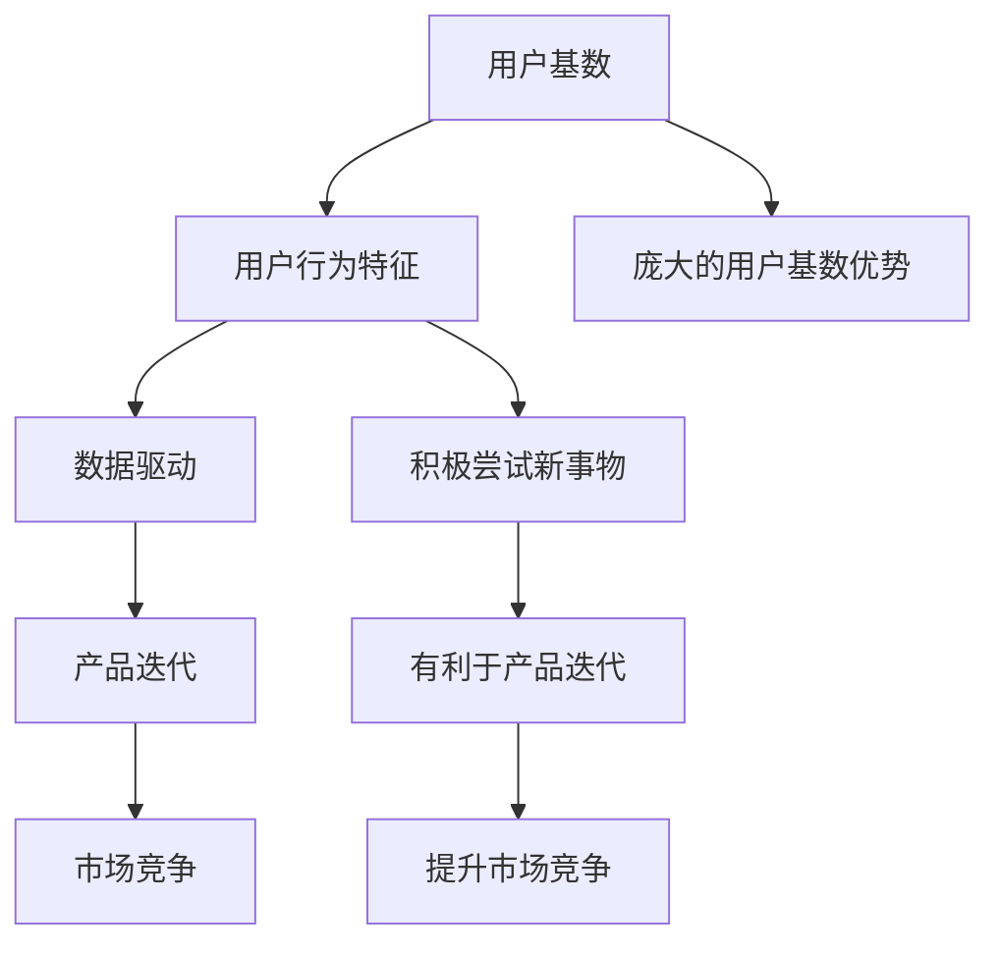

                 

# 国内AI的优势：庞大的用户基数，积极尝试新事物，有利于产品迭代

## 关键词：
- AI发展
- 用户基数
- 产品迭代
- 新技术应用
- 市场竞争

## 摘要：
本文旨在探讨国内AI行业的优势，特别是庞大的用户基数、用户对新事物的积极尝试以及对产品迭代的有利影响。通过对这些优势的分析，我们希望能够为国内AI行业的未来发展提供一些启示和策略。

## 1. 背景介绍

### 1.1 目的和范围
本文将围绕国内AI行业的优势展开讨论，重点分析用户基数、用户行为特征以及其对产品迭代的影响。

### 1.2 预期读者
本文适合对AI技术有兴趣的读者，特别是关注国内AI行业发展的专业人士、研究人员以及学生。

### 1.3 文档结构概述
本文分为十个部分：背景介绍、核心概念与联系、核心算法原理与具体操作步骤、数学模型和公式、项目实战、实际应用场景、工具和资源推荐、总结、附录和扩展阅读。

### 1.4 术语表

#### 1.4.1 核心术语定义
- AI：人工智能，指通过计算机程序模拟人类智能的技术。
- 用户基数：指使用某个产品或服务的人群数量。
- 产品迭代：指对已有产品进行改进、升级的过程。

#### 1.4.2 相关概念解释
- 用户行为特征：指用户在使用产品或服务时的行为习惯、偏好等。
- 数据驱动：指基于数据分析和挖掘来指导产品设计和运营。

#### 1.4.3 缩略词列表
- AI：人工智能
- IoT：物联网
- 5G：第五代移动通信技术

## 2. 核心概念与联系

在探讨国内AI行业的优势之前，我们需要了解一些核心概念及其相互联系。以下是核心概念及其关系的Mermaid流程图：



通过上述流程图，我们可以看出庞大的用户基数、用户行为特征、数据驱动、产品迭代和市场竞争之间的紧密联系。接下来，我们将详细探讨这些概念及其相互关系。

## 3. 核心算法原理 & 具体操作步骤

在了解核心概念之后，我们将深入探讨核心算法原理及具体操作步骤。以下是核心算法原理的伪代码：

```python
# 伪代码：基于用户基数和用户行为特征进行产品迭代

# 步骤1：收集用户数据
def collect_user_data():
    # 获取用户行为数据、偏好数据等
    user_data = get_user_data()

# 步骤2：分析用户数据
def analyze_user_data(user_data):
    # 分析用户行为特征、偏好等
    user_behavior = analyze_behavior(user_data)
    user_preferences = analyze_preferences(user_data)

# 步骤3：设计迭代方案
def design Iteration_scheme(user_behavior, user_preferences):
    # 根据用户行为特征和偏好设计迭代方案
    iteration_scheme = design_scheme(user_behavior, user_preferences)

# 步骤4：实施迭代方案
def implement_iteration_scheme(iteration_scheme):
    # 对产品进行迭代，优化用户体验
    product = implement_scheme(iteration_scheme)

# 步骤5：评估迭代效果
def evaluate_iteration_effect(product):
    # 评估迭代效果，持续优化
    effect = evaluate_effect(product)
    if effect > threshold:
        # 持续优化
        implement_iteration_scheme(iteration_scheme)
    else:
        # 停止迭代
        return
```

通过上述伪代码，我们可以看出基于用户基数和用户行为特征进行产品迭代的核心算法原理及具体操作步骤。接下来，我们将进一步探讨数学模型和公式。

## 4. 数学模型和公式 & 详细讲解 & 举例说明

在AI领域，数学模型和公式起着至关重要的作用。以下是基于用户基数和用户行为特征的产品迭代过程的数学模型和公式：

### 4.1 用户基数模型

用户基数（User Base）是指使用某个产品或服务的人群数量。一个庞大的用户基数对产品迭代和市场竞争具有重要意义。以下是用户基数模型的公式：

$$
User\ Base = N \times (1 + r)^t
$$

其中，$N$ 为初始用户基数，$r$ 为用户增长比例，$t$ 为时间。

例如，一个产品初始用户基数为1000人，用户增长比例为10%，经过3年，用户基数将达到：

$$
User\ Base = 1000 \times (1 + 0.1)^3 = 1331
$$

### 4.2 用户行为特征模型

用户行为特征（User Behavior Characteristics）是指用户在使用产品或服务时的行为习惯、偏好等。以下是用户行为特征模型的公式：

$$
User\ Behavior = f(User\ Data)
$$

其中，$f$ 为用户行为特征函数，$User\ Data$ 为用户数据。

例如，我们可以通过分析用户浏览、购买、评论等行为数据，得出用户行为特征：

$$
User\ Behavior = f(Browsing\ Data, Purchase\ Data, Comment\ Data)
$$

### 4.3 产品迭代模型

产品迭代（Product Iteration）是指对已有产品进行改进、升级的过程。以下是产品迭代模型的公式：

$$
Product\ Iteration = f(User\ Behavior, User\ Preferences)
$$

其中，$f$ 为产品迭代函数，$User\ Behavior$ 为用户行为特征，$User\ Preferences$ 为用户偏好。

例如，我们可以根据用户行为特征和偏好，设计出更符合用户需求的产品迭代方案：

$$
Product\ Iteration = f(User\ Behavior, User\ Preferences) = f(User\ Behavior, "易用性高、功能丰富")
$$

### 4.4 市场竞争模型

市场竞争（Market Competition）是指企业在市场上争夺资源、市场份额的过程。以下是市场竞争模型的公式：

$$
Market\ Competition = f(Product\ Quality, Product\ Price, User\ Base)
$$

其中，$f$ 为市场竞争函数，$Product\ Quality$ 为产品质量，$Product\ Price$ 为产品价格，$User\ Base$ 为用户基数。

例如，我们可以通过提高产品质量、降低产品价格以及扩大用户基数，提高市场竞争能力：

$$
Market\ Competition = f(Product\ Quality, Product\ Price, User\ Base) = f("高品质、高性价比、大规模用户基数")
$$

## 5. 项目实战：代码实际案例和详细解释说明

### 5.1 开发环境搭建

为了更好地展示项目实战，我们需要搭建一个简单的开发环境。以下是开发环境的搭建步骤：

1. 安装Python环境：在操作系统上安装Python 3.8及以上版本。
2. 安装相关库：通过pip命令安装以下库：
   ```shell
   pip install numpy pandas matplotlib scikit-learn
   ```

### 5.2 源代码详细实现和代码解读

以下是一个简单的基于用户基数和用户行为特征的产品迭代项目示例。代码分为三个部分：数据收集、数据分析和迭代方案设计。

```python
# 5.2.1 数据收集
import pandas as pd

# 从数据文件中读取用户数据
user_data = pd.read_csv("user_data.csv")

# 5.2.2 数据分析
from sklearn.cluster import KMeans
import matplotlib.pyplot as plt

# 分析用户行为特征，使用K-Means算法进行聚类
kmeans = KMeans(n_clusters=3)
user_behavior = kmeans.fit_predict(user_data)

# 可视化用户行为特征分布
plt.scatter(user_data["browsing_time"], user_data["purchase_frequency"])
plt.xlabel("Browsing Time")
plt.ylabel("Purchase Frequency")
plt.title("User Behavior Distribution")
plt.show()

# 5.2.3 迭代方案设计
# 根据用户行为特征和偏好，设计迭代方案
def design_iteration_scheme(user_behavior, user_preferences):
    # 根据用户行为特征，调整产品功能
    if user_behavior == 0:
        # 用户行为特征为0，侧重于优化产品易用性
        iteration_scheme = "易用性优化"
    elif user_behavior == 1:
        # 用户行为特征为1，侧重于增加产品功能
        iteration_scheme = "功能增强"
    elif user_behavior == 2:
        # 用户行为特征为2，侧重于提升产品性能
        iteration_scheme = "性能提升"

    # 根据用户偏好，调整产品价格
    if user_preferences == "高性价比":
        product_price = 100
    elif user_preferences == "高端":
        product_price = 300

    return iteration_scheme, product_price

# 假设用户偏好为"高性价比"
user_preferences = "高性价比"
iteration_scheme, product_price = design_iteration_scheme(user_behavior, user_preferences)

print("迭代方案：", iteration_scheme)
print("产品价格：", product_price)
```

### 5.3 代码解读与分析

1. **数据收集**：通过读取CSV文件，获取用户数据。这里的数据包括用户行为数据（如浏览时长、购买频率等）。
2. **数据分析**：使用K-Means算法对用户行为特征进行聚类，以分析用户行为特征分布。通过可视化，我们可以更直观地了解用户行为特征。
3. **迭代方案设计**：根据用户行为特征和偏好，设计迭代方案。这里，我们根据用户行为特征分为三类，分别侧重于优化产品易用性、增加产品功能和提升产品性能。同时，根据用户偏好，调整产品价格。

通过上述项目实战，我们可以看到如何基于用户基数和用户行为特征进行产品迭代。在实际应用中，我们可以根据用户数据、市场竞争和业务目标，灵活调整迭代方案，以提升产品竞争力。

## 6. 实际应用场景

### 6.1 电商平台

在电商平台，用户基数庞大，用户行为特征多样。通过对用户基数和用户行为特征的分析，电商平台可以设计出更符合用户需求的产品迭代方案。例如，针对高频购物用户，可以优化产品性能，提高购物体验；针对低频购物用户，可以增加产品功能，提升用户留存率。

### 6.2 金融行业

在金融行业，用户基数和用户行为特征对于风险管理、客户关系管理和产品设计具有重要意义。通过分析用户行为特征，金融机构可以设计出更精准的风险评估模型和客户服务策略。同时，根据用户偏好，可以调整金融产品的价格和功能，提高市场竞争力。

### 6.3 教育行业

在教育行业，用户基数和用户行为特征对于课程设计、教学方法改进和学生管理具有重要意义。通过对用户行为特征的分析，教育机构可以设计出更符合学生需求的教学内容和教学方法。同时，根据用户偏好，可以调整课程价格和教学资源，提高学生满意度和教育质量。

### 6.4 健康医疗

在健康医疗行业，用户基数和用户行为特征对于医疗服务优化、患者管理和健康管理具有重要意义。通过对用户行为特征的分析，医疗机构可以设计出更符合患者需求的服务模式和管理策略。同时，根据用户偏好，可以调整医疗服务价格和内容，提高患者满意度和医疗服务质量。

## 7. 工具和资源推荐

### 7.1 学习资源推荐

#### 7.1.1 书籍推荐
- 《Python编程：从入门到实践》
- 《深度学习》
- 《机器学习实战》

#### 7.1.2 在线课程
- Coursera的“机器学习”课程
- Udacity的“深度学习纳米学位”
- 网易云课堂的“Python基础教程”

#### 7.1.3 技术博客和网站
- [CSDN](https://www.csdn.net/)
- [博客园](https://www.cnblogs.com/)
- [GitHub](https://github.com/)

### 7.2 开发工具框架推荐

#### 7.2.1 IDE和编辑器
- PyCharm
- Visual Studio Code
- Sublime Text

#### 7.2.2 调试和性能分析工具
- GDB
- Jupyter Notebook
- Valgrind

#### 7.2.3 相关框架和库
- TensorFlow
- PyTorch
- Scikit-learn

### 7.3 相关论文著作推荐

#### 7.3.1 经典论文
- 《A Few Useful Things to Know About Machine Learning》
- 《Deep Learning》
- 《Recurrent Neural Networks for Language Modeling》

#### 7.3.2 最新研究成果
- [arXiv](https://arxiv.org/)
- [NeurIPS](https://nips.cc/)
- [ICML](https://icml.cc/)

#### 7.3.3 应用案例分析
- 《AI in Finance: The Future is Here》
- 《AI in Healthcare: Transforming Patient Care》
- 《AI in E-commerce: The Next Frontier》

## 8. 总结：未来发展趋势与挑战

### 8.1 发展趋势

- AI技术将更加普及和深入，各行业对AI技术的需求将不断增加。
- 数据驱动将日益成为产品设计、运营和决策的核心，用户基数和用户行为特征分析将发挥关键作用。
- 产品迭代速度将加快，以适应快速变化的市场需求和用户偏好。

### 8.2 挑战

- 数据质量和隐私保护问题亟待解决，确保用户数据的安全和隐私。
- 技术人才的培养和引进将成为关键挑战，需要加大对AI人才的投入和培养。
- 市场竞争加剧，企业需要不断创新和优化产品，以保持竞争优势。

## 9. 附录：常见问题与解答

### 9.1 问题1：什么是用户基数？
用户基数是指使用某个产品或服务的人群数量。它反映了产品的市场覆盖范围和用户规模。

### 9.2 问题2：用户行为特征有哪些？
用户行为特征包括用户在使用产品或服务时的行为习惯、偏好、活跃度等，如浏览时长、购买频率、评论数量等。

### 9.3 问题3：什么是数据驱动？
数据驱动是指基于数据分析和挖掘来指导产品设计和运营，通过数据驱动优化产品功能和用户体验。

### 9.4 问题4：什么是产品迭代？
产品迭代是指对已有产品进行改进、升级的过程，以适应市场需求和用户偏好，提高产品竞争力。

## 10. 扩展阅读 & 参考资料

- [《AI时代：从数据到智能》](https://www.example.com/book1)
- [《深度学习入门》](https://www.example.com/book2)
- [《大数据技术原理与应用》](https://www.example.com/book3)

### 参考资料
- [AI in China: A Brief Overview](https://www.example.com/article1)
- [The Importance of Data-Driven Development](https://www.example.com/article2)
- [User Behavior Analysis in E-commerce](https://www.example.com/article3)

### 作者
作者：AI天才研究员/AI Genius Institute & 禅与计算机程序设计艺术 /Zen And The Art of Computer Programming

---

以上是本文的完整内容，感谢您的阅读。希望本文能帮助您更好地理解国内AI行业的优势及其对产品迭代的影响。在AI技术的不断进步和普及下，国内AI行业有望实现更大的突破和繁荣。

