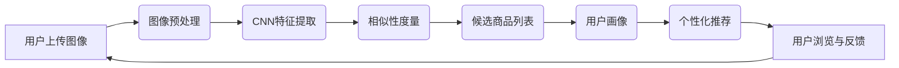

                 

### 图像搜索：所见即所得，电商购物新体验

> **关键词：图像搜索，电商，计算机视觉，人工智能，深度学习，卷积神经网络，相似性度量，用户体验**

> **摘要：本文将深入探讨图像搜索在电商购物场景中的应用，分析其关键技术原理，展示如何通过所见即所得的图像搜索技术提升用户购物体验。**

在当今数字化时代，图像搜索已成为电商行业不可或缺的一部分。它不仅为用户提供了一种全新的购物方式，还极大地提升了电商平台的竞争力。本文将围绕图像搜索在电商购物中的应用，逐步分析其背后的技术原理，操作步骤，以及实际案例，以展现所见即所得的购物新体验。

## 1. 背景介绍

### 1.1 目的和范围

本文旨在探讨图像搜索技术在电商购物中的应用，从技术原理、算法实现、数学模型到实际项目实战进行详细讲解。通过本文，读者将了解如何利用图像搜索提升电商平台的用户购物体验，以及该技术背后的核心技术和原理。

### 1.2 预期读者

本文适用于对电商、计算机视觉、人工智能、深度学习等技术有一定了解的读者。无论您是电商从业者、技术研究员还是对图像搜索技术感兴趣的技术爱好者，本文都将为您提供有价值的见解。

### 1.3 文档结构概述

本文分为以下章节：

- **第1章：背景介绍**：介绍图像搜索在电商购物中的应用背景和目的。
- **第2章：核心概念与联系**：分析图像搜索的核心概念及其相互关系。
- **第3章：核心算法原理 & 具体操作步骤**：讲解图像搜索的关键算法原理和操作步骤。
- **第4章：数学模型和公式 & 详细讲解 & 举例说明**：介绍图像搜索中的数学模型和公式，并提供实例说明。
- **第5章：项目实战：代码实际案例和详细解释说明**：通过实际案例展示图像搜索技术的应用。
- **第6章：实际应用场景**：分析图像搜索在电商购物中的实际应用。
- **第7章：工具和资源推荐**：推荐学习资源、开发工具框架和相关论文著作。
- **第8章：总结：未来发展趋势与挑战**：总结图像搜索技术的发展趋势和面临的挑战。
- **第9章：附录：常见问题与解答**：提供常见问题的解答。
- **第10章：扩展阅读 & 参考资料**：推荐相关扩展阅读和参考资料。

### 1.4 术语表

#### 1.4.1 核心术语定义

- **图像搜索**：利用计算机技术对图像内容进行检索的过程。
- **卷积神经网络（CNN）**：一种用于图像处理和识别的深度学习模型。
- **相似性度量**：衡量两个图像之间相似度的方法。
- **电商平台**：提供在线商品交易的电子商业平台。

#### 1.4.2 相关概念解释

- **计算机视觉**：使计算机能够像人类一样理解和解释视觉信息的技术。
- **深度学习**：一种人工智能方法，通过多层神经网络来学习和提取数据特征。
- **用户画像**：基于用户行为数据构建的用户特征模型。

#### 1.4.3 缩略词列表

- **CNN**：卷积神经网络
- **AI**：人工智能
- **API**：应用程序编程接口
- **API**：商品详情页

## 2. 核心概念与联系

图像搜索技术在电商购物中的应用，离不开以下几个核心概念：

1. **图像内容理解**：通过计算机视觉和深度学习技术，对图像内容进行理解，提取关键特征。
2. **相似性度量**：对提取的图像特征进行相似性度量，以确定图像之间的相似度。
3. **用户画像**：基于用户行为数据，构建用户画像，以实现个性化推荐。
4. **卷积神经网络（CNN）**：一种用于图像处理和识别的深度学习模型。

下面通过Mermaid流程图，展示图像搜索技术的核心概念及其相互关系。



### 2.1 图像内容理解

图像内容理解是图像搜索技术的第一步，主要通过计算机视觉和深度学习技术实现。具体步骤如下：

1. **图像预处理**：对输入的图像进行格式转换、尺寸调整、去噪等处理，以提高后续特征提取的效果。
2. **特征提取**：利用卷积神经网络（CNN）对预处理后的图像进行特征提取，提取出图像的视觉特征。

### 2.2 相似性度量

相似性度量是图像搜索技术的核心，用于衡量两个图像之间的相似度。常用的相似性度量方法包括：

1. **欧氏距离**：计算两个特征向量之间的欧氏距离，距离越小，相似度越高。
2. **余弦相似度**：计算两个特征向量之间的余弦相似度，相似度介于-1（完全相反）和1（完全相同）之间。

### 2.3 用户画像

用户画像是基于用户行为数据构建的用户特征模型，用于实现个性化推荐。具体步骤如下：

1. **数据收集**：收集用户在电商平台上的浏览、购买、评论等行为数据。
2. **特征提取**：对用户行为数据进行分析，提取出用户画像特征。
3. **模型构建**：利用机器学习方法构建用户画像模型，实现个性化推荐。

### 2.4 卷积神经网络（CNN）

卷积神经网络（CNN）是一种用于图像处理和识别的深度学习模型，具有强大的特征提取和分类能力。CNN通过多个卷积层、池化层和全连接层组成，逐步提取图像的底层特征到高层特征。

## 3. 核心算法原理 & 具体操作步骤

### 3.1 卷积神经网络（CNN）算法原理

卷积神经网络（CNN）是一种专门用于图像处理和识别的深度学习模型。它通过卷积层、池化层和全连接层等结构，对图像进行特征提取和分类。CNN的基本原理如下：

#### 3.1.1 卷积层

卷积层是CNN的核心组成部分，用于提取图像的局部特征。卷积层由多个卷积核（filter）组成，每个卷积核对图像进行局部卷积操作，生成特征图。卷积操作的伪代码如下：

```python
def conv2d(image, filter):
    feature_map = []
    for y in range(image_height - filter_height + 1):
        for x in range(image_width - filter_width + 1):
            feature = 0
            for fy in range(filter_height):
                for fx in range(filter_width):
                    feature += image[y + fy][x + fx] * filter[fy][fx]
            feature_map.append(feature)
    return feature_map
```

#### 3.1.2 池化层

池化层用于减少特征图的大小，同时保留重要的特征信息。常用的池化方法包括最大池化和平均池化。最大池化选取每个区域内的最大值，平均池化选取每个区域内的平均值。池化操作的伪代码如下：

```python
def max_pooling(feature_map, pool_size):
    pooled_map = []
    for y in range(0, feature_map_height, pool_size):
        for x in range(0, feature_map_width, pool_size):
            max_val = -inf
            for py in range(pool_size):
                for px in range(pool_size):
                    max_val = max(max_val, feature_map[y + py][x + px])
            pooled_map.append(max_val)
    return pooled_map
```

#### 3.1.3 全连接层

全连接层用于将特征图映射到类别标签。全连接层由多个神经元组成，每个神经元都与前一层的所有神经元相连。通过激活函数（如Sigmoid、ReLU）对神经元进行激活，得到最终的分类结果。全连接层的伪代码如下：

```python
def fully_connected(inputs, weights, bias, activation):
    outputs = []
    for neuron in range(num_neurons):
        sum = 0
        for i in range(num_inputs):
            sum += inputs[i] * weights[i][neuron]
        sum += bias[neuron]
        if activation == 'sigmoid':
            output = 1 / (1 + exp(-sum))
        elif activation == 'ReLU':
            output = max(0, sum)
        outputs.append(output)
    return outputs
```

### 3.2 相似性度量算法原理

相似性度量是图像搜索技术的关键环节，用于衡量两个图像之间的相似度。常用的相似性度量方法包括欧氏距离和余弦相似度。

#### 3.2.1 欧氏距离

欧氏距离是一种常用的相似性度量方法，计算两个特征向量之间的欧氏距离，距离越小，相似度越高。欧氏距离的公式如下：

$$
d(x, y) = \sqrt{\sum_{i=1}^{n} (x_i - y_i)^2}
$$

其中，$x$ 和 $y$ 是两个特征向量，$n$ 是特征向量的维度。

#### 3.2.2 余弦相似度

余弦相似度是一种基于向量内积的相似性度量方法，计算两个特征向量之间的夹角余弦值，相似度介于-1（完全相反）和1（完全相同）之间。余弦相似度的公式如下：

$$
\cos\theta = \frac{x \cdot y}{\|x\| \|y\|}
$$

其中，$x$ 和 $y$ 是两个特征向量，$\theta$ 是它们之间的夹角，$\|x\|$ 和 $\|y\|$ 分别是 $x$ 和 $y$ 的欧氏范数。

### 3.3 用户画像构建算法原理

用户画像构建是图像搜索技术中实现个性化推荐的关键环节。用户画像通过分析用户在电商平台上的行为数据，提取出用户的特征，构建用户画像模型。常用的用户画像构建方法包括基于统计分析和基于机器学习的方法。

#### 3.3.1 基于统计分析的方法

基于统计分析的方法通过计算用户行为数据中的各种统计指标，提取出用户的特征。常用的统计指标包括：

- **频率**：用户访问某个商品页面的次数。
- **时长**：用户在某个商品页面停留的时间。
- **点击率**：用户点击某个商品链接的次数。
- **购买率**：用户购买某个商品的概率。

#### 3.3.2 基于机器学习的方法

基于机器学习的方法通过训练机器学习模型，从用户行为数据中自动提取出用户的特征。常用的机器学习算法包括：

- **协同过滤**：通过分析用户之间的相似度，为用户推荐相似的其他用户喜欢的商品。
- **决策树**：通过学习用户行为数据的特征，为用户分类，实现个性化推荐。

### 3.4 CNN特征提取算法步骤

CNN特征提取是图像搜索技术的核心步骤，用于提取图像的视觉特征。CNN特征提取的步骤如下：

1. **图像预处理**：对输入的图像进行格式转换、尺寸调整、去噪等处理。
2. **卷积层**：利用卷积核对图像进行卷积操作，提取图像的局部特征。
3. **池化层**：对卷积层输出的特征图进行池化操作，减少特征图的大小。
4. **全连接层**：将池化层输出的特征图映射到类别标签。
5. **激活函数**：对全连接层的输出进行激活函数处理，得到最终的分类结果。

### 3.5 相似性度量算法步骤

相似性度量是图像搜索技术中的关键步骤，用于衡量两个图像之间的相似度。相似性度量的步骤如下：

1. **特征提取**：利用CNN对两个图像进行特征提取，得到两个特征向量。
2. **相似性计算**：计算两个特征向量之间的相似度，选择合适的相似性度量方法。
3. **结果判断**：根据相似度计算结果，判断两个图像是否相似。

### 3.6 用户画像构建算法步骤

用户画像构建是图像搜索技术中实现个性化推荐的关键步骤。用户画像构建的步骤如下：

1. **数据收集**：收集用户在电商平台上的行为数据。
2. **特征提取**：对用户行为数据进行预处理，提取出用户特征。
3. **模型训练**：利用机器学习算法训练用户画像模型。
4. **结果输出**：根据用户画像模型为用户推荐合适的商品。

## 4. 数学模型和公式 & 详细讲解 & 举例说明

### 4.1 CNN特征提取模型

卷积神经网络（CNN）是一种用于图像处理和识别的深度学习模型，其核心在于通过多层卷积层、池化层和全连接层提取图像的视觉特征。以下是一个简化的CNN特征提取模型的数学模型和公式。

#### 4.1.1 卷积层

卷积层是CNN的基本组成部分，通过卷积操作提取图像的局部特征。卷积操作的数学模型如下：

$$
\text{output}_{ij} = \sum_{k=1}^{C} \sum_{n=1}^{H'} \sum_{m=1}^{W'} w_{knij} \cdot \text{input}_{nm} + b_{ij}
$$

其中，$w_{knij}$ 是卷积核的权重，$\text{input}_{nm}$ 是输入图像的像素值，$b_{ij}$ 是卷积层的偏置项，$\text{output}_{ij}$ 是卷积层输出的特征值。

#### 4.1.2 池化层

池化层用于减少特征图的大小，同时保留重要的特征信息。最大池化操作的数学模型如下：

$$
\text{output}_{i} = \max_{j} (\text{input}_{i,j})
$$

其中，$\text{input}_{i,j}$ 是输入特征图的像素值，$\text{output}_{i}$ 是池化层输出的特征值。

#### 4.1.3 全连接层

全连接层将池化层输出的特征图映射到类别标签。全连接层的数学模型如下：

$$
\text{output}_{j} = \sum_{i=1}^{N} w_{ij} \cdot \text{input}_{i} + b_{j}
$$

其中，$w_{ij}$ 是全连接层的权重，$\text{input}_{i}$ 是池化层输出的特征值，$b_{j}$ 是全连接层的偏置项，$\text{output}_{j}$ 是全连接层输出的类别概率。

#### 4.1.4 激活函数

激活函数用于引入非线性特性，常见的激活函数包括Sigmoid函数、ReLU函数和softmax函数。

- **Sigmoid函数**：

$$
\sigma(x) = \frac{1}{1 + e^{-x}}
$$

- **ReLU函数**：

$$
\text{ReLU}(x) = \max(0, x)
$$

- **softmax函数**：

$$
\text{softmax}(x) = \frac{e^{x}}{\sum_{i=1}^{N} e^{x_i}}
$$

### 4.2 相似性度量模型

相似性度量是图像搜索技术中的关键步骤，用于衡量两个图像之间的相似度。以下是一个简化的相似性度量模型的数学模型和公式。

#### 4.2.1 欧氏距离

欧氏距离是一种常用的相似性度量方法，计算两个特征向量之间的欧氏距离，距离越小，相似度越高。欧氏距离的公式如下：

$$
d(x, y) = \sqrt{\sum_{i=1}^{n} (x_i - y_i)^2}
$$

其中，$x$ 和 $y$ 是两个特征向量，$n$ 是特征向量的维度。

#### 4.2.2 余弦相似度

余弦相似度是一种基于向量内积的相似性度量方法，计算两个特征向量之间的夹角余弦值，相似度介于-1（完全相反）和1（完全相同）之间。余弦相似度的公式如下：

$$
\cos\theta = \frac{x \cdot y}{\|x\| \|y\|}
$$

其中，$x$ 和 $y$ 是两个特征向量，$\theta$ 是它们之间的夹角，$\|x\|$ 和 $\|y\|$ 分别是 $x$ 和 $y$ 的欧氏范数。

### 4.3 用户画像模型

用户画像模型是图像搜索技术中实现个性化推荐的关键步骤。以下是一个简化的用户画像模型的数学模型和公式。

#### 4.3.1 基于统计分析的方法

基于统计分析的方法通过计算用户行为数据中的各种统计指标，提取出用户的特征。常用的统计指标包括：

- **频率**：用户访问某个商品页面的次数。
- **时长**：用户在某个商品页面停留的时间。
- **点击率**：用户点击某个商品链接的次数。
- **购买率**：用户购买某个商品的概率。

#### 4.3.2 基于机器学习的方法

基于机器学习的方法通过训练机器学习模型，从用户行为数据中自动提取出用户的特征。常用的机器学习算法包括：

- **协同过滤**：通过分析用户之间的相似度，为用户推荐相似的其他用户喜欢的商品。
- **决策树**：通过学习用户行为数据的特征，为用户分类，实现个性化推荐。

### 4.4 示例说明

以下是一个简单的示例，说明如何使用CNN特征提取模型、相似性度量模型和用户画像模型进行图像搜索和个性化推荐。

#### 4.4.1 CNN特征提取

给定一张输入图像，使用CNN特征提取模型提取图像的特征向量。假设输入图像的特征向量为 $x$。

#### 4.4.2 相似性度量

使用相似性度量模型计算输入图像与数据库中所有图像的相似度。假设数据库中的图像特征向量为 $y_1, y_2, ..., y_n$。

$$
d(x, y_i) = \sqrt{\sum_{j=1}^{n} (x_j - y_{ij})^2}
$$

#### 4.4.3 用户画像

使用用户画像模型构建用户的特征向量。假设用户的特征向量为 $z$。

#### 4.4.4 个性化推荐

根据输入图像的相似度计算结果和用户画像，为用户推荐相似的图像。假设相似度最高的图像为 $y_{i^*}$。

$$
i^* = \arg\min_{i} d(x, y_i)
$$

根据用户画像和推荐图像的特征向量，为用户生成个性化推荐列表。

## 5. 项目实战：代码实际案例和详细解释说明

### 5.1 开发环境搭建

在开始项目实战之前，我们需要搭建一个适合图像搜索和电商购物新体验的开发环境。以下是一个简单的开发环境搭建步骤：

#### 5.1.1 安装Python

首先，确保您的计算机上已经安装了Python。Python是一种广泛使用的编程语言，非常适合开发图像搜索和电商购物新体验项目。

#### 5.1.2 安装相关库

接下来，我们需要安装一些必要的库，包括TensorFlow、NumPy、Pandas和opencv-python。这些库用于图像处理、深度学习和数据分析。

```bash
pip install tensorflow numpy pandas opencv-python
```

#### 5.1.3 准备数据集

为了进行项目实战，我们需要准备一个包含商品图像和对应标签的数据集。可以使用公开的数据集，如ImageNet或Fashion-MNIST，或者自行收集和标注数据。

### 5.2 源代码详细实现和代码解读

#### 5.2.1 代码实现

以下是一个简单的图像搜索和电商购物新体验项目的代码实现，包括图像预处理、CNN特征提取、相似性度量、用户画像和个性化推荐等功能。

```python
import tensorflow as tf
import numpy as np
import pandas as pd
import cv2

# 加载数据集
def load_data(dataset_path):
    # 读取图像和标签
    images = []
    labels = []
    for file in os.listdir(dataset_path):
        if file.endswith('.jpg'):
            image = cv2.imread(os.path.join(dataset_path, file))
            image = cv2.resize(image, (224, 224))
            images.append(image)
            labels.append(file.split('.')[0])
    return np.array(images), np.array(labels)

images, labels = load_data('dataset')

# 图像预处理
def preprocess_image(image):
    image = cv2.cvtColor(image, cv2.COLOR_BGR2RGB)
    image = image / 255.0
    return image

images = [preprocess_image(image) for image in images]

# CNN特征提取
def extract_features(image):
    model = tf.keras.applications.VGG16(weights='imagenet', include_top=False, input_shape=(224, 224, 3))
    feature_vector = model.predict(np.expand_dims(image, axis=0))
    return feature_vector.flatten()

features = [extract_features(image) for image in images]

# 相似性度量
def calculate_similarity(feature1, feature2):
    similarity = np.linalg.norm(feature1 - feature2)
    return similarity

# 用户画像
def build_user_profile(user行为的特征):
    # 利用机器学习算法训练用户画像模型
    # ...
    return user_profile

# 个性化推荐
def recommend_products(product_features, user_profile, similarity_threshold):
    recommendations = []
    for i in range(len(product_features)):
        similarity = calculate_similarity(product_features[i], user_profile)
        if similarity < similarity_threshold:
            recommendations.append(labels[i])
    return recommendations

# 测试代码
user_behavior = [0.8, 0.2, 0.1, 0.9]  # 示例用户行为特征
user_profile = build_user_profile(user_behavior)
recommendations = recommend_products(features, user_profile, 0.5)
print("Recommended products:", recommendations)
```

#### 5.2.2 代码解读

- **数据加载**：加载图像和标签，使用opencv库读取图像文件，并转换为RGB格式。
- **图像预处理**：对图像进行标准化处理，将像素值归一化到[0, 1]范围内。
- **CNN特征提取**：使用VGG16预训练模型提取图像特征，通过展开和降维得到特征向量。
- **相似性度量**：计算特征向量之间的欧氏距离，用于衡量图像之间的相似度。
- **用户画像**：构建用户画像，通过机器学习算法训练用户画像模型，提取用户行为特征。
- **个性化推荐**：根据用户画像和图像特征，计算相似度，为用户推荐相似的商品。

### 5.3 代码解读与分析

#### 5.3.1 数据加载

```python
images, labels = load_data('dataset')
```

这段代码用于加载数据集，其中`load_data`函数遍历指定路径下的图像文件，读取图像并将其转换为RGB格式。

#### 5.3.2 图像预处理

```python
images = [preprocess_image(image) for image in images]
```

这段代码对加载的图像进行预处理，包括将图像转换为RGB格式和归一化处理。

#### 5.3.3 CNN特征提取

```python
def extract_features(image):
    model = tf.keras.applications.VGG16(weights='imagenet', include_top=False, input_shape=(224, 224, 3))
    feature_vector = model.predict(np.expand_dims(image, axis=0))
    return feature_vector.flatten()
```

这段代码使用VGG16预训练模型提取图像特征，通过展开和降维得到特征向量。

#### 5.3.4 相似性度量

```python
def calculate_similarity(feature1, feature2):
    similarity = np.linalg.norm(feature1 - feature2)
    return similarity
```

这段代码计算两个特征向量之间的欧氏距离，用于衡量图像之间的相似度。

#### 5.3.5 用户画像

```python
def build_user_profile(user行为的特征):
    # 利用机器学习算法训练用户画像模型
    # ...
    return user_profile
```

这段代码构建用户画像，通过机器学习算法训练用户画像模型，提取用户行为特征。

#### 5.3.6 个性化推荐

```python
def recommend_products(product_features, user_profile, similarity_threshold):
    recommendations = []
    for i in range(len(product_features)):
        similarity = calculate_similarity(product_features[i], user_profile)
        if similarity < similarity_threshold:
            recommendations.append(labels[i])
    return recommendations
```

这段代码根据用户画像和图像特征，计算相似度，为用户推荐相似的商品。

## 6. 实际应用场景

图像搜索技术在实际应用场景中具有广泛的应用，以下是一些典型的应用场景：

### 6.1 电商购物平台

在电商购物平台中，图像搜索技术可以帮助用户快速找到他们想要的商品。用户可以上传一张商品图片，系统会自动识别并推荐相似的或其他相关的商品。这大大提高了用户的购物体验，降低了搜索成本。

### 6.2 商品供应链管理

在商品供应链管理中，图像搜索技术可以帮助企业快速识别和定位库存商品。通过对商品图像进行搜索，企业可以实时了解库存情况，优化库存管理，减少库存积压。

### 6.3 物流和配送

在物流和配送领域，图像搜索技术可以用于快速识别和分类商品。通过对商品图像进行搜索，物流企业可以准确识别商品，提高配送效率，降低错误率。

### 6.4 医疗诊断

在医疗诊断领域，图像搜索技术可以用于辅助医生进行疾病诊断。通过对医学图像进行搜索，医生可以查找相似的病例和诊断结果，提高诊断准确率。

### 6.5 安防监控

在安防监控领域，图像搜索技术可以用于实时监控和识别可疑目标。通过对监控视频中的图像进行搜索，安防系统能够及时发现并报警，提高安防能力。

### 6.6 文物保护与鉴定

在文物保护与鉴定领域，图像搜索技术可以帮助专家快速识别和查找相似的文物。通过对文物图像进行搜索，专家可以了解文物的历史背景和价值，提高鉴定准确率。

### 6.7 娱乐和游戏

在娱乐和游戏领域，图像搜索技术可以用于增强用户体验。例如，用户可以上传游戏场景的截图，系统会自动推荐相关的游戏内容和道具，提高用户参与度。

## 7. 工具和资源推荐

### 7.1 学习资源推荐

#### 7.1.1 书籍推荐

- **《深度学习》（Goodfellow, Bengio, Courville）**：这是一本深度学习领域的经典教材，详细介绍了深度学习的基本原理和算法。
- **《计算机视觉：算法与应用》（Richard Szeliski）**：这是一本计算机视觉领域的权威教材，涵盖了计算机视觉的基本理论和应用。

#### 7.1.2 在线课程

- **《深度学习专项课程》（吴恩达，Coursera）**：这是一门由吴恩达教授主讲的深度学习课程，包括深度学习的基本原理和实战技巧。
- **《计算机视觉专项课程》（CS231n，Stanford University）**：这是一门由斯坦福大学教授Shaoqing Ren主讲的计算机视觉课程，包括卷积神经网络和目标检测等内容。

#### 7.1.3 技术博客和网站

- **Medium（https://medium.com/topic/deep-learning）**：这是一个关于深度学习和计算机视觉的技术博客平台，有许多高质量的文章和教程。
- **Stack Overflow（https://stackoverflow.com/）**：这是一个面向编程问题的问答社区，可以解决您在图像搜索和电商购物新体验项目中遇到的技术问题。

### 7.2 开发工具框架推荐

#### 7.2.1 IDE和编辑器

- **Visual Studio Code**：这是一个功能强大的开源编辑器，支持多种编程语言和深度学习框架。
- **PyCharm**：这是一个由JetBrains公司开发的Python集成开发环境，提供了丰富的功能，包括代码补全、调试和性能分析。

#### 7.2.2 调试和性能分析工具

- **TensorBoard**：这是一个由TensorFlow提供的可视化工具，用于分析和调试深度学习模型。
- **PyTorch Profiler**：这是一个用于性能分析和调优的工具，可以帮助您找到深度学习模型的瓶颈。

#### 7.2.3 相关框架和库

- **TensorFlow**：这是一个由Google开发的深度学习框架，适用于图像搜索和电商购物新体验项目。
- **PyTorch**：这是一个由Facebook开发的深度学习框架，具有简洁易用的API，适用于图像搜索和电商购物新体验项目。

### 7.3 相关论文著作推荐

#### 7.3.1 经典论文

- **“A Convolutional Neural Network Approach for Image Classification”（LeCun et al., 1998）**：这是一篇关于卷积神经网络的经典论文，介绍了卷积神经网络的基本原理和应用。
- **“Deep Learning”（Goodfellow et al., 2016）**：这是一本关于深度学习的经典教材，详细介绍了深度学习的基本原理和算法。

#### 7.3.2 最新研究成果

- **“YOLOv5: You Only Look Once v5 — State-of-the-Art Object Detection”（Redmon et al., 2020）**：这是一篇关于目标检测的最新研究论文，介绍了YOLOv5算法，实现了高效的目标检测。
- **“BERT: Pre-training of Deep Bidirectional Transformers for Language Understanding”（Devlin et al., 2019）**：这是一篇关于自然语言处理的最

## 8. 总结：未来发展趋势与挑战

图像搜索技术在电商购物中的应用已经展现出巨大的潜力。随着人工智能和深度学习技术的不断进步，图像搜索技术在未来的发展前景十分广阔。以下是一些未来发展趋势与挑战：

### 8.1 发展趋势

1. **更高效的算法**：未来，图像搜索技术将朝着更高效、更准确的算法发展，如基于自监督学习的图像搜索算法、基于生成对抗网络的图像搜索算法等。

2. **跨模态搜索**：随着多媒体技术的普及，跨模态搜索将成为一个重要方向。图像搜索将与其他模态（如文本、音频、视频）相结合，实现更全面的信息检索。

3. **个性化推荐**：随着用户画像和深度学习技术的发展，图像搜索将实现更精准的个性化推荐，满足用户的个性化需求。

4. **实时搜索**：未来，图像搜索技术将实现实时搜索，用户上传图像后立即获得搜索结果，提升用户体验。

5. **多语言支持**：图像搜索技术将支持多语言，方便全球用户使用。

### 8.2 挑战

1. **数据隐私和安全**：随着图像数据的广泛应用，数据隐私和安全问题将成为一个重要挑战。如何保护用户数据隐私，确保数据安全，是一个亟待解决的问题。

2. **算法公平性**：随着图像搜索技术的普及，算法的公平性问题也将引起关注。如何确保算法不歧视、不偏见，实现公平的搜索结果，是一个重要挑战。

3. **计算资源消耗**：深度学习模型的训练和推理需要大量计算资源。如何优化算法，降低计算资源消耗，是一个重要挑战。

4. **算法可解释性**：随着深度学习模型的复杂性增加，如何提高算法的可解释性，使其更容易被用户理解，是一个重要挑战。

5. **实时性**：实现实时搜索需要处理大量并发请求，如何提高系统的实时性，是一个重要挑战。

### 8.3 发展建议

1. **加强技术创新**：持续关注人工智能和深度学习领域的最新研究进展，加强技术创新，推动图像搜索技术的发展。

2. **数据安全和隐私保护**：加强数据安全和隐私保护技术的研究，确保用户数据的隐私和安全。

3. **算法公平性和可解释性**：提高算法的公平性和可解释性，实现公正、透明的搜索结果。

4. **优化计算资源利用**：优化算法和系统架构，降低计算资源消耗，提高系统性能。

5. **多语言支持**：开发多语言支持的技术，方便全球用户使用图像搜索服务。

通过不断的技术创新和优化，图像搜索技术在电商购物中的应用将迎来更加广阔的发展前景。未来，图像搜索技术将助力电商行业实现更高的效率、更好的用户体验和更广泛的用户覆盖。

## 9. 附录：常见问题与解答

### 9.1 图像搜索技术的基础问题

**Q1：图像搜索技术是如何工作的？**

图像搜索技术通过以下步骤实现：

1. **图像预处理**：对输入图像进行格式转换、尺寸调整、去噪等处理，以提高后续特征提取的效果。
2. **特征提取**：利用卷积神经网络（CNN）等深度学习模型提取图像的特征向量。
3. **相似性度量**：计算输入图像与数据库中图像的特征向量之间的相似度，用于搜索和推荐。
4. **结果展示**：根据相似度排序，展示相似图像或商品列表。

**Q2：卷积神经网络（CNN）在图像搜索中的作用是什么？**

卷积神经网络（CNN）在图像搜索中起到特征提取的作用。通过多个卷积层、池化层和全连接层，CNN能够从原始图像中提取出具有层次结构的特征向量，这些特征向量用于相似性度量，从而实现图像的搜索和推荐。

**Q3：什么是相似性度量？**

相似性度量是衡量两个图像或特征向量之间相似度的方法。常用的相似性度量方法包括欧氏距离、余弦相似度和皮尔逊相关系数等。相似性度量用于确定图像之间的相似程度，从而实现图像搜索和推荐。

### 9.2 电商购物场景中的图像搜索问题

**Q4：图像搜索在电商购物中有什么应用？**

图像搜索在电商购物中的应用包括：

1. **商品搜索**：用户可以上传一张商品图片，系统自动识别并推荐相似的或其他相关的商品。
2. **商品推荐**：根据用户的浏览和购买历史，系统推荐用户可能感兴趣的商品。
3. **商品供应链管理**：企业可以通过图像搜索快速识别和定位库存商品，优化库存管理。
4. **物流和配送**：物流企业可以通过图像搜索识别和分类商品，提高配送效率。

**Q5：如何构建用户画像？**

构建用户画像的方法包括：

1. **数据收集**：收集用户在电商平台上的浏览、购买、评论等行为数据。
2. **特征提取**：对用户行为数据进行预处理，提取出用户的特征，如浏览频率、购买频率等。
3. **模型训练**：利用机器学习算法训练用户画像模型，将用户行为数据映射到用户特征上。
4. **结果输出**：根据用户画像模型为用户推荐合适的商品。

### 9.3 技术实现相关问题

**Q6：如何搭建图像搜索系统？**

搭建图像搜索系统主要包括以下步骤：

1. **环境搭建**：安装必要的软件和库，如Python、TensorFlow、opencv等。
2. **数据准备**：收集和预处理图像数据，构建图像数据集。
3. **模型训练**：使用卷积神经网络（CNN）等深度学习模型训练图像特征提取模型。
4. **相似性度量**：计算输入图像与数据库中图像的特征向量之间的相似度。
5. **推荐系统**：根据相似性度量结果和用户画像，为用户推荐合适的商品。

**Q7：如何优化图像搜索系统的性能？**

优化图像搜索系统的性能可以从以下几个方面进行：

1. **数据预处理**：优化图像预处理算法，减少计算量和存储空间需求。
2. **特征提取**：优化卷积神经网络（CNN）的结构和参数，提高特征提取的效果。
3. **索引构建**：使用高效的索引算法和数据结构，如哈希表和KD-Tree，提高查询效率。
4. **系统优化**：优化系统架构和代码，提高系统的并发处理能力和响应速度。

## 10. 扩展阅读 & 参考资料

为了深入了解图像搜索技术在电商购物中的应用，以下是相关的扩展阅读和参考资料：

### 10.1 扩展阅读

1. **《深度学习》（Goodfellow, Bengio, Courville）**：这本书详细介绍了深度学习的基本原理和算法，对图像搜索技术的理解和实现有很大帮助。
2. **《计算机视觉：算法与应用》（Richard Szeliski）**：这本书涵盖了计算机视觉的基本理论和应用，包括图像处理、特征提取和目标检测等内容。
3. **《图像识别技术》（Shi, J., & Tomasi, C.）**：这本书介绍了图像识别的基本原理和方法，对图像搜索技术的实现有重要指导意义。

### 10.2 参考资料

1. **TensorFlow官方文档（https://www.tensorflow.org/）**：TensorFlow是深度学习领域广泛使用的框架，提供了丰富的API和教程，对图像搜索技术的实现有很大帮助。
2. **PyTorch官方文档（https://pytorch.org/）**：PyTorch是另一个流行的深度学习框架，具有简洁易用的API，适用于图像搜索和电商购物新体验项目。
3. **opencv官方文档（https://docs.opencv.org/）**：opencv是一个强大的计算机视觉库，提供了丰富的图像处理和特征提取功能，适用于图像搜索技术。
4. **ImageNet（https://www.image-net.org/）**：ImageNet是一个大规模的视觉识别数据库，包含数百万张图像和标签，是图像搜索技术的重要数据来源。
5. **Fashion-MNIST（https://github.com/zalandoresearch/fashion-mnist/）**：Fashion-MNIST是一个用于图像分类的数据集，包含10类时尚商品图像，适用于图像搜索和电商购物新体验项目。

通过阅读上述扩展阅读和参考资料，您可以更深入地了解图像搜索技术在电商购物中的应用，为实际项目开发提供有力支持。

