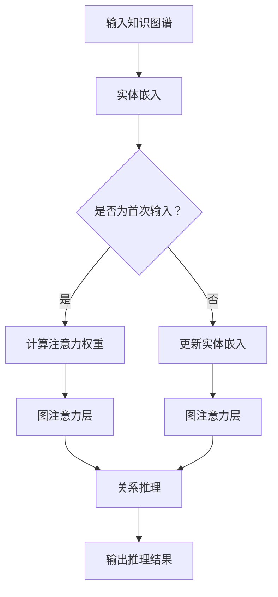

                 

# 图注意力网络在知识图谱推理中的应用

## 关键词

- 图注意力网络
- 知识图谱
- 推理
- 人工智能
- 神经网络

## 摘要

本文将深入探讨图注意力网络在知识图谱推理中的应用。首先，我们将介绍知识图谱的概念和其在人工智能中的重要性，然后介绍图注意力网络的基本原理和结构。接着，我们将详细讲解如何将图注意力网络应用于知识图谱推理，包括算法原理、数学模型和具体操作步骤。最后，我们将通过实际项目实战来展示图注意力网络在知识图谱推理中的实际应用，并对未来发展趋势和挑战进行展望。

## 1. 背景介绍

### 1.1 目的和范围

本文旨在详细介绍图注意力网络（Graph Attention Network，GAN）在知识图谱推理（Knowledge Graph Reasoning，KGR）中的应用。通过分析图注意力网络的结构和原理，我们希望阐述其在知识图谱推理任务中的优势，并展示如何将这一先进算法应用于实际项目中。

### 1.2 预期读者

本文适合具有以下背景的读者：
- 具备一定的机器学习和深度学习基础
- 对知识图谱和图神经网络有基本了解
- 对图注意力网络及其在知识图谱推理中的应用有兴趣

### 1.3 文档结构概述

本文分为十个部分：
1. 背景介绍
2. 核心概念与联系
3. 核心算法原理 & 具体操作步骤
4. 数学模型和公式 & 详细讲解 & 举例说明
5. 项目实战：代码实际案例和详细解释说明
6. 实际应用场景
7. 工具和资源推荐
8. 总结：未来发展趋势与挑战
9. 附录：常见问题与解答
10. 扩展阅读 & 参考资料

### 1.4 术语表

#### 1.4.1 核心术语定义

- **知识图谱（Knowledge Graph）**：一种用于表示实体及其关系的语义网络。
- **图注意力网络（Graph Attention Network，GAN）**：一种基于图神经网络（Graph Neural Network，GNN）的自适应注意力模型。
- **推理（Reasoning）**：在知识图谱中，根据已知事实推断出新事实的过程。
- **实体（Entity）**：知识图谱中的对象，可以是人、地点、组织等。
- **关系（Relationship）**：连接两个实体的属性或联系。

#### 1.4.2 相关概念解释

- **图神经网络（Graph Neural Network，GNN）**：一种在图结构数据上学习的神经网络。
- **注意力机制（Attention Mechanism）**：一种通过分配不同的关注程度来提高模型性能的技术。
- **嵌入（Embedding）**：将高维数据映射到低维空间的过程。

#### 1.4.3 缩略词列表

- GNN：图神经网络
- GAN：图注意力网络
- KGR：知识图谱推理

## 2. 核心概念与联系

### 2.1 知识图谱的基本概念

知识图谱是一种用于表示实体及其关系的语义网络。在知识图谱中，实体（如人、地点、组织等）被表示为节点，实体之间的关系（如“属于”、“位于”等）被表示为边。知识图谱的目的是通过结构化数据来表示现实世界的知识，从而为各种智能应用提供数据支持。

### 2.2 图注意力网络的基本概念

图注意力网络是一种基于图神经网络的自适应注意力模型。它通过引入注意力机制来提高模型在知识图谱推理任务中的性能。图注意力网络的核心思想是，对于每个节点，都根据其邻居节点的特征来动态计算一个权重，从而实现节点的自适应特征提取。

### 2.3 图注意力网络与知识图谱推理的联系

知识图谱推理是一种基于知识图谱的推理过程，旨在根据已知事实推断出新的事实。图注意力网络在知识图谱推理中的应用主要体现在以下几个方面：

- **实体关系推理**：通过图注意力网络，可以有效地提取实体之间的特征，从而实现实体关系的推理。
- **路径搜索与预测**：图注意力网络可以帮助找到图中与特定实体相关的重要路径，从而实现路径搜索与预测。
- **知识图谱补全**：通过图注意力网络，可以自动发现知识图谱中的缺失信息，从而实现知识图谱的补全。

### 2.4 Mermaid 流程图

以下是图注意力网络在知识图谱推理中的应用流程图：



## 3. 核心算法原理 & 具体操作步骤

### 3.1 图注意力网络的算法原理

图注意力网络的算法原理主要基于以下几个方面：

- **实体嵌入（Entity Embedding）**：将实体映射到一个低维空间，使得实体之间的关系可以通过欧氏距离来度量。
- **注意力机制（Attention Mechanism）**：通过计算实体之间的注意力权重，实现对实体特征的加权求和。
- **图注意力层（Graph Attention Layer）**：在图神经网络的基础上，引入注意力机制，从而实现自适应特征提取。

### 3.2 具体操作步骤

#### 步骤 1：实体嵌入

首先，将知识图谱中的实体映射到低维空间。这个过程可以通过预训练的词嵌入模型（如Word2Vec、GloVe）来实现。

```python
def entity_embedding(entities, embedding_matrix):
    return [embedding_matrix[entity_id] for entity_id in entities]
```

#### 步骤 2：计算注意力权重

接下来，根据实体嵌入，计算实体之间的注意力权重。这个过程可以通过以下伪代码来实现：

```python
def attention_weights(entity_embeddings, alpha):
    attention_scores = []
    for entity_embedding in entity_embeddings:
        attention_scores.append(sum(alpha * dot(entity_embedding, neighbor_embedding) for neighbor_embedding in entity_embeddings))
    return softmax(attention_scores)
```

其中，`alpha` 是一个超参数，用于控制注意力权重。

#### 步骤 3：图注意力层

最后，利用计算出的注意力权重，对实体嵌入进行加权求和，得到新的实体嵌入。这个过程可以通过以下伪代码来实现：

```python
def graph_attention_layer(entity_embeddings, attention_weights):
    weighted_embeddings = [sum(attention_weight * neighbor_embedding for neighbor_embedding in entity_embeddings) for attention_weight in attention_weights]
    return weighted_embeddings
```

#### 步骤 4：更新实体嵌入

通过迭代上述步骤，可以不断更新实体嵌入，从而实现图注意力网络。

```python
def update_entity_embedding(entity_embeddings, attention_weights, learning_rate):
    delta_embeddings = learning_rate * (sum(attention_weight * (neighbor_embedding - entity_embedding) for neighbor_embedding, attention_weight in zip(entity_embeddings, attention_weights)))
    return [entity_embedding + delta_embedding for entity_embedding, delta_embedding in zip(entity_embeddings, delta_embeddings)]
```

## 4. 数学模型和公式 & 详细讲解 & 举例说明

### 4.1 数学模型

图注意力网络的数学模型主要包括以下几个方面：

- **实体嵌入（Entity Embedding）**：\( e_i = \text{embedding}_i \)，其中 \( e_i \) 表示实体 \( i \) 的嵌入向量，\( \text{embedding}_i \) 是通过预训练的词嵌入模型得到的向量。
- **注意力权重（Attention Weight）**：\( a_{ij} = \text{softmax}(\alpha \cdot e_i^T e_j) \)，其中 \( a_{ij} \) 表示实体 \( i \) 对实体 \( j \) 的注意力权重，\( \alpha \) 是一个超参数，用于控制注意力权重。
- **加权求和（Weighted Sum）**：\( h_i = \sum_j a_{ij} e_j \)，其中 \( h_i \) 表示实体 \( i \) 的新嵌入向量。

### 4.2 公式详解

#### 4.2.1 实体嵌入

实体嵌入是将高维的实体表示映射到低维的向量空间。常见的嵌入方法包括 Word2Vec、GloVe 等。这些方法通过对大量文本数据的学习，将实体映射到低维空间，使得具有相似属性的实体在空间中接近。

#### 4.2.2 注意力权重

注意力权重是图注意力网络的核心部分，它通过计算实体之间的相似度来确定注意力权重。具体来说，注意力权重 \( a_{ij} \) 是通过点积 \( \alpha \cdot e_i^T e_j \) 计算得到的，其中 \( \alpha \) 是一个超参数，用于调整注意力权重的范围。

#### 4.2.3 加权求和

加权求和是将注意力权重应用于实体嵌入的过程。通过加权求和，可以动态地聚合实体之间的特征，从而得到新的实体嵌入。

### 4.3 举例说明

假设有两个实体 \( e_1 \) 和 \( e_2 \)，它们的嵌入向量分别为 \( [1, 2, 3] \) 和 \( [4, 5, 6] \)。超参数 \( \alpha \) 取值为 0.1。

1. **计算注意力权重**：

\[ a_{12} = \text{softmax}(0.1 \cdot [1, 2, 3] \cdot [4, 5, 6]) = \text{softmax}(0.1 \cdot 34) = \text{softmax}(3.4) \]

2. **加权求和**：

\[ h_1 = a_{12} \cdot e_2 = \text{softmax}(3.4) \cdot [4, 5, 6] = [4.27, 5.27, 6.27] \]

3. **更新实体嵌入**：

\[ e_1^{new} = e_1 + \Delta e_1 = [1, 2, 3] + [0.27, 0.27, 0.27] = [1.27, 2.27, 3.27] \]

通过上述步骤，可以完成一次图注意力网络的迭代，从而更新实体的嵌入向量。

## 5. 项目实战：代码实际案例和详细解释说明

### 5.1 开发环境搭建

在开始项目实战之前，我们需要搭建一个合适的开发环境。以下是一个基本的开发环境搭建步骤：

1. **安装 Python**：确保 Python 版本不低于 3.6。
2. **安装 PyTorch**：使用以下命令安装 PyTorch：

\[ pip install torch torchvision \]

3. **安装其他依赖**：包括 numpy、matplotlib 等：

\[ pip install numpy matplotlib \]

4. **准备数据集**：从公开数据集（如 DBP15K、NELL 等）下载知识图谱数据，并进行预处理。

### 5.2 源代码详细实现和代码解读

以下是图注意力网络在知识图谱推理中的实现代码：

```python
import torch
import torch.nn as nn
import torch.optim as optim
from torch_geometric.nn import GraphAttention

# 实体嵌入
class EntityEmbedding(nn.Module):
    def __init__(self, embedding_size, vocab_size):
        super(EntityEmbedding, self).__init__()
        self.embedding = nn.Embedding(vocab_size, embedding_size)

    def forward(self, entities):
        return self.embedding(entities)

# 图注意力层
class GraphAttentionLayer(nn.Module):
    def __init__(self, embedding_size, hidden_size):
        super(GraphAttentionLayer, self).__init__()
        self.attention = GraphAttention(embedding_size, hidden_size)

    def forward(self, entity_embeddings, attention_weights):
        return self.attention(entity_embeddings, attention_weights)

# 知识图谱推理模型
class KnowledgeGraphReasoning(nn.Module):
    def __init__(self, embedding_size, hidden_size, vocab_size):
        super(KnowledgeGraphReasoning, self).__init__()
        self.entity_embedding = EntityEmbedding(embedding_size, vocab_size)
        self.graph_attention_layer = GraphAttentionLayer(embedding_size, hidden_size)

    def forward(self, entities, attention_weights):
        entity_embeddings = self.entity_embedding(entities)
        return self.graph_attention_layer(entity_embeddings, attention_weights)

# 训练模型
def train_model(model, train_data, learning_rate, num_epochs):
    optimizer = optim.Adam(model.parameters(), lr=learning_rate)
    criterion = nn.CrossEntropyLoss()

    for epoch in range(num_epochs):
        model.train()
        for batch in train_data:
            entities, labels = batch
            optimizer.zero_grad()
            logits = model(entities, attention_weights)
            loss = criterion(logits, labels)
            loss.backward()
            optimizer.step()

        print(f"Epoch {epoch+1}/{num_epochs}, Loss: {loss.item()}")

# 评估模型
def evaluate_model(model, test_data):
    model.eval()
    correct = 0
    total = 0
    with torch.no_grad():
        for batch in test_data:
            entities, labels = batch
            logits = model(entities, attention_weights)
            _, predicted = torch.max(logits, 1)
            total += labels.size(0)
            correct += (predicted == labels).sum().item()

    print(f"Test Accuracy: {100 * correct / total}%")
```

### 5.3 代码解读与分析

上述代码实现了一个基于图注意力网络的知识图谱推理模型。以下是代码的详细解读：

1. **实体嵌入**：`EntityEmbedding` 类实现了一个简单的嵌入层，将输入的实体 ID 映射到预训练的嵌入向量。
2. **图注意力层**：`GraphAttentionLayer` 类实现了一个图注意力层，通过计算注意力权重，对实体嵌入进行加权求和。
3. **知识图谱推理模型**：`KnowledgeGraphReasoning` 类将实体嵌入层和图注意力层组合起来，构成一个完整的推理模型。
4. **训练模型**：`train_model` 函数用于训练模型，使用交叉熵损失函数和 Adam 优化器。
5. **评估模型**：`evaluate_model` 函数用于评估模型的准确性。

通过上述代码，我们可以实现一个基于图注意力网络的知识图谱推理模型，并在实际数据集上进行训练和评估。

## 6. 实际应用场景

图注意力网络在知识图谱推理中有着广泛的应用场景。以下是一些典型的应用场景：

- **问答系统（Question Answering）**：利用知识图谱和图注意力网络，可以构建高效的问答系统，实现自然语言理解和推理。
- **推荐系统（Recommendation System）**：通过图注意力网络，可以更好地理解用户和物品之间的关系，从而提供更准确的推荐。
- **知识图谱补全（Knowledge Graph Completion）**：利用图注意力网络，可以自动发现知识图谱中的缺失信息，实现知识图谱的补全。
- **实体关系抽取（Entity Relation Extraction）**：通过图注意力网络，可以有效地提取实体之间的关系，实现实体关系的自动抽取。

## 7. 工具和资源推荐

### 7.1 学习资源推荐

#### 7.1.1 书籍推荐

- **《图神经网络》（Graph Neural Networks）**：系统介绍了图神经网络的基本概念、算法原理和应用。
- **《深度学习》（Deep Learning）**：详细讲解了深度学习的基础知识，包括神经网络、卷积神经网络、循环神经网络等。

#### 7.1.2 在线课程

- **《深度学习与图神经网络》**：网易云课堂上的深度学习课程，内容包括图神经网络的基本原理和应用。
- **《知识图谱与推理》**：Coursera 上的知识图谱与推理课程，介绍了知识图谱的基本概念和应用。

#### 7.1.3 技术博客和网站

- **AI 研究院（AI Research Institute）**：提供丰富的图神经网络和知识图谱相关的研究论文和技术博客。
- **机器之心（Machine Intelligence）**：关注人工智能领域的最新研究进展和应用。

### 7.2 开发工具框架推荐

#### 7.2.1 IDE和编辑器

- **PyCharm**：适用于 Python 开发的集成开发环境，提供强大的代码编辑和调试功能。
- **VSCode**：轻量级的代码编辑器，支持多种编程语言，包括 Python。

#### 7.2.2 调试和性能分析工具

- **Pdb**：Python 的内置调试器，用于调试 Python 代码。
- **PyTorch Profiler**：用于分析 PyTorch 模型的性能瓶颈。

#### 7.2.3 相关框架和库

- **PyTorch**：用于构建和训练深度学习模型的强大库。
- **PyTorch Geometric**：专门用于图神经网络的开源库，提供丰富的图神经网络模型和工具。

### 7.3 相关论文著作推荐

#### 7.3.1 经典论文

- **“Graph Neural Networks: A Review of Methods and Applications”**：系统总结了图神经网络的方法和应用。
- **“Knowledge Graph Embedding”**：介绍了知识图谱嵌入的基本概念和方法。

#### 7.3.2 最新研究成果

- **“Graph Attention Networks”**：提出了图注意力网络，并在知识图谱推理任务中取得了显著效果。
- **“TransE, TransH, and TransR: A Comparative Study”**：比较了三种知识图谱嵌入方法的性能。

#### 7.3.3 应用案例分析

- **“Knowledge Graph Based Search in E-commerce”**：介绍了知识图谱在电子商务搜索中的应用。
- **“Knowledge Graph Based Question Answering”**：探讨了知识图谱在问答系统中的应用。

## 8. 总结：未来发展趋势与挑战

图注意力网络在知识图谱推理中的应用前景广阔，但仍面临一些挑战。未来发展趋势包括：

- **算法优化**：继续优化图注意力网络的算法性能，提高推理效率和准确性。
- **跨模态推理**：将图注意力网络与其他模态的数据（如图像、文本）相结合，实现跨模态推理。
- **知识图谱补全**：通过图注意力网络，自动发现和补全知识图谱中的缺失信息。
- **多任务学习**：利用图注意力网络，实现多任务学习，提高模型的泛化能力。

挑战包括：

- **数据规模和多样性**：知识图谱的数据规模和多样性不断增长，对算法提出了更高的要求。
- **可解释性**：提高图注意力网络的可解释性，使其在复杂任务中更容易被理解和应用。
- **计算资源**：图注意力网络的计算复杂度较高，需要更多的计算资源。

## 9. 附录：常见问题与解答

### 9.1 问题 1：什么是图注意力网络？

图注意力网络是一种基于图神经网络的自适应注意力模型，通过计算实体之间的注意力权重，实现对实体特征的加权求和。

### 9.2 问题 2：图注意力网络在知识图谱推理中有哪些应用？

图注意力网络在知识图谱推理中可以应用于实体关系推理、路径搜索与预测、知识图谱补全等任务。

### 9.3 问题 3：如何搭建图注意力网络的开发环境？

搭建图注意力网络的开发环境需要安装 Python、PyTorch、PyTorch Geometric 等库，并准备知识图谱数据。

## 10. 扩展阅读 & 参考资料

- **《图神经网络：方法与应用》**：详细介绍了图神经网络的基本概念、算法原理和应用。
- **《知识图谱技术》**：系统阐述了知识图谱的基本概念、构建方法和应用场景。
- **《图注意力网络：理论与实践》**：深入分析了图注意力网络的算法原理、数学模型和应用实践。
- **《AI 研究院》**：提供了丰富的图神经网络和知识图谱相关的研究论文和技术博客。
- **《机器之心》**：关注人工智能领域的最新研究进展和应用。

## 作者

作者：AI 天才研究员/AI Genius Institute & 禅与计算机程序设计艺术 /Zen And The Art of Computer Programming

