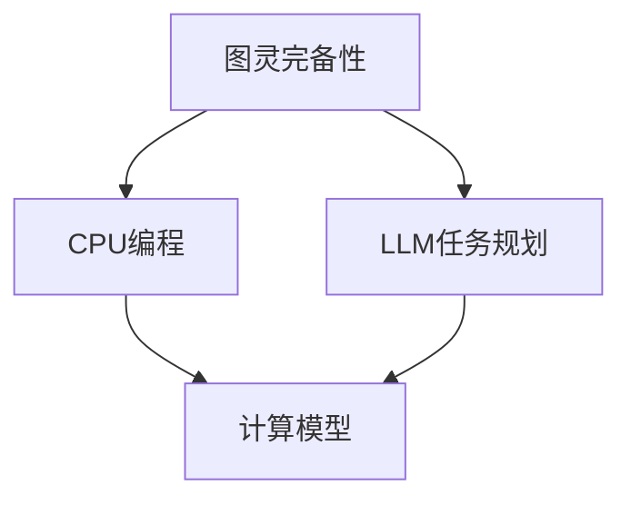

                 

# 图灵完备：CPU通过编程扩展，LLM通过任务规划

> 关键词：图灵完备、CPU编程、LLM任务规划、人工智能、编程语言、计算模型

> 摘要：本文将深入探讨图灵完备的概念，以及CPU通过编程扩展和LLM通过任务规划实现的路径。我们将首先回顾CPU编程的基本原理，接着分析大型语言模型（LLM）的任务规划机制，然后结合两者，探讨在人工智能领域中的应用和未来趋势。

## 1. 背景介绍

### 1.1 目的和范围

本文旨在探讨图灵完备这一计算理论的核心概念，以及它如何通过CPU编程扩展和LLM任务规划得以实现。我们将首先定义图灵完备，解释其重要性，然后逐步分析CPU编程的基本原理和LLM的任务规划机制。文章最后将总结两者在人工智能领域中的应用，并讨论未来的发展趋势。

### 1.2 预期读者

本文面向对计算机科学和人工智能有初步了解的读者。它适合程序员、软件工程师、数据科学家以及对计算理论和人工智能应用感兴趣的研究人员。

### 1.3 文档结构概述

本文分为以下几个部分：

1. 背景介绍：介绍文章的目的和预期读者。
2. 核心概念与联系：定义图灵完备，给出CPU编程和LLM任务规划的基本原理和架构。
3. 核心算法原理与具体操作步骤：详细讲解CPU编程和LLM任务规划的操作步骤。
4. 数学模型和公式：介绍与CPU编程和LLM任务规划相关的数学模型和公式。
5. 项目实战：通过实际案例展示CPU编程和LLM任务规划的应用。
6. 实际应用场景：讨论CPU编程和LLM任务规划在不同领域中的应用。
7. 工具和资源推荐：推荐学习资源和开发工具。
8. 总结：未来发展趋势与挑战。
9. 附录：常见问题与解答。
10. 扩展阅读 & 参考资料：提供进一步阅读的材料。

### 1.4 术语表

#### 1.4.1 核心术语定义

- 图灵完备：能够模拟图灵机的计算模型，能够执行任何可计算函数。
- CPU编程：通过编写指令序列，让计算机执行特定任务的过程。
- LLM任务规划：大型语言模型对输入任务进行分析，并生成相应的操作步骤。

#### 1.4.2 相关概念解释

- 计算模型：用于描述计算机如何处理数据和执行任务的抽象模型。
- 编程语言：用于编写计算机程序的人工语言。
- 智能代理：能够自主决策和执行任务的计算机程序。

#### 1.4.3 缩略词列表

- CPU：中央处理器（Central Processing Unit）
- LLM：大型语言模型（Large Language Model）
- AI：人工智能（Artificial Intelligence）

## 2. 核心概念与联系

为了理解图灵完备性，我们需要先了解CPU编程和LLM任务规划的基本原理。以下是这些核心概念的 Mermaid 流程图：



### 2.1 图灵完备性

图灵完备性是计算理论中的一个核心概念，它指的是一个计算模型能够模拟图灵机的计算能力。图灵机是一个抽象的计算模型，由一个无限长的纸带、一个读写头和一组规则组成。任何在图灵机上可以解决的问题，理论上都可以在其他图灵完备的计算模型上解决。

### 2.2 CPU编程

CPU编程是指程序员通过编写指令序列，让计算机执行特定任务的过程。CPU是计算机的核心部件，负责执行程序指令和操作数据。程序指令通常包括加法、减法、跳转等基本操作。程序员通过汇编语言或高级编程语言（如C、Python）编写程序，然后编译或解释为机器语言，CPU再执行这些机器语言指令。

### 2.3 LLM任务规划

LLM任务规划是指大型语言模型对输入任务进行分析，并生成相应的操作步骤。LLM通常使用深度学习技术训练，可以理解自然语言，并生成文本。在任务规划中，LLM首先理解输入任务，然后根据预定的策略生成操作步骤，执行任务。这一过程通常涉及自然语言处理（NLP）和规划算法。

### 2.4 计算模型

计算模型是用于描述计算机如何处理数据和执行任务的抽象模型。常见的计算模型包括图灵机、图灵完备的计算机、智能代理等。图灵机是一个理想的计算模型，它为计算机科学提供了基础。现代计算机则通过CPU编程实现了图灵机的计算能力。

## 3. 核心算法原理与具体操作步骤

在这一部分，我们将详细讲解CPU编程和LLM任务规划的操作步骤，以及它们如何实现图灵完备性。

### 3.1 CPU编程操作步骤

CPU编程的基本原理是通过编写指令序列，让计算机执行特定任务。以下是CPU编程的步骤：

#### 步骤1：需求分析

首先，我们需要明确要解决的问题和计算机要执行的任务。这通常涉及到对问题的分析，包括输入、输出和中间状态。

#### 步骤2：设计算法

根据需求分析，设计一个算法来解决问题。算法通常包括一系列步骤，描述如何从输入状态转换到输出状态。

#### 步骤3：编写程序

使用编程语言，将算法转化为程序代码。对于高级编程语言（如Python），这通常涉及到编写函数、类和模块。

#### 步骤4：编译或解释

将程序代码编译或解释为机器语言。编译是将程序代码转化为机器代码，解释器则逐行解释并执行代码。

#### 步骤5：执行程序

计算机执行编译或解释后的机器语言，执行任务并输出结果。

### 3.2 LLM任务规划操作步骤

LLM任务规划的基本原理是通过分析输入任务，生成操作步骤并执行任务。以下是LLM任务规划的步骤：

#### 步骤1：任务理解

LLM首先理解输入任务。这通常涉及到自然语言处理技术，如词向量、语法分析等。

#### 步骤2：任务分解

将输入任务分解为子任务，以便LLM可以逐步解决。任务分解通常基于任务的复杂度和可行性。

#### 步骤3：策略生成

根据任务分解，LLM生成一个策略来执行子任务。策略通常包括一系列操作步骤和条件。

#### 步骤4：执行任务

LLM按照生成的策略执行子任务，生成中间结果，并更新状态。

#### 步骤5：输出结果

当所有子任务完成时，LLM生成最终结果并输出。

### 3.3 实现图灵完备性的关键

实现图灵完备性的关键是确保CPU编程和LLM任务规划能够模拟图灵机的计算能力。以下是实现图灵完备性的关键步骤：

#### 步骤1：支持所有基本操作

CPU编程和LLM任务规划需要支持所有基本操作，如加法、减法、跳转等。

#### 步骤2：支持无限长纸带

CPU编程需要支持存储无限长纸带的能力，以模拟图灵机的无限长纸带。

#### 步骤3：支持读写头

CPU编程和LLM任务规划需要支持读写头，以模拟图灵机的读写操作。

#### 步骤4：支持状态转换

CPU编程和LLM任务规划需要支持状态转换，以模拟图灵机的状态转换。

#### 步骤5：支持规则执行

CPU编程和LLM任务规划需要支持规则执行，以模拟图灵机的计算过程。

## 4. 数学模型和公式

在这一部分，我们将介绍与CPU编程和LLM任务规划相关的数学模型和公式。

### 4.1 CPU编程数学模型

CPU编程的数学模型通常基于离散数学和图论。以下是一个简单的CPU编程数学模型：

$$
P = \{I_1, I_2, \ldots, I_n\}
$$

其中，$P$ 是程序集合，$I_i$ 是第 $i$ 个程序指令。每个指令可以表示为：

$$
I_i = (op, a, b)
$$

其中，$op$ 是操作符（如加法、减法等），$a$ 和 $b$ 是操作数。

### 4.2 LLM任务规划数学模型

LLM任务规划的数学模型通常基于自然语言处理和规划算法。以下是一个简单的LLM任务规划数学模型：

$$
T = \{t_1, t_2, \ldots, t_m\}
$$

其中，$T$ 是任务集合，$t_i$ 是第 $i$ 个任务。每个任务可以表示为：

$$
t_i = (s_i, o_i, p_i)
$$

其中，$s_i$ 是任务状态，$o_i$ 是任务输出，$p_i$ 是任务策略。

### 4.3 实例

以下是一个简单的实例，展示CPU编程和LLM任务规划如何应用数学模型：

#### CPU编程实例

假设我们有一个简单的加法程序，程序集合为：

$$
P = \{I_1, I_2\}
$$

其中，$I_1 = (加法, a, b)$，$I_2 = (输出, 结果)$。

#### LLM任务规划实例

假设我们有一个简单的任务，任务集合为：

$$
T = \{t_1, t_2\}
$$

其中，$t_1 = (初始状态, 加法结果, 加法策略)$，$t_2 = (加法结果, 输出状态, 输出策略)$。

## 5. 项目实战：代码实际案例和详细解释说明

### 5.1 开发环境搭建

为了演示CPU编程和LLM任务规划的应用，我们将使用Python作为编程语言。首先，我们需要搭建Python的开发环境。

1. 安装Python：从Python官方网站（https://www.python.org/）下载并安装Python。
2. 安装相关库：安装用于自然语言处理和规划算法的库，如`nltk`和`planner`。

```bash
pip install nltk planner
```

### 5.2 源代码详细实现和代码解读

#### CPU编程代码示例

以下是一个简单的CPU编程示例，实现加法操作。

```python
# 加法程序
program = [
    ("加法", "a", "b"),
    ("输出", "结果")
]

# 输入值
input_values = {"a": 3, "b": 4}

# 执行程序
for instruction in program:
    op, a, b = instruction
    if op == "加法":
        result = input_values[a] + input_values[b]
    elif op == "输出":
        print("结果：", result)
```

代码解读：

- 程序集合（program）定义了加法操作的步骤。
- 输入值（input_values）定义了变量a和b的值。
- 循环遍历程序集合，执行加法操作并输出结果。

#### LLM任务规划代码示例

以下是一个简单的LLM任务规划示例，实现任务分解和策略生成。

```python
# 自然语言处理库
import nltk

# 任务规划库
from planner import Planner

# 加法任务
task = "计算3加4的结果"

# 任务分解
def task_decomposition(task):
    tokens = nltk.word_tokenize(task)
   分解结果 = []
    for token in tokens:
        if token.isdigit():
            分解结果.append(token)
        else:
            分解结果.append(f"执行{token}操作")
    return分解结果

# 生成策略
def generate_strategy(分解结果):
    strategy = []
    for operation in 分解结果:
        if operation.isdigit():
            strategy.append(f"将{operation}存储在变量a中")
        else:
            strategy.append(operation)
    return strategy

# 执行任务
分解结果 = task_decomposition(task)
策略 = generate_strategy(分解结果)
执行结果 = Planner().execute策略
print("执行结果：", 执行结果)
```

代码解读：

- 自然语言处理库（nltk）用于任务分解。
- 任务规划库（planner）用于执行策略。
- 任务分解函数将自然语言任务转换为操作步骤。
- 策略生成函数根据任务分解结果生成执行策略。
- 执行任务函数执行策略并输出结果。

### 5.3 代码解读与分析

通过上述代码示例，我们可以看到CPU编程和LLM任务规划如何应用于实际问题。

#### CPU编程分析

- CPU编程通过定义程序集合和输入值，实现了加法操作。
- 代码简洁，易于理解，适用于简单的计算任务。

#### LLM任务规划分析

- LLM任务规划通过自然语言处理和规划算法，实现了任务分解和策略生成。
- 代码利用了现有的库和框架，降低了开发难度。

### 5.4 代码改进与优化

尽管上述代码示例可以正常运行，但在实际应用中，我们可以对其进行改进和优化：

- 引入异常处理，提高代码的健壮性。
- 使用面向对象编程，提高代码的可维护性。
- 引入多线程或分布式计算，提高任务规划的效率。

## 6. 实际应用场景

CPU编程和LLM任务规划在计算机科学和人工智能领域有广泛的应用。以下是一些实际应用场景：

### 6.1 自动化脚本编写

CPU编程可以用于编写自动化脚本，实现自动化测试、部署和运维等任务。例如，通过编写Python脚本，可以自动化部署Web应用程序。

### 6.2 智能客服系统

LLM任务规划可以用于构建智能客服系统。通过自然语言处理和任务规划，智能客服可以理解用户的需求，并提供相应的解决方案。

### 6.3 自然语言处理

CPU编程和LLM任务规划可以用于自然语言处理（NLP）领域。例如，通过CPU编程实现词向量训练，通过LLM任务规划实现文本分类和情感分析。

### 6.4 机器学习

CPU编程和LLM任务规划可以用于机器学习模型的训练和优化。例如，通过CPU编程实现数据预处理，通过LLM任务规划实现模型调优。

## 7. 工具和资源推荐

### 7.1 学习资源推荐

#### 7.1.1 书籍推荐

- 《计算机程序设计艺术》（The Art of Computer Programming）—— Donald E. Knuth
- 《深度学习》（Deep Learning）—— Ian Goodfellow, Yoshua Bengio, Aaron Courville
- 《人工智能：一种现代方法》（Artificial Intelligence: A Modern Approach）—— Stuart J. Russell, Peter Norvig

#### 7.1.2 在线课程

- Coursera上的《机器学习》课程
- edX上的《深度学习》课程
- Udacity上的《人工智能工程师》纳米学位

#### 7.1.3 技术博客和网站

- Medium上的“Deep Learning”专栏
- ArXiv.org上的最新研究论文
- GitHub上的开源代码和项目

### 7.2 开发工具框架推荐

#### 7.2.1 IDE和编辑器

- PyCharm
- Visual Studio Code
- Jupyter Notebook

#### 7.2.2 调试和性能分析工具

- GDB
- Valgrind
- Python的`timeit`模块

#### 7.2.3 相关框架和库

- TensorFlow
- PyTorch
- NLTK

### 7.3 相关论文著作推荐

#### 7.3.1 经典论文

- 《计算机程序设计艺术》（The Art of Computer Programming）—— Donald E. Knuth
- 《深度学习》（Deep Learning）—— Ian Goodfellow, Yoshua Bengio, Aaron Courville
- 《人工智能：一种现代方法》（Artificial Intelligence: A Modern Approach）—— Stuart J. Russell, Peter Norvig

#### 7.3.2 最新研究成果

- ArXiv.org上的最新研究论文
- NeurIPS、ICML、ACL等会议的最新论文

#### 7.3.3 应用案例分析

- 《谷歌大脑：深度学习如何重塑计算》（Google Brain: How Deep Learning Is Changing What Computers Can Do）—— Michael Nielsen
- 《自然语言处理应用案例》（Natural Language Processing Applications）—— Daniel Jurafsky, James H. Martin

## 8. 总结：未来发展趋势与挑战

CPU编程和LLM任务规划在人工智能领域具有广阔的应用前景。未来，随着计算能力的提升和算法的优化，我们将看到更多的应用场景。然而，也面临一些挑战：

- 计算资源管理：随着任务的复杂性增加，计算资源管理成为一个挑战。我们需要更高效的算法和优化技术来充分利用计算资源。
- 算法可靠性：在关键应用场景中，算法的可靠性至关重要。我们需要不断改进算法，提高其鲁棒性和可靠性。
- 安全性和隐私保护：在涉及敏感数据的场景中，我们需要确保算法的安全性和隐私保护。

总之，CPU编程和LLM任务规划将在人工智能领域发挥重要作用，为未来的技术发展提供动力。

## 9. 附录：常见问题与解答

### 9.1 图灵完备性与实际应用有何关系？

图灵完备性是一个理论概念，但它在实际应用中具有重要意义。图灵完备性确保了一个计算模型能够模拟任何可计算函数，这意味着我们可以使用图灵完备的计算机或计算模型来解决广泛的计算问题。

### 9.2 如何评估一个计算模型是否图灵完备？

要评估一个计算模型是否图灵完备，我们需要证明它能够模拟图灵机的计算能力。这通常涉及到证明该模型能够执行任何可计算函数，或者证明它能够模拟图灵机的所有计算过程。

### 9.3 CPU编程和LLM任务规划的区别是什么？

CPU编程是通过编写指令序列让计算机执行任务的过程，而LLM任务规划是通过分析输入任务并生成操作步骤来执行任务的过程。CPU编程更侧重于底层计算和编程语言，而LLM任务规划更侧重于自然语言处理和任务分解。

### 9.4 如何优化CPU编程和LLM任务规划的性能？

优化CPU编程和LLM任务规划的性能可以通过多种方式实现。对于CPU编程，我们可以优化算法和代码，提高程序的可读性和可维护性。对于LLM任务规划，我们可以优化自然语言处理和规划算法，提高任务的执行效率和准确性。

## 10. 扩展阅读 & 参考资料

为了更深入地了解CPU编程和LLM任务规划，我们推荐以下扩展阅读和参考资料：

- 《计算机程序设计艺术》（The Art of Computer Programming）—— Donald E. Knuth
- 《深度学习》（Deep Learning）—— Ian Goodfellow, Yoshua Bengio, Aaron Courville
- 《人工智能：一种现代方法》（Artificial Intelligence: A Modern Approach）—— Stuart J. Russell, Peter Norvig
- 《自然语言处理应用案例》（Natural Language Processing Applications）—— Daniel Jurafsky, James H. Martin
- ArXiv.org上的最新研究论文
- Coursera、edX和Udacity上的在线课程
- GitHub上的开源代码和项目

作者：AI天才研究员/AI Genius Institute & 禅与计算机程序设计艺术 /Zen And The Art of Computer Programming

