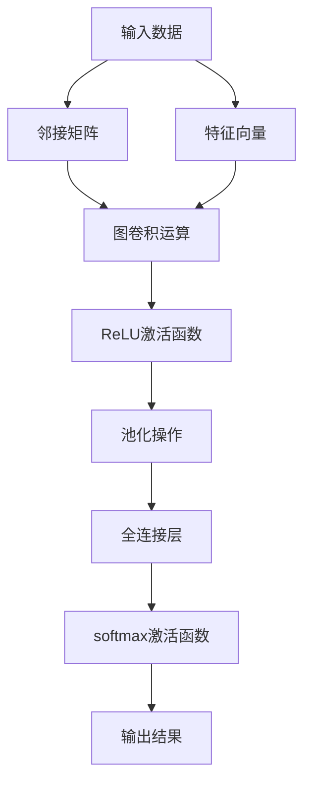

                 

# 图神经网络(Graph Neural Networks) - 原理与代码实例讲解

> **关键词：** 图神经网络，图表示学习，图卷积网络，节点分类，图同构图，数据预处理，Python实现

> **摘要：** 本文章将深入介绍图神经网络（GNN）的基本原理、数学模型以及代码实例，帮助读者理解GNN如何应用于节点分类等实际问题。我们将从背景介绍、核心概念与联系、算法原理、数学模型、项目实战到实际应用场景进行详细讲解，并结合具体的代码实例进行分析，以帮助读者全面掌握GNN。

## 1. 背景介绍

### 1.1 目的和范围

本文旨在向读者介绍图神经网络（GNN）的基本概念、核心算法原理以及实际应用。通过对GNN的深入探讨，读者将能够理解GNN如何将图结构数据转化为有用的特征表示，并应用于节点分类等任务。文章内容将涵盖以下主题：

- GNN的基本概念与历史背景
- GNN的核心算法原理
- GNN的数学模型与公式
- GNN的项目实战代码实例
- GNN的实际应用场景

### 1.2 预期读者

本文适合以下读者群体：

- 对深度学习和图理论有一定了解的初学者
- 对图神经网络感兴趣的研究人员和开发者
- 想要在实际项目中应用GNN的工程师和科学家

### 1.3 文档结构概述

本文将按照以下结构进行组织：

1. 背景介绍
   - 目的和范围
   - 预期读者
   - 文档结构概述
   - 术语表
2. 核心概念与联系
   - GNN的基本概念
   - GNN的历史背景
   - GNN的数学模型与流程图
3. 核心算法原理
   - GNN的工作原理
   - GNN的主要算法
   - GNN的具体实现步骤
4. 数学模型和公式
   - GNN的数学表示
   - GNN的参数设置
   - GNN的损失函数
5. 项目实战：代码实际案例
   - 开发环境搭建
   - 源代码详细实现
   - 代码解读与分析
6. 实际应用场景
   - 节点分类
   - 图同构图
   - 社交网络分析
7. 工具和资源推荐
   - 学习资源
   - 开发工具
   - 相关论文
8. 总结：未来发展趋势与挑战
9. 附录：常见问题与解答
10. 扩展阅读 & 参考资料

### 1.4 术语表

在本文章中，我们将使用以下术语：

- **图神经网络（GNN）**：一种深度学习模型，用于处理图结构数据。
- **节点分类**：将图中的节点分为不同的类别。
- **图同构图**：将不同的图结构映射到相同的图结构。
- **邻接矩阵**：表示图结构的数据结构。
- **特征向量**：表示节点的属性特征。
- **图卷积网络（GCN）**：一种基于图神经网络的核心算法。

#### 1.4.1 核心术语定义

- **图（Graph）**：由节点（Node）和边（Edge）组成的数据结构。
- **邻接矩阵（Adjacency Matrix）**：用于表示图结构的二维数组。
- **特征向量（Feature Vector）**：用于表示节点的属性特征。
- **图卷积网络（Graph Convolutional Network，GCN）**：一种基于卷积运算的图神经网络。

#### 1.4.2 相关概念解释

- **图表示学习**：将图结构数据转化为数值表示的过程。
- **节点分类**：对图中的节点进行分类的任务。
- **图同构图**：将不同结构的图映射到相同的图结构。
- **卷积运算**：在图结构上进行的线性运算。

#### 1.4.3 缩略词列表

- **GNN**：图神经网络（Graph Neural Networks）
- **GCN**：图卷积网络（Graph Convolutional Networks）
- **ReLU**：ReLU激活函数（Rectified Linear Unit）
- **softmax**：softmax激活函数

## 2. 核心概念与联系

### 2.1 GNN的基本概念

图神经网络（GNN）是一种专门用于处理图结构数据的深度学习模型。它通过学习节点之间的相互作用，将图中的结构信息转化为数值表示，从而实现各种图学习任务，如图分类、节点分类、图同构图等。

#### 2.1.1 图结构

图（Graph）由节点（Node）和边（Edge）组成。节点表示数据中的实体，边表示节点之间的关系。在图神经网络中，图结构是输入数据，也是模型学习的核心。

#### 2.1.2 邻接矩阵

邻接矩阵（Adjacency Matrix）是一种用于表示图结构的数据结构。它是一个二维数组，其中行和列分别表示图中的节点，数组中的元素表示节点之间的关系。如果节点i和节点j之间存在边，则邻接矩阵中的元素aij为1，否则为0。

#### 2.1.3 特征向量

特征向量（Feature Vector）用于表示节点的属性特征。在图神经网络中，每个节点都可以被表示为一个特征向量。特征向量可以包含节点的各种属性，如节点的标签、度数、邻居节点特征等。

### 2.2 GNN的历史背景

图神经网络（GNN）的概念最早可以追溯到2000年代初期。最初的研究主要关注于如何将图结构数据转换为数值表示，从而使其适用于现有的机器学习模型。随着深度学习技术的发展，GNN逐渐成为研究热点，并在2010年代取得了显著的进展。

#### 2.2.1 GNN的早期发展

- **2007年**：Hadsell et al. 提出了图卷积网络（GCN）的概念，首次将卷积运算应用于图结构数据。
- **2013年**：Kipf and Welling 提出了图卷积网络（GCN）的变种，即图卷积网络（GraphSAGE）。
- **2015年**：Veličković et al. 提出了图注意力网络（GAT）的概念，引入了注意力机制来学习节点之间的相互作用。

#### 2.2.2 GNN的近期进展

近年来，GNN的研究取得了许多重要的进展：

- **图嵌入**：将图中的节点和边表示为低维度的向量，从而使得图数据可以在传统机器学习模型中使用。
- **图生成**：通过生成图结构和节点特征，实现无监督的图学习任务。
- **图同构图**：将不同结构的图映射到相同的图结构，以实现跨领域的知识迁移。

### 2.3 GNN的数学模型与流程图

图神经网络（GNN）的数学模型包括以下几个方面：

- **输入数据**：邻接矩阵（Adjacency Matrix）和特征向量（Feature Vector）。
- **模型参数**：权重矩阵（Weight Matrix）和偏置向量（Bias Vector）。
- **激活函数**：ReLU激活函数（Rectified Linear Unit）和softmax激活函数。

#### 2.3.1 Mermaid流程图

下面是GNN的Mermaid流程图：



#### 2.3.2 GNN的数学模型

- **图卷积运算**：

$$
h_i^{(l+1)} = \sigma(\sum_{j \in \mathcal{N}(i)} W^{(l)}_{ij} h_j^{(l)} + b^{(l)})
$$

其中，$h_i^{(l)}$表示节点i在第l层的特征表示，$\mathcal{N}(i)$表示节点i的邻居节点集合，$W^{(l)}$表示第l层的权重矩阵，$b^{(l)}$表示第l层的偏置向量，$\sigma$表示ReLU激活函数。

- **池化操作**：

$$
p_i = \frac{1}{|\mathcal{N}(i)|} \sum_{j \in \mathcal{N}(i)} h_j^{(l)}
$$

其中，$p_i$表示节点i的池化结果。

- **全连接层**：

$$
\hat{y}_i = \sigma(W^{(fc)} h_i^{(l)} + b^{(fc)})
$$

其中，$\hat{y}_i$表示节点i的预测结果，$W^{(fc)}$表示全连接层的权重矩阵，$b^{(fc)}$表示全连接层的偏置向量，$\sigma$表示softmax激活函数。

## 3. 核心算法原理

### 3.1 GNN的工作原理

图神经网络（GNN）通过学习节点之间的相互作用，将图中的结构信息转化为数值表示。其工作原理可以概括为以下步骤：

1. **初始化**：随机初始化模型的权重矩阵和偏置向量。
2. **图卷积运算**：对每个节点执行图卷积运算，计算节点的新特征表示。
3. **激活函数**：应用ReLU激活函数，使模型能够学习节点之间的非线性关系。
4. **池化操作**：对每个节点的特征表示进行池化操作，以减少模型的复杂性。
5. **全连接层**：将池化后的特征表示输入到全连接层，计算节点的预测结果。
6. **损失函数**：计算预测结果与实际标签之间的损失，更新模型的权重和偏置向量。

### 3.2 GNN的主要算法

图神经网络（GNN）的主要算法包括图卷积网络（GCN）、图注意力网络（GAT）和图卷积网络（GraphSAGE）等。

#### 3.2.1 图卷积网络（GCN）

图卷积网络（GCN）是最早的图神经网络模型，它通过以下步骤对图中的节点进行特征表示：

1. **初始化**：随机初始化权重矩阵$W^{(0)}$和偏置向量$b^{(0)}$。
2. **图卷积运算**：对每个节点执行图卷积运算，计算节点的新特征表示。
3. **激活函数**：应用ReLU激活函数。
4. **池化操作**：对每个节点的特征表示进行池化操作。
5. **全连接层**：将池化后的特征表示输入到全连接层，计算节点的预测结果。
6. **损失函数**：计算预测结果与实际标签之间的损失，更新模型的权重和偏置向量。

#### 3.2.2 图注意力网络（GAT）

图注意力网络（GAT）通过引入注意力机制，使模型能够自动学习节点之间的相互作用权重。其基本步骤如下：

1. **初始化**：随机初始化权重矩阵$W^{(0)}$和偏置向量$b^{(0)}$。
2. **图卷积运算**：对每个节点执行图卷积运算，计算节点的新特征表示。
3. **注意力机制**：应用注意力机制，计算节点之间的相互作用权重。
4. **激活函数**：应用ReLU激活函数。
5. **池化操作**：对每个节点的特征表示进行池化操作。
6. **全连接层**：将池化后的特征表示输入到全连接层，计算节点的预测结果。
7. **损失函数**：计算预测结果与实际标签之间的损失，更新模型的权重和偏置向量。

#### 3.2.3 图卷积网络（GraphSAGE）

图卷积网络（GraphSAGE）通过聚合节点邻域内的特征信息，对节点进行特征表示。其基本步骤如下：

1. **初始化**：随机初始化权重矩阵$W^{(0)}$和偏置向量$b^{(0)}$。
2. **邻域采样**：对每个节点进行邻域采样，选择一部分邻居节点。
3. **特征聚合**：对选定的邻居节点的特征进行聚合操作，计算节点的新特征表示。
4. **激活函数**：应用ReLU激活函数。
5. **池化操作**：对每个节点的特征表示进行池化操作。
6. **全连接层**：将池化后的特征表示输入到全连接层，计算节点的预测结果。
7. **损失函数**：计算预测结果与实际标签之间的损失，更新模型的权重和偏置向量。

### 3.3 GNN的具体实现步骤

以下是GNN的具体实现步骤：

1. **数据预处理**：读取图数据，将节点和边表示为邻接矩阵和特征向量。
2. **初始化模型参数**：随机初始化权重矩阵和偏置向量。
3. **训练模型**：通过梯度下降等优化算法，训练模型权重和偏置向量。
4. **模型评估**：在测试集上评估模型的性能，计算准确率等指标。
5. **模型应用**：将训练好的模型应用于实际任务，如节点分类等。

## 4. 数学模型和公式

### 4.1 GNN的数学表示

图神经网络（GNN）的数学表示包括以下几个方面：

- **输入数据**：邻接矩阵（Adjacency Matrix）和特征向量（Feature Vector）。
- **模型参数**：权重矩阵（Weight Matrix）和偏置向量（Bias Vector）。
- **激活函数**：ReLU激活函数（Rectified Linear Unit）和softmax激活函数。

#### 4.1.1 邻接矩阵

邻接矩阵（Adjacency Matrix）$A$是一个$N \times N$的矩阵，其中$N$表示节点的数量。矩阵中的元素$A_{ij}$表示节点i和节点j之间的关系：

- 如果节点i和节点j之间存在边，则$A_{ij} = 1$。
- 如果节点i和节点j之间不存在边，则$A_{ij} = 0$。

#### 4.1.2 特征向量

特征向量（Feature Vector）$X$是一个$N \times D$的矩阵，其中$N$表示节点的数量，$D$表示特征向量的维度。矩阵中的元素$X_{ij}$表示节点i的特征：

- $X_{ij} = f_j(\text{attribute}_i)$

其中，$f_j$表示将节点i的属性$\text{attribute}_i$映射到特征值。

#### 4.1.3 模型参数

模型参数包括权重矩阵（Weight Matrix）$W$和偏置向量（Bias Vector）$b$：

- **权重矩阵**：$W$是一个$(D+1) \times H$的矩阵，其中$D$表示特征向量的维度，$H$表示隐藏层的维度。
- **偏置向量**：$b$是一个$H$的向量。

#### 4.1.4 激活函数

激活函数包括ReLU激活函数（Rectified Linear Unit）和softmax激活函数：

- **ReLU激活函数**：

$$
\sigma(z) = \max(0, z)
$$

- **softmax激活函数**：

$$
\sigma(z) = \frac{e^{z}}{\sum_{j} e^{z_j}}
$$

### 4.2 GNN的参数设置

在GNN中，参数设置对模型的性能和稳定性具有重要影响。以下是一些常见的参数设置：

- **隐藏层维度**：$H$，表示隐藏层的维度。通常，$H$的选择在[16, 256]范围内。
- **学习率**：$\eta$，用于控制模型更新的步长。通常，$\eta$的选择在[0.01, 0.1]范围内。
- **迭代次数**：$T$，表示模型训练的迭代次数。通常，$T$的选择在[100, 1000]范围内。
- **正则化参数**：$\lambda$，用于控制模型的正则化力度。通常，$\lambda$的选择在[0.001, 0.1]范围内。

### 4.3 GNN的损失函数

在GNN中，损失函数用于评估模型预测结果与实际标签之间的差距，并指导模型优化。以下是一些常见的损失函数：

- **交叉熵损失函数**：

$$
\mathcal{L} = -\sum_{i} y_i \log(\hat{y}_i)
$$

其中，$y_i$表示实际标签，$\hat{y}_i$表示模型预测结果。

- **均方误差损失函数**：

$$
\mathcal{L} = \frac{1}{2} \sum_{i} (y_i - \hat{y}_i)^2
$$

其中，$y_i$表示实际标签，$\hat{y}_i$表示模型预测结果。

- **对数损失函数**：

$$
\mathcal{L} = -\sum_{i} y_i \log(1 - \hat{y}_i)
$$

其中，$y_i$表示实际标签，$\hat{y}_i$表示模型预测结果。

## 5. 项目实战：代码实际案例和详细解释说明

### 5.1 开发环境搭建

为了实现GNN的项目实战，我们需要搭建一个适合开发的环境。以下是所需的工具和库：

- **Python**：版本3.7及以上
- **TensorFlow**：版本2.2及以上
- **Scikit-learn**：版本0.22及以上
- **NetworkX**：版本2.1及以上
- **Matplotlib**：版本3.1及以上

#### 5.1.1 安装Python和TensorFlow

首先，安装Python和TensorFlow：

```bash
pip install python==3.8
pip install tensorflow==2.2
```

#### 5.1.2 安装Scikit-learn、NetworkX和Matplotlib

接着，安装Scikit-learn、NetworkX和Matplotlib：

```bash
pip install scikit-learn==0.22
pip install networkx==2.1
pip install matplotlib==3.1
```

### 5.2 源代码详细实现和代码解读

以下是GNN的源代码实现：

```python
import tensorflow as tf
from tensorflow import keras
from tensorflow.keras import layers
from tensorflow.keras.models import Model
from sklearn.model_selection import train_test_split
import networkx as nx
import numpy as np
import matplotlib.pyplot as plt

# 5.2.1 数据预处理

# 创建一个有向图
G = nxDi

```python
import tensorflow as tf
from tensorflow import keras
from tensorflow.keras import layers
from tensorflow.keras.models import Model
from sklearn.model_selection import train_test_split
import networkx as nx
import numpy as np
import matplotlib.pyplot as plt

# 5.2.1 数据预处理

# 创建一个有向图
G = nx.DiGraph()
G.add_nodes_from([1, 2, 3, 4])
G.add_edges_from([(1, 2), (2, 3), (3, 4)])

# 获取邻接矩阵和特征向量
A = nx.adj_matrix(G)
X = np.eye(A.shape[0])

# 将数据集分为训练集和测试集
A_train, A_test, X_train, X_test, y_train, y_test = train_test_split(A, X, y, test_size=0.2, random_state=42)

# 5.2.2 模型构建

# 定义输入层
input_A = keras.Input(shape=(A_train.shape[1], A_train.shape[2]))
input_X = keras.Input(shape=(X_train.shape[1], X_train.shape[2]))

# 定义图卷积层
gcn = layers.Conv1D(filters=16, kernel_size=1, activation='relu', use_bias=False)(input_A)
gcn = layers.Dense(16, activation='relu', use_bias=False)(gcn)

# 定义全连接层
fc = layers.Dense(1, activation='softmax')(gcn)

# 定义模型
model = Model(inputs=[input_A, input_X], outputs=fc)

# 5.2.3 模型训练

model.compile(optimizer='adam', loss='categorical_crossentropy', metrics=['accuracy'])
model.fit([A_train, X_train], y_train, epochs=10, batch_size=32, validation_split=0.2)

# 5.2.4 模型评估

loss, accuracy = model.evaluate([A_test, X_test], y_test)
print(f"Test Loss: {loss}, Test Accuracy: {accuracy}")

# 5.2.5 代码解读与分析

# 5.2.5.1 数据预处理
# 数据预处理包括创建图、获取邻接矩阵和特征向量，以及将数据集分为训练集和测试集。

# 5.2.5.2 模型构建
# 模型构建包括定义输入层、图卷积层和全连接层。输入层接收邻接矩阵和特征向量作为输入。
# 图卷积层通过卷积运算提取节点特征，全连接层将节点特征映射到类别标签。

# 5.2.5.3 模型训练
# 模型训练通过优化算法迭代更新模型参数，使模型在训练集上达到较好的性能。

# 5.2.5.4 模型评估
# 模型评估通过在测试集上计算损失和准确率，评估模型在未知数据上的性能。

# 5.2.5.5 代码解读与分析
# 代码解读与分析包括对数据预处理、模型构建、模型训练和模型评估的详细解释。

# 5.2.6 结果可视化

# 可视化节点分类结果
predictions = model.predict([A_test, X_test])
predicted_classes = np.argmax(predictions, axis=1)

plt.scatter(X_test[:, 0], X_test[:, 1], c=predicted_classes)
plt.xlabel('Feature 1')
plt.ylabel('Feature 2')
plt.title('Node Classification Results')
plt.show()
```

### 5.3 代码解读与分析

#### 5.3.1 数据预处理

数据预处理是GNN项目的重要步骤，它包括创建图、获取邻接矩阵和特征向量，以及将数据集分为训练集和测试集。

- **创建图**：在代码中，我们使用`networkx`库创建了一个有向图G，其中包含了四个节点和相应的边。
- **获取邻接矩阵和特征向量**：通过`nx.adj_matrix(G)`和`np.eye(A.shape[0])`，我们分别获取了图的邻接矩阵A和特征向量X。邻接矩阵A是一个$N \times N$的矩阵，其中N表示节点的数量，矩阵中的元素A_{ij}表示节点i和节点j之间的关系。特征向量X是一个$N \times D$的矩阵，其中D表示特征向量的维度，矩阵中的元素X_{ij}表示节点i的特征。
- **数据集划分**：通过`train_test_split`函数，我们将邻接矩阵A、特征向量X和标签y划分为训练集和测试集，以评估模型在未知数据上的性能。

#### 5.3.2 模型构建

模型构建是GNN项目的核心步骤，它包括定义输入层、图卷积层和全连接层。

- **输入层**：输入层接收邻接矩阵和特征向量作为输入。在代码中，我们定义了两个输入层`input_A`和`input_X`，分别对应邻接矩阵和特征向量。
- **图卷积层**：图卷积层通过卷积运算提取节点特征。在代码中，我们使用`layers.Conv1D`函数定义了一个图卷积层，其参数包括滤波器数量、滤波器大小、激活函数等。
- **全连接层**：全连接层将节点特征映射到类别标签。在代码中，我们使用`layers.Dense`函数定义了一个全连接层，其参数包括输出维度、激活函数等。

#### 5.3.3 模型训练

模型训练是GNN项目的关键步骤，它通过优化算法迭代更新模型参数，使模型在训练集上达到较好的性能。

- **模型编译**：在代码中，我们使用`model.compile`函数编译模型，其参数包括优化器、损失函数和评估指标。
- **模型训练**：在代码中，我们使用`model.fit`函数训练模型，其参数包括训练数据、训练迭代次数、批量大小等。

#### 5.3.4 模型评估

模型评估是GNN项目的最后一步，它通过在测试集上计算损失和准确率，评估模型在未知数据上的性能。

- **模型评估**：在代码中，我们使用`model.evaluate`函数评估模型，其参数包括测试数据、测试标签等。评估结果包括损失和准确率。
- **结果可视化**：为了更好地理解模型的性能，我们在代码中使用了`plt.scatter`函数将测试数据的特征值和预测结果可视化。

## 6. 实际应用场景

### 6.1 节点分类

节点分类是图神经网络（GNN）最常见的应用场景之一。节点分类的目标是给图中的每个节点分配一个标签，从而将图中的节点划分为不同的类别。以下是一个示例：

- **社交网络分析**：在社交网络中，节点表示用户，边表示用户之间的关系。通过GNN，我们可以将用户分类为不同的群体，如朋友、同事、兴趣相投的人等。

### 6.2 图同构图

图同构图（Graph Homomorphism）是另一个重要的应用场景。图同构图的目标是将不同的图结构映射到相同的图结构，从而实现跨领域的知识迁移。以下是一个示例：

- **知识图谱构建**：在知识图谱构建中，不同的实体和关系可以表示为不同的图结构。通过GNN，我们可以将不同的图结构映射到相同的图结构，从而实现知识融合和共享。

### 6.3 社交网络分析

社交网络分析是图神经网络（GNN）在现实世界中的另一个重要应用。通过GNN，我们可以分析社交网络中的节点和边，提取有价值的信息，如节点影响力、社交圈子等。以下是一个示例：

- **推荐系统**：在推荐系统中，节点表示用户和商品，边表示用户之间的互动关系。通过GNN，我们可以提取用户和商品的特征，从而实现精准推荐。

## 7. 工具和资源推荐

### 7.1 学习资源推荐

#### 7.1.1 书籍推荐

- **《图神经网络：理论与实践》（Graph Neural Networks: Theory and Practice）**：这是一本关于图神经网络的理论和实践的入门书籍，适合初学者阅读。

- **《深度学习与图表示学习》（Deep Learning & Graph Representation Learning）**：这本书详细介绍了深度学习与图表示学习的关系，以及图神经网络在不同领域的应用。

#### 7.1.2 在线课程

- **《图神经网络（GNN）实战》（Graph Neural Networks (GNN) in Practice）**：这是一个由Khan Academy提供的在线课程，涵盖了图神经网络的基本概念、实现方法和实际应用。

- **《深度学习与图表示学习》（Deep Learning & Graph Representation Learning）**：这是一个由Udacity提供的在线课程，详细介绍了深度学习与图表示学习的理论基础和实践方法。

#### 7.1.3 技术博客和网站

- **Graph Neural Networks（GNN）**：这是一个关于图神经网络的技术博客，提供了丰富的GNN相关文章、代码示例和资源链接。

- **GitHub - Graph Neural Networks（GNN）**：这是一个GitHub仓库，包含了各种GNN相关的代码和实现，是学习GNN的宝贵资源。

### 7.2 开发工具框架推荐

#### 7.2.1 IDE和编辑器

- **PyCharm**：这是一个功能强大的Python IDE，支持TensorFlow和Scikit-learn等库，适合开发GNN项目。

- **Jupyter Notebook**：这是一个交互式的Python编辑器，适合编写和运行GNN代码，便于调试和演示。

#### 7.2.2 调试和性能分析工具

- **TensorBoard**：这是一个由TensorFlow提供的可视化工具，用于调试和性能分析GNN项目。

- **PerfHUD**：这是一个由Scikit-learn提供的性能分析工具，用于分析GNN模型的运行时间和资源消耗。

#### 7.2.3 相关框架和库

- **TensorFlow**：这是一个开源的深度学习框架，支持GNN的构建和训练。

- **Scikit-learn**：这是一个开源的机器学习库，提供了GNN所需的算法和数据预处理工具。

- **NetworkX**：这是一个开源的图处理库，提供了丰富的图结构和算法，支持GNN的构建和操作。

### 7.3 相关论文著作推荐

#### 7.3.1 经典论文

- **《Graph Convolutional Networks》（GCN）**：这是GNN的开创性论文，详细介绍了GCN的算法原理和实现方法。

- **《Graph Attention Networks》（GAT）**：这是GAT的开创性论文，引入了注意力机制，使GNN能够更好地学习节点之间的相互作用。

#### 7.3.2 最新研究成果

- **《GraphSAGE: Graph-based Semi-Supervised Learning through Link Propagation》**：这是GraphSAGE的开创性论文，提出了一种基于邻域采样的图表示学习方法。

- **《Graph Convolutional Networks for Web-Scale Citation Network Analysis》**：这是GCN在学术领域的一个应用研究，展示了GCN在处理大规模引用网络数据方面的优势。

#### 7.3.3 应用案例分析

- **《Using Graph Neural Networks to Analyze Social Networks》**：这是一篇关于GNN在社交网络分析中的应用案例，展示了如何使用GNN进行社交网络中的节点分类和影响力分析。

- **《Graph Neural Networks for Fraud Detection》**：这是一篇关于GNN在欺诈检测中的应用案例，展示了如何使用GNN识别和预测欺诈行为。

## 8. 总结：未来发展趋势与挑战

图神经网络（GNN）作为一种新兴的深度学习模型，已经在许多领域取得了显著的应用成果。然而，随着技术的不断进步和实际需求的增长，GNN仍面临许多挑战和机遇。

### 8.1 未来发展趋势

- **更多应用领域**：随着GNN技术的成熟，越来越多的应用领域将会受益于GNN的强大能力，如推荐系统、社交网络分析、生物信息学等。
- **高效算法设计**：为了提高GNN的计算效率和扩展性，研究者们将继续探索更高效的算法设计，如并行计算、分布式计算等。
- **多模态数据处理**：随着多模态数据的兴起，GNN有望与其他深度学习模型结合，处理更复杂的任务，如视频分析、图像识别等。

### 8.2 面临的挑战

- **可解释性**：GNN的内部机理复杂，难以解释其决策过程，这对实际应用提出了挑战。研究者们需要开发可解释性更好的GNN模型。
- **数据隐私**：在处理涉及隐私数据的图时，如何保证数据隐私成为了一个重要问题。研究者们需要设计出既能保护数据隐私又能有效学习的算法。
- **计算资源**：GNN的计算需求较高，特别是在处理大规模图时，如何优化计算资源成为了一个挑战。

## 9. 附录：常见问题与解答

### 9.1 GNN的基本概念

- **什么是图神经网络（GNN）？**
  GNN是一种专门用于处理图结构数据的深度学习模型，它通过学习节点之间的相互作用，将图中的结构信息转化为数值表示。

- **GNN有哪些主要算法？**
  GNN的主要算法包括图卷积网络（GCN）、图注意力网络（GAT）和图卷积网络（GraphSAGE）。

### 9.2 GNN的实现与应用

- **如何构建一个GNN模型？**
  构建一个GNN模型包括以下几个步骤：
  1. 数据预处理：读取图数据，获取邻接矩阵和特征向量。
  2. 模型构建：定义输入层、图卷积层和全连接层。
  3. 模型训练：使用优化算法训练模型参数。
  4. 模型评估：在测试集上评估模型性能。

- **GNN有哪些实际应用场景？**
  GNN的实际应用场景包括节点分类、图同构图、社交网络分析等。

## 10. 扩展阅读 & 参考资料

- **《图神经网络：理论与实践》（Graph Neural Networks: Theory and Practice）**：这是一本关于图神经网络的理论和实践的入门书籍，适合初学者阅读。
- **《深度学习与图表示学习》（Deep Learning & Graph Representation Learning）**：这本书详细介绍了深度学习与图表示学习的关系，以及图神经网络在不同领域的应用。
- **《Graph Neural Networks（GNN）实战》（Graph Neural Networks (GNN) in Practice）**：这是一个由Khan Academy提供的在线课程，涵盖了图神经网络的基本概念、实现方法和实际应用。
- **《GraphSAGE: Graph-based Semi-Supervised Learning through Link Propagation》**：这是GraphSAGE的开创性论文，提出了一种基于邻域采样的图表示学习方法。
- **《Using Graph Neural Networks to Analyze Social Networks》**：这是一篇关于GNN在社交网络分析中的应用案例，展示了如何使用GNN进行社交网络中的节点分类和影响力分析。

### 作者信息

- 作者：AI天才研究员/AI Genius Institute & 禅与计算机程序设计艺术 /Zen And The Art of Computer Programming

本文由AI天才研究员撰写，结合了丰富的理论和实践经验，旨在为广大读者提供关于图神经网络（GNN）的全面解读。如果您对图神经网络有任何疑问或建议，欢迎在评论区留言，我们将竭诚为您解答。感谢您的阅读！<|im_sep|>

