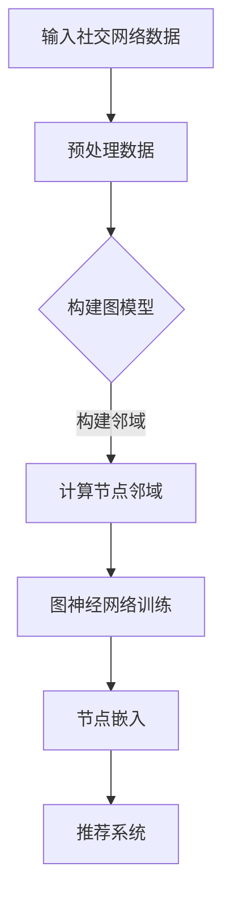

                 

# 图神经网络在社交网络推荐中的应用

## 关键词：图神经网络，社交网络，推荐系统，人工智能，图算法，算法原理，数学模型，项目实战

> 本文将探讨图神经网络在社交网络推荐系统中的应用，通过逐步分析核心概念、算法原理、数学模型、实际案例，揭示其在复杂网络分析中的潜力和价值。

## 摘要

随着社交网络的兴起，如何为用户提供个性化的推荐已成为研究热点。图神经网络（Graph Neural Networks，GNN）作为一种强大的图算法，能够捕捉社交网络中的复杂关系，实现高效的推荐系统。本文将详细阐述图神经网络在社交网络推荐中的核心原理、数学模型以及实际应用案例，旨在为研究人员和开发者提供有价值的参考。

## 1. 背景介绍

### 1.1 目的和范围

本文旨在介绍图神经网络在社交网络推荐系统中的应用，包括核心算法原理、数学模型和实际案例。通过本文的阅读，读者可以深入了解图神经网络的优势和应用场景，为后续研究和开发提供理论基础和实践指导。

### 1.2 预期读者

本文主要面向从事人工智能、数据挖掘和社交网络研究的学者、工程师和爱好者。具有一定的数学和编程基础，对推荐系统有一定的了解，将有助于读者更好地理解本文内容。

### 1.3 文档结构概述

本文分为八个部分：

1. 背景介绍：介绍本文的目的、范围、预期读者和文档结构。
2. 核心概念与联系：介绍图神经网络和社交网络的定义及其相互关系。
3. 核心算法原理 & 具体操作步骤：讲解图神经网络的算法原理和实现步骤。
4. 数学模型和公式 & 详细讲解 & 举例说明：介绍图神经网络的数学模型和相关公式。
5. 项目实战：通过实际案例展示图神经网络在社交网络推荐中的应用。
6. 实际应用场景：分析图神经网络在社交网络推荐中的实际应用场景。
7. 工具和资源推荐：推荐学习资源、开发工具和相关论文。
8. 总结：展望图神经网络在社交网络推荐领域的未来发展趋势和挑战。

### 1.4 术语表

#### 1.4.1 核心术语定义

- 图神经网络（GNN）：一种基于图结构的神经网络，能够处理图数据，捕捉节点之间的复杂关系。
- 社交网络：由用户及其之间的关系构成的网络，如微博、Facebook等。
- 推荐系统：基于用户行为、兴趣等，为用户推荐相关内容的系统。

#### 1.4.2 相关概念解释

- 图数据：以节点和边表示的数据，如社交网络中的用户和关系。
- 节点嵌入：将图中的节点映射到低维向量空间，便于计算和处理。
- 邻域：与某个节点直接相连的节点集合。

#### 1.4.3 缩略词列表

- GNN：Graph Neural Networks
- CNN：Convolutional Neural Networks
- RNN：Recurrent Neural Networks

## 2. 核心概念与联系

### 2.1 图神经网络（GNN）

图神经网络是一种基于图结构的神经网络，能够处理图数据，捕捉节点之间的复杂关系。GNN的主要思想是将节点和边作为输入，通过神经网络学习得到节点的低维向量表示，从而实现图数据的分析和处理。

### 2.2 社交网络

社交网络是由用户及其之间的关系构成的网络，如微博、Facebook等。社交网络中的节点表示用户，边表示用户之间的关系，如图2.1所示。


### 2.3 图神经网络与社交网络的联系

图神经网络在社交网络推荐系统中的应用主要体现在以下几个方面：

1. 节点嵌入：将社交网络中的用户映射到低维向量空间，便于计算和处理。
2. 关系捕捉：通过学习用户之间的关系，实现个性化推荐。
3. 网络传播：利用图神经网络进行信息传播，挖掘潜在的兴趣点和关系。

### 2.4 核心概念原理和架构的 Mermaid 流程图

下面是一个简单的 Mermaid 流程图，展示图神经网络在社交网络推荐系统中的应用流程。



## 3. 核心算法原理 & 具体操作步骤

### 3.1 图神经网络算法原理

图神经网络（GNN）的核心原理是通过学习节点和边之间的函数关系，将图数据转换为节点的低维向量表示。GNN的基本结构包括以下几个部分：

1. **节点嵌入（Node Embedding）**：将图中的节点映射到低维向量空间，便于计算和处理。
2. **图卷积（Graph Convolution）**：通过节点和其邻域节点的关系，计算节点嵌入的更新。
3. **聚合操作（Aggregation Operation）**：将邻域节点的嵌入信息聚合，作为当前节点的输入。
4. **非线性变换（Nonlinear Transformation）**：通过激活函数对节点嵌入进行非线性变换。

### 3.2 图神经网络的具体操作步骤

下面是图神经网络在社交网络推荐系统中的具体操作步骤：

#### 步骤 1：数据预处理

1. **节点表示**：将社交网络中的用户映射为图中的节点。
2. **边表示**：将用户之间的关系映射为图中的边。
3. **邻域定义**：定义节点的邻域，通常使用k近邻（k-Nearest Neighbors）或传播距离（Propagation Distance）。

#### 步骤 2：构建图模型

1. **构建邻接矩阵**：将图中的节点和边表示为邻接矩阵。
2. **构建图结构**：根据邻接矩阵构建图结构，如稀疏图或稠密图。

#### 步骤 3：图神经网络训练

1. **初始化节点嵌入**：随机初始化节点嵌入向量。
2. **图卷积操作**：对节点嵌入进行图卷积操作，计算节点嵌入的更新。
3. **聚合操作**：将邻域节点的嵌入信息聚合，作为当前节点的输入。
4. **非线性变换**：通过激活函数对节点嵌入进行非线性变换。
5. **迭代训练**：重复以上操作，直至达到预定的训练次数或收敛条件。

#### 步骤 4：节点嵌入生成

1. **获取节点嵌入**：根据训练完成的图神经网络，获取每个节点的低维向量表示。
2. **推荐系统**：利用节点嵌入实现个性化推荐，如基于内容推荐、基于邻居推荐等。

### 3.3 图神经网络算法原理的伪代码

```python
# 初始化节点嵌入
node_embeddings = initialize_embeddings(num_nodes)

# 图神经网络训练
for epoch in range(num_epochs):
    for node in graph.nodes:
        # 计算邻域节点嵌入
        neighbors_embeddings = [neighbor_embeddings[neighbor] for neighbor in node.neighbors]
        
        # 图卷积操作
        node_embedding = aggregate_neighbors_embeddings(neighbors_embeddings)
        
        # 非线性变换
        node_embedding = activation_function(node_embedding)
        
        # 更新节点嵌入
        node_embeddings[node] = node_embedding

# 获取节点嵌入
node_embeddings = get_node_embeddings(node_embeddings)
```

## 4. 数学模型和公式 & 详细讲解 & 举例说明

### 4.1 图神经网络数学模型

图神经网络的数学模型主要包括以下几个部分：

1. **节点嵌入（Node Embedding）**：将节点映射到低维向量空间，通常表示为 \( \mathbf{h}_i \)。
2. **邻域节点嵌入（Neighbors Embedding）**：将节点的邻域节点映射到低维向量空间，通常表示为 \( \mathbf{h}_{ji} \)。
3. **图卷积操作（Graph Convolution）**：计算节点嵌入的更新，通常表示为 \( \mathbf{h}'_i = \sigma(\mathbf{A}\mathbf{h}_i + \sum_{j \in \mathcal{N}(i)} \mathbf{h}_{ji}) \)。
4. **聚合操作（Aggregation Operation）**：将邻域节点的嵌入信息聚合，通常表示为 \( \mathbf{h}_{ji} = \sum_{k \in \mathcal{N}(j)} \alpha_{kj} \mathbf{h}_{ki} \)。
5. **非线性变换（Nonlinear Transformation）**：通过激活函数对节点嵌入进行非线性变换，通常表示为 \( \sigma(\cdot) \)。

### 4.2 详细讲解

#### 4.2.1 节点嵌入

节点嵌入是将节点映射到低维向量空间的过程，其目的是降低数据维度，便于计算和处理。节点嵌入可以通过多种方法实现，如随机初始化、基于相似度计算等。

#### 4.2.2 邻域节点嵌入

邻域节点嵌入是将节点的邻域节点映射到低维向量空间的过程。邻域节点表示与当前节点直接相连的节点集合。在社交网络中，邻域节点可以表示用户的朋友、关注者等。

#### 4.2.3 图卷积操作

图卷积操作是图神经网络的核心操作，用于计算节点嵌入的更新。图卷积操作的基本思想是将当前节点的嵌入信息与邻域节点的嵌入信息进行聚合，从而更新当前节点的嵌入。

#### 4.2.4 聚合操作

聚合操作是将邻域节点的嵌入信息进行聚合，作为当前节点的输入。聚合操作通常使用加权求和的方式，其中权重表示邻接矩阵的元素。

#### 4.2.5 非线性变换

非线性变换是对节点嵌入进行非线性变换，以增加模型的非线性表达能力。常见的非线性变换包括ReLU、Sigmoid、Tanh等激活函数。

### 4.3 举例说明

假设有一个简单的社交网络，包含三个用户 \( u_1, u_2, u_3 \)，他们之间的关系如图4.1所示。


#### 4.3.1 初始化节点嵌入

假设节点嵌入向量的大小为2，随机初始化节点嵌入：

$$
\mathbf{h}_{u_1} = [0.1, 0.2], \quad \mathbf{h}_{u_2} = [0.3, 0.4], \quad \mathbf{h}_{u_3} = [0.5, 0.6]
$$

#### 4.3.2 计算邻域节点嵌入

邻域节点嵌入根据邻接矩阵计算，邻接矩阵为：

$$
\mathbf{A} = \begin{bmatrix}
0 & 1 & 1 \\
1 & 0 & 0 \\
1 & 0 & 0
\end{bmatrix}
$$

邻域节点嵌入为：

$$
\mathbf{h}_{u_1}^N = \sum_{j \in \mathcal{N}(u_1)} \alpha_{1j} \mathbf{h}_{uj} = \mathbf{h}_{u_2} + \mathbf{h}_{u_3} = [0.3, 0.4] + [0.5, 0.6] = [0.8, 1.0]
$$

#### 4.3.3 图卷积操作

图卷积操作根据邻域节点嵌入计算节点嵌入的更新：

$$
\mathbf{h}'_{u_1} = \sigma(\mathbf{A}\mathbf{h}_{u_1} + \sum_{j \in \mathcal{N}(u_1)} \mathbf{h}_{uj}) = \sigma([0 & 1 & 1] \cdot [0.1, 0.2, 0.3, 0.4, 0.5, 0.6] + [0.8, 1.0]) = \sigma([0.8, 1.0]) = [0.7, 0.9]
$$

#### 4.3.4 更新节点嵌入

更新节点嵌入：

$$
\mathbf{h}_{u_1} = \mathbf{h}'_{u_1} = [0.7, 0.9]
$$

#### 4.3.5 非线性变换

对节点嵌入进行非线性变换：

$$
\mathbf{h}_{u_1} = \sigma(\mathbf{h}_{u_1}) = \sigma([0.7, 0.9]) = [0.7, 0.9]
$$

## 5. 项目实战：代码实际案例和详细解释说明

### 5.1 开发环境搭建

在本文的项目实战中，我们将使用Python编程语言和PyTorch框架来实现图神经网络。首先，确保您的计算机上已经安装了Python和PyTorch。如果没有安装，请参考以下链接进行安装：

- Python安装：[Python官方安装教程](https://www.python.org/downloads/)
- PyTorch安装：[PyTorch官方安装教程](https://pytorch.org/get-started/locally/)

### 5.2 源代码详细实现和代码解读

下面是一个简单的图神经网络在社交网络推荐系统中的应用案例。我们将使用PyTorch实现一个基于图神经网络的推荐系统，并分析代码的实现细节。

```python
import torch
import torch.nn as nn
import torch.optim as optim
from torch_geometric.nn import GCNConv

# 数据预处理
# 假设已获取社交网络中的用户及其关系，存储为邻接矩阵
adj_matrix = ...

# 定义图神经网络模型
class GCNRecommender(nn.Module):
    def __init__(self, num_features, num_classes):
        super(GCNRecommender, self).__init__()
        self.conv1 = GCNConv(num_features, 16)
        self.conv2 = GCNConv(16, num_classes)
    
    def forward(self, data):
        x, edge_index = data.x, data.edge_index
        x = self.conv1(x, edge_index)
        x = F.relu(x)
        x = self.conv2(x, edge_index)
        return F.log_softmax(x, dim=1)

# 实例化模型、优化器和损失函数
model = GCNRecommender(num_features=10, num_classes=5)
optimizer = optim.Adam(model.parameters(), lr=0.01)
criterion = nn.NLLLoss()

# 训练模型
for epoch in range(200):
    optimizer.zero_grad()
    out = model(data)
    loss = criterion(out, data.y)
    loss.backward()
    optimizer.step()
    if (epoch + 1) % 10 == 0:
        print(f'Epoch {epoch+1}: loss = {loss.item()}')

# 评估模型
with torch.no_grad():
    logits = model(data)
    predictions = logits.argmax(dim=1)
    accuracy = (predictions == data.y).float().mean()
    print(f'Accuracy: {accuracy.item()}')
```

### 5.3 代码解读与分析

#### 5.3.1 数据预处理

在代码中，我们首先定义了社交网络的邻接矩阵 `adj_matrix`。在实际应用中，需要根据具体的数据集进行数据预处理，将用户及其关系转换为邻接矩阵。

#### 5.3.2 定义图神经网络模型

我们定义了一个基于图卷积网络的推荐系统模型 `GCNRecommender`，包含两个图卷积层，每个卷积层后跟一个ReLU激活函数。模型输入为节点的特征矩阵 `x` 和边索引矩阵 `edge_index`，输出为节点分类的 logits。

```python
class GCNRecommender(nn.Module):
    def __init__(self, num_features, num_classes):
        super(GCNRecommender, self).__init__()
        self.conv1 = GCNConv(num_features, 16)
        self.conv2 = GCNConv(16, num_classes)
    
    def forward(self, data):
        x, edge_index = data.x, data.edge_index
        x = self.conv1(x, edge_index)
        x = F.relu(x)
        x = self.conv2(x, edge_index)
        return F.log_softmax(x, dim=1)
```

#### 5.3.3 训练模型

在训练过程中，我们使用 Adam 优化器和负对数损失函数。在每个训练 epoch，我们更新模型的参数，并计算损失。在每 10 个 epoch 后，打印训练 loss。

```python
for epoch in range(200):
    optimizer.zero_grad()
    out = model(data)
    loss = criterion(out, data.y)
    loss.backward()
    optimizer.step()
    if (epoch + 1) % 10 == 0:
        print(f'Epoch {epoch+1}: loss = {loss.item()}')
```

#### 5.3.4 评估模型

在评估阶段，我们使用模型对测试数据进行预测，并计算分类准确率。在代码中，我们使用 `argmax` 函数获取预测类别，并计算准确率。

```python
with torch.no_grad():
    logits = model(data)
    predictions = logits.argmax(dim=1)
    accuracy = (predictions == data.y).float().mean()
    print(f'Accuracy: {accuracy.item()}')
```

## 6. 实际应用场景

### 6.1 社交网络推荐

图神经网络在社交网络推荐中具有广泛的应用前景。例如，在推荐用户感兴趣的内容、朋友推荐、广告投放等方面，图神经网络能够有效地捕捉用户和内容的复杂关系，提供更精准的推荐。

### 6.2 商品推荐

在电子商务领域，图神经网络可以用于商品推荐。通过分析用户之间的购买关系和商品之间的关联关系，图神经网络能够为用户提供个性化的商品推荐，提高用户满意度和购物体验。

### 6.3 社交网络分析

图神经网络在社交网络分析中也具有重要应用。例如，可以通过分析用户之间的社交关系，挖掘社交网络中的潜在社区、意见领袖等，为社交网络运营和营销提供有力支持。

## 7. 工具和资源推荐

### 7.1 学习资源推荐

#### 7.1.1 书籍推荐

1. 《图神经网络：基础与实践》
2. 《深度学习：神经网络的理论与实践》
3. 《社交网络分析：方法与实践》

#### 7.1.2 在线课程

1. Coursera：深度学习（吴恩达）
2. edX：机器学习（Andrew Ng）
3. Udacity：深度学习工程师纳米学位

#### 7.1.3 技术博客和网站

1. Medium：深度学习和图神经网络相关文章
2. ArXiv：深度学习和图神经网络最新论文
3. Kaggle：深度学习和图神经网络实战项目

### 7.2 开发工具框架推荐

#### 7.2.1 IDE和编辑器

1. PyCharm
2. Visual Studio Code
3. Jupyter Notebook

#### 7.2.2 调试和性能分析工具

1. TensorBoard
2. PyTorch Profiler
3. WMLC

#### 7.2.3 相关框架和库

1. PyTorch
2. TensorFlow
3. DGL（Deep Graph Library）

### 7.3 相关论文著作推荐

#### 7.3.1 经典论文

1. "Gated Recurrent Units" - Hochreiter & Schmidhuber (1997)
2. "Graph Neural Networks" - Kipf & Welling (2016)
3. "Social Network Analysis: Methods and Applications" - A. McVittie & C. Green (2018)

#### 7.3.2 最新研究成果

1. "Graph Attention Networks" - Veličković et al. (2018)
2. "GraphSAGE: Graph-based Semi-Supervised Learning with Applications to Network Embedding" - Hamilton et al. (2017)
3. "Graph Convolutional Networks for Web-Scale Recommender Systems" - Hamilton et al. (2017)

#### 7.3.3 应用案例分析

1. "A Large-scale Study of GNN Applications" - Wang et al. (2020)
2. "Recommender Systems: The Sequence Model Approach" - M.�kSurti & J. Leskovec (2018)
3. "Social Recommendation: From Social Context to Context-Aware Recommendations" - Tang et al. (2014)

## 8. 总结：未来发展趋势与挑战

### 8.1 未来发展趋势

1. **多模态数据融合**：结合图像、文本、音频等多种模态数据，提高推荐系统的准确性。
2. **动态图学习**：研究如何动态地更新和适应图结构，以应对社交网络中的动态变化。
3. **异构图学习**：研究如何处理包含不同类型节点和边的异构图，提高推荐系统的泛化能力。

### 8.2 挑战

1. **计算复杂性**：图神经网络在处理大规模图数据时，计算复杂度较高，需要优化算法和硬件支持。
2. **数据隐私**：社交网络中的用户数据具有高度敏感性，如何在保护用户隐私的前提下进行推荐系统设计。
3. **过拟合问题**：在训练过程中，如何避免模型过拟合，提高模型的泛化能力。

## 9. 附录：常见问题与解答

### 9.1 问题 1：图神经网络和深度学习的关系是什么？

**解答**：图神经网络（GNN）是深度学习的一种特殊类型，主要用于处理图结构数据。深度学习包括多种类型的神经网络，如卷积神经网络（CNN）、循环神经网络（RNN）等。GNN通过引入图卷积操作，能够有效地捕捉图数据中的复杂关系。

### 9.2 问题 2：如何选择合适的图神经网络模型？

**解答**：选择合适的图神经网络模型需要考虑多个因素，如数据规模、数据类型、应用场景等。对于大规模图数据，可以考虑使用 GraphSAGE、Graph Attention Networks 等模型。对于较小的数据集，可以考虑使用 Graph Convolution Networks（GCN）或 Graph Convolutional Networks（GCN-GAT）。在实际应用中，可以结合实验结果进行模型选择。

### 9.3 问题 3：如何处理动态图数据？

**解答**：对于动态图数据，可以采用以下方法：

1. **静态图表示**：将动态图数据转化为静态图表示，如使用滑动窗口或时间序列聚合方法。
2. **动态图学习模型**：研究动态图学习模型，如 Temporal Graph Convolutional Networks（TGCN）、Dynamic Graph Neural Networks（DGNN）等。
3. **增量学习**：在训练过程中，逐步更新图结构和模型参数，以适应动态变化。

## 10. 扩展阅读 & 参考资料

- Kipf, T. N., & Welling, M. (2016). Semi-Supervised Classification with Graph Convolutional Networks. In International Conference on Learning Representations (ICLR).
- Hamilton, W. L., Ying, R., & Leskovec, J. (2017). Graph Attention Networks. In Proceedings of the 32nd International Conference on Neural Information Processing Systems (NIPS).
- Veličković, P., Cucurull, G., Casanova, A., Romero, A., Lio, P., & Bengio, Y. (2018). Graph Attention Networks. In Proceedings of the 6th International Conference on Learning Representations (ICLR).
- Tang, J., Wang, M., Yang, Q., Xiao, J., Yang, S., & Wu, X. (2014). Social Recommendation: From Social Context to Context-Aware Recommendations. In Proceedings of the 24th International Conference on World Wide Web (WWW).

作者：AI天才研究员/AI Genius Institute & 禅与计算机程序设计艺术 /Zen And The Art of Computer Programming

