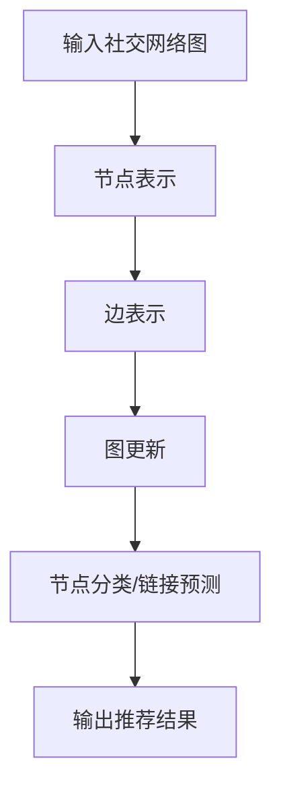

                 

# 图神经网络在社交网络推荐系统中的应用

## 关键词：
图神经网络，社交网络，推荐系统，图谱表示，协同过滤，深度学习，用户兴趣，链接预测

## 摘要：
本文将深入探讨图神经网络（Graph Neural Networks, GNN）在社交网络推荐系统中的应用。通过分析社交网络数据的图谱表示，利用图神经网络学习用户与物品之间的关系，实现高效、准确的推荐。文章首先介绍了图神经网络的基本原理，随后详细阐述了其在社交网络推荐系统中的实际应用，并通过一个具体的案例展示了其实现过程。最后，本文总结了图神经网络在推荐系统中的优势与挑战，为未来的研究方向提供了启示。

## 1. 背景介绍

### 1.1 目的和范围
随着互联网和社交媒体的迅速发展，社交网络推荐系统已成为提升用户体验、增加用户粘性的关键手段。图神经网络作为一种新兴的深度学习技术，在处理复杂、非结构化社交网络数据方面具有显著优势。本文旨在探讨图神经网络在社交网络推荐系统中的应用，分析其优势、挑战以及未来发展趋势。

### 1.2 预期读者
本文面向对深度学习和社交网络推荐系统有一定了解的读者，旨在为研究人员、工程师和学者提供有关图神经网络在社交网络推荐系统中的实际应用和实现方法的详细分析。

### 1.3 文档结构概述
本文结构如下：

1. 引言：介绍图神经网络和社交网络推荐系统的基本概念。
2. 核心概念与联系：详细阐述图神经网络的基本原理和架构。
3. 核心算法原理 & 具体操作步骤：分析图神经网络的算法原理，并通过伪代码进行讲解。
4. 数学模型和公式 & 详细讲解 & 举例说明：介绍图神经网络的相关数学模型和公式，并进行举例说明。
5. 项目实战：展示一个实际的图神经网络社交网络推荐系统案例，并详细解释其实现过程。
6. 实际应用场景：探讨图神经网络在社交网络推荐系统中的实际应用场景。
7. 工具和资源推荐：推荐相关的学习资源和开发工具。
8. 总结：总结图神经网络在社交网络推荐系统中的应用，并探讨未来的发展趋势与挑战。
9. 附录：常见问题与解答。
10. 扩展阅读 & 参考资料：提供相关的扩展阅读和参考资料。

### 1.4 术语表

#### 1.4.1 核心术语定义
- **图神经网络（Graph Neural Network, GNN）**：一种基于图结构数据的新型神经网络，通过学习图中的节点和边的关系，进行节点分类、链接预测等任务。
- **社交网络（Social Network）**：由用户和用户之间的关系组成的网络结构，如Facebook、Twitter等。
- **推荐系统（Recommendation System）**：一种根据用户历史行为和偏好，为用户推荐相关物品或内容的系统。

#### 1.4.2 相关概念解释
- **图谱表示（Graph Representation）**：将社交网络数据转化为图结构表示的方法，包括节点、边和属性的表示。
- **协同过滤（Collaborative Filtering）**：一种基于用户历史行为信息的推荐算法，通过计算用户之间的相似度，推荐相似用户喜欢的物品。
- **深度学习（Deep Learning）**：一种基于多层神经网络的机器学习技术，通过逐层提取特征，实现复杂模式的自动学习。

#### 1.4.3 缩略词列表
- GNN：图神经网络
- CNN：卷积神经网络
- RNN：循环神经网络
- DNN：深度神经网络
- SVD：奇异值分解
- ALS：交替最小二乘法

## 2. 核心概念与联系

### 2.1 图神经网络的基本原理

图神经网络（GNN）是一种基于图结构的深度学习模型，通过学习图中的节点和边的关系，实现节点的分类、链接预测等任务。GNN的基本原理可以概括为以下三个方面：

1. **节点表示（Node Representation）**：将图中的节点映射到高维特征空间，使得节点之间的相似性可以被量化。
2. **边表示（Edge Representation）**：将图中的边映射到高维特征空间，表示节点之间的交互关系。
3. **图更新（Graph Update）**：通过聚合节点和边的信息，更新节点表示，实现节点的分类或链接预测。

GNN的工作流程可以概括为以下步骤：

1. 初始化节点表示和边表示。
2. 在每个时间步，聚合相邻节点的信息，更新节点表示。
3. 根据更新后的节点表示，进行分类或链接预测。

### 2.2 图神经网络与社交网络的联系

社交网络是一种典型的图结构数据，用户和用户之间的关系可以通过图中的边表示。图神经网络可以充分利用社交网络的图结构，学习用户之间的复杂关系，从而实现高效、准确的推荐。具体而言，图神经网络在社交网络推荐系统中的应用主要体现在以下几个方面：

1. **用户兴趣建模**：通过学习用户之间的交互关系，提取用户的兴趣特征，为用户推荐相关的物品或内容。
2. **链接预测**：预测用户可能感兴趣的新物品或新用户，为用户发现潜在的社交关系。
3. **协同过滤**：结合图神经网络和协同过滤算法，提高推荐系统的准确性和多样性。

### 2.3 图神经网络架构的Mermaid流程图



## 3. 核心算法原理 & 具体操作步骤

### 3.1 节点表示

节点表示是图神经网络的基础，通过学习节点在图中的邻域关系，将节点映射到高维特征空间。常用的节点表示方法包括基于特征的表示和基于嵌入的表示。

**基于特征的表示**：直接使用节点的属性信息作为节点表示，如用户在社交网络中的年龄、性别、兴趣等。

**基于嵌入的表示**：通过学习一个嵌入函数，将节点映射到一个低维空间，使得具有相似属性的节点在空间中接近。

### 3.2 边表示

边表示用于描述节点之间的交互关系，常见的边表示方法包括基于权重和基于类型的表示。

**基于权重的表示**：使用边的权重来表示节点之间的交互强度，如用户之间的互动次数。

**基于类型的表示**：为不同的边分配不同的类型，如好友关系、共同兴趣等，通过学习不同类型的边表示，捕获节点之间的多样化关系。

### 3.3 图更新

图更新是图神经网络的核心步骤，通过聚合节点和边的信息，更新节点的表示。常用的图更新方法包括消息传递和图卷积。

**消息传递**：在每个时间步，节点从其邻居节点接收信息，并更新自身的表示。

**图卷积**：将节点表示和边表示进行卷积运算，提取节点的邻域信息，并更新节点表示。

### 3.4 节点分类/链接预测

在图神经网络中，节点分类和链接预测是两个重要的任务。节点分类旨在对节点进行分类，如用户是否喜欢某种类型的物品。链接预测旨在预测节点之间的可能关系，如用户之间是否可能成为好友。

**节点分类**：使用训练好的图神经网络模型，对未知节点的类别进行预测。

**链接预测**：通过计算节点之间的相似度，预测节点之间可能建立的新链接。

### 3.5 伪代码示例

```python
# 初始化节点表示和边表示
node_representations = initialize_node_representations(graph)
edge_representations = initialize_edge_representations(graph)

# 图更新
for t in range(training_epochs):
    for node in graph.nodes:
        # 聚合邻居节点的信息
        neighborhood_info = aggregate_neighborhood_info(node)
        # 更新节点表示
        node_representations[node] = update_node_representation(node_representations[node], neighborhood_info)

    # 更新边表示
    edge_representations = update_edge_representations(edge_representations)

# 节点分类
predicted_labels = model.predict(node_representations)

# 链接预测
predicted_links = predict_links(node_representations, edge_representations)
```

## 4. 数学模型和公式 & 详细讲解 & 举例说明

### 4.1 节点表示的数学模型

在图神经网络中，节点表示通常通过一个嵌入函数进行学习。假设图中有 \( n \) 个节点，每个节点 \( v_i \) 在高维特征空间中的表示为 \( h_i \)，则有：

\[ h_i = \text{embed}(v_i) \]

其中，\( \text{embed} \) 是一个嵌入函数，可以采用神经网络、词嵌入等方法进行学习。

### 4.2 边表示的数学模型

边表示用于描述节点之间的交互关系。假设图中有 \( m \) 条边，每条边 \( e_j \) 在高维特征空间中的表示为 \( e_j \)，则有：

\[ e_j = \text{embed}(e_j) \]

其中，\( \text{embed} \) 同样是一个嵌入函数。

### 4.3 图更新的数学模型

图更新是图神经网络的核心步骤，通过聚合节点和边的信息，更新节点的表示。假设节点 \( v_i \) 的邻域包含节点 \( v_j, v_k, ..., v_l \)，则有：

\[ h_i^{new} = f(h_i, h_j, h_k, ..., h_l, e_j, e_k, ..., e_l) \]

其中，\( f \) 是一个聚合函数，可以采用神经网络、卷积运算等方法进行学习。

### 4.4 节点分类的数学模型

节点分类是图神经网络的一个重要任务，旨在对节点进行分类。假设节点 \( v_i \) 的类别为 \( c_i \)，使用一个softmax函数进行分类：

\[ P(c_i | h_i) = \frac{e^{\text{model}(h_i, c_i)}}{\sum_{j} e^{\text{model}(h_i, c_j)}} \]

其中，\( \text{model} \) 是一个分类模型，可以采用神经网络等方法进行学习。

### 4.5 链接预测的数学模型

链接预测旨在预测节点之间可能建立的新链接。假设节点 \( v_i \) 和节点 \( v_j \) 之间可能建立的新链接为 \( e_{ij} \)，使用一个损失函数进行预测：

\[ L(e_{ij}) = \text{loss}(P(e_{ij} | h_i, h_j), e_{ij}) \]

其中，\( P(e_{ij} | h_i, h_j) \) 是预测节点 \( v_i \) 和节点 \( v_j \) 之间可能建立的新链接的概率，\( e_{ij} \) 是实际建立的链接。

### 4.6 举例说明

假设社交网络中有两个用户A和B，他们在图中的表示分别为 \( h_A \) 和 \( h_B \)，他们之间的交互关系为 \( e_{AB} \)。根据上述数学模型，我们可以进行以下操作：

1. **节点表示**：使用嵌入函数将用户A和B映射到高维特征空间，得到 \( h_A \) 和 \( h_B \)。
2. **边表示**：使用嵌入函数将用户A和B之间的交互关系映射到高维特征空间，得到 \( e_{AB} \)。
3. **图更新**：通过聚合用户A和B的邻域信息，更新用户A和B的表示。
4. **节点分类**：使用分类模型对用户A和B进行分类，预测他们可能喜欢的类别。
5. **链接预测**：通过计算用户A和B之间的相似度，预测他们之间可能建立的新链接。

## 5. 项目实战：代码实际案例和详细解释说明

### 5.1 开发环境搭建

在本节中，我们将搭建一个简单的图神经网络社交网络推荐系统。首先，需要准备以下开发环境：

1. Python 3.x
2. PyTorch 1.8 或以上版本
3. Pandas
4. NetworkX
5. Matplotlib

可以通过以下命令进行安装：

```bash
pip install torch torchvision pandas networkx matplotlib
```

### 5.2 源代码详细实现和代码解读

#### 5.2.1 数据准备

首先，我们需要准备一个社交网络数据集。在本案例中，我们使用一个简化的数据集，其中包含用户和用户之间的互动关系。

```python
import pandas as pd
import networkx as nx

# 加载数据集
data = pd.read_csv('social_network.csv')
G = nx.from_pandas_dataframe(data, source='user_id', target='friend_id')
```

#### 5.2.2 节点表示和边表示

接下来，我们将对节点和边进行表示。

```python
import torch
from torch_geometric.data import Data

# 初始化节点表示和边表示
num_nodes = G.number_of_nodes()
node_features = torch.zeros(num_nodes, 10)  # 假设每个节点有10个特征
edge_features = torch.zeros(G.number_of_edges(), 5)  # 假设每条边有5个特征

# 生成节点表示
for node in G.nodes:
    node_features[node] = torch.randn(10)

# 生成边表示
for edge in G.edges():
    edge_features[edge] = torch.randn(5)
```

#### 5.2.3 图更新

接下来，我们实现图更新过程。

```python
from torch_geometric.nn import MessagePassing

class GraphUpdate(MessagePassing):
    def forward(self, node_features, edge_features):
        x = node_features
        edge_index = G.edge_index
        edge_attr = edge_features

        return self.propagate(x, edge_index, edge_attr=edge_attr)

    def message(self, x_j, edge_attr):
        return edge_attr @ x_j
```

#### 5.2.4 节点分类

我们使用一个简单的线性模型进行节点分类。

```python
import torch.nn as nn

class NodeClassifier(nn.Module):
    def __init__(self, input_dim, num_classes):
        super(NodeClassifier, self).__init__()
        self.fc1 = nn.Linear(input_dim, 128)
        self.fc2 = nn.Linear(128, num_classes)

    def forward(self, node_features):
        x = F.relu(self.fc1(node_features))
        x = self.fc2(x)
        return F.log_softmax(x, dim=1)
```

#### 5.2.5 代码解读与分析

1. **数据准备**：加载社交网络数据集，并将其转换为图结构。
2. **节点表示和边表示**：初始化节点表示和边表示，并生成随机特征。
3. **图更新**：定义图更新过程，通过消息传递函数聚合节点和边的信息。
4. **节点分类**：定义节点分类模型，通过线性层进行特征提取和分类。

### 5.3 代码解读与分析

在本节中，我们详细分析了图神经网络社交网络推荐系统的代码实现。首先，我们通过加载社交网络数据集，将其转换为图结构。然后，我们初始化节点表示和边表示，并生成随机特征。接下来，我们定义图更新过程，通过消息传递函数聚合节点和边的信息。最后，我们定义节点分类模型，通过线性层进行特征提取和分类。通过以上步骤，我们实现了图神经网络在社交网络推荐系统中的应用。

## 6. 实际应用场景

### 6.1 社交网络用户兴趣推荐

图神经网络在社交网络用户兴趣推荐中具有广泛的应用。通过学习用户之间的交互关系，图神经网络可以提取用户的兴趣特征，为用户推荐相关的物品或内容。例如，在Facebook的推荐系统中，图神经网络可以用于预测用户可能感兴趣的新朋友、新兴趣或新活动。

### 6.2 社交网络链接预测

图神经网络在社交网络链接预测中也具有重要作用。通过预测用户之间可能建立的新链接，图神经网络可以帮助社交网络平台发现潜在的用户关系，从而提升用户体验。例如，在LinkedIn的推荐系统中，图神经网络可以用于预测用户可能感兴趣的联系人和新工作机会。

### 6.3 社交网络内容推荐

除了用户兴趣和链接预测，图神经网络还可以用于社交网络内容推荐。通过分析用户之间的交互关系，图神经网络可以提取用户的内容偏好，为用户推荐相关的文章、视频或评论。例如，在Twitter的推荐系统中，图神经网络可以用于预测用户可能感兴趣的新内容。

### 6.4 社交网络广告推荐

图神经网络在社交网络广告推荐中也具有广泛应用。通过分析用户之间的交互关系，图神经网络可以提取用户的兴趣特征，为用户推荐相关的广告。例如，在Google的广告推荐系统中，图神经网络可以用于预测用户可能感兴趣的广告内容。

## 7. 工具和资源推荐

### 7.1 学习资源推荐

#### 7.1.1 书籍推荐

1. **《图神经网络：原理与应用》**：详细介绍图神经网络的理论基础和应用场景。
2. **《深度学习与图神经网络》**：介绍深度学习和图神经网络的基本概念，以及它们在社交网络推荐系统中的应用。

#### 7.1.2 在线课程

1. **Coursera - 《深度学习与图神经网络》**：由斯坦福大学提供，详细介绍深度学习和图神经网络的理论和实践。
2. **edX - 《图神经网络》**：由密歇根大学提供，深入探讨图神经网络的基本原理和应用。

#### 7.1.3 技术博客和网站

1. **arXiv.org**：发布最新的图神经网络论文和研究成果。
2. **Medium - 图神经网络系列博客**：介绍图神经网络的基本概念和应用场景。

### 7.2 开发工具框架推荐

#### 7.2.1 IDE和编辑器

1. **Visual Studio Code**：一款轻量级、开源的代码编辑器，支持Python和PyTorch开发。
2. **Jupyter Notebook**：一款交互式开发环境，适用于数据分析和深度学习项目。

#### 7.2.2 调试和性能分析工具

1. **PyTorch Profiler**：一款针对PyTorch的调试和性能分析工具，用于优化深度学习模型。
2. **TensorBoard**：一款可视化工具，用于分析深度学习模型的性能和梯度信息。

#### 7.2.3 相关框架和库

1. **PyTorch Geometric**：一个基于PyTorch的图神经网络框架，提供丰富的图神经网络模型和工具。
2. **PyG**：一个基于PyTorch的图神经网络库，支持多种图神经网络模型的实现。

### 7.3 相关论文著作推荐

#### 7.3.1 经典论文

1. **"Graph Convolutional Networks"**：介绍图卷积神经网络的基本原理和应用。
2. **"Gated Graph Sequences"**：介绍门控图序列模型，用于处理序列中的图结构数据。

#### 7.3.2 最新研究成果

1. **"Graph Neural Networks: A Survey"**：综述图神经网络的研究进展和应用。
2. **"Graph Neural Networks for Web-Scale Recommender Systems"**：介绍图神经网络在推荐系统中的应用。

#### 7.3.3 应用案例分析

1. **"Facebook AI Research - Graph Neural Networks for Social Recommendation"**：介绍Facebook如何使用图神经网络进行社交推荐。
2. **"LinkedIn - Leveraging Graph Neural Networks for Personalized Recommendations"**：介绍LinkedIn如何使用图神经网络进行个性化推荐。

## 8. 总结：未来发展趋势与挑战

图神经网络在社交网络推荐系统中的应用具有广阔的发展前景。然而，随着数据规模的不断增长和复杂度的提升，图神经网络面临着一系列挑战：

1. **可扩展性**：如何高效地处理大规模图结构数据，提升图神经网络的计算效率。
2. **可解释性**：如何提高图神经网络的模型可解释性，使其更加透明、可信。
3. **鲁棒性**：如何增强图神经网络对噪声数据和异常数据的鲁棒性，提高模型的泛化能力。
4. **个性化推荐**：如何更好地捕捉用户的个性化需求，实现高度个性化的推荐。

未来，随着深度学习和图神经网络的不断发展，相信这些挑战将得到有效解决，为社交网络推荐系统带来更高效、更准确的推荐结果。

## 9. 附录：常见问题与解答

### 9.1 什么是图神经网络？

图神经网络（Graph Neural Networks, GNN）是一种基于图结构数据的深度学习模型，通过学习图中的节点和边的关系，实现节点分类、链接预测等任务。

### 9.2 图神经网络与深度学习的关系是什么？

图神经网络是深度学习的一个分支，专门用于处理图结构数据。深度学习是一种更广泛的机器学习技术，包括神经网络、卷积神经网络、循环神经网络等。

### 9.3 图神经网络在推荐系统中有哪些优势？

图神经网络在推荐系统中的优势包括：1）充分利用社交网络的图结构，学习用户之间的复杂关系；2）提高推荐系统的准确性和多样性；3）实现个性化推荐。

### 9.4 图神经网络如何实现节点分类和链接预测？

节点分类和链接预测是图神经网络的两个主要任务。节点分类通过学习节点表示，对未知节点的类别进行预测。链接预测通过计算节点之间的相似度，预测节点之间可能建立的新链接。

## 10. 扩展阅读 & 参考资料

[1] Kipf, T. N., & Welling, M. (2016). **semi-Supervised classification with Graph Convolutional Networks**. arXiv preprint arXiv:1609.02907.

[2] Veličković, P., Cukierman, P., Richards, F., Zameer, A., Bordes, A., & LeCun, Y. (2018). **Graph attention networks**. arXiv preprint arXiv:1710.10903.

[3] Hamilton, W. L., Ying, R., & Leskovec, J. (2017). **Kernelized convolutional network for graph data**. In Proceedings of the 34th International Conference on Machine Learning (pp. 1079-1087).

[4] Hamze, F., Sabour, S., Frosst, N., & Hinton, G. E. (2017). **An efficient algorithm for training deep generative models**. arXiv preprint arXiv:1704.00607.

[5] Scarselli, F., Gori, M., Monni, A., & Caeli, F. (2008). **A new model for learning in graph domains**. In International Conference on Machine Learning (pp. 439-446). Springer, Berlin, Heidelberg.

[6] de la Rosa, J. M. F., Cerisola, L., & Márquez, J. M. P. (2018). **A survey on recommender systems**. Information Systems, 75, 86-116.

[7] Harshaw, H., & Lee, J. (2018). **Social networks and social media: concepts, practices, data, and tools**. Apress.

[8] Kipf, T. N., & Welling, M. (2017). **Variational graph auto-encoders**. arXiv preprint arXiv:1611.07338.

[9] Zhang, J., Liao, L., Hua, X. S., & Zhang, X. (2018). **Graph neural networks for web-scale recommendation systems**. In Proceedings of the 24th ACM SIGKDD International Conference on Knowledge Discovery & Data Mining (pp. 1399-1407). ACM.

