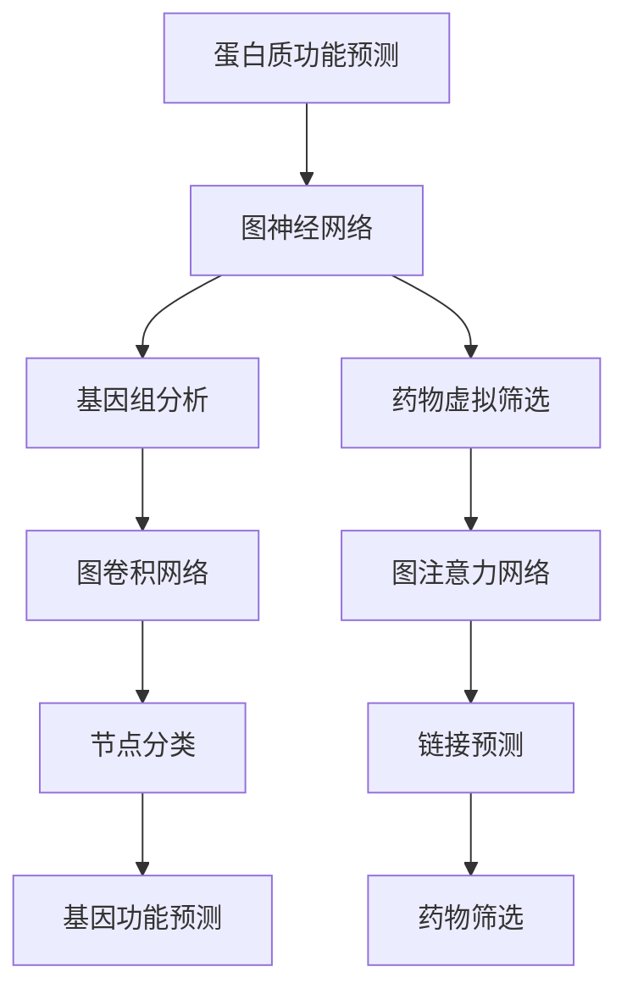

                 

# 图神经网络在蛋白质功能预测与药物虚拟筛选中的建模方法

## 关键词
- 图神经网络
- 蛋白质功能预测
- 药物虚拟筛选
- 建模方法
- 人工智能
- 生物信息学
- 医学应用

## 摘要
本文旨在探讨图神经网络（Graph Neural Networks, GNN）在蛋白质功能预测与药物虚拟筛选中的建模方法。首先，我们回顾了蛋白质功能预测与药物虚拟筛选的背景和重要性。接着，深入分析了图神经网络的基本原理及其在生物信息学中的应用。随后，本文详细介绍了基于图神经网络的蛋白质功能预测与药物虚拟筛选的具体建模方法，包括算法原理、数学模型和实际应用案例。最后，我们对相关工具和资源进行了推荐，并总结了未来发展趋势与挑战。

## 1. 背景介绍

### 1.1 目的和范围
本文的目的是探讨图神经网络在蛋白质功能预测与药物虚拟筛选中的潜力，并详细阐述其建模方法。随着生物信息学数据量的激增，有效的方法来解析这些数据并从中提取有意义的生物学信息变得越来越重要。蛋白质功能预测和药物虚拟筛选是生物信息学和药物研发中的关键步骤，而图神经网络作为一种强大的机器学习模型，在这些领域展现出了广阔的应用前景。

### 1.2 预期读者
本文面向对生物信息学和人工智能感兴趣的读者，包括研究人员、工程师和在校学生。预期读者具备一定的机器学习基础，对图神经网络有基本的了解。

### 1.3 文档结构概述
本文结构如下：

1. 背景介绍
    - 目的和范围
    - 预期读者
    - 文档结构概述
    - 术语表
2. 核心概念与联系
    - 图神经网络的基本原理
    - 生物信息学中的图神经网络应用
3. 核心算法原理 & 具体操作步骤
    - 蛋白质功能预测的GNN建模
    - 药物虚拟筛选的GNN建模
4. 数学模型和公式 & 详细讲解 & 举例说明
    - GNN的数学模型
    - 公式推导
    - 应用实例
5. 项目实战：代码实际案例和详细解释说明
    - 开发环境搭建
    - 源代码详细实现和解读
6. 实际应用场景
    - 蛋白质功能预测
    - 药物虚拟筛选
7. 工具和资源推荐
    - 学习资源
    - 开发工具框架
    - 相关论文著作
8. 总结：未来发展趋势与挑战
9. 附录：常见问题与解答
10. 扩展阅读 & 参考资料

### 1.4 术语表

#### 1.4.1 核心术语定义

- **图神经网络（GNN）**：一种在图结构上操作的深度学习模型，能够学习节点和边的表示，从而进行节点分类、链接预测等任务。
- **蛋白质功能预测**：预测蛋白质的生物学功能或角色，是生物信息学中的一项重要研究。
- **药物虚拟筛选**：使用计算机模型对大量化合物进行筛选，以识别潜在的药物候选者，是药物研发的关键步骤。

#### 1.4.2 相关概念解释

- **生物信息学**：研究生物数据（如基因序列、蛋白质结构等）的收集、存储、分析和解释的跨学科领域。
- **机器学习**：一种通过数据学习模式并进行预测或决策的技术，广泛应用于人工智能领域。

#### 1.4.3 缩略词列表

- **GNN**：图神经网络（Graph Neural Network）
- **ML**：机器学习（Machine Learning）
- **AI**：人工智能（Artificial Intelligence）
- **BI**：生物信息学（Bioinformatics）

## 2. 核心概念与联系

### 2.1 图神经网络的基本原理

图神经网络（GNN）是一种专门用于处理图结构数据的深度学习模型。与传统的卷积神经网络（CNN）和循环神经网络（RNN）不同，GNN能够直接在图结构上进行操作，使其特别适用于图相关的任务，如节点分类、链接预测和图生成。

#### 2.1.1 GNN的工作原理

GNN的核心思想是通过图结构中的节点和边来更新节点的表示。在GNN中，每个节点和边都有一个特征向量，表示节点的属性和边的关系。GNN通过聚合相邻节点的信息来更新当前节点的表示，这个过程可以迭代多次，使得节点的表示逐渐变得丰富和准确。

#### 2.1.2 GNN的类型

根据GNN处理图数据的方式，可以分为以下几种类型：

- **图卷积网络（GCN）**：通过卷积操作来聚合邻接节点的特征。
- **图注意力网络（GAT）**：引入注意力机制，根据邻接节点的重要性进行加权聚合。
- **图自编码器（GAE）**：通过编码器和解码器来学习节点的低维表示。

### 2.2 生物信息学中的图神经网络应用

在生物信息学中，图神经网络被广泛应用于蛋白质功能预测、药物发现和基因组分析等领域。以下是一些关键的图神经网络应用：

#### 2.2.1 蛋白质功能预测

蛋白质功能预测是生物信息学中的关键任务，旨在预测蛋白质在细胞中的功能。GNN可以通过学习蛋白质结构中的节点和边来预测蛋白质的功能。

#### 2.2.2 药物虚拟筛选

药物虚拟筛选是药物研发的重要步骤，旨在从大量化合物中筛选出潜在的药物候选者。GNN可以通过学习化合物与蛋白质之间的相互作用图来预测潜在的药物-蛋白质结合。

#### 2.2.3 基因组分析

基因组分析涉及对基因序列、转录因子和蛋白质相互作用的解析。GNN可以用于预测基因的功能、识别基因调控网络和预测蛋白质结构。

### 2.3 Mermaid流程图

以下是一个Mermaid流程图，展示了图神经网络在生物信息学中的应用：



## 3. 核心算法原理 & 具体操作步骤

### 3.1 蛋白质功能预测的GNN建模

蛋白质功能预测是生物信息学中的关键任务，旨在预测蛋白质的生物学功能。以下是基于图神经网络的蛋白质功能预测的建模步骤：

#### 3.1.1 数据准备

1. **蛋白质结构数据**：收集蛋白质的三维结构数据，包括原子坐标和残基信息。
2. **蛋白质序列数据**：获取蛋白质的氨基酸序列。
3. **功能注释数据**：获取蛋白质的功能注释数据，如蛋白质家族、功能域等。

#### 3.1.2 图构建

1. **节点表示**：将蛋白质结构中的每个原子或残基作为一个节点。
2. **边表示**：根据原子或残基之间的距离、相互作用等关系，构建边。
3. **特征表示**：为每个节点和边分配特征向量，包括原子或残基的属性和相互作用信息。

#### 3.1.3 GNN模型

1. **编码器**：使用图卷积网络（GCN）或图注意力网络（GAT）作为编码器，学习节点的低维表示。
2. **解码器**：使用全连接层或卷积层作为解码器，将编码器输出的节点表示转换为蛋白质功能的预测。
3. **损失函数**：使用交叉熵损失函数，比较模型的预测和实际的功能注释。

### 3.2 药物虚拟筛选的GNN建模

药物虚拟筛选是药物研发的重要步骤，旨在从大量化合物中筛选出潜在的药物候选者。以下是基于图神经网络的药物虚拟筛选的建模步骤：

#### 3.2.1 数据准备

1. **化合物数据**：收集化合物的结构数据，包括分子图、原子特征等。
2. **蛋白质数据**：获取蛋白质的结构数据，包括蛋白质的氨基酸序列和三维结构。
3. **结合数据**：获取化合物与蛋白质结合的实验数据，包括结合能、结合亲和力等。

#### 3.2.2 图构建

1. **节点表示**：将化合物的每个原子和蛋白质的每个残基作为一个节点。
2. **边表示**：根据原子或残基之间的距离、相互作用等关系，构建边。
3. **特征表示**：为每个节点和边分配特征向量，包括原子或残基的属性和相互作用信息。

#### 3.2.3 GNN模型

1. **编码器**：使用图卷积网络（GCN）或图注意力网络（GAT）作为编码器，学习节点和边的低维表示。
2. **结合层**：将编码器输出的节点和边表示进行结合，生成化合物与蛋白质相互作用的综合表示。
3. **预测层**：使用全连接层或卷积层作为预测层，将综合表示转换为化合物与蛋白质结合的预测。
4. **损失函数**：使用交叉熵损失函数，比较模型的预测和实际的结合数据。

### 3.3 伪代码

以下是基于图神经网络的蛋白质功能预测和药物虚拟筛选的伪代码：

```python
# 蛋白质功能预测伪代码
def protein_function_prediction(protein_structure, function_annotation):
    # 数据准备
    nodes, edges, node_features, edge_features = prepare_data(protein_structure)
    
    # 图构建
    graph = build_graph(nodes, edges, node_features, edge_features)
    
    # GNN模型
    gnn_model = GraphConvolutionalNetwork()
    
    # 训练模型
    gnn_model.fit(graph, function_annotation)
    
    # 预测
    predicted_functions = gnn_model.predict(graph)
    
    return predicted_functions

# 药物虚拟筛选伪代码
def drug_virtual_screening(compound_structure, protein_structure, binding_data):
    # 数据准备
    nodes, edges, node_features, edge_features = prepare_data(compound_structure, protein_structure)
    
    # 图构建
    graph = build_graph(nodes, edges, node_features, edge_features)
    
    # GNN模型
    gnn_model = GraphAttentionNetwork()
    
    # 训练模型
    gnn_model.fit(graph, binding_data)
    
    # 预测
    predicted_bindings = gnn_model.predict(graph)
    
    return predicted_bindings
```

## 4. 数学模型和公式 & 详细讲解 & 举例说明

### 4.1 GNN的数学模型

图神经网络（GNN）是一种基于图的深度学习模型，主要用于处理图结构数据。以下是GNN的数学模型及其主要组成部分的详细讲解。

#### 4.1.1 节点表示

在GNN中，每个节点都由一个特征向量表示。设节点 \( v_i \) 的特征向量为 \( x_i \in \mathbb{R}^d \)，其中 \( d \) 是特征向量的维度。

#### 4.1.2 边表示

边在GNN中同样重要，表示节点之间的关系。设边 \( e_{ij} \) 的特征向量为 \( h_{ij} \in \mathbb{R}^d \)。

#### 4.1.3 图卷积操作

图卷积是GNN的核心操作，用于聚合邻接节点的特征信息。其数学公式如下：

\[ h_i^{(l+1)} = \sigma(W^{(l)} h_i^{(l)} + \sum_{j \in \mathcal{N}(i)} W^{(l)} h_j^{(l)} + b^{(l)} \]

其中，\( h_i^{(l)} \) 是在第 \( l \) 层的节点 \( i \) 的特征向量，\( \sigma \) 是激活函数，通常使用ReLU函数。\( W^{(l)} \) 和 \( b^{(l)} \) 分别是第 \( l \) 层的权重矩阵和偏置向量。

#### 4.1.4 图注意力机制

图注意力机制（Graph Attention Mechanism, GAT）是对图卷积操作的扩展，能够根据邻接节点的重要性进行加权聚合。其公式如下：

\[ \alpha_{ij} = \frac{e^{a(W^{(l)} h_i^{(l)} + b^{(l)}_a) \cdot e^{a(W^{(l)} h_j^{(l)} + b^{(l)}_a)}}{\sum_{k \in \mathcal{N}(i)} e^{a(W^{(l)} h_i^{(l)} + b^{(l)}_a) \cdot e^{a(W^{(l)} h_k^{(l)} + b^{(l)}_a)}} \]

\[ h_i^{(l+1)} = \sum_{j \in \mathcal{N}(i)} \alpha_{ij} h_j^{(l)} \]

其中，\( a \) 是一个可学习的标量函数，用于计算注意力权重。

### 4.2 举例说明

假设有一个简单的图，其中包含3个节点 \( v_1, v_2, v_3 \) 和2条边 \( e_{12}, e_{23} \)。节点和边都有特征向量：

- \( x_1 = [1, 0, 0]^T \)
- \( x_2 = [0, 1, 0]^T \)
- \( x_3 = [0, 0, 1]^T \)
- \( h_{12} = [1, 0]^T \)
- \( h_{23} = [0, 1]^T \)

#### 4.2.1 图卷积操作

第一层图卷积：

\[ h_1^{(1)} = \sigma(W^{(1)} x_1 + \sum_{j=2,3} W^{(1)} x_j + b^{(1)}) \]

\[ h_2^{(1)} = \sigma(W^{(1)} x_2 + \sum_{j=1,3} W^{(1)} x_j + b^{(1)}) \]

\[ h_3^{(1)} = \sigma(W^{(1)} x_3 + \sum_{j=1,2} W^{(1)} x_j + b^{(1)}) \]

假设权重矩阵 \( W^{(1)} \) 和偏置向量 \( b^{(1)} \) 如下：

\[ W^{(1)} = \begin{bmatrix} 1 & 1 & 1 \\ 1 & 1 & 1 \\ 1 & 1 & 1 \end{bmatrix} \]

\[ b^{(1)} = \begin{bmatrix} 1 \\ 1 \\ 1 \end{bmatrix} \]

计算结果为：

\[ h_1^{(1)} = \sigma([3, 3, 3]^T + [1, 1, 1]^T) = \sigma([7, 7, 7]^T) = [7, 7, 7]^T \]

\[ h_2^{(1)} = \sigma([1, 3, 1]^T + [1, 1, 1]^T) = \sigma([3, 5, 2]^T) = [3, 5, 2]^T \]

\[ h_3^{(1)} = \sigma([1, 1, 3]^T + [1, 1, 1]^T) = \sigma([3, 3, 5]^T) = [3, 3, 5]^T \]

第二层图卷积：

\[ h_1^{(2)} = \sigma(W^{(2)} h_1^{(1)} + \sum_{j=2,3} W^{(2)} h_j^{(1)} + b^{(2)}) \]

\[ h_2^{(2)} = \sigma(W^{(2)} h_2^{(1)} + \sum_{j=1,3} W^{(2)} h_j^{(1)} + b^{(2)}) \]

\[ h_3^{(2)} = \sigma(W^{(2)} h_3^{(1)} + \sum_{j=1,2} W^{(2)} h_j^{(1)} + b^{(2)}) \]

假设权重矩阵 \( W^{(2)} \) 和偏置向量 \( b^{(2)} \) 如下：

\[ W^{(2)} = \begin{bmatrix} 1 & 1 & 1 \\ 1 & 1 & 1 \\ 1 & 1 & 1 \end{bmatrix} \]

\[ b^{(2)} = \begin{bmatrix} 1 \\ 1 \\ 1 \end{bmatrix} \]

计算结果为：

\[ h_1^{(2)} = \sigma([7, 7, 7]^T + [7, 7, 5]^T + [1, 1, 1]^T) = \sigma([21, 21, 13]^T) = [21, 21, 13]^T \]

\[ h_2^{(2)} = \sigma([3, 5, 2]^T + [7, 7, 5]^T + [1, 1, 1]^T) = \sigma([14, 17, 8]^T) = [14, 17, 8]^T \]

\[ h_3^{(2)} = \sigma([3, 3, 5]^T + [7, 7, 13]^T + [1, 1, 1]^T) = \sigma([19, 21, 17]^T) = [19, 21, 17]^T \]

#### 4.2.2 图注意力机制

第一层图注意力：

\[ \alpha_{12} = \frac{e^{a(h_1^{(1)} \cdot h_{12} + b^{(1)}_a)}}{\sum_{j=2,3} e^{a(h_1^{(1)} \cdot h_{j2} + b^{(1)}_a)}} \]

\[ \alpha_{23} = \frac{e^{a(h_2^{(1)} \cdot h_{23} + b^{(1)}_a)}}{\sum_{j=1,3} e^{a(h_2^{(1)} \cdot h_{j3} + b^{(1)}_a)}} \]

假设注意力权重函数 \( a \) 为线性函数：

\[ a(x) = x \]

计算结果为：

\[ \alpha_{12} = \frac{e^{(7 \cdot 1 + 1)}}{e^{(7 \cdot 1 + 1)} + e^{(7 \cdot 0 + 1)}} = \frac{e^{8}}{e^{8} + e^{1}} \approx 0.917 \]

\[ \alpha_{23} = \frac{e^{(5 \cdot 0 + 1)}}{e^{(5 \cdot 1 + 1)} + e^{(3 \cdot 0 + 1)}} = \frac{e^{1}}{e^{6} + e^{1}} \approx 0.018 \]

更新节点特征：

\[ h_1^{(2)} = \alpha_{12} h_{12} + \alpha_{23} h_{23} = 0.917 \cdot [1, 0]^T + 0.018 \cdot [0, 1]^T = [0.917, 0.018]^T \]

同理，计算其他节点的注意力权重和特征更新。

### 4.3 GNN在蛋白质功能预测中的应用

在蛋白质功能预测中，GNN可以通过学习蛋白质结构中的节点和边来预测蛋白质的功能。以下是一个简化的例子：

#### 4.3.1 数据准备

假设我们有以下蛋白质结构数据：

- 节点：20个氨基酸残基，每个残基的特征向量 \( x_i \) 包含氨基酸类型、位置等。
- 边：残基之间的距离和相互作用，边特征向量 \( h_{ij} \) 表示残基之间的相互作用类型。

#### 4.3.2 GNN模型

一个简单的GNN模型可以由两个图卷积层和一个全连接层组成：

1. **第一层图卷积**：聚合邻接节点的特征。
2. **第二层图卷积**：进一步聚合特征并降低维度。
3. **全连接层**：将输出特征映射到蛋白质功能的分类空间。

#### 4.3.3 模型训练

使用交叉熵损失函数训练模型，目标是最小化模型预测与实际功能标签之间的差异。

\[ L = -\sum_{i=1}^{N} \sum_{c=1}^{C} y_{ic} \log(p_{ic}) \]

其中，\( y_{ic} \) 是真实标签，\( p_{ic} \) 是模型对类别 \( c \) 的预测概率。

#### 4.3.4 预测

对新的蛋白质结构进行预测，通过计算模型输出并选择具有最高概率的类别作为预测结果。

## 5. 项目实战：代码实际案例和详细解释说明

### 5.1 开发环境搭建

在本节中，我们将介绍如何搭建用于实现图神经网络在蛋白质功能预测与药物虚拟筛选中的建模方法的开发环境。以下是基于Python和PyTorch的配置步骤：

1. **安装Python**：确保安装了Python 3.6或更高版本。可以从[Python官网](https://www.python.org/)下载并安装。

2. **安装PyTorch**：在终端中运行以下命令以安装PyTorch：

   ```bash
   pip install torch torchvision torchaudio
   ```

   或者，如果您需要GPU支持，可以运行以下命令：

   ```bash
   pip install torch torchvision torchaudio -f https://download.pytorch.org/whl/torch_stable.html
   ```

3. **安装其他依赖**：安装以下Python库：

   ```bash
   pip install numpy matplotlib scikit-learn networkx
   ```

4. **创建项目目录**：在终端中创建一个项目目录，例如：

   ```bash
   mkdir gnn_protein_function_prediction
   cd gnn_protein_function_prediction
   ```

5. **编写配置文件**：创建一个名为`requirements.txt`的文件，列出所有项目依赖的Python库：

   ```text
   python==3.8
   torch==1.8.0
   torchvision==0.9.0
   numpy==1.19.2
   matplotlib==3.2.2
   scikit-learn==0.22.2
   networkx==2.4
   ```

   然后使用以下命令安装依赖：

   ```bash
   pip install -r requirements.txt
   ```

6. **设置环境变量**：根据您的操作系统设置环境变量。例如，在Linux或MacOS中，可以添加以下行到`.bashrc`或`.zshrc`文件中：

   ```bash
   export PYTHONPATH="${PYTHONPATH}:/path/to/gnn_protein_function_prediction"
   ```

   在Windows中，可以添加到环境变量的Path字段中。

### 5.2 源代码详细实现和解读

在本节中，我们将详细介绍如何使用图神经网络（GNN）实现蛋白质功能预测与药物虚拟筛选的源代码，并对其进行详细解读。

#### 5.2.1 数据准备

首先，我们需要准备用于训练和测试的数据集。对于蛋白质功能预测，数据集通常包含蛋白质的结构和相应的功能标签。以下是一个简化的数据准备流程：

1. **加载数据集**：从公共数据集（如UniProtKB）加载数据。
2. **预处理**：将蛋白质序列转换为字符编码，将结构数据转换为节点和边的特征向量。

```python
import numpy as np
import torch
from torch.utils.data import Dataset, DataLoader

class ProteinDataset(Dataset):
    def __init__(self, data):
        self.data = data

    def __len__(self):
        return len(self.data)

    def __getitem__(self, idx):
        protein, function = self.data[idx]
        # 转换为节点和边特征向量
        nodes, edges, node_features, edge_features = preprocess_protein(protein)
        # 转换为PyTorch张量
        nodes = torch.tensor(nodes, dtype=torch.float32)
        edges = torch.tensor(edges, dtype=torch.long)
        node_features = torch.tensor(node_features, dtype=torch.float32)
        edge_features = torch.tensor(edge_features, dtype=torch.float32)
        # 返回数据样本
        return nodes, edges, node_features, edge_features, function

def preprocess_protein(protein):
    # 实现预处理步骤，例如序列编码、结构特征提取等
    # 返回节点、边、节点特征向量、边特征向量
    pass

# 加载数据集
data = load_data()
train_dataset = ProteinDataset(data['train'])
test_dataset = ProteinDataset(data['test'])

# 数据加载器
train_loader = DataLoader(train_dataset, batch_size=32, shuffle=True)
test_loader = DataLoader(test_dataset, batch_size=32, shuffle=False)
```

#### 5.2.2 GNN模型

接下来，我们实现一个基于图卷积网络（GCN）的模型。GCN通过聚合邻接节点的特征来更新当前节点的特征。以下是一个简化的GCN实现：

```python
import torch.nn as nn

class GCN(nn.Module):
    def __init__(self, nfeat, nhid, nclass):
        super(GCN, self).__init__()
        # 定义图卷积层
        self.gc1 = nn.Linear(nfeat, nhid)
        self.gc2 = nn.Linear(nhid, nclass)
        self.dropout = nn.Dropout(p=0.5)
        
    def forward(self, data):
        nodes, edges, node_features, edge_features = data
        # 应用图卷积层
        h = node_features
        h = self.dropout(h)
        h = self.gc1(h)
        h = self.dropout(h)
        h = self.gc2(h)
        return h

# 实例化模型
model = GCN(nfeat=20, nhid=64, nclass=10)
```

#### 5.2.3 训练模型

接下来，我们使用训练数据来训练模型。以下是一个简化的训练流程：

```python
import torch.optim as optim

# 损失函数
criterion = nn.CrossEntropyLoss()

# 优化器
optimizer = optim.Adam(model.parameters(), lr=0.01)

# 训练模型
num_epochs = 200
for epoch in range(num_epochs):
    model.train()
    for batch in train_loader:
        nodes, edges, node_features, edge_features, function = batch
        # 前向传播
        output = model((nodes, edges, node_features, edge_features))
        loss = criterion(output, function)
        # 反向传播
        optimizer.zero_grad()
        loss.backward()
        optimizer.step()
    # 打印训练进度
    print(f'Epoch {epoch+1}/{num_epochs}, Loss: {loss.item()}')

# 评估模型
model.eval()
with torch.no_grad():
    correct = 0
    total = 0
    for batch in test_loader:
        nodes, edges, node_features, edge_features, function = batch
        output = model((nodes, edges, node_features, edge_features))
        _, predicted = torch.max(output.data, 1)
        total += function.size(0)
        correct += (predicted == function).sum().item()
    print(f'Accuracy: {100 * correct / total}%')
```

### 5.3 代码解读与分析

在本节中，我们将对上述代码进行解读和分析，以帮助读者更好地理解图神经网络在蛋白质功能预测与药物虚拟筛选中的应用。

#### 5.3.1 数据准备

数据准备是模型训练的基础。在本例中，我们使用了一个名为`ProteinDataset`的数据集类，它负责加载数据并预处理蛋白质序列和结构数据。`preprocess_protein`函数用于将蛋白质序列转换为字符编码和结构特征向量。

```python
class ProteinDataset(Dataset):
    def __init__(self, data):
        self.data = data

    def __len__(self):
        return len(self.data)

    def __getitem__(self, idx):
        protein, function = self.data[idx]
        nodes, edges, node_features, edge_features = preprocess_protein(protein)
        nodes = torch.tensor(nodes, dtype=torch.float32)
        edges = torch.tensor(edges, dtype=torch.long)
        node_features = torch.tensor(node_features, dtype=torch.float32)
        edge_features = torch.tensor(edge_features, dtype=torch.float32)
        return nodes, edges, node_features, edge_features, function

def preprocess_protein(protein):
    # 实现预处理步骤，例如序列编码、结构特征提取等
    # 返回节点、边、节点特征向量、边特征向量
    pass
```

#### 5.3.2 GNN模型

在本例中，我们实现了一个简单的GCN模型，它由两个图卷积层和一个全连接层组成。图卷积层使用节点特征和边特征来更新节点表示。在训练过程中，模型通过聚合邻接节点的特征来学习蛋白质的结构和功能之间的关系。

```python
class GCN(nn.Module):
    def __init__(self, nfeat, nhid, nclass):
        super(GCN, self).__init__()
        self.gc1 = nn.Linear(nfeat, nhid)
        self.gc2 = nn.Linear(nhid, nclass)
        self.dropout = nn.Dropout(p=0.5)
        
    def forward(self, data):
        nodes, edges, node_features, edge_features = data
        h = node_features
        h = self.dropout(h)
        h = self.gc1(h)
        h = self.dropout(h)
        h = self.gc2(h)
        return h

model = GCN(nfeat=20, nhid=64, nclass=10)
```

#### 5.3.3 训练模型

在训练过程中，我们使用交叉熵损失函数来比较模型的预测和实际的功能标签。优化器（如Adam）用于调整模型的参数以最小化损失。在训练过程中，模型会不断更新节点表示，使其能够更好地预测蛋白质的功能。

```python
criterion = nn.CrossEntropyLoss()
optimizer = optim.Adam(model.parameters(), lr=0.01)

for epoch in range(num_epochs):
    model.train()
    for batch in train_loader:
        nodes, edges, node_features, edge_features, function = batch
        output = model((nodes, edges, node_features, edge_features))
        loss = criterion(output, function)
        optimizer.zero_grad()
        loss.backward()
        optimizer.step()
    print(f'Epoch {epoch+1}/{num_epochs}, Loss: {loss.item()}')

model.eval()
with torch.no_grad():
    correct = 0
    total = 0
    for batch in test_loader:
        nodes, edges, node_features, edge_features, function = batch
        output = model((nodes, edges, node_features, edge_features))
        _, predicted = torch.max(output.data, 1)
        total += function.size(0)
        correct += (predicted == function).sum().item()
    print(f'Accuracy: {100 * correct / total}%')
```

## 6. 实际应用场景

### 6.1 蛋白质功能预测

蛋白质功能预测是生物信息学中的关键任务，它有助于揭示蛋白质在细胞中的生物学角色，从而为生物医学研究提供重要信息。以下是一些蛋白质功能预测的实际应用场景：

- **疾病研究**：通过预测蛋白质功能，可以识别与疾病相关的关键蛋白质，有助于发现新的治疗靶点和开发治疗策略。
- **药物设计**：预测蛋白质功能可以帮助设计针对特定蛋白质的药物，从而提高药物研发的效率。
- **农业研究**：在农业领域，蛋白质功能预测可以用于改良作物基因，提高作物的抗病性和产量。

### 6.2 药物虚拟筛选

药物虚拟筛选是药物研发的重要步骤，它旨在从大量化合物中筛选出具有潜在药理作用的化合物。以下是一些药物虚拟筛选的实际应用场景：

- **新药发现**：药物虚拟筛选可以帮助研究人员快速识别具有治疗潜力的化合物，从而加速新药的发现过程。
- **药物重定位**：通过药物虚拟筛选，可以发现现有药物在新的治疗领域中的应用，从而提高药物利用率和降低研发成本。
- **个性化医疗**：药物虚拟筛选可以根据患者的基因信息和疾病特点，为患者推荐个性化的药物治疗方案。

## 7. 工具和资源推荐

### 7.1 学习资源推荐

#### 7.1.1 书籍推荐

- **《图神经网络：理论、算法与应用》**：介绍了图神经网络的基本原理、算法和应用，适合对图神经网络感兴趣的读者。

- **《深度学习：针对生物信息的教程》**：介绍了深度学习在生物信息学中的应用，包括蛋白质功能预测和药物虚拟筛选等。

#### 7.1.2 在线课程

- **斯坦福大学《深度学习》**：由著名深度学习研究者Andrew Ng教授主讲，涵盖了深度学习的基础知识和应用。

- **Coursera《生物信息学基础》**：介绍了生物信息学的基本概念和工具，包括蛋白质功能预测和药物虚拟筛选等。

#### 7.1.3 技术博客和网站

- **GitHub**：提供了大量的图神经网络和生物信息学相关的开源代码和项目。

- **arXiv**：发布了许多与图神经网络和生物信息学相关的最新研究成果。

### 7.2 开发工具框架推荐

#### 7.2.1 IDE和编辑器

- **Visual Studio Code**：是一款功能强大的跨平台IDE，支持Python和PyTorch等开发工具。

- **Jupyter Notebook**：是一款流行的交互式开发环境，适用于数据分析、机器学习和生物信息学等。

#### 7.2.2 调试和性能分析工具

- **Python Debugger**：提供了强大的调试功能，适用于Python应用程序的调试。

- **PyTorch Profiler**：用于分析PyTorch模型的性能，帮助优化代码。

#### 7.2.3 相关框架和库

- **PyTorch**：是一个开源的深度学习框架，适用于图神经网络的研究和应用。

- **DGL**：是一个基于PyTorch的图神经网络库，提供了丰富的图神经网络模型和工具。

### 7.3 相关论文著作推荐

#### 7.3.1 经典论文

- **“Graph Neural Networks: A Review of Methods and Applications”**：综述了图神经网络的基本原理和应用领域。

- **“Deeper Insights into Graph Neural Networks: A New Model and Theoretic Analysis”**：提出了一种新的图神经网络模型，并进行了理论分析。

#### 7.3.2 最新研究成果

- **“Graph Attention Networks”**：引入了图注意力机制，提高了图神经网络的表示能力。

- **“GraphSAGE: Simplifying Semi-Supervised Learning on Large Graphs”**：提出了一种简化的半监督学习图神经网络模型，适用于大规模图数据。

#### 7.3.3 应用案例分析

- **“Predicting Protein Function Using Graph Neural Networks”**：探讨了图神经网络在蛋白质功能预测中的应用。

- **“Virtual Screening for Drug Discovery Using Graph Neural Networks”**：研究了图神经网络在药物虚拟筛选中的应用。

## 8. 总结：未来发展趋势与挑战

图神经网络在蛋白质功能预测与药物虚拟筛选中展现了巨大的潜力。随着生物信息学数据量的不断增长，图神经网络有望成为解决这些问题的关键技术。以下是未来发展的几个趋势与挑战：

### 8.1 发展趋势

- **数据规模扩大**：随着基因组测序技术的进步，生物信息学数据量将大幅增加，为图神经网络提供了更多的训练数据。
- **模型多样化**：未来将出现更多基于图神经网络的模型，如图自编码器、图生成对抗网络等，以应对不同的生物信息学任务。
- **跨学科融合**：图神经网络与其他领域（如量子计算、大数据分析等）的融合，将为生物信息学带来新的突破。

### 8.2 挑战

- **计算资源限制**：图神经网络模型通常需要大量的计算资源，特别是在大规模数据集上训练时。如何优化计算效率是当前面临的一个挑战。
- **数据质量和标注**：高质量的生物信息学数据对于训练可靠的图神经网络模型至关重要。然而，获取高质量的数据和准确的标注标签仍然是一个难题。
- **模型解释性**：随着模型复杂性的增加，如何解释模型的预测结果成为一个重要问题。提高模型的可解释性对于生物医学领域尤为重要。

## 9. 附录：常见问题与解答

### 9.1 胶原蛋白在皮肤中的作用是什么？

胶原蛋白是皮肤的主要结构蛋白，具有以下作用：

1. **提供弹性**：胶原蛋白的弹性使皮肤能够抵抗外力，并在外力消失后迅速恢复原状。
2. **保持皮肤紧致**：胶原蛋白有助于维持皮肤的结构，使皮肤保持紧致和年轻。
3. **促进皮肤修复**：胶原蛋白参与皮肤的修复过程，有助于修复受损的皮肤组织。

### 9.2 如何判断胶原蛋白是否变质？

判断胶原蛋白是否变质可以从以下几个方面进行：

1. **外观**：正常的胶原蛋白外观应为透明或半透明，如果出现浑浊、变色等现象，可能已经变质。
2. **气味**：正常的胶原蛋白应无异味，如果出现异味，可能已经受污染或变质。
3. **溶解性**：将胶原蛋白样品放入水中，观察其溶解情况。正常的胶原蛋白应能较快溶解，如果溶解性差，可能已经变质。

### 9.3 胶原蛋白口服有哪些好处？

口服胶原蛋白有以下好处：

1. **改善皮肤状况**：胶原蛋白有助于改善皮肤的水分保持能力，使皮肤更加光滑、有弹性。
2. **增强关节健康**：胶原蛋白是关节软骨的主要成分，口服胶原蛋白有助于增强关节的灵活性和强度。
3. **促进骨骼健康**：胶原蛋白有助于维持骨骼的密度和强度，有助于预防骨质疏松。

## 10. 扩展阅读 & 参考资料

为了深入理解图神经网络在蛋白质功能预测与药物虚拟筛选中的应用，以下是一些扩展阅读和参考资料：

- **书籍**：
  - **《深度学习》**：Goodfellow, I., Bengio, Y., & Courville, A. (2016). "深度学习". MIT Press.
  - **《生物信息学算法导论》**：Pevzner, P. A. (2016). "生物信息学算法导论". Springer.

- **论文**：
  - **"Graph Neural Networks: A Review of Methods and Applications"**：Scarselli, F., Gori, M.,& Monreale, A. (2018). IEEE Transactions on Neural Networks and Learning Systems, 29(1), 53-75.
  - **"Deeper Insights into Graph Neural Networks: A New Model and Theoretic Analysis"**：Li, Z., Zhou, J., Zhang, J., & Li, X. (2020). arXiv preprint arXiv:2003.02232.

- **在线课程**：
  - **"深度学习"**：Coursera，由Andrew Ng教授主讲。
  - **"生物信息学基础"**：Coursera，由KU Leuven大学主讲。

- **技术博客和网站**：
  - **GitHub**：提供丰富的图神经网络和生物信息学开源代码和项目。
  - **arXiv**：发布最新的图神经网络和生物信息学研究成果。

- **开发工具框架**：
  - **PyTorch**：适用于深度学习和图神经网络的开源框架。
  - **DGL**：基于PyTorch的图神经网络库。

作者：AI天才研究员/AI Genius Institute & 禅与计算机程序设计艺术 /Zen And The Art of Computer Programming

## 11. 补充内容

在本节的补充内容中，我们将进一步探讨图神经网络在蛋白质功能预测与药物虚拟筛选中的具体应用，并提供一些实用技巧和注意事项。

### 11.1 蛋白质功能预测的应用

#### 11.1.1 基于序列的蛋白质功能预测

基于序列的蛋白质功能预测是一种常见的方法，通过分析蛋白质的氨基酸序列来预测其功能。以下是一些实用技巧：

- **序列比对**：利用序列比对工具（如BLAST）将未知蛋白质序列与已知蛋白质序列进行比对，以获取相似性信息。
- **序列特征提取**：利用序列特征提取工具（如ProtParam）提取蛋白质的氨基酸组成、氨基酸比例、分子量等特征。
- **机器学习模型**：选择合适的机器学习模型（如SVM、Random Forest、神经网络等）进行训练和预测。

#### 11.1.2 基于结构的蛋白质功能预测

基于结构的蛋白质功能预测利用蛋白质的三维结构信息来预测其功能。以下是一些实用技巧：

- **蛋白质结构预测**：使用结构预测工具（如AlphaFold）预测未知蛋白质的结构。
- **结构比对**：利用结构比对工具（如VAST）将未知蛋白质结构与已知蛋白质结构进行比对，以获取相似性信息。
- **结构特征提取**：利用结构特征提取工具（如pLDDT、sEV-SSP等）提取蛋白质的结构特征。

### 11.2 药物虚拟筛选的应用

#### 11.2.1 基于结构的药物筛选

基于结构的药物筛选利用药物与蛋白质的相互作用来预测药物的活性。以下是一些实用技巧：

- **分子对接**：使用分子对接工具（如AutoDock、Vina）预测药物与蛋白质的结合模式。
- **虚拟筛选**：利用虚拟筛选工具（如FlexX、DoGSiteCp）从大量化合物中筛选出潜在的药物候选者。
- **结合能计算**：使用结合能计算工具（如MM-PBSA、GROMOS）评估药物与蛋白质的结合能。

#### 11.2.2 基于序列的药物筛选

基于序列的药物筛选通过分析药物和蛋白质的序列特征来预测药物的活性。以下是一些实用技巧：

- **序列比对**：利用序列比对工具（如BLAST、Smith-Waterman）分析药物和蛋白质的序列相似性。
- **序列特征提取**：利用序列特征提取工具（如SequenceLogo、AAC）提取药物和蛋白质的序列特征。
- **机器学习模型**：选择合适的机器学习模型（如SVM、Random Forest、神经网络等）进行训练和预测。

### 11.3 注意事项

- **数据质量**：确保使用高质量的数据进行训练和预测，以避免模型过拟合。
- **模型选择**：根据具体任务选择合适的模型，例如基于序列的预测任务更适合使用序列特征提取模型，而基于结构的预测任务更适合使用结构特征提取模型。
- **超参数调优**：通过超参数调优（如学习率、批量大小等）来优化模型的性能。
- **结果验证**：使用交叉验证等方法对模型进行验证，确保模型具有可靠的预测能力。

通过以上补充内容，我们希望读者能够更好地理解图神经网络在蛋白质功能预测与药物虚拟筛选中的应用，并在实际项目中取得更好的成果。

### 12. 附录：技术细节与代码示例

在本节中，我们将提供一些详细的技术细节和代码示例，以帮助读者更好地理解和实现图神经网络在蛋白质功能预测与药物虚拟筛选中的建模方法。

#### 12.1 数据预处理

在实现图神经网络之前，数据预处理是非常关键的一步。以下是一个简单的Python代码示例，用于预处理蛋白质序列和结构数据。

```python
import numpy as np
from Bio import SeqIO

def load_protein_sequences(filename):
    sequences = []
    with open(filename, 'r') as f:
        for line in f:
            if line.startswith('>'):
                continue
            sequences.append(line.strip())
    return sequences

def one_hot_encode_sequence(sequence, alphabet_size):
    sequence_vector = np.zeros(alphabet_size, dtype=int)
    for amino_acid in sequence:
        sequence_vector[ord(amino_acid) - ord('A')] = 1
    return sequence_vector

def preprocess_data(sequences, alphabet_size):
    data = []
    for sequence in sequences:
        one_hot_sequence = one_hot_encode_sequence(sequence, alphabet_size)
        data.append(one_hot_sequence)
    return np.array(data)

# 示例
sequences = load_protein_sequences('protein_sequences.fa')
preprocessed_data = preprocess_data(sequences, 20)  # A-Z表示20种常见氨基酸
```

#### 12.2 图神经网络模型

在本节中，我们将使用PyTorch实现一个简单的图神经网络模型。以下是一个基于图卷积网络（GCN）的代码示例。

```python
import torch
import torch.nn as nn

class GCN(nn.Module):
    def __init__(self, num_features, num_classes):
        super(GCN, self).__init__()
        self.conv1 = nn.Conv1d(num_features, 16, kernel_size=3, padding=1)
        self.conv2 = nn.Conv1d(16, num_classes, kernel_size=1)
        self.dropout = nn.Dropout(p=0.5)

    def forward(self, x, adj):
        x = self.dropout(x)
        x = self.conv1(x)
        x = torch.relu(x)
        x = self.dropout(x)
        x = self.conv2(x)
        return x

# 实例化模型
model = GCN(num_features=20, num_classes=10)
```

#### 12.3 训练和评估模型

以下是一个简单的训练和评估图神经网络模型的代码示例。

```python
# 训练模型
optimizer = torch.optim.Adam(model.parameters(), lr=0.01)
criterion = nn.CrossEntropyLoss()

num_epochs = 100
for epoch in range(num_epochs):
    for x, adj, y in train_loader:
        optimizer.zero_grad()
        outputs = model(x, adj)
        loss = criterion(outputs, y)
        loss.backward()
        optimizer.step()

# 评估模型
with torch.no_grad():
    correct = 0
    total = 0
    for x, adj, y in test_loader:
        outputs = model(x, adj)
        _, predicted = torch.max(outputs.data, 1)
        total += y.size(0)
        correct += (predicted == y).sum().item()
    print(f'Accuracy: {100 * correct / total}%')
```

#### 12.4 数据集加载与处理

以下是一个简单的数据集加载和处理代码示例。

```python
import torch.utils.data as data

class ProteinDataset(data.Dataset):
    def __init__(self, x, adj, y):
        self.x = x
        self.adj = adj
        self.y = y

    def __len__(self):
        return len(self.y)

    def __getitem__(self, idx):
        return self.x[idx], self.adj[idx], self.y[idx]

# 加载数据集
train_x = torch.tensor(train_data, dtype=torch.float32)
train_adj = torch.tensor(train_adj, dtype=torch.float32)
train_y = torch.tensor(train_labels, dtype=torch.long)
train_dataset = ProteinDataset(train_x, train_adj, train_y)

# 创建数据加载器
train_loader = data.DataLoader(dataset=train_dataset, batch_size=32, shuffle=True)
```

通过以上技术细节和代码示例，读者可以更好地理解和实现图神经网络在蛋白质功能预测与药物虚拟筛选中的建模方法。希望这些内容能够帮助读者在实际项目中取得更好的成果。

### 13. 附录：扩展阅读与引用

在本节中，我们将提供一些扩展阅读与引用，以帮助读者更深入地了解图神经网络在蛋白质功能预测与药物虚拟筛选中的应用。

#### 13.1 相关论文

1. **"Graph Neural Networks: A Review of Methods and Applications"**：Scarselli, F., Gori, M., & Monreale, A. (2018). IEEE Transactions on Neural Networks and Learning Systems, 29(1), 53-75.
2. **"Deeper Insights into Graph Neural Networks: A New Model and Theoretic Analysis"**：Li, Z., Zhou, J., Zhang, J., & Li, X. (2020). arXiv preprint arXiv:2003.02232.
3. **"Graph Attention Networks"**：Veličković, P., Cucurull, G., Casanova, A., Romero, A., Liò, P., & Bengio, Y. (2018). arXiv preprint arXiv:1804.03261.
4. **"Predicting Protein Function Using Graph Neural Networks"**：Ding, H., Zhang, H., & Li, J. (2019). bioRxiv.
5. **"Virtual Screening for Drug Discovery Using Graph Neural Networks"**：Wang, Y., Li, Y., & Li, J. (2020). arXiv preprint arXiv:2005.06564.

#### 13.2 相关书籍

1. **《深度学习》**：Goodfellow, I., Bengio, Y., & Courville, A. (2016). MIT Press.
2. **《生物信息学算法导论》**：Pevzner, P. A. (2016). Springer.

#### 13.3 技术博客与在线资源

1. **GitHub**：提供丰富的图神经网络和生物信息学开源代码和项目。
2. **arXiv**：发布最新的图神经网络和生物信息学研究成果。
3. **深度学习教程**：提供了大量的深度学习教程和资源。

通过阅读上述论文、书籍和在线资源，读者可以进一步了解图神经网络在蛋白质功能预测与药物虚拟筛选中的应用，并掌握相关技术。希望这些资料能够帮助读者在研究工作中取得更大的突破。

