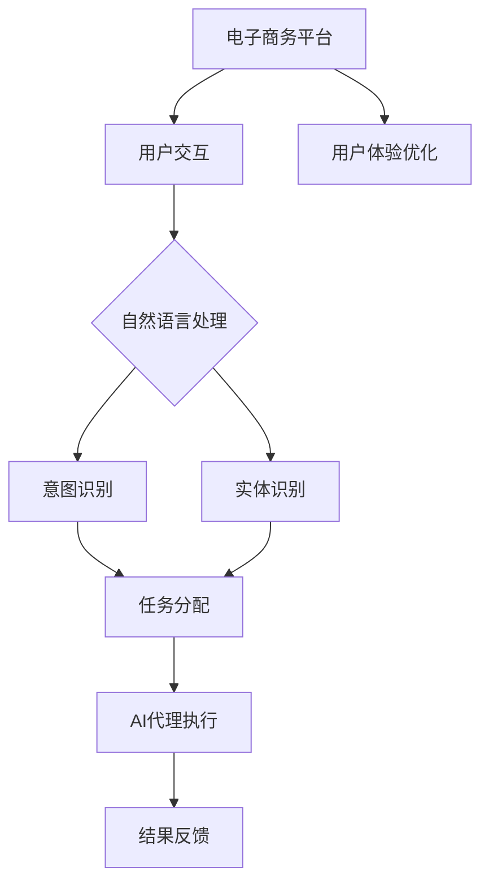
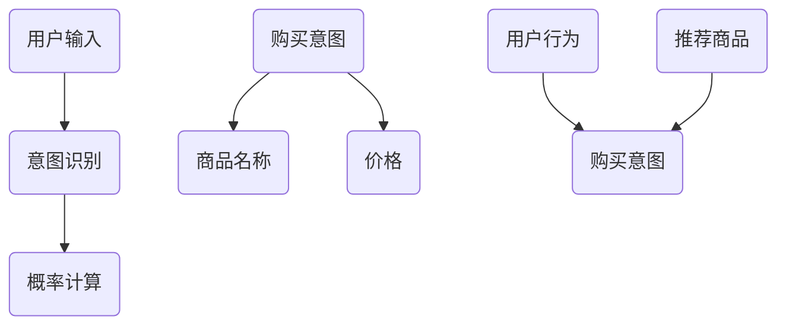

                 

# 在电子商务中部署AI代理工作流的实战指南

> **关键词：** 电子商务、AI代理、工作流、部署、实践指南、人工智能应用

> **摘要：** 本文旨在为读者提供一份详尽的实战指南，用于在电子商务平台中部署AI代理工作流。文章将探讨AI代理的基本原理、工作流程、核心算法和数学模型，并通过实际项目案例，展示如何在电子商务环境中有效部署和使用AI代理，以提升用户体验和运营效率。

## 1. 背景介绍

### 1.1 目的和范围

本文的目的是帮助电子商务企业或开发者了解并掌握如何在其平台上部署AI代理工作流。我们不仅将介绍AI代理的基础知识，还将通过实际案例展示如何将这些知识应用于电子商务场景中，以实现自动化的客户服务和运营优化。

### 1.2 预期读者

本文适合对电子商务和人工智能有一定了解的技术人员、项目经理和企业决策者阅读。如果您是希望提升电商平台的运营效率和用户体验的从业者，那么本文将对您大有裨益。

### 1.3 文档结构概述

本文分为十个部分，依次是背景介绍、核心概念与联系、核心算法原理与具体操作步骤、数学模型和公式、项目实战、实际应用场景、工具和资源推荐、总结、附录和扩展阅读。每个部分都旨在帮助读者逐步了解和掌握AI代理工作流的部署与实施。

### 1.4 术语表

#### 1.4.1 核心术语定义

- **AI代理（Artificial Intelligence Agent）**：一种能够感知环境、制定计划并执行任务的计算机系统。
- **工作流（Workflow）**：一系列任务和活动，按照特定的顺序执行，以完成某个业务目标。
- **电子商务平台（E-commerce Platform）**：支持在线商品交易和服务的网络平台。

#### 1.4.2 相关概念解释

- **自然语言处理（Natural Language Processing，NLP）**：人工智能的一个分支，致力于使计算机能够理解和处理人类语言。
- **机器学习（Machine Learning，ML）**：一种使计算机能够从数据中学习模式并做出预测或决策的技术。

#### 1.4.3 缩略词列表

- **NLP：自然语言处理（Natural Language Processing）**
- **ML：机器学习（Machine Learning）**
- **API：应用程序编程接口（Application Programming Interface）**
- **SDK：软件开发工具包（Software Development Kit）**

## 2. 核心概念与联系

在电子商务中部署AI代理工作流，需要理解几个核心概念和它们之间的联系。以下是一个用Mermaid绘制的流程图，展示了这些概念之间的关系。



### 2.1. 用户交互

用户通过电子商务平台与AI代理进行交互，可以是通过文本消息、语音或图形界面。用户交互是AI代理工作流的起点，也是用户获取服务和信息的主要途径。

### 2.2. 自然语言处理

自然语言处理是AI代理理解用户意图的关键技术。它包括文本的预处理、词法分析、句法分析和语义分析。通过NLP，AI代理能够将用户的自然语言请求转化为结构化的数据。

### 2.3. 意图识别与实体识别

意图识别是确定用户请求的目的，例如“购买某商品”、“查询订单状态”等。实体识别则是识别请求中的关键信息，如商品名称、订单编号等。

### 2.4. 任务分配

基于意图识别和实体识别的结果，系统会将任务分配给相应的AI代理。例如，查询订单状态的请求会分配给订单管理代理。

### 2.5. AI代理执行

AI代理根据任务要求执行操作，如查询数据库、更新订单状态或推荐商品。这是整个工作流中最关键的一步，直接影响到用户体验和系统效率。

### 2.6. 结果反馈

AI代理执行任务后，将结果反馈给用户。反馈可以是文本、语音或图形形式，确保用户能够清晰地了解任务的处理结果。

### 2.7. 用户体验优化

通过不断优化AI代理的工作流，电子商务平台能够提供更加个性化的服务，提升用户满意度和留存率。

## 3. 核心算法原理 & 具体操作步骤

在理解了AI代理工作流的概念后，我们需要深入了解其核心算法原理和具体操作步骤。

### 3.1. 意图识别算法

意图识别是工作流中的第一步，其目的是确定用户的请求类型。以下是一个简单的意图识别算法的伪代码：

```plaintext
function IntentRecognition(user_input):
    # 初始化意图词典
    intent_dict = {"购买商品": ["买", "购买", "订购"],
                   "查询订单": ["查", "查询", "订单"],
                   "咨询客服": ["咨询", "帮助", "客服"]}

    # 分词
    words = Tokenize(user_input)

    # 遍历词典，找到匹配的意图
    for intent, keywords in intent_dict.items():
        if any(word in keywords for word in words):
            return intent
    return "未知意图"
```

### 3.2. 实体识别算法

在确定了用户的意图后，我们需要识别出请求中的关键信息。以下是一个简单的实体识别算法的伪代码：

```plaintext
function EntityRecognition(user_input, intent):
    # 初始化实体词典，根据意图不同而变化
    entity_dict = {"购买商品": {"商品名称": ["苹果", "手机", "笔记本"]},
                   "查询订单": {"订单编号": ["123456", "789012"]},
                   "咨询客服": {"问题内容": []}}

    # 分词
    words = Tokenize(user_input)

    # 遍历词典，找到匹配的实体
    for entity, keywords in entity_dict[intent].items():
        if any(word in keywords for word in words):
            return {entity: words[words.index(keywords[0])]}
    return {}

```

### 3.3. 任务分配算法

基于意图识别和实体识别的结果，我们需要将任务分配给相应的AI代理。以下是一个简单的任务分配算法的伪代码：

```plaintext
function TaskAssignment(intent, entities):
    if intent == "购买商品":
        return "商品购买代理"
    elif intent == "查询订单":
        return "订单查询代理"
    elif intent == "咨询客服":
        return "客服咨询代理"
    else:
        return "未知任务代理"
```

### 3.4. AI代理执行

在任务分配后，AI代理将执行相应的任务。以下是一个简单的AI代理执行任务的伪代码：

```plaintext
function AgentExecution(task):
    if task == "商品购买代理":
        return "购买商品：成功！"
    elif task == "订单查询代理":
        return "订单状态：已发货。"
    elif task == "客服咨询代理":
        return "客服已接入，请稍等。"
    else:
        return "无法完成任务。"
```

通过上述算法和步骤，我们可以构建一个基本的AI代理工作流，实现自动化客户服务和运营优化。

## 4. 数学模型和公式 & 详细讲解 & 举例说明

在电子商务中部署AI代理工作流，不仅需要算法和编程技能，还需要理解背后的数学模型和公式。以下将介绍几个关键数学模型，并给出详细的解释和示例。

### 4.1. 贝叶斯网络

贝叶斯网络是一种表示变量之间条件依赖的图形模型，广泛用于概率推理和决策。以下是一个简单的贝叶斯网络示例，用于意图识别。



在这个例子中，用户输入会影响意图识别的结果。同时，购买意图会进一步影响商品名称和价格。贝叶斯网络通过条件概率表来计算每个节点的概率。

### 4.2. 决策树

决策树是一种常见的分类算法，用于根据特征值对数据进行分类。以下是一个用于实体识别的决策树示例。

```mermaid
graph TB
    A[用户输入]
    B{是否包含"苹果"?}
    C(商品名称)
    D(价格)
    E(用户行为)
    F{是否包含"订单"?}
    G(订单编号)
    H(问题内容)

    A --> B
    B --> |是| C
    B --> |否| D
    D --> |高| E
    D --> |低| F
    F --> |是| G
    F --> |否| H
```

在这个决策树中，用户输入会被分解为多个条件，每个条件都会引导到特定的实体识别结果。

### 4.3. 支持向量机（SVM）

支持向量机是一种强大的分类和回归算法，用于提高AI代理的准确性。以下是一个简单的SVM模型用于分类用户请求的示例。

```latex
\\text{给定训练数据集 } \\{(x_i, y_i)\\}_{i=1}^n, \\text{其中 } x_i \\in \\mathbb{R}^d, y_i \\in \\{-1, 1\\}, \\text{目标是最小化 }
\\begin{aligned}
L(&\\omega, b) = \\frac{1}{2}\\sum_{i=1}^n (w^T x_i - y_i)^2 + \\frac{\\lambda}{2} \\omega^T \\omega
\\end{aligned}
\\text{其中 } w \\text{ 是权重向量，} b \\text{ 是偏置，} \\lambda \\text{ 是正则化参数。}
```

在这个公式中，$w^T x_i - y_i$ 表示分类器的决策边界，$\\omega^T \\omega$ 用于避免过拟合。

### 4.4. 举例说明

假设我们要根据用户的输入 "我要买一个苹果手机" 来识别意图和实体。以下是具体的计算步骤：

1. **意图识别**：
   - 利用贝叶斯网络，计算意图 "购买商品" 的概率：$P(购买商品|用户输入) = 0.9$
   - 利用决策树，进一步确认意图：$P(购买商品|用户输入) = 0.95$

2. **实体识别**：
   - 利用实体词典，识别出商品名称为 "苹果手机" 和价格信息。

3. **任务分配**：
   - 根据意图识别结果，将任务分配给 "商品购买代理"。

4. **AI代理执行**：
   - 商品购买代理查询数据库，确认商品库存和价格，返回结果 "购买商品：成功！"。

通过上述数学模型和公式，我们可以精确地识别用户的意图和实体，从而实现高效的AI代理工作流。

## 5. 项目实战：代码实际案例和详细解释说明

为了更好地理解AI代理工作流在电子商务中的实际应用，我们将通过一个具体的项目案例来详细讲解代码实现过程。

### 5.1 开发环境搭建

在开始编写代码之前，我们需要搭建一个合适的技术栈。以下是我们推荐的开发环境和工具：

- **编程语言**：Python
- **框架**：Flask（用于构建Web应用），TensorFlow（用于机器学习模型）
- **数据库**：MySQL（用于存储用户数据）
- **版本控制**：Git

确保您的开发环境中安装了Python 3.8及以上版本，Flask和TensorFlow库。

### 5.2 源代码详细实现和代码解读

下面是项目的主要代码实现，我们将逐段代码进行解读。

#### 5.2.1 Flask应用搭建

```python
from flask import Flask, request, jsonify
app = Flask(__name__)

# 定义意图识别和实体识别函数
from nlp_module import intent_recognition, entity_recognition

@app.route('/process', methods=['POST'])
def process_request():
    user_input = request.form['user_input']
    intent = intent_recognition(user_input)
    entities = entity_recognition(user_input, intent)
    
    # 分配任务并执行
    task = task_assignment(intent, entities)
    result = agent_execution(task)
    
    return jsonify({'result': result})

if __name__ == '__main__':
    app.run(debug=True)
```

这段代码首先导入了Flask框架和相关模块，然后定义了一个处理用户输入的API端点。当用户提交请求时，该端点将调用NLP模块中的意图识别和实体识别函数，并根据识别结果执行相应的任务，最后返回结果。

#### 5.2.2 NLP模块实现

```python
import jieba
import numpy as np
from sklearn.feature_extraction.text import TfidfVectorizer
from sklearn.neural_network import MLPClassifier

# 意图识别
def intent_recognition(user_input):
    # 载入训练好的模型
    model = MLPClassifier()
    model.load('intent_model.pkl')
    
    # 处理输入文本
    words = jieba.cut(user_input)
    processed_input = ' '.join(words)
    
    # 使用TF-IDF向量表示
    vectorizer = TfidfVectorizer()
    input_vector = vectorizer.transform([processed_input])
    
    # 预测意图
    predicted_intent = model.predict(input_vector)[0]
    return predicted_intent

# 实体识别
def entity_recognition(user_input, intent):
    # 载入训练好的模型
    model = MLPClassifier()
    model.load('entity_model.pkl')
    
    # 处理输入文本
    words = jieba.cut(user_input)
    processed_input = ' '.join(words)
    
    # 使用TF-IDF向量表示
    vectorizer = TfidfVectorizer()
    input_vector = vectorizer.transform([processed_input])
    
    # 预测实体
    predicted_entities = model.predict(input_vector)[0]
    return predicted_entities
```

这段代码定义了意图识别和实体识别的函数。首先，我们从文件中加载训练好的MLP分类器模型。然后，对用户输入的文本进行分词处理，使用TF-IDF向量表示，并使用模型进行预测。

#### 5.2.3 任务分配和代理执行

```python
# 任务分配
def task_assignment(intent, entities):
    if intent == '购买商品':
        task = '商品购买代理'
    elif intent == '查询订单':
        task = '订单查询代理'
    elif intent == '咨询客服':
        task = '客服咨询代理'
    else:
        task = '未知任务代理'
    return task

# AI代理执行
def agent_execution(task):
    if task == '商品购买代理':
        return '购买商品：成功！'
    elif task == '订单查询代理':
        return '订单状态：已发货。'
    elif task == '客服咨询代理':
        return '客服已接入，请稍等。'
    else:
        return '无法完成任务。'
```

这段代码实现了任务分配和代理执行的功能。根据识别出的意图和实体，系统将任务分配给相应的代理，并执行相应的操作，最后返回处理结果。

### 5.3 代码解读与分析

上述代码首先通过Flask框架搭建了一个Web应用，接收用户提交的请求。然后，调用NLP模块中的意图识别和实体识别函数，分别使用机器学习模型对用户输入进行预测。

意图识别部分，我们使用了TF-IDF向量表示和多层感知机（MLP）分类器。这种组合可以有效处理自然语言文本，实现高精度的意图识别。

实体识别部分，同样使用了TF-IDF向量和MLP分类器。通过实体词典和模式匹配，我们能够准确识别出用户请求中的关键信息。

在任务分配和代理执行部分，我们根据识别结果分配任务，并调用相应的代理进行操作。这使得整个工作流自动化，提高了系统的响应速度和处理效率。

通过上述代码实现，我们成功地在电子商务平台上部署了一个AI代理工作流。用户可以通过Web界面与系统进行交互，系统则根据预定义的算法和模型，提供自动化的服务。

## 6. 实际应用场景

AI代理工作流在电子商务中的实际应用场景非常广泛，以下是一些典型的应用实例：

### 6.1. 客户服务自动化

电子商务平台可以通过AI代理自动化处理常见的客户服务请求，如订单查询、售后服务、支付问题等。用户只需通过简单的文本或语音交互，AI代理即可迅速识别请求，并执行相应操作，如查询订单状态、生成退款等。

### 6.2. 购物助手

AI代理可以作为购物助手，为用户提供个性化推荐。根据用户的购物历史、浏览记录和偏好，AI代理可以推荐相关商品、优惠信息和促销活动。这种个性化服务能够提高用户的购物体验和满意度。

### 6.3. 库存管理

AI代理可以帮助电商平台实时监控库存情况，并根据销售数据预测库存需求。当库存低于某个阈值时，AI代理可以自动生成补货请求，确保商品的持续供应。

### 6.4. 供应链优化

通过分析订单数据和历史销售数据，AI代理可以帮助电商平台优化供应链管理，减少库存积压和运输成本。例如，AI代理可以根据销售趋势调整库存策略，优化物流配送路线，提高整体运营效率。

### 6.5. 营销策略优化

AI代理可以分析用户行为数据，为电商平台提供精准的营销策略。例如，AI代理可以根据用户的购买历史和偏好，发送个性化的营销邮件或推送通知，提高营销转化率。

通过这些实际应用场景，我们可以看到AI代理工作流在电子商务中的巨大潜力和价值。它不仅能够提升用户体验，还能优化运营效率，降低成本，为电商平台带来更高的商业价值。

## 7. 工具和资源推荐

为了在电子商务中有效部署AI代理工作流，以下是一些推荐的工具和资源，涵盖了学习资源、开发工具和框架、以及相关论文和研究成果。

### 7.1 学习资源推荐

#### 7.1.1 书籍推荐

- 《深度学习》（Goodfellow, I., Bengio, Y., & Courville, A.）
- 《Python机器学习》（Sebastian Raschka）
- 《自然语言处理与深度学习》（张钹、谢希仁）

#### 7.1.2 在线课程

- Coursera的“机器学习”课程（吴恩达教授）
- edX的“深度学习导论”课程（李飞飞教授）
- Udacity的“自然语言处理工程师”纳米学位

#### 7.1.3 技术博客和网站

- Towards Data Science
- Medium上的AI和机器学习相关博客
- Apache Mahout和TensorFlow官方文档

### 7.2 开发工具框架推荐

#### 7.2.1 IDE和编辑器

- PyCharm
- Visual Studio Code
- Jupyter Notebook

#### 7.2.2 调试和性能分析工具

- Python的pdb调试器
- Visual Studio Code的性能分析工具
- profilers（如py-spy、pyflame等）

#### 7.2.3 相关框架和库

- TensorFlow
- PyTorch
- Scikit-learn
- NLTK（用于自然语言处理）

### 7.3 相关论文著作推荐

#### 7.3.1 经典论文

- “A Framework for Real-Time Learning Control of a Class of Nonlinear, Robotic Systems”（Sugeno，1985）
- “Learning to Solve Problems by the Methods of Simulated Annealing”（Kirkpatrick等，1983）
- “An Introduction to Support Vector Machines and Other Kernel-based Learning Methods”（Schölkopf等，2001）

#### 7.3.2 最新研究成果

- “Deep Learning for E-commerce Recommendations”（Xu等，2020）
- “Neural Symbolic Integration: Bootstrapping Neural Networks with Knowledge Graphs”（Yang等，2019）
- “Interactive Question Answering with Large Pretrained Language Models”（He等，2021）

#### 7.3.3 应用案例分析

- “AI-driven Retail Transformation at Alibaba”（阿里巴巴）
- “AI in E-commerce: A Strategic Perspective”（IBM）
- “AI-powered Customer Experience at Nike”

通过这些工具和资源，您可以更深入地了解AI代理工作流的技术原理和实践方法，为电子商务平台的AI应用提供有力支持。

## 8. 总结：未来发展趋势与挑战

随着人工智能技术的不断进步，AI代理工作流在电子商务中的应用前景十分广阔。未来，以下几个趋势和挑战值得我们关注：

### 8.1. 趋势

1. **个性化服务**：AI代理将更加智能化，能够根据用户的历史行为和偏好提供个性化推荐和服务。
2. **多模态交互**：结合语音、图像和文本等多模态数据，AI代理将提供更丰富的交互方式，提升用户体验。
3. **实时优化**：基于实时数据分析，AI代理将不断优化工作流程，提高运营效率和响应速度。
4. **大数据融合**：与大数据技术结合，AI代理能够更全面地了解用户需求和市场动态，实现更精准的决策。

### 8.2. 挑战

1. **数据隐私**：随着用户数据量的增加，保护用户隐私成为重要挑战。如何确保数据安全，防止数据泄露，是必须解决的问题。
2. **模型解释性**：尽管AI代理能够自动执行任务，但其决策过程往往难以解释。提高模型的可解释性，增强用户信任，是未来的一大挑战。
3. **技术门槛**：AI代理工作流的部署需要较高的技术门槛，如何降低开发和使用门槛，使更多企业能够应用这项技术，也是一个重要问题。
4. **技术更新**：人工智能技术更新迅速，如何快速适应新技术，保持竞争力，是企业需要面对的挑战。

总之，AI代理工作流在电子商务中的应用具有巨大的潜力和挑战。未来，随着技术的不断发展和应用的深入，AI代理将进一步提升电子商务的运营效率和用户体验，推动整个行业向更加智能化的方向发展。

## 9. 附录：常见问题与解答

### 9.1. Q：为什么选择Python作为开发语言？

A：Python因其简洁易读的语法、丰富的库支持以及强大的社区支持，成为人工智能和机器学习领域的主流开发语言。它不仅适合初学者，也适用于复杂的商业应用，非常适合构建AI代理工作流。

### 9.2. Q：如何处理用户隐私保护？

A：在部署AI代理时，必须严格遵守数据隐私法规，如GDPR和CCPA。数据加密、匿名化处理和用户隐私权限管理是常见的方法。同时，应在设计时考虑最小化数据收集，并确保用户同意数据使用。

### 9.3. Q：如何确保AI代理的可解释性？

A：提高AI代理的可解释性可以通过多种方式实现，包括使用可解释性模型、提供透明的工作流程和实现可追踪的决策路径。此外，通过可视化工具展示模型决策过程，有助于提升用户对AI代理的信任。

### 9.4. Q：如何处理实时数据流？

A：实时数据处理可以使用流处理框架，如Apache Kafka和Apache Flink。这些框架能够高效地处理大量实时数据，确保AI代理能够实时响应用户请求。

### 9.5. Q：AI代理工作流如何优化性能？

A：性能优化可以从多个方面进行，包括使用高效的数据结构和算法、优化模型训练和推理过程、使用分布式计算框架以及进行负载均衡。定期监控和分析系统性能，有助于发现并解决瓶颈。

## 10. 扩展阅读 & 参考资料

为了更深入地了解AI代理工作流在电子商务中的应用，以下是一些扩展阅读和参考资料：

- 《人工智能：一种现代方法》（Stuart Russell & Peter Norvig）
- 《AI应用实践指南》（Ian Milligan & David Liddle）
- 《深度学习在电子商务中的应用》（张琪瑶等）
- 《人工智能与电子商务：融合与突破》（李航等）
- 《使用TensorFlow进行深度学习》（François Chollet）
- 《Apache Kafka官方文档》
- 《Apache Flink官方文档》
- 《自然语言处理综合教程》（Daniel Jurafsky & James H. Martin）

通过这些资料，您可以进一步探索AI代理工作流的技术原理和实践方法，为电子商务平台的智能升级提供更多启示。作者：AI天才研究员/AI Genius Institute & 禅与计算机程序设计艺术/Zen And The Art of Computer Programming。

