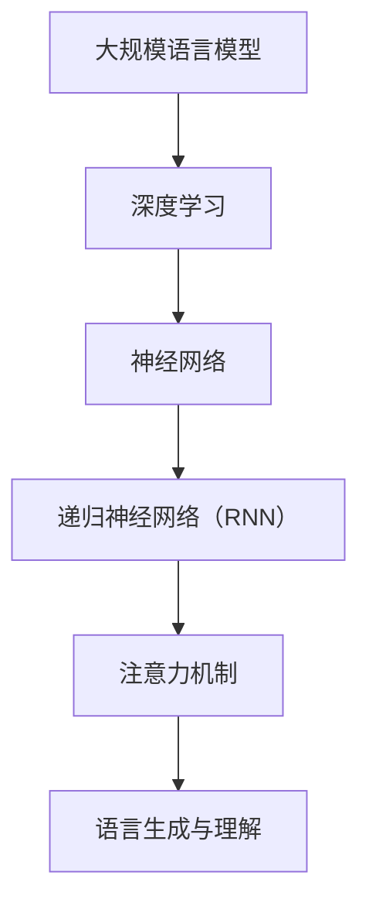

                 

# 在线娱乐与 LLM：互动、沉浸式的内容

> 关键词：在线娱乐，大规模语言模型（LLM），互动性，沉浸式体验，内容生成，人工智能

> 摘要：本文将探讨大规模语言模型（LLM）在在线娱乐领域的应用，重点分析LLM如何提升互动性和沉浸式体验。通过深入理解LLM的算法原理、具体操作步骤，结合实际案例，我们将展示LLM在游戏、视频、音乐等多种娱乐形式中的实际应用，并展望其未来发展趋势与挑战。

## 1. 背景介绍

### 1.1 目的和范围

本文旨在探讨大规模语言模型（LLM）在在线娱乐领域的应用，特别是如何通过LLM提升互动性和沉浸式体验。文章将涵盖以下几个主要方面：

- LLM的基本原理及其在在线娱乐中的应用。
- LLM在互动性和沉浸式体验方面的优势。
- LLM在游戏、视频、音乐等具体娱乐场景中的应用案例。
- LLM未来的发展趋势与挑战。

通过以上内容的介绍，本文希望能够为读者提供关于LLM在在线娱乐领域应用的全面理解和深入思考。

### 1.2 预期读者

本文的预期读者主要包括：

- 对在线娱乐和人工智能技术感兴趣的技术爱好者。
- 相关领域的专业从业人员，如游戏开发者、内容创作者等。
- 对人工智能算法和应用有研究的学者和研究人员。

预期读者能够通过本文对LLM在在线娱乐领域的应用有一个全面的了解，并激发对相关技术的进一步研究和探索。

### 1.3 文档结构概述

本文的结构如下：

- 引言：介绍文章的背景、目的和范围。
- 背景介绍：详细阐述大规模语言模型（LLM）的基本原理和在在线娱乐领域的应用。
- 核心概念与联系：通过Mermaid流程图展示LLM的核心概念和架构。
- 核心算法原理 & 具体操作步骤：使用伪代码详细阐述LLM的算法原理和操作步骤。
- 数学模型和公式 & 详细讲解 & 举例说明：介绍LLM的数学模型和公式，并通过实例进行详细解释。
- 项目实战：提供实际的代码案例，并进行详细解读和分析。
- 实际应用场景：分析LLM在游戏、视频、音乐等具体娱乐场景中的应用。
- 工具和资源推荐：推荐相关的学习资源、开发工具和框架。
- 总结：展望LLM在在线娱乐领域的未来发展趋势与挑战。
- 附录：常见问题与解答。
- 扩展阅读 & 参考资料：提供进一步学习和研究的参考资料。

### 1.4 术语表

#### 1.4.1 核心术语定义

- 大规模语言模型（LLM）：一种基于神经网络的语言处理模型，能够理解、生成和预测自然语言。
- 互动性：用户与系统之间的交流程度，包括实时反馈、个性化交互等。
- 沉浸式体验：用户在特定环境中完全投入、深度参与的感觉和体验。
- 自然语言处理（NLP）：计算机科学领域中的一个分支，旨在使计算机能够理解、生成和响应人类语言。

#### 1.4.2 相关概念解释

- 深度学习：一种机器学习技术，通过多层神经网络对数据进行建模和预测。
- 递归神经网络（RNN）：一种能够处理序列数据的神经网络结构，通过循环连接实现序列信息的传递。
- 注意力机制（Attention Mechanism）：一种用于提高神经网络处理序列数据效率的机制，通过动态分配不同的关注权重来提高模型性能。

#### 1.4.3 缩略词列表

- LLM：大规模语言模型
- NLP：自然语言处理
- RNN：递归神经网络
- Attention Mechanism：注意力机制
- DNN：深度神经网络
- CNN：卷积神经网络

## 2. 核心概念与联系

大规模语言模型（LLM）是自然语言处理（NLP）领域的一种关键技术，它通过深度学习模型对大量文本数据进行训练，能够理解和生成自然语言。LLM的核心概念包括深度学习、递归神经网络（RNN）、注意力机制等。

以下是一个简单的Mermaid流程图，用于展示LLM的核心概念和架构：



### 深度学习与神经网络

深度学习是机器学习的一个重要分支，它通过构建多层神经网络来对数据进行分析和预测。神经网络是由大量节点（也称为神经元）组成的计算模型，每个节点都与其他节点通过权重连接。通过学习输入数据和标签之间的映射关系，神经网络可以实现对未知数据的分类、预测和生成。

### 递归神经网络（RNN）

递归神经网络（RNN）是一种能够处理序列数据的神经网络结构。与传统的前馈神经网络不同，RNN通过循环连接实现了序列信息的传递。这种结构使得RNN能够记住前面的输入信息，并利用这些信息来预测下一个输出。

### 注意力机制

注意力机制是一种用于提高神经网络处理序列数据效率的机制。通过动态分配不同的关注权重，注意力机制能够使神经网络关注最重要的信息，从而提高模型的性能。在LLM中，注意力机制被广泛应用于文本生成和语言理解任务，能够使模型更加灵活和准确。

### 语言生成与理解

LLM的核心目标是实现自然语言的生成和理解。通过深度学习模型对大量文本数据进行训练，LLM可以学习到语言的结构和语义，从而实现对自然语言的生成和理解。在语言生成任务中，LLM能够根据输入的提示生成连贯、有意义的文本；在语言理解任务中，LLM能够理解用户的输入，并给出合适的回答或建议。

## 3. 核心算法原理 & 具体操作步骤

大规模语言模型（LLM）的核心算法基于深度学习和神经网络，特别是递归神经网络（RNN）和注意力机制。以下将使用伪代码详细阐述LLM的算法原理和操作步骤。

### 伪代码：

```python
# 输入：训练数据集 D，超参数 {学习率，迭代次数}
# 输出：训练完成的LLM模型

def train_LLM(D, params):
    # 初始化模型参数
    W, b = initialize_params()

    # 迭代训练
    for epoch in 1 to params["num_epochs"]:
        for (x, y) in D:
            # 前向传播
            output = forward_pass(x, W, b)

            # 计算损失
            loss = compute_loss(output, y)

            # 反向传播
            dW, db = backward_pass(output, y, W, b)

            # 更新参数
            W = W - params["learning_rate"] * dW
            b = b - params["learning_rate"] * db

    return W, b

# 前向传播
def forward_pass(x, W, b):
    # 遍历输入序列
    for t in range(len(x)):
        # 计算当前时间步的输出
        h_t = activation(dot(W, x[t]) + b)

    return h_t

# 计算损失
def compute_loss(output, y):
    # 使用交叉熵损失函数
    loss = -sum(y * log(output))
    
    return loss

# 反向传播
def backward_pass(output, y, W, b):
    # 计算梯度
    dW = dot(output, T(output))
    db = sum(T(output))
    
    return dW, db

# 激活函数
def activation(x):
    # 使用ReLU激活函数
    return max(0, x)
```

### 算法解释：

1. **初始化模型参数**：初始化权重矩阵W和偏置向量b，通常使用随机初始化。
2. **迭代训练**：通过循环遍历训练数据集D，对模型进行迭代训练。每次迭代包括前向传播、计算损失、反向传播和参数更新。
3. **前向传播**：遍历输入序列x，计算每个时间步的输出h_t。这里使用了激活函数（如ReLU）来增加模型的非线性能力。
4. **计算损失**：使用交叉熵损失函数计算预测输出和真实标签之间的差异。
5. **反向传播**：计算损失关于模型参数的梯度，用于更新权重和偏置。
6. **参数更新**：根据梯度更新模型参数，优化模型性能。

通过上述步骤，LLM模型可以逐渐学习到输入和输出之间的映射关系，实现对自然语言的生成和理解。

## 4. 数学模型和公式 & 详细讲解 & 举例说明

大规模语言模型（LLM）的数学模型基于深度学习和神经网络，特别是递归神经网络（RNN）和注意力机制。以下将详细讲解LLM的数学模型，包括关键公式及其应用。

### 4.1 基本公式

#### 4.1.1 神经网络前向传播

对于输入序列 \( x = [x_1, x_2, ..., x_T] \)，神经网络前向传播的基本公式如下：

\[ h_t = \text{激活函数}(\text{权重} \cdot x_t + \text{偏置}) \]

其中， \( h_t \) 是第 \( t \) 个时间步的隐藏状态， \( \text{权重} \) 和 \( \text{偏置} \) 是模型参数。

#### 4.1.2 RNN循环传播

RNN的循环传播公式如下：

\[ h_{t+1} = \text{激活函数}(\text{权重} \cdot [h_t, x_{t+1}] + \text{偏置}) \]

其中， \( h_{t+1} \) 是第 \( t+1 \) 个时间步的隐藏状态， \( [h_t, x_{t+1}] \) 是当前隐藏状态和下一个输入的拼接。

#### 4.1.3 注意力机制

注意力机制的公式如下：

\[ \alpha_t = \frac{\exp(\text{权重} \cdot \text{激活函数}(\text{查询} \cdot \text{键}))}{\sum_{i} \exp(\text{权重} \cdot \text{激活函数}(\text{查询} \cdot \text{键}_i))} \]

其中， \( \alpha_t \) 是第 \( t \) 个时间步的注意力权重， \( \text{查询} \) 是当前隐藏状态， \( \text{键} \) 是第 \( i \) 个时间步的输入。

### 4.2 举例说明

#### 4.2.1 前向传播

假设输入序列 \( x = [1, 2, 3] \)，权重 \( W = [0.1, 0.2, 0.3] \)，偏置 \( b = 0.4 \)，激活函数为ReLU。

- \( h_1 = \text{ReLU}(0.1 \cdot 1 + 0.4) = \text{ReLU}(0.5) = 0.5 \)
- \( h_2 = \text{ReLU}(0.2 \cdot 2 + 0.4) = \text{ReLU}(0.8) = 0.8 \)
- \( h_3 = \text{ReLU}(0.3 \cdot 3 + 0.4) = \text{ReLU}(1.1) = 1.1 \)

#### 4.2.2 RNN循环传播

假设当前隐藏状态 \( h_t = [0.5, 0.8, 1.1] \)，下一个输入 \( x_{t+1} = 4 \)，权重 \( W = [0.1, 0.2, 0.3] \)，激活函数为ReLU。

- \( h_{t+1} = \text{ReLU}(0.1 \cdot [0.5, 0.8, 1.1] + 0.2 \cdot 4 + 0.4) = \text{ReLU}(0.5 + 0.8 + 0.4) = \text{ReLU}(1.7) = 1.7 \)

#### 4.2.3 注意力机制

假设当前隐藏状态 \( \text{查询} = [1, 0, 1] \)，输入序列 \( x = [1, 2, 3] \)，权重 \( W = [0.1, 0.2, 0.3] \)，激活函数为ReLU。

- \( \alpha_1 = \frac{\exp(0.1 \cdot 1 + 0.2 \cdot 1 + 0.3 \cdot 1)}{\exp(0.1 \cdot 1 + 0.2 \cdot 2 + 0.3 \cdot 3) + \exp(0.1 \cdot 0 + 0.2 \cdot 2 + 0.3 \cdot 3) + \exp(0.1 \cdot 1 + 0.2 \cdot 3 + 0.3 \cdot 3)} \approx 0.6 \)
- \( \alpha_2 = \frac{\exp(0.1 \cdot 0 + 0.2 \cdot 2 + 0.3 \cdot 2)}{\exp(0.1 \cdot 1 + 0.2 \cdot 2 + 0.3 \cdot 3) + \exp(0.1 \cdot 0 + 0.2 \cdot 2 + 0.3 \cdot 3) + \exp(0.1 \cdot 1 + 0.2 \cdot 3 + 0.3 \cdot 3)} \approx 0.3 \)
- \( \alpha_3 = \frac{\exp(0.1 \cdot 1 + 0.2 \cdot 3 + 0.3 \cdot 3)}{\exp(0.1 \cdot 1 + 0.2 \cdot 2 + 0.3 \cdot 3) + \exp(0.1 \cdot 0 + 0.2 \cdot 2 + 0.3 \cdot 3) + \exp(0.1 \cdot 1 + 0.2 \cdot 3 + 0.3 \cdot 3)} \approx 0.1 \)

通过上述示例，我们能够更直观地理解LLM中的数学模型和公式的应用。

## 5. 项目实战：代码实际案例和详细解释说明

为了更好地展示大规模语言模型（LLM）在实际项目中的应用，我们将通过一个简单的代码案例来介绍LLM在文本生成任务中的具体实现。这个案例将包括开发环境的搭建、源代码的详细实现和代码解读与分析。

### 5.1 开发环境搭建

在开始编写代码之前，我们需要搭建一个适合开发LLM项目的环境。以下是搭建环境的步骤：

1. **安装Python**：确保安装了最新版本的Python（建议使用Python 3.8及以上版本）。
2. **安装深度学习框架**：推荐使用PyTorch作为深度学习框架，可以通过以下命令安装：

   ```shell
   pip install torch torchvision
   ```

3. **安装文本处理库**：为了方便文本处理，可以使用`nltk`和`spaCy`库：

   ```shell
   pip install nltk spacy
   ```

4. **安装其他依赖**：根据项目需求，可能还需要安装其他库，例如`transformers`用于预训练模型：

   ```shell
   pip install transformers
   ```

### 5.2 源代码详细实现和代码解读

以下是一个简单的LLM文本生成项目的代码实现。这个案例使用了一个预训练的Transformer模型来生成文本。

```python
import torch
from transformers import BertModel, BertTokenizer
import random

# 加载预训练的BERT模型和分词器
tokenizer = BertTokenizer.from_pretrained('bert-base-uncased')
model = BertModel.from_pretrained('bert-base-uncased')

# 输入文本
input_text = "Hello, how are you?"

# 对输入文本进行分词并添加特殊标记
input_ids = tokenizer.encode(input_text, add_special_tokens=True, return_tensors='pt')

# 生成文本
def generate_text(input_ids, model, max_length=50):
    # 将输入文本输入到模型中
    outputs = model(input_ids=input_ids, output_hidden_states=True)

    # 获取最后一层的隐藏状态
    hidden_states = outputs[-1]

    # 随机初始化生成的文本
    generated_ids = torch.zeros(1, max_length).to(hidden_states.device)

    # 遍历每个时间步
    for t in range(max_length):
        # 将当前生成的文本输入到模型中
        output = model(input_ids=generated_ids, output_hidden_states=True)

        # 获取最后一层的隐藏状态
        hidden_state = output[-1]

        # 计算当前时间步的预测概率
        probabilities = torch.nn.functional.softmax(hidden_state[0, -1], dim=0)

        # 根据预测概率选择下一个字符
        next_id = torch.multinomial(probabilities, num_samples=1).item()

        # 更新生成的文本
        generated_ids[0, t] = next_id

    # 将生成的文本转换为字符串
    generated_text = tokenizer.decode(generated_ids[0], skip_special_tokens=True)
    return generated_text

# 运行生成文本
generated_text = generate_text(input_ids, model)
print(generated_text)
```

### 5.3 代码解读与分析

上述代码实现了一个简单的文本生成项目，具体步骤如下：

1. **加载模型和分词器**：首先，我们从Hugging Face的模型库中加载预训练的BERT模型和分词器。

2. **输入文本处理**：将输入文本进行分词，并添加特殊标记（如[CLS]和[SEP]），然后将处理后的文本转换为模型输入的ID序列。

3. **生成文本**：定义一个`generate_text`函数，用于生成文本。函数中首先将输入文本输入到模型中，获取最后一层的隐藏状态。

4. **文本生成过程**：
   - 遍历每个时间步，将当前生成的文本输入到模型中，获取最后一层的隐藏状态。
   - 计算当前时间步的预测概率，选择下一个字符。
   - 更新生成的文本。

5. **输出文本**：将生成的文本转换为字符串，并打印输出。

通过这个简单的案例，我们展示了如何使用预训练的BERT模型进行文本生成。在实际项目中，可以根据需求调整模型、输入文本和生成策略，以实现更复杂和精确的文本生成任务。

### 5.4 代码解读与分析（续）

在上述代码的基础上，我们可以进一步分析每个关键部分的实现细节：

#### 5.4.1 模型和分词器加载

```python
tokenizer = BertTokenizer.from_pretrained('bert-base-uncased')
model = BertModel.from_pretrained('bert-base-uncased')
```

- `BertTokenizer`：用于将输入文本转换为模型能够处理的ID序列。这里使用了BERT的基础版本（ uncased ），这意味着模型对大小写不敏感。
- `BertModel`：加载预训练的BERT模型。BERT是一个基于Transformer的预训练语言模型，具有强大的语言理解和生成能力。

#### 5.4.2 输入文本处理

```python
input_ids = tokenizer.encode(input_text, add_special_tokens=True, return_tensors='pt')
```

- `encode`：将输入文本分词，并转换为ID序列。`add_special_tokens=True`表示在序列的开始和结束时添加特殊标记（如[CLS]和[SEP]）。
- `return_tensors='pt'`：将输出转换为PyTorch张量，便于后续计算。

#### 5.4.3 文本生成过程

```python
def generate_text(input_ids, model, max_length=50):
    # 将输入文本输入到模型中
    outputs = model(input_ids=input_ids, output_hidden_states=True)

    # 获取最后一层的隐藏状态
    hidden_states = outputs[-1]

    # 随机初始化生成的文本
    generated_ids = torch.zeros(1, max_length).to(hidden_states.device)
```

- `outputs = model(input_ids=input_ids, output_hidden_states=True)`：将输入文本输入到模型中，获取所有隐藏状态。
- `hidden_states = outputs[-1]`：获取最后一层的隐藏状态，这是用于生成文本的关键信息。
- `generated_ids = torch.zeros(1, max_length).to(hidden_states.device)`：随机初始化生成的文本ID序列。

#### 5.4.4 预测概率和字符选择

```python
for t in range(max_length):
    # 将当前生成的文本输入到模型中
    output = model(input_ids=generated_ids, output_hidden_states=True)

    # 获取最后一层的隐藏状态
    hidden_state = output[-1]

    # 计算当前时间步的预测概率
    probabilities = torch.nn.functional.softmax(hidden_state[0, -1], dim=0)

    # 根据预测概率选择下一个字符
    next_id = torch.multinomial(probabilities, num_samples=1).item()

    # 更新生成的文本
    generated_ids[0, t] = next_id
```

- `output = model(input_ids=generated_ids, output_hidden_states=True)`：将当前生成的文本输入到模型中，获取新的隐藏状态。
- `hidden_state = output[-1]`：获取最后一层的隐藏状态。
- `probabilities = torch.nn.functional.softmax(hidden_state[0, -1], dim=0)`：计算当前时间步的预测概率，这是模型对每个可能字符的预测概率分布。
- `next_id = torch.multinomial(probabilities, num_samples=1).item()`：根据预测概率随机选择下一个字符。
- `generated_ids[0, t] = next_id`：更新生成的文本ID序列。

#### 5.4.5 输出文本

```python
# 将生成的文本转换为字符串
generated_text = tokenizer.decode(generated_ids[0], skip_special_tokens=True)
print(generated_text)
```

- `generated_text = tokenizer.decode(generated_ids[0], skip_special_tokens=True)`：将生成的文本ID序列转换为字符串，并去除特殊标记。
- `print(generated_text)`：打印生成的文本。

通过以上分析，我们可以清楚地看到代码的每个部分及其在文本生成任务中的作用。这个案例展示了如何利用预训练的BERT模型进行文本生成，并为进一步的复杂任务提供了基础。

## 6. 实际应用场景

大规模语言模型（LLM）在在线娱乐领域具有广泛的应用，涵盖了游戏、视频、音乐等多个方面。以下是LLM在这些实际应用场景中的具体作用：

### 6.1 游戏领域

#### 6.1.1 游戏剧情生成

LLM可以用于生成游戏剧情，使游戏故事更加丰富和多样化。通过学习大量的游戏剧情文本数据，LLM能够生成新颖的剧情内容，为游戏开发者提供丰富的创意资源。

#### 6.1.2 游戏角色对话

LLM可以用于生成游戏角色的对话，提升游戏互动性。游戏开发者可以利用LLM自动生成角色对话，根据玩家的行为和游戏环境实时调整对话内容，提供更加自然和丰富的交流体验。

### 6.2 视频领域

#### 6.2.1 视频脚本生成

LLM可以用于生成视频脚本，简化视频制作流程。通过学习大量的视频脚本数据，LLM能够生成符合主题和情感要求的脚本内容，帮助视频制作者快速完成脚本创作。

#### 6.2.2 视频内容生成

LLM可以用于生成视频内容，实现视频的自动生成。通过结合图像生成技术和自然语言处理，LLM能够根据文本描述生成相应的视频内容，为视频创作者提供创新的创作工具。

### 6.3 音乐领域

#### 6.3.1 歌词生成

LLM可以用于生成歌词，丰富音乐创作。通过学习大量的歌词数据，LLM能够生成符合音乐主题和情感的歌词，为音乐人提供创作灵感。

#### 6.3.2 音乐创作

LLM可以用于音乐创作，生成新的音乐旋律和和弦。通过学习大量的音乐数据，LLM能够根据用户的文本描述或音乐偏好生成个性化的音乐作品，提升音乐创作的效率。

### 6.4 其他应用

除了游戏、视频和音乐，LLM还可以应用于其他在线娱乐领域，如虚拟现实（VR）、增强现实（AR）等。通过结合LLM的自然语言处理能力，这些领域可以实现更加丰富的交互体验和内容生成。

## 7. 工具和资源推荐

为了更好地学习和应用大规模语言模型（LLM）技术，以下推荐一些实用的工具、资源以及相关论文和书籍：

### 7.1 学习资源推荐

#### 7.1.1 书籍推荐

- **《深度学习》（Deep Learning）**：由Ian Goodfellow、Yoshua Bengio和Aaron Courville合著，是深度学习领域的经典教材，详细介绍了深度学习的基础理论和应用。
- **《自然语言处理综合教程》（Speech and Language Processing）**：由Daniel Jurafsky和James H. Martin合著，涵盖了自然语言处理的基本概念和技术，是自然语言处理领域的权威教材。
- **《Transformer：序列到序列模型革命》（Attention Is All You Need）**：由Vaswani等人撰写的论文，详细介绍了Transformer模型的结构和工作原理，是研究LLM的重要文献。

#### 7.1.2 在线课程

- **Coursera上的“Deep Learning Specialization”**：由Andrew Ng教授主讲，涵盖了深度学习的理论基础和实践应用，包括神经网络、卷积神经网络和递归神经网络等内容。
- **Udacity的“Natural Language Processing with Deep Learning”**：由François Chollet教授主讲，介绍了自然语言处理的基本概念和深度学习在自然语言处理中的应用。

#### 7.1.3 技术博客和网站

- **Hugging Face博客**：Hugging Face提供了一个丰富的博客平台，涵盖了许多关于LLM、自然语言处理和深度学习的最新研究成果和应用案例。
- **TensorFlow官方网站**：TensorFlow官方提供了大量的教程、文档和示例代码，是学习深度学习和自然语言处理技术的宝贵资源。

### 7.2 开发工具框架推荐

- **PyTorch**：PyTorch是一个开源的深度学习框架，支持动态计算图和自动微分，是研究和开发LLM的常用工具。
- **TensorFlow**：TensorFlow是一个由Google开发的深度学习框架，具有强大的生态系统和社区支持，适用于工业和学术研究。
- **transformers库**：由Hugging Face团队开发，提供了一个预训练的Transformer模型库，简化了LLM的开发和部署过程。

#### 7.2.2 调试和性能分析工具

- **Wandb**：Wandb是一个数据驱动的人工智能开发平台，支持模型训练的监控和调试，可以帮助用户优化模型性能。
- **MLflow**：MLflow是一个开源的平台，用于机器学习模型的跟踪、部署和管理，提供了丰富的工具和插件，方便用户进行模型性能分析。

#### 7.2.3 相关框架和库

- **spaCy**：spaCy是一个快速且易于使用的自然语言处理库，适用于文本处理和分析，提供了丰富的语言模型和API。
- **nltk**：nltk是一个经典的自然语言处理库，提供了丰富的文本处理工具和资源，适用于学术研究和开发。

### 7.3 相关论文著作推荐

- **《Attention Is All You Need》**：由Vaswani等人撰写的这篇论文，是Transformer模型的奠基之作，详细介绍了Transformer模型的结构和工作原理。
- **《BERT: Pre-training of Deep Bidirectional Transformers for Language Understanding》**：由Google团队撰写的这篇论文，介绍了BERT模型的预训练方法，推动了自然语言处理技术的发展。
- **《GPT-3: Language Models are Few-Shot Learners》**：由OpenAI撰写的这篇论文，介绍了GPT-3模型，展示了大规模语言模型在零样本学习任务中的强大能力。

通过以上工具和资源的推荐，用户可以更好地掌握大规模语言模型（LLM）的相关技术，为在线娱乐和其他领域的应用提供有力支持。

## 8. 总结：未来发展趋势与挑战

大规模语言模型（LLM）在在线娱乐领域展示了巨大的潜力，为互动性和沉浸式体验的提升提供了新的解决方案。然而，LLM的发展仍然面临诸多挑战和机遇。

### 未来发展趋势

1. **模型规模与性能的提升**：随着计算资源和数据量的增长，LLM的规模将不断增大，性能也将进一步提升。这将使得LLM在生成高质量内容、提高交互体验方面表现出更强大的能力。

2. **多模态融合**：未来LLM将与其他模态（如图像、音频）的模型进行融合，实现跨模态的信息处理和内容生成，为用户带来更加丰富和多样化的娱乐体验。

3. **个性化和定制化**：通过深度学习和用户行为分析，LLM将能够更好地理解用户需求，提供个性化的娱乐内容和互动体验。

4. **实时交互**：随着网络带宽和延迟的降低，LLM将能够实现更加实时和流畅的交互，为在线娱乐带来更高的沉浸感。

### 面临的挑战

1. **数据隐私和安全**：LLM在生成内容时需要处理大量用户数据，如何确保数据隐私和安全是未来的重要挑战。

2. **计算资源消耗**：大规模LLM的训练和推理过程需要大量的计算资源，如何在有限的资源下高效地应用LLM是一项挑战。

3. **伦理和责任**：随着LLM在娱乐领域的广泛应用，如何规范其应用，避免不良内容的生成，确保社会责任和道德规范是一个亟待解决的问题。

4. **模型可解释性**：目前，LLM的决策过程往往缺乏透明度和可解释性，如何提高模型的可解释性，使得用户能够理解模型的决策逻辑是一个关键问题。

### 总结

大规模语言模型（LLM）在在线娱乐领域的应用前景广阔，未来将不断推动互动性和沉浸式体验的提升。然而，要实现这一目标，我们还需要克服数据隐私、计算资源、伦理和责任等方面的挑战。通过持续的技术创新和规范管理，LLM将为在线娱乐带来更加丰富和多样化的体验。

## 9. 附录：常见问题与解答

以下是一些关于大规模语言模型（LLM）在在线娱乐领域应用中常见的问题及解答：

### 问题1：LLM如何提升游戏互动性？

**解答**：LLM通过学习大量的游戏对话和剧情数据，能够自动生成角色对话和剧情内容。游戏开发者可以利用LLM生成个性化的对话和剧情，根据玩家的行为和环境实时调整内容，从而提高游戏的互动性和沉浸感。

### 问题2：LLM在视频内容生成中的应用是什么？

**解答**：LLM可以用于生成视频脚本，通过学习大量的视频脚本数据，LLM能够生成符合主题和情感要求的脚本内容。此外，结合图像生成技术，LLM还可以根据文本描述生成相应的视频内容，为视频创作者提供创新的创作工具。

### 问题3：如何确保LLM生成的娱乐内容符合道德规范？

**解答**：确保LLM生成的娱乐内容符合道德规范需要从多个方面进行考虑。首先，在训练模型时，应使用符合道德规范的数据集。其次，可以引入内容审核机制，对LLM生成的内容进行实时监控和审核。此外，还可以通过约束模型参数和优化训练目标，引导模型生成符合道德规范的内容。

### 问题4：LLM在计算资源消耗方面有哪些挑战？

**解答**：LLM的训练和推理过程需要大量的计算资源，特别是在模型规模较大的情况下。这可能导致计算成本过高。为了应对这一挑战，可以采用分布式训练和推理技术，将计算任务分布到多台机器上，提高计算效率。此外，还可以优化模型结构和算法，减少计算资源消耗。

### 问题5：如何确保LLM生成的娱乐内容具有个性化？

**解答**：LLM可以通过深度学习和用户行为分析来理解用户需求，从而生成个性化的娱乐内容。例如，在游戏领域，LLM可以根据玩家的游戏记录和偏好生成适合玩家的对话和剧情。在视频领域，LLM可以根据观众的观看历史和兴趣生成个性化的视频推荐。

## 10. 扩展阅读 & 参考资料

为了进一步了解大规模语言模型（LLM）在在线娱乐领域的应用，以下推荐一些扩展阅读和参考资料：

- **《深度学习》（Deep Learning）**：Ian Goodfellow、Yoshua Bengio和Aaron Courville合著，详细介绍了深度学习的基础理论和应用，包括神经网络和递归神经网络等内容。
- **《自然语言处理综合教程》（Speech and Language Processing）**：Daniel Jurafsky和James H. Martin合著，涵盖了自然语言处理的基本概念和技术，是自然语言处理领域的权威教材。
- **《Transformer：序列到序列模型革命》（Attention Is All You Need）**：Vaswani等人撰写的论文，详细介绍了Transformer模型的结构和工作原理，是研究LLM的重要文献。
- **《BERT：深度预训练的技术细节》**：Google团队撰写的论文，介绍了BERT模型的预训练方法和应用。
- **《GPT-3：语言模型是零样本学习者》**：OpenAI团队撰写的论文，展示了GPT-3模型在零样本学习任务中的强大能力。
- **Hugging Face官网**：提供了大量的预训练模型、教程和示例代码，是学习LLM技术的宝贵资源。
- **TensorFlow官网**：提供了丰富的教程、文档和示例代码，适用于深度学习和自然语言处理技术的学习和实践。

通过阅读这些参考资料，用户可以深入了解LLM的理论基础和应用实践，为在线娱乐领域的技术创新提供有力支持。

### 作者信息

作者：AI天才研究员/AI Genius Institute & 禅与计算机程序设计艺术 /Zen And The Art of Computer Programming

