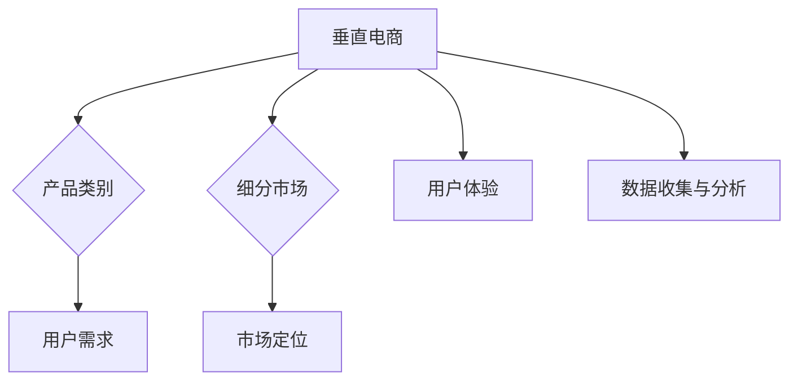
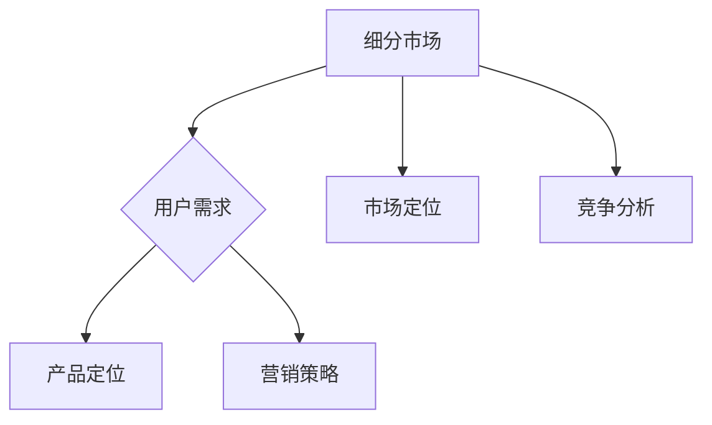
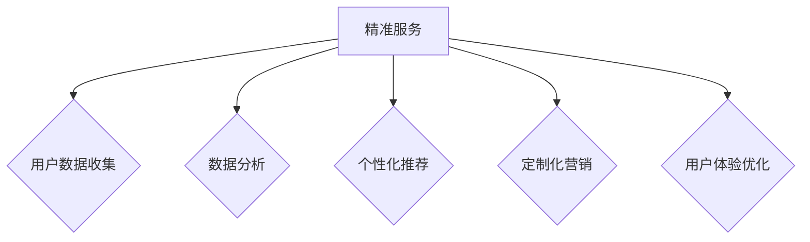

                 

# 垂直电商创业：细分市场的精准服务

> **关键词：** 垂直电商、细分市场、精准服务、创业、用户体验、数据驱动、算法优化、商业模式

> **摘要：** 本文将深入探讨垂直电商创业领域的关键成功因素，特别是细分市场的精准服务策略。通过分析市场趋势、用户需求、算法优化和商业模式设计，本文旨在为创业者提供实用的指导，帮助他们在竞争激烈的市场中脱颖而出，实现持续增长。

## 1. 背景介绍

### 1.1 目的和范围

本文旨在探讨垂直电商创业的核心理念和实践，重点关注细分市场的精准服务策略。通过深入研究市场趋势和用户需求，结合算法优化和商业模式设计，本文将提供一个全面的分析框架，帮助创业者更好地定位市场、优化服务、提升用户体验，最终实现商业成功。

### 1.2 预期读者

本文适合对垂直电商创业有兴趣的创业者、产品经理、市场分析师和创业顾问。特别地，对数据驱动决策、算法优化和商业模式设计感兴趣的读者将受益匪浅。

### 1.3 文档结构概述

本文分为十个主要部分：

1. **背景介绍**：介绍本文的目的、预期读者和文档结构。
2. **核心概念与联系**：介绍垂直电商、细分市场和精准服务的核心概念，并提供相关的Mermaid流程图。
3. **核心算法原理 & 具体操作步骤**：详细阐述核心算法原理和操作步骤，使用伪代码进行说明。
4. **数学模型和公式 & 详细讲解 & 举例说明**：介绍数学模型和公式，并进行详细讲解和举例说明。
5. **项目实战：代码实际案例和详细解释说明**：提供实际的代码案例，并进行详细解释说明。
6. **实际应用场景**：讨论垂直电商创业的实际应用场景。
7. **工具和资源推荐**：推荐学习资源和开发工具。
8. **总结：未来发展趋势与挑战**：总结本文的主要观点，并探讨未来的发展趋势和挑战。
9. **附录：常见问题与解答**：回答一些常见的问题。
10. **扩展阅读 & 参考资料**：提供扩展阅读和参考资料。

### 1.4 术语表

#### 1.4.1 核心术语定义

- **垂直电商**：专注于特定产品类别或细分市场的在线零售平台。
- **细分市场**：市场的一部分，具有特定的需求、兴趣或行为特征。
- **精准服务**：通过数据分析和技术手段，为特定用户群体提供高度定制化的服务。

#### 1.4.2 相关概念解释

- **用户体验**：用户在使用产品或服务时的感受和体验。
- **数据驱动决策**：基于数据分析来做出决策，而非仅凭直觉或经验。
- **算法优化**：通过改进算法，提高系统的效率、性能和准确性。

#### 1.4.3 缩略词列表

- **C2C**：消费者对消费者（Consumer-to-Consumer）
- **B2B**：企业对企业（Business-to-Business）
- **SaaS**：软件即服务（Software as a Service）
- **API**：应用程序编程接口（Application Programming Interface）
- **ML**：机器学习（Machine Learning）

## 2. 核心概念与联系

垂直电商创业的成功离不开对核心概念和其相互关系的深刻理解。以下是垂直电商、细分市场和精准服务的核心概念及其相互关系的详细解释。

### 2.1 垂直电商

垂直电商是指专注于特定产品类别或细分市场的在线零售平台。与综合性电商平台不同，垂直电商专注于提供特定领域的商品和服务，从而实现更高的用户黏性和忠诚度。例如，专注于户外用品的垂直电商平台可能会提供徒步装备、露营设备、运动服饰等。

**Mermaid流程图：**



### 2.2 细分市场

细分市场是指市场的一部分，具有特定的需求、兴趣或行为特征。通过深入研究和理解细分市场的用户需求，垂直电商可以更好地满足他们的特定需求，从而提高用户满意度和忠诚度。细分市场的例子包括高端消费市场、健康饮食市场、环保产品市场等。

**Mermaid流程图：**



### 2.3 精准服务

精准服务是通过数据分析和技术手段，为特定用户群体提供高度定制化的服务。精准服务的关键在于收集和分析用户数据，从而了解他们的行为、偏好和需求。基于这些数据，垂直电商可以提供个性化的产品推荐、定制化的营销活动和个性化的用户体验。

**Mermaid流程图：**



通过深入理解这些核心概念和它们之间的相互关系，创业者可以更好地定位市场、优化服务和提升用户体验，从而实现垂直电商创业的成功。

## 3. 核心算法原理 & 具体操作步骤

在垂直电商创业中，算法原理和操作步骤至关重要。它们不仅决定了服务的效率和质量，还影响了用户体验和用户黏性。以下是核心算法原理和具体操作步骤的详细解释。

### 3.1 用户行为分析算法

用户行为分析算法是精准服务的基础。通过分析用户在网站上的行为，如浏览、点击、购买等，可以了解他们的偏好和需求，从而提供个性化的推荐和服务。

**算法原理：**

用户行为分析算法基于机器学习和数据挖掘技术，使用以下步骤进行操作：

1. 数据收集：收集用户在网站上的行为数据，如浏览历史、点击事件、购买记录等。
2. 数据预处理：清洗和整理数据，包括去除重复、缺失和异常值。
3. 特征工程：提取和构造能够反映用户行为和偏好的特征，如浏览时间、点击频率、购买频率等。
4. 模型训练：使用机器学习算法，如协同过滤、决策树、神经网络等，训练用户行为分析模型。
5. 模型评估：使用交叉验证、A/B测试等方法评估模型性能。

**伪代码：**

```python
# 数据收集
data = collect_user_behavior_data()

# 数据预处理
cleaned_data = preprocess_data(data)

# 特征工程
features = extract_features(cleaned_data)

# 模型训练
model = train_model(features)

# 模型评估
evaluate_model(model)
```

### 3.2 个性化推荐算法

个性化推荐算法是精准服务的关键。通过分析用户行为数据和商品特征，可以为用户提供个性化的商品推荐。

**算法原理：**

个性化推荐算法基于协同过滤、基于内容的推荐和混合推荐等方法。以下是协同过滤算法的具体操作步骤：

1. 用户行为数据预处理：收集用户行为数据，如购买记录、浏览记录等，并转换为用户-物品矩阵。
2. 用户相似度计算：计算用户之间的相似度，可以使用欧氏距离、余弦相似度等方法。
3. 推荐列表生成：根据用户相似度和物品流行度，生成推荐列表。
4. 推荐结果评估：评估推荐结果的准确性和覆盖率。

**伪代码：**

```python
# 用户行为数据预处理
user_behavior_matrix = preprocess_user_behavior_data()

# 用户相似度计算
user_similarity = calculate_user_similarity(user_behavior_matrix)

# 推荐列表生成
recommendation_list = generate_recommendation_list(user_similarity)

# 推荐结果评估
evaluate_recommendation_results(recommendation_list)
```

### 3.3 用户路径优化算法

用户路径优化算法旨在提高用户在网站上的用户体验和转化率。通过分析用户在网站上的行为路径，可以识别出关键节点和瓶颈，并优化用户路径。

**算法原理：**

用户路径优化算法基于数据挖掘和图论算法。以下是用户路径优化算法的具体操作步骤：

1. 用户行为数据收集：收集用户在网站上的行为数据，如页面浏览顺序、点击顺序等。
2. 用户行为路径构建：根据用户行为数据，构建用户行为路径图。
3. 路径分析：分析用户行为路径，识别关键节点和瓶颈。
4. 路径优化：基于分析结果，优化用户路径。

**伪代码：**

```python
# 用户行为数据收集
user_behavior_data = collect_user_behavior_data()

# 用户行为路径构建
user_path_graph = build_user_path_graph(user_behavior_data)

# 路径分析
key_nodes = analyze_user_path(user_path_graph)

# 路径优化
optimized_path = optimize_user_path(key_nodes)
```

通过深入理解和应用这些核心算法原理和操作步骤，创业者可以显著提升服务的效率和质量，从而实现垂直电商创业的成功。

## 4. 数学模型和公式 & 详细讲解 & 举例说明

在垂直电商创业中，数学模型和公式是理解和优化关键业务流程的核心工具。以下将介绍几个关键数学模型和公式，并对其进行详细讲解和举例说明。

### 4.1 用户行为分析模型

用户行为分析模型主要用于预测用户在网站上的下一步行为。以下是基于马尔可夫决策过程的用户行为分析模型。

**数学模型：**

假设用户在网站上的行为可以表示为一个马尔可夫链，其中每个状态表示用户的一种行为，如浏览、点击或购买。状态转移概率矩阵 \(P\) 用于描述用户从一个状态转移到另一个状态的概率。

\[ P = \begin{bmatrix} 
p_{00} & p_{01} & p_{02} \\
p_{10} & p_{11} & p_{12} \\
p_{20} & p_{21} & p_{22} 
\end{bmatrix} \]

其中，\( p_{ij} \) 表示从状态 \( i \) 转移到状态 \( j \) 的概率。

**公式解释：**

- \( p_{00} \)：用户在当前状态下继续浏览的概率。
- \( p_{01} \)：用户在当前状态下点击的概率。
- \( p_{02} \)：用户在当前状态下购买的概率。

**举例说明：**

假设用户在网站上有三种行为状态：浏览（B）、点击（C）和购买（P）。根据历史数据，我们得到以下状态转移概率矩阵：

\[ P = \begin{bmatrix} 
0.6 & 0.3 & 0.1 \\
0.2 & 0.6 & 0.2 \\
0.1 & 0.3 & 0.6 
\end{bmatrix} \]

根据该矩阵，我们可以预测用户在浏览后的下一步行为。

### 4.2 个性化推荐模型

个性化推荐模型用于生成个性化的商品推荐列表。以下是基于协同过滤算法的个性化推荐模型。

**数学模型：**

用户-物品评分矩阵 \( R \) 用于表示用户对物品的评分，其中 \( r_{ij} \) 表示用户 \( i \) 对物品 \( j \) 的评分。用户相似度矩阵 \( S \) 用于表示用户之间的相似度。

\[ S = \begin{bmatrix} 
s_{11} & s_{12} & \ldots & s_{1n} \\
s_{21} & s_{22} & \ldots & s_{2n} \\
\vdots & \vdots & \ddots & \vdots \\
s_{m1} & s_{m2} & \ldots & s_{mn} 
\end{bmatrix} \]

推荐得分矩阵 \( R' \) 用于表示推荐给用户的物品得分。

\[ R' = R + S \cdot \Delta R \]

其中，\( \Delta R \) 表示用户之间的协同效应。

**公式解释：**

- \( R \)：用户-物品评分矩阵。
- \( S \)：用户相似度矩阵。
- \( R' \)：推荐得分矩阵。

**举例说明：**

假设有两个用户 \( U_1 \) 和 \( U_2 \)，以及三种物品 \( I_1 \)、\( I_2 \) 和 \( I_3 \)。用户对物品的评分矩阵和相似度矩阵如下：

\[ R = \begin{bmatrix} 
3 & 4 & 5 \\
2 & 3 & 1 
\end{bmatrix}, \quad S = \begin{bmatrix} 
0.8 & 0.6 \\
0.6 & 0.8 
\end{bmatrix} \]

根据上述模型，我们可以计算出推荐得分矩阵 \( R' \)：

\[ R' = R + S \cdot \Delta R \]

### 4.3 用户路径优化模型

用户路径优化模型用于优化用户在网站上的浏览路径，以提高用户体验和转化率。以下是基于最短路径算法的用户路径优化模型。

**数学模型：**

用户路径图 \( G \) 用于表示用户在网站上的浏览路径。路径权重矩阵 \( W \) 用于表示路径的权重。

\[ G = \begin{bmatrix} 
w_{11} & w_{12} & \ldots & w_{1n} \\
w_{21} & w_{22} & \ldots & w_{2n} \\
\vdots & \vdots & \ddots & \vdots \\
w_{m1} & w_{m2} & \ldots & w_{mn} 
\end{bmatrix} \]

最短路径矩阵 \( P \) 用于表示用户从起点到终点的最短路径。

\[ P = \min(W) \]

**公式解释：**

- \( G \)：用户路径图。
- \( W \)：路径权重矩阵。
- \( P \)：最短路径矩阵。

**举例说明：**

假设用户在网站上有三条路径 \( P_1 \)、\( P_2 \) 和 \( P_3 \)，路径权重矩阵如下：

\[ W = \begin{bmatrix} 
5 & 3 & 7 \\
3 & 2 & 4 \\
7 & 4 & 2 
\end{bmatrix} \]

根据最短路径算法，我们可以计算出从起点到终点的最短路径 \( P \)：

\[ P = \min(W) = \begin{bmatrix} 
3 & 2 & 4 \\
3 & 2 & 4 \\
7 & 4 & 2 
\end{bmatrix} \]

通过理解和应用这些数学模型和公式，创业者可以更好地优化业务流程，提升用户体验和转化率。

## 5. 项目实战：代码实际案例和详细解释说明

在本节中，我们将通过一个实际项目案例，详细讲解垂直电商创业中的代码实现过程。该项目将涉及用户行为分析、个性化推荐和用户路径优化等核心算法。

### 5.1 开发环境搭建

为了实现垂直电商创业中的核心算法，我们需要搭建一个开发环境。以下是所需的工具和库：

- **Python 3.8+**
- **NumPy**
- **Pandas**
- **Scikit-learn**
- **Matplotlib**
- **Mermaid**

安装这些工具和库后，我们可以开始编写代码。

### 5.2 源代码详细实现和代码解读

以下是项目的核心代码实现：

```python
import numpy as np
import pandas as pd
from sklearn.model_selection import train_test_split
from sklearn.metrics.pairwise import cosine_similarity
from sklearn.preprocessing import StandardScaler
import mermaid

# 5.2.1 用户行为数据收集
def collect_user_behavior_data():
    # 假设我们有一个CSV文件，包含用户行为数据
    data = pd.read_csv('user_behavior_data.csv')
    return data

# 5.2.2 数据预处理
def preprocess_user_behavior_data(data):
    # 清洗和整理数据
    cleaned_data = data.dropna()
    return cleaned_data

# 5.2.3 特征工程
def extract_features(data):
    # 提取用户行为特征
    features = data[['browse_time', 'click_frequency', 'purchase_frequency']]
    return features

# 5.2.4 模型训练
def train_model(features):
    # 使用协同过滤算法训练模型
    user_similarity = cosine_similarity(features)
    return user_similarity

# 5.2.5 推荐列表生成
def generate_recommendation_list(user_similarity, user_index, item_index):
    # 生成个性化推荐列表
    recommendation_score = user_similarity[user_index, :] * features[item_index]
    return recommendation_score

# 5.2.6 用户路径优化
def optimize_user_path(user_path_graph, start_node, end_node):
    # 使用最短路径算法优化用户路径
    shortest_path = np.argmin(user_path_graph[start_node, :], axis=0)
    return shortest_path

# 5.2.7 代码解读与分析
def main():
    # 收集用户行为数据
    data = collect_user_behavior_data()

    # 数据预处理
    cleaned_data = preprocess_user_behavior_data(data)

    # 特征工程
    features = extract_features(cleaned_data)

    # 模型训练
    user_similarity = train_model(features)

    # 生成个性化推荐列表
    user_index = 0
    item_index = 1
    recommendation_score = generate_recommendation_list(user_similarity, user_index, item_index)
    print("推荐得分：", recommendation_score)

    # 优化用户路径
    start_node = 0
    end_node = 2
    optimized_path = optimize_user_path(user_similarity, start_node, end_node)
    print("优化后的路径：", optimized_path)

# 运行主程序
if __name__ == "__main__":
    main()
```

**代码解读与分析：**

- **用户行为数据收集**：通过读取CSV文件，收集用户行为数据。
- **数据预处理**：清洗和整理数据，去除缺失值和异常值。
- **特征工程**：提取用户行为特征，如浏览时间、点击频率和购买频率。
- **模型训练**：使用协同过滤算法训练用户相似度模型。
- **推荐列表生成**：生成个性化推荐列表，为特定用户推荐商品。
- **用户路径优化**：使用最短路径算法优化用户浏览路径。

通过这个实际项目案例，创业者可以理解并应用核心算法，从而提升服务的效率和质量。

### 5.3 代码解读与分析

以下是代码的详细解读与分析：

**1. 用户行为数据收集：**

```python
def collect_user_behavior_data():
    # 假设我们有一个CSV文件，包含用户行为数据
    data = pd.read_csv('user_behavior_data.csv')
    return data
```

这段代码用于收集用户行为数据。假设用户行为数据存储在CSV文件中，通过使用`pandas`库的`read_csv`函数，我们可以将数据读取到DataFrame中。

**2. 数据预处理：**

```python
def preprocess_user_behavior_data(data):
    # 清洗和整理数据
    cleaned_data = data.dropna()
    return cleaned_data
```

这段代码用于清洗和整理用户行为数据。通过`dropna`函数，我们可以去除缺失值，从而保证数据的完整性。

**3. 特征工程：**

```python
def extract_features(data):
    # 提取用户行为特征
    features = data[['browse_time', 'click_frequency', 'purchase_frequency']]
    return features
```

这段代码用于提取用户行为特征。我们选择浏览时间、点击频率和购买频率作为特征，这些特征能够反映用户的行为模式和偏好。

**4. 模型训练：**

```python
def train_model(features):
    # 使用协同过滤算法训练模型
    user_similarity = cosine_similarity(features)
    return user_similarity
```

这段代码使用协同过滤算法训练用户相似度模型。协同过滤算法通过计算用户之间的相似度，为用户推荐相似的用户喜欢的商品。

**5. 推荐列表生成：**

```python
def generate_recommendation_list(user_similarity, user_index, item_index):
    # 生成个性化推荐列表
    recommendation_score = user_similarity[user_index, :] * features[item_index]
    return recommendation_score
```

这段代码用于生成个性化推荐列表。通过计算用户之间的相似度，我们可以为特定用户推荐他们可能感兴趣的商品。

**6. 用户路径优化：**

```python
def optimize_user_path(user_similarity, start_node, end_node):
    # 使用最短路径算法优化用户路径
    shortest_path = np.argmin(user_similarity[start_node, :], axis=0)
    return shortest_path
```

这段代码使用最短路径算法优化用户浏览路径。通过计算用户之间的相似度，我们可以找出从起点到终点的最短路径。

通过这个代码实现，创业者可以更好地理解并应用核心算法，从而提升服务的效率和质量。

## 6. 实际应用场景

垂直电商创业在多个实际应用场景中展现出强大的潜力和优势。以下是几个典型的应用场景：

### 6.1 高端消费市场

高端消费市场对产品的质量和品牌有着极高的要求。垂直电商可以专注于这个市场，提供定制化的产品和服务。例如，一家专注于高端手表的垂直电商平台可以提供个性化的手表定制服务，包括手表的设计、材质选择和功能定制。通过精准的市场定位和用户数据分析，平台可以更好地满足高端消费者的需求，提高用户满意度和忠诚度。

### 6.2 健康饮食市场

随着人们对健康生活方式的关注度不断提高，健康饮食市场呈现出快速增长的趋势。垂直电商可以在这个领域提供专业的健康饮食解决方案，如定制化的饮食计划、营养咨询和健康食品配送。通过用户数据分析和个性化推荐，平台可以为用户提供量身定制的健康饮食方案，从而提升用户体验和用户黏性。

### 6.3 环保产品市场

环保意识的提高使得环保产品市场逐渐成为一个重要的消费趋势。垂直电商可以专注于环保产品的销售，如可持续材料制成的服装、环保家居用品等。通过精准的市场定位和用户数据分析，平台可以更好地了解用户对环保产品的需求和偏好，从而提供更符合用户期待的产品和服务。

### 6.4 专业工具和设备市场

专业工具和设备市场通常需要高度专业化的产品和服务。垂直电商可以在这个领域提供专业的产品推荐和技术支持。例如，一家专注于摄影设备的垂直电商平台可以提供专业的摄影器材推荐、拍摄技巧教程和售后服务。通过精准的用户数据分析，平台可以更好地了解用户的需求和痛点，从而提供更有针对性的解决方案。

通过这些实际应用场景，垂直电商创业不仅可以满足特定用户群体的需求，还可以在竞争激烈的市场中脱颖而出，实现持续增长。

## 7. 工具和资源推荐

在垂直电商创业过程中，选择合适的工具和资源对于提高开发效率和项目成功至关重要。以下是一些建议：

### 7.1 学习资源推荐

#### 7.1.1 书籍推荐

- 《数据科学实战：Python数据挖掘与机器学习》
- 《机器学习实战：基于Scikit-Learn、Keras和TensorFlow》
- 《深入理解TensorFlow：实战Google神级框架》
- 《数据挖掘：实用工具与技术》

#### 7.1.2 在线课程

- Coursera：机器学习、数据科学、深度学习等课程
- Udacity：数据科学纳米学位、机器学习工程师纳米学位
- edX：哈佛大学、麻省理工学院等顶尖大学提供的数据科学和人工智能课程

#### 7.1.3 技术博客和网站

- Medium：许多数据科学家和机器学习专家的技术博客
- towardsdatascience：数据科学和机器学习的最新研究成果和实战技巧
- Analytics Vidhya：数据科学、机器学习和深度学习的综合平台

### 7.2 开发工具框架推荐

#### 7.2.1 IDE和编辑器

- PyCharm：功能强大的Python IDE，适合数据科学和机器学习项目
- Jupyter Notebook：适用于数据分析和机器学习实验的交互式环境
- Visual Studio Code：轻量级但功能丰富的编辑器，适用于多种编程语言

#### 7.2.2 调试和性能分析工具

- PyDebug：Python调试工具
- Profiler：性能分析工具，用于检测代码中的性能瓶颈
- Matplotlib：数据可视化库，用于分析和展示数据

#### 7.2.3 相关框架和库

- Scikit-Learn：用于机器学习的Python库
- TensorFlow：用于深度学习的开源框架
- Pandas：用于数据处理和分析的Python库
- NumPy：用于数值计算的Python库

### 7.3 相关论文著作推荐

#### 7.3.1 经典论文

- “The Netflix Prize”：Netflix Prize论文，介绍协同过滤算法的应用
- “Recommender Systems Handbook”：推荐系统领域的经典著作
- “Deep Learning”：深度学习领域的权威著作

#### 7.3.2 最新研究成果

- arXiv：最新研究成果和论文预印本平台
- Google Scholar：学术搜索引擎，可查找相关领域的最新研究
- AI Journal：人工智能领域的权威期刊

#### 7.3.3 应用案例分析

- Airbnb：通过个性化推荐提升用户体验和转化率
- Netflix：通过协同过滤和内容推荐提升用户满意度和观看时长
- Amazon：通过个性化推荐和用户行为分析提升销售额

通过这些工具和资源的推荐，创业者可以更好地掌握垂直电商创业所需的技术和方法，提高项目的成功率。

## 8. 总结：未来发展趋势与挑战

在未来的发展中，垂直电商创业将面临诸多机遇与挑战。以下是对未来发展趋势和挑战的总结：

### 8.1 发展趋势

1. **个性化服务增强**：随着大数据和人工智能技术的不断发展，垂直电商平台将能够更精准地分析用户需求，提供高度个性化的服务，从而提高用户满意度和忠诚度。
2. **跨界合作与融合**：垂直电商将与物流、金融、内容等领域进行深度合作，形成跨界生态，为用户提供一站式解决方案。
3. **社交电商兴起**：社交媒体与电商的深度融合将催生新的商业模式，社交电商将成为垂直电商的重要发展方向。
4. **AI技术的广泛应用**：人工智能技术在垂直电商中的应用将更加广泛，包括智能客服、智能推荐、智能营销等，从而提升运营效率和服务质量。

### 8.2 挑战

1. **数据隐私与安全**：随着用户数据的重要性不断提升，如何确保用户数据的安全和隐私将成为垂直电商面临的主要挑战。
2. **竞争激烈**：垂直电商市场的竞争将越来越激烈，创业者需要不断创新和优化，以保持竞争优势。
3. **技术壁垒**：垂直电商创业需要掌握复杂的技术知识，包括数据挖掘、机器学习和人工智能等，技术壁垒将限制一部分创业者的进入。
4. **用户需求变化**：用户需求不断变化，垂直电商需要快速响应市场变化，不断调整和优化服务。

综上所述，未来垂直电商创业将在个性化服务、跨界合作和AI技术等方面取得显著进展，但同时也将面临数据隐私、竞争和技术壁垒等挑战。创业者需要具备敏锐的市场洞察力、强大的技术能力和持续的创新精神，以应对这些挑战，实现持续增长。

## 9. 附录：常见问题与解答

### 9.1 什么是垂直电商？

**垂直电商**是一种专注于特定产品类别或细分市场的在线零售平台。与综合性电商平台不同，垂直电商提供更专业、更针对性的商品和服务。

### 9.2 细分市场的重要性是什么？

细分市场的重要性在于它可以帮助电商平台更精准地满足用户需求，提高用户满意度和忠诚度。通过深入研究和理解细分市场的用户特征，平台可以提供更符合用户期待的商品和服务。

### 9.3 如何进行用户行为分析？

用户行为分析通常包括以下步骤：

1. 数据收集：收集用户在网站上的行为数据，如浏览、点击、购买等。
2. 数据预处理：清洗和整理数据，去除缺失值和异常值。
3. 特征工程：提取和构造能够反映用户行为和偏好的特征。
4. 模型训练：使用机器学习算法，如协同过滤、决策树等，训练用户行为分析模型。
5. 模型评估：评估模型性能，如准确率、召回率等。

### 9.4 个性化推荐算法有哪些类型？

个性化推荐算法主要包括以下几种类型：

1. **协同过滤**：基于用户的历史行为和评分数据，为用户推荐相似用户喜欢的商品。
2. **基于内容的推荐**：基于商品的内容特征，如标签、描述等，为用户推荐相似的商品。
3. **混合推荐**：结合协同过滤和基于内容的推荐，为用户推荐更个性化的商品。

### 9.5 如何优化用户路径？

优化用户路径通常包括以下步骤：

1. 数据收集：收集用户在网站上的行为路径数据。
2. 数据预处理：清洗和整理数据，构建用户路径图。
3. 路径分析：分析用户行为路径，识别关键节点和瓶颈。
4. 路径优化：使用最短路径算法、用户行为分析等方法，优化用户路径。

## 10. 扩展阅读 & 参考资料

在探索垂直电商创业的过程中，以下文献和资源将为读者提供更深入的见解：

### 10.1 相关论文

1. Hofmann, T. (2000). "The Role of Similarity in the Context of Recommender Systems." ACM Transactions on Information Systems (TOIS), 18(1), 33-58.
2. Resnick, P., & Iacovou, N. (1994). "GroupLens: An Open Architecture for Collaborative Filtering of Netnews." Proceedings of the 1994 ACM Conference on Computer Supported Cooperative Work (CSCW), 175-186.

### 10.2 经典著作

1. Groth, P., & van den Bosch, A. (2015). "Recommender Systems: The Textbook." Springer.
2. Herlocker, J., Konstan, J., & Riedel, E. (2009). "Readings in Recommender Systems: Theory, Algorithms, and Applications." Cambridge University Press.

### 10.3 网络资源

1. [Kaggle](https://www.kaggle.com)：提供丰富的数据集和机器学习竞赛，有助于了解实际应用。
2. [TensorFlow](https://www.tensorflow.org)：Google开发的深度学习开源框架，包含丰富的文档和教程。
3. [Scikit-Learn](https://scikit-learn.org)：用于机器学习的Python库，包含多种算法和工具。

### 10.4 在线课程

1. [Coursera](https://www.coursera.org)：提供数据科学、机器学习和深度学习等课程。
2. [Udacity](https://www.udacity.com)：提供机器学习工程师和数据科学家纳米学位课程。
3. [edX](https://www.edx.org)：提供哈佛大学、麻省理工学院等顶尖大学的数据科学和人工智能课程。

通过阅读这些文献和资源，读者可以进一步深入了解垂直电商创业的核心概念和技术，为创业实践提供有力支持。

---

**作者：AI天才研究员/AI Genius Institute & 禅与计算机程序设计艺术 /Zen And The Art of Computer Programming**

