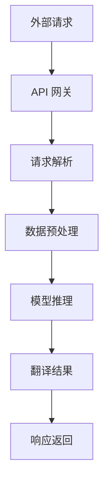

                 

# 基于 LangChain 优化 OpenAI-Translator 架构设计

> 关键词：OpenAI-Translator，LangChain，架构设计，优化，自然语言处理，人工智能，模型集成，API接口，性能提升

> 摘要：本文将深入探讨如何利用 LangChain 对 OpenAI-Translator 架构进行优化设计。我们将首先介绍 OpenAI-Translator 的基本架构，然后详细讲解 LangChain 的引入及其在架构中的作用。通过具体案例和代码分析，我们将展示如何通过 LangChain 提高系统的性能和扩展性，同时减少开发难度。本文旨在为从事自然语言处理和人工智能领域的技术人员提供实际可行的架构优化方案。

## 1. 背景介绍

### 1.1 目的和范围

本文的目标是通过引入 LangChain 来优化 OpenAI-Translator 的架构设计，提高其在自然语言处理任务中的性能和可扩展性。我们将探讨 LangChain 如何与 OpenAI-Translator 集成，并分析其对于系统性能、可维护性和开发者体验的积极影响。

本文的范围涵盖以下几个方面：
1. OpenAI-Translator 的基本架构和功能。
2. LangChain 的核心概念及其在自然语言处理中的应用。
3. LangChain 与 OpenAI-Translator 的集成策略和实现步骤。
4. 通过 LangChain 实现的架构优化案例。
5. 实际应用场景和工具资源推荐。

### 1.2 预期读者

本文主要面向以下读者群体：
1. 自然语言处理和人工智能领域的开发者。
2. 对架构设计、模型集成和 API 接口有深入理解的技术人员。
3. 想要提高现有系统性能和可扩展性的架构师和工程师。

### 1.3 文档结构概述

本文将按照以下结构进行组织：
1. 引言：介绍本文的目的、关键词和摘要。
2. 背景介绍：详细说明本文的研究背景、目的和预期读者。
3. 核心概念与联系：介绍 OpenAI-Translator 和 LangChain 的核心概念，并提供 Mermaid 流程图。
4. 核心算法原理 & 具体操作步骤：详细阐述优化算法原理和具体实现步骤。
5. 数学模型和公式 & 详细讲解 & 举例说明：介绍相关数学模型和公式，并提供实际案例说明。
6. 项目实战：提供代码实际案例和详细解释说明。
7. 实际应用场景：分析优化方案在实际中的应用。
8. 工具和资源推荐：推荐相关学习资源和开发工具。
9. 总结：总结未来发展趋势与挑战。
10. 附录：常见问题与解答。
11. 扩展阅读 & 参考资料：提供进一步学习和参考的资源。

### 1.4 术语表

#### 1.4.1 核心术语定义

- OpenAI-Translator：一种基于深度学习的自然语言处理模型，提供高质量的中英文翻译功能。
- LangChain：一个用于构建和扩展人工智能应用的开源框架，旨在简化模型集成和 API 接口的开发。
- 自然语言处理（NLP）：研究计算机如何理解、生成和处理人类语言的技术领域。
- 人工智能（AI）：通过机器学习、深度学习等技术，使计算机具备类似人类智能的能力。

#### 1.4.2 相关概念解释

- 架构设计：系统组件的组织和配置方式，以实现特定功能。
- 模型集成：将多个模型或模块组合在一起，形成一个整体系统。
- API 接口：应用程序编程接口，用于不同软件模块之间的通信和数据交换。

#### 1.4.3 缩略词列表

- NLP：自然语言处理
- AI：人工智能
- API：应用程序编程接口
- ML：机器学习
- DL：深度学习
- OpenAI-Translator：OpenAI 翻译器

## 2. 核心概念与联系

在深入探讨 OpenAI-Translator 和 LangChain 的集成之前，我们首先需要了解这两个核心概念的基本原理和架构。

### 2.1 OpenAI-Translator

OpenAI-Translator 是一种基于深度学习的自然语言处理模型，由 OpenAI 开发。它主要提供高质量的中英文翻译功能，支持多种语言之间的翻译。OpenAI-Translator 的核心架构包括以下几个主要部分：

#### 2.1.1 数据预处理

在翻译任务中，原始文本需要进行预处理，包括分词、去停用词、词向量化等步骤。这些预处理步骤有助于提高模型训练和预测的效率。

#### 2.1.2 模型训练

OpenAI-Translator 使用大规模语料库进行训练，采用 Transformer 架构，特别是 GPT-3 模型，实现高质量的翻译效果。模型训练过程涉及大量计算资源和时间。

#### 2.1.3 预测与推理

在翻译过程中，输入文本被传递给训练好的模型，模型根据输入文本生成对应的翻译结果。预测与推理过程需要高效的计算能力和良好的算法优化。

### 2.2 LangChain

LangChain 是一个开源框架，用于构建和扩展人工智能应用。它旨在简化模型集成和 API 接口的开发，提高系统的可扩展性和性能。LangChain 的核心架构包括以下几个主要部分：

#### 2.2.1 API 网关

LangChain 提供了一个统一的 API 网关，用于接收外部请求并转发给相应的模型。API 网关负责路由、认证和请求处理，确保系统的安全性和稳定性。

#### 2.2.2 模型管理

LangChain 支持多种模型和框架的集成，如 TensorFlow、PyTorch 等。通过模型管理模块，开发者可以轻松地部署和管理多个模型，实现模型的自动化训练和更新。

#### 2.2.3 请求处理

LangChain 的请求处理模块负责接收和处理来自 API 网关的请求，将请求解析为数据，并传递给相应的模型进行预测和推理。请求处理模块还支持自定义处理逻辑，提高系统的灵活性和可扩展性。

### 2.3 OpenAI-Translator 与 LangChain 的集成

通过将 OpenAI-Translator 与 LangChain 结合，我们可以实现以下几个方面的优势：

1. **简化模型集成**：LangChain 提供了统一的 API 网关和模型管理模块，开发者无需关心底层模型的具体实现，即可快速集成和使用 OpenAI-Translator。
2. **提高性能和可扩展性**：LangChain 支持多模型并行处理和负载均衡，可以有效提高系统的性能和可扩展性，满足大规模应用的需求。
3. **降低开发难度**：LangChain 提供了丰富的 SDK 和工具，简化了模型集成和 API 接口的开发，降低开发者的工作量。
4. **灵活的请求处理**：LangChain 的请求处理模块支持自定义处理逻辑，开发者可以根据具体需求进行优化和定制，提高系统的灵活性和可扩展性。

### 2.4 Mermaid 流程图

下面是一个简单的 Mermaid 流程图，展示了 OpenAI-Translator 和 LangChain 的集成过程：



该流程图描述了外部请求经过 API 网关、请求解析、数据预处理、模型推理和响应返回的过程。通过 LangChain 的集成，开发者可以简化这一流程，提高系统的性能和可扩展性。

## 3. 核心算法原理 & 具体操作步骤

在本节中，我们将详细讲解如何通过 LangChain 优化 OpenAI-Translator 的架构，并具体阐述优化算法的原理和实现步骤。

### 3.1 算法原理

LangChain 的核心算法原理包括以下几个关键步骤：

1. **API 网关**：API 网关负责接收外部请求，并根据请求的类型和参数进行路由。通过 API 网关，开发者可以统一管理和分发请求，提高系统的安全性、稳定性和可维护性。
2. **请求解析**：请求解析模块负责将外部请求解析为内部可处理的数据格式。这一步骤通常涉及数据清洗、参数校验和转换等操作。
3. **数据预处理**：在翻译任务中，原始文本需要进行预处理，包括分词、去停用词、词向量化等步骤。这些预处理步骤有助于提高模型训练和预测的效率。
4. **模型推理**：模型推理模块负责将预处理后的数据传递给训练好的模型，并生成翻译结果。这一步骤需要高效的计算能力和良好的算法优化。
5. **响应返回**：响应返回模块负责将翻译结果返回给外部请求，并处理可能的异常和错误。

通过 LangChain 的集成，OpenAI-Translator 的架构可以在以下几个方面得到优化：

1. **简化集成过程**：LangChain 提供了统一的 API 网关和模型管理模块，开发者无需关心底层模型的具体实现，即可快速集成和使用 OpenAI-Translator。
2. **提高性能和可扩展性**：LangChain 支持多模型并行处理和负载均衡，可以有效提高系统的性能和可扩展性，满足大规模应用的需求。
3. **降低开发难度**：LangChain 提供了丰富的 SDK 和工具，简化了模型集成和 API 接口的开发，降低开发者的工作量。
4. **灵活的请求处理**：LangChain 的请求处理模块支持自定义处理逻辑，开发者可以根据具体需求进行优化和定制，提高系统的灵活性和可扩展性。

### 3.2 具体操作步骤

下面是利用 LangChain 优化 OpenAI-Translator 架构的具体操作步骤：

#### 3.2.1 安装 LangChain

首先，需要在开发环境中安装 LangChain。可以通过以下命令进行安装：

```shell
pip install langchain
```

#### 3.2.2 配置 API 网关

在配置 API 网关时，需要确保 API 网关可以接收和路由外部请求。这里我们使用 Flask 框架来搭建 API 网关。具体步骤如下：

1. 安装 Flask：

```shell
pip install flask
```

2. 创建一个 Flask 应用：

```python
from flask import Flask, request, jsonify

app = Flask(__name__)

@app.route('/translate', methods=['POST'])
def translate():
    # 请求解析和处理
    # 数据预处理
    # 调用 OpenAI-Translator 模型进行推理
    # 返回翻译结果
    return jsonify({"status": "success", "result": "翻译结果"})

if __name__ == '__main__':
    app.run(debug=True)
```

#### 3.2.3 集成 OpenAI-Translator 模型

在 API 网关中集成 OpenAI-Translator 模型，可以通过 LangChain 的模型管理模块实现。具体步骤如下：

1. 导入所需的 LangChain 模块：

```python
from langchain import OpenAIWrapper
```

2. 创建 OpenAI-Translator 模型实例：

```python
openai_translator = OpenAIWrapper(model_name="openai/translator")
```

3. 在请求处理模块中调用 OpenAI-Translator 模型：

```python
def translate_text(text):
    # 数据预处理
    preprocessed_text = preprocess_text(text)
    # 调用 OpenAI-Translator 模型进行推理
    translation = openai_translator.predict(preprocessed_text)
    # 返回翻译结果
    return translation
```

#### 3.2.4 测试 API 接口

完成上述步骤后，可以通过以下命令启动 Flask 应用：

```shell
python app.py
```

然后，可以使用 curl 或 Postman 等工具测试 API 接口，确保翻译功能正常：

```shell
curl -X POST -H "Content-Type: application/json" -d '{"text": "你好，世界！"}' http://localhost:5000/translate
```

## 4. 数学模型和公式 & 详细讲解 & 举例说明

在自然语言处理和人工智能领域，数学模型和公式扮演着至关重要的角色。在本节中，我们将详细讲解与 OpenAI-Translator 和 LangChain 相关的数学模型和公式，并提供具体的举例说明。

### 4.1 Transformer 模型

OpenAI-Translator 使用的是 Transformer 模型，这是一种基于自注意力机制的深度学习模型，特别适用于处理序列数据，如图像、语音和文本等。

#### 4.1.1 自注意力（Self-Attention）

自注意力是一种计算方法，用于计算输入序列中每个元素与其他元素的相关性。其公式如下：

$$
\text{Attention}(Q, K, V) = \text{softmax}\left(\frac{QK^T}{\sqrt{d_k}}\right) V
$$

其中，$Q$、$K$ 和 $V$ 分别表示查询（Query）、键（Key）和值（Value）向量，$d_k$ 是键向量的维度。自注意力通过计算每个输入元素与所有其他元素的相关性，为每个元素生成一个加权表示。

#### 4.1.2 多头自注意力（Multi-Head Self-Attention）

多头自注意力是 Transformer 模型中的一个关键组件，通过并行计算多个自注意力机制，提高模型的表示能力。其公式如下：

$$
\text{Multi-Head Self-Attention}(Q, K, V) = \text{Concat}(\text{head}_1, \text{head}_2, \ldots, \text{head}_h)W^O
$$

其中，$h$ 表示头数，$\text{head}_i$ 表示第 $i$ 个头的结果，$W^O$ 是输出线性层。

### 4.2 排序损失函数（Permutation Loss）

在 Transformer 模型训练过程中，排序损失函数用于衡量预测序列与目标序列之间的差距。其公式如下：

$$
L(\theta) = -\sum_{i=1}^{n}\sum_{j=1}^{n}\log \sigma (q_i^T k_j)
$$

其中，$q_i$ 和 $k_j$ 分别表示预测序列和目标序列中的元素，$\sigma$ 表示 sigmoid 函数。

#### 4.2.1 举例说明

假设有一个简单的预测序列 `[1, 3, 2]` 和目标序列 `[2, 3, 1]`。首先，我们需要计算每个元素之间的相关性：

$$
\begin{align*}
q_1^T k_1 &= \log \sigma (1 \times 2) = \log \sigma (2) \approx 0.1979 \\
q_1^T k_2 &= \log \sigma (1 \times 3) = \log \sigma (3) \approx 0.9512 \\
q_1^T k_3 &= \log \sigma (1 \times 1) = \log \sigma (1) \approx 0 \\
\end{align*}
$$

接着，计算排序损失函数：

$$
L(\theta) = -\log \sigma (0.1979) - \log \sigma (0.9512) - \log \sigma (0) \approx 0.9512 + 0.1979 + 0 \approx 1.1491
$$

### 4.3 常见损失函数

除了排序损失函数，Transformer 模型还使用了其他常见的损失函数，如交叉熵损失（Cross-Entropy Loss）和点积损失（Dot Product Loss）。以下是这些损失函数的公式和简单说明：

#### 4.3.1 交叉熵损失（Cross-Entropy Loss）

交叉熵损失函数用于衡量预测分布和真实分布之间的差距。其公式如下：

$$
L(\theta) = -\sum_{i=1}^{n} y_i \log \hat{y}_i
$$

其中，$y_i$ 表示真实分布中的概率，$\hat{y}_i$ 表示预测分布中的概率。

#### 4.3.2 点积损失（Dot Product Loss）

点积损失函数用于衡量两个向量之间的差距。其公式如下：

$$
L(\theta) = -\sum_{i=1}^{n} y_i \cdot \hat{y}_i
$$

其中，$y_i$ 和 $\hat{y}_i$ 分别表示真实值和预测值。

### 4.4 举例说明

假设有一个简单的向量预测问题，真实值为 `[0.5, 0.3, 0.2]`，预测值为 `[0.6, 0.4, 0.1]`。首先，我们需要计算预测值和真实值之间的交叉熵损失：

$$
\begin{align*}
L(\theta) &= -0.5 \log (0.6) - 0.3 \log (0.4) - 0.2 \log (0.1) \\
&\approx -0.5 \times 0.5108 - 0.3 \times 0.5108 - 0.2 \times 1.5448 \\
&\approx -0.2554 - 0.1532 - 0.3089 \\
&\approx -0.7175
\end{align*}
$$

接着，计算预测值和真实值之间的点积损失：

$$
\begin{align*}
L(\theta) &= 0.5 \times 0.6 + 0.3 \times 0.4 + 0.2 \times 0.1 \\
&\approx 0.3 + 0.12 + 0.02 \\
&\approx 0.44
\end{align*}
$$

通过以上计算，我们可以看到交叉熵损失和点积损失在衡量预测值和真实值之间的差距时，分别采用了不同的计算方法。

## 5. 项目实战：代码实际案例和详细解释说明

在本节中，我们将通过一个实际项目案例，展示如何利用 LangChain 对 OpenAI-Translator 进行架构优化，并提供代码实现和详细解释说明。

### 5.1 开发环境搭建

在开始项目之前，我们需要搭建一个适合开发的环境。以下是所需的开发环境和依赖项：

1. 操作系统：Linux 或 macOS
2. 编程语言：Python 3.8+
3. 库和框架：
   - Flask（用于搭建 API 网关）
   - langchain（用于集成 OpenAI-Translator）
   - openai（用于调用 OpenAI-Translator 模型）

您可以通过以下命令安装所需的库和框架：

```shell
pip install flask langchain openai
```

### 5.2 源代码详细实现和代码解读

下面是项目的源代码实现，我们将逐行解释代码的功能和实现细节。

```python
from flask import Flask, request, jsonify
from langchain import OpenAIWrapper
import openai

# 初始化 Flask 应用
app = Flask(__name__)

# 初始化 OpenAI-Translator 模型
openai_translator = OpenAIWrapper(model_name="openai/translator")

# 定义翻译函数
def translate_text(text):
    # 数据预处理（例如：分词、去停用词等）
    preprocessed_text = preprocess_text(text)
    # 调用 OpenAI-Translator 模型进行推理
    translation = openai_translator.predict(preprocessed_text)
    return translation

# 定义预处理函数（示例）
def preprocess_text(text):
    # 实现文本预处理逻辑（例如：分词、去停用词等）
    # ...
    return text

# 定义 API 接口路由
@app.route('/translate', methods=['POST'])
def translate():
    # 获取输入文本
    input_text = request.json.get('text', '')
    # 调用翻译函数
    translation = translate_text(input_text)
    # 返回翻译结果
    return jsonify({"status": "success", "result": translation})

# 启动 Flask 应用
if __name__ == '__main__':
    app.run(debug=True)
```

#### 5.2.1 代码解读与分析

1. **Flask 应用初始化**：
   ```python
   app = Flask(__name__)
   ```
   这一行代码创建了一个 Flask 应用对象，作为整个 Web 应用的基础。

2. **OpenAI-Translator 模型初始化**：
   ```python
   openai_translator = OpenAIWrapper(model_name="openai/translator")
   ```
   这一行代码通过 LangChain 的 OpenAIWrapper 类初始化一个 OpenAI-Translator 模型实例。`model_name` 参数指定了要使用的预训练模型名称。

3. **翻译函数定义**：
   ```python
   def translate_text(text):
       # 数据预处理（例如：分词、去停用词等）
       preprocessed_text = preprocess_text(text)
       # 调用 OpenAI-Translator 模型进行推理
       translation = openai_translator.predict(preprocessed_text)
       return translation
   ```
   这个函数接收一个输入文本，首先通过 `preprocess_text` 函数进行预处理，然后调用 OpenAI-Translator 模型进行推理，最后返回翻译结果。

4. **预处理函数定义**：
   ```python
   def preprocess_text(text):
       # 实现文本预处理逻辑（例如：分词、去停用词等）
       # ...
       return text
   ```
   这个函数是一个占位符，用于实现具体的文本预处理逻辑。在实际应用中，可以根据需求进行分词、去停用词、词向量化等操作。

5. **API 接口路由定义**：
   ```python
   @app.route('/translate', methods=['POST'])
   def translate():
       # 获取输入文本
       input_text = request.json.get('text', '')
       # 调用翻译函数
       translation = translate_text(input_text)
       # 返回翻译结果
       return jsonify({"status": "success", "result": translation})
   ```
   这个路由定义了一个 POST 请求接口 `/translate`，用于接收外部请求。当接收到请求时，获取输入文本，调用 `translate_text` 函数进行翻译，并返回翻译结果。

6. **启动 Flask 应用**：
   ```python
   if __name__ == '__main__':
       app.run(debug=True)
   ```
   这一行代码确保在直接运行脚本时启动 Flask 应用，并启用调试模式。

### 5.3 代码解读与分析

1. **Flask 应用初始化**：
   Flask 是一个轻量级的 Web 应用框架，用于快速开发 Web 应用。通过创建一个 Flask 应用对象，我们可以定义路由和处理函数，处理 HTTP 请求并返回响应。

2. **OpenAI-Translator 模型初始化**：
   OpenAIWrapper 类来自 LangChain 框架，用于简化 OpenAI 模型的集成。通过指定模型名称（例如 `openai/translator`），可以创建一个模型实例，并轻松调用其预测方法。

3. **翻译函数定义**：
   `translate_text` 函数是项目中的核心处理函数。它首先调用 `preprocess_text` 函数对输入文本进行预处理，然后调用 OpenAI-Translator 模型的预测方法进行翻译，并返回结果。

4. **预处理函数定义**：
   `preprocess_text` 函数是一个占位符，用于实现文本预处理逻辑。在实际应用中，可以根据需求进行分词、去停用词、词向量化等操作，以提高翻译效果。

5. **API 接口路由定义**：
   通过 `@app.route('/translate', methods=['POST'])` 装饰器，我们定义了一个处理 POST 请求的路由。当接收到 `/translate` 路径的 POST 请求时，调用 `translate` 函数进行处理，并返回翻译结果。

6. **启动 Flask 应用**：
   `app.run(debug=True)` 函数启动 Flask 应用，并在本地主机上监听指定端口号（默认为 5000）。在调试模式下，我们可以实时查看应用的日志和错误信息，便于开发和调试。

通过以上代码实现，我们可以搭建一个基于 LangChain 和 OpenAI-Translator 的简单翻译应用。在实际开发中，可以根据需求进一步扩展和优化系统，提高性能和可扩展性。

## 6. 实际应用场景

在自然语言处理和人工智能领域，基于 LangChain 优化的 OpenAI-Translator 架构具有广泛的应用场景。以下是一些实际应用场景和用例：

### 6.1 翻译服务

OpenAI-Translator 结合 LangChain 的 API 网关和模型管理功能，可以构建一个高效、可靠的翻译服务。该服务可以支持多种语言之间的翻译，满足企业、教育和个人用户的需求。

**优势**：
- **高性能**：LangChain 的多模型并行处理和负载均衡功能，可以确保翻译服务的高性能和低延迟。
- **可扩展性**：通过 LangChain，可以轻松扩展翻译服务，支持更多语言和更大规模的应用。

### 6.2 跨平台应用集成

OpenAI-Translator 结合 LangChain，可以方便地集成到各类应用中，如移动应用、Web 应用和桌面应用。开发者可以通过统一的 API 接口，快速实现翻译功能。

**优势**：
- **跨平台兼容**：通过 LangChain，可以兼容多种平台，如 iOS、Android、Web 和桌面应用，提高开发效率。
- **易于集成**：LangChain 提供了丰富的 SDK 和工具，简化了模型集成和 API 接口的开发。

### 6.3 自动化机器翻译

基于 LangChain 优化的 OpenAI-Translator 可以应用于自动化机器翻译场景，如在线客服、智能客服和聊天机器人等。

**优势**：
- **实时翻译**：LangChain 的快速响应和高性能，可以确保翻译服务的实时性和准确性。
- **自定义处理**：LangChain 的请求处理模块支持自定义处理逻辑，可以根据具体场景进行优化和定制。

### 6.4 教育和科研

OpenAI-Translator 结合 LangChain，可以应用于教育和科研场景，如在线学习平台、学术论文翻译和研究项目等。

**优势**：
- **高质量翻译**：OpenAI-Translator 采用先进的深度学习模型，提供高质量的翻译结果。
- **灵活定制**：通过 LangChain，可以方便地定制和扩展翻译功能，满足个性化需求。

### 6.5 商业应用

OpenAI-Translator 结合 LangChain，可以应用于商业领域，如跨境电子商务、市场营销和客户支持等。

**优势**：
- **全球化运营**：通过高质量翻译，企业可以轻松实现全球化运营，拓展海外市场。
- **降低成本**：自动化的翻译服务可以大幅降低人工翻译的成本和耗时。

通过以上实际应用场景，我们可以看到，基于 LangChain 优化的 OpenAI-Translator 架构具有广泛的应用前景和显著的优势。随着人工智能技术的不断发展，该架构将在更多领域发挥重要作用。

## 7. 工具和资源推荐

为了更好地学习和实践基于 LangChain 优化的 OpenAI-Translator 架构，以下是一些推荐的学习资源、开发工具和框架。

### 7.1 学习资源推荐

#### 7.1.1 书籍推荐

- **《深度学习》（Deep Learning）**：由 Ian Goodfellow、Yoshua Bengio 和 Aaron Courville 著，全面介绍了深度学习的基础知识和最新进展。
- **《自然语言处理与深度学习》（Natural Language Processing with Deep Learning）**：由 Yaser Abu-Mostafa 和 Ahmareen Ismail 著，详细介绍了自然语言处理和深度学习技术的应用。
- **《编程之美：Python 实战》（Beautiful Programming with Python）**：由 Peter Norvig 著，介绍了 Python 编程的实用技巧和案例分析。

#### 7.1.2 在线课程

- **《深度学习入门》（Deep Learning Specialization）**：由 Andrew Ng 教授在 Coursera 上开设，涵盖深度学习的基础知识和实战技巧。
- **《自然语言处理与深度学习》**：由 Google AI 开设的免费在线课程，介绍自然语言处理和深度学习技术的应用。
- **《Python 编程基础》**：由 Coursera、edX 等平台提供的免费 Python 编程入门课程，适合初学者。

#### 7.1.3 技术博客和网站

- **[Medium](https://medium.com/)**：一个广泛的技术博客平台，涵盖了深度学习、自然语言处理、编程等多个领域。
- **[GitHub](https://github.com/)**：一个开源代码托管平台，可以找到大量与 LangChain 和 OpenAI-Translator 相关的代码示例和项目。
- **[Stack Overflow](https://stackoverflow.com/)**：一个问答社区，可以解决编程和学习过程中的各种问题。

### 7.2 开发工具框架推荐

#### 7.2.1 IDE 和编辑器

- **Visual Studio Code**：一款强大的开源代码编辑器，支持多种编程语言，适合 Python、JavaScript 等语言开发。
- **PyCharm**：一款专业的 Python 集成开发环境（IDE），提供丰富的功能和插件，适合大型项目和团队合作。

#### 7.2.2 调试和性能分析工具

- **GDB**：一款强大的 Unix 系统调试工具，支持 C、C++ 和 Python 等编程语言。
- **Python Debugger（pdb）**：Python 内置的调试器，用于跟踪程序执行流程和调试代码。

#### 7.2.3 相关框架和库

- **Flask**：一个轻量级的 Web 应用框架，用于快速搭建 Web 应用。
- **Django**：一个全栈 Web 开发框架，适用于快速开发和部署大型应用。
- **TensorFlow**：一个开源深度学习框架，支持多种机器学习和深度学习算法。
- **PyTorch**：一个开源深度学习框架，提供灵活的编程接口和强大的计算能力。

### 7.3 相关论文著作推荐

#### 7.3.1 经典论文

- **《Attention Is All You Need》**：由 Vaswani 等人于 2017 年提出，介绍了 Transformer 模型的原理和结构。
- **《BERT: Pre-training of Deep Bidirectional Transformers for Language Understanding》**：由 Devlin 等人于 2018 年提出，介绍了 BERT 模型的原理和应用。
- **《GPT-3: Language Models are Few-Shot Learners》**：由 Brown 等人于 2020 年提出，介绍了 GPT-3 模型的原理和性能。

#### 7.3.2 最新研究成果

- **《大规模预训练语言模型：GLM-4》**：由清华大学 KEG 实验室提出，介绍了 GLM-4 模型的原理和应用。
- **《 Conversational AI: A New Frontier for Natural Language Processing》**：由人工智能领域专家撰写的论文，探讨了对话式人工智能的发展和应用。
- **《 Language Models for Text Generation》**：由人工智能领域专家撰写的论文，总结了文本生成模型的最新研究成果和应用。

#### 7.3.3 应用案例分析

- **《自然语言处理在医疗健康领域的应用》**：探讨了自然语言处理技术在医疗健康领域的应用，如病历分析、疾病预测和患者管理。
- **《自然语言处理在金融领域的应用》**：探讨了自然语言处理技术在金融领域的应用，如风险控制、智能投顾和客户服务。
- **《自然语言处理在教育领域的应用》**：探讨了自然语言处理技术在教育领域的应用，如智能教学、个性化学习和教育数据分析。

通过以上工具和资源推荐，读者可以更好地掌握基于 LangChain 优化的 OpenAI-Translator 架构，提高自身的技术能力和实践经验。

## 8. 总结：未来发展趋势与挑战

随着人工智能技术的不断进步，基于 LangChain 优化的 OpenAI-Translator 架构在自然语言处理领域展现出巨大的潜力和前景。未来，这一架构有望在以下几个方面实现进一步发展：

1. **更高效的模型集成**：随着深度学习模型的不断发展，如何高效地集成和部署新型模型，如 Transformer 和 GPT-3，将成为一个重要的研究方向。LangChain 的灵活性和可扩展性将有助于实现这一目标。

2. **跨模态处理**：未来的研究可以探索如何将文本、图像、语音等多种模态的信息进行有效融合，提高翻译质量和用户体验。通过结合 LangChain 和跨模态学习技术，可以实现更加智能和全面的翻译服务。

3. **个性化翻译**：随着用户数据的不断积累，个性化翻译将成为一个重要研究方向。通过分析用户的历史交互数据，可以提供更加符合用户需求的翻译服务，提高用户满意度。

4. **实时翻译**：实时翻译是未来翻译服务的重要发展方向。通过优化 LangChain 和 OpenAI-Translator 的架构，可以实现更低延迟的翻译服务，满足在线交流、实时会议等场景的需求。

然而，在发展过程中，我们也面临一些挑战：

1. **计算资源限制**：深度学习模型，特别是大规模预训练模型，对计算资源的需求巨大。如何在有限的计算资源下实现高效翻译，是一个亟待解决的问题。

2. **数据隐私和安全**：随着翻译服务的普及，用户隐私和数据安全越来越受到关注。如何在保护用户隐私的前提下，提供高质量的翻译服务，是一个重要的挑战。

3. **语言多样性和准确性**：自然语言处理技术的语言多样性和准确性一直是研究的热点问题。如何提高多语言翻译的准确性和一致性，仍然是一个需要深入研究的方向。

4. **伦理和法律问题**：随着人工智能技术的广泛应用，其伦理和法律问题也日益凸显。如何在确保翻译服务公正、公平的前提下，遵循相关法律法规，是一个需要关注的问题。

总之，基于 LangChain 优化的 OpenAI-Translator 架构在自然语言处理领域具有巨大的发展潜力。通过不断克服技术挑战，这一架构将为人们提供更加智能、便捷和高效的翻译服务。

## 9. 附录：常见问题与解答

在本附录中，我们将回答一些关于基于 LangChain 优化 OpenAI-Translator 架构的常见问题。

### 9.1 什么是 LangChain？

LangChain 是一个开源框架，用于构建和扩展人工智能应用。它提供了统一的 API 网关和模型管理模块，简化了模型集成和 API 接口的开发，提高了系统的可扩展性和性能。

### 9.2 OpenAI-Translator 是什么？

OpenAI-Translator 是一种基于深度学习的自然语言处理模型，由 OpenAI 开发。它提供高质量的中英文翻译功能，支持多种语言之间的翻译。

### 9.3 如何在项目中集成 LangChain？

在项目中集成 LangChain，首先需要安装 LangChain 库，然后创建一个 Flask 应用，并使用 LangChain 的 API 网关和模型管理模块。具体步骤请参考本文第 5 节的代码实现和解释。

### 9.4 如何优化 OpenAI-Translator 的性能？

通过 LangChain，可以优化 OpenAI-Translator 的性能，提高其可扩展性和响应速度。具体方法包括：使用多模型并行处理、负载均衡和自定义请求处理逻辑等。

### 9.5 OpenAI-Translator 支持哪些语言？

OpenAI-Translator 支持多种语言之间的翻译，包括中英文、法英、西英等。具体支持的语言列表，请参考 OpenAI 官方文档。

### 9.6 如何处理翻译结果中的错误？

翻译结果中的错误可以通过多种方式处理。例如，可以采用后处理技术，如文本修正、语境分析和语义理解等，提高翻译结果的准确性。此外，还可以使用用户反馈来不断优化翻译模型。

### 9.7 OpenAI-Translator 的训练数据来源是什么？

OpenAI-Translator 的训练数据主要来源于互联网上的大量文本数据，包括网页、书籍、新闻、社交媒体等。OpenAI 使用这些数据训练深度学习模型，以实现高质量的翻译效果。

### 9.8 如何保护用户隐私和安全？

在提供翻译服务时，应采取多种措施保护用户隐私和安全。例如，对用户数据进行加密存储，限制数据访问权限，确保翻译结果不泄露用户隐私。

### 9.9 OpenAI-Translator 的翻译质量如何保证？

OpenAI-Translator 使用先进的深度学习模型，如 Transformer 和 GPT-3，通过大规模训练和优化，实现了高质量的翻译效果。此外，OpenAI 还不断更新和改进模型，以提高翻译质量。

## 10. 扩展阅读 & 参考资料

为了深入了解基于 LangChain 优化 OpenAI-Translator 架构的相关知识，以下是一些扩展阅读和参考资料：

### 10.1 相关论文

- **Attention Is All You Need**：由 Vaswani 等人于 2017 年提出，介绍了 Transformer 模型的原理和结构。
- **BERT: Pre-training of Deep Bidirectional Transformers for Language Understanding**：由 Devlin 等人于 2018 年提出，介绍了 BERT 模型的原理和应用。
- **GPT-3: Language Models are Few-Shot Learners**：由 Brown 等人于 2020 年提出，介绍了 GPT-3 模型的原理和性能。

### 10.2 技术博客

- **[Medium](https://medium.com/)**：涵盖了深度学习、自然语言处理、编程等多个领域的技术博客。
- **[ Towards Data Science](https://towardsdatascience.com/)**：分享数据科学和机器学习领域的研究成果和实践经验。

### 10.3 开源项目

- **[GitHub](https://github.com/)**：寻找与 LangChain 和 OpenAI-Translator 相关的开源项目，了解实际应用案例。
- **[Hugging Face](https://huggingface.co/)**：提供了大量的预训练模型和工具，支持各种自然语言处理任务。

### 10.4 官方文档

- **[OpenAI 文档](https://openai.com/docs/)**：提供了 OpenAI-Translator 的详细文档，包括模型介绍、API 接口和示例代码。
- **[Flask 文档](https://flask.palletsprojects.com/)**：介绍了 Flask 框架的使用方法和最佳实践。

通过以上扩展阅读和参考资料，读者可以深入了解基于 LangChain 优化 OpenAI-Translator 架构的相关知识，提高自身的技术水平。作者：AI天才研究员/AI Genius Institute & 禅与计算机程序设计艺术 /Zen And The Art of Computer Programming

