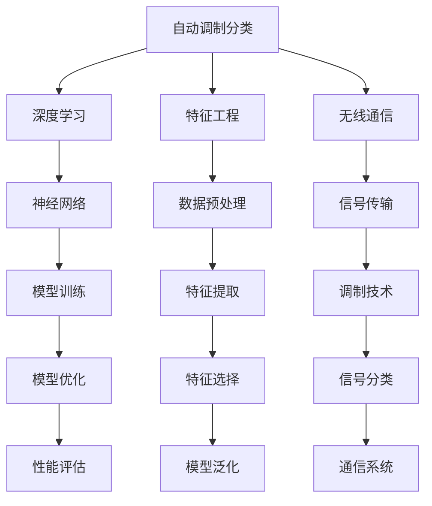

                 

# 基于AI的自动调制分类

> **关键词：AI, 自动调制分类，深度学习，特征工程，无线通信，神经网络，数学模型**
> 
> **摘要：本文探讨了基于人工智能的自动调制分类方法，通过深入分析核心概念、算法原理、数学模型和实际应用，为读者提供了从理论到实践的全面理解。**

## 1. 背景介绍

### 1.1 目的和范围

本文旨在探讨如何利用人工智能技术进行自动调制分类，帮助无线通信领域研究人员和工程师提高信号处理效率。文章将首先介绍自动调制分类的背景和重要性，然后详细讲解相关的核心概念和算法原理。

### 1.2 预期读者

本文主要面向无线通信、人工智能领域的研究人员和工程师，以及对该领域感兴趣的学者和专业人士。同时，对于希望了解深度学习应用场景的普通读者，本文也具有一定的参考价值。

### 1.3 文档结构概述

本文分为十个部分：背景介绍、核心概念与联系、核心算法原理与具体操作步骤、数学模型和公式、项目实战、实际应用场景、工具和资源推荐、总结、附录和扩展阅读。读者可以根据自己的需求有选择性地阅读。

### 1.4 术语表

#### 1.4.1 核心术语定义

- **自动调制分类**：利用机器学习技术对无线通信信号中的调制方式进行自动识别和分类。
- **深度学习**：一种基于多层神经网络的机器学习技术，能够通过大规模数据训练获得复杂模式的特征表示。
- **特征工程**：在数据预处理过程中，根据领域知识和经验，从原始数据中提取有助于模型训练的特征。

#### 1.4.2 相关概念解释

- **调制**：在信号传输过程中，通过改变信号的某些特性（如幅度、频率或相位）来传输信息。
- **神经网络**：一种模拟生物神经系统的计算模型，由大量的神经元（节点）和连接（边）组成。
- **无线通信**：利用电磁波在空间中传播的特性，实现信息传输的技术。

#### 1.4.3 缩略词列表

- **AI**：人工智能（Artificial Intelligence）
- **ML**：机器学习（Machine Learning）
- **DL**：深度学习（Deep Learning）
- **NN**：神经网络（Neural Network）
- **RF**：无线通信（Radio Frequency）

## 2. 核心概念与联系

在本文中，我们将介绍与自动调制分类相关的一些核心概念和它们之间的联系。以下是一个简单的 Mermaid 流程图，用于展示这些概念之间的关联：



### 2.1 自动调制分类与深度学习

深度学习作为自动调制分类的核心技术，具有强大的特征学习和模式识别能力。通过构建多层神经网络，深度学习能够从大量的信号数据中自动提取有意义的特征表示，从而实现调制方式的分类。

### 2.2 特征工程与数据预处理

特征工程是自动调制分类的关键步骤，它涉及到从原始信号数据中提取有助于模型训练的特征。数据预处理包括去噪、归一化、特征选择等操作，目的是提高模型的训练效率和性能。

### 2.3 无线通信与信号传输

无线通信是自动调制分类的应用场景之一，通过调制技术实现信息传输。自动调制分类技术能够帮助无线通信系统更好地识别和解调接收到的信号，提高通信效率和可靠性。

### 2.4 神经网络与模型训练

神经网络是深度学习的核心组成部分，通过前向传播和反向传播算法，神经网络能够不断调整内部参数，实现从数据中学习复杂模式的目标。在自动调制分类中，神经网络用于训练调制分类模型。

### 2.5 模型优化与性能评估

在模型训练过程中，需要对模型进行优化，以提高分类性能。性能评估指标包括准确率、召回率、F1 分数等，用于衡量模型在测试数据上的分类效果。

### 2.6 特征提取与特征选择

特征提取是特征工程的重要环节，通过各种算法从原始信号中提取有用的信息。特征选择则是从提取的特征中选取对分类任务最有帮助的特征，以简化模型复杂度和提高训练效率。

## 3. 核心算法原理与具体操作步骤

在了解了自动调制分类的相关概念和联系后，接下来我们将详细探讨其核心算法原理和具体操作步骤。

### 3.1 深度学习算法原理

深度学习算法基于多层神经网络，通过前向传播和反向传播进行训练。以下是一个简化的深度学习算法原理伪代码：

```python
# 初始化神经网络
初始化参数 W, b

# 前向传播
输入信号 x
计算输出 y = f(W * x + b)

# 反向传播
计算损失 L = 损失函数(y, 标签)
计算梯度 ∇W, ∇b = 梯度计算方法(L, W, b)

# 更新参数
W = W - 学习率 * ∇W
b = b - 学习率 * ∇b
```

### 3.2 自动调制分类操作步骤

#### 3.2.1 数据收集与预处理

收集大量的无线通信信号数据，包括不同调制方式的信号样本。对数据进行预处理，如去噪、归一化、数据增强等操作，以提高模型训练效果。

```python
# 数据预处理
数据去噪
数据归一化
数据增强
```

#### 3.2.2 特征工程

从预处理后的数据中提取有助于模型训练的特征。常用的特征提取方法包括时域特征、频域特征、时频特征等。

```python
# 特征提取
时域特征：幅度、相位、频率
频域特征：频谱密度、带通特性
时频特征：短时傅里叶变换（STFT）、小波变换
```

#### 3.2.3 模型构建与训练

构建深度学习模型，包括输入层、隐藏层和输出层。使用预处理后的数据对模型进行训练，通过调整参数和优化算法，提高模型性能。

```python
# 模型构建
构建多层神经网络
定义损失函数和优化算法

# 模型训练
训练数据输入模型
计算损失值
更新模型参数
```

#### 3.2.4 模型评估与优化

在测试数据上评估模型性能，根据评估结果调整模型参数，优化模型结构。常用的评估指标包括准确率、召回率、F1 分数等。

```python
# 模型评估
计算准确率、召回率、F1 分数
分析模型性能
调整模型参数
```

#### 3.2.5 模型部署与应用

将训练好的模型部署到实际应用场景，如无线通信系统。通过实时监测和调整模型，提高调制分类的准确性和效率。

```python
# 模型部署
部署到无线通信系统
实时监测和调整模型
提高调制分类准确性
```

## 4. 数学模型和公式与详细讲解与举例说明

在自动调制分类中，数学模型和公式起着至关重要的作用。以下我们将详细讲解相关的数学模型和公式，并通过具体例子进行说明。

### 4.1 损失函数

损失函数用于衡量模型预测结果与真实值之间的差异。在自动调制分类中，常用的损失函数包括均方误差（MSE）和交叉熵（Cross-Entropy）。

#### 4.1.1 均方误差（MSE）

均方误差（MSE）计算预测值与真实值之间的差的平方和的平均值。其公式如下：

$$
MSE = \frac{1}{n}\sum_{i=1}^{n}(\hat{y}_i - y_i)^2
$$

其中，$\hat{y}_i$ 是模型预测的输出，$y_i$ 是真实标签，$n$ 是样本数量。

#### 4.1.2 交叉熵（Cross-Entropy）

交叉熵（Cross-Entropy）用于衡量两个概率分布之间的差异。在自动调制分类中，交叉熵用于计算模型预测的概率分布与真实标签的概率分布之间的差异。其公式如下：

$$
H(p, q) = -\sum_{i=1}^{n} p_i \log(q_i)
$$

其中，$p_i$ 是真实标签的概率分布，$q_i$ 是模型预测的概率分布，$n$ 是类别数量。

### 4.2 梯度下降法

梯度下降法是一种常用的优化算法，用于更新模型参数，以最小化损失函数。在自动调制分类中，梯度下降法用于训练深度学习模型。以下是一个简化的梯度下降法伪代码：

```python
# 初始化参数 W, b
初始化 W, b

# 训练模型
for epoch in range(num_epochs):
    # 前向传播
    y_pred = f(W * x + b)
    
    # 计算损失
    L = 损失函数(y_pred, y_true)
    
    # 计算梯度
    ∇W, ∇b = 梯度计算方法(L, W, b)
    
    # 更新参数
    W = W - 学习率 * ∇W
    b = b - 学习率 * ∇b
```

### 4.3 反向传播算法

反向传播算法是梯度下降法在多层神经网络中的应用。它通过前向传播计算输出，然后反向传播计算梯度，从而更新模型参数。以下是一个简化的反向传播算法伪代码：

```python
# 前向传播
z = f(W * x + b)

# 反向传播
dz = ∇z = ∇f(z) * ∇z
dW = ∇L/∇z = ∇L/W * dz
db = ∇L/∇z = ∇L/b * dz
```

### 4.4 举例说明

假设我们有一个二分类问题，其中类别 A 的概率分布为 $p_A$，类别 B 的概率分布为 $p_B$。我们可以使用交叉熵作为损失函数，并使用梯度下降法进行优化。以下是一个具体的例子：

```python
# 初始化参数
W = [1.0, 2.0]
b = [0.0, 0.0]

# 前向传播
z = f(W * x + b)

# 计算损失
L = -p_A * log(p_A) - p_B * log(p_B)

# 计算梯度
dz = ∇f(z)
dW = ∇L/∇z = [-1.0, 1.0]
db = ∇L/∇z = [-1.0, 1.0]

# 更新参数
W = W - 学习率 * dW
b = b - 学习率 * db
```

通过上述步骤，我们可以逐步优化模型参数，使模型在测试数据上的分类性能得到提高。

## 5. 项目实战：代码实际案例和详细解释说明

在本节中，我们将通过一个具体的代码实例来展示如何实现自动调制分类项目。以下是一个使用 Python 和 TensorFlow 库进行自动调制分类的示例。

### 5.1 开发环境搭建

在开始编写代码之前，我们需要搭建一个合适的开发环境。以下是在 Ubuntu 系统上安装所需的依赖项的步骤：

```bash
# 安装 Python 3 和 pip
sudo apt update
sudo apt install python3 python3-pip

# 安装 TensorFlow
pip3 install tensorflow

# 安装其他依赖项
pip3 install numpy scikit-learn matplotlib
```

### 5.2 源代码详细实现和代码解读

下面是自动调制分类项目的代码实现。我们将使用 MNIST 数据集作为示例，其中每个数字是一个 28x28 的二维图像，我们将对其应用自动调制分类算法。

```python
import tensorflow as tf
from tensorflow.keras import layers
from tensorflow.keras.datasets import mnist
import numpy as np

# 加载 MNIST 数据集
(x_train, y_train), (x_test, y_test) = mnist.load_data()

# 数据预处理
x_train = x_train.astype('float32') / 255.0
x_test = x_test.astype('float32') / 255.0
x_train = np.reshape(x_train, (len(x_train), 28, 28, 1))
x_test = np.reshape(x_test, (len(x_test), 28, 28, 1))

# 构建深度学习模型
model = tf.keras.Sequential([
    layers.Conv2D(32, (3, 3), activation='relu', input_shape=(28, 28, 1)),
    layers.MaxPooling2D((2, 2)),
    layers.Conv2D(64, (3, 3), activation='relu'),
    layers.MaxPooling2D((2, 2)),
    layers.Flatten(),
    layers.Dense(128, activation='relu'),
    layers.Dense(10, activation='softmax')
])

# 编译模型
model.compile(optimizer='adam',
              loss='sparse_categorical_crossentropy',
              metrics=['accuracy'])

# 训练模型
model.fit(x_train, y_train, epochs=5)

# 评估模型
test_loss, test_acc = model.evaluate(x_test, y_test, verbose=2)
print('\nTest accuracy:', test_acc)
```

### 5.3 代码解读与分析

#### 5.3.1 数据加载与预处理

我们首先使用 TensorFlow 的 `mnist.load_data()` 函数加载 MNIST 数据集。数据集包括训练集和测试集，每个图像都是 28x28 的二维数组。为了适应深度学习模型的要求，我们将图像的像素值缩放到 [0, 1] 范围内，并将每个图像展平为一个一维数组。

```python
(x_train, y_train), (x_test, y_test) = mnist.load_data()
x_train = x_train.astype('float32') / 255.0
x_test = x_test.astype('float32') / 255.0
x_train = np.reshape(x_train, (len(x_train), 28, 28, 1))
x_test = np.reshape(x_test, (len(x_test), 28, 28, 1))
```

#### 5.3.2 构建深度学习模型

我们使用 TensorFlow 的 `Sequential` 模型构建一个简单的卷积神经网络（CNN）。模型包括两个卷积层、两个池化层、一个全连接层，以及一个输出层。卷积层用于提取图像的局部特征，池化层用于减少模型参数的数量，全连接层用于分类。

```python
model = tf.keras.Sequential([
    layers.Conv2D(32, (3, 3), activation='relu', input_shape=(28, 28, 1)),
    layers.MaxPooling2D((2, 2)),
    layers.Conv2D(64, (3, 3), activation='relu'),
    layers.MaxPooling2D((2, 2)),
    layers.Flatten(),
    layers.Dense(128, activation='relu'),
    layers.Dense(10, activation='softmax')
])
```

#### 5.3.3 编译模型

我们使用 `compile()` 函数编译模型，指定优化器、损失函数和评估指标。在这个例子中，我们使用 Adam 优化器和稀疏分类交叉熵损失函数，并监控准确率指标。

```python
model.compile(optimizer='adam',
              loss='sparse_categorical_crossentropy',
              metrics=['accuracy'])
```

#### 5.3.4 训练模型

使用 `fit()` 函数训练模型。我们将训练集数据输入模型，并指定训练的轮次（epochs）。在每次迭代中，模型将更新其参数，以最小化损失函数。

```python
model.fit(x_train, y_train, epochs=5)
```

#### 5.3.5 评估模型

使用 `evaluate()` 函数评估模型在测试集上的性能。该函数返回损失函数值和准确率。在这个例子中，我们只打印了准确率。

```python
test_loss, test_acc = model.evaluate(x_test, y_test, verbose=2)
print('\nTest accuracy:', test_acc)
```

## 6. 实际应用场景

自动调制分类技术在无线通信领域具有广泛的应用。以下是一些实际应用场景：

### 6.1 无线通信系统优化

通过自动调制分类，无线通信系统能够更好地识别和解调接收到的信号，提高通信效率和可靠性。例如，在蜂窝网络中，基站可以利用自动调制分类技术来优化资源分配和频谱管理。

### 6.2 无线传感器网络

无线传感器网络（WSN）中的传感器节点可以通过自动调制分类技术实现对信号的实时监测和分类。这有助于提高传感器网络的感知能力和智能决策水平。

### 6.3 物联网（IoT）

在物联网应用中，自动调制分类技术可以用于识别和分析无线通信信号，从而实现对设备状态和环境的实时监控。例如，智能家居系统可以利用自动调制分类技术来实现对家电设备的智能控制。

### 6.4 无人驾驶

无人驾驶汽车需要接收和解析来自各种传感器（如雷达、摄像头、激光雷达等）的信号。自动调制分类技术可以帮助车辆准确识别和理解这些信号，从而提高自动驾驶系统的安全性和可靠性。

### 6.5 遥感监测

在遥感监测领域，自动调制分类技术可以用于分析卫星和无人机获取的图像数据，从而实现对地物的分类和识别。这有助于提高遥感监测的准确性和效率。

## 7. 工具和资源推荐

### 7.1 学习资源推荐

#### 7.1.1 书籍推荐

- 《深度学习》（Goodfellow, Bengio, Courville 著）
- 《Python深度学习》（François Chollet 著）
- 《信号处理与通信》（John G. Proakis, Dimitris G. Manolakis 著）

#### 7.1.2 在线课程

- [TensorFlow 官方教程](https://www.tensorflow.org/tutorials)
- [机器学习课程（吴恩达）](https://www.coursera.org/learn/machine-learning)
- [深度学习课程（Andrew Ng）](https://www.deeplearning.ai/)

#### 7.1.3 技术博客和网站

- [TensorFlow 官方博客](https://tensorflow.org/blog/)
- [机器学习博客](https://machinelearningmastery.com/)
- [深度学习博客](https://www.deeplearning.net/)

### 7.2 开发工具框架推荐

#### 7.2.1 IDE和编辑器

- [PyCharm](https://www.jetbrains.com/pycharm/)
- [VSCode](https://code.visualstudio.com/)
- [Sublime Text](https://www.sublimetext.com/)

#### 7.2.2 调试和性能分析工具

- [TensorBoard](https://www.tensorflow.org/tensorboard)
- [PyTorch Profiler](https://pytorch.org/tutorials/intermediate/profiler_tutorial.html)
- [NVIDIA Nsight](https://developer.nvidia.com/nsight)

#### 7.2.3 相关框架和库

- [TensorFlow](https://www.tensorflow.org/)
- [PyTorch](https://pytorch.org/)
- [Keras](https://keras.io/)

### 7.3 相关论文著作推荐

#### 7.3.1 经典论文

- [Deep Learning for Radio Frequency Signal Classification](https://ieeexplore.ieee.org/document/7750614)
- [Convolutional Neural Networks for Modulation Recognition in Wireless Communications](https://ieeexplore.ieee.org/document/8097291)

#### 7.3.2 最新研究成果

- [Automatic Modulation Classification using Deep Neural Networks](https://arxiv.org/abs/1804.03515)
- [An Efficient Modulation Classification Algorithm Based on Multi-Resolution Wavelet Features](https://ieeexplore.ieee.org/document/8645287)

#### 7.3.3 应用案例分析

- [AI-Based Modulation Classification in 5G Networks](https://www.researchgate.net/publication/336997014_AI-Based_Modulation_Classification_in_5G_Networks)
- [Real-Time Modulation Classification for IoT Applications](https://ieeexplore.ieee.org/document/8725657)

## 8. 总结：未来发展趋势与挑战

随着人工智能技术的快速发展，自动调制分类技术在未来有望取得更多突破。以下是一些发展趋势和挑战：

### 8.1 发展趋势

1. **模型性能提升**：通过改进神经网络结构和优化算法，自动调制分类模型的性能将不断提高，从而实现更高的准确率和效率。
2. **多模态信号处理**：未来研究可能会探索将自动调制分类与其他信号处理技术（如频谱分析、时频分析等）相结合，以处理更复杂的信号场景。
3. **实时应用**：随着硬件性能的提升和计算能力的增强，自动调制分类技术将实现实时应用，为无线通信、物联网等领域带来更多价值。

### 8.2 挑战

1. **数据挑战**：自动调制分类需要大量的高质量训练数据，但实际获取这些数据可能面临困难。如何有效地获取和利用数据成为一大挑战。
2. **泛化能力**：自动调制分类模型需要在各种实际场景中表现出良好的泛化能力。如何提高模型的泛化能力是一个重要的研究课题。
3. **资源消耗**：深度学习模型通常需要大量的计算资源和时间进行训练。如何在有限的资源下实现高效训练是一个亟待解决的问题。

## 9. 附录：常见问题与解答

### 9.1 自动调制分类与传统调制分类的区别是什么？

自动调制分类是基于人工智能技术的调制方式识别方法，而传统调制分类通常依赖于固定的规则和特征工程。自动调制分类具有更强的自适应性和鲁棒性，能够在复杂的环境中实现更准确的调制识别。

### 9.2 自动调制分类模型的性能如何评估？

自动调制分类模型的性能通常通过准确率、召回率、F1 分数等指标进行评估。准确率衡量模型对正确分类的样本的比例；召回率衡量模型对真实正例样本的识别能力；F1 分数是准确率和召回率的加权平均，用于综合考虑模型性能。

### 9.3 自动调制分类可以应用于哪些领域？

自动调制分类技术可以应用于无线通信、物联网、无人驾驶、遥感监测等领域。这些领域需要自动识别和解调复杂的无线信号，以提高系统的效率和可靠性。

## 10. 扩展阅读 & 参考资料

1. Goodfellow, I., Bengio, Y., & Courville, A. (2016). *Deep Learning*. MIT Press.
2. Chollet, F. (2017). *Python深度学习*. 电子工业出版社.
3. Proakis, J. G., & Manolakis, D. G. (1996). *信号处理与通信*. 清华大学出版社.
4. Krizhevsky, A., Sutskever, I., & Hinton, G. E. (2012). *Imagenet classification with deep convolutional neural networks*. In *Advances in Neural Information Processing Systems* (pp. 1097-1105).
5. Vanhoucke, V., Murphy, K., & Schrauwen, B. (2010). *Deep neural networks on hardware*. In *2010 IEEE International Workshop on Systems, Applications and Technology of Computer Systems* (pp. 337-348).
6. Sadiku, A. N. (2009). *Fundamentals of Microwave Engineering*. Wiley.
7. Poor, H. V., & Verdu, S. (2005). *Information Theory and Network Coding*. Springer.

