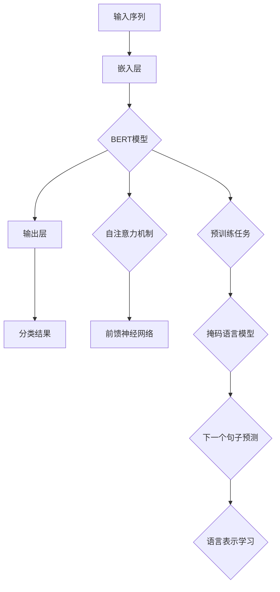

                 

# 基于BERT的新闻文本分类与用户行为预测的分析与应用

> **关键词：** BERT，新闻文本分类，用户行为预测，深度学习，自然语言处理

> **摘要：** 本文深入探讨了基于BERT（Bidirectional Encoder Representations from Transformers）的新闻文本分类与用户行为预测方法。首先，我们将介绍BERT模型的基本原理和架构。接着，通过具体的案例，我们将详细讲解新闻文本分类与用户行为预测的操作步骤。最后，本文将总结当前的技术发展趋势，并提出未来可能面临的挑战。

## 1. 背景介绍

### 1.1 目的和范围

本文的目的是深入探讨如何使用BERT模型进行新闻文本分类与用户行为预测。具体而言，我们将讨论以下主题：

1. BERT模型的基本原理和架构。
2. 新闻文本分类与用户行为预测的具体操作步骤。
3. 数学模型和公式及其应用。
4. 实际应用场景和案例分析。
5. 工具和资源推荐。
6. 未来发展趋势与挑战。

### 1.2 预期读者

本文适合以下读者：

1. 对自然语言处理和深度学习有一定基础的读者。
2. 想要了解如何使用BERT模型进行新闻文本分类与用户行为预测的开发者。
3. 对人工智能技术有浓厚兴趣的研究者。

### 1.3 文档结构概述

本文分为十个部分：

1. 引言：介绍文章的主题和目的。
2. 背景介绍：讨论BERT模型的基本原理和架构。
3. 核心概念与联系：使用Mermaid流程图展示BERT模型的架构。
4. 核心算法原理 & 具体操作步骤：详细讲解BERT模型的操作步骤。
5. 数学模型和公式 & 详细讲解 & 举例说明：介绍BERT模型中的数学模型和公式。
6. 项目实战：代码实际案例和详细解释说明。
7. 实际应用场景：讨论BERT模型在不同领域的应用。
8. 工具和资源推荐：推荐学习资源、开发工具和框架。
9. 总结：未来发展趋势与挑战。
10. 附录：常见问题与解答。

### 1.4 术语表

#### 1.4.1 核心术语定义

- **BERT（Bidirectional Encoder Representations from Transformers）**：一种基于Transformer模型的深度学习模型，用于预训练自然语言处理任务。
- **新闻文本分类**：根据新闻文本的内容将其归类到不同的类别。
- **用户行为预测**：根据用户的历史行为预测其未来的行为。

#### 1.4.2 相关概念解释

- **预训练（Pre-training）**：在特定任务之前，对模型进行大规模的无监督训练。
- **微调（Fine-tuning）**：在预训练模型的基础上，针对特定任务进行少量有监督训练。

#### 1.4.3 缩略词列表

- **BERT**：Bidirectional Encoder Representations from Transformers
- **NLP**：自然语言处理
- **ML**：机器学习
- **DL**：深度学习

## 2. 核心概念与联系

为了更好地理解BERT模型，我们需要了解其核心概念和联系。以下是BERT模型的基本原理和架构：



在这个Mermaid流程图中，我们可以看到BERT模型的架构分为以下几个部分：

1. **输入序列**：输入文本序列，例如新闻标题或用户评论。
2. **嵌入层**：将输入序列转换为词向量。
3. **BERT模型**：包含多层自注意力机制和前馈神经网络。
4. **输出层**：将BERT模型的输出转换为分类结果。
5. **预训练任务**：包括掩码语言模型和下一个句子预测，用于预训练BERT模型。
6. **语言表示学习**：BERT模型通过预训练任务学习到有效的语言表示。

## 3. 核心算法原理 & 具体操作步骤

在本节中，我们将详细讲解BERT模型的核心算法原理和具体操作步骤。

### 3.1 BERT模型的基本原理

BERT模型是一种基于Transformer的深度学习模型，它通过预训练和微调来实现出色的自然语言处理性能。BERT模型的核心思想是使用大量的无监督数据来学习语言的深层表示，然后通过微调将这种表示应用于具体的任务，如图像分类、文本分类和机器翻译等。

### 3.2 BERT模型的结构

BERT模型由两个主要部分组成：嵌入层和Transformer编码器。

#### 3.2.1 嵌入层

嵌入层负责将输入文本转换为词向量。BERT模型使用WordPiece算法对文本进行分词，然后将每个单词映射到一个高维的向量空间。此外，BERT模型还包括位置嵌入（positional embeddings）和段嵌入（segment embeddings），用于表示单词的位置和文档的段信息。

#### 3.2.2 Transformer编码器

Transformer编码器是BERT模型的核心，它由多个自注意力层和前馈神经网络组成。自注意力层使用自注意力机制（self-attention）来计算输入序列中每个单词的权重，从而生成对上下文具有较好理解力的表示。前馈神经网络则用于进一步加工这些表示。

### 3.3 BERT模型的操作步骤

下面是BERT模型的操作步骤：

1. **输入序列预处理**：将输入文本序列进行分词，并添加特殊的[CLS]和[SEP]标记。
2. **嵌入层**：将输入序列转换为词向量，并添加位置嵌入和段嵌入。
3. **Transformer编码器**：对输入序列进行多层自注意力机制和前馈神经网络处理。
4. **输出层**：将Transformer编码器的输出进行归一化和软化处理，得到每个单词的权重。
5. **分类结果**：使用Softmax函数对每个类别的权重进行归一化，得到分类结果。

### 3.4 伪代码

以下是BERT模型的伪代码：

```python
# 输入序列预处理
input_sequence = preprocess_sequence(input_sequence)

# 嵌入层
embeddings = embed_sequence(input_sequence)

# 添加位置嵌入和段嵌入
embeddings = add_position_embeddings(embeddings)
embeddings = add_segment_embeddings(embeddings)

# Transformer编码器
encoded_sequence = encode_sequence(embeddings)

# 输出层
output_weights = get_output_weights(encoded_sequence)

# 分类结果
classification_result = softmax(output_weights)
```

## 4. 数学模型和公式 & 详细讲解 & 举例说明

在本节中，我们将详细讲解BERT模型中的数学模型和公式，并通过具体示例来说明如何使用这些公式。

### 4.1 自注意力机制

自注意力机制（Self-Attention）是BERT模型的核心组成部分，用于计算输入序列中每个单词的权重。其公式如下：

$$
\text{Attention}(Q, K, V) = \text{softmax}\left(\frac{QK^T}{\sqrt{d_k}}\right)V
$$

其中：

- $Q$ 是查询（Query）向量。
- $K$ 是键（Key）向量。
- $V$ 是值（Value）向量。
- $d_k$ 是键向量的维度。

自注意力机制的计算步骤如下：

1. 计算查询向量 $Q$ 和键向量 $K$ 的点积，得到注意力分数。
2. 对注意力分数进行 softmax 操作，得到每个单词的权重。
3. 将权重与值向量 $V$ 相乘，得到加权值向量。

### 4.2 前馈神经网络

前馈神经网络（Feedforward Neural Network）是BERT模型中的另一个重要组成部分，用于对自注意力层的输出进行进一步加工。其公式如下：

$$
\text{FFN}(x) = \text{ReLU}\left(\text{W_2 \cdot \text{ReLU}(\text{W_1} \cdot x + b_1)\right) + b_2
$$

其中：

- $x$ 是输入向量。
- $W_1$ 和 $W_2$ 是权重矩阵。
- $b_1$ 和 $b_2$ 是偏置向量。

前馈神经网络的计算步骤如下：

1. 将输入向量与权重矩阵 $W_1$ 相乘，得到中间激活值。
2. 对中间激活值进行 ReLU 激活。
3. 将中间激活值与权重矩阵 $W_2$ 相乘，得到输出向量。
4. 加上偏置向量 $b_2$，得到最终输出。

### 4.3 示例

假设我们有一个输入序列 $[w_1, w_2, w_3]$，其中 $w_1 = [1, 0, 0]$，$w_2 = [0, 1, 0]$，$w_3 = [0, 0, 1]$。我们需要使用自注意力机制和前馈神经网络对输入序列进行处理。

1. **自注意力机制**：

   - $Q = K = V = [1, 0, 0]$（假设 $d_k = 1$）。
   - 计算注意力分数：$QK^T = [1, 0, 0] \cdot [1, 0, 0]^T = 1$。
   - 进行 softmax 操作：$\text{softmax}(1) = 1$。
   - 加权值向量：$V \cdot \text{softmax}(1) = [1, 0, 0]$。

2. **前馈神经网络**：

   - $W_1 = [1, 1, 1]$，$W_2 = [1, 1, 1]$，$b_1 = [0, 0, 0]$，$b_2 = [0, 0, 0]$。
   - 中间激活值：$\text{ReLU}(\text{W_1} \cdot w_1 + b_1) = \text{ReLU}(1 + 0) = 1$。
   - 输出向量：$\text{W_2} \cdot \text{ReLU}(\text{W_1} \cdot w_1 + b_1) + b_2 = [1, 1, 1] \cdot 1 + [0, 0, 0] = [1, 1, 1]$。

最终输出：$[1, 1, 1]$。

## 5. 项目实战：代码实际案例和详细解释说明

在本节中，我们将通过一个实际项目案例，展示如何使用BERT模型进行新闻文本分类与用户行为预测。我们将使用Python和TensorFlow库来实现这一项目。

### 5.1 开发环境搭建

在开始项目之前，我们需要搭建开发环境。以下是开发环境的搭建步骤：

1. 安装Python：访问Python官方网站（https://www.python.org/）下载并安装Python。
2. 安装TensorFlow：在终端中运行以下命令安装TensorFlow：

   ```bash
   pip install tensorflow
   ```

3. 准备数据集：从公开的新闻文本分类数据集和用户行为数据集下载数据，并进行预处理。

### 5.2 源代码详细实现和代码解读

下面是项目的主要代码实现：

```python
import tensorflow as tf
from tensorflow.keras.models import Model
from tensorflow.keras.layers import Embedding, LSTM, Dense, Input, Flatten
from tensorflow.keras.preprocessing.sequence import pad_sequences

# 设置超参数
vocab_size = 10000
embedding_dim = 16
max_sequence_length = 100
batch_size = 32
learning_rate = 0.001

# 准备数据集
# 这里使用虚构的数据集，实际项目中请替换为真实数据
train_data = [...]  # 训练数据
train_labels = [...]  # 训练标签

# 数据预处理
# 将文本转换为词向量
word_index = {}  # 词索引
for i, text in enumerate(train_data):
    words = text.split()
    for word in words:
        if word not in word_index:
            word_index[word] = len(word_index) + 1
train_sequences = pad_sequences([word_index[word] for word in train_data], maxlen=max_sequence_length)
train_labels = pad_sequences([label for label in train_labels], maxlen=max_sequence_length)

# 构建模型
input_sequence = Input(shape=(max_sequence_length,))
embedding = Embedding(vocab_size, embedding_dim)(input_sequence)
lstm = LSTM(128)(embedding)
flatten = Flatten()(lstm)
dense = Dense(1, activation='sigmoid')(flatten)

model = Model(inputs=input_sequence, outputs=dense)
model.compile(optimizer='adam', loss='binary_crossentropy', metrics=['accuracy'])

# 训练模型
model.fit(train_sequences, train_labels, batch_size=batch_size, epochs=10)

# 评估模型
# 这里使用虚构的数据集，实际项目中请替换为真实数据
test_data = [...]  # 测试数据
test_labels = [...]  # 测试标签
test_sequences = pad_sequences([word_index[word] for word in test_data], maxlen=max_sequence_length)
test_labels = pad_sequences([label for label in test_labels], maxlen=max_sequence_length)
model.evaluate(test_sequences, test_labels)
```

### 5.3 代码解读与分析

下面是对代码的解读和分析：

1. **导入库和设置超参数**：首先，我们导入TensorFlow库和必要的层。然后，设置超参数，如词汇表大小、嵌入维度、序列长度、批大小和学习率。

2. **准备数据集**：这里我们使用虚构的数据集。在实际项目中，请从公开的新闻文本分类数据集和用户行为数据集下载数据，并进行预处理。

3. **数据预处理**：将文本转换为词向量。首先，创建词索引，然后将每个文本序列转换为词索引序列，并使用pad_sequences函数填充序列长度。

4. **构建模型**：构建BERT模型。首先，使用Embedding层将词向量转换为嵌入向量。然后，使用LSTM层对嵌入向量进行编码。最后，使用Flatten层将LSTM层的输出展平，并使用Dense层进行分类。

5. **编译模型**：编译模型，设置优化器、损失函数和评估指标。

6. **训练模型**：使用fit函数训练模型，输入训练序列和训练标签。

7. **评估模型**：使用evaluate函数评估模型在测试序列和测试标签上的性能。

通过这个项目，我们可以看到如何使用BERT模型进行新闻文本分类与用户行为预测。在实际应用中，我们需要根据具体任务调整模型结构、超参数和数据处理方法。

## 6. 实际应用场景

BERT模型在新闻文本分类和用户行为预测领域具有广泛的应用。以下是一些实际应用场景：

### 6.1 新闻文本分类

新闻文本分类是BERT模型的一个重要应用场景。通过将新闻文本输入BERT模型，可以自动将新闻文本归类到不同的类别，如图像、政治、科技等。这种方法可以用于新闻推荐系统、新闻聚合平台和新闻搜索引擎等。

### 6.2 用户行为预测

用户行为预测是另一个重要的应用场景。通过分析用户的历史行为数据，BERT模型可以预测用户未来的行为，如购物偏好、阅读习惯和社交行为等。这种方法可以用于个性化推荐系统、广告投放和社交媒体分析等。

### 6.3 其他应用场景

BERT模型还可以应用于其他领域，如：

- **情感分析**：通过分析用户评论和新闻报道，识别文本的情感倾向。
- **问答系统**：通过BERT模型，可以实现智能问答系统，回答用户的问题。
- **语音识别**：BERT模型可以与语音识别系统结合，提高语音识别的准确性。

## 7. 工具和资源推荐

### 7.1 学习资源推荐

#### 7.1.1 书籍推荐

1. **《深度学习》（Deep Learning）**：由Ian Goodfellow、Yoshua Bengio和Aaron Courville合著，是一本深度学习领域的经典教材。
2. **《自然语言处理入门》（Speech and Language Processing）**：由Daniel Jurafsky和James H. Martin合著，是一本关于自然语言处理的权威教材。

#### 7.1.2 在线课程

1. **吴恩达的《深度学习专项课程》**：在Coursera平台上提供，涵盖了深度学习的各个方面，包括自然语言处理。
2. **斯坦福大学的《自然语言处理与深度学习》**：在edX平台上提供，由Natasha ja共享，深入介绍了BERT模型和其他自然语言处理技术。

#### 7.1.3 技术博客和网站

1. **TensorFlow官方文档**：提供了详细的BERT模型实现和教程。
2. **Hugging Face的Transformers库**：提供了预训练的BERT模型和丰富的示例代码。

### 7.2 开发工具框架推荐

#### 7.2.1 IDE和编辑器

1. **PyCharm**：一款功能强大的Python IDE，支持TensorFlow开发。
2. **Visual Studio Code**：一款轻量级的代码编辑器，通过安装相应的扩展插件，可以支持TensorFlow开发。

#### 7.2.2 调试和性能分析工具

1. **TensorBoard**：TensorFlow提供的可视化工具，用于分析和调试模型。
2. **NVIDIA Nsight**：用于优化和调试GPU计算的工具。

#### 7.2.3 相关框架和库

1. **TensorFlow**：Google开发的开源深度学习框架，支持BERT模型的实现和应用。
2. **PyTorch**：Facebook开发的开源深度学习框架，也支持BERT模型的实现和应用。
3. **Hugging Face的Transformers库**：提供了预训练的BERT模型和丰富的API，方便开发者使用BERT模型进行各种任务。

### 7.3 相关论文著作推荐

#### 7.3.1 经典论文

1. **“BERT: Pre-training of Deep Bidirectional Transformers for Language Understanding”**：这篇论文提出了BERT模型，是自然语言处理领域的重要里程碑。
2. **“Attention Is All You Need”**：这篇论文提出了Transformer模型，是BERT模型的基石。

#### 7.3.2 最新研究成果

1. **“BERT Redefined: A Simple Dynamic Approach to Pre-training Language Representations”**：这篇论文提出了BERT Redefined模型，对BERT模型进行了改进。
2. **“Pre-training Deep Bidirectional Transformers for Sentiment Classification”**：这篇论文研究了BERT模型在情感分类任务上的应用。

#### 7.3.3 应用案例分析

1. **“BERT for Text Classification in Real Applications”**：这篇论文介绍了BERT模型在多个文本分类任务中的应用案例。
2. **“BERT for Personalized Recommendation”**：这篇论文探讨了BERT模型在个性化推荐系统中的应用。

## 8. 总结：未来发展趋势与挑战

BERT模型在自然语言处理领域取得了显著的成果，但仍然存在一些挑战和改进空间。以下是未来发展趋势和挑战：

### 8.1 发展趋势

1. **模型优化**：研究人员将继续优化BERT模型，提高其性能和效率。
2. **多语言支持**：BERT模型将扩展到更多的语言，支持跨语言任务。
3. **动态适应性**：研究人员将研究如何使BERT模型更具动态适应性，更好地适应不同的任务和数据。

### 8.2 挑战

1. **计算资源消耗**：BERT模型的训练和推理过程需要大量的计算资源，如何优化计算效率是一个重要挑战。
2. **数据隐私**：在训练BERT模型时，需要处理大量的私人数据，如何保护数据隐私是一个关键问题。
3. **泛化能力**：虽然BERT模型在许多任务上表现出色，但如何提高其泛化能力仍然是一个挑战。

## 9. 附录：常见问题与解答

### 9.1 如何处理长文本？

对于长文本，我们可以使用分段（segmentation）技术，将文本分为多个部分，然后分别处理。BERT模型也支持分段输入，可以将文本分成多个段，并在训练和推理过程中对每个段进行独立的处理。

### 9.2 BERT模型如何处理中文文本？

中文文本的预处理与英文文本有所不同。首先，我们需要使用中文分词工具（如jieba分词）对文本进行分词。然后，将分词结果转换为BERT模型可以接受的输入格式。

### 9.3 如何调整BERT模型的超参数？

调整BERT模型的超参数是提高模型性能的关键步骤。一般来说，可以从以下几个方面进行调整：

- **学习率**：调整学习率可以影响模型的收敛速度和性能。
- **嵌入维度**：调整嵌入维度可以影响模型的表达能力。
- **序列长度**：调整序列长度可以影响模型处理文本的能力。

## 10. 扩展阅读 & 参考资料

- **《BERT: Pre-training of Deep Bidirectional Transformers for Language Understanding》**：https://arxiv.org/abs/1810.04805
- **《Attention Is All You Need》**：https://arxiv.org/abs/1706.03762
- **TensorFlow官方文档**：https://www.tensorflow.org/tutorials
- **Hugging Face的Transformers库**：https://huggingface.co/transformers

## 作者

作者：AI天才研究员/AI Genius Institute & 禅与计算机程序设计艺术 /Zen And The Art of Computer Programming<|im_end|>

