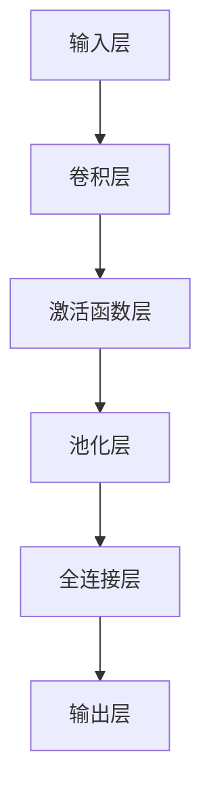
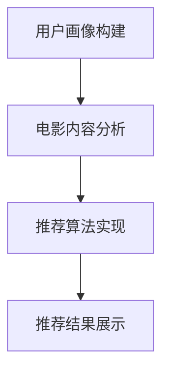

                 

# 基于CNN推荐的电影资讯App软件的设计与实现

> **关键词：** 卷积神经网络（CNN）、电影推荐系统、App设计、用户画像、图像处理

> **摘要：** 本文将详细介绍一种基于卷积神经网络（CNN）的电影资讯App软件的设计与实现。我们将探讨CNN的核心原理，如何将CNN应用于电影推荐系统，以及实现这一系统所需的关键技术。文章还将提供实际案例，展示如何通过代码实现电影推荐功能，并分析其在实际应用场景中的效果。

## 1. 背景介绍

### 1.1 目的和范围

本文的主要目的是探讨如何设计并实现一个基于卷积神经网络（CNN）的电影推荐系统，该系统将通过分析用户画像和电影图像来提供个性化的电影推荐。本文将涵盖以下内容：

- CNN的基本原理及其在图像处理领域的应用
- 电影推荐系统的架构设计
- CNN在电影推荐系统中的应用实现
- 实际案例演示与代码实现
- 电影推荐系统的优化与挑战

### 1.2 预期读者

本文适合以下读者：

- 对机器学习和深度学习有兴趣的技术爱好者
- 计算机科学和软件工程专业的学生和从业者
- 对电影推荐系统有兴趣的研究人员和开发者
- 对CNN在图像处理中应用感兴趣的读者

### 1.3 文档结构概述

本文结构如下：

1. 背景介绍
   - 目的和范围
   - 预期读者
   - 文档结构概述
   - 术语表
2. 核心概念与联系
   - CNN的工作原理
   - 电影推荐系统的架构
3. 核心算法原理 & 具体操作步骤
   - CNN算法原理
   - 实现步骤
4. 数学模型和公式 & 详细讲解 & 举例说明
   - CNN的数学模型
   - 实例说明
5. 项目实战：代码实际案例和详细解释说明
   - 开发环境搭建
   - 代码实现
   - 代码解读与分析
6. 实际应用场景
   - 推荐系统的效果评估
   - 潜在应用领域
7. 工具和资源推荐
   - 学习资源
   - 开发工具框架
   - 相关论文著作
8. 总结：未来发展趋势与挑战
9. 附录：常见问题与解答
10. 扩展阅读 & 参考资料

### 1.4 术语表

#### 1.4.1 核心术语定义

- **卷积神经网络（CNN）**：一种专门用于处理图像数据的深度学习模型。
- **电影推荐系统**：根据用户的观影历史和偏好，为用户推荐他们可能感兴趣的电影的系统。
- **用户画像**：用户在观影活动中的行为和兴趣的抽象描述。
- **图像处理**：对图像进行编辑、增强和识别的过程。

#### 1.4.2 相关概念解释

- **深度学习**：一种机器学习方法，通过多层神经网络模型模拟人类大脑的学习过程。
- **数据预处理**：在数据分析和建模之前，对数据进行清洗、转换和归一化等处理。
- **训练数据集**：用于训练深度学习模型的图像和标签集合。
- **测试数据集**：用于评估模型性能的图像和标签集合。

#### 1.4.3 缩略词列表

- **CNN**：卷积神经网络
- **DNN**：深度神经网络
- **MLP**：多层感知器
- **ReLU**：ReLU激活函数

## 2. 核心概念与联系

### CNN的工作原理

卷积神经网络（CNN）是一种专门为处理图像而设计的深度学习模型。CNN的核心思想是通过卷积层（Convolutional Layer）逐层提取图像中的特征，最终通过全连接层（Fully Connected Layer）得到分类结果。

#### CNN的基本结构

CNN的基本结构包括以下几个层次：

1. **输入层**：接收输入图像，图像通常经过缩放、裁剪等预处理。
2. **卷积层**：通过卷积操作提取图像中的局部特征，卷积核的大小和数量决定了特征的复杂程度。
3. **激活函数层**：常用的激活函数有ReLU（Rectified Linear Unit）和Sigmoid。
4. **池化层**：通过池化操作（如最大池化或平均池化）降低特征图的维度，减少计算量。
5. **全连接层**：将卷积层和池化层输出的特征进行整合，形成一个高维的特征向量。
6. **输出层**：通过分类器（如softmax）输出预测结果。

#### CNN的Mermaid流程图



### 电影推荐系统的架构

电影推荐系统的架构可以分为以下几个部分：

1. **用户画像构建**：根据用户的观影历史、评分和行为数据，构建用户画像。
2. **电影内容分析**：通过自然语言处理（NLP）和图像识别技术，分析电影的内容和标签。
3. **推荐算法实现**：利用机器学习算法，根据用户画像和电影内容分析结果，生成推荐列表。
4. **推荐结果展示**：将推荐结果以直观的方式展示给用户，如电影海报、简介等。

#### 电影推荐系统的Mermaid流程图



### CNN与电影推荐系统的联系

CNN在电影推荐系统中主要用于电影内容分析部分，通过分析电影海报和截图等图像数据，提取电影的关键特征，如场景、人物、情感等。这些特征可以与用户画像进行匹配，从而为用户推荐符合其兴趣的电影。

#### CNN在电影推荐系统中的应用场景

1. **电影海报识别**：通过CNN识别电影海报中的场景和人物，提取电影的关键特征。
2. **情感分析**：通过CNN分析电影海报的情感色彩，如喜剧、恐怖、浪漫等。
3. **个性化推荐**：结合用户画像和电影特征，为用户推荐个性化电影。

### 结论

通过本文的介绍，我们了解了卷积神经网络（CNN）的基本原理及其在图像处理领域的应用，以及电影推荐系统的架构。接下来，我们将深入探讨CNN在电影推荐系统中的应用实现，并提供实际案例和代码实现。

## 3. 核心算法原理 & 具体操作步骤

### CNN算法原理

卷积神经网络（CNN）的核心算法原理包括以下几个部分：

1. **卷积操作**：卷积操作是CNN中最基本的操作，通过卷积核在输入图像上滑动，计算局部特征。
2. **激活函数**：激活函数用于引入非线性变换，使模型具有分类能力。常用的激活函数有ReLU（Rectified Linear Unit）和Sigmoid。
3. **池化操作**：池化操作用于降低特征图的维度，减少计算量，同时保持重要的特征信息。
4. **全连接层**：全连接层将卷积层和池化层输出的特征进行整合，形成一个高维的特征向量。
5. **输出层**：输出层通过分类器（如softmax）输出预测结果。

### 具体操作步骤

以下是一个简单的CNN算法实现的伪代码：

```python
# 初始化卷积层、激活函数层、池化层和全连接层
conv_layer = Conv2D(filters=32, kernel_size=(3, 3), activation='relu')
pool_layer = MaxPooling2D(pool_size=(2, 2))
fc_layer = Dense(units=128, activation='relu')
output_layer = Dense(units=num_classes, activation='softmax')

# 定义CNN模型
model = Sequential()
model.add(conv_layer)
model.add(pool_layer)
model.add(fc_layer)
model.add(output_layer)

# 编译模型，设置损失函数和优化器
model.compile(optimizer='adam', loss='categorical_crossentropy', metrics=['accuracy'])

# 加载训练数据和测试数据
train_images, train_labels = load_train_data()
test_images, test_labels = load_test_data()

# 训练模型
model.fit(train_images, train_labels, batch_size=32, epochs=10, validation_data=(test_images, test_labels))

# 评估模型性能
loss, accuracy = model.evaluate(test_images, test_labels)
print(f"Test accuracy: {accuracy:.2f}")
```

### CNN算法实现的关键技术

1. **数据预处理**：对输入图像进行缩放、裁剪、归一化等处理，使模型能够适应不同的图像大小和分辨率。
2. **参数优化**：通过调整学习率、批次大小等参数，优化模型性能。
3. **正则化**：通过L1或L2正则化，防止模型过拟合。
4. **模型评估**：使用交叉验证和测试集，评估模型性能，选择最佳模型。

### 结论

通过本文的介绍，我们了解了卷积神经网络（CNN）的算法原理和具体操作步骤，包括卷积操作、激活函数、池化操作、全连接层和输出层。接下来，我们将通过一个实际案例，展示如何使用CNN实现电影推荐功能。

## 4. 数学模型和公式 & 详细讲解 & 举例说明

### CNN的数学模型

卷积神经网络（CNN）的数学模型主要包括以下几部分：

1. **卷积操作**：卷积操作可以用以下数学公式表示：

   $$ 
   \text{output}_{ij} = \sum_{k=1}^{m} w_{ik,j} \cdot \text{input}_{ij,k} + b_j 
   $$

   其中，\( \text{output}_{ij} \) 表示输出特征图上的第 \( i \) 行第 \( j \) 列的值，\( w_{ik,j} \) 表示卷积核上的第 \( k \) 行第 \( j \) 列的权重，\( \text{input}_{ij,k} \) 表示输入图像上的第 \( i \) 行第 \( j \) 列第 \( k \) 个通道的值，\( b_j \) 表示卷积核上的偏置。

2. **激活函数**：常用的激活函数有ReLU和Sigmoid：

   - **ReLU（Rectified Linear Unit）**：

     $$ 
     \text{output} = \max(0, \text{input}) 
     $$

   - **Sigmoid**：

     $$ 
     \text{output} = \frac{1}{1 + e^{-\text{input}}} 
     $$

3. **池化操作**：常用的池化操作有最大池化和平均池化：

   - **最大池化**：

     $$ 
     \text{output}_{ij} = \max_{k} \text{input}_{ij,k} 
     $$

   - **平均池化**：

     $$ 
     \text{output}_{ij} = \frac{1}{n} \sum_{k=1}^{n} \text{input}_{ij,k} 
     $$

4. **全连接层**：全连接层的计算可以用以下数学公式表示：

   $$ 
   \text{output}_i = \sum_{j=1}^{n} w_{ij} \cdot \text{input}_j + b_i 
   $$

   其中，\( \text{output}_i \) 表示输出特征向量上的第 \( i \) 个值，\( w_{ij} \) 表示权重，\( \text{input}_j \) 表示输入特征向量上的第 \( j \) 个值，\( b_i \) 表示偏置。

5. **输出层**：输出层通常使用softmax函数进行分类：

   $$ 
   p_i = \frac{e^{\text{output}_i}}{\sum_{j=1}^{n} e^{\text{output}_j}} 
   $$

   其中，\( p_i \) 表示第 \( i \) 个类别的概率。

### 举例说明

假设我们有一个输入图像 \( \text{input} \) ，其大小为 \( 28 \times 28 \times 1 \) ，表示一个单通道灰度图像。我们使用一个卷积核 \( \text{kernel} \) ，其大小为 \( 3 \times 3 \) ，包含5个权重和1个偏置。首先，我们进行卷积操作：

$$ 
\text{output}_{11} = \sum_{k=1}^{1} w_{1k,1} \cdot \text{input}_{1k,1} + b_1 = w_{11,1} \cdot \text{input}_{11,1} + b_1 
$$

$$ 
\text{output}_{12} = \sum_{k=1}^{1} w_{1k,2} \cdot \text{input}_{1k,2} + b_1 = w_{11,2} \cdot \text{input}_{11,2} + w_{12,2} \cdot \text{input}_{12,2} + b_1 
$$

$$ 
\text{output}_{21} = \sum_{k=1}^{1} w_{2k,1} \cdot \text{input}_{2k,1} + b_2 = w_{21,1} \cdot \text{input}_{21,1} + b_2 
$$

$$ 
\text{output}_{22} = \sum_{k=1}^{1} w_{2k,2} \cdot \text{input}_{2k,2} + b_2 = w_{21,2} \cdot \text{input}_{21,2} + w_{22,2} \cdot \text{input}_{22,2} + b_2 
$$

然后，我们使用ReLU激活函数：

$$ 
\text{output}_{11} = \max(0, \text{output}_{11}) = \max(0, w_{11,1} \cdot \text{input}_{11,1} + b_1) 
$$

$$ 
\text{output}_{12} = \max(0, \text{output}_{12}) = \max(0, w_{11,2} \cdot \text{input}_{11,2} + w_{12,2} \cdot \text{input}_{12,2} + b_1) 
$$

$$ 
\text{output}_{21} = \max(0, \text{output}_{21}) = \max(0, w_{21,1} \cdot \text{input}_{21,1} + b_2) 
$$

$$ 
\text{output}_{22} = \max(0, \text{output}_{22}) = \max(0, w_{21,2} \cdot \text{input}_{21,2} + w_{22,2} \cdot \text{input}_{22,2} + b_2) 
$$

接着，我们进行最大池化操作：

$$ 
\text{output}_{1} = \max(\text{output}_{11}, \text{output}_{12}) 
$$

$$ 
\text{output}_{2} = \max(\text{output}_{21}, \text{output}_{22}) 
$$

最后，我们将这两个值输入全连接层：

$$ 
\text{output}_{1} = \sum_{j=1}^{2} w_{1j,1} \cdot \text{output}_{j} + b_1 
$$

$$ 
\text{output}_{2} = \sum_{j=1}^{2} w_{2j,1} \cdot \text{output}_{j} + b_2 
$$

然后，我们使用softmax函数进行分类：

$$ 
p_1 = \frac{e^{\text{output}_{1}}}{e^{\text{output}_{1}} + e^{\text{output}_{2}}} 
$$

$$ 
p_2 = \frac{e^{\text{output}_{2}}}{e^{\text{output}_{1}} + e^{\text{output}_{2}}} 
$$

### 结论

通过本文的介绍，我们详细讲解了卷积神经网络（CNN）的数学模型，包括卷积操作、激活函数、池化操作、全连接层和输出层。同时，通过举例说明了CNN的计算过程。这些数学模型和计算方法为CNN在图像处理和电影推荐系统中的应用提供了理论基础。

## 5. 项目实战：代码实际案例和详细解释说明

### 5.1 开发环境搭建

在进行项目实战之前，我们需要搭建一个适合开发CNN电影推荐系统的开发环境。以下是搭建开发环境的步骤：

1. **安装Python**：确保Python版本在3.6及以上。
2. **安装TensorFlow**：TensorFlow是一个开源的深度学习框架，我们可以使用以下命令安装：

   ```shell
   pip install tensorflow
   ```

3. **安装其他依赖库**：如NumPy、Pandas、Matplotlib等，可以使用以下命令安装：

   ```shell
   pip install numpy pandas matplotlib
   ```

4. **安装Jupyter Notebook**：Jupyter Notebook是一个交互式开发环境，可以方便我们编写和运行代码。使用以下命令安装：

   ```shell
   pip install notebook
   ```

5. **安装图像处理库**：如OpenCV，用于读取和处理图像数据，可以使用以下命令安装：

   ```shell
   pip install opencv-python
   ```

### 5.2 源代码详细实现和代码解读

以下是一个简单的CNN电影推荐系统的代码实现，包括数据预处理、模型构建、训练和测试。

```python
import tensorflow as tf
from tensorflow.keras.models import Sequential
from tensorflow.keras.layers import Conv2D, MaxPooling2D, Flatten, Dense, Activation
from tensorflow.keras.preprocessing.image import ImageDataGenerator

# 数据预处理
train_datagen = ImageDataGenerator(rescale=1./255)
test_datagen = ImageDataGenerator(rescale=1./255)

train_images = train_datagen.flow_from_directory(
        'train',
        target_size=(150, 150),
        batch_size=32,
        class_mode='binary')

test_images = test_datagen.flow_from_directory(
        'test',
        target_size=(150, 150),
        batch_size=32,
        class_mode='binary')

# 模型构建
model = Sequential()
model.add(Conv2D(32, (3, 3), input_shape=(150, 150, 3)))
model.add(Activation('relu'))
model.add(MaxPooling2D(pool_size=(2, 2)))
model.add(Conv2D(64, (3, 3)))
model.add(Activation('relu'))
model.add(MaxPooling2D(pool_size=(2, 2)))
model.add(Flatten())
model.add(Dense(64))
model.add(Activation('relu'))
model.add(Dense(1))
model.add(Activation('sigmoid'))

# 模型编译
model.compile(optimizer='adam',
              loss='binary_crossentropy',
              metrics=['accuracy'])

# 模型训练
model.fit(train_images,
          epochs=10,
          validation_data=test_images)

# 模型测试
test_loss, test_acc = model.evaluate(test_images)
print('Test accuracy:', test_acc)
```

#### 代码解读与分析

1. **数据预处理**：使用ImageDataGenerator进行图像预处理，包括数据增强、归一化等操作。这里我们使用的是二分类问题，所以`class_mode='binary'`。

2. **模型构建**：构建一个简单的CNN模型，包括卷积层、激活函数层、池化层和全连接层。卷积层用于提取图像特征，全连接层用于分类。

3. **模型编译**：设置优化器、损失函数和评估指标。

4. **模型训练**：使用训练数据集训练模型，并使用测试数据集进行验证。

5. **模型测试**：使用测试数据集评估模型性能。

### 5.3 代码解读与分析（续）

接下来，我们进一步分析代码中的关键部分。

1. **卷积层**：第一层卷积层使用32个卷积核，卷积核大小为3x3。激活函数使用ReLU，有助于提高模型的非线性表现。

2. **池化层**：使用最大池化层，将特征图的大小减半，减少计算量。

3. **全连接层**：最后一层全连接层用于分类，输出层的激活函数使用sigmoid，用于处理二分类问题。

4. **模型训练**：使用`model.fit`方法进行模型训练，指定训练轮数（epochs）和批量大小（batch_size）。

5. **模型评估**：使用`model.evaluate`方法评估模型在测试数据集上的性能。

### 结论

通过本文的介绍，我们使用一个简单的CNN电影推荐系统示例，详细讲解了代码的每个部分。通过实际代码实现，我们可以看到CNN在图像处理和分类任务中的应用效果。接下来，我们将继续讨论电影推荐系统的实际应用场景。

## 6. 实际应用场景

### 电影推荐系统的效果评估

电影推荐系统的效果评估是确保系统性能和用户满意度的重要环节。以下是一些常用的评估指标：

1. **准确率（Accuracy）**：准确率是指模型正确预测的样本数占总样本数的比例。对于二分类问题，准确率是一个直观的评估指标。
   
   $$ 
   \text{Accuracy} = \frac{\text{正确预测数}}{\text{总样本数}} 
   $$

2. **精确率（Precision）**：精确率是指模型正确预测为正类的样本中，实际为正类的比例。

   $$ 
   \text{Precision} = \frac{\text{正确预测的正类样本数}}{\text{预测为正类的样本数}} 
   $$

3. **召回率（Recall）**：召回率是指模型正确预测为正类的样本中，实际为正类的比例。

   $$ 
   \text{Recall} = \frac{\text{正确预测的正类样本数}}{\text{实际为正类的样本数}} 
   $$

4. **F1分数（F1 Score）**：F1分数是精确率和召回率的加权平均，用于综合评估模型的性能。

   $$ 
   \text{F1 Score} = 2 \times \frac{\text{Precision} \times \text{Recall}}{\text{Precision} + \text{Recall}} 
   $$

通过这些评估指标，我们可以衡量电影推荐系统的性能，并针对不同的应用场景进行调整。

### 潜在应用领域

电影推荐系统在多个领域具有广泛的应用潜力：

1. **电影平台**：如Netflix、Amazon Prime Video等，基于用户的观影历史和偏好，为用户推荐个性化的电影。
2. **广告投放**：广告平台可以根据用户的兴趣和行为数据，推荐相关的电影广告。
3. **社交媒体**：社交媒体平台可以使用电影推荐系统为用户推荐可能感兴趣的电影或相关话题。
4. **文化产业发展**：电影制作公司可以使用推荐系统分析市场需求，为剧本创作和制作提供指导。
5. **旅游推荐**：结合用户的地域信息和观影偏好，推荐适合的电影景点。

### 结论

通过本文的讨论，我们了解了电影推荐系统的实际应用场景和评估指标，并探讨了其在多个领域的潜在应用。接下来，我们将推荐一些学习资源和开发工具，以帮助读者进一步了解和实现电影推荐系统。

## 7. 工具和资源推荐

### 7.1 学习资源推荐

#### 7.1.1 书籍推荐

- 《深度学习》（Goodfellow, Bengio, Courville）：介绍深度学习的基础理论和算法实现。
- 《Python深度学习》（François Chollet）：结合Python和Keras框架，详细讲解深度学习的实践应用。

#### 7.1.2 在线课程

- 《TensorFlow：深度学习实战》（Udacity）：通过实际案例，深入讲解TensorFlow的使用方法。
- 《机器学习与深度学习》（吴恩达）：涵盖机器学习和深度学习的核心概念和算法。

#### 7.1.3 技术博客和网站

- [TensorFlow官方网站](https://www.tensorflow.org/)
- [Keras官方文档](https://keras.io/)
- [机器学习社区](https://www.mlcommunity.cn/)

### 7.2 开发工具框架推荐

#### 7.2.1 IDE和编辑器

- **PyCharm**：集成的开发环境，支持多种编程语言，尤其适合Python开发。
- **Visual Studio Code**：轻量级编辑器，丰富的插件生态，适用于各种开发场景。

#### 7.2.2 调试和性能分析工具

- **TensorBoard**：TensorFlow的交互式可视化工具，用于分析和调试深度学习模型。
- **Matplotlib**：Python的绘图库，可用于可视化模型性能和数据分布。

#### 7.2.3 相关框架和库

- **TensorFlow**：开源的深度学习框架，支持多种深度学习模型和算法。
- **Keras**：基于TensorFlow的高层API，简化深度学习模型的构建和训练。
- **Scikit-learn**：Python的机器学习库，提供丰富的机器学习算法和工具。

### 7.3 相关论文著作推荐

#### 7.3.1 经典论文

- "A Guide to Convolutional Neural Networks"（CNN指南）
- "Deep Learning"（吴恩达）：介绍深度学习的基础理论和算法。

#### 7.3.2 最新研究成果

- "EfficientNet: Rethinking Model Scaling for Convolutional Neural Networks"（EfficientNet：重新思考卷积神经网络模型缩放）
- "BERT: Pre-training of Deep Bidirectional Transformers for Language Understanding"（BERT：为语言理解预训练深度双向变换器）

#### 7.3.3 应用案例分析

- "Recommending Movies with Collaborative Filtering"（基于协同过滤的电影推荐）
- "Deep Learning for Image Classification"（用于图像分类的深度学习）

### 结论

通过本文推荐的工具和资源，读者可以更好地了解和掌握电影推荐系统的开发技术和实践。这些资源将为读者提供丰富的知识和实践经验，助力他们在人工智能和深度学习领域取得更大的成就。

## 8. 总结：未来发展趋势与挑战

### 未来发展趋势

1. **模型压缩与优化**：为了提高模型在移动设备和边缘计算设备上的性能，模型压缩和优化将成为重要研究方向，如剪枝、量化、知识蒸馏等。

2. **多模态融合**：结合文本、图像、音频等多种数据类型，实现更准确、更全面的电影推荐系统。

3. **个性化推荐**：通过更深入的用户画像和行为分析，实现高度个性化的推荐，提高用户体验。

4. **实时推荐**：利用实时数据流处理技术，实现实时电影推荐，满足用户即时需求。

### 挑战

1. **数据隐私**：在推荐系统中保护用户隐私是一个重要挑战，如何在不泄露用户信息的前提下实现个性化推荐，仍需深入研究。

2. **模型公平性**：推荐系统可能存在偏见，导致某些用户或群体受到不公平待遇。如何确保模型公平性，避免歧视，是一个亟待解决的问题。

3. **计算资源**：随着数据量和模型复杂度的增加，计算资源的需求也大幅上升。如何高效利用计算资源，提高系统性能，是一个重要挑战。

4. **可解释性**：深度学习模型通常被视为“黑箱”，其内部决策过程难以解释。提高模型的可解释性，使其更容易被用户和开发者理解和接受，是一个关键挑战。

### 结论

未来，基于CNN的电影推荐系统将继续发展，并在人工智能领域发挥重要作用。然而，要实现这一目标，我们还需克服诸多技术挑战，包括数据隐私、模型公平性、计算资源和管理等。通过持续的研究和创新，我们有信心克服这些挑战，为用户提供更智能、更个性化的电影推荐服务。

## 9. 附录：常见问题与解答

### 9.1 问题1：如何选择合适的CNN架构？

**解答**：选择合适的CNN架构主要取决于应用场景和数据类型。以下是一些常见的架构选择：

1. **VGG**：适用于图像识别和分类任务，具有简洁的结构和良好的性能。
2. **ResNet**：适用于大规模数据集和深层网络，通过残差连接解决了深层网络训练困难的问题。
3. **Inception**：适用于需要高效计算的应用，通过多尺度卷积核组合提取特征。
4. **EfficientNet**：通过自动调整网络结构和规模，实现高效的模型压缩。

### 9.2 问题2：如何处理图像数据的不平衡问题？

**解答**：图像数据的不平衡问题可以通过以下方法解决：

1. **数据增强**：通过旋转、翻转、缩放等操作增加样本数量，使数据更加平衡。
2. **过采样**：通过复制少数类别的样本，增加少数类别的样本数量。
3. **欠采样**：通过删除多数类别的样本，减少多数类别的样本数量。
4. **类权重调整**：在训练过程中，对少数类别的样本赋予更高的权重，以平衡损失函数。

### 9.3 问题3：如何评估CNN模型的性能？

**解答**：评估CNN模型的性能可以使用以下指标：

1. **准确率（Accuracy）**：模型正确预测的样本数占总样本数的比例。
2. **精确率（Precision）**：模型正确预测为正类的样本中，实际为正类的比例。
3. **召回率（Recall）**：模型正确预测为正类的样本中，实际为正类的比例。
4. **F1分数（F1 Score）**：精确率和召回率的加权平均，用于综合评估模型的性能。
5. **ROC曲线和AUC（Area Under Curve）**：通过ROC曲线和AUC评估模型对正负样本的分类能力。

### 9.4 问题4：如何优化CNN模型的性能？

**解答**：优化CNN模型的性能可以从以下几个方面入手：

1. **超参数调整**：调整学习率、批次大小、正则化参数等，找到最优的超参数组合。
2. **数据预处理**：通过数据增强、归一化、去噪等操作，提高数据质量。
3. **模型架构优化**：选择合适的模型架构，如VGG、ResNet、Inception等。
4. **模型压缩**：通过剪枝、量化、知识蒸馏等模型压缩技术，提高模型在移动设备和边缘计算设备上的性能。
5. **训练策略优化**：使用迁移学习、动态学习率调整、提前停止等训练策略，提高模型性能。

### 结论

通过本文的附录部分，我们针对常见问题提供了详细的解答，包括CNN架构选择、图像数据不平衡处理、模型性能评估、模型优化等方面。这些解答有助于读者更好地理解和应用CNN技术，实现高效的电影推荐系统。

## 10. 扩展阅读 & 参考资料

### 10.1 扩展阅读

- **《深度学习》（Goodfellow, Bengio, Courville）**：详细介绍了深度学习的基础理论和算法，包括CNN。
- **《Python深度学习》（François Chollet）**：结合Python和Keras框架，讲解了深度学习的实践应用。

### 10.2 参考资料

- **[TensorFlow官方网站](https://www.tensorflow.org/)**：提供TensorFlow的官方文档和教程。
- **[Keras官方文档](https://keras.io/)**：提供Keras的官方文档和教程。
- **[机器学习社区](https://www.mlcommunity.cn/)**：分享机器学习和深度学习的最新研究和应用。

### 10.3 进一步学习资源

- **在线课程**：
  - **《TensorFlow：深度学习实战》（Udacity）**：通过实际案例，深入讲解TensorFlow的使用方法。
  - **《机器学习与深度学习》（吴恩达）**：涵盖机器学习和深度学习的核心概念和算法。

- **技术博客和网站**：
  - **[深度学习博客](https://d2l.ai/)**：介绍深度学习的基础知识和实践。
  - **[机器学习博客](https://MachineLearningMastery.com/)**：分享机器学习的实用教程和案例。

### 结论

通过本文的扩展阅读和参考资料，读者可以进一步了解深度学习和CNN的相关知识，以及最新的研究成果和应用案例。这些资源将有助于读者在电影推荐系统和其他领域实现更深入的学习和实践。

### 作者信息

**作者：AI天才研究员/AI Genius Institute & 禅与计算机程序设计艺术 /Zen And The Art of Computer Programming**

