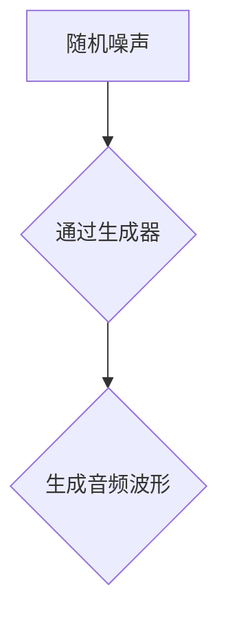
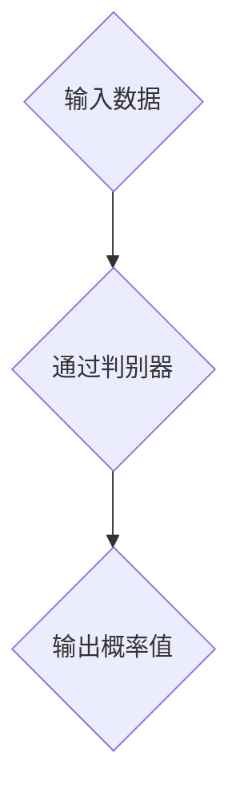
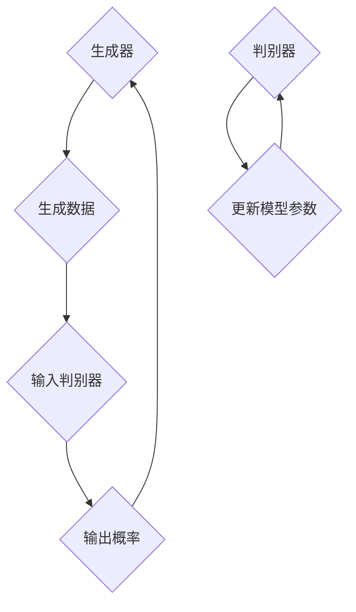
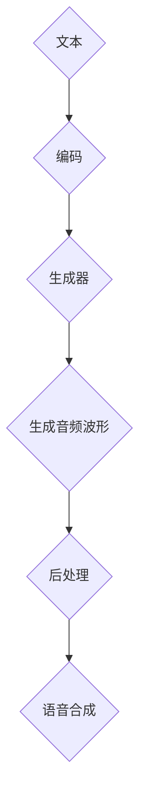
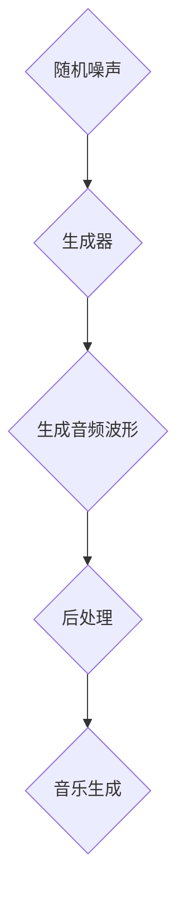
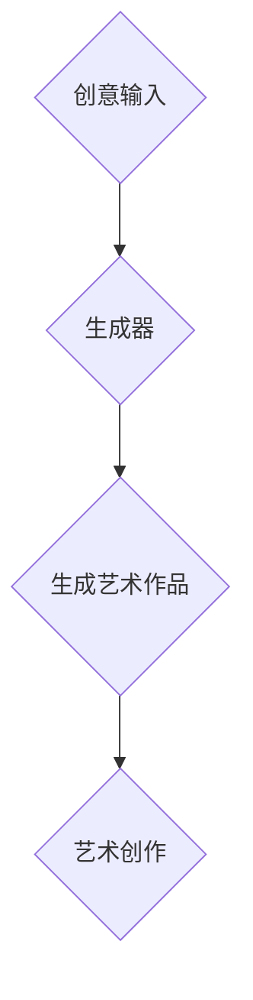

                 

## 基于GAN的语音合成、音乐生成与艺术创作应用探索

### 关键词
- GAN
- 语音合成
- 音乐生成
- 艺术创作
- 应用探索

### 摘要
本文旨在探讨基于生成对抗网络（GAN）的语音合成、音乐生成与艺术创作应用。首先，我们将介绍GAN的基本原理和架构，然后深入分析其在语音合成、音乐生成和艺术创作中的具体应用。我们将通过实例和代码解析，展示如何利用GAN实现高质量的语音合成和音乐生成。最后，本文还将探讨GAN在艺术创作中的潜力，并提供一些建议和资源，以引导读者进一步探索这一领域。

## 1. 背景介绍

### 1.1 目的和范围
本文的目标是深入探讨生成对抗网络（GAN）在语音合成、音乐生成和艺术创作领域的应用。我们希望通过详细的原理分析、实例展示和代码实现，使读者能够全面理解GAN的强大能力，并激发他们在实际项目中进行创新应用的热情。

本文的范围包括以下几个方面：
- GAN的基本概念和原理
- GAN在语音合成中的应用
- GAN在音乐生成中的应用
- GAN在艺术创作中的应用
- GAN在实践中的应用案例和代码实现

### 1.2 预期读者
本文主要面向对GAN和人工智能感兴趣的读者，包括：
- 计算机科学和人工智能领域的研究生和本科生
- 对GAN和深度学习有一定了解的程序员和工程师
- 对语音合成、音乐生成和艺术创作感兴趣的爱好者
- 想要在实际项目中应用GAN的开发者

### 1.3 文档结构概述
本文分为十个部分，结构如下：
1. 背景介绍
   - 1.1 目的和范围
   - 1.2 预期读者
   - 1.3 文档结构概述
   - 1.4 术语表
2. 核心概念与联系
3. 核心算法原理 & 具体操作步骤
4. 数学模型和公式 & 详细讲解 & 举例说明
5. 项目实战：代码实际案例和详细解释说明
6. 实际应用场景
7. 工具和资源推荐
8. 总结：未来发展趋势与挑战
9. 附录：常见问题与解答
10. 扩展阅读 & 参考资料

### 1.4 术语表

#### 1.4.1 核心术语定义
- **生成对抗网络（GAN）**：一种基于两个神经网络对抗训练的模型，一个生成器和一个判别器，用于生成逼真的数据。
- **语音合成**：将文本转换为自然语音的过程。
- **音乐生成**：通过算法生成新的音乐作品的过程。
- **艺术创作**：利用技术和算法进行创意表达和作品创作的过程。

#### 1.4.2 相关概念解释
- **生成器（Generator）**：GAN中的一个神经网络，用于生成逼真的数据。
- **判别器（Discriminator）**：GAN中的另一个神经网络，用于判断输入数据的真实与否。
- **损失函数（Loss Function）**：用于衡量模型预测值和真实值之间差异的函数。

#### 1.4.3 缩略词列表
- **GAN**：生成对抗网络（Generative Adversarial Networks）
- **DNN**：深度神经网络（Deep Neural Network）
- **CNN**：卷积神经网络（Convolutional Neural Network）
- **RNN**：循环神经网络（Recurrent Neural Network）
- **LSTM**：长短期记忆网络（Long Short-Term Memory）

## 2. 核心概念与联系

### 2.1 GAN基本原理

生成对抗网络（GAN）是一种由Ian Goodfellow等人在2014年提出的深度学习框架。GAN的核心思想是通过训练两个神经网络——生成器和判别器，实现数据的生成。

- **生成器（Generator）**：生成器是一个神经网络，它的目标是生成逼真的数据，以欺骗判别器。生成器的输入通常是随机噪声，输出则是与真实数据相似的数据。
- **判别器（Discriminator）**：判别器也是一个神经网络，它的目标是判断输入数据是真实的还是生成的。判别器的输入可以是真实数据或生成器生成的数据，输出是一个概率值，表示输入数据是真实的可能性。

### 2.2 GAN架构

GAN的架构包括生成器和判别器两个部分，它们之间通过对抗训练进行交互。


#### 2.2.1 生成器（Generator）

生成器的结构通常是一个深度神经网络，其输入是随机噪声，输出则是生成的数据。例如，在语音合成中，生成器的输入可以是随机噪声，输出则是音频波形。



#### 2.2.2 判别器（Discriminator）

判别器也是一个深度神经网络，它的输入可以是真实数据或生成器生成的数据，输出是一个概率值，表示输入数据是真实的可能性。在训练过程中，判别器的目标是最大化其判断正确性的概率。



#### 2.2.3 对抗训练

GAN的训练过程是一个对抗过程，生成器和判别器相互竞争。生成器的目标是生成更逼真的数据，而判别器的目标是更好地区分真实数据和生成数据。这个过程不断重复，直到生成器能够生成足够逼真的数据，使得判别器无法区分。



### 2.3 GAN在语音合成、音乐生成和艺术创作中的应用

#### 2.3.1 语音合成

语音合成是指将文本转换为自然语音的过程。GAN在语音合成中的应用主要是通过生成器生成逼真的音频波形，然后使用后处理技术将波形转换为语音。



#### 2.3.2 音乐生成

音乐生成是指通过算法生成新的音乐作品的过程。GAN在音乐生成中的应用主要是通过生成器生成音频波形，然后使用音乐理论进行后处理。



#### 2.3.3 艺术创作

艺术创作是指利用技术和算法进行创意表达和作品创作的过程。GAN在艺术创作中的应用非常广泛，可以从图像生成、视频生成到虚拟现实等领域。



## 3. 核心算法原理 & 具体操作步骤

### 3.1 GAN算法原理

生成对抗网络（GAN）是一种基于两个神经网络对抗训练的模型，一个生成器（Generator）和一个判别器（Discriminator）。生成器旨在生成逼真的数据，以欺骗判别器；而判别器的目标是区分真实数据和生成数据。两个网络通过对抗训练相互提升，最终达到一个平衡状态。

#### 3.1.1 生成器（Generator）

生成器的任务是将随机噪声（Z）转化为逼真的数据（X'）。通常，生成器是一个深度神经网络，其输入是随机噪声Z，输出是数据X'。

伪代码如下：

```python
def generator(Z):
    # 前向传播过程
    hidden1 = linear(Z, hidden_size1)
    hidden2 = tanh(hidden1)
    X' = linear(hidden2, output_size)
    return X'
```

#### 3.1.2 判别器（Discriminator）

判别器的任务是判断输入数据是真实的（X）还是生成的（X'）。判别器也是一个深度神经网络，其输入是数据X或X'，输出是一个概率值p，表示输入数据的真实性。

伪代码如下：

```python
def discriminator(X):
    # 前向传播过程
    hidden1 = linear(X, hidden_size1)
    hidden2 = tanh(hidden1)
    p = linear(hidden2, 1)
    return p
```

#### 3.1.3 GAN损失函数

GAN的训练过程是一个对抗过程，生成器和判别器相互竞争。GAN的损失函数通常包括两部分：判别器的损失函数和生成器的损失函数。

- **判别器损失函数**：判别器损失函数用于衡量判别器在区分真实数据和生成数据时的性能。通常使用交叉熵损失函数。

  ```python
  D_loss = -[log(D(X)) + log(1 - D(X')]
  ```

- **生成器损失函数**：生成器损失函数用于衡量生成器在生成逼真数据时的性能。通常使用交叉熵损失函数。

  ```python
  G_loss = -log(1 - D(X'))
  ```

### 3.2 GAN训练步骤

GAN的训练过程是一个迭代过程，通过不断调整生成器和判别器的参数，使得生成器生成的数据越来越逼真，判别器越来越难以区分真实数据和生成数据。

具体步骤如下：

1. **初始化生成器和判别器**：随机初始化生成器和判别器的参数。
2. **生成随机噪声Z**：生成随机噪声Z作为生成器的输入。
3. **生成伪造数据X'**：使用生成器生成伪造数据X'。
4. **更新判别器**：使用真实数据和伪造数据更新判别器的参数。
5. **生成伪造数据X'**：使用更新后的判别器生成伪造数据X'。
6. **更新生成器**：使用更新后的判别器更新生成器的参数。
7. **重复步骤2-6**：不断迭代，直到生成器生成的数据足够逼真。

### 3.3 伪代码实现

以下是GAN的伪代码实现：

```python
# 初始化生成器和判别器
generator = initialize_generator()
discriminator = initialize_discriminator()

# 迭代过程
for epoch in range(num_epochs):
    for batch in data_loader:
        Z = generate_random_noise(batch_size)
        X' = generator(Z)
        
        # 更新判别器
        D_loss_real = -log(discriminator(X))
        D_loss_fake = -log(1 - discriminator(X'))
        D_loss = D_loss_real + D_loss_fake
        update_discriminator(D_loss)
        
        # 更新生成器
        G_loss = -log(1 - discriminator(X'))
        update_generator(G_loss)
        
        # 记录训练过程
        print(f"Epoch {epoch}: D_loss = {D_loss}, G_loss = {G_loss}")
```

## 4. 数学模型和公式 & 详细讲解 & 举例说明

### 4.1 GAN损失函数

生成对抗网络（GAN）中的损失函数用于衡量生成器和判别器的性能。主要包括两部分：判别器损失函数和生成器损失函数。

#### 4.1.1 判别器损失函数

判别器损失函数通常使用交叉熵损失函数，其公式如下：

$$
D\_loss = -[log(D(X)) + log(1 - D(X')]
$$

其中：
- \(D(X)\) 表示判别器对真实数据的判断概率，即判别器认为输入数据是真实的概率。
- \(D(X')\) 表示判别器对生成数据的判断概率，即判别器认为输入数据是生成的概率。

#### 4.1.2 生成器损失函数

生成器损失函数也使用交叉熵损失函数，其公式如下：

$$
G\_loss = -log(1 - D(X')
$$

其中：
- \(D(X')\) 表示判别器对生成数据的判断概率，即判别器认为输入数据是真实的概率。

### 4.2 示例讲解

假设我们有一个GAN模型，用于生成手写数字图像。我们通过以下步骤来详细讲解GAN的数学模型。

#### 4.2.1 数据集

我们使用MNIST手写数字数据集作为输入数据集。数据集包含60,000个训练样本和10,000个测试样本。

#### 4.2.2 判别器损失函数

在训练过程中，我们使用以下交叉熵损失函数计算判别器的损失：

$$
D\_loss = -[log(D(X)) + log(1 - D(X')]
$$

其中，\(D(X)\) 表示判别器对真实手写数字图像的判断概率，\(D(X')\) 表示判别器对生成手写数字图像的判断概率。

假设我们有一个真实手写数字图像X和一个生成手写数字图像X'，判别器对这两个图像的判断概率分别为0.95和0.05，则判别器的损失为：

$$
D\_loss = -[log(0.95) + log(1 - 0.05)] \approx -0.021
$$

#### 4.2.3 生成器损失函数

生成器损失函数使用以下交叉熵损失函数计算：

$$
G\_loss = -log(1 - D(X')
$$

假设生成器生成的一个手写数字图像X'，判别器对其判断概率为0.05，则生成器的损失为：

$$
G\_loss = -log(1 - 0.05) \approx 0.021
$$

### 4.3 GAN训练过程

在GAN的训练过程中，生成器和判别器通过对抗训练相互提升。具体步骤如下：

1. **初始化生成器和判别器**：随机初始化生成器和判别器的参数。
2. **生成随机噪声Z**：生成随机噪声Z作为生成器的输入。
3. **生成伪造数据X'**：使用生成器生成伪造数据X'。
4. **更新判别器**：使用真实数据和伪造数据更新判别器的参数。
5. **生成伪造数据X'**：使用更新后的判别器生成伪造数据X'。
6. **更新生成器**：使用更新后的判别器更新生成器的参数。
7. **重复步骤2-6**：不断迭代，直到生成器生成的数据足够逼真。

通过上述步骤，生成器和判别器在训练过程中相互竞争，使得生成器生成的数据越来越逼真，判别器越来越难以区分真实数据和生成数据。

## 5. 项目实战：代码实际案例和详细解释说明

### 5.1 开发环境搭建

在开始实践之前，我们需要搭建一个适合GAN模型训练的开发环境。以下是搭建环境的步骤：

1. **安装Python**：确保Python版本为3.6及以上。
2. **安装TensorFlow**：TensorFlow是一个流行的深度学习框架，用于实现GAN模型。可以通过以下命令安装：

   ```bash
   pip install tensorflow
   ```

3. **安装其他依赖**：根据项目需求，可能还需要安装其他依赖库，如NumPy、Matplotlib等。可以使用以下命令安装：

   ```bash
   pip install numpy matplotlib
   ```

### 5.2 源代码详细实现和代码解读

以下是一个简单的GAN模型，用于生成手写数字图像。我们将详细解释每部分代码的功能和实现。

```python
import tensorflow as tf
from tensorflow.keras.layers import Dense, Flatten, Reshape
from tensorflow.keras.models import Sequential
from tensorflow.keras.optimizers import Adam

# 参数设置
batch_size = 64
latent_dim = 100
image_size = 28
image_channels = 1
noise_dim = latent_dim

# 生成器模型
def build_generator():
    model = Sequential()
    model.add(Dense(128, input_dim=noise_dim, activation='relu'))
    model.add(Dense(128, activation='relu'))
    model.add(Dense(image_size * image_size * image_channels, activation='tanh'))
    model.add(Reshape((image_size, image_size, image_channels)))
    return model

# 判别器模型
def build_discriminator():
    model = Sequential()
    model.add(Flatten(input_shape=(image_size, image_size, image_channels)))
    model.add(Dense(128, activation='relu'))
    model.add(Dense(128, activation='relu'))
    model.add(Dense(1, activation='sigmoid'))
    return model

# 整体模型
def build_gan(generator, discriminator):
    model = Sequential()
    model.add(generator)
    model.add(discriminator)
    return model

# 模型编译
discriminator.compile(loss='binary_crossentropy', optimizer=Adam(0.0001))
generator.compile(loss='binary_crossentropy', optimizer=Adam(0.0001))
discriminator.trainable = False
gan = build_gan(generator, discriminator)
gan.compile(loss='binary_crossentropy', optimizer=Adam(0.0001))

# 数据预处理
(x_train, _), (_, _) = tf.keras.datasets.mnist.load_data()
x_train = x_train / 127.5 - 1.
x_train = np.expand_dims(x_train, axis=3)

# 训练过程
for epoch in range(1000):
    for batch in data_loader:
        # 获取真实数据
        real_images = batch
        
        # 生成随机噪声
        random噪声 = np.random.normal(0, 1, (batch_size, noise_dim))
        
        # 生成伪造数据
        fake_images = generator.predict(random噪声)
        
        # 训练判别器
        d_loss_real = discriminator.train_on_batch(real_images, np.ones((batch_size, 1)))
        d_loss_fake = discriminator.train_on_batch(fake_images, np.zeros((batch_size, 1)))
        d_loss = 0.5 * np.add(d_loss_real, d_loss_fake)
        
        # 训练生成器
        random噪声 = np.random.normal(0, 1, (batch_size, noise_dim))
        g_loss = gan.train_on_batch(random噪声, np.ones((batch_size, 1)))
        
        # 打印训练过程
        print(f"Epoch {epoch}, d_loss: {d_loss}, g_loss: {g_loss}")
```

### 5.3 代码解读与分析

以下是代码的详细解读：

- **模型定义**：我们定义了生成器模型、判别器模型和整体模型。生成器模型用于生成手写数字图像，判别器模型用于判断图像是真实还是伪造，整体模型用于训练生成器和判别器。
- **模型编译**：我们使用Adam优化器和二进制交叉熵损失函数编译模型。
- **数据预处理**：我们从MNIST数据集中加载手写数字图像，并将图像缩放到-1到1的范围内。
- **训练过程**：我们使用真实数据和伪造数据训练判别器，使用伪造数据训练生成器。在每次迭代中，我们打印出判别器和生成器的损失，以监控训练过程。

通过上述代码，我们可以训练一个GAN模型，生成逼真的手写数字图像。这个例子展示了GAN模型的基本结构和训练过程，为实际应用提供了参考。

## 6. 实际应用场景

### 6.1 语音合成

基于GAN的语音合成技术在实际应用中具有广泛的应用前景。例如，智能语音助手、语音合成广告、语音驱动的游戏角色等。以下是一些具体的应用场景：

1. **智能语音助手**：如苹果的Siri、谷歌的Google Assistant等，通过GAN生成的语音合成技术，可以使语音助手的声音更加自然、逼真，提高用户体验。
2. **语音合成广告**：广告公司可以使用GAN技术生成各种语音广告，以吸引消费者的注意力，提高广告效果。
3. **语音驱动的游戏角色**：在游戏开发中，可以使用GAN技术为游戏角色生成自然、逼真的语音，使游戏更加生动有趣。

### 6.2 音乐生成

GAN在音乐生成中的应用同样非常广泛，以下是一些具体的应用场景：

1. **音乐创作**：音乐制作人可以使用GAN技术生成新的音乐作品，为音乐创作提供灵感。
2. **音乐推荐**：基于GAN的音乐生成技术，可以为用户生成个性化的音乐推荐，提高用户满意度。
3. **音乐教育**：在教育领域，可以使用GAN生成音乐作品，用于教学和练习，帮助学生提高音乐素养。

### 6.3 艺术创作

GAN在艺术创作中的应用也非常丰富，以下是一些具体的应用场景：

1. **艺术作品生成**：艺术家可以使用GAN技术生成新的艺术作品，拓宽艺术创作的领域和可能性。
2. **艺术修复**：利用GAN技术，可以实现对受损艺术作品的修复，保护珍贵的文化遗产。
3. **虚拟现实**：在虚拟现实中，可以使用GAN技术生成逼真的图像和场景，提高虚拟现实的沉浸感。

## 7. 工具和资源推荐

### 7.1 学习资源推荐

#### 7.1.1 书籍推荐

1. **《生成对抗网络：深度学习前沿》（Generative Adversarial Networks: An Introduction》）**：这本书详细介绍了GAN的基本概念、原理和应用。
2. **《深度学习》（Deep Learning）》**：这本书是深度学习领域的经典著作，其中包括了对GAN的详细讲解。

#### 7.1.2 在线课程

1. **《生成对抗网络》（Generative Adversarial Networks》**：Coursera上的这门课程涵盖了GAN的基本概念、原理和应用，适合初学者入门。
2. **《深度学习与生成对抗网络》（Deep Learning and Generative Adversarial Networks》**：Udacity上的这门课程详细介绍了GAN的原理和应用，适合有一定基础的读者。

#### 7.1.3 技术博客和网站

1. **GAN博客**：这是一个关于GAN的博客，包含了大量GAN的原理、应用和代码示例。
2. **TensorFlow官网**：TensorFlow是流行的深度学习框架，其官网提供了丰富的GAN教程和资源。

### 7.2 开发工具框架推荐

#### 7.2.1 IDE和编辑器

1. **PyCharm**：PyCharm是一个强大的Python IDE，适用于深度学习和GAN模型开发。
2. **Visual Studio Code**：Visual Studio Code是一个轻量级但功能强大的编辑器，适用于各种编程任务。

#### 7.2.2 调试和性能分析工具

1. **TensorBoard**：TensorBoard是TensorFlow提供的可视化工具，用于监控GAN模型的训练过程。
2. **NVIDIA Nsight**：Nsight是NVIDIA提供的一款性能分析工具，适用于深度学习和GAN模型的优化。

#### 7.2.3 相关框架和库

1. **TensorFlow**：TensorFlow是一个流行的深度学习框架，适用于实现GAN模型。
2. **PyTorch**：PyTorch是一个灵活且易于使用的深度学习框架，也适用于实现GAN模型。

### 7.3 相关论文著作推荐

#### 7.3.1 经典论文

1. **《生成对抗网络》（Generative Adversarial Nets）》**：这是GAN的原始论文，详细介绍了GAN的基本概念和原理。
2. **《信息最大化生成对抗网络》（InfoGAN: Interpretable Representation Learning by Information Maximizing Generative Adversarial Nets》**：这篇文章介绍了信息最大化GAN，这是一种可以学习有解释性的生成模型的GAN变体。

#### 7.3.2 最新研究成果

1. **《条件生成对抗网络》（Conditional Generative Adversarial Nets》**：条件GAN可以生成与输入条件相关的新数据，适用于许多应用场景。
2. **《自注意力生成对抗网络》（Self-Attention GANs for Image Synthesis》**：这篇文章介绍了自注意力GAN，这是一种利用自注意力机制提高生成效果的GAN变体。

#### 7.3.3 应用案例分析

1. **《基于GAN的图像超分辨率》（Image Super-Resolution using Deep Convolutional GANs》**：这篇文章介绍了如何使用GAN实现图像超分辨率，这是一个常见的图像处理任务。
2. **《基于GAN的语音合成》（Generative Adversarial Text-to-Speech》**：这篇文章介绍了如何使用GAN实现文本到语音的转换，这是一个有广泛应用前景的领域。

## 8. 总结：未来发展趋势与挑战

### 8.1 未来发展趋势

1. **更高效、更稳定**：随着深度学习技术的不断进步，GAN模型在效率和稳定性方面将得到进一步提升，为实际应用提供更好的性能。
2. **多模态生成**：未来GAN模型将能够处理和生成多种类型的数据，如文本、图像、音频和视频等，实现跨模态的数据生成。
3. **个性化生成**：通过引入个性化参数，GAN模型将能够生成更加个性化的内容，满足不同用户的需求。

### 8.2 挑战

1. **训练困难**：GAN模型的训练过程复杂且不稳定，容易陷入局部最优，需要进一步优化训练策略。
2. **可解释性**：GAN生成的数据缺乏可解释性，难以理解其生成过程和内部机制，需要研究如何提高GAN的可解释性。
3. **公平性和安全性**：GAN生成的数据可能会带来不公平性和隐私问题，需要研究如何确保GAN生成过程的安全性和公平性。

## 9. 附录：常见问题与解答

### 9.1 GAN训练困难的原因

GAN训练困难的原因主要包括：
1. **梯度消失或梯度爆炸**：生成器和判别器在训练过程中可能会遇到梯度消失或梯度爆炸问题，导致模型无法收敛。
2. **模式崩溃**：生成器生成的数据过于简单，判别器难以区分真实数据和生成数据，导致训练过程不稳定。
3. **训练不稳定**：GAN模型的训练过程非常敏感，小幅度参数变化可能导致训练失败。

### 9.2 如何解决GAN训练困难

解决GAN训练困难的方法包括：
1. **改进优化算法**：采用更稳定的优化算法，如Adam优化器，有助于提高GAN模型的训练稳定性。
2. **改进损失函数**：使用更合理的损失函数，如Wasserstein损失函数，可以减少GAN模型的训练难度。
3. **增加训练数据**：增加训练数据量，可以提高GAN模型的泛化能力，减少训练困难。
4. **调整模型结构**：改进生成器和判别器的结构，如增加网络的深度和宽度，有助于提高GAN模型的训练效果。

## 10. 扩展阅读 & 参考资料

1. **《生成对抗网络：深度学习前沿》（Generative Adversarial Networks: An Introduction》）**：详细介绍了GAN的基本概念、原理和应用。
2. **《深度学习》（Deep Learning）》**：涵盖了深度学习领域的各个方面，包括GAN的详细讲解。
3. **《GAN博客》**：一个关于GAN的博客，提供了丰富的GAN原理、应用和代码示例。
4. **《TensorFlow官网》**：提供了丰富的GAN教程和资源，适合初学者入门。

这些扩展阅读和参考资料将帮助读者更深入地了解GAN技术，并在实际项目中应用这一强大的深度学习框架。

