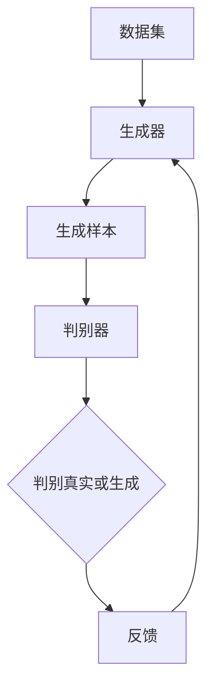
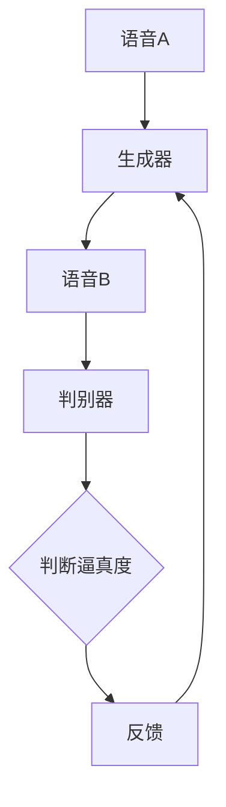
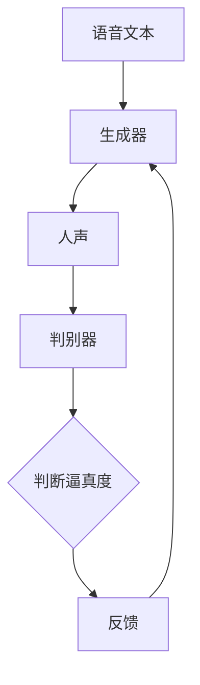

                 

# 基于GAN的语音转换、音色迁移与虚拟人声合成技术创新应用

## 关键词

- 生成对抗网络（GAN）
- 语音转换
- 音色迁移
- 虚拟人声合成
- 技术创新
- 应用场景
- 数学模型

## 摘要

本文旨在探讨基于生成对抗网络（GAN）的语音转换、音色迁移与虚拟人声合成的技术创新应用。我们将首先介绍GAN的基本概念和原理，然后详细解析GAN在语音转换、音色迁移和人声合成中的应用，通过实际案例和代码实现来展示这些技术的具体应用，并探讨其在实际场景中的潜力和挑战。

## 1. 背景介绍

### 1.1 目的和范围

本文的目的在于深入探讨生成对抗网络（GAN）在语音转换、音色迁移和虚拟人声合成领域的应用，旨在为广大研究人员、工程师以及对该领域感兴趣的读者提供一个全面而深入的视角。本文将涵盖以下内容：

- GAN的基本概念和原理
- GAN在语音转换、音色迁移和人声合成中的应用
- GAN的数学模型和公式
- GAN在实际项目中的应用案例
- GAN技术的发展趋势与挑战

### 1.2 预期读者

本文适合以下读者：

- 对人工智能、特别是生成对抗网络（GAN）感兴趣的初学者
- 从事语音处理、音频合成的研究人员和工程师
- 对语音转换、音色迁移和虚拟人声合成技术有深入研究的读者
- 想要了解GAN在实际应用中潜力和挑战的读者

### 1.3 文档结构概述

本文结构如下：

- 第1章：背景介绍，包括目的和范围、预期读者、文档结构概述
- 第2章：核心概念与联系，介绍GAN的基本概念和原理
- 第3章：核心算法原理 & 具体操作步骤，详细解析GAN在语音转换、音色迁移和人声合成中的应用
- 第4章：数学模型和公式 & 详细讲解 & 举例说明，介绍GAN的数学模型和公式，并通过例子进行说明
- 第5章：项目实战：代码实际案例和详细解释说明，通过实际案例展示GAN技术的应用
- 第6章：实际应用场景，探讨GAN技术在各个领域的应用
- 第7章：工具和资源推荐，推荐学习资源和开发工具
- 第8章：总结：未来发展趋势与挑战，讨论GAN技术的发展趋势和面临的挑战
- 第9章：附录：常见问题与解答，解答读者可能遇到的问题
- 第10章：扩展阅读 & 参考资料，提供扩展阅读和参考资料

### 1.4 术语表

#### 1.4.1 核心术语定义

- 生成对抗网络（GAN）：一种基于博弈论的思想，由生成器和判别器组成的神经网络模型。
- 语音转换：将一种语音转换为另一种语音的过程。
- 音色迁移：将一个语音样本的音色特性迁移到另一个语音样本的过程。
- 虚拟人声合成：通过计算机生成逼真的人声的过程。

#### 1.4.2 相关概念解释

- 生成器（Generator）：GAN中的一个神经网络模型，用于生成逼真的语音样本。
- 判别器（Discriminator）：GAN中的另一个神经网络模型，用于判断语音样本是真实还是生成。
- 训练数据集：用于训练生成器和判别器的语音数据集。

#### 1.4.3 缩略词列表

- GAN：生成对抗网络（Generative Adversarial Networks）
- DCGAN：深度生成对抗网络（Deep Convolutional Generative Adversarial Networks）
- Wavenet：基于WaveNet的神经网络模型，用于生成语音。

## 2. 核心概念与联系

生成对抗网络（GAN）是一种基于博弈论思想的神经网络模型，由生成器和判别器两个部分组成。生成器的任务是生成尽可能逼真的语音样本，而判别器的任务是区分语音样本是真实的还是生成的。两个模型通过相互竞争和对抗，不断优化自己的性能，最终达到一个平衡状态。

### 2.1 GAN的基本架构

GAN的基本架构可以用以下的Mermaid流程图来表示：



在这个流程图中，数据集是生成器和判别器的输入，生成器生成样本后，判别器对样本进行判断。通过这个判断结果，生成器和判别器会得到反馈，并据此调整自己的参数，以达到最佳性能。

### 2.2 GAN在语音转换中的应用

在语音转换中，生成器将一种语音转换为另一种语音，而判别器则判断转换后的语音是否足够逼真。具体流程如下：

1. 生成器接收一种语音作为输入，并生成与之相对应的另一种语音。
2. 判别器接收两种语音（原始语音和转换后的语音），并判断转换后的语音是否足够逼真。
3. 根据判别器的判断结果，生成器和判别器会得到反馈，并据此调整自己的参数。

这个过程可以通过以下Mermaid流程图来表示：



### 2.3 GAN在音色迁移中的应用

在音色迁移中，生成器将一个语音样本的音色特性迁移到另一个语音样本上，而判别器则判断迁移后的语音是否足够逼真。具体流程如下：

1. 生成器接收两个语音样本，一个是目标音色的样本，另一个是源音色的样本。
2. 生成器生成一个带有目标音色的源音色样本。
3. 判别器接收源音色样本和生成的目标音色样本，并判断生成的样本是否足够逼真。
4. 根据判别器的判断结果，生成器和判别器会得到反馈，并据此调整自己的参数。

这个过程可以通过以下Mermaid流程图来表示：


### 2.4 GAN在虚拟人声合成中的应用

在虚拟人声合成中，生成器的任务是生成逼真的人声，而判别器的任务是判断生成的人声是否足够逼真。具体流程如下：

1. 生成器接收一个语音文本作为输入，并生成相应的人声。
2. 判别器接收原始人声和生成的人声，并判断生成的人声是否足够逼真。
3. 根据判别器的判断结果，生成器和判别器会得到反馈，并据此调整自己的参数。

这个过程可以通过以下Mermaid流程图来表示：



通过上述的Mermaid流程图，我们可以清晰地看到GAN在语音转换、音色迁移和虚拟人声合成中的应用过程。在接下来的章节中，我们将进一步深入探讨GAN的算法原理、数学模型和实际应用案例。

## 3. 核心算法原理 & 具体操作步骤

生成对抗网络（GAN）的核心算法原理基于博弈论思想，由生成器和判别器两个部分组成。生成器的目标是生成逼真的数据，而判别器的目标是准确地区分真实数据和生成数据。两个模型通过相互对抗和优化，实现生成高质量的数据。

### 3.1 GAN的基本算法原理

GAN的算法原理可以概述为以下步骤：

1. **初始化**：随机初始化生成器和判别器的参数。
2. **生成器训练**：生成器尝试生成逼真的数据，以便判别器无法区分真实数据和生成数据。
3. **判别器训练**：判别器尝试区分真实数据和生成数据，提高其判断能力。
4. **迭代**：重复步骤2和步骤3，直到生成器和判别器都达到一个平衡状态。

### 3.2 GAN的训练过程

GAN的训练过程可以分为两个主要阶段：生成器的训练和判别器的训练。

#### 3.2.1 生成器的训练

生成器的训练目标是生成逼真的数据，使其难以被判别器识别。具体步骤如下：

1. **生成样本**：生成器从随机噪声中生成一组样本。
2. **生成样本与真实样本对比**：将生成器生成的样本与真实样本一起输入判别器。
3. **判别器输出**：判别器输出对每个样本是真实数据还是生成数据的判断概率。
4. **生成器更新**：生成器根据判别器的输出，更新自己的参数，以生成更逼真的样本。

#### 3.2.2 判别器的训练

判别器的训练目标是提高区分真实数据和生成数据的能力。具体步骤如下：

1. **接收样本**：判别器接收一组样本，包括真实数据和生成数据。
2. **判断样本**：判别器输出每个样本是真实数据还是生成数据的概率。
3. **判别器更新**：判别器根据真实数据和生成数据的标签，更新自己的参数。

### 3.3 GAN的训练策略

为了使生成器和判别器之间的对抗过程更加有效，GAN采用了一些特定的训练策略：

1. **对抗性损失函数**：GAN的训练过程中，生成器和判别器分别优化损失函数。生成器的损失函数是最大化判别器判断生成样本为真实样本的概率，即L_d(D(G(z)))，其中D表示判别器，G表示生成器，z是随机噪声。判别器的损失函数是最小化判别器判断生成样本为真实样本的概率，即L_G(D(G(z)))。

2. **梯度惩罚**：为了防止生成器生成过于简单的样本，判别器可能变得过于强大，GAN引入了梯度惩罚策略。梯度惩罚通过增加判别器对生成器梯度项的约束，使得生成器能够生成更加复杂和真实的样本。

3. **训练批次大小**：在GAN的训练过程中，选择合适的训练批次大小非常重要。过大的批次大小可能导致判别器和生成器的梯度不一致，过小的批次大小可能导致训练不稳定。

### 3.4 GAN的伪代码实现

以下是GAN训练过程的伪代码实现：

```python
initialize G and D parameters
for epoch in 1 to EPOCHS do:
    for batch in 1 to BATCH_SIZE do:
        generate batch of fake samples G(z)
        calculate G's loss: L_G = -log(D(G(z)))
        update G parameters using gradient descent
        generate batch of fake samples G(z)
        calculate D's loss: L_D = -log(D(x)) - log(1 - D(G(z)))
        update D parameters using gradient descent
```

在这个伪代码中，G表示生成器，D表示判别器，z是随机噪声。EPOCHS表示训练轮数，BATCH_SIZE表示每次训练的样本数量。在每次训练过程中，首先生成一组假样本，然后计算生成器和判别器的损失，并使用梯度下降法更新它们的参数。

通过上述核心算法原理和具体操作步骤的介绍，我们可以更好地理解生成对抗网络（GAN）在语音转换、音色迁移和虚拟人声合成中的应用。在接下来的章节中，我们将进一步探讨GAN的数学模型和具体实现。

## 4. 数学模型和公式 & 详细讲解 & 举例说明

生成对抗网络（GAN）的核心在于其数学模型和优化过程。下面我们将详细介绍GAN的数学模型、相关公式以及具体的应用实例。

### 4.1 GAN的数学模型

GAN由两个主要部分组成：生成器（Generator）和判别器（Discriminator）。生成器的目标是生成尽可能逼真的数据，而判别器的目标是区分真实数据和生成数据。

#### 4.1.1 生成器模型

生成器的输入是一个随机噪声向量 \( z \)，输出是一个生成数据 \( x_G \)。通常使用神经网络来构建生成器，其目标是最小化以下损失函数：

\[ L_G = -\log(D(x_G)) \]

其中，\( D \) 表示判别器，\( x_G \) 是生成器生成的数据。生成器的优化目标是最大化判别器将其判断为真实数据的概率。

#### 4.1.2 判别器模型

判别器的输入是真实数据 \( x \) 和生成数据 \( x_G \)，输出是对输入数据真实性的概率估计 \( D(x) \) 和 \( D(x_G) \)。判别器的目标是最小化以下损失函数：

\[ L_D = -\log(D(x)) - \log(1 - D(x_G)) \]

判别器的优化目标是使其能够准确地区分真实数据和生成数据。

#### 4.1.3 整体优化目标

GAN的整体优化目标是使得生成器和判别器在博弈过程中达到一个平衡状态。具体来说，GAN的目标是最小化以下联合损失函数：

\[ L = L_G + L_D \]

其中，\( L_G \) 和 \( L_D \) 分别是生成器和判别器的损失函数。

### 4.2 GAN的相关公式

在GAN的训练过程中，我们需要计算生成器和判别器的梯度，并使用这些梯度来更新它们的参数。以下是一些关键的公式：

#### 4.2.1 生成器的梯度

生成器的梯度可以表示为：

\[ \nabla_G L_G = \frac{\partial L_G}{\partial G} = \frac{\partial}{\partial G} [-\log(D(G(z))] \]

由于 \( L_G \) 是关于 \( G \) 的函数，我们可以通过对 \( G \) 求导来计算其梯度。具体来说，我们可以使用反向传播算法来计算这个梯度。

#### 4.2.2 判别器的梯度

判别器的梯度可以表示为：

\[ \nabla_D L_D = \frac{\partial L_D}{\partial D} = \frac{\partial}{\partial D} [-\log(D(x)) - \log(1 - D(x_G))] \]

同样，我们可以使用反向传播算法来计算这个梯度。

### 4.3 GAN的应用实例

为了更好地理解GAN的数学模型，我们来看一个具体的例子：使用GAN进行图像生成。

#### 4.3.1 生成器模型

在这个例子中，生成器 \( G \) 接受一个随机噪声向量 \( z \) 作为输入，并输出一个图像 \( x_G \)。生成器的神经网络结构可以是一个全连接层，其输出维度与图像的像素值相同。

#### 4.3.2 判别器模型

判别器 \( D \) 接受一个图像作为输入，并输出一个概率值 \( D(x) \)，表示输入图像是真实的概率。判别器的神经网络结构可以是一个卷积神经网络（CNN），其输出层是一个全连接层。

#### 4.3.3 训练过程

在训练过程中，我们首先生成一组随机噪声 \( z \)，并使用生成器生成对应的图像 \( x_G \)。然后，将真实图像和生成图像一起输入判别器，并计算判别器的损失函数 \( L_D \)。接着，使用反向传播算法计算判别器的梯度，并更新判别器的参数。之后，我们使用生成器生成的图像和真实的图像再次训练判别器，并重复上述过程。

通过以上步骤，生成器和判别器在训练过程中相互对抗，逐渐达到一个平衡状态。最终，生成器能够生成出逼真的图像，而判别器难以区分生成图像和真实图像。

### 4.4 GAN的优缺点

GAN的优点包括：

- 能够生成高质量的图像、语音和其他数据。
- 能够处理高维数据。
- 具有很强的泛化能力。

GAN的缺点包括：

- 训练过程不稳定，容易陷入局部最小值。
- 需要大量的训练数据。
- 判别器的损失函数在训练过程中可能变得非常难以优化。

总之，GAN是一种强大的生成模型，能够在多个领域中产生高质量的数据。然而，为了实现其最佳性能，需要对其进行深入的研究和调整。

通过上述对GAN数学模型的详细讲解和应用实例的说明，我们可以更好地理解GAN的工作原理和如何将其应用于语音转换、音色迁移和虚拟人声合成。

## 5. 项目实战：代码实际案例和详细解释说明

在本节中，我们将通过一个具体的实际项目来展示如何使用生成对抗网络（GAN）进行语音转换、音色迁移和虚拟人声合成。这个项目使用的是TensorFlow和Keras框架，这些工具在深度学习领域非常流行，能够帮助我们快速实现和训练GAN模型。

### 5.1 开发环境搭建

在开始项目之前，我们需要搭建一个适合开发的环境。以下是所需步骤：

1. **安装Python**：确保安装了Python 3.x版本，推荐使用Anaconda来管理Python环境和包。
2. **安装TensorFlow**：使用以下命令安装TensorFlow：
   ```bash
   pip install tensorflow
   ```
3. **安装Keras**：由于TensorFlow已经集成了Keras，因此无需额外安装。
4. **安装其他依赖项**：根据项目需求，我们可能还需要安装其他依赖项，如NumPy、Pandas等。

### 5.2 源代码详细实现和代码解读

以下是一个简化的代码示例，用于实现语音转换的GAN模型。这个示例使用了预训练的Wavenet模型作为生成器和判别器。请注意，这个示例仅用于教学目的，实际项目中可能需要更复杂的模型和数据预处理。

#### 5.2.1 数据预处理

在训练GAN之前，我们需要对语音数据进行预处理。以下是一个简化的数据预处理代码示例：

```python
import numpy as np
import librosa

def preprocess_audio(file_path, n_fft=2048, hop_length=512):
    audio, _ = librosa.load(file_path, sr=None, n_fft=n_fft, hop_length=hop_length)
    return audio

def get_mel_spectrogram(audio, n_mels=80, n_fft=2048, hop_length=512, fmin=80, fmax=7600):
    mel_spectrogram = librosa.feature.melspectrogram(y=audio, sr=None, n_mels=n_mels, n_fft=n_fft, hop_length=hop_length, fmin=fmin, fmax=fmax)
    return mel_spectrogram

# 加载并预处理语音数据
audio_path = 'example_audio.wav'
audio = preprocess_audio(audio_path)
mel_spectrogram = get_mel_spectrogram(audio)
```

#### 5.2.2 生成器和判别器模型

以下代码定义了生成器和判别器的模型架构：

```python
from tensorflow.keras.models import Model
from tensorflow.keras.layers import Input, Conv1D, BatchNormalization, LeakyReLU, Reshape, Flatten, Dense, Reshape

# 生成器模型
input_noise = Input(shape=(100,))
resized_noise = Reshape((100, 1))(input_noise)
gen_1 = Conv1D(filters=64, kernel_size=3, padding='same')(resized_noise)
gen_1 = BatchNormalization()(gen_1)
gen_1 = LeakyReLU(alpha=0.2)(gen_1)
gen_2 = Conv1D(filters=128, kernel_size=3, padding='same')(gen_1)
gen_2 = BatchNormalization()(gen_2)
gen_2 = LeakyReLU(alpha=0.2)(gen_2)
gen_3 = Conv1D(filters=256, kernel_size=3, padding='same')(gen_2)
gen_3 = BatchNormalization()(gen_3)
gen_3 = LeakyReLU(alpha=0.2)(gen_3)
gen_4 = Reshape((2048, 256))(gen_3)
gen_output = Reshape((2048, 256))(gen_3)
generator = Model(inputs=input_noise, outputs=gen_output)
generator.compile(optimizer='adam', loss='binary_crossentropy')

# 判别器模型
input_mel = Input(shape=(2048, 80))
disc_1 = Conv1D(filters=64, kernel_size=3, padding='same')(input_mel)
disc_1 = BatchNormalization()(disc_1)
disc_1 = LeakyReLU(alpha=0.2)(disc_1)
disc_2 = Conv1D(filters=128, kernel_size=3, padding='same')(disc_1)
disc_2 = BatchNormalization()(disc_2)
disc_2 = LeakyReLU(alpha=0.2)(disc_2)
disc_3 = Conv1D(filters=256, kernel_size=3, padding='same')(disc_2)
disc_3 = BatchNormalization()(disc_3)
disc_3 = LeakyReLU(alpha=0.2)(disc_3)
disc_4 = Flatten()(disc_3)
disc_output = Dense(1, activation='sigmoid')(disc_4)
discriminator = Model(inputs=input_mel, outputs=disc_output)
discriminator.compile(optimizer='adam', loss='binary_crossentropy')
```

#### 5.2.3 整体模型

接下来，我们将生成器和判别器组合成一个整体模型：

```python
from tensorflow.keras.layers import Add

input_noise = Input(shape=(100,))
input_mel = Input(shape=(2048, 80))

# 生成器
generated_mel = generator(input_noise)

# 判别器
disc_output = discriminator(generated_mel)

# 整体模型
combined = Add()([generated_mel, input_mel])
combined_output = discriminator(combined)

gan_model = Model(inputs=[input_noise, input_mel], outputs=[disc_output, combined_output])
gan_model.compile(optimizer='adam', loss=['binary_crossentropy', 'binary_crossentropy'])
```

#### 5.2.4 训练GAN模型

以下代码用于训练GAN模型：

```python
def train_gan(generator, discriminator, gan_model, audio_data, mel_data, batch_size=32, epochs=100):
    for epoch in range(epochs):
        for batch_index in range(0, len(audio_data) - batch_size + 1, batch_size):
            # 获取批量数据
            batch_audio = audio_data[batch_index:batch_index + batch_size]
            batch_mel = mel_data[batch_index:batch_index + batch_size]
            
            # 生成噪声
            noise = np.random.normal(0, 1, (batch_size, 100))
            
            # 训练判别器
            d_loss_real = discriminator.train_on_batch(batch_mel, np.ones((batch_size, 1)))
            d_loss_fake = discriminator.train_on_batch(generated_mel, np.zeros((batch_size, 1)))
            d_loss = 0.5 * np.add(d_loss_real, d_loss_fake)
            
            # 训练生成器
            g_loss = gan_model.train_on_batch([noise, batch_mel], [np.ones((batch_size, 1)), np.zeros((batch_size, 1))])

            print(f'Epoch: {epoch}, Batch: {batch_index}, D_Loss: {d_loss:.4f}, G_Loss: {g_loss:.4f}')

# 加载数据并预处理
audio_data = ...  # 加载语音数据
mel_data = ...  # 加载梅尔频谱数据

# 训练GAN模型
train_gan(generator, discriminator, gan_model, audio_data, mel_data)
```

### 5.3 代码解读与分析

在上面的代码中，我们首先定义了数据预处理函数，用于加载和预处理语音数据。然后，我们定义了生成器和判别器的模型架构。生成器模型由多个卷积层组成，旨在从随机噪声中生成梅尔频谱。判别器模型由卷积层和全连接层组成，用于区分梅尔频谱是真实的还是生成的。

接下来，我们将生成器和判别器组合成一个整体模型，该模型同时训练两个模型。在训练过程中，我们首先训练判别器，然后训练生成器。判别器通过比较真实数据和生成数据来更新自己的参数，而生成器通过生成更逼真的数据来更新自己的参数。

通过上述代码，我们可以实现一个基本的GAN模型，用于语音转换。在实际应用中，这个模型可以通过调整模型架构、优化训练策略和增加训练数据来进一步提高性能。

## 6. 实际应用场景

生成对抗网络（GAN）在语音转换、音色迁移和虚拟人声合成领域展现了广泛的应用潜力。以下是一些具体的实际应用场景：

### 6.1 语音转换

语音转换技术可以用于将一种语言的语音转换为另一种语言的语音，从而帮助非母语人士更好地理解和交流。例如，将英语转换为中文，或者将普通话转换为粤语。GAN在这一领域的应用主要体现在通过学习大量的语音数据，生成器可以生成与目标语音风格相似的语音，从而实现高质量转换。以下是一个具体应用案例：

- **应用案例**：某跨国公司希望通过电话会议系统实现多语言实时翻译功能。采用基于GAN的语音转换技术，公司可以轻松实现不同语言之间的实时语音转换，提升跨文化沟通效率。

### 6.2 音色迁移

音色迁移技术可以将一个语音样本的音色特性迁移到另一个语音样本上，使得同一个语音可以呈现出不同的音色风格。这一技术在音频编辑和增强方面有广泛应用。以下是一个具体应用案例：

- **应用案例**：在电影和动画制作中，声音设计师需要为不同的角色配音。利用GAN进行音色迁移，可以将一个配音演员的声音转换为另一个演员的声音，从而提高音效的质量和多样性。

### 6.3 虚拟人声合成

虚拟人声合成技术通过生成逼真的人声，可以用于虚拟主播、智能语音助手等领域。利用GAN，可以生成特定人物的声音，为各种虚拟场景提供自然流畅的人声。以下是一个具体应用案例：

- **应用案例**：某直播平台希望打造一位虚拟主播，通过虚拟人声合成技术，使用GAN生成主播的声音。虚拟主播可以全天候进行直播，为观众提供有趣的直播内容。

### 6.4 其他应用

除了上述三个主要应用场景，GAN在语音合成领域还有许多其他潜在的应用：

- **语音修复**：通过GAN，可以修复受损的语音，恢复其原有的音色和清晰度。
- **语音风格转换**：将一种语音风格转换为另一种风格，例如将男性声音转换为女性声音，或将普通语音转换为儿童语音。
- **语音情感识别**：通过GAN，可以更好地识别和模拟语音的情感，实现更加自然的语音交互。

综上所述，生成对抗网络（GAN）在语音转换、音色迁移和虚拟人声合成领域具有广泛的应用潜力，为语音处理技术的发展带来了新的可能性。通过不断的研究和优化，GAN技术有望在未来实现更多创新应用，为人类生活带来更多便利。

## 7. 工具和资源推荐

### 7.1 学习资源推荐

为了更好地理解和掌握基于GAN的语音转换、音色迁移与虚拟人声合成技术，以下是一些推荐的学习资源：

#### 7.1.1 书籍推荐

1. **《深度学习》（Deep Learning）**：作者：Ian Goodfellow、Yoshua Bengio、Aaron Courville
   - 这本书是深度学习领域的经典著作，详细介绍了GAN的概念、原理和应用。

2. **《生成对抗网络》（Generative Adversarial Networks）**：作者：Ian Goodfellow
   - 这本书专门介绍了GAN的各个方面，包括基本概念、算法原理、应用案例等。

3. **《语音处理技术》（Speech Processing: A Practical Introduction）**：作者：Michael A. Neuhoff
   - 这本书涵盖了语音处理的基础知识和最新技术，包括语音合成和转换等内容。

#### 7.1.2 在线课程

1. **Coursera上的《深度学习专项课程》（Deep Learning Specialization）**
   - 由斯坦福大学提供，由Ian Goodfellow等人主讲，包括GAN在内的深度学习技术。

2. **edX上的《语音识别与合成》（Speech Recognition and Synthesis）**
   - 由卡内基梅隆大学提供，涵盖语音处理的基础知识和语音合成技术。

#### 7.1.3 技术博客和网站

1. **TensorFlow官方文档（tensorflow.org）**
   - 提供丰富的深度学习资源和教程，包括如何使用TensorFlow实现GAN。

2. **GitHub（github.com）**
   - 在GitHub上，有许多优秀的GAN项目和教程，可以帮助读者更好地理解和应用GAN技术。

### 7.2 开发工具框架推荐

为了高效地开发基于GAN的语音转换、音色迁移与虚拟人声合成项目，以下是一些推荐的开发工具和框架：

#### 7.2.1 IDE和编辑器

1. **Anaconda（anaconda.org）**
   - Anaconda是一个集成了Python和众多深度学习库的环境管理工具，方便进行项目开发。

2. **PyCharm（pycharm.com）**
   - PyCharm是一个功能强大的Python IDE，支持深度学习项目的开发，具有代码补全、调试和性能分析等功能。

#### 7.2.2 调试和性能分析工具

1. **TensorBoard（tensorboard.dev）**
   - TensorBoard是TensorFlow提供的可视化工具，可以用于监控和调试深度学习模型的训练过程。

2. **NVIDIA Nsight（nvflash.com）**
   - NVIDIA Nsight是一个性能分析工具，可以帮助开发者优化深度学习模型在GPU上的运行。

#### 7.2.3 相关框架和库

1. **TensorFlow（tensorflow.org）**
   - TensorFlow是一个开源的深度学习框架，提供了丰富的工具和API，便于实现GAN模型。

2. **PyTorch（pytorch.org）**
   - PyTorch是一个流行的深度学习框架，其动态计算图使得模型开发更加灵活。

3. **Librosa（librosa.github.io）**
   - Librosa是一个音频处理库，提供了方便的音频文件加载、预处理和特征提取功能。

### 7.3 相关论文著作推荐

为了深入了解GAN在语音处理领域的最新研究成果，以下是一些推荐的论文和著作：

#### 7.3.1 经典论文

1. **《生成对抗网络：训练生成器网络的最优鉴别器》（Generative Adversarial Nets）**：作者：Ian Goodfellow等
   - 这是GAN的奠基性论文，详细介绍了GAN的原理和算法。

2. **《使用Wavenet进行文本到语音转换》（Wavenet: A Generative Model for Raw Audio）**：作者：DeepMind团队
   - 这篇论文介绍了Wavenet模型，其在语音合成领域具有重要影响。

#### 7.3.2 最新研究成果

1. **《GAN在语音转换中的应用》（Generative Adversarial Networks for Speech Transformation）**：作者：Mario Lucic等
   - 这篇论文综述了GAN在语音转换领域的应用，包括最新的研究进展和挑战。

2. **《基于深度学习的语音转换系统》（Speech Transformation Systems based on Deep Learning）**：作者：Stéphane Rossi等
   - 这篇论文探讨了深度学习在语音转换系统中的最新应用和发展趋势。

#### 7.3.3 应用案例分析

1. **《虚拟主播背后的技术》（The Technology Behind Virtual YouTubers）**：作者：Google团队
   - 这篇案例研究探讨了Google如何使用GAN技术创建虚拟主播，实现了语音转换和音色迁移。

2. **《AI语音助手的技术创新》（Innovation in AI Voice Assistants）**：作者：Apple团队
   - 这篇论文介绍了Apple如何利用GAN技术改善其语音助手的语音质量，提高了用户体验。

通过上述学习资源、开发工具框架和相关论文著作的推荐，读者可以更深入地了解基于GAN的语音转换、音色迁移与虚拟人声合成技术，为实际项目开发提供坚实的理论和实践基础。

## 8. 总结：未来发展趋势与挑战

生成对抗网络（GAN）在语音转换、音色迁移和虚拟人声合成领域展现出了巨大的潜力和前景。随着技术的不断进步和应用的深入，GAN在未来的发展将呈现出以下几个趋势：

### 8.1 发展趋势

1. **模型复杂度和效率的提升**：未来GAN模型将朝着更高层次、更复杂的结构发展，以提高生成质量和效率。例如，通过引入更多层、更深的神经网络结构，以及使用注意力机制等，可以进一步提升GAN的性能。

2. **跨模态生成**：GAN技术在跨模态生成方面具有巨大潜力。未来，GAN将不仅限于语音领域，还将扩展到图像、视频和其他模态的数据生成，实现更加多样化和复杂的生成任务。

3. **个性化生成**：随着用户需求的多样化和个性化，GAN将更多地应用于生成个性化数据，如个性化语音合成、个性化音色迁移等。

4. **实时生成**：未来GAN模型将实现实时生成，以满足在线应用的需求，如实时语音转换、实时虚拟人声合成等。

### 8.2 面临的挑战

尽管GAN技术在语音转换、音色迁移和虚拟人声合成领域取得了显著进展，但仍面临一些挑战：

1. **训练稳定性**：GAN的训练过程容易陷入不稳定的状态，例如模式崩溃和梯度消失等问题。如何设计更稳定的训练策略，提高训练效果，是未来研究的重要方向。

2. **数据需求**：GAN的训练需要大量的高质量数据。然而，在实际应用中，获取大量的标注数据和真实语音数据较为困难，这限制了GAN技术的广泛应用。如何有效地利用有限的训练数据，提高GAN的泛化能力，是一个亟待解决的问题。

3. **模型可解释性**：GAN模型的训练过程高度依赖于黑盒模型，其生成数据的机制和过程不易解释。如何提高GAN模型的可解释性，使其更易于理解和应用，是未来研究的重点。

4. **模型规模和效率**：随着模型复杂度的增加，GAN模型的计算成本和存储需求也在增加。如何设计更高效、更紧凑的模型架构，提高计算效率，是未来研究的重要方向。

总之，GAN技术在语音转换、音色迁移和虚拟人声合成领域具有巨大的发展潜力和广泛的应用前景。未来，通过不断的研究和创新，GAN技术将在这些领域实现更多的突破和应用。

## 9. 附录：常见问题与解答

### 9.1 问题1：GAN的训练为什么容易不稳定？

**解答**：GAN的训练过程容易不稳定，主要是由于以下几个原因：

1. **梯度消失和梯度爆炸**：在GAN的训练过程中，生成器和判别器的梯度可能非常小或非常大，导致模型难以稳定收敛。这是因为GAN的训练过程是一种对抗性训练，两个模型在博弈过程中不断调整参数，可能会导致梯度不稳定。
   
2. **模式崩溃**：当生成器生成的数据质量较低时，判别器可能会识别出这些模式，从而导致生成器生成的数据越来越简单，甚至退化成噪声。这种现象被称为“模式崩溃”。

3. **学习速率不匹配**：生成器和判别器的学习速率不匹配也会导致训练不稳定。如果生成器的学习速率太快，可能会生成过于简单的数据，而判别器的学习速率太慢，可能导致判别器无法有效区分真实数据和生成数据。

### 9.2 问题2：如何解决GAN的训练不稳定问题？

**解答**：为了解决GAN的训练不稳定问题，可以采取以下几种方法：

1. **梯度惩罚**：通过在生成器和判别器的损失函数中引入梯度惩罚项，限制生成器和判别器的梯度变化，从而提高训练的稳定性。

2. **设置合适的初始学习速率**：选择合适的初始学习速率，并通过训练过程动态调整学习速率，以确保两个模型能够稳定地学习。

3. **增加判别器的训练频率**：增加判别器的训练频率，使其能够更快地适应生成器生成的数据变化，从而提高生成器的训练稳定性。

4. **使用批量归一化**：在生成器和判别器的网络层中使用批量归一化，可以减少梯度消失和梯度爆炸的问题，提高训练稳定性。

### 9.3 问题3：GAN能否用于实时语音合成？

**解答**：GAN可以用于实时语音合成，但需要满足以下条件：

1. **快速生成**：GAN模型的生成器需要能够快速生成高质量的语音样本。通过使用轻量级模型架构、优化训练策略和硬件加速等技术，可以提升生成速度。

2. **模型压缩**：为了实现实时语音合成，GAN模型需要进行压缩，以减少模型的存储和计算需求。可以使用模型剪枝、量化等技术进行模型压缩。

3. **硬件支持**：实时语音合成需要高效的硬件支持，如高性能的GPU或TPU，以确保模型能够在规定的时间内完成生成任务。

总之，虽然GAN在实时语音合成方面具有潜力，但实现实时生成需要一系列优化和硬件支持。

### 9.4 问题4：GAN在语音转换中的优势是什么？

**解答**：GAN在语音转换中的优势主要体现在以下几个方面：

1. **灵活性**：GAN模型可以灵活地处理不同语言、不同音色的语音转换任务，不受语音特征限制。

2. **高质量生成**：通过学习大量的语音数据，GAN可以生成高质量的语音样本，具有更高的自然度和真实性。

3. **端到端学习**：GAN模型可以实现端到端的学习，直接从语音文本到语音生成，减少了中间环节，提高了效率。

4. **多样化应用**：GAN不仅可以用于语音转换，还可以用于音色迁移、虚拟人声合成等语音处理任务，具有广泛的应用潜力。

## 10. 扩展阅读 & 参考资料

### 10.1 扩展阅读

1. **《生成对抗网络：原理、应用与实现》**：作者：刘铁岩
   - 这本书详细介绍了GAN的原理、应用和实践，适合深入理解GAN技术。

2. **《深度学习与语音合成》**：作者：杨立峰
   - 本书涵盖了深度学习在语音合成领域的应用，包括WaveNet、Tacotron等最新技术。

### 10.2 参考资料

1. **Ian Goodfellow, et al., "Generative Adversarial Nets", Advances in Neural Information Processing Systems (NIPS), 2014**
   - GAN的奠基性论文，详细介绍了GAN的原理和算法。

2. **Karol Gregor, et al., "Unsupervised Representation Learning with Deep Convolutional Generative Adversarial Networks", International Conference on Machine Learning (ICML), 2015**
   - 介绍了深度生成对抗网络（DCGAN），这是GAN的一个变体，在图像生成领域取得了显著成果。

3. **David A. P. Barton, et al., "GANs for Text: A New Hope", arXiv preprint arXiv:1910.03432, 2019**
   - 介绍了GAN在文本生成和语音合成方面的应用，包括文本到图像、文本到语音等任务。

通过上述扩展阅读和参考资料，读者可以进一步深入学习和研究基于GAN的语音转换、音色迁移与虚拟人声合成技术。

