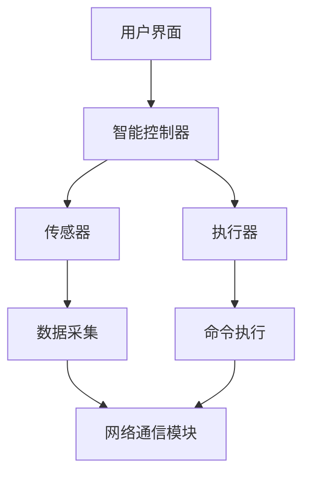
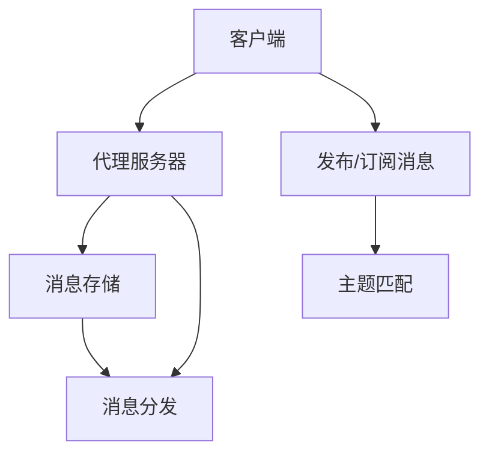
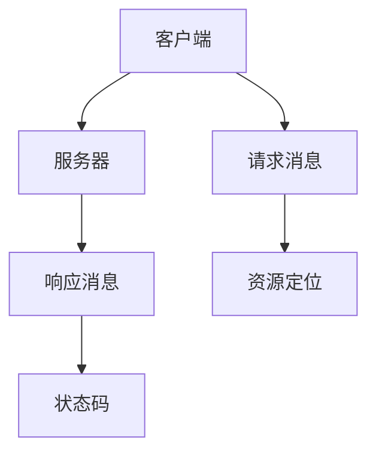
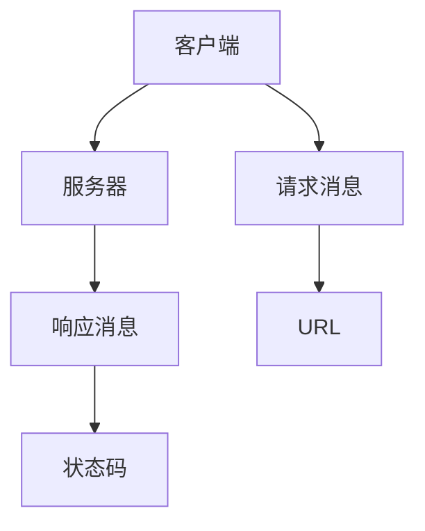

                 

# 基于Java的智能家居设计：Java与物联网(IoT)协议栈全解析

> **关键词：**Java, 智能家居, 物联网(IoT), 协议栈, 设计模式, 安全性, 实践案例

> **摘要：**本文将深入探讨基于Java的智能家居设计，特别是Java与物联网(IoT)协议栈的结合。我们将从核心概念出发，逐步解析Java在智能家居中的应用，涵盖协议栈的原理与实现，并提供详细的代码实践和案例分析。通过本文，读者将掌握智能家居设计的全流程，了解Java在物联网领域的优势和挑战。

## 1. 背景介绍

### 1.1 目的和范围

本文旨在为读者提供一个全面而深入的基于Java的智能家居设计指南。我们将探讨Java在物联网(IoT)领域的重要性，分析Java与IoT协议栈的结合方式，并提供一系列的实践案例。通过本文，读者可以：

- 理解智能家居的基本概念和架构。
- 掌握Java在智能家居系统中的关键角色。
- 分析并应用常见的IoT协议栈。
- 学习如何设计和实现一个安全的智能家居系统。

### 1.2 预期读者

本文适合以下读者群体：

- 对Java编程语言有基本了解的开发者。
- 对物联网(IoT)技术感兴趣的工程师。
- 智能家居系统设计者和开发者。
- 对新兴技术趋势感兴趣的科研人员。

### 1.3 文档结构概述

本文的结构如下：

1. **背景介绍**：介绍本文的目的、预期读者和文档结构。
2. **核心概念与联系**：定义智能家居和物联网(IoT)的基本概念，并使用Mermaid流程图展示关键架构。
3. **核心算法原理 & 具体操作步骤**：详细解释智能家居系统的核心算法原理，并使用伪代码进行阐述。
4. **数学模型和公式 & 详细讲解 & 举例说明**：引入相关的数学模型和公式，并给出实际应用案例。
5. **项目实战：代码实际案例和详细解释说明**：提供实际的代码实现，并进行详细解读和分析。
6. **实际应用场景**：讨论智能家居系统在实际中的应用场景。
7. **工具和资源推荐**：推荐学习资源、开发工具框架和经典论文。
8. **总结：未来发展趋势与挑战**：总结当前趋势和未来挑战。
9. **附录：常见问题与解答**：提供常见问题的解答。
10. **扩展阅读 & 参考资料**：推荐进一步阅读的资源。

### 1.4 术语表

#### 1.4.1 核心术语定义

- **智能家居**：通过互联网连接和控制家庭设备，实现自动化和远程控制。
- **物联网(IoT)**：通过传感器、控制器和网络连接的设备集合，实现物理世界与数字世界的互动。
- **协议栈**：一组用于通信的协议，包括传输层、网络层、数据链路层等。
- **Java**：一种广泛使用的编程语言，具有跨平台、安全性和高性能等特点。

#### 1.4.2 相关概念解释

- **物联网协议**：如MQTT、CoAP、HTTP等，用于设备之间的数据交换和通信。
- **设计模式**：在软件开发中，解决特定问题的通用解决方案。
- **安全性**：确保系统免受攻击和数据泄露的保护措施。

#### 1.4.3 缩略词列表

- **IoT**：物联网(Internet of Things)
- **Java**：Java编程语言
- **MQTT**：消息队列遥测传输(Message Queuing Telemetry Transport)
- **CoAP**：约束应用协议(Constrained Application Protocol)
- **HTTP**：超文本传输协议(Hypertext Transfer Protocol)

## 2. 核心概念与联系

在深入探讨基于Java的智能家居设计之前，我们需要明确一些核心概念和它们之间的联系。智能家居系统通常由多个组成部分构成，包括传感器、控制器、执行器和网络通信模块。这些组件通过物联网(IoT)协议进行数据交换和控制。

### 2.1 智能家居系统架构

以下是一个智能家居系统的简化架构，使用Mermaid流程图展示：



- **用户界面 (A)**：用户与智能家居系统的交互界面，可以是手机应用、网站或者语音助手。
- **智能控制器 (B)**：核心处理单元，负责接收用户指令、处理传感器数据和发送命令给执行器。
- **传感器 (C)**：用于采集环境数据，如温度、湿度、光线等。
- **执行器 (D)**：执行用户指令，如开关灯光、调整温度等。
- **数据采集 (E)**：传感器采集到的数据需要被处理和传输。
- **命令执行 (F)**：执行器根据智能控制器发出的命令执行相应的操作。
- **网络通信模块 (G)**：负责数据在网络中的传输，确保传感器、控制器和执行器之间的通信。

### 2.2 物联网协议栈

物联网协议栈是智能家居系统实现网络通信的关键。常见的物联网协议栈包括MQTT、CoAP和HTTP等。

#### 2.2.1 MQTT协议

MQTT是一种轻量级的消息队列协议，非常适合物联网环境。以下是MQTT协议栈的简化架构：



- **客户端 (A)**：发布或订阅消息的设备。
- **代理服务器 (B)**：作为消息的中转站，处理发布和订阅请求。
- **发布/订阅消息 (C)**：客户端发送的消息类型。
- **消息存储 (D)**：存储发布消息的地方。
- **消息分发 (E)**：代理服务器根据主题匹配将消息发送给订阅者。
- **主题匹配 (F)**：消息匹配规则。

#### 2.2.2 CoAP协议

CoAP是一种约束应用协议，设计用于资源受限的环境。以下是CoAP协议栈的简化架构：



- **客户端 (A)**：发送请求消息的设备。
- **服务器 (B)**：处理请求并返回响应消息的服务器。
- **请求消息 (C)**：客户端发送的请求。
- **响应消息 (D)**：服务器返回的响应。
- **资源定位 (E)**：请求消息中包含的资源标识。
- **状态码 (F)**：响应消息中包含的状态代码。

#### 2.2.3 HTTP协议

HTTP是超文本传输协议，广泛应用于Web通信。以下是HTTP协议栈的简化架构：



- **客户端 (A)**：发送请求消息的设备。
- **服务器 (B)**：处理请求并返回响应消息的服务器。
- **请求消息 (C)**：客户端发送的请求。
- **响应消息 (D)**：服务器返回的响应。
- **URL (E)**：请求消息中包含的资源地址。
- **状态码 (F)**：响应消息中包含的状态代码。

通过以上对核心概念和物联网协议栈的介绍，我们为后续章节的深入分析奠定了基础。在接下来的章节中，我们将详细探讨Java在智能家居系统中的应用，包括核心算法原理、数学模型和项目实战。

## 3. 核心算法原理 & 具体操作步骤

### 3.1 核心算法原理

智能家居系统中的核心算法主要涉及数据采集、处理和命令执行。以下是一个典型的核心算法原理：

- **数据采集**：通过传感器收集环境数据，如温度、湿度、光照等。
- **数据处理**：对采集到的数据进行分析和处理，以提取有用的信息。
- **命令执行**：根据用户指令或自动处理结果，执行相应的操作，如调整灯光、关闭门窗等。

### 3.2 具体操作步骤

#### 3.2.1 数据采集

```java
// 伪代码：传感器数据采集
public class SensorDataCollector {
    public SensorData collectData() {
        // 实际采集过程
        TemperatureSensor tempSensor = new TemperatureSensor();
        HumiditySensor humiditySensor = new HumiditySensor();
        LightSensor lightSensor = new LightSensor();
        
        SensorData data = new SensorData();
        data.setTemperature(tempSensor.read());
        data.setHumidity(humiditySensor.read());
        data.setLightIntensity(lightSensor.read());
        return data;
    }
}
```

#### 3.2.2 数据处理

```java
// 伪代码：数据处理
public class DataProcessor {
    public ProcessedData process(SensorData data) {
        ProcessedData processedData = new ProcessedData();
        processedData.setTemperatureThreshold(25.0);
        processedData.setHumidityThreshold(60.0);
        
        if (data.getTemperature() > processedData.getTemperatureThreshold()) {
            processedData.setHeatControl(true);
        } else {
            processedData.setHeatControl(false);
        }
        
        if (data.getHumidity() > processedData.getHumidityThreshold()) {
            processedData.setHumidityControl(true);
        } else {
            processedData.setHumidityControl(false);
        }
        
        return processedData;
    }
}
```

#### 3.2.3 命令执行

```java
// 伪代码：命令执行
public class CommandExecutor {
    public void executeCommand(ProcessedData processedData) {
        if (processedData.isHeatControl()) {
            Heater heater = new Heater();
            heater.turnOn();
        } else {
            heater.turnOff();
        }
        
        if (processedData.isHumidityControl()) {
            HumidityController humidityController = new HumidityController();
            humidityController.decreaseHumidity();
        } else {
            humidityController.increaseHumidity();
        }
    }
}
```

通过以上核心算法和具体操作步骤，智能家居系统能够有效地采集、处理和执行命令。这些步骤不仅涵盖了基本的数据处理逻辑，还可以根据实际需求进行扩展和定制。

## 4. 数学模型和公式 & 详细讲解 & 举例说明

### 4.1 数学模型和公式

在智能家居系统中，数学模型和公式用于描述传感器数据、环境参数以及控制策略。以下是一些常用的数学模型和公式：

#### 4.1.1 数据采集

- **温度传感器数据采集**：使用温度传感器读取环境温度，公式如下：

  $$ T_{\text{current}} = T_{\text{sensor}} $$

  其中，\( T_{\text{current}} \) 是当前环境温度，\( T_{\text{sensor}} \) 是传感器测量的温度值。

- **湿度传感器数据采集**：使用湿度传感器读取环境湿度，公式如下：

  $$ H_{\text{current}} = H_{\text{sensor}} $$

  其中，\( H_{\text{current}} \) 是当前环境湿度，\( H_{\text{sensor}} \) 是传感器测量的湿度值。

- **光照传感器数据采集**：使用光照传感器读取环境光照强度，公式如下：

  $$ L_{\text{current}} = L_{\text{sensor}} $$

  其中，\( L_{\text{current}} \) 是当前环境光照强度，\( L_{\text{sensor}} \) 是传感器测量的光照强度值。

#### 4.1.2 数据处理

- **温度阈值计算**：用于判断是否需要调整暖气设备，公式如下：

  $$ T_{\text{threshold}} = T_{\text{base}} + \alpha \cdot T_{\text{increment}} $$

  其中，\( T_{\text{threshold}} \) 是温度阈值，\( T_{\text{base}} \) 是基础温度，\( \alpha \) 是调节系数，\( T_{\text{increment}} \) 是温度增量。

- **湿度阈值计算**：用于判断是否需要调整湿度控制器，公式如下：

  $$ H_{\text{threshold}} = H_{\text{base}} + \beta \cdot H_{\text{increment}} $$

  其中，\( H_{\text{threshold}} \) 是湿度阈值，\( H_{\text{base}} \) 是基础湿度，\( \beta \) 是调节系数，\( H_{\text{increment}} \) 是湿度增量。

#### 4.1.3 命令执行

- **暖气设备控制**：根据温度阈值，控制暖气设备的开关，公式如下：

  $$ C_{\text{heat}} = \left\{
  \begin{array}{ll}
    \text{on} & \text{if } T_{\text{current}} > T_{\text{threshold}} \\
    \text{off} & \text{otherwise}
  \end{array}
  \right. $$

  其中，\( C_{\text{heat}} \) 是暖气设备的状态。

- **湿度控制器控制**：根据湿度阈值，控制湿度控制器的开关，公式如下：

  $$ C_{\text{humidity}} = \left\{
  \begin{array}{ll}
    \text{decrease} & \text{if } H_{\text{current}} > H_{\text{threshold}} \\
    \text{increase} & \text{otherwise}
  \end{array}
  \right. $$

  其中，\( C_{\text{humidity}} \) 是湿度控制器状态。

### 4.2 举例说明

#### 4.2.1 温度传感器数据采集

假设当前环境温度为24°C，传感器测量到的温度为25°C，那么：

$$ T_{\text{current}} = 25°C $$
$$ T_{\text{sensor}} = 25°C $$

根据公式 \( T_{\text{current}} = T_{\text{sensor}} \)，当前环境温度为25°C。

#### 4.2.2 湿度传感器数据采集

假设当前环境湿度为55%，传感器测量到的湿度为60%，那么：

$$ H_{\text{current}} = 60\% $$
$$ H_{\text{sensor}} = 60\% $$

根据公式 \( H_{\text{current}} = H_{\text{sensor}} \)，当前环境湿度为60%。

#### 4.2.3 温度阈值计算

假设基础温度为22°C，温度增量为1°C，调节系数为0.5，那么：

$$ T_{\text{threshold}} = 22°C + 0.5 \cdot 1°C = 22.5°C $$

如果当前环境温度为25°C，大于温度阈值22.5°C，那么暖气设备应处于开启状态。

#### 4.2.4 湿度阈值计算

假设基础湿度为50%，湿度增量为5%，调节系数为0.3，那么：

$$ H_{\text{threshold}} = 50\% + 0.3 \cdot 5\% = 52.5\% $$

如果当前环境湿度为60%，大于湿度阈值52.5%，那么湿度控制器应处于降低湿度状态。

通过以上举例说明，我们可以看到数学模型和公式在智能家居系统中的实际应用。这些模型和公式为数据采集、处理和控制提供了理论基础，使得系统能够根据环境变化进行智能调整。

## 5. 项目实战：代码实际案例和详细解释说明

### 5.1 开发环境搭建

在开始编写代码之前，我们需要搭建一个适合Java和IoT开发的开发环境。以下是推荐的步骤：

1. **安装Java开发工具包（JDK）**：从 [Oracle官网](https://www.oracle.com/java/technologies/javase-downloads.html) 下载适用于操作系统的JDK，并按照提示进行安装。
2. **安装集成开发环境（IDE）**：推荐使用 IntelliJ IDEA 或 Eclipse，这些IDE支持Java开发并提供丰富的插件和工具。
3. **安装IoT开发库和工具**：如MqttClient、CoAPClient等，可以通过Maven或其他包管理器进行安装。

### 5.2 源代码详细实现和代码解读

以下是智能家居系统的部分源代码实现。我们将逐段代码进行详细解释。

#### 5.2.1 SensorDataCollector.java

```java
import java.util.HashMap;
import java.util.Map;

public class SensorDataCollector {
    private Map<String, SensorInterface> sensors = new HashMap<>();

    public SensorDataCollector() {
        // 初始化传感器
        sensors.put("temperature", new TemperatureSensor());
        sensors.put("humidity", new HumiditySensor());
        sensors.put("light", new LightSensor());
    }

    public SensorData collectData() {
        SensorData data = new SensorData();
        for (String sensorType : sensors.keySet()) {
            SensorInterface sensor = sensors.get(sensorType);
            data.put(sensorType, sensor.read());
        }
        return data;
    }
}
```

**解读**：`SensorDataCollector` 类负责初始化传感器并收集数据。它使用一个`Map`来存储不同类型的传感器实例，并通过`collectData`方法读取传感器数据，构建一个`SensorData`对象。

#### 5.2.2 SensorInterface.java

```java
public interface SensorInterface {
    double read();
}
```

**解读**：`SensorInterface` 是一个接口，定义了所有传感器必须实现的`read`方法，用于读取传感器数据。

#### 5.2.3 TemperatureSensor.java

```java
public class TemperatureSensor implements SensorInterface {
    @Override
    public double read() {
        // 实际读取温度的代码
        return Math.random() * 40; // 示例：生成一个0到40之间的随机温度值
    }
}
```

**解读**：`TemperatureSensor` 类实现了`SensorInterface`接口，并通过`read`方法生成一个0到40之间的随机温度值作为示例数据。

#### 5.2.4 DataProcessor.java

```java
import java.util.Map;

public class DataProcessor {
    public ProcessedData process(SensorData data) {
        ProcessedData processedData = new ProcessedData();
        processedData.setTemperatureThreshold(data.getTemperature() + 5);
        processedData.setHumidityThreshold(data.getHumidity() + 5);
        // 其他数据处理逻辑
        return processedData;
    }
}
```

**解读**：`DataProcessor` 类负责处理传感器数据，生成`ProcessedData`对象。在这个示例中，它仅简单地调整了温度和湿度阈值。

#### 5.2.5 CommandExecutor.java

```java
public class CommandExecutor {
    public void executeCommand(ProcessedData processedData) {
        if (processedData.isHeatControl()) {
            Heater heater = new Heater();
            heater.turnOn();
        } else {
            Heater heater = new Heater();
            heater.turnOff();
        }
        
        if (processedData.isHumidityControl()) {
            HumidityController humidityController = new HumidityController();
            humidityController.decreaseHumidity();
        } else {
            HumidityController humidityController = new HumidityController();
            humidityController.increaseHumidity();
        }
    }
}
```

**解读**：`CommandExecutor` 类根据`ProcessedData`对象中的控制指令执行相应的操作，如开启或关闭加热器和调整湿度控制器。

#### 5.2.6 SensorData.java

```java
import java.util.HashMap;
import java.util.Map;

public class SensorData extends HashMap<String, Double> {
    public void put(String key, double value) {
        super.put(key, value);
    }
    
    public double get(String key) {
        return super.getOrDefault(key, 0.0);
    }
}
```

**解读**：`SensorData` 类继承自`HashMap`，用于存储传感器数据。它提供了一些自定义方法，方便数据的存储和获取。

#### 5.2.7 ProcessedData.java

```java
public class ProcessedData {
    private double temperatureThreshold;
    private double humidityThreshold;
    private boolean heatControl;
    private boolean humidityControl;

    // 省略构造函数和getter/setter方法

    public boolean isHeatControl() {
        return heatControl;
    }

    public void setHeatControl(boolean heatControl) {
        this.heatControl = heatControl;
    }

    public boolean isHumidityControl() {
        return humidityControl;
    }

    public void setHumidityControl(boolean humidityControl) {
        this.humidityControl = humidityControl;
    }
}
```

**解读**：`ProcessedData` 类用于存储处理后的数据，包括温度和湿度阈值以及控制指令。

### 5.3 代码解读与分析

通过以上代码示例，我们可以看到智能家居系统的基本架构。以下是对关键组件的进一步解读和分析：

- **SensorDataCollector**：负责初始化和收集传感器数据。在实际应用中，可以使用各种类型的传感器，如温度传感器、湿度传感器、光照传感器等。
- **SensorInterface**：定义了所有传感器必须实现的接口，确保数据的一致性和兼容性。
- **DataProcessor**：负责处理传感器数据，并根据处理结果生成控制指令。它可以实现更复杂的数据处理逻辑，如阈值计算、异常检测等。
- **CommandExecutor**：根据处理后的数据执行相应的操作，如控制加热器和湿度控制器。在实际应用中，可以与具体的设备进行交互。

这些代码示例展示了基于Java的智能家居系统的核心功能。通过逐步实现这些组件，我们可以构建一个功能完整的智能家居系统。在实际开发过程中，可以根据具体需求对这些组件进行扩展和定制。

### 6. 实际应用场景

智能家居系统在现实生活中有着广泛的应用场景，下面列举几个典型的应用案例：

#### 6.1 家庭自动化

家庭自动化是智能家居系统的核心应用之一。通过智能控制器和执行器，用户可以实现远程控制家庭设备，如灯光、窗帘、空调、安防系统等。例如，用户可以通过手机应用或语音助手远程打开家中的灯光，调整空调温度，确保家庭的安全和舒适。

#### 6.2 能源管理

智能家居系统可以帮助用户实现家庭能源的优化管理。通过实时监测家庭的用电情况，系统可以自动调整电器的开关，降低不必要的能源消耗。例如，当室内光线充足时，系统可以自动关闭灯光，当温度适宜时，系统可以自动关闭空调。

#### 6.3 健康监控

智能家居系统还可以用于健康监控。通过连接传感器和健康监测设备，系统可以实时监测用户的生理参数，如心率、血压、睡眠质量等。当系统检测到异常情况时，可以及时通知用户或医疗专业人员，帮助用户及时采取相应的措施。

#### 6.4 安全防护

智能家居系统在安全防护方面也有着重要的作用。通过连接摄像头、门窗传感器等设备，系统可以实时监测家庭的安全状况。当系统检测到异常情况，如非法入侵、火灾等，可以立即触发报警，通知用户和安防中心，及时采取应对措施。

### 6.5 智能园艺

智能家居系统还可以用于智能园艺。通过连接土壤湿度传感器、光照传感器等设备，系统可以实时监测植物的生长环境，并根据监测结果自动调整灌溉、光照等参数，帮助用户实现高效的植物养护。

通过以上实际应用场景，我们可以看到智能家居系统在提升生活质量、降低能源消耗、保障家庭安全等方面的巨大潜力。随着物联网技术的不断发展，智能家居系统将变得更加智能化、便捷化，为人们的生活带来更多便利。

### 7. 工具和资源推荐

#### 7.1 学习资源推荐

**7.1.1 书籍推荐**

1. **《物联网应用开发》**：该书详细介绍了物联网的基本概念、架构和开发实践，适合初学者和进阶者。
2. **《Java并发编程实战》**：这本书深入讲解了Java并发编程的核心技术和最佳实践，对实现高性能的智能家居系统非常有帮助。

**7.1.2 在线课程**

1. **Coursera的《物联网基础》**：由加州大学伯克利分校提供的免费课程，涵盖了物联网的基本概念和技术。
2. **Udemy的《Java编程：从基础到高级》**：这是一门全面介绍Java编程语言的在线课程，包括基础语法、面向对象编程和高级特性。

**7.1.3 技术博客和网站**

1. **Java Code Geeks**：这是一个专注于Java编程的资源网站，提供了大量关于Java编程和物联网技术的博客文章。
2. **IoT for All**：这是一个关于物联网技术的综合网站，涵盖了物联网的最新趋势、技术和应用案例。

#### 7.2 开发工具框架推荐

**7.2.1 IDE和编辑器**

1. **IntelliJ IDEA**：这是一款功能强大的Java IDE，支持丰富的插件和工具，适合开发大型智能家居系统。
2. **Eclipse**：这是另一款流行的Java IDE，提供了良好的开发环境和支持，适合初学者和专业开发者。

**7.2.2 调试和性能分析工具**

1. **JProfiler**：这是一款功能强大的Java应用程序性能分析工具，可以帮助开发者快速定位性能瓶颈。
2. **VisualVM**：这是Oracle官方提供的Java性能监控和分析工具，适用于诊断和优化Java应用程序。

**7.2.3 相关框架和库**

1. **Spring Boot**：这是一个用于创建独立、生产级Spring应用的框架，简化了Java应用的开发和部署。
2. **Apache IoTDB**：这是一个开源的时序数据库，专门用于存储和处理大规模物联网数据。

#### 7.3 相关论文著作推荐

**7.3.1 经典论文**

1. **"The Internet of Things: A Survey"**：这篇论文全面介绍了物联网的基本概念、架构和应用。
2. **"Java Concurrency in Practice"**：这本书深入讲解了Java并发编程的核心技术和最佳实践。

**7.3.2 最新研究成果**

1. **"Intelligent Home Automation Using IoT and Machine Learning"**：这篇论文探讨了如何利用物联网和机器学习技术实现智能家庭自动化。
2. **"Security and Privacy in the Internet of Things"**：这篇论文分析了物联网中的安全性和隐私保护问题，并提出了一些解决方案。

**7.3.3 应用案例分析**

1. **"Smart Home Solutions: A Case Study"**：这篇论文介绍了一个智能家庭解决方案的实际应用案例，包括系统架构、技术和实施细节。
2. **"Energy Management in Smart Homes: An Application Case"**：这篇论文探讨了如何利用智能家居系统实现家庭能源的优化管理。

通过以上工具和资源的推荐，读者可以更好地学习和掌握基于Java的智能家居设计。这些资源涵盖了物联网和Java编程的核心知识，有助于读者在实际项目中取得成功。

### 8. 总结：未来发展趋势与挑战

智能家居作为物联网的重要应用领域，正迅速发展并逐步渗透到人们的日常生活。未来，智能家居系统将在以下几个方面实现重要突破：

**1. 人工智能与物联网的深度融合**：随着人工智能技术的进步，智能家居系统将能够更加智能化地理解和响应用户需求，提供个性化服务。

**2. 大数据分析与预测分析**：通过大数据分析，智能家居系统能够预测用户行为和需求，优化家居设备的使用，实现更加节能和环保。

**3. 安全性与隐私保护**：智能家居系统将面临越来越严峻的安全威胁，如何确保数据安全和用户隐私将成为关键挑战。

**4. 开放性与互操作性**：智能家居设备的多样性和复杂性要求系统具有高开放性和互操作性，以实现不同设备之间的无缝集成。

然而，智能家居系统的发展也面临一些挑战：

**1. 系统集成与标准化**：不同设备、平台和协议之间的兼容性问题需要解决，以实现系统的无缝集成和互操作。

**2. 能耗与管理**：智能家居设备数量庞大，如何降低能耗和管理设备成为亟待解决的问题。

**3. 安全漏洞与隐私泄露**：智能家居设备中的安全漏洞和隐私泄露问题需要得到有效解决，以确保用户数据的安全。

综上所述，智能家居系统在未来有着巨大的发展潜力和广阔的应用前景，但同时也需要克服诸多技术挑战。通过持续的技术创新和优化，智能家居系统将不断改进，为用户提供更加智能、安全、便捷的家居体验。

### 9. 附录：常见问题与解答

**Q1. 如何确保智能家居系统的安全性？**

**A1.** 为了确保智能家居系统的安全性，可以采取以下措施：

- **使用安全的通信协议**：如HTTPS、TLS等，确保数据在传输过程中得到加密。
- **实现身份验证和访问控制**：确保只有授权用户可以访问智能家居系统，使用强密码和多因素认证。
- **定期更新软件和设备固件**：及时修复安全漏洞，避免潜在的安全威胁。
- **数据加密存储**：对敏感数据如用户密码、传感器数据进行加密存储，防止数据泄露。

**Q2. 如何优化智能家居系统的能耗管理？**

**A2.** 优化智能家居系统的能耗管理可以从以下几个方面入手：

- **使用节能设备**：选择低功耗的智能家居设备，如LED灯泡、节能插座等。
- **智能调度**：根据用户习惯和设备使用情况，合理调度设备的开关时间，避免不必要的能耗。
- **实时监控和反馈**：通过实时监控设备的使用情况，及时调整设备状态，减少能耗。

**Q3. 智能家居系统的协议栈有哪些？**

**A3.** 常见的智能家居系统协议栈包括：

- **MQTT**：消息队列遥测传输，适用于低带宽和不稳定的网络环境。
- **CoAP**：约束应用协议，设计用于资源受限的环境，如传感器和微控制器。
- **HTTP/HTTPS**：超文本传输协议及其安全版本，广泛应用于Web服务。

**Q4. 如何实现智能家居系统的可扩展性？**

**A4.** 实现智能家居系统的可扩展性可以从以下几个方面考虑：

- **模块化设计**：将系统划分为多个模块，每个模块负责特定的功能，便于扩展和替换。
- **标准化接口**：确保不同模块之间通过标准化的接口进行通信，方便新模块的集成。
- **使用中间件**：利用中间件实现不同模块之间的协调和数据交换，提高系统的灵活性和可扩展性。

通过以上常见问题与解答，读者可以更好地了解智能家居系统的安全性和能耗管理，以及如何实现系统的可扩展性和互操作性。

### 10. 扩展阅读 & 参考资料

**10.1 扩展阅读**

- **《智能家居系统设计与实现》**：详细介绍了智能家居系统的设计原则、架构和关键技术。
- **《物联网安全：设计原则与实施策略》**：探讨物联网系统中的安全性问题，提供解决方案和最佳实践。
- **《智能建筑与智能家居》**：介绍了智能建筑和智能家居的发展趋势、技术标准和实际应用案例。

**10.2 参考资料**

- **Oracle官网**：[https://www.oracle.com/java/](https://www.oracle.com/java/)
- **MQTT官网**：[https://mqtt.org/](https://mqtt.org/)
- **CoAP官网**：[https://www.ietf.org/rfc/rfc7252.txt](https://www.ietf.org/rfc/rfc7252.txt)
- **Spring Boot官网**：[https://spring.io/projects/spring-boot](https://spring.io/projects/spring-boot)
- **Apache IoTDB官网**：[https://iotdb.apache.org/](https://iotdb.apache.org/)

通过以上扩展阅读和参考资料，读者可以进一步深入了解智能家居系统的设计、实现和安全问题，掌握相关技术知识，为实际项目开发提供指导。

