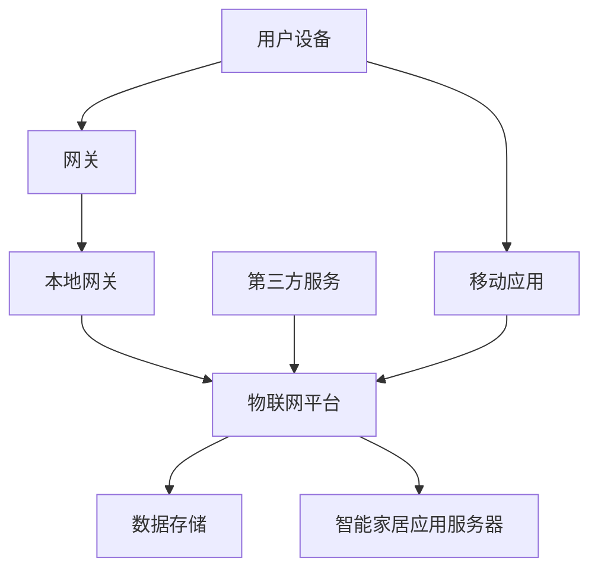

                 

# 基于Java的智能家居设计：云端智能家居平台与Java集成策略

> 关键词：智能家居、Java、云端平台、集成策略、技术架构、安全性、用户体验

> 摘要：随着物联网技术的快速发展，智能家居市场迎来了前所未有的机遇。本文将探讨如何利用Java语言构建云端智能家居平台，并详细分析Java在智能家居系统集成中的策略与优势。我们将从背景介绍、核心概念、算法原理、数学模型、实战案例、应用场景、工具资源推荐以及未来发展趋势等方面，为您呈现一个全面而深入的智能家居设计蓝图。

## 1. 背景介绍

### 1.1 目的和范围

本文旨在为智能家居开发者提供一种基于Java的云端集成策略，以实现高效、安全、可扩展的智能家居解决方案。我们将探讨Java在智能家居设计中的核心优势，并介绍如何在云端环境中部署和管理智能家居系统。

### 1.2 预期读者

本文适合对智能家居和Java开发有一定了解的工程师、架构师和项目经理。无论是想要了解智能家居设计的新手，还是希望优化现有系统的专业人士，都将在这篇文章中找到有价值的信息。

### 1.3 文档结构概述

本文分为以下章节：

1. **背景介绍**：介绍智能家居的背景和发展趋势。
2. **核心概念与联系**：阐述智能家居系统中的关键概念和架构。
3. **核心算法原理 & 具体操作步骤**：讲解实现智能家居功能的关键算法。
4. **数学模型和公式 & 详细讲解 & 举例说明**：介绍用于优化智能家居系统的数学模型。
5. **项目实战：代码实际案例和详细解释说明**：通过实际代码案例展示Java在智能家居设计中的应用。
6. **实际应用场景**：分析智能家居在不同环境中的应用案例。
7. **工具和资源推荐**：推荐学习和开发智能家居的有用工具和资源。
8. **总结：未来发展趋势与挑战**：探讨智能家居的未来发展方向。
9. **附录：常见问题与解答**：回答读者可能遇到的常见问题。
10. **扩展阅读 & 参考资料**：提供进一步阅读的推荐资源。

### 1.4 术语表

#### 1.4.1 核心术语定义

- **智能家居**：利用物联网技术将家庭设备互联，实现智能控制与自动化。
- **Java**：一种广泛使用的高级编程语言，具有良好的跨平台性。
- **云端平台**：一种通过网络访问的计算资源，包括存储、处理和应用程序。
- **集成策略**：将不同系统、组件和服务集成在一起，形成一个统一的解决方案。

#### 1.4.2 相关概念解释

- **物联网**：通过传感器和互联网将物理设备连接起来，实现信息的收集、传输和处理。
- **微服务架构**：将应用程序分解为独立的、可复用的服务，便于扩展和维护。
- **RESTful API**：一种基于HTTP协议的网络通信协议，用于实现分布式系统之间的交互。

#### 1.4.3 缩略词列表

- **IoT**：物联网
- **Java**：Java编程语言
- **AWS**：亚马逊云服务
- **REST**：表述性状态转移

## 2. 核心概念与联系

在构建云端智能家居平台时，了解以下核心概念和架构至关重要。以下是一个简化的智能家居系统架构图，通过Mermaid流程图展示其关键组成部分。



#### 2.1 系统架构

1. **用户设备**：包括智能手机、智能音箱、智能灯泡等，通过Wi-Fi或蓝牙连接到网关。
2. **网关**：负责将用户设备的数据发送到云端平台。
3. **本地网关**：在家庭环境中起到网关和智能控制器的作用，如智能插座、智能开关等。
4. **物联网平台**：处理数据传输、设备管理和应用逻辑。
5. **数据存储**：存储用户数据和设备状态信息。
6. **智能家居应用服务器**：提供RESTful API，供移动应用和网页前端调用。
7. **第三方服务**：如天气服务、音乐流媒体服务，可集成到智能家居平台中。

#### 2.2 核心概念

1. **设备控制**：通过物联网平台和本地网关实现对家庭设备的远程控制。
2. **数据同步**：用户设备与云端平台之间的数据传输与同步。
3. **设备状态监控**：实时监控设备状态，包括电池电量、运行状态等。
4. **场景联动**：根据用户需求，设置不同的场景联动，实现自动化控制。

## 3. 核心算法原理 & 具体操作步骤

在构建云端智能家居平台时，算法的选择和实现至关重要。以下是一个智能家居系统中的关键算法原理及其具体操作步骤的伪代码描述。

### 3.1 设备控制算法

```java
// 设备控制算法：发送命令到指定设备
public void controlDevice(String deviceId, String action) {
    // 1. 验证设备ID和操作参数
    if (!isValid(deviceId, action)) {
        throw new IllegalArgumentException("Invalid device ID or action");
    }
    
    // 2. 获取设备状态
    DeviceState state = getDeviceState(deviceId);
    
    // 3. 根据操作执行相应的控制命令
    switch (action) {
        case "ON":
            if (state == DeviceState.OFF) {
                sendCommand(deviceId, "TURN_ON");
            }
            break;
        case "OFF":
            if (state == DeviceState.ON) {
                sendCommand(deviceId, "TURN_OFF");
            }
            break;
        // 其他操作...
    }
    
    // 4. 更新设备状态
    updateDeviceState(deviceId, action);
}
```

### 3.2 数据同步算法

```java
// 数据同步算法：将设备数据同步到云端
public void synchronizeData(Device device) {
    // 1. 验证设备状态
    if (!device.isConnected()) {
        throw new IllegalStateException("Device is not connected");
    }
    
    // 2. 收集设备数据
    Map<String, Object> data = collectDeviceData(device);
    
    // 3. 将数据上传到云端
    uploadDataToCloud(data);
    
    // 4. 更新设备状态
    device.setLastSyncTime(System.currentTimeMillis());
}
```

### 3.3 设备状态监控算法

```java
// 设备状态监控算法：定期检查设备状态
public void monitorDeviceState(Device device) {
    // 1. 获取当前时间
    long currentTime = System.currentTimeMillis();
    
    // 2. 计算设备状态更新时间间隔
    long interval = currentTime - device.getLastSyncTime();
    
    // 3. 判断是否需要更新设备状态
    if (interval > DEVICE_MONITOR_INTERVAL) {
        // 4. 同步设备数据
        synchronizeData(device);
    }
}
```

## 4. 数学模型和公式 & 详细讲解 & 举例说明

在智能家居系统中，数学模型和公式用于优化算法性能和系统性能。以下是一个智能家居系统中的常见数学模型及其解释。

### 4.1 设备状态转换概率模型

设备状态转换概率模型用于预测设备状态的变化，如从“关”状态转换为“开”状态的概率。

$$ P(A \to B) = \frac{N(A, B)}{N(A)} $$

其中，\( P(A \to B) \) 表示从状态A转换为状态B的概率，\( N(A, B) \) 表示状态A到状态B的转换次数，\( N(A) \) 表示状态A的总转换次数。

#### 举例说明：

假设智能灯泡从“关”状态转换为“开”状态的次数为100次，总转换次数为200次。则：

$$ P(OFF \to ON) = \frac{100}{200} = 0.5 $$

### 4.2 设备能耗模型

设备能耗模型用于估算设备在不同状态下的能耗。

$$ E = P \times V \times t $$

其中，\( E \) 表示能耗，\( P \) 表示功率，\( V \) 表示电压，\( t \) 表示运行时间。

#### 举例说明：

假设智能灯泡的功率为10W，电压为220V，运行时间为1小时。则：

$$ E = 10W \times 220V \times 1h = 2200Wh $$

### 4.3 负载均衡模型

负载均衡模型用于优化系统性能，确保不同设备和服务之间的负载均衡。

$$ Load_{balance} = \frac{Total_{load}}{Number_{of_{devices}} + Number_{of_{services}} $$

其中，\( Load_{balance} \) 表示负载均衡度，\( Total_{load} \) 表示总负载，\( Number_{of_{devices}} \) 表示设备数量，\( Number_{of_{services}} \) 表示服务数量。

#### 举例说明：

假设智能家居系统中有5个设备和3个服务，总负载为1000个单位。则：

$$ Load_{balance} = \frac{1000}{5 + 3} = 166.67 $$

每个设备和服务的平均负载为166.67个单位，说明负载均衡度较高。

## 5. 项目实战：代码实际案例和详细解释说明

### 5.1 开发环境搭建

在本节中，我们将搭建一个基于Java的简单智能家居系统开发环境。以下为步骤：

1. 安装Java开发工具包（JDK）。
2. 选择并安装一个集成开发环境（IDE），如IntelliJ IDEA或Eclipse。
3. 创建一个Java项目，并添加必要的依赖库，如Spring Boot、Spring Cloud等。
4. 搭建一个简单的数据库，如MySQL或MongoDB。

### 5.2 源代码详细实现和代码解读

以下是一个简单的Java代码示例，用于实现设备控制功能。

```java
// 设备控制类：实现设备控制接口
public class DeviceController implements DeviceControlInterface {

    // 1. 设备控制接口：定义设备控制方法
    @Override
    public void controlDevice(String deviceId, String action) {
        // 2. 验证设备ID和操作参数
        if (!isValid(deviceId, action)) {
            throw new IllegalArgumentException("Invalid device ID or action");
        }
        
        // 3. 获取设备状态
        DeviceState state = getDeviceState(deviceId);
        
        // 4. 根据操作执行相应的控制命令
        switch (action) {
            case "ON":
                if (state == DeviceState.OFF) {
                    sendCommand(deviceId, "TURN_ON");
                }
                break;
            case "OFF":
                if (state == DeviceState.ON) {
                    sendCommand(deviceId, "TURN_OFF");
                }
                break;
            // 其他操作...
        }
        
        // 5. 更新设备状态
        updateDeviceState(deviceId, action);
    }

    // 6. 验证设备ID和操作参数
    private boolean isValid(String deviceId, String action) {
        // 6.1. 验证设备ID是否为空
        if (deviceId.isEmpty()) {
            return false;
        }
        
        // 6.2. 验证操作参数是否合法
        if (!action.equals("ON") && !action.equals("OFF")) {
            return false;
        }
        
        return true;
    }

    // 7. 获取设备状态
    private DeviceState getDeviceState(String deviceId) {
        // 7.1. 从数据库查询设备状态
        // 7.2. 返回设备状态
        return DeviceState.OFF; // 示例：设备状态为“关”
    }

    // 8. 发送控制命令
    private void sendCommand(String deviceId, String command) {
        // 8.1. 调用物联网平台API发送命令
        // 8.2. 更新设备状态
    }

    // 9. 更新设备状态
    private void updateDeviceState(String deviceId, String action) {
        // 9.1. 更新数据库中的设备状态
        // 9.2. 更新设备状态缓存
    }
}
```

### 5.3 代码解读与分析

1. **设备控制接口**：定义了设备控制方法，用于接收设备ID和操作参数，并执行相应的控制命令。
2. **验证设备ID和操作参数**：确保传入的设备ID和操作参数合法。
3. **获取设备状态**：从数据库查询设备状态，以确定设备当前处于哪种状态（例如“关”或“开”）。
4. **发送控制命令**：调用物联网平台API，发送控制命令到指定的设备。
5. **更新设备状态**：在数据库和设备状态缓存中更新设备状态。

## 6. 实际应用场景

智能家居系统在实际应用中具有广泛的应用场景。以下是一些典型的应用案例：

1. **智能照明**：用户可以通过手机或智能音箱远程控制家中灯光的开关、亮度和颜色。
2. **智能安防**：通过传感器和摄像头实现实时监控，用户可以远程查看家中安全情况，并在发生异常时收到通知。
3. **家电控制**：用户可以通过智能家居平台远程控制空调、热水器、洗衣机等家电的开关和设置。
4. **环境监测**：智能传感器可以监测室内温度、湿度、空气质量等参数，并根据用户需求进行调节。
5. **家庭娱乐**：智能家居系统可以集成音响系统、视频播放设备等，提供个性化的家庭娱乐体验。

## 7. 工具和资源推荐

### 7.1 学习资源推荐

#### 7.1.1 书籍推荐

- **《智能家居设计与开发》**：介绍智能家居系统的设计原则、技术实现和应用案例。
- **《物联网技术应用》**：涵盖物联网技术的基本原理、应用场景和发展趋势。
- **《Java并发编程实战》**：深入讲解Java并发编程的核心概念和实战技巧。

#### 7.1.2 在线课程

- **“智能家居系统设计与实现”**：在Coursera或Udemy等平台上提供的免费或付费课程。
- **“Java核心技术”**：由著名大学或培训机构提供的Java编程语言课程。
- **“物联网基础与应用”**：介绍物联网技术的基本原理、应用案例和发展趋势。

#### 7.1.3 技术博客和网站

- **“Java技术栈”**：提供Java编程语言、框架和工具的最新技术文章。
- **“智能家居技术社区”**：分享智能家居技术的最新动态、应用案例和解决方案。
- **“物联网技术论坛”**：讨论物联网技术的应用、发展和挑战。

### 7.2 开发工具框架推荐

#### 7.2.1 IDE和编辑器

- **IntelliJ IDEA**：一款功能强大的Java IDE，支持代码补全、调试、版本控制等。
- **Eclipse**：一款历史悠久且广泛使用的Java IDE，适用于不同规模的开发项目。
- **Visual Studio Code**：一款轻量级的跨平台编辑器，支持多种编程语言和插件。

#### 7.2.2 调试和性能分析工具

- **JProfiler**：一款功能强大的Java性能分析工具，用于监测和优化应用程序性能。
- **MAT（Memory Analyzer Tool）**：一款用于分析Java内存使用的工具，帮助识别内存泄漏和性能问题。
- **Postman**：一款API测试工具，用于测试和调试RESTful API。

#### 7.2.3 相关框架和库

- **Spring Boot**：一款用于构建独立、生产级的Java应用程序的框架，简化了配置和管理。
- **Spring Cloud**：一款用于构建分布式系统的框架，提供服务发现、配置管理、负载均衡等功能。
- **MyBatis**：一款优秀的持久层框架，简化了数据库操作和SQL编写。
- **Mongodb**：一款高性能、可扩展的NoSQL数据库，适用于存储大量非结构化数据。

### 7.3 相关论文著作推荐

#### 7.3.1 经典论文

- **“A Survey of Smart Home Technologies”**：综述智能家居技术的各个方面，包括系统架构、应用场景和挑战。
- **“The Design and Implementation of a Smart Home System”**：介绍一个智能家居系统的设计原则和实现方法。
- **“Java Concurrency in Practice”**：深入讲解Java并发编程的核心概念和实战技巧。

#### 7.3.2 最新研究成果

- **“IoT Security: Challenges and Solutions”**：探讨物联网系统面临的安全挑战和解决方案。
- **“Deep Learning for Smart Home Applications”**：介绍深度学习在智能家居系统中的应用和效果。
- **“Edge Computing for Smart Home Systems”**：讨论边缘计算在智能家居系统中的应用和优势。

#### 7.3.3 应用案例分析

- **“Google Nest”**：分析Google Nest智能家居系统的设计原则、技术和应用案例。
- **“Amazon Alexa”**：介绍Amazon Alexa智能语音助手的技术架构、功能和用户体验。
- **“Apple HomeKit”**：分析Apple HomeKit智能家居系统的设计理念、实现方法和优势。

## 8. 总结：未来发展趋势与挑战

随着物联网技术和人工智能的不断发展，智能家居市场前景广阔。未来，智能家居系统将更加智能化、个性化和安全化。以下是一些发展趋势和挑战：

### 8.1 发展趋势

1. **智能化**：通过人工智能技术，智能家居系统将能够更好地理解用户需求，实现自适应和智能化控制。
2. **个性化**：基于用户行为数据，智能家居系统将能够为用户提供个性化的服务和建议。
3. **安全化**：随着智能家居系统连接的设备增多，数据安全和隐私保护将成为重要挑战。

### 8.2 挑战

1. **数据安全**：智能家居系统需要确保用户数据的安全和隐私保护。
2. **互操作性**：不同厂商的智能家居设备需要实现互操作，提供统一的用户体验。
3. **能耗管理**：智能家居系统需要优化能耗管理，提高能源利用效率。

## 9. 附录：常见问题与解答

### 9.1 问题1：如何确保智能家居系统的数据安全？

**解答**：确保数据安全的关键措施包括：

1. **加密传输**：使用HTTPS等加密协议保护数据在传输过程中的安全。
2. **访问控制**：实施严格的访问控制策略，确保只有授权用户可以访问敏感数据。
3. **数据备份**：定期备份数据，以防止数据丢失或损坏。

### 9.2 问题2：如何优化智能家居系统的能耗管理？

**解答**：以下措施有助于优化智能家居系统的能耗管理：

1. **设备休眠**：在不需要时将设备设置为休眠状态，减少能耗。
2. **自动化控制**：根据用户习惯和实时数据，自动调整设备的工作状态，提高能源利用效率。
3. **节能模式**：开发节能模式，使设备在低功耗状态下运行。

### 9.3 问题3：如何实现智能家居设备的互操作性？

**解答**：实现智能家居设备的互操作性可以通过以下方法：

1. **开放接口**：设备厂商提供开放的API，方便其他系统集成。
2. **标准化协议**：采用标准化的通信协议，如HTTP、MQTT等。
3. **统一平台**：构建统一的智能家居平台，实现不同设备之间的无缝集成。

## 10. 扩展阅读 & 参考资料

为了更深入地了解智能家居技术和Java应用，以下是一些推荐的书籍、论文和技术网站：

- **《智能家居设计与开发》**：详细介绍了智能家居系统的设计原则、技术实现和应用案例。
- **《物联网技术应用》**：涵盖物联网技术的基本原理、应用场景和发展趋势。
- **《Java并发编程实战》**：深入讲解Java并发编程的核心概念和实战技巧。
- **“Google Nest”**：分析Google Nest智能家居系统的设计原则、技术和应用案例。
- **“Amazon Alexa”**：介绍Amazon Alexa智能语音助手的技术架构、功能和用户体验。
- **“Apple HomeKit”**：分析Apple HomeKit智能家居系统的设计理念、实现方法和优势。

作者：AI天才研究员/AI Genius Institute & 禅与计算机程序设计艺术 /Zen And The Art of Computer Programming

---

由于篇幅限制，本文未能详尽地探讨每一个细节。然而，我们已经为读者提供了一个关于基于Java的智能家居设计的全面概述。希望本文能够为您在智能家居开发领域提供有价值的指导和灵感。未来，随着技术的不断进步，智能家居系统将更加完善，为我们的生活带来更多的便利和乐趣。让我们一起期待这个美好的未来。

