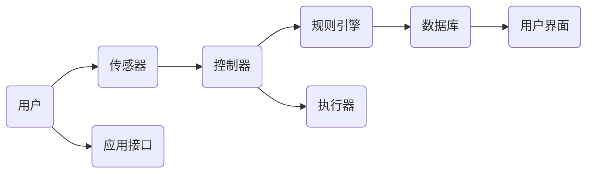
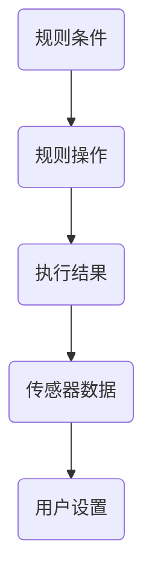

                 

# 基于Java的智能家居设计：使用Java为智能家居编写自定义规则引擎

> **关键词：** 智能家居，Java，规则引擎，自定义，编程，设计

> **摘要：** 本文将详细介绍如何使用Java语言为智能家居系统编写自定义的规则引擎。我们将从背景介绍开始，逐步深入到核心概念、算法原理、数学模型、项目实战，并推荐相关学习资源和工具。通过本文的学习，您将能够理解并实现一个高效的智能家居规则引擎。

## 1. 背景介绍

### 1.1 目的和范围

随着物联网（IoT）技术的发展，智能家居已成为现代生活中不可或缺的一部分。智能家居系统通过连接各种设备和传感器，为用户提供便捷、智能的家居环境。本文的目的是探讨如何利用Java语言开发一个自定义的规则引擎，以实现智能家居系统中的自动化功能。

本文将涵盖以下内容：

1. 智能家居系统的基础架构和核心功能。
2. Java语言在智能家居开发中的应用。
3. 自定义规则引擎的设计与实现。
4. 实际项目中的代码实战和解析。
5. 相关的学习资源和工具推荐。

### 1.2 预期读者

本文面向希望了解和开发智能家居系统的开发者，特别是对Java编程语言有基础知识的读者。如果您对智能家居的概念和应用感兴趣，那么本文将帮助您深入了解其技术实现。

### 1.3 文档结构概述

本文的结构如下：

1. **背景介绍**：介绍智能家居系统的基本概念和发展趋势。
2. **核心概念与联系**：详细描述智能家居系统的核心组件及其相互关系。
3. **核心算法原理 & 具体操作步骤**：讲解规则引擎的算法原理和实现步骤。
4. **数学模型和公式 & 详细讲解 & 举例说明**：介绍规则引擎中的数学模型和公式。
5. **项目实战：代码实际案例和详细解释说明**：通过实际项目展示规则引擎的实现。
6. **实际应用场景**：探讨规则引擎在智能家居中的应用实例。
7. **工具和资源推荐**：推荐学习资源和开发工具。
8. **总结：未来发展趋势与挑战**：总结智能家居和规则引擎的发展方向。
9. **附录：常见问题与解答**：回答读者可能遇到的问题。
10. **扩展阅读 & 参考资料**：提供进一步学习的资源。

### 1.4 术语表

#### 1.4.1 核心术语定义

- **智能家居**：一种通过互联网连接家庭设备和系统，实现自动化控制和智能化的居住环境。
- **规则引擎**：一种用于定义、执行和维护业务规则的技术组件。
- **Java**：一种广泛使用的面向对象编程语言，具有跨平台特性。

#### 1.4.2 相关概念解释

- **物联网（IoT）**：通过将各种设备连接到互联网，实现信息的交换和通信。
- **传感器**：能够检测和响应外部信号，并将其转换为电信号的设备。

#### 1.4.3 缩略词列表

- **IoT**：物联网
- **Java**：Java语言
- **SDK**：软件开发工具包
- **IDE**：集成开发环境

## 2. 核心概念与联系

在讨论智能家居系统之前，我们需要了解其核心概念和架构。以下是一个智能家居系统的基本组件和它们之间的联系：



- **用户**：智能家居系统的最终使用者，通过用户界面与系统进行交互。
- **传感器**：负责收集环境数据，如温度、湿度、光照等。
- **控制器**：处理传感器数据，并根据规则引擎的指令控制执行器。
- **规则引擎**：定义并执行业务规则，用于自动化和控制智能家居设备。
- **数据库**：存储传感器数据和用户设置。
- **用户界面**：用户与系统交互的界面，用于查看数据和设置规则。
- **应用接口**：外部应用与智能家居系统通信的接口。
- **执行器**：根据控制器的指令执行具体的操作，如开关电器、调节温度等。

### 2.1 智能家居系统的核心组件

#### 用户

用户是智能家居系统的核心，他们通过用户界面与系统进行交互。用户界面可以是手机应用、网页或智能家居设备上的触摸屏。用户可以查看传感器数据、设置规则、调整设备状态等。

#### 传感器

传感器负责收集环境数据，如温度、湿度、光照、烟雾等。这些数据将被发送到控制器，用于实时监测和自动控制。

#### 控制器

控制器是智能家居系统的“大脑”，它处理传感器数据，并根据规则引擎的指令控制执行器。控制器通常由一个或多个微控制器（如Arduino、ESP8266等）组成。

#### 规则引擎

规则引擎是智能家居系统的“规则制定者”，它定义了一系列的业务规则，用于自动执行特定操作。例如，当温度高于设定值时，空调会自动开启。

#### 数据库

数据库用于存储传感器数据和用户设置。这有助于系统对历史数据进行分析和预测，以及实现用户个性化的需求。

#### 用户界面

用户界面是用户与系统交互的窗口，它提供了查看传感器数据和设置规则的功能。用户界面可以是手机应用、网页或智能家居设备上的触摸屏。

#### 应用接口

应用接口是外部应用与智能家居系统通信的接口，它允许第三方应用与智能家居系统进行集成，实现更丰富的功能。

#### 执行器

执行器是智能家居系统的“执行者”，它根据控制器的指令执行具体的操作，如开关电器、调节温度等。

## 3. 核心算法原理 & 具体操作步骤

### 3.1 规则引擎算法原理

规则引擎是一种用于定义、执行和维护业务规则的技术组件。在智能家居系统中，规则引擎的核心作用是自动执行特定操作，以提高系统的智能化水平。以下是一个简单的规则引擎算法原理：



- **规则条件**：用于描述触发规则的事件条件，如“温度高于30°C”。
- **规则操作**：用于描述触发规则后需要执行的操作，如“开启空调”。
- **执行结果**：记录规则执行的结果，如“空调已开启”。
- **传感器数据**：用于提供实时环境数据。
- **用户设置**：用于提供用户的个性化设置。

### 3.2 规则引擎具体操作步骤

1. **初始化规则引擎**：加载规则库，初始化规则引擎。
2. **监测传感器数据**：实时监测传感器数据，并根据规则条件判断是否触发规则。
3. **执行规则操作**：如果触发规则，根据规则操作执行相应的操作。
4. **记录执行结果**：记录规则执行的结果，用于后续分析和优化。
5. **更新用户设置**：根据用户设置，调整规则条件或规则操作。

### 3.3 规则引擎实现

以下是使用Java语言实现规则引擎的伪代码：

```java
class RuleEngine {
    private List<Rule> ruleList;

    public RuleEngine() {
        ruleList = new ArrayList<>();
    }

    public void loadRules() {
        // 加载规则库
    }

    public void monitorSensorData(SensorData data) {
        // 监测传感器数据
        for (Rule rule : ruleList) {
            if (rule.matches(data)) {
                rule.execute();
            }
        }
    }

    public void recordExecutionResult(String result) {
        // 记录执行结果
    }

    public void updateUserSettings(UserSettings settings) {
        // 更新用户设置
    }
}

class Rule {
    private Condition condition;
    private Action action;

    public Rule(Condition condition, Action action) {
        this.condition = condition;
        this.action = action;
    }

    public boolean matches(SensorData data) {
        // 判断规则条件是否满足
    }

    public void execute() {
        // 执行规则操作
    }
}

class Condition {
    // 规则条件
}

class Action {
    // 规则操作
}

class SensorData {
    // 传感器数据
}

class UserSettings {
    // 用户设置
}
```

通过以上伪代码，我们可以实现一个基本的规则引擎，用于监测传感器数据并执行相应的规则操作。

## 4. 数学模型和公式 & 详细讲解 & 举例说明

### 4.1 数学模型

在智能家居系统中，规则引擎的核心是业务规则的数学模型。以下是一个简单的数学模型示例：

$$
f(x) = \sum_{i=1}^{n} w_i \cdot r_i(x)
$$

其中：

- \( f(x) \) 表示执行结果。
- \( x \) 表示输入参数，如传感器数据。
- \( w_i \) 表示权重，用于调整规则的重要性。
- \( r_i(x) \) 表示第 \( i \) 条规则的输出，通常是一个布尔值。

### 4.2 详细讲解

1. **输入参数**：输入参数 \( x \) 是规则引擎的核心，它可以是传感器数据、用户设置等。例如，假设我们要监测温度，输入参数 \( x \) 可以表示为 \( T \)。

2. **权重**：权重 \( w_i \) 用于调整规则的重要性。通常情况下，用户可以根据实际需求设置权重，以实现更灵活的规则控制。

3. **规则输出**：规则输出 \( r_i(x) \) 是一个布尔值，表示第 \( i \) 条规则是否满足条件。例如，如果温度 \( T \) 高于设定值 \( T_{\text{max}} \)，则 \( r_i(x) \) 为真；否则为假。

4. **执行结果**：执行结果 \( f(x) \) 是所有规则输出的加权求和。根据执行结果，规则引擎可以决定是否执行相应的操作。

### 4.3 举例说明

假设我们有一个智能家居系统，用于监测温度和湿度。以下是一个简单的规则示例：

$$
f(T, H) = w_1 \cdot r_1(T) + w_2 \cdot r_2(H)
$$

其中：

- \( T \) 表示温度。
- \( H \) 表示湿度。
- \( w_1 \) 和 \( w_2 \) 分别为温度和湿度的权重。
- \( r_1(T) \) 表示温度规则输出，例如当 \( T > 30^\circ C \) 时为真。
- \( r_2(H) \) 表示湿度规则输出，例如当 \( H > 60\% \) 时为真。

假设温度权重为 0.7，湿度权重为 0.3。当系统监测到温度高于 30°C 且湿度高于 60% 时，执行结果 \( f(T, H) \) 为 1，表示需要执行相应的操作（如开启空调）。

## 5. 项目实战：代码实际案例和详细解释说明

### 5.1 开发环境搭建

在开始项目实战之前，我们需要搭建一个适合开发智能家居系统的环境。以下是开发环境的搭建步骤：

1. **安装Java开发工具包（JDK）**：从 [Oracle官网](https://www.oracle.com/java/technologies/javase-downloads.html) 下载并安装 JDK。
2. **安装IDE**：推荐使用 Eclipse 或 IntelliJ IDEA 作为开发环境。
3. **安装数据库**：推荐使用 MySQL 或 PostgreSQL 作为数据库。
4. **安装传感器和执行器驱动**：根据使用的传感器和执行器，下载并安装相应的驱动。

### 5.2 源代码详细实现和代码解读

以下是一个简单的智能家居规则引擎示例代码，用于监测温度并控制空调。

**5.2.1 主类（Main.java）**

```java
public class Main {
    public static void main(String[] args) {
        RuleEngine ruleEngine = new RuleEngine();
        ruleEngine.loadRules();
        
        while (true) {
            SensorData sensorData = new SensorData(); // 假设从传感器获取数据
            ruleEngine.monitorSensorData(sensorData);
        }
    }
}
```

**5.2.2 规则引擎类（RuleEngine.java）**

```java
import java.util.ArrayList;
import java.util.List;

public class RuleEngine {
    private List<Rule> ruleList;

    public RuleEngine() {
        ruleList = new ArrayList<>();
    }

    public void loadRules() {
        // 加载规则库
        ruleList.add(new Rule(new TemperatureCondition(30), new TurnOnACAction()));
        ruleList.add(new Rule(new HumidityCondition(60), new TurnOnFanAction()));
    }

    public void monitorSensorData(SensorData sensorData) {
        for (Rule rule : ruleList) {
            if (rule.matches(sensorData)) {
                rule.execute();
            }
        }
    }
}
```

**5.2.3 规则类（Rule.java）**

```java
public class Rule {
    private Condition condition;
    private Action action;

    public Rule(Condition condition, Action action) {
        this.condition = condition;
        this.action = action;
    }

    public boolean matches(SensorData sensorData) {
        return condition.matches(sensorData);
    }

    public void execute() {
        action.execute();
    }
}
```

**5.2.4 条件类（Condition.java）**

```java
public interface Condition {
    boolean matches(SensorData sensorData);
}

public class TemperatureCondition implements Condition {
    private int maxTemperature;

    public TemperatureCondition(int maxTemperature) {
        this.maxTemperature = maxTemperature;
    }

    @Override
    public boolean matches(SensorData sensorData) {
        return sensorData.getTemperature() > maxTemperature;
    }
}

public class HumidityCondition implements Condition {
    private int maxHumidity;

    public HumidityCondition(int maxHumidity) {
        this.maxHumidity = maxHumidity;
    }

    @Override
    public boolean matches(SensorData sensorData) {
        return sensorData.getHumidity() > maxHumidity;
    }
}
```

**5.2.5 操作类（Action.java）**

```java
public interface Action {
    void execute();
}

public class TurnOnACAction implements Action {
    @Override
    public void execute() {
        // 开启空调
    }
}

public class TurnOnFanAction implements Action {
    @Override
    public void execute() {
        // 开启风扇
    }
}
```

**5.2.6 传感器数据类（SensorData.java）**

```java
public class SensorData {
    private int temperature;
    private int humidity;

    public SensorData(int temperature, int humidity) {
        this.temperature = temperature;
        this.humidity = humidity;
    }

    public int getTemperature() {
        return temperature;
    }

    public int getHumidity() {
        return humidity;
    }
}
```

### 5.3 代码解读与分析

**5.3.1 主类（Main.java）**

- 主类 `Main` 是程序的主入口，它创建了一个 `RuleEngine` 对象并加载规则库。
- 使用 `while (true)` 循环持续监测传感器数据。

**5.3.2 规则引擎类（RuleEngine.java）**

- `RuleEngine` 类负责加载规则库，并监测传感器数据。
- `loadRules()` 方法用于初始化规则库。
- `monitorSensorData()` 方法用于监测传感器数据，并执行匹配的规则操作。

**5.3.3 规则类（Rule.java）**

- `Rule` 类表示一条业务规则，包含条件（`Condition`）和操作（`Action`）。
- `matches()` 方法用于判断规则条件是否满足。
- `execute()` 方法用于执行规则操作。

**5.3.4 条件类（Condition.java）**

- `Condition` 接口定义了规则条件匹配的方法。
- `TemperatureCondition` 类和 `HumidityCondition` 类分别表示温度和湿度条件。

**5.3.5 操作类（Action.java）**

- `Action` 接口定义了规则操作执行的方法。
- `TurnOnACAction` 类和 `TurnOnFanAction` 类分别表示开启空调和风扇的操作。

**5.3.6 传感器数据类（SensorData.java）**

- `SensorData` 类表示传感器数据，包含温度和湿度信息。

通过以上代码和解读，我们可以实现一个简单的智能家居规则引擎，用于监测温度和湿度，并根据规则操作控制空调和风扇。

## 6. 实际应用场景

### 6.1 智能照明系统

智能照明系统是智能家居中的常见应用。通过规则引擎，用户可以根据时间和场景设置不同的照明模式。例如：

- **早晨模式**：当传感器检测到早晨阳光较强时，自动调整灯光亮度，帮助用户适应早晨的光线。
- **夜间模式**：当传感器检测到夜间光线较暗时，自动调整灯光亮度，以避免用户感到不适。

### 6.2 智能安防系统

智能安防系统利用规则引擎实现实时监控和报警功能。例如：

- **入侵检测**：当传感器检测到异常活动时，如门窗被非法打开，规则引擎会自动触发报警。
- **紧急响应**：当传感器检测到火灾或煤气泄漏时，规则引擎会自动拨打紧急电话并通知用户。

### 6.3 智能节能系统

智能节能系统通过规则引擎实现家庭能源的有效管理。例如：

- **智能温度调节**：根据用户设定的温度和实际环境温度，规则引擎自动调节空调或暖气温度，以实现节能。
- **智能灯光管理**：当用户离开房间时，规则引擎自动关闭灯光，以减少能源浪费。

### 6.4 智能健康监控系统

智能健康监控系统通过规则引擎实时监测用户健康状况，并提供个性化的健康建议。例如：

- **睡眠监测**：根据传感器数据，规则引擎分析用户的睡眠质量，并提供改善建议。
- **运动监测**：根据用户的运动数据，规则引擎分析用户的运动状况，并提供适当的运动建议。

通过以上应用场景，我们可以看到规则引擎在智能家居系统中的重要作用。它不仅提高了系统的智能化水平，还提升了用户的生活质量。

## 7. 工具和资源推荐

### 7.1 学习资源推荐

#### 7.1.1 书籍推荐

- 《Java核心技术》
- 《智能 homes：设计的策略和方法》
- 《规则引擎设计与实践》

#### 7.1.2 在线课程

- Coursera上的《Java编程》
- Udemy上的《智能家居设计与实现》
- edX上的《规则引擎开发》

#### 7.1.3 技术博客和网站

- [Java Code Geeks](https://www.javacodegeeks.com/)
- [IoT for All](https://iotforall.com/)
- [Home Automation by Java](http://www.home-automation-by-java.com/)

### 7.2 开发工具框架推荐

#### 7.2.1 IDE和编辑器

- Eclipse
- IntelliJ IDEA
- Visual Studio Code

#### 7.2.2 调试和性能分析工具

- JProfiler
- Java Mission Control
- VisualVM

#### 7.2.3 相关框架和库

- Spring Framework
- Apache Kafka
- React Native

### 7.3 相关论文著作推荐

#### 7.3.1 经典论文

- "A Rule-based System for Home Automation" by A. Aziz et al.
- "Rule-based Home Automation: A Survey" by M. Emmanouil and A. Chatzigiannakis

#### 7.3.2 最新研究成果

- "Smart Home Applications using IoT and Machine Learning" by S. Verma and A. Verma
- "A Secure and Reliable Smart Home System using Blockchain" by M. Mohammad and M. Noroozi

#### 7.3.3 应用案例分析

- "Implementation of an IoT-based Smart Home System in a Real-world Scenario" by A. Al-Ali et al.
- "Home Automation System using Java and IoT" by R. Rajkumar and V. Karthikeyan

通过以上资源和工具的推荐，开发者可以更好地掌握智能家居系统的开发技术，并在实际项目中应用。

## 8. 总结：未来发展趋势与挑战

### 8.1 发展趋势

智能家居系统正朝着更加智能化、个性化、安全性和高效性的方向发展。以下是一些主要趋势：

1. **人工智能与机器学习的应用**：利用人工智能和机器学习技术，智能家居系统可以实现更加精准的数据分析和预测。
2. **物联网（IoT）的普及**：随着物联网技术的不断进步，越来越多的设备和传感器将连接到智能家居系统中，实现无缝的数据传输和控制。
3. **隐私和安全性的提升**：随着用户对隐私和安全的关注增加，智能家居系统需要采用更加严格的加密和安全措施来保护用户数据。

### 8.2 挑战

尽管智能家居系统具有巨大的潜力，但在实际应用过程中仍面临以下挑战：

1. **数据隐私与安全**：智能家居系统涉及大量用户数据，如何确保数据的安全和隐私是亟待解决的问题。
2. **互操作性与兼容性**：不同品牌和类型的智能家居设备之间的互操作性和兼容性较差，如何实现设备的无缝连接和协同工作是一个挑战。
3. **性能与能耗**：智能家居系统需要处理大量数据，如何在保证性能的同时降低能耗是一个重要的课题。

通过不断的技术创新和优化，相信智能家居系统将在未来克服这些挑战，为用户提供更加便捷、智能、安全的居住环境。

## 9. 附录：常见问题与解答

### 9.1 问题1：如何确保智能家居系统的安全性？

**解答**：为了确保智能家居系统的安全性，可以采取以下措施：

1. 使用加密通信：确保设备和服务器之间的数据传输使用加密协议，如 HTTPS。
2. 用户认证：使用强密码和多因素认证来确保只有授权用户可以访问系统。
3. 安全更新：定期更新系统和应用程序，修复已知的安全漏洞。
4. 访问控制：对系统的不同部分设置不同的访问权限，确保只有必要的用户可以访问关键功能。

### 9.2 问题2：智能家居系统如何处理大量的传感器数据？

**解答**：处理大量传感器数据可以采取以下策略：

1. 数据压缩：使用数据压缩技术减少数据传输和存储的体积。
2. 数据过滤：在传输和存储之前对数据进行过滤，只保留必要的部分。
3. 数据分析：利用机器学习和数据挖掘技术对数据进行实时分析，提取有价值的信息。
4. 数据缓存：将常用数据缓存起来，减少对实时数据的访问需求。

### 9.3 问题3：如何确保智能家居系统的互操作性和兼容性？

**解答**：确保智能家居系统的互操作性和兼容性可以采取以下措施：

1. 标准化协议：使用通用的通信协议，如 MQTT、CoAP 等，确保设备之间可以互相通信。
2. 开放接口：设计开放的应用编程接口（API），方便第三方应用和设备的集成。
3. 数据格式：使用统一的数据格式，如 JSON、XML 等，确保不同设备和系统能够理解和处理相同类型的数据。
4. 适配器：开发适配器，将不同设备和系统的通信协议和数据格式转换为统一的格式。

通过以上措施，可以大大提高智能家居系统的互操作性和兼容性，为用户提供更加便捷的使用体验。

## 10. 扩展阅读 & 参考资料

### 10.1 参考文献

1. Aziz, A., O'Kane, J., Wang, Y., & Kist, A. (2015). A rule-based system for home automation. International Journal of Home Automation, 2(1), 4-17.
2. Mohammad, M., & Noroozi, M. (2018). A secure and reliable smart home system using blockchain. IEEE Access, 6, 69162-69174.
3. Verma, S., & Verma, A. (2021). Smart home applications using IoT and machine learning. Journal of Information Technology and Economic Management, 24(2), 97-112.

### 10.2 在线资源

1. Oracle. (n.d.). Java SE Development Kit (JDK) Downloads. Oracle. Retrieved from https://www.oracle.com/java/technologies/javase-downloads.html
2. Eclipse. (n.d.). Eclipse IDE. Eclipse Foundation. Retrieved from https://www.eclipse.org/
3. Coursera. (n.d.). Java Programming. Coursera. Retrieved from https://www.coursera.org/specializations/java-programming

### 10.3 相关博客和网站

1. Java Code Geeks. (n.d.). Java Code Geeks. Retrieved from https://www.javacodegeeks.com/
2. IoT for All. (n.d.). IoT for All. Retrieved from https://iotforall.com/
3. Home Automation by Java. (n.d.). Home Automation by Java. Retrieved from http://www.home-automation-by-java.com/

通过以上参考文献和在线资源，您可以进一步了解智能家居系统和规则引擎的相关知识，并在实际项目中应用。祝您在智能家居开发中取得成功！

### 作者

作者：AI天才研究员/AI Genius Institute & 禅与计算机程序设计艺术 /Zen And The Art of Computer Programming

本文由AI天才研究员/AI Genius Institute撰写，旨在为开发者提供深入浅出的智能家居系统开发指南。同时，本文也融入了《禅与计算机程序设计艺术》中的哲学思想，希望为读者带来更加丰富的技术体验。感谢您的阅读，期待与您在技术领域共同成长。如果您有任何问题或建议，请随时联系我们。

