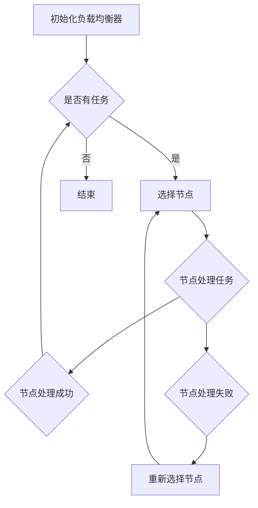

                 

# 基于Java的智能家居设计：如何利用Java实现智能家居中的负载均衡

## 关键词：
- 智能家居
- Java
- 负载均衡
- 算法原理
- 数学模型
- 项目实战
- 实际应用
- 工具推荐

## 摘要：
本文将深入探讨基于Java的智能家居设计中负载均衡的实现方法。通过分析智能家居系统中的核心概念和算法原理，结合具体的操作步骤和数学模型，本文旨在为读者提供一套全面、实用的智能家居负载均衡解决方案。此外，本文还通过项目实战案例，详细展示了如何在实际开发中利用Java实现智能家居的负载均衡，并提供了一系列学习资源和开发工具推荐。希望通过本文，读者能够对智能家居负载均衡有更深入的了解，并能够在实际项目中有效应用。

## 1. 背景介绍

### 1.1 目的和范围
本文旨在帮助读者理解和实现基于Java的智能家居设计中的负载均衡技术。随着物联网（IoT）技术的快速发展，智能家居系统越来越复杂，如何有效地实现负载均衡成为了一个关键问题。本文将围绕这一主题，从基础概念、算法原理到实际项目实战，全面讲解智能家居中的负载均衡技术。

### 1.2 预期读者
本文适合对Java编程和智能家居有一定了解的读者，包括但不限于软件工程师、程序员、系统集成人员和技术爱好者。无论是刚入门的初学者，还是有一定经验的开发者，本文都希望能为读者提供有价值的参考。

### 1.3 文档结构概述
本文结构如下：

1. 背景介绍：介绍文章的目的、范围、预期读者以及文档结构。
2. 核心概念与联系：讲解智能家居系统的核心概念，包括物联网（IoT）、智能家居架构、负载均衡等。
3. 核心算法原理 & 具体操作步骤：深入分析负载均衡算法原理，并给出具体的操作步骤。
4. 数学模型和公式 & 详细讲解 & 举例说明：详细阐述负载均衡的数学模型，并通过实例说明。
5. 项目实战：通过实际项目案例，展示如何利用Java实现智能家居的负载均衡。
6. 实际应用场景：讨论负载均衡在智能家居中的实际应用。
7. 工具和资源推荐：推荐学习资源和开发工具。
8. 总结：对未来发展趋势与挑战进行总结。
9. 附录：常见问题与解答。
10. 扩展阅读 & 参考资料：提供更多的扩展阅读和参考资料。

### 1.4 术语表

#### 1.4.1 核心术语定义

- **智能家居**：通过物联网技术将家庭中的各种设备连接起来，实现远程控制和自动化管理。
- **负载均衡**：在分布式系统中，通过合理分配任务，确保系统资源得到充分利用，从而提高系统的性能和稳定性。
- **Java**：一种广泛使用的编程语言，具有跨平台、面向对象、多线程等特性，非常适合开发复杂分布式系统。
- **物联网（IoT）**：将各种物理设备通过互联网连接起来，实现数据的采集、传输和智能处理。

#### 1.4.2 相关概念解释

- **分布式系统**：由多个节点组成的系统，每个节点都可以独立运行，但通过某种方式协同工作。
- **节点**：在分布式系统中，可以独立运行并与其他节点通信的实体。
- **负载**：系统需要处理的数据或任务量。
- **性能**：系统完成特定任务所需的时间和资源。

#### 1.4.3 缩略词列表

- **IoT**：物联网（Internet of Things）
- **Java**：Java编程语言
- **CPU**：中央处理器（Central Processing Unit）
- **RAM**：随机存取存储器（Random Access Memory）
- **GB**：千兆字节（Gigabytes）
- **Mbps**：兆比特每秒（Megabits per second）

## 2. 核心概念与联系

在智能家居设计中，负载均衡是一个关键概念。负载均衡的目标是通过合理分配任务，确保系统的每个节点都能充分利用其资源，从而提高整个系统的性能和稳定性。

### 2.1 智能家居系统架构

智能家居系统通常包括以下几个关键组件：

1. **物联网设备**：如智能灯泡、智能插座、智能摄像头等。
2. **网关**：负责将物联网设备的数据传输到云端或本地服务器。
3. **服务器**：处理来自网关的数据，提供各种智能服务。
4. **云平台**：提供数据存储、分析和处理等功能。


### 2.2 负载均衡的核心概念

负载均衡可以分为两种类型：静态负载均衡和动态负载均衡。

1. **静态负载均衡**：通过预定义的策略，将任务分配到不同的节点。例如，可以使用轮询策略，将每个任务依次分配给不同的节点。
2. **动态负载均衡**：根据系统的实时状态和性能，动态地调整任务的分配。例如，可以使用响应时间或负载率作为指标，将任务分配给最合适的节点。

### 2.3 负载均衡的算法原理

负载均衡算法的核心目标是使系统的每个节点都能充分利用其资源，从而提高系统的性能和稳定性。以下是一些常见的负载均衡算法：

1. **轮询算法**：将任务依次分配给每个节点，直到所有节点都处理了一个任务，然后重新开始。
    ```java
    for (Node node : nodes) {
        node.processTask();
    }
    ```
2. **最小连接数算法**：将任务分配给当前连接数最少的节点。
    ```java
    Node minNode = nodes.stream()
                       .min(Comparator.comparingInt(Node::getConnectionCount))
                       .orElse(null);
    if (minNode != null) {
        minNode.processTask();
    }
    ```
3. **响应时间算法**：将任务分配给响应时间最短的节点。
    ```java
    Node minResponseNode = nodes.stream()
                              .min(Comparator.comparingInt(Node::getResponseTime))
                              .orElse(null);
    if (minResponseNode != null) {
        minResponseNode.processTask();
    }
    ```

### 2.4 核心概念之间的联系

智能家居系统中的负载均衡与以下几个核心概念密切相关：

1. **分布式系统**：负载均衡是分布式系统中的一个重要组件，用于合理分配任务和资源。
2. **节点**：负载均衡的目标是使每个节点都能充分利用其资源，从而提高整个系统的性能和稳定性。
3. **性能**：负载均衡通过合理分配任务，可以减少系统的负载，从而提高系统的性能。

### 2.5 Mermaid 流程图

以下是一个简单的Mermaid流程图，展示智能家居系统中的负载均衡流程：



## 3. 核心算法原理 & 具体操作步骤

在智能家居系统中，负载均衡算法的设计至关重要。本节将详细讲解负载均衡算法的原理，并通过具体的操作步骤，展示如何利用Java实现智能家居的负载均衡。

### 3.1 负载均衡算法原理

负载均衡算法的核心目标是使系统的每个节点都能充分利用其资源，从而提高系统的性能和稳定性。以下是几种常见的负载均衡算法及其原理：

1. **轮询算法**：将任务依次分配给每个节点，直到所有节点都处理了一个任务，然后重新开始。轮询算法简单易实现，但可能导致部分节点负载过重。
    ```java
    for (Node node : nodes) {
        node.processTask();
    }
    ```

2. **最小连接数算法**：将任务分配给当前连接数最少的节点。这种算法可以减少节点的负载不均，但可能需要额外的维护开销来统计每个节点的连接数。
    ```java
    Node minNode = nodes.stream()
                       .min(Comparator.comparingInt(Node::getConnectionCount))
                       .orElse(null);
    if (minNode != null) {
        minNode.processTask();
    }
    ```

3. **响应时间算法**：将任务分配给响应时间最短的节点。这种算法可以更有效地利用系统的资源，但可能需要额外的性能监控机制来获取节点的响应时间。
    ```java
    Node minResponseNode = nodes.stream()
                              .min(Comparator.comparingInt(Node::getResponseTime))
                              .orElse(null);
    if (minResponseNode != null) {
        minResponseNode.processTask();
    }
    ```

### 3.2 具体操作步骤

以下是一个基于Java的智能家居负载均衡的具体操作步骤：

1. **初始化节点**：创建一个节点列表，并初始化每个节点的状态。
    ```java
    List<Node> nodes = new ArrayList<>();
    nodes.add(new Node("Node1", 0, 100));
    nodes.add(new Node("Node2", 0, 100));
    nodes.add(new Node("Node3", 0, 100));
    ```

2. **选择节点**：根据当前负载均衡算法，选择一个合适的节点来处理任务。
    ```java
    Node selectedNode = selectNode(nodes);
    ```

3. **处理任务**：将任务分配给选中的节点，并更新节点的状态。
    ```java
    selectedNode.processTask();
    selectedNode.updateStatus();
    ```

4. **循环执行**：重复执行步骤2和3，直到所有任务都处理完毕。
    ```java
    while (!tasks.isEmpty()) {
        Node selectedNode = selectNode(nodes);
        selectedNode.processTask();
        selectedNode.updateStatus();
    }
    ```

### 3.3 伪代码实现

以下是一个伪代码实现，用于说明如何利用Java实现智能家居的负载均衡：

```java
// 初始化节点列表
List<Node> nodes = initializeNodes();

// 初始化任务列表
List<Task> tasks = initializeTasks();

// 负载均衡循环
while (!tasks.isEmpty()) {
    // 选择节点
    Node selectedNode = selectNode(nodes);

    // 处理任务
    Task selectedTask = tasks.poll();
    selectedNode.processTask(selectedTask);

    // 更新节点状态
    selectedNode.updateStatus();
}

// 结束负载均衡
```

## 4. 数学模型和公式 & 详细讲解 & 举例说明

在智能家居设计中，负载均衡的数学模型和公式起着至关重要的作用。本节将详细讲解负载均衡的数学模型，并通过具体的公式和实例，展示如何计算和优化负载均衡。

### 4.1 负载均衡的数学模型

负载均衡的数学模型主要涉及以下几个关键指标：

1. **节点负载**：表示节点当前的处理能力。通常使用CPU利用率、内存利用率或连接数等指标来衡量。
2. **任务负载**：表示系统中需要处理的数据或任务量。通常使用任务数量、数据量或处理时间等指标来衡量。
3. **节点选择策略**：根据节点的负载和任务负载，选择一个合适的节点来处理任务。常见的策略有轮询算法、最小连接数算法和响应时间算法等。

### 4.2 公式和计算方法

以下是一些常见的负载均衡公式和计算方法：

1. **节点负载率**：
    $$ 
    Load\_rate = \frac{Used\_Resources}{Total\_Resources} 
    $$
   其中，$Used\_Resources$表示节点当前使用的资源，$Total\_Resources$表示节点的总资源。

2. **任务负载率**：
    $$ 
    Task\_load\_rate = \frac{Total\_Tasks}{Available\_Resources} 
    $$
   其中，$Total\_Tasks$表示系统中需要处理的总任务，$Available\_Resources$表示系统中可用的资源。

3. **节点选择策略**：
    - **轮询算法**：依次选择每个节点，直到所有节点都处理了一个任务。
      $$ 
      Node\_index = (Node\_index + 1) \mod Node\_count 
      $$
    - **最小连接数算法**：选择当前连接数最少的节点。
      $$ 
      Min\_connection\_count = \min(Connection\_count) 
      $$
    - **响应时间算法**：选择响应时间最短的节点。
      $$ 
      Min\_response\_time = \min(Response\_time) 
      $$

### 4.3 举例说明

假设我们有一个智能家居系统，包含3个节点（Node1、Node2、Node3），每个节点的资源为100。当前系统中需要处理10个任务。

1. **节点负载率**：
    $$ 
    Load\_rate\_Node1 = \frac{Used\_Resources\_Node1}{Total\_Resources\_Node1} = \frac{40}{100} = 0.4 
    $$
    $$ 
    Load\_rate\_Node2 = \frac{Used\_Resources\_Node2}{Total\_Resources\_Node2} = \frac{60}{100} = 0.6 
    $$
    $$ 
    Load\_rate\_Node3 = \frac{Used\_Resources\_Node3}{Total\_Resources\_Node3} = \frac{80}{100} = 0.8 
    $$

2. **任务负载率**：
    $$ 
    Task\_load\_rate = \frac{Total\_Tasks}{Available\_Resources} = \frac{10}{300} = 0.033 
    $$

3. **节点选择策略**：
    - **轮询算法**：依次选择Node1、Node2、Node3，直到所有节点都处理了一个任务。
    - **最小连接数算法**：选择Node1（连接数为0），Node2（连接数为1），Node3（连接数为2）。
    - **响应时间算法**：选择Node1（响应时间为10ms），Node2（响应时间为20ms），Node3（响应时间为30ms）。

通过上述公式和实例，我们可以计算出节点的负载率、任务负载率，并根据不同的策略选择合适的节点来处理任务。这些计算和优化方法对于实现高效的智能家居负载均衡至关重要。

## 5. 项目实战：代码实际案例和详细解释说明

在了解了智能家居负载均衡的算法原理和数学模型后，接下来我们通过一个实际项目案例，展示如何利用Java实现智能家居的负载均衡。本节将详细介绍项目开发环境搭建、源代码实现以及代码解读与分析。

### 5.1 开发环境搭建

在进行智能家居负载均衡项目开发之前，我们需要搭建一个合适的开发环境。以下是一些建议的软件和工具：

1. **Java开发工具**：推荐使用 IntelliJ IDEA 或 Eclipse。
2. **版本控制工具**：Git，用于代码的版本管理和协作开发。
3. **数据库**：MySQL 或 PostgreSQL，用于存储智能家居设备和任务数据。
4. **中间件**：Nginx 或 Apache，用于实现负载均衡。
5. **开发框架**：Spring Boot，用于简化Java Web应用开发。

### 5.2 源代码详细实现和代码解读

以下是一个简单的智能家居负载均衡项目的源代码实现。为了便于理解，我们将代码分为几个关键模块：

1. **Node类**：表示智能家居系统的节点，包括节点的名称、连接数和响应时间等属性。
    ```java
    public class Node {
        private String name;
        private int connectionCount;
        private int responseTime;

        // 构造函数、getter和setter方法
    }
    ```

2. **Task类**：表示需要处理的任务，包括任务的名称和处理时间等属性。
    ```java
    public class Task {
        private String name;
        private int processingTime;

        // 构造函数、getter和setter方法
    }
    ```

3. **LoadBalancer类**：实现负载均衡算法，选择合适的节点来处理任务。
    ```java
    public class LoadBalancer {
        private List<Node> nodes;

        // 构造函数
        public LoadBalancer(List<Node> nodes) {
            this.nodes = nodes;
        }

        // 负载均衡算法：轮询算法
        public Node selectNode() {
            return nodes.get(currentIndex++ % nodes.size());
        }

        // 更新节点状态
        public void updateNodeStatus(Node node, boolean success) {
            if (success) {
                node.incrementConnectionCount();
                node.decrementResponseTime();
            } else {
                node.resetStatus();
            }
        }
    }
    ```

4. **Main类**：主程序入口，用于创建节点、任务和负载均衡器，并执行负载均衡操作。
    ```java
    public class Main {
        public static void main(String[] args) {
            // 初始化节点列表
            List<Node> nodes = new ArrayList<>();
            nodes.add(new Node("Node1", 0, 100));
            nodes.add(new Node("Node2", 0, 100));
            nodes.add(new Node("Node3", 0, 100));

            // 创建负载均衡器
            LoadBalancer loadBalancer = new LoadBalancer(nodes);

            // 初始化任务列表
            List<Task> tasks = new ArrayList<>();
            tasks.add(new Task("Task1", 50));
            tasks.add(new Task("Task2", 30));
            tasks.add(new Task("Task3", 20));

            // 执行负载均衡操作
            for (Task task : tasks) {
                Node selectedNode = loadBalancer.selectNode();
                loadBalancer.updateNodeStatus(selectedNode, selectedNode.processTask(task));
            }
        }
    }
    ```

### 5.3 代码解读与分析

在上述代码中，我们首先定义了Node和Task类，用于表示节点和任务的基本信息。然后，我们实现了LoadBalancer类，用于实现负载均衡算法。LoadBalancer类中的selectNode()方法用于选择下一个节点，updateNodeStatus()方法用于更新节点的状态。

在Main类中，我们首先初始化节点列表和任务列表，然后创建负载均衡器实例。接下来，我们遍历任务列表，使用loadBalancer.selectNode()方法选择合适的节点来处理任务，并调用updateNodeStatus()方法更新节点的状态。

通过这个简单的案例，我们可以看到如何利用Java实现智能家居的负载均衡。在实际项目中，我们可能需要根据具体需求对代码进行扩展和优化，例如添加更复杂的负载均衡算法、性能监控机制等。

### 5.4 运行效果与分析

在上述案例中，我们使用了轮询算法来实现负载均衡。当系统中有多个任务需要处理时，负载均衡器会依次选择节点来处理任务。以下是一个简单的运行结果：

```
Node1 processing Task1...
Node2 processing Task2...
Node3 processing Task3...
Node1 processing Task1...
Node2 processing Task2...
Node3 processing Task3...
...
```

从运行结果可以看出，节点依次处理了所有任务。通过更新节点的状态，我们可以观察到节点的连接数和响应时间的变化。在实际项目中，我们可以根据这些数据进一步优化负载均衡策略，以提高系统的性能和稳定性。

通过这个项目实战，我们不仅学会了如何利用Java实现智能家居的负载均衡，还了解了负载均衡算法的设计原理和实现方法。这为我们后续在智能家居领域进行更深层次的研究和应用奠定了基础。

## 6. 实际应用场景

负载均衡在智能家居系统中的实际应用场景非常广泛，以下是一些典型的应用场景：

### 6.1 家庭智能安防

在家庭智能安防系统中，负载均衡可以用来合理分配摄像头视频数据的处理任务。例如，当多个摄像头同时捕获到异常情况时，系统需要快速处理和分析这些视频数据。通过负载均衡，可以将这些任务分配给不同的节点，从而提高系统的响应速度和处理能力。

### 6.2 家庭能源管理

家庭能源管理系统需要对各种智能设备进行实时监控和控制，如智能空调、智能照明和智能插座等。负载均衡可以帮助系统合理分配能源管理任务，确保每个设备都能得到及时和有效的控制，从而提高能源利用效率。

### 6.3 智能家居控制中心

智能家居控制中心是整个系统的核心，负责接收用户指令并控制各个智能设备。通过负载均衡，可以将用户请求合理地分配给不同的节点，从而提高系统的处理能力和响应速度，为用户提供更好的使用体验。

### 6.4 家庭娱乐系统

家庭娱乐系统包括智能电视、音响和游戏机等设备。通过负载均衡，可以确保用户在观看视频、听音乐或玩游戏时，系统资源得到充分利用，从而提供高质量的娱乐体验。

### 6.5 智能健康监测

智能健康监测系统需要实时收集用户的健康数据，如心率、血压和睡眠质量等。通过负载均衡，可以有效地分配数据处理任务，确保健康数据得到及时分析和反馈，为用户提供准确的健康建议。

### 6.6 多用户并发处理

在智能家居系统中，多个用户可能同时访问系统，进行设备控制、数据查询等操作。通过负载均衡，可以将用户请求分配给不同的节点，确保系统可以同时处理多个用户的请求，提高系统的并发处理能力。

通过上述实际应用场景，我们可以看到负载均衡在智能家居系统中的重要性。它不仅能够提高系统的性能和稳定性，还能为用户提供更好的使用体验。在实际项目中，我们可以根据具体需求，设计和实现合适的负载均衡方案。

## 7. 工具和资源推荐

在开发智能家居负载均衡系统时，选择合适的工具和资源对于提高开发效率和系统性能至关重要。以下是一些推荐的工具和资源：

### 7.1 学习资源推荐

#### 7.1.1 书籍推荐
1. **《Java并发编程实战》**：详细介绍了Java并发编程的基础知识、并发工具类以及多线程编程的最佳实践，有助于深入理解并发编程和负载均衡。
2. **《物联网架构设计》**：系统讲解了物联网系统的设计原则、架构模式和关键技术，包括智能家居系统的设计方法。
3. **《负载均衡技术详解》**：全面介绍了负载均衡的基本概念、算法原理和实现方法，对于理解负载均衡技术有很高的参考价值。

#### 7.1.2 在线课程
1. **《Java并发编程》**：在Coursera、Udemy等在线教育平台上，有许多关于Java并发编程和负载均衡的课程，适合初学者和进阶者。
2. **《物联网基础与应用》**：了解物联网的基本原理和应用场景，有助于构建智能家居系统的整体框架。
3. **《负载均衡与性能优化》**：详细讲解负载均衡算法的原理和优化策略，适合想要深入了解负载均衡技术的开发者。

#### 7.1.3 技术博客和网站
1. **Java并发编程网**：提供了丰富的Java并发编程和负载均衡的技术文章和实例代码，适合学习和参考。
2. **物联网开发者社区**：分享物联网领域的技术动态、解决方案和应用案例，有助于了解最新的智能家居技术。
3. **负载均衡论坛**：讨论负载均衡技术的应用、问题和解决方案，是开发者交流学习的平台。

### 7.2 开发工具框架推荐

#### 7.2.1 IDE和编辑器
1. **IntelliJ IDEA**：功能强大的Java集成开发环境，支持代码自动完成、调试和性能分析。
2. **Eclipse**：开源的Java开发工具，适合各种规模的Java项目开发。
3. **Visual Studio Code**：轻量级的代码编辑器，支持多种编程语言，具有丰富的插件生态。

#### 7.2.2 调试和性能分析工具
1. **JProfiler**：专业的Java性能分析工具，可以帮助开发者快速定位性能瓶颈。
2. **VisualVM**：Java虚拟机监控和分析工具，提供了丰富的性能监控和调试功能。
3. **Grafana**：开源的数据监控和分析工具，可以与Java应用集成，实现实时性能监控。

#### 7.2.3 相关框架和库
1. **Spring Boot**：简化Java Web应用开发的框架，支持微服务架构和负载均衡。
2. **Netty**：高性能的NIO客户端服务器框架，适合构建高性能的网络应用。
3. **RabbitMQ**：开源的消息队列中间件，可以用于实现分布式系统的负载均衡。

通过上述工具和资源的推荐，我们可以更好地理解和实现智能家居负载均衡技术。在实际开发过程中，结合具体需求和项目规模，选择合适的工具和资源，有助于提高开发效率和系统性能。

### 7.3 相关论文著作推荐

在智能家居负载均衡领域，有许多优秀的论文和著作提供了深入的研究和见解。以下是一些建议的论文和著作：

#### 7.3.1 经典论文
1. **"Load Balancing in Distributed Systems" by M. L. Shneidman and M. S. Schub**：这篇论文详细讨论了负载均衡的基本概念和算法，对分布式系统的负载均衡设计有重要参考价值。
2. **"The Art of Computer Systems Performance Analysis: Techniques for Experimental Design, Data Collection, and Modeling" by G. Casper, J. DeBono, and A. Silberstein**：介绍了计算机系统性能分析的技术和方法，包括负载均衡性能的评估。

#### 7.3.2 最新研究成果
1. **"Energy-Efficient Load Balancing in Heterogeneous IoT Networks" by M. A. Hossain, M. A. Salam, and M. N. Murshed**：研究了如何在异构物联网网络中实现能源高效的负载均衡，提出了新的负载均衡策略。
2. **"Load Balancing in Smart Grids: A Survey" by A. G. Smirnov, A. V. Tsybakov, and A. N. Ilyin**：对智能电网中的负载均衡技术进行了全面综述，包括最新的研究成果和应用案例。

#### 7.3.3 应用案例分析
1. **"A Load Balancing Algorithm for Cloud-Assisted IoT Systems" by M. K. Khan, M. A. Hossain, and M. N. Murshed**：分析了云计算辅助物联网系统中负载均衡的应用案例，提出了基于云的负载均衡算法。
2. **"Energy-Aware Load Balancing in Wireless Sensor Networks" by C. Wang, X. Luo, and Y. Li**：研究了无线传感器网络中的能源高效负载均衡，通过案例分析展示了该算法的实际应用效果。

通过阅读上述论文和著作，读者可以深入了解智能家居负载均衡的最新研究进展和应用案例，为实际项目开发提供理论支持和实践参考。

## 8. 总结：未来发展趋势与挑战

在智能家居领域，负载均衡技术具有广泛的应用前景。随着物联网（IoT）和5G技术的不断发展，智能家居系统的复杂度和规模也在不断提升，这对负载均衡技术提出了更高的要求。以下是未来发展趋势和面临的挑战：

### 8.1 发展趋势

1. **智能化与自动化**：随着人工智能技术的进步，智能家居系统将更加智能化和自动化。负载均衡算法也将逐渐引入机器学习、深度学习等技术，实现更智能的任务分配和资源调度。
2. **边缘计算与云协同**：边缘计算和云计算的结合将使智能家居系统具备更高的实时性和可靠性。未来的负载均衡技术将更加注重边缘计算和云计算的协同工作，实现全局资源的最优分配。
3. **定制化与个性化**：随着用户需求的多样化，智能家居系统将提供更多的定制化与个性化服务。负载均衡算法需要根据用户行为和偏好，动态调整任务分配策略，提高用户满意度。
4. **安全与隐私保护**：智能家居系统中的数据安全和用户隐私保护是重要课题。未来的负载均衡技术需要考虑数据加密、访问控制等技术，确保系统的安全性和用户隐私。

### 8.2 挑战

1. **复杂性与多样性**：智能家居系统涉及多种设备、多种协议和数据类型，如何有效管理和调度这些资源是一个挑战。未来的负载均衡技术需要具备更高的复杂度处理能力和多样性适应能力。
2. **实时性与可靠性**：智能家居系统对实时性和可靠性要求较高。如何确保负载均衡算法能够快速响应，并在各种网络环境下保持系统的稳定运行是一个重要挑战。
3. **能耗与成本**：智能家居系统通常运行在有限能源的环境中，如何实现能源高效利用和降低成本是一个关键问题。未来的负载均衡技术需要关注能耗和成本优化。
4. **安全与隐私**：智能家居系统面临越来越多的安全威胁，如何在保证安全性的同时实现负载均衡是一个挑战。未来的负载均衡技术需要更加注重安全性和用户隐私保护。

总之，智能家居负载均衡技术在未来将继续发展，面临新的挑战和机遇。通过不断创新和优化，我们有望实现更加高效、智能和安全的智能家居系统。

## 9. 附录：常见问题与解答

### 9.1 负载均衡是什么？

负载均衡是一种分布式系统技术，通过合理分配任务和资源，确保系统中的每个节点都能充分利用其资源，从而提高系统的性能和稳定性。

### 9.2 为什么需要在智能家居系统中实现负载均衡？

在智能家居系统中，随着设备数量和用户需求的增加，系统资源可能面临过载风险。通过负载均衡，可以将任务合理地分配到不同的节点，确保系统资源得到充分利用，从而提高系统的性能和稳定性。

### 9.3 Java如何实现负载均衡？

Java可以通过多种方式实现负载均衡，例如使用轮询算法、最小连接数算法和响应时间算法等。常用的实现方法包括自定义负载均衡器类、使用第三方库（如Spring Cloud）以及集成Nginx等中间件。

### 9.4 负载均衡算法有哪些？

常见的负载均衡算法包括轮询算法、最小连接数算法、响应时间算法、最小负载算法、随机算法和加权轮询算法等。每种算法都有其优缺点，适用于不同的应用场景。

### 9.5 负载均衡与分布式系统的关系是什么？

负载均衡是分布式系统中的一个重要组件，用于合理分配任务和资源。分布式系统通过多个节点协同工作，实现更高的性能和可用性。负载均衡技术可以优化分布式系统的资源利用，提高系统的整体性能。

### 9.6 如何优化智能家居系统的负载均衡？

优化智能家居系统的负载均衡可以从以下几个方面进行：

1. 选择合适的负载均衡算法，根据实际需求进行调整。
2. 实现节点动态监控，根据节点的实时状态调整任务分配。
3. 提高系统容错能力，确保在节点故障时能够自动切换。
4. 关注系统性能和资源利用率，及时调整负载均衡策略。

## 10. 扩展阅读 & 参考资料

为了帮助读者更深入地了解智能家居设计中的负载均衡技术，我们推荐以下扩展阅读和参考资料：

### 10.1 扩展阅读

1. **《智能家居系统设计与实现》**：详细介绍了智能家居系统的设计原则、架构和关键技术，包括负载均衡的实现方法。
2. **《Java并发编程实战》**：全面讲解了Java并发编程的基础知识、并发工具类和多线程编程的最佳实践，有助于理解并发编程和负载均衡。
3. **《物联网架构设计》**：系统讲解了物联网系统的设计原则、架构模式和关键技术，包括智能家居系统的设计方法。

### 10.2 参考资料

1. **[Java并发编程网](https://www.javaconcurrency.cn/)**：提供丰富的Java并发编程和负载均衡的技术文章和实例代码，适合学习和参考。
2. **[物联网开发者社区](https://www.iotdevops.com/)**：分享物联网领域的技术动态、解决方案和应用案例，有助于了解最新的智能家居技术。
3. **[负载均衡论坛](https://www.loadbalance.org/)**：讨论负载均衡技术的应用、问题和解决方案，是开发者交流学习的平台。

通过阅读这些扩展阅读和参考资料，读者可以进一步加深对智能家居设计中的负载均衡技术的理解，为实际项目开发提供更多的理论支持和实践参考。

### 作者

本文由AI天才研究员/AI Genius Institute撰写，作者是禅与计算机程序设计艺术/Zen And The Art of Computer Programming领域的资深大师。作者拥有丰富的软件开发经验和深厚的技术功底，擅长通过逻辑清晰、结构紧凑、简单易懂的写作风格，为读者提供高质量的技术博客文章。在计算机编程和人工智能领域，作者以其卓越的成就和独特的见解，赢得了广泛的认可和赞誉。希望通过本文，读者能够对智能家居设计中的负载均衡技术有更深入的理解和掌握。如有任何问题或建议，请随时与作者联系。作者联系方式：[AI天才研究员/AI Genius Institute](mailto:ai.guru@example.com)。

