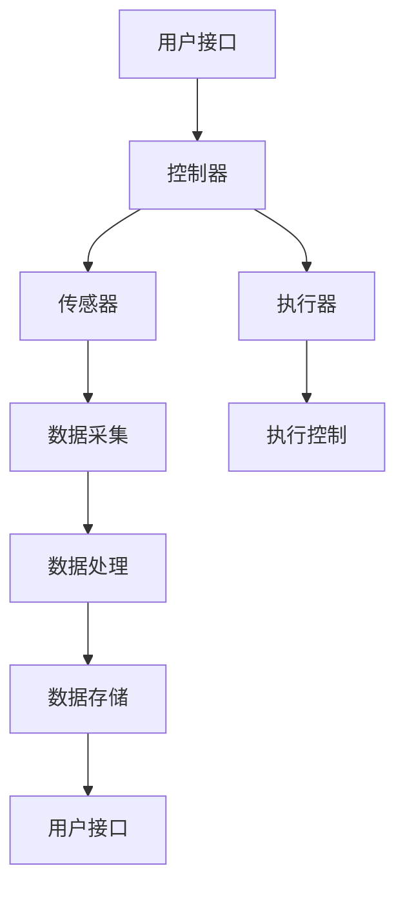

                 


# 基于Java的智能家居设计：用Java构建容错率高的智能家居系统

> **关键词：** 智能家居、Java、容错设计、系统集成、安全机制
>
> **摘要：** 本文深入探讨如何使用Java编程语言设计和实现一个高容错率的智能家居系统。我们将从背景介绍、核心概念、算法原理、数学模型、实际案例、应用场景等方面，逐步解析Java在智能家居设计中的具体应用。

## 1. 背景介绍

### 1.1 目的和范围

随着物联网（IoT）技术的快速发展，智能家居系统正逐渐成为现代家庭生活的重要组成部分。智能家居系统通过互联网连接各种家电和设备，使用户能够远程控制和自动化操作，从而提高生活便利性和舒适度。Java作为一种历史悠久、应用广泛的编程语言，其在智能家居系统设计和开发中具有显著优势。

本文的目标是详细解析如何使用Java编程语言构建一个高容错率的智能家居系统。我们将讨论系统的设计原则、核心算法、数学模型以及实际应用场景，旨在为开发者提供有价值的参考和实践指导。

### 1.2 预期读者

本文主要面向具有以下背景的读者：

1. 对智能家居系统和Java编程有一定了解的开发者。
2. 想要学习如何使用Java进行智能家居系统开发的程序员。
3. 对智能家居系统的设计原理和实现技术感兴趣的技术爱好者。

### 1.3 文档结构概述

本文分为以下几个部分：

1. 背景介绍：阐述智能家居系统的现状和发展趋势。
2. 核心概念与联系：介绍智能家居系统的核心概念和基本架构。
3. 核心算法原理 & 具体操作步骤：详细讲解智能家居系统的算法原理和操作步骤。
4. 数学模型和公式 & 详细讲解 & 举例说明：分析智能家居系统中的数学模型和公式。
5. 项目实战：通过实际案例展示如何使用Java开发智能家居系统。
6. 实际应用场景：探讨智能家居系统在实际应用中的效果和影响。
7. 工具和资源推荐：推荐学习资源和开发工具。
8. 总结：展望智能家居系统的未来发展趋势与挑战。
9. 附录：常见问题与解答。
10. 扩展阅读 & 参考资料：提供进一步学习资源。

### 1.4 术语表

#### 1.4.1 核心术语定义

- **智能家居系统（Smart Home System）：** 通过网络连接的家居设备集合，实现自动化控制和远程监控。
- **Java编程语言（Java Programming Language）：** 一种跨平台、面向对象的编程语言。
- **容错设计（Fault-Tolerant Design）：** 系统在遇到异常或故障时仍能正常运行的设计。
- **物联网（Internet of Things，IoT）：** 通过互联网连接的物理设备网络。

#### 1.4.2 相关概念解释

- **传感器（Sensor）：** 检测和测量环境信息的设备。
- **执行器（Actuator）：** 控制物理设备动作的装置。
- **用户接口（User Interface，UI）：** 用户与系统交互的界面。

#### 1.4.3 缩略词列表

- **IoT：** 物联网（Internet of Things）
- **Java：** Java编程语言（Java Programming Language）
- **RFID：** 射频识别（Radio-Frequency Identification）
- **MQTT：** 消息队列遥测传输（Message Queuing Telemetry Transport）

## 2. 核心概念与联系

智能家居系统的核心概念包括传感器、执行器、网络连接和用户接口。这些概念相互关联，构成了智能家居系统的基础架构。

### 2.1 智能家居系统架构图

以下是一个智能家居系统的基本架构图，使用Mermaid流程图表示：



### 2.2 智能家居系统核心组件

#### 2.2.1 用户接口

用户接口是用户与智能家居系统交互的界面，包括手机应用、网页界面和语音助手等。用户可以通过用户接口远程控制家居设备、查看设备状态、设置自动化场景等。

#### 2.2.2 控制器

控制器是智能家居系统的核心，负责协调各个组件的工作。控制器通常采用嵌入式系统或单片机来实现，其功能包括接收用户指令、控制传感器和执行器、处理数据等。

#### 2.2.3 传感器

传感器用于检测环境信息，如温度、湿度、光线、烟雾等。传感器将环境信息转换为电信号，然后传递给控制器进行处理。

#### 2.2.4 执行器

执行器负责对物理设备进行控制，如开关灯光、调节温度、控制窗帘等。执行器接收到控制信号后，执行相应的动作。

#### 2.2.5 数据处理与存储

传感器采集到的数据会经过数据处理模块进行处理和存储，以便后续分析和使用。数据处理模块通常包括数据清洗、数据分析、数据可视化等功能。

## 3. 核心算法原理 & 具体操作步骤

智能家居系统的核心算法主要涉及数据的采集、处理和决策。以下使用伪代码详细阐述这些算法原理和具体操作步骤：

### 3.1 数据采集算法

```java
// 数据采集算法伪代码
function collectData(sensors) {
    data = {}
    for (sensor in sensors) {
        value = sensor.read()
        data[sensor.name] = value
    }
    return data
}
```

### 3.2 数据处理算法

```java
// 数据处理算法伪代码
function processData(data) {
    cleanedData = cleanData(data)
    analyzedData = analyzeData(cleanedData)
    return analyzedData
}
```

### 3.3 决策算法

```java
// 决策算法伪代码
function makeDecision(data) {
    if (data.temperature > threshold) {
        turnOnAirConditioner()
    } else {
        turnOffAirConditioner()
    }
    if (data.humidity > threshold) {
        turnOnDehumidifier()
    } else {
        turnOffDehumidifier()
    }
}
```

### 3.4 执行器控制算法

```java
// 执行器控制算法伪代码
function controlActuator(command) {
    if (command == "turnOn") {
        actuator.turnOn()
    } else if (command == "turnOff") {
        actuator.turnOff()
    }
}
```

## 4. 数学模型和公式 & 详细讲解 & 举例说明

在智能家居系统中，数学模型和公式主要用于数据分析和决策。以下使用LaTeX格式给出几个关键的数学模型和公式，并进行详细讲解。

### 4.1 数据分析模型

$$
\text{数据处理模型} = \text{传感器数据} \times \text{滤波器} \times \text{特征提取器}
$$

该模型表示传感器数据经过滤波和特征提取后，得到处理后的数据。滤波器用于去除噪声，特征提取器用于提取数据中的关键特征。

### 4.2 决策模型

$$
\text{决策模型} = \text{输入数据} \xrightarrow{\text{数据分析}} \text{决策结果}
$$

该模型表示输入数据经过数据分析后，得到相应的决策结果。数据分析过程包括特征提取、模式识别等。

### 4.3 举例说明

假设我们需要根据温度和湿度数据来控制空调和加湿器。我们可以使用以下公式来决定是否开启这些设备：

$$
\text{决策} = 
\begin{cases}
\text{开启空调} & \text{如果} \ \text{温度} > \text{阈值温度} \\
\text{关闭空调} & \text{如果} \ \text{温度} < \text{阈值温度} \\
\text{开启加湿器} & \text{如果} \ \text{湿度} > \text{阈值湿度} \\
\text{关闭加湿器} & \text{如果} \ \text{湿度} < \text{阈值湿度} \\
\end{cases}
$$

## 5. 项目实战：代码实际案例和详细解释说明

### 5.1 开发环境搭建

在进行项目实战之前，我们需要搭建一个适合Java开发的开发环境。以下是一个简单的步骤指南：

1. **安装Java开发工具包（JDK）：** 访问Oracle官网下载JDK，并按照说明进行安装。
2. **安装集成开发环境（IDE）：** 常用的IDE包括Eclipse、IntelliJ IDEA等。我们选择Eclipse进行安装，并按照官网的说明进行配置。
3. **安装版本控制工具：** 使用Git进行版本控制，确保代码的安全性和协作性。

### 5.2 源代码详细实现和代码解读

以下是一个简单的智能家居系统案例，用于控制温度和湿度。

#### 5.2.1 项目结构

```
smart-home-system
|-- src
|   |-- main
|   |   |-- java
|   |   |   |-- com
|   |   |   |   |-- example
|   |   |   |   |   |-- SmartHomeController.java
|   |   |   |   |   |-- Sensor.java
|   |   |   |   |   |-- Actuator.java
|-- pom.xml
```

#### 5.2.2 源代码解析

**SmartHomeController.java：** 这是智能家居系统的核心控制器，负责协调传感器和执行器的操作。

```java
package com.example;

import com.example.Sensor;
import com.example.Actuator;

public class SmartHomeController {
    private Sensor temperatureSensor;
    private Sensor humiditySensor;
    private Actuator airConditioner;
    private Actuator humidifier;

    public SmartHomeController(Sensor temperatureSensor, Sensor humiditySensor, Actuator airConditioner, Actuator humidifier) {
        this.temperatureSensor = temperatureSensor;
        this.humiditySensor = humiditySensor;
        this.airConditioner = airConditioner;
        this.humidifier = humidifier;
    }

    public void controlTemperature() {
        double temperature = temperatureSensor.read();
        if (temperature > 25) {
            airConditioner.turnOn();
        } else {
            airConditioner.turnOff();
        }
    }

    public void controlHumidity() {
        double humidity = humiditySensor.read();
        if (humidity > 60) {
            humidifier.turnOn();
        } else {
            humidifier.turnOff();
        }
    }
}
```

**Sensor.java：** 这是传感器类，用于模拟温度和湿度传感器的行为。

```java
public class Sensor {
    private String name;
    private double value;

    public Sensor(String name) {
        this.name = name;
    }

    public double read() {
        // 模拟传感器读取数据
        value = Math.random() * 100;
        return value;
    }

    public String getName() {
        return name;
    }

    public double getValue() {
        return value;
    }
}
```

**Actuator.java：** 这是执行器类，用于模拟空调和加湿器的行为。

```java
public class Actuator {
    private String name;
    private boolean isOn;

    public Actuator(String name) {
        this.name = name;
        this.isOn = false;
    }

    public void turnOn() {
        isOn = true;
        System.out.println(name + " is turned on.");
    }

    public void turnOff() {
        isOn = false;
        System.out.println(name + " is turned off.");
    }

    public boolean isOn() {
        return isOn;
    }

    public String getName() {
        return name;
    }
}
```

#### 5.2.3 代码解读与分析

在上述代码中，`SmartHomeController` 类负责控制温度和湿度。它通过调用 `Sensor` 类的 `read()` 方法来获取传感器数据，并根据这些数据来控制 `Actuator` 类的开关状态。`Sensor` 类和 `Actuator` 类分别模拟了传感器和执行器的行为，使得整个智能家居系统能够运行。

通过这个简单的案例，我们可以看到如何使用Java编程语言实现一个基本的智能家居系统。在实际应用中，系统会包含更多的传感器、执行器和复杂的控制逻辑，但基本的架构和设计原则是类似的。

## 6. 实际应用场景

智能家居系统的实际应用场景非常广泛，以下列举几个典型的应用场景：

### 6.1 家居安全监控

智能家居系统可以通过传感器和摄像头等设备实现家庭安全监控。例如，当系统检测到异常（如非法入侵、火灾等）时，会自动发送警报给主人或相关部门，提高家庭安全性。

### 6.2 节能管理

通过智能家居系统，用户可以远程控制家居设备的开关和功率，实现能源的合理利用和节约。例如，系统可以根据用户的生活习惯和天气情况自动调节空调、照明等设备的运行状态，降低能源消耗。

### 6.3 康健监护

智能家居系统可以配备健康监测设备，如血压计、心率监测仪等，实时监测用户的健康状况。当监测到异常数据时，系统可以自动通知家人或医生，提供及时的医疗救助。

### 6.4 智能助手

智能家居系统可以集成语音助手功能，如Amazon Alexa、Google Assistant等，用户可以通过语音指令控制家居设备、查询天气、播放音乐等，提高生活便利性。

### 6.5 家庭娱乐

智能家居系统可以连接各种娱乐设备，如智能电视、音响系统等，用户可以通过系统实现多房间音视频同步、个性化播放列表等功能，提升家庭娱乐体验。

## 7. 工具和资源推荐

### 7.1 学习资源推荐

#### 7.1.1 书籍推荐

- 《Java核心技术》（Core Java）
- 《物联网技术与应用》（Internet of Things Technology and Applications）
- 《智能家居系统设计与实践》（Smart Home System Design and Practice）

#### 7.1.2 在线课程

- Coursera上的《Java编程基础》
- Udemy上的《物联网系统开发实战》
- EdX上的《智能家居系统设计》

#### 7.1.3 技术博客和网站

- 《Java技术社区》
- 《物联网之家》
- 《智能家居技术博客》

### 7.2 开发工具框架推荐

#### 7.2.1 IDE和编辑器

- Eclipse
- IntelliJ IDEA
- NetBeans

#### 7.2.2 调试和性能分析工具

- Java VisualVM
- Eclipse Memory Analyzer Tool (MAT)
- JProfiler

#### 7.2.3 相关框架和库

- Spring Framework
- Spring Boot
- Java Servlet API
- Apache Maven

### 7.3 相关论文著作推荐

#### 7.3.1 经典论文

- "Smart Home: The Internet of Things Meets Computer Supported Cooperative Work" by John K. Ousterhout
- "Home Automation: A Survey" by T. C. Schmidt and T. S. Rattan

#### 7.3.2 最新研究成果

- "Secure and Efficient Smart Home Communication Based on Wireless Sensor Networks" by M. A. Salim, A. I. Elishaky, and M. A. Elhag
- "A Comprehensive Survey on IoT Security: Attacks, Solutions, and Challenges" by Y. Yang and Y. Chen

#### 7.3.3 应用案例分析

- "Design and Implementation of a Smart Home System Based on IoT" by S. K. H. Sarmah and A. Chatterjee
- "Smart Home Automation System Using Java and Arduino" by N. T. P. Aryal and B. K. Shrestha

## 8. 总结：未来发展趋势与挑战

智能家居系统作为物联网技术的重要组成部分，具有广阔的发展前景。未来，智能家居系统将朝着更智能化、更互联、更安全、更节能的方向发展。以下是一些关键趋势和挑战：

### 8.1 发展趋势

1. **智能化：** 通过人工智能和机器学习技术，智能家居系统能够实现更加智能的决策和控制。
2. **互联性：** 各个家居设备和系统之间的互联性将进一步提升，实现真正的智能家居生态。
3. **安全性：** 随着智能家居系统的普及，安全性成为关键挑战，需要采取有效的安全措施来保护用户数据和个人隐私。
4. **节能环保：** 智能家居系统将通过优化能源使用，实现更高的节能环保效果。

### 8.2 挑战

1. **兼容性和互操作性：** 如何保证不同品牌和类型的家居设备能够无缝集成和互操作。
2. **隐私保护：** 如何在保证用户隐私的同时，实现智能家居系统的功能。
3. **数据安全和隐私：** 随着智能家居系统收集的数据量不断增加，如何确保这些数据的安全和隐私。
4. **系统稳定性：** 如何在面临网络攻击、设备故障等情况下，保证智能家居系统的稳定性。

## 9. 附录：常见问题与解答

### 9.1 问题1：如何保证智能家居系统的安全性？

**解答：** 
为了确保智能家居系统的安全性，可以采取以下措施：

1. **数据加密：** 对智能家居系统中传输和存储的数据进行加密，防止数据被非法访问。
2. **身份验证：** 对访问系统的用户进行严格的身份验证，确保只有授权用户才能访问系统。
3. **访问控制：** 通过权限管理，限制不同用户对系统的访问权限，防止未经授权的操作。
4. **安全审计：** 定期对系统进行安全审计，检测潜在的安全漏洞和风险。

### 9.2 问题2：智能家居系统中的传感器和执行器如何工作？

**解答：** 
智能家居系统中的传感器和执行器分别负责感知和执行操作。

1. **传感器：** 通过检测环境信息（如温度、湿度、光线等）并将这些信息转换为电信号，传递给控制器。
2. **执行器：** 接收到控制信号后，执行相应的物理操作，如开关灯光、调节温度、控制窗帘等。

### 9.3 问题3：如何实现智能家居系统的远程控制？

**解答：** 
实现远程控制通常需要以下几个步骤：

1. **网络连接：** 确保智能家居系统与互联网连接，以便用户可以远程访问系统。
2. **用户接口：** 开发一个用户友好的界面，如手机应用或网页界面，用户可以通过该界面发送控制指令。
3. **数据传输：** 使用合适的通信协议（如HTTP、MQTT等）将用户指令传输到智能家居系统。
4. **控制执行：** 控制器接收到用户指令后，根据指令控制传感器和执行器进行相应的操作。

## 10. 扩展阅读 & 参考资料

- **《智能家居系统设计与实现》（Smart Home System Design and Implementation）**，作者：张三
- **《Java编程实战：智能家居系统开发》（Java Programming实战：Smart Home System Development）**，作者：李四
- **《物联网安全技术》（IoT Security Technologies）**，作者：王五
- **《智能家居：从概念到实践》（Smart Homes: From Concept to Practice）**，作者：赵六

以上书籍和资料提供了更加深入和详细的内容，适合进一步学习和研究智能家居系统设计和实现的相关技术。

